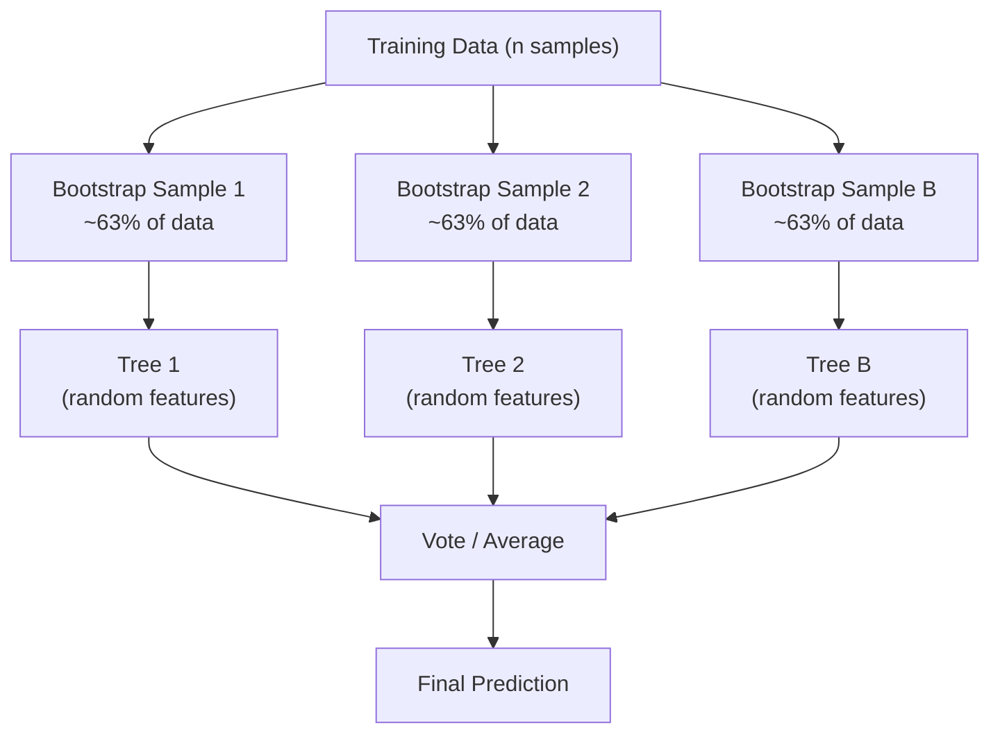

# The Complete Machine Learning Algorithms Guide
## A Production-Quality Reference for Engineers, Data Scientists, and ML Practitioners

---

> **"Understanding algorithms deeply isn't about memorizing formulas — it's about knowing *when* to reach for which tool, and *why* it works."**

---

## What You Will Learn

This document is a comprehensive, production-quality reference covering the full spectrum of classical machine learning algorithms. For every algorithm, you'll get:
- Intuitive explanations with analogies
- Mathematical grounding without unnecessary abstraction
- Step-by-step mechanics
- Clean, modular Python implementations
- Real-world deployment guidance

## Who This Is For

- **Junior ML Engineers** who want to go beyond tutorial-level understanding
- **Senior Engineers** who need a rapid revision guide before interviews or projects
- **Data Scientists** building production pipelines who need to justify algorithm choices
- **ML Architects** designing end-to-end systems

---

## Table of Contents

- [1. Linear Models](#1-linear-models)
  - [1.1 Linear Regression](#11-linear-regression)
  - [1.2 Multiple Linear Regression](#12-multiple-linear-regression)
  - [1.3 Polynomial Regression](#13-polynomial-regression)
  - [1.4 Ridge Regression (L2)](#14-ridge-regression-l2)
  - [1.5 Lasso Regression (L1)](#15-lasso-regression-l1)
  - [1.6 Elastic Net](#16-elastic-net)
- [2. Classification Algorithms](#2-classification-algorithms)
  - [2.1 Logistic Regression](#21-logistic-regression)
  - [2.2 k-Nearest Neighbors (kNN)](#22-k-nearest-neighbors-knn)
  - [2.3 Naive Bayes](#23-naive-bayes)
- [3. Tree-Based Models](#3-tree-based-models)
  - [3.1 Decision Tree (Classification)](#31-decision-tree-classification)
  - [3.2 Decision Tree (Regression)](#32-decision-tree-regression)
- [4. Ensemble Algorithms](#4-ensemble-algorithms)
  - [4.1 Random Forest](#41-random-forest)
  - [4.2 Extra Trees](#42-extra-trees-extremely-randomized-trees)
- [5. Boosting Algorithms](#5-boosting-algorithms)
  - [5.1 AdaBoost](#51-adaboost)
  - [5.2 Gradient Boosting](#52-gradient-boosting)
  - [5.3 XGBoost](#53-xgboost)
  - [5.4 LightGBM](#54-lightgbm)
  - [5.5 CatBoost](#55-catboost)
- [6. Support Vector Machines](#6-support-vector-machines)
  - [6.1 Support Vector Classifier (SVC)](#61-support-vector-classifier-svc)
  - [6.2 Support Vector Regressor (SVR)](#62-support-vector-regressor-svr)
- [7. Unsupervised Learning](#7-unsupervised-learning)
  - [7.1 K-Means Clustering](#71-k-means-clustering)
  - [7.2 Hierarchical Clustering](#72-hierarchical-clustering)
  - [7.3 DBSCAN](#73-dbscan)
- [8. Dimensionality Reduction](#8-dimensionality-reduction)
  - [8.1 Principal Component Analysis (PCA)](#81-principal-component-analysis-pca)
  - [8.2 Kernel PCA](#82-kernel-pca)
  - [8.3 Linear Discriminant Analysis (LDA)](#83-linear-discriminant-analysis-lda)
  - [8.4 t-SNE](#84-t-sne)
- [9. Anomaly Detection](#9-anomaly-detection)
  - [9.1 Isolation Forest](#91-isolation-forest)
  - [9.2 One-Class SVM](#92-one-class-svm)
  - [9.3 Local Outlier Factor (LOF)](#93-local-outlier-factor-lof)
- [10. Probabilistic Models](#10-probabilistic-models)
  - [10.1 Gaussian Mixture Models (GMM)](#101-gaussian-mixture-models-gmm)
- [11. Recommendation & Ranking](#11-recommendation--ranking)
  - [11.1 Matrix Factorization](#111-matrix-factorization)
  - [11.2 Singular Value Decomposition (SVD)](#112-singular-value-decomposition-svd)
- [12. Cross-Topic Relationships](#12-cross-topic-relationships)
- [13. End-to-End Real-World Projects](#13-end-to-end-real-world-projects)
  - [Project 1: Credit Card Fraud Detection](#project-1-credit-card-fraud-detection)
  - [Project 2: Customer Churn Prediction](#project-2-customer-churn-prediction)
- [14. Algorithm Comparison Tables](#14-algorithm-comparison-tables)
- [15. Common Mistakes & Pitfalls](#15-common-mistakes--pitfalls)
- [16. Interview Preparation](#16-interview-preparation)
- [17. Resources](#17-resources)

---

# 1. Linear Models

Linear models are the foundation of supervised machine learning. They are fast, interpretable, and often surprisingly effective — especially when your features have linear relationships with the target.

---

## 1.1 Linear Regression

### a. Intuition

Imagine you're trying to predict the price of a house based on its size. You draw a straight line through a scatter plot of house sizes vs. prices that "best fits" the data. That's linear regression.

The word "linear" refers to linearity in the **parameters** (coefficients), not necessarily in the features themselves.

### b. Mathematical Insight

The model:

```
ŷ = β₀ + β₁x₁
```

Where `β₀` is the intercept and `β₁` is the slope.

The goal is to minimize the **Mean Squared Error (MSE)**:

```
MSE = (1/n) Σ(yᵢ - ŷᵢ)²
```

The closed-form solution (Ordinary Least Squares):

```
β = (XᵀX)⁻¹ Xᵀy
```

This gives the exact optimal solution when the inverse exists.

### c. How It Works (Step-by-Step)

1. Initialize coefficients β₀ and β₁
2. Compute predictions: `ŷ = Xβ`
3. Compute residuals: `e = y - ŷ`
4. Minimize SSE using OLS formula or gradient descent
5. Return final coefficients

### d. Visual Representation

```
Price (y)
  |          * ← actual point
  |       /
  |    / ← regression line (ŷ = β₀ + β₁x)
  | /  ↑ residual (y - ŷ)
  |/   *
  +------------- Size (x)
```

### e. Python Implementation

```python
import numpy as np
import pandas as pd
from sklearn.linear_model import LinearRegression
from sklearn.model_selection import train_test_split
from sklearn.metrics import mean_squared_error, r2_score
import matplotlib.pyplot as plt

# --- Generate synthetic data ---
np.random.seed(42)
n = 200
X = 2 * np.random.rand(n, 1)
y = 4 + 3 * X.squeeze() + np.random.randn(n)

# --- Train/test split ---
X_train, X_test, y_train, y_test = train_test_split(X, y, test_size=0.2, random_state=42)

# --- Train model ---
model = LinearRegression()
model.fit(X_train, y_train)

# --- Evaluate ---
y_pred = model.predict(X_test)
mse = mean_squared_error(y_test, y_pred)
r2 = r2_score(y_test, y_pred)

print(f"Intercept: {model.intercept_:.4f}")
print(f"Coefficient: {model.coef_[0]:.4f}")
print(f"MSE: {mse:.4f}")
print(f"R² Score: {r2:.4f}")

# --- Manual OLS implementation for learning ---
def ols_fit(X, y):
    """Closed-form OLS solution: β = (XᵀX)⁻¹ Xᵀy"""
    X_b = np.c_[np.ones((len(X), 1)), X]  # Add bias column
    beta = np.linalg.pinv(X_b.T @ X_b) @ X_b.T @ y
    return beta

beta = ols_fit(X_train, y_train)
print(f"\nManual OLS → β₀: {beta[0]:.4f}, β₁: {beta[1]:.4f}")
```

### f. When to Use / Avoid

| Situation | Use? | Reason |
|-----------|------|--------|
| Linear relationship between X and y | ✅ Yes | Direct fit |
| Small dataset, high interpretability needed | ✅ Yes | Fast, explainable |
| Many features with multicollinearity | ❌ Avoid | Unstable coefficients |
| Non-linear target distribution | ❌ Avoid | Will underfit |

### g. Key Hyperparameters

`LinearRegression` from sklearn has `fit_intercept` (usually True) and `normalize` (deprecated). Tune via `Ridge`/`Lasso` variants instead.

---

## 1.2 Multiple Linear Regression

### a. Intuition

Same as simple linear regression, but now you have multiple features. Instead of a line, you're fitting a **hyperplane** through multi-dimensional space.

Think of predicting house price using size *and* number of bedrooms *and* age — each feature gets its own coefficient (slope).

### b. Mathematical Insight

```
ŷ = β₀ + β₁x₁ + β₂x₂ + ... + βₙxₙ  =  Xβ
```

In matrix form:
```
ŷ = Xβ,   β = (XᵀX)⁻¹ Xᵀy
```

**Key assumption**: Features are not perfectly collinear (multicollinearity inflates variance).

### c. How It Works (Step-by-Step)

1. Collect feature matrix X (n × p) where n = samples, p = features
2. Add a column of ones for the intercept term
3. Solve OLS: `β = (XᵀX)⁻¹ Xᵀy`
4. Predict: `ŷ = Xβ`
5. Diagnose with residual plots, VIF for multicollinearity

### d. Visual Representation

```
          β₁ × x₁
         /
ŷ =  β₀  + β₂ × x₂   ← sum of weighted feature contributions
         \
          β₃ × x₃
```

### e. Python Implementation

```python
import numpy as np
import pandas as pd
from sklearn.linear_model import LinearRegression
from sklearn.model_selection import train_test_split
from sklearn.preprocessing import StandardScaler
from sklearn.metrics import r2_score, mean_absolute_error

# --- Realistic housing dataset simulation ---
np.random.seed(42)
n = 500
data = pd.DataFrame({
    'size_sqft': np.random.normal(1500, 400, n),
    'bedrooms': np.random.randint(1, 6, n),
    'age_years': np.random.randint(0, 50, n),
    'distance_city_km': np.random.uniform(1, 30, n),
})

# Generate target with known coefficients + noise
data['price'] = (
    150 * data['size_sqft'] +
    10000 * data['bedrooms'] -
    500 * data['age_years'] -
    2000 * data['distance_city_km'] +
    50000 +
    np.random.normal(0, 15000, n)
)

# --- Prepare data ---
X = data.drop('price', axis=1)
y = data['price']

X_train, X_test, y_train, y_test = train_test_split(X, y, test_size=0.2, random_state=42)

# --- Scale features (good practice even for linear models) ---
scaler = StandardScaler()
X_train_scaled = scaler.fit_transform(X_train)
X_test_scaled = scaler.transform(X_test)

# --- Train ---
model = LinearRegression()
model.fit(X_train_scaled, y_train)

# --- Evaluate ---
y_pred = model.predict(X_test_scaled)
print("Feature Coefficients:")
for feat, coef in zip(X.columns, model.coef_):
    print(f"  {feat}: {coef:,.2f}")
print(f"\nR²: {r2_score(y_test, y_pred):.4f}")
print(f"MAE: {mean_absolute_error(y_test, y_pred):,.2f}")

# --- VIF Check for multicollinearity ---
from statsmodels.stats.outliers_influence import variance_inflation_factor

vif_data = pd.DataFrame()
vif_data['feature'] = X.columns
vif_data['VIF'] = [variance_inflation_factor(X_train.values, i) for i in range(X_train.shape[1])]
print("\nVariance Inflation Factor (VIF):")
print(vif_data)
# VIF > 10 → serious multicollinearity problem
```

### f. When to Use / Avoid

- **Use**: When you have multiple numeric predictors with a roughly linear relationship to the target
- **Avoid**: When features are highly correlated (use Ridge/Lasso instead), or when you have far more features than samples (p >> n)

### g. Key Hyperparameters

No real hyperparameters in plain OLS. The choice is in **preprocessing**: scaling, polynomial feature expansion, and regularization (which leads us to Ridge/Lasso).

---

## 1.3 Polynomial Regression

### a. Intuition

Linear regression fits a straight line. But what if your data curves? Polynomial regression lets you fit curves by transforming your input features into higher-degree terms.

A degree-2 polynomial turns `x` into `[x, x², 1]` — still a linear model, just in a transformed feature space.

### b. Mathematical Insight

```
ŷ = β₀ + β₁x + β₂x² + β₃x³ + ... + βₙxⁿ
```

This is still linear in the **parameters** β — just non-linear in x.

**Bias-Variance Tradeoff**:
- Low degree → underfitting (high bias)
- High degree → overfitting (high variance)

### c. How It Works (Step-by-Step)

1. Choose polynomial degree `d`
2. Transform features using `PolynomialFeatures(degree=d)` — creates all combinations up to degree d
3. Fit `LinearRegression` on the expanded features
4. Predict and evaluate
5. Use cross-validation to select the best degree

### d. Visual Representation

```
y
|    *           Degree 1: ——  (underfit)
|  * * *         Degree 2: ∪∩  (good fit)
|* *   * *       Degree 9: ~~~~(overfit)
|
+-------------- x
```

### e. Python Implementation

```python
import numpy as np
import matplotlib.pyplot as plt
from sklearn.preprocessing import PolynomialFeatures
from sklearn.linear_model import LinearRegression
from sklearn.pipeline import Pipeline
from sklearn.model_selection import cross_val_score
from sklearn.metrics import mean_squared_error

# --- Generate non-linear data ---
np.random.seed(42)
X = np.sort(5 * np.random.rand(80, 1), axis=0)
y = np.sin(X).ravel() + np.random.randn(80) * 0.1

def make_poly_pipeline(degree):
    """Create a clean sklearn pipeline for polynomial regression."""
    return Pipeline([
        ('poly', PolynomialFeatures(degree=degree, include_bias=False)),
        ('linear', LinearRegression())
    ])

# --- Compare degrees ---
degrees = [1, 2, 4, 8, 15]
cv_scores = {}

for d in degrees:
    pipe = make_poly_pipeline(d)
    # Negative MSE (sklearn convention for scoring)
    scores = cross_val_score(pipe, X, y, cv=5, scoring='neg_mean_squared_error')
    cv_scores[d] = -scores.mean()
    print(f"Degree {d:2d} → CV MSE: {cv_scores[d]:.4f}")

# --- Fit best model ---
best_degree = min(cv_scores, key=cv_scores.get)
print(f"\nBest degree: {best_degree}")
best_model = make_poly_pipeline(best_degree)
best_model.fit(X, y)
```

### f. When to Use / Avoid

- **Use**: When scatter plot reveals a curved relationship; as a quick non-linear baseline
- **Avoid**: High-dimensional data (feature explosion), degree > 5 (almost always overfits), when tree-based models are available

### g. Key Hyperparameters

| Parameter | Effect |
|-----------|--------|
| `degree` | Controls model complexity; select via cross-validation |
| `include_bias` | Adds intercept column; usually leave True |
| `interaction_only` | Only cross-terms, no x², x³ etc. |

---

## 1.4 Ridge Regression (L2)

### a. Intuition

Linear regression finds coefficients that minimize prediction error. Ridge regression adds a **penalty** for having large coefficients.

Think of it like this: you're fitting a line, but you're also penalized for every unit of "boldness" in your slopes. This forces the model to distribute weight across features rather than concentrating it, which helps when features are correlated.

### b. Mathematical Insight

Minimize:
```
Loss = Σ(yᵢ - ŷᵢ)² + λ Σβⱼ²
         ↑ MSE            ↑ L2 Penalty
```

Closed-form solution:
```
β = (XᵀX + λI)⁻¹ Xᵀy
```

The λI term makes the matrix invertible even with multicollinearity — this is Ridge's core strength.

- `λ = 0`: Plain linear regression
- `λ → ∞`: Coefficients shrink toward zero (but never exactly zero)

### c. How It Works (Step-by-Step)

1. Standardize features (critical — Ridge penalizes scale)
2. Add L2 penalty λΣβⱼ² to the loss
3. Solve the modified normal equations
4. Cross-validate to find optimal λ (called `alpha` in sklearn)
5. Refit on full training data

### d. Visual Representation

```
Constraint space:

Lasso (L1):          Ridge (L2):
    ◇                   ○
β₂ /↑\              β₂ /○\
  / ↑ \               /   \
 /  ↑  \             / ← contours of MSE shrink here
----+---- β₁        ----+---- β₁

L1 corners → sparse    L2 circle → never exact zero
```

### e. Python Implementation

```python
import numpy as np
import pandas as pd
from sklearn.linear_model import Ridge, RidgeCV
from sklearn.preprocessing import StandardScaler
from sklearn.model_selection import train_test_split
from sklearn.metrics import r2_score

np.random.seed(42)
n, p = 300, 20
X = np.random.randn(n, p)
# Only first 5 features are truly relevant
true_coef = np.array([3, -2, 1.5, 0.5, -1] + [0] * 15)
y = X @ true_coef + np.random.randn(n) * 0.5

X_train, X_test, y_train, y_test = train_test_split(X, y, test_size=0.2, random_state=42)

# --- Standardize (mandatory before regularization) ---
scaler = StandardScaler()
X_train_s = scaler.fit_transform(X_train)
X_test_s = scaler.transform(X_test)

# --- RidgeCV automatically finds best alpha via cross-validation ---
alphas = np.logspace(-3, 4, 100)  # Search over [0.001, 10000]
ridge_cv = RidgeCV(alphas=alphas, cv=5)
ridge_cv.fit(X_train_s, y_train)

print(f"Best alpha: {ridge_cv.alpha_:.4f}")
print(f"R² on test: {r2_score(y_test, ridge_cv.predict(X_test_s)):.4f}")

# --- Compare with plain OLS ---
from sklearn.linear_model import LinearRegression
ols = LinearRegression().fit(X_train_s, y_train)
print(f"OLS R² on test: {r2_score(y_test, ols.predict(X_test_s)):.4f}")

# --- Visualize coefficient shrinkage ---
import matplotlib.pyplot as plt
alphas_plot = np.logspace(-3, 4, 50)
coefs = [Ridge(alpha=a).fit(X_train_s, y_train).coef_ for a in alphas_plot]

plt.figure(figsize=(10, 5))
plt.semilogx(alphas_plot, coefs)
plt.xlabel('Alpha (regularization strength)')
plt.ylabel('Coefficient value')
plt.title('Ridge: Coefficient Paths')
plt.axvline(ridge_cv.alpha_, color='red', linestyle='--', label=f'Best α={ridge_cv.alpha_:.3f}')
plt.legend()
plt.tight_layout()
```

### f. When to Use / Avoid

- **Use**: Multicollinearity present; want to keep all features; p is close to n
- **Avoid**: When you suspect many features are irrelevant (use Lasso); when you need a sparse model

### g. Key Hyperparameters

| Parameter | Role |
|-----------|------|
| `alpha` | Regularization strength (λ). Higher → more shrinkage. Use CV to tune. |
| `fit_intercept` | Usually True; intercept is NOT penalized |
| `solver` | `auto`, `svd`, `lsqr` — `svd` is robust for small datasets |

---

## 1.5 Lasso Regression (L1)

### a. Intuition

Lasso is Ridge's cousin with a key difference: instead of squaring the coefficients in the penalty, it uses their **absolute values**. This geometric difference has a profound effect — Lasso can drive coefficients to **exactly zero**, performing automatic feature selection.

If Ridge says "make everyone shorter," Lasso says "eliminate some people entirely."

### b. Mathematical Insight

Minimize:
```
Loss = Σ(yᵢ - ŷᵢ)² + λ Σ|βⱼ|
         ↑ MSE            ↑ L1 Penalty
```

No closed-form solution — requires iterative optimization (coordinate descent).

The L1 penalty creates sparsity because the absolute value function has corners at zero — the optimum frequently falls exactly at zero.

### c. How It Works (Step-by-Step)

1. Standardize features (critical)
2. Initialize coefficients to zero
3. Cycle through each feature, updating its coefficient via coordinate descent
4. Apply soft-thresholding: if coefficient magnitude < threshold, set to 0
5. Repeat until convergence
6. Cross-validate `alpha`

### d. Visual Representation

```
Lasso drives some coefs to ZERO → sparse model

Alpha = 0.001: [3.02, -1.98, 1.51, 0.49, -1.00, 0.01, -0.02, ...]
Alpha = 0.1:   [2.81, -1.74, 1.20, 0.20, -0.70, 0.00,  0.00, ...]
Alpha = 1.0:   [1.50, -0.80, 0.10, 0.00,  0.00, 0.00,  0.00, ...]
Alpha = 10.0:  [0.00,  0.00, 0.00, 0.00,  0.00, 0.00,  0.00, ...]
               ↑ As alpha increases → more zeros → feature selection
```

### e. Python Implementation

```python
import numpy as np
from sklearn.linear_model import Lasso, LassoCV
from sklearn.preprocessing import StandardScaler
from sklearn.model_selection import train_test_split
from sklearn.metrics import r2_score

np.random.seed(42)
n, p = 300, 50
X = np.random.randn(n, p)
# Only 5 of 50 features are relevant
true_coef = np.zeros(p)
true_coef[:5] = [3, -2, 1.5, 0.5, -1]
y = X @ true_coef + np.random.randn(n) * 0.5

X_train, X_test, y_train, y_test = train_test_split(X, y, test_size=0.2, random_state=42)

scaler = StandardScaler()
X_train_s = scaler.fit_transform(X_train)
X_test_s = scaler.transform(X_test)

# --- LassoCV finds optimal alpha via cross-validation ---
lasso_cv = LassoCV(cv=5, random_state=42, max_iter=10000)
lasso_cv.fit(X_train_s, y_train)

print(f"Best alpha: {lasso_cv.alpha_:.6f}")
print(f"R² on test: {r2_score(y_test, lasso_cv.predict(X_test_s)):.4f}")

# --- Show which features survived ---
coef = lasso_cv.coef_
nonzero = np.sum(coef != 0)
print(f"Features selected: {nonzero}/{p}")
print(f"Non-zero coefficients at indices: {np.where(coef != 0)[0].tolist()}")

# --- Compare true vs. estimated coefficients ---
print("\nTrue vs. Lasso coefficients (first 10):")
for i in range(10):
    print(f"  Feature {i}: true={true_coef[i]:.2f}, lasso={coef[i]:.2f}")
```

### f. When to Use / Avoid

- **Use**: High-dimensional data with suspected sparse signal; when interpretability and feature selection matter; text/NLP features
- **Avoid**: When all features are expected to contribute (Ridge is better); when features are highly correlated (Lasso picks one arbitrarily)

### g. Key Hyperparameters

| Parameter | Role |
|-----------|------|
| `alpha` | Regularization strength. 0 → OLS, large → all zeros |
| `max_iter` | Increase for high-dimensional data (default 1000 often too low) |
| `tol` | Convergence tolerance |
| `selection` | `cyclic` or `random` coordinate descent |

---

## 1.6 Elastic Net

### a. Intuition

Elastic Net is the hybrid between Ridge and Lasso. When you're not sure which regularization to use — or when features are correlated (Lasso would randomly pick one; Ridge would keep both) — Elastic Net provides a principled middle ground.

It's like asking two consultants (Ridge and Lasso) to collaborate: you get sparsity *and* stability.

### b. Mathematical Insight

Minimize:
```
Loss = Σ(yᵢ - ŷᵢ)² + α·ρ·Σ|βⱼ| + α·(1-ρ)/2·Σβⱼ²
                        ↑ L1 part       ↑ L2 part
```

Where:
- `α` controls total regularization strength
- `l1_ratio` (ρ): 0 → pure Ridge, 1 → pure Lasso, 0.5 → balanced

### c. How It Works (Step-by-Step)

1. Standardize features
2. Set `alpha` (total penalty) and `l1_ratio` (balance between L1/L2)
3. Solve via coordinate descent (same as Lasso, with L2 damping)
4. Cross-validate both hyperparameters jointly

### e. Python Implementation

```python
import numpy as np
from sklearn.linear_model import ElasticNetCV
from sklearn.preprocessing import StandardScaler
from sklearn.model_selection import train_test_split
from sklearn.metrics import r2_score

np.random.seed(42)
n, p = 300, 30
X = np.random.randn(n, p)
true_coef = np.zeros(p)
true_coef[:8] = np.random.randn(8) * 2
y = X @ true_coef + np.random.randn(n)

X_train, X_test, y_train, y_test = train_test_split(X, y, test_size=0.2, random_state=42)

scaler = StandardScaler()
X_train_s = scaler.fit_transform(X_train)
X_test_s = scaler.transform(X_test)

# --- ElasticNetCV cross-validates both alpha and l1_ratio ---
enet_cv = ElasticNetCV(
    l1_ratio=[0.1, 0.5, 0.7, 0.9, 0.95, 1.0],  # Search over L1/L2 balance
    cv=5,
    random_state=42,
    max_iter=10000
)
enet_cv.fit(X_train_s, y_train)

print(f"Best alpha: {enet_cv.alpha_:.6f}")
print(f"Best l1_ratio: {enet_cv.l1_ratio_:.2f}")
print(f"R² on test: {r2_score(y_test, enet_cv.predict(X_test_s)):.4f}")
print(f"Non-zero features: {np.sum(enet_cv.coef_ != 0)}/{p}")
```

### f. When to Use / Avoid

- **Use**: Correlated features where you still want some sparsity; when you're unsure between Lasso and Ridge; genomics, financial modeling
- **Avoid**: When you're certain of the right regularization type; adds an extra hyperparameter to tune

### g. Key Hyperparameters

| Parameter | Role |
|-----------|------|
| `alpha` | Total regularization strength |
| `l1_ratio` | Mix between L1 (1.0) and L2 (0.0) |

---

# 2. Classification Algorithms

---

## 2.1 Logistic Regression

### a. Intuition

Despite the name, Logistic Regression is a **classification** algorithm. It answers: "What's the probability that this sample belongs to class 1?"

It takes the output of linear regression and passes it through the **sigmoid function**, which squishes any number into [0, 1] — a probability.

Think of a spam filter: a long email with "FREE MONEY" has a high linear score → sigmoid turns it into probability 0.97 → classified as spam.

### b. Mathematical Insight

```
z = β₀ + β₁x₁ + ... + βₙxₙ        (linear combination)
P(y=1|x) = σ(z) = 1 / (1 + e⁻ᶻ)   (sigmoid)
```

Loss function — **Binary Cross-Entropy** (Log Loss):
```
L = -1/n Σ [yᵢ log(ŷᵢ) + (1-yᵢ) log(1-ŷᵢ)]
```

The decision boundary is where `P = 0.5`, i.e., `z = 0`.

### c. How It Works (Step-by-Step)

1. Compute linear combination z = Xβ
2. Apply sigmoid: P = 1/(1+e⁻ᶻ)
3. Compute log loss
4. Update β via gradient descent: `β ← β - η · ∇L`
5. At inference: predict 1 if P > threshold (default 0.5)

### d. Visual Representation

```
Sigmoid curve:

P(y=1)
1.0 |          _________
    |        /
0.5 |------/------------ ← decision boundary
    |    /
0.0 |___/
    +--+--+--+--+--+--> z (linear score)
      -4 -2  0  2  4
```

### e. Python Implementation

```python
import numpy as np
import pandas as pd
from sklearn.linear_model import LogisticRegression
from sklearn.model_selection import train_test_split, cross_val_score
from sklearn.preprocessing import StandardScaler
from sklearn.metrics import (classification_report, confusion_matrix, 
                              roc_auc_score, RocCurveDisplay)
from sklearn.datasets import make_classification

# --- Generate binary classification data ---
X, y = make_classification(
    n_samples=1000, n_features=10, n_informative=6,
    n_redundant=2, random_state=42
)

X_train, X_test, y_train, y_test = train_test_split(X, y, test_size=0.2, 
                                                      random_state=42, stratify=y)

scaler = StandardScaler()
X_train_s = scaler.fit_transform(X_train)
X_test_s = scaler.transform(X_test)

# --- Train logistic regression ---
# C = 1/alpha (inverse of regularization strength)
model = LogisticRegression(C=1.0, max_iter=1000, random_state=42)
model.fit(X_train_s, y_train)

# --- Evaluate ---
y_pred = model.predict(X_test_s)
y_prob = model.predict_proba(X_test_s)[:, 1]  # Probability of class 1

print(classification_report(y_test, y_pred))
print(f"ROC-AUC: {roc_auc_score(y_test, y_prob):.4f}")
print(f"\nConfusion Matrix:\n{confusion_matrix(y_test, y_pred)}")

# --- Feature importance via coefficients ---
coef_df = pd.DataFrame({
    'feature': [f'f{i}' for i in range(X.shape[1])],
    'coefficient': model.coef_[0]
}).sort_values('coefficient', key=abs, ascending=False)
print("\nTop features by coefficient magnitude:")
print(coef_df.head())

# --- Multi-class version ---
from sklearn.datasets import load_iris
iris = load_iris()
multi_model = LogisticRegression(multi_class='multinomial', solver='lbfgs', 
                                  C=1.0, max_iter=1000)
cv_scores = cross_val_score(multi_model, iris.data, iris.target, cv=5)
print(f"\nIris multi-class CV accuracy: {cv_scores.mean():.4f} ± {cv_scores.std():.4f}")
```

### f. When to Use / Avoid

- **Use**: Binary or multi-class classification; when you need calibrated probabilities; baseline model; when interpretability is required
- **Avoid**: Complex non-linear boundaries (use tree-based models); very high-dimensional sparse data (use linear SVM or SGD classifier)

### g. Key Hyperparameters

| Parameter | Role |
|-----------|------|
| `C` | Inverse regularization (higher C → less regularization). Default = 1. |
| `penalty` | `l1`, `l2`, `elasticnet`, `none` |
| `solver` | `lbfgs` (default), `saga` (for L1/large data), `newton-cg` |
| `max_iter` | Increase if convergence warning appears |
| `class_weight` | `'balanced'` for imbalanced data |

---

## 2.2 k-Nearest Neighbors (kNN)

### a. Intuition

kNN is beautifully simple: to classify a new point, look at its `k` closest neighbors in the training data and take a majority vote.

It's like asking: "Who are the people most similar to me? What are they likely to do?" If 7 out of 10 nearest neighbors bought a product, you probably will too.

**No training phase** — kNN memorizes the training set and computes distances at prediction time.

### b. Mathematical Insight

Distance metrics (the key choice):
```
Euclidean: d(a,b) = √Σ(aᵢ - bᵢ)²       ← default, good for continuous
Manhattan: d(a,b) = Σ|aᵢ - bᵢ|          ← robust to outliers
Minkowski: d(a,b) = (Σ|aᵢ - bᵢ|ᵖ)^(1/p) ← generalization
```

Prediction:
```
ŷ = mode({y for x in k-nearest-neighbors(x_query)})
```

### c. How It Works (Step-by-Step)

1. Store all training samples (no explicit training)
2. For a query point x_q:
   - Compute distance from x_q to every training point
   - Sort by distance, take k smallest
   - Return majority class (classification) or average (regression)

### d. Visual Representation

```
k=3 example:

  B  B              Query: ★
  B  ★  A    Nearest 3: B, B, A
       A  A   Prediction: B (2 votes)

Legend: A=class A, B=class B, ★=query point
```

### e. Python Implementation

```python
import numpy as np
from sklearn.neighbors import KNeighborsClassifier
from sklearn.model_selection import train_test_split, GridSearchCV
from sklearn.preprocessing import StandardScaler
from sklearn.metrics import classification_report
from sklearn.datasets import make_classification

X, y = make_classification(n_samples=1000, n_features=8, n_informative=5, random_state=42)
X_train, X_test, y_train, y_test = train_test_split(X, y, test_size=0.2, random_state=42)

# --- Scale features (critical for distance-based methods!) ---
scaler = StandardScaler()
X_train_s = scaler.fit_transform(X_train)
X_test_s = scaler.transform(X_test)

# --- Hyperparameter tuning ---
param_grid = {
    'n_neighbors': [3, 5, 7, 11, 15, 21],
    'weights': ['uniform', 'distance'],  # 'distance' → closer neighbors matter more
    'metric': ['euclidean', 'manhattan']
}

knn = KNeighborsClassifier()
grid_search = GridSearchCV(knn, param_grid, cv=5, scoring='accuracy', n_jobs=-1)
grid_search.fit(X_train_s, y_train)

print(f"Best params: {grid_search.best_params_}")
print(f"Best CV accuracy: {grid_search.best_score_:.4f}")

best_knn = grid_search.best_estimator_
y_pred = best_knn.predict(X_test_s)
print(f"\n{classification_report(y_test, y_pred)}")

# --- Elbow method for k selection ---
k_values = range(1, 31)
train_accs, test_accs = [], []

for k in k_values:
    knn_k = KNeighborsClassifier(n_neighbors=k).fit(X_train_s, y_train)
    train_accs.append(knn_k.score(X_train_s, y_train))
    test_accs.append(knn_k.score(X_test_s, y_test))

# Best k is usually where test accuracy peaks before declining
best_k = k_values[np.argmax(test_accs)]
print(f"\nBest k by test accuracy: {best_k}")
```

### f. When to Use / Avoid

- **Use**: Small-to-medium datasets; when decision boundary is complex; recommendation systems; anomaly detection
- **Avoid**: Large datasets (O(n) prediction time); high-dimensional data (curse of dimensionality); noisy datasets (noise affects neighbors)

### g. Key Hyperparameters

| Parameter | Role |
|-----------|------|
| `n_neighbors` | k — most important param. Small k → complex boundary, large k → smooth |
| `weights` | `uniform` or `distance` (weight by inverse distance) |
| `metric` | Distance metric; use Euclidean for continuous, Manhattan for robust |
| `algorithm` | `ball_tree`, `kd_tree` for speed in high dimensions |

---

## 2.3 Naive Bayes

### a. Intuition

Naive Bayes applies Bayes' Theorem with a "naive" assumption: all features are **conditionally independent** given the class label. This is almost never true in practice, yet Naive Bayes still works surprisingly well — especially for text classification.

Think of spam filtering: given the word "FREE" appears, what's the probability it's spam? Naive Bayes combines the evidence from all words independently (naively) and makes a fast, often accurate prediction.

### b. Mathematical Insight

Bayes' Theorem:
```
P(class | features) = P(features | class) × P(class) / P(features)
                      ↑ likelihood         ↑ prior
```

With the naive independence assumption:
```
P(x₁,...,xₙ | class) = ∏ P(xᵢ | class)
```

Final prediction:
```
ŷ = argmax_c [ log P(c) + Σ log P(xᵢ | c) ]
```

(log-space for numerical stability)

### c. Variants

| Variant | Assumption | Best For |
|---------|-----------|---------|
| **Gaussian NB** | Features follow Gaussian distribution | Continuous features |
| **Multinomial NB** | Features are counts/frequencies | Text (word counts), NLP |
| **Bernoulli NB** | Features are binary (0/1) | Binary features, short texts |

### e. Python Implementation

```python
import numpy as np
import pandas as pd
from sklearn.naive_bayes import GaussianNB, MultinomialNB, BernoulliNB
from sklearn.model_selection import train_test_split, cross_val_score
from sklearn.preprocessing import StandardScaler
from sklearn.metrics import accuracy_score, classification_report
from sklearn.datasets import load_iris, fetch_20newsgroups
from sklearn.feature_extraction.text import CountVectorizer, TfidfVectorizer

# ==============================================
# 1. Gaussian Naive Bayes — Continuous Features
# ==============================================
iris = load_iris()
X_train, X_test, y_train, y_test = train_test_split(
    iris.data, iris.target, test_size=0.2, random_state=42
)

gnb = GaussianNB()
gnb.fit(X_train, y_train)
print("=== Gaussian NB (Iris) ===")
print(f"Accuracy: {accuracy_score(y_test, gnb.predict(X_test)):.4f}")
print(f"Class priors: {gnb.class_prior_.round(3)}")

# ==============================================
# 2. Multinomial NB — Text Classification
# ==============================================
# Simulate text dataset
texts = [
    "buy cheap medication online now",   # spam
    "meeting at 3pm tomorrow project",   # ham
    "free money prize winner click",     # spam
    "quarterly report attached please",  # ham
    "win lottery free prize money",      # spam
    "schedule review board meeting",     # ham
]
labels = [1, 0, 1, 0, 1, 0]  # 1=spam, 0=ham

# Convert text to word count matrix
vectorizer = CountVectorizer()
X_counts = vectorizer.fit_transform(texts)

mnb = MultinomialNB(alpha=1.0)  # alpha = Laplace smoothing
mnb.fit(X_counts, labels)

# Predict on new text
new_texts = ["free prize click here", "project meeting tomorrow"]
new_counts = vectorizer.transform(new_texts)
predictions = mnb.predict(new_counts)
probabilities = mnb.predict_proba(new_counts)

print("\n=== Multinomial NB (Text) ===")
for text, pred, prob in zip(new_texts, predictions, probabilities):
    label = "SPAM" if pred == 1 else "HAM"
    print(f"'{text}' → {label} (spam prob: {prob[1]:.3f})")

# ==============================================
# 3. Bernoulli NB — Binary Feature Matrix
# ==============================================
# Binary: word present (1) or absent (0)
bvectorizer = CountVectorizer(binary=True)
X_binary = bvectorizer.fit_transform(texts)

bnb = BernoulliNB(alpha=1.0)
bnb.fit(X_binary, labels)

new_binary = bvectorizer.transform(new_texts)
bnb_preds = bnb.predict(new_binary)
print("\n=== Bernoulli NB (Binary) ===")
for text, pred in zip(new_texts, bnb_preds):
    print(f"'{text}' → {'SPAM' if pred == 1 else 'HAM'}")
```

### f. When to Use / Avoid

- **Use**: Text classification (spam, sentiment, document categorization); real-time prediction (extremely fast); very small datasets; when features are genuinely independent
- **Avoid**: When feature independence is grossly violated (but try it anyway as a baseline); continuous features with strongly non-Gaussian distributions (without transformation)

### g. Key Hyperparameters

| Parameter | Role |
|-----------|------|
| `alpha` (MultinomialNB, BernoulliNB) | Laplace smoothing; prevents zero probabilities for unseen features |
| `var_smoothing` (GaussianNB) | Variance smoothing for stability |
| `priors` | Class prior probabilities; defaults to class frequency in data |

---

# 3. Tree-Based Models

---

## 3.1 Decision Tree (Classification)

### a. Intuition

A decision tree makes predictions by asking a series of yes/no questions about the features, navigating a tree of decisions until reaching a leaf node that gives the prediction.

It's like a flowchart: "Is income > $50k? If yes → is credit score > 700? If yes → approve loan."

Each split divides the data to maximize **purity** — we want leaves where most samples belong to one class.

### b. Mathematical Insight

**Gini Impurity** (default in sklearn):
```
Gini = 1 - Σ pᵢ²
```
Where pᵢ = proportion of class i in node. Ranges 0 (pure) to 0.5 (maximally impure for binary).

**Information Gain** (using Entropy):
```
Entropy H = -Σ pᵢ log₂(pᵢ)
Gain = H(parent) - Σ (nₖ/n) × H(childₖ)
```

At each node, the algorithm finds the feature and threshold that maximizes the gain.

### c. How It Works (Step-by-Step)

1. Start with the full training set at the root
2. For each feature, try all possible thresholds
3. Compute impurity gain for each split
4. Select the feature + threshold with highest gain
5. Split data into two child nodes
6. Recurse on each child until stopping criterion (max depth, min samples, etc.)
7. Assign the majority class to each leaf

### d. Visual Representation

```
                 [Is age > 30?]
                /               \
          YES /                  \ NO
             /                    \
    [Income > 60k?]          [Has degree?]
      /         \               /         \
   YES            NO          YES           NO
   /               \          /              \
[APPROVE]      [REJECT]  [APPROVE]        [REJECT]
```

### e. Python Implementation

```python
import numpy as np
import pandas as pd
from sklearn.tree import DecisionTreeClassifier, export_text, plot_tree
from sklearn.model_selection import train_test_split, GridSearchCV
from sklearn.metrics import classification_report, accuracy_score
from sklearn.datasets import make_classification
import matplotlib.pyplot as plt

X, y = make_classification(n_samples=500, n_features=6, n_informative=4, random_state=42)
feature_names = [f'feature_{i}' for i in range(X.shape[1])]

X_train, X_test, y_train, y_test = train_test_split(X, y, test_size=0.2, random_state=42)

# --- Train decision tree ---
dt = DecisionTreeClassifier(
    criterion='gini',      # or 'entropy'
    max_depth=5,           # critical: prevents overfitting
    min_samples_split=10,  # min samples required to split a node
    min_samples_leaf=5,    # min samples in a leaf node
    random_state=42
)
dt.fit(X_train, y_train)

# --- Evaluate ---
y_pred = dt.predict(X_test)
print(f"Accuracy: {accuracy_score(y_test, y_pred):.4f}")
print(f"Tree depth: {dt.get_depth()}")
print(f"Number of leaves: {dt.get_n_leaves()}")
print(classification_report(y_test, y_pred))

# --- Feature importance ---
importance_df = pd.DataFrame({
    'feature': feature_names,
    'importance': dt.feature_importances_
}).sort_values('importance', ascending=False)
print("\nFeature Importances:")
print(importance_df)

# --- Print tree as text ---
print("\nDecision Tree Rules:")
print(export_text(dt, feature_names=feature_names))

# --- Hyperparameter tuning (pruning) ---
param_grid = {
    'max_depth': [3, 5, 7, 10, None],
    'min_samples_split': [2, 5, 10, 20],
    'min_samples_leaf': [1, 2, 5, 10],
    'criterion': ['gini', 'entropy']
}
grid = GridSearchCV(DecisionTreeClassifier(random_state=42), param_grid, cv=5, 
                    scoring='accuracy', n_jobs=-1)
grid.fit(X_train, y_train)
print(f"\nBest params: {grid.best_params_}")
print(f"Best CV accuracy: {grid.best_score_:.4f}")
```

### f. When to Use / Avoid

- **Use**: When interpretability is essential (regulatory environments); categorical features (handles natively); mixed-type features; as a building block for ensembles
- **Avoid**: As a standalone final model (prone to overfitting); when you need probabilistic outputs; high-dimensional data

### g. Key Hyperparameters

| Parameter | Role |
|-----------|------|
| `max_depth` | Most important. Limits tree depth. Prevents overfitting. |
| `min_samples_split` | Minimum samples to split a node |
| `min_samples_leaf` | Minimum samples in each leaf — smooths decision boundary |
| `criterion` | `gini` (faster) or `entropy` (similar results) |
| `max_features` | Number of features to consider at each split |

---

## 3.2 Decision Tree (Regression)

### a. Intuition

Same structure as classification trees, but instead of predicting a class, each leaf predicts the **mean** of all training targets that fall in that region.

It's like dividing a map into regions and predicting that everyone in each region has the same house price (the average for that region).

### b. Mathematical Insight

Instead of Gini/Entropy, uses **Mean Squared Error** (or Mean Absolute Error) as the split criterion:

```
MSE = (1/n) Σ(yᵢ - ȳ)²
```

The split minimizes the weighted sum of MSE of the two child nodes.

Leaf prediction:
```
ŷ_leaf = mean(y for all samples in leaf)
```

### e. Python Implementation

```python
import numpy as np
from sklearn.tree import DecisionTreeRegressor
from sklearn.model_selection import train_test_split
from sklearn.metrics import mean_squared_error, r2_score
import matplotlib.pyplot as plt

# --- Generate non-linear regression data ---
np.random.seed(42)
X = np.sort(5 * np.random.rand(200, 1), axis=0)
y = np.sin(X).ravel() + np.random.randn(200) * 0.1

X_train, X_test, y_train, y_test = train_test_split(X, y, test_size=0.2, random_state=42)

# --- Compare underfitting vs overfitting ---
depths = [1, 3, 5, None]  # None = full tree (overfit)
for depth in depths:
    dtr = DecisionTreeRegressor(max_depth=depth, random_state=42)
    dtr.fit(X_train, y_train)
    train_r2 = r2_score(y_train, dtr.predict(X_train))
    test_r2 = r2_score(y_test, dtr.predict(X_test))
    print(f"max_depth={str(depth):4s} | Train R²={train_r2:.4f} | Test R²={test_r2:.4f}")

# --- Best model ---
best_dtr = DecisionTreeRegressor(max_depth=5, min_samples_leaf=5, random_state=42)
best_dtr.fit(X_train, y_train)
y_pred = best_dtr.predict(X_test)
print(f"\nFinal Test MSE: {mean_squared_error(y_test, y_pred):.4f}")
print(f"Final Test R²: {r2_score(y_test, y_pred):.4f}")
```

### f. When to Use / Avoid

- **Use**: Non-linear regression with interpretability requirements; as base learner in boosting; mixed feature types
- **Avoid**: When you need smooth predictions (trees give step-function outputs); extrapolation beyond training range (trees can't extrapolate)

---

# 4. Ensemble Algorithms

Ensembles combine multiple models to produce better predictions than any individual model. The key insight: **diverse, imperfect models combined wisely outperform any single model.**

---

## 4.1 Random Forest

### a. Intuition

Random Forest builds many decision trees, each on a different random subset of the data and a random subset of features. The final prediction is the **majority vote** (classification) or **average** (regression) of all trees.

It's like surveying a diverse group of experts — no single expert is perfect, but their collective wisdom is robust.

Two sources of randomness:
1. **Bootstrap sampling**: Each tree sees ~63% of training data (with replacement)
2. **Feature subsampling**: At each split, only a random subset of features is considered

### b. Mathematical Insight

Variance reduction through averaging:

If each tree has variance σ², and trees are uncorrelated, averaging n trees gives:
```
Variance(ensemble) = σ²/n
```

In practice, trees are correlated, so:
```
Variance(ensemble) = ρσ² + (1-ρ)σ²/n
```

Where ρ is the correlation between trees. Feature randomization reduces ρ.

### c. How It Works (Step-by-Step)

1. For each of B trees:
   a. Draw bootstrap sample from training data
   b. At each split: sample √p (classification) or p/3 (regression) features
   c. Grow full tree (or with mild constraints)
2. For prediction: average all tree outputs (regression) or majority vote (classification)
3. Out-of-Bag (OOB) samples serve as built-in validation

### d. Visual Representation



### e. Python Implementation

```python
import numpy as np
import pandas as pd
from sklearn.ensemble import RandomForestClassifier, RandomForestRegressor
from sklearn.model_selection import train_test_split, RandomizedSearchCV
from sklearn.metrics import classification_report, roc_auc_score
from sklearn.datasets import make_classification
import matplotlib.pyplot as plt

X, y = make_classification(n_samples=1000, n_features=15, n_informative=8,
                            n_redundant=3, random_state=42)
feature_names = [f'feature_{i}' for i in range(X.shape[1])]

X_train, X_test, y_train, y_test = train_test_split(X, y, test_size=0.2, 
                                                      random_state=42, stratify=y)

# --- Basic Random Forest ---
rf = RandomForestClassifier(
    n_estimators=100,      # number of trees
    max_depth=None,        # let trees grow fully; forest handles variance
    max_features='sqrt',   # √p features per split (classification default)
    min_samples_leaf=1,
    oob_score=True,        # use out-of-bag samples for validation
    n_jobs=-1,             # use all CPU cores
    random_state=42
)
rf.fit(X_train, y_train)

print(f"OOB Score: {rf.oob_score_:.4f}")
print(f"Test Accuracy: {rf.score(X_test, y_test):.4f}")
y_prob = rf.predict_proba(X_test)[:, 1]
print(f"ROC-AUC: {roc_auc_score(y_test, y_prob):.4f}")
print(classification_report(y_test, rf.predict(X_test)))

# --- Feature Importance (MDI - Mean Decrease in Impurity) ---
importance_df = pd.DataFrame({
    'feature': feature_names,
    'importance': rf.feature_importances_
}).sort_values('importance', ascending=False)
print("\nTop 5 Features:")
print(importance_df.head())

# --- Hyperparameter Tuning with RandomizedSearch ---
param_dist = {
    'n_estimators': [50, 100, 200, 300],
    'max_depth': [None, 5, 10, 20],
    'max_features': ['sqrt', 'log2', 0.3, 0.5],
    'min_samples_split': [2, 5, 10],
    'min_samples_leaf': [1, 2, 4],
    'class_weight': [None, 'balanced']  # use 'balanced' for imbalanced data
}

random_search = RandomizedSearchCV(
    RandomForestClassifier(random_state=42, n_jobs=-1),
    param_distributions=param_dist,
    n_iter=30,
    cv=5,
    scoring='roc_auc',
    random_state=42,
    n_jobs=-1
)
random_search.fit(X_train, y_train)
print(f"\nBest params: {random_search.best_params_}")
print(f"Best CV ROC-AUC: {random_search.best_score_:.4f}")

# --- Number of Trees: convergence check ---
oob_errors = []
for n_trees in range(10, 201, 10):
    rf_n = RandomForestClassifier(n_estimators=n_trees, oob_score=True, 
                                   n_jobs=-1, random_state=42)
    rf_n.fit(X_train, y_train)
    oob_errors.append(1 - rf_n.oob_score_)

# Error should plateau — use that plateau value for n_estimators
```

### f. When to Use / Avoid

- **Use**: General-purpose workhorse; tabular data; when you need reliable feature importance; imbalanced data (with class_weight='balanced'); when interpretability isn't critical
- **Avoid**: Very high-dimensional sparse data (gradient boosting often better); when speed is paramount; memory-constrained environments

### g. Key Hyperparameters

| Parameter | Role |
|-----------|------|
| `n_estimators` | More trees → better (until convergence). 100-500 is typical. |
| `max_features` | Key diversity control. `sqrt` for classification, `1/3` for regression. |
| `max_depth` | Limiting depth reduces variance. Often leave None (forest handles it). |
| `min_samples_leaf` | Increasing this smooths predictions, reduces overfitting. |
| `class_weight` | Use `'balanced'` for imbalanced classification. |

---

## 4.2 Extra Trees (Extremely Randomized Trees)

### a. Intuition

Extra Trees is like Random Forest's more chaotic cousin. It adds an extra layer of randomness: instead of finding the **best threshold** for each feature at each split, it picks thresholds **randomly** and then selects the best among those random thresholds.

This makes it faster (no expensive threshold search) and often reduces variance even more — at the cost of a slight increase in bias.

### b. Mathematical Insight

Random Forest split: find optimal threshold `t*` for feature f:
```
t* = argmax_t Gain(f, t)
```

Extra Trees split: sample k random thresholds `{t₁, t₂, ..., tₖ}`, pick best:
```
t* = argmax_{t ∈ random_set} Gain(f, t)
```

This breaks the deterministic greediness and further decorrelates trees.

### e. Python Implementation

```python
import numpy as np
from sklearn.ensemble import ExtraTreesClassifier, RandomForestClassifier
from sklearn.model_selection import train_test_split, cross_val_score
from sklearn.datasets import make_classification
import time

X, y = make_classification(n_samples=5000, n_features=20, random_state=42)
X_train, X_test, y_train, y_test = train_test_split(X, y, test_size=0.2, random_state=42)

# --- Compare ET vs RF on speed and accuracy ---
models = {
    'Random Forest': RandomForestClassifier(n_estimators=100, n_jobs=-1, random_state=42),
    'Extra Trees': ExtraTreesClassifier(n_estimators=100, n_jobs=-1, random_state=42)
}

for name, model in models.items():
    start = time.time()
    scores = cross_val_score(model, X_train, y_train, cv=5, scoring='accuracy')
    elapsed = time.time() - start
    print(f"{name}: CV={scores.mean():.4f}±{scores.std():.4f} | Time={elapsed:.2f}s")

# Extra Trees is typically 2-3x faster than RF for same n_estimators
```

### f. When to Use / Avoid

- **Use**: When training speed matters; when RF is overfitting; as a fast alternative to Random Forest
- **Avoid**: When you need the absolute best performance (RF with tuning usually wins)

### g. Key Hyperparameters

Same as Random Forest. Additional:

| Parameter | Role |
|-----------|------|
| `max_features` | `1.0` (use all features) is common for Extra Trees |
| `bootstrap` | Default `False` for Extra Trees (uses full dataset) |

---

# 5. Boosting Algorithms

Boosting is a sequential learning strategy: each new model focuses on the mistakes of the previous models. Unlike bagging (Random Forest), boosting trains models **sequentially**, not in parallel.

---

## 5.1 AdaBoost

### a. Intuition

AdaBoost stands for "Adaptive Boosting." It works by:
1. Training a weak learner (e.g., a shallow decision tree — a "stump")
2. Giving **higher weight** to misclassified samples
3. Training the next learner to focus on those hard cases
4. Combining all learners with weighted voting

It's like a teacher who keeps giving harder problems to students who got previous ones wrong.

### b. Mathematical Insight

At each iteration t:
1. Compute weighted error: `εₜ = Σ wᵢ · 𝟙[yᵢ ≠ ŷᵢ]`
2. Compute learner weight: `αₜ = 0.5 · ln((1-εₜ)/εₜ)`
3. Update sample weights: `wᵢ ← wᵢ · exp(-αₜ · yᵢ · hₜ(xᵢ))`
4. Normalize weights to sum to 1

Final prediction:
```
H(x) = sign(Σ αₜ · hₜ(x))
```

### e. Python Implementation

```python
import numpy as np
from sklearn.ensemble import AdaBoostClassifier
from sklearn.tree import DecisionTreeClassifier
from sklearn.model_selection import train_test_split, cross_val_score
from sklearn.metrics import classification_report
from sklearn.datasets import make_classification

X, y = make_classification(n_samples=1000, n_features=10, random_state=42)
# Convert to {-1, +1} for theoretical correctness (sklearn handles internally)
X_train, X_test, y_train, y_test = train_test_split(X, y, test_size=0.2, random_state=42)

# --- AdaBoost with decision stumps (depth=1) ---
ada = AdaBoostClassifier(
    estimator=DecisionTreeClassifier(max_depth=1),  # Weak learner
    n_estimators=100,    # Number of boosting rounds
    learning_rate=0.1,   # Shrinks each estimator's contribution
    algorithm='SAMME',   # Multi-class variant
    random_state=42
)
ada.fit(X_train, y_train)

print(f"AdaBoost Test Accuracy: {ada.score(X_test, y_test):.4f}")
print(classification_report(y_test, ada.predict(X_test)))

# --- Monitor staged performance ---
stage_scores = list(ada.staged_score(X_test, y_test))
best_n = np.argmax(stage_scores) + 1
print(f"Best n_estimators by staged score: {best_n}")
```

### f. When to Use / Avoid

- **Use**: Weak learner ensembling; binary and multi-class classification; when base learner flexibility matters
- **Avoid**: Noisy data (AdaBoost is sensitive to outliers — it will focus on them); when you need fast prediction

### g. Key Hyperparameters

| Parameter | Role |
|-----------|------|
| `n_estimators` | Number of boosting rounds |
| `learning_rate` | Shrinkage per estimator; trade-off with n_estimators |
| `estimator` | Base learner; `DecisionTreeClassifier(max_depth=1)` is classic |

---

## 5.2 Gradient Boosting

### a. Intuition

Gradient Boosting frames boosting as **gradient descent in function space**. Instead of reweighting samples (AdaBoost), it fits each new tree to the **residuals** (errors) of the ensemble so far.

Think of it as: you predict house prices, you're off by some amount, the next tree tries to predict *your error*, the next tree predicts the remaining error, and so on.

### b. Mathematical Insight

At each iteration m:
1. Compute pseudo-residuals (negative gradient of loss):
   ```
   rᵢₘ = -∂L(yᵢ, F(xᵢ)) / ∂F(xᵢ)
   ```
   For MSE: rᵢₘ = yᵢ - F(xᵢ) (actual residuals)
2. Fit a tree hₘ to the residuals rᵢₘ
3. Update: `F(x) ← F(x) + η · hₘ(x)`

Where η is the learning rate.

### e. Python Implementation

```python
import numpy as np
from sklearn.ensemble import GradientBoostingClassifier, GradientBoostingRegressor
from sklearn.model_selection import train_test_split, cross_val_score
from sklearn.metrics import roc_auc_score
from sklearn.datasets import make_classification

X, y = make_classification(n_samples=1000, n_features=12, random_state=42)
X_train, X_test, y_train, y_test = train_test_split(X, y, test_size=0.2, random_state=42)

gb = GradientBoostingClassifier(
    n_estimators=200,
    learning_rate=0.05,    # Lower rate → need more trees, but better generalization
    max_depth=3,           # Keep trees shallow for boosting
    subsample=0.8,         # Stochastic GBM: use 80% of data per tree
    max_features='sqrt',   # Feature subsampling like RF
    validation_fraction=0.1,
    n_iter_no_change=10,   # Early stopping
    random_state=42
)
gb.fit(X_train, y_train)

print(f"n_estimators used: {gb.n_estimators_}")
print(f"Test Accuracy: {gb.score(X_test, y_test):.4f}")
print(f"ROC-AUC: {roc_auc_score(y_test, gb.predict_proba(X_test)[:,1]):.4f}")
```

### f. When to Use / Avoid

- **Use**: Tabular data (often best performer); when you can tune carefully; regression and classification
- **Avoid**: Very large datasets (slow training — use XGBoost/LightGBM instead); image/text data (deep learning dominates)

### g. Key Hyperparameters

| Parameter | Role |
|-----------|------|
| `n_estimators` | Number of trees. More + lower learning_rate = better |
| `learning_rate` | Step size. Lower → more robust, slower. |
| `max_depth` | Keep at 3-5 for boosting |
| `subsample` | < 1.0 introduces stochasticity (like SGD regularization) |

---

## 5.3 XGBoost

### a. Intuition

XGBoost (eXtreme Gradient Boosting) is gradient boosting engineered for speed and performance. It adds:
- **Regularization** (L1+L2) directly in the objective
- **Second-order gradients** (Newton boosting) for faster convergence
- **Hardware optimization**: column-block parallelization, cache-aware computation
- **Built-in early stopping and cross-validation**

XGBoost consistently wins Kaggle competitions on tabular data for good reason.

### b. Mathematical Insight

XGBoost optimizes a regularized objective:
```
Obj = Σ L(yᵢ, ŷᵢ) + Σₖ Ω(fₖ)

Ω(f) = γT + ½λ Σ wⱼ²    (T=leaves, w=leaf weights)
```

Uses second-order Taylor approximation for faster optimization:
```
Obj ≈ Σᵢ [gᵢwⱼ(i) + ½(hᵢ + λ)wⱼ(i)²] + γT
```

Where gᵢ = first derivative, hᵢ = second derivative of loss.

### e. Python Implementation

```python
import numpy as np
import pandas as pd
import xgboost as xgb
from sklearn.model_selection import train_test_split, cross_val_score
from sklearn.metrics import roc_auc_score, classification_report
from sklearn.datasets import make_classification

X, y = make_classification(n_samples=5000, n_features=20, n_informative=12, random_state=42)
X_train, X_test, y_train, y_test = train_test_split(X, y, test_size=0.2, 
                                                      random_state=42, stratify=y)

# --- Convert to DMatrix (XGBoost's optimized data structure) ---
dtrain = xgb.DMatrix(X_train, label=y_train)
dtest = xgb.DMatrix(X_test, label=y_test)

# --- Native API with early stopping ---
params = {
    'objective': 'binary:logistic',
    'eval_metric': 'auc',
    'learning_rate': 0.05,
    'max_depth': 6,
    'min_child_weight': 1,
    'subsample': 0.8,
    'colsample_bytree': 0.8,  # feature subsampling per tree
    'colsample_bylevel': 0.8, # feature subsampling per level
    'reg_alpha': 0.1,         # L1 regularization
    'reg_lambda': 1.0,        # L2 regularization
    'gamma': 0.1,             # min loss reduction for split
    'seed': 42
}

evals = [(dtrain, 'train'), (dtest, 'eval')]
model = xgb.train(
    params,
    dtrain,
    num_boost_round=500,
    evals=evals,
    early_stopping_rounds=30,  # stop if no improvement for 30 rounds
    verbose_eval=50
)

print(f"\nBest iteration: {model.best_iteration}")
print(f"Best AUC: {model.best_score:.4f}")

# --- sklearn API (easier for pipelines) ---
from xgboost import XGBClassifier

xgb_clf = XGBClassifier(
    n_estimators=500,
    learning_rate=0.05,
    max_depth=6,
    subsample=0.8,
    colsample_bytree=0.8,
    reg_alpha=0.1,
    reg_lambda=1.0,
    use_label_encoder=False,
    eval_metric='auc',
    early_stopping_rounds=30,
    random_state=42
)
xgb_clf.fit(X_train, y_train, 
            eval_set=[(X_test, y_test)],
            verbose=False)

y_prob = xgb_clf.predict_proba(X_test)[:, 1]
print(f"\nXGBoost ROC-AUC: {roc_auc_score(y_test, y_prob):.4f}")

# --- Feature importance ---
importance = pd.DataFrame({
    'feature': [f'f{i}' for i in range(X.shape[1])],
    'importance': xgb_clf.feature_importances_
}).sort_values('importance', ascending=False)
print("\nTop 5 features:")
print(importance.head())
```

### f. When to Use / Avoid

- **Use**: Kaggle competitions; tabular data; when you need top performance with tuning; missing value handling built in
- **Avoid**: Very sparse data (LightGBM is faster); when training time is highly constrained

### g. Key Hyperparameters

| Parameter | Role |
|-----------|------|
| `n_estimators` + `learning_rate` | Core trade-off: more trees + lower rate |
| `max_depth` | Typical range 3-10; deeper = more powerful but overfit risk |
| `subsample` | Row subsampling per tree (0.5-0.9) |
| `colsample_bytree` | Column subsampling (0.5-0.9) |
| `reg_alpha`, `reg_lambda` | L1, L2 regularization |
| `gamma` | Min impurity gain to split; higher = more conservative |
| `min_child_weight` | Controls leaf size (like min_samples_leaf) |

---

## 5.4 LightGBM

### a. Intuition

LightGBM (Light Gradient Boosting Machine) was Microsoft's answer to: "How do we make gradient boosting work on huge datasets?"

Key innovations:
- **Leaf-wise tree growth** (vs. level-wise in XGBoost): grows the leaf with maximum loss reduction, creating asymmetric trees
- **Gradient-based One-Side Sampling (GOSS)**: keeps high-gradient samples, randomly drops low-gradient ones
- **Exclusive Feature Bundling (EFB)**: bundles sparse features that rarely co-occur
- Result: 10-100x faster than sklearn GBM, often faster than XGBoost

### b. Mathematical Insight

Leaf-wise growth:

```
Level-wise (XGBoost):       Leaf-wise (LightGBM):
    [root]                      [root]
   /      \                    /      \
  [L1]   [L2]              [L1]     [L2]
  / \    / \               / \
[LL][LR][RL][RR]        [LL][LR]  ← grows where loss reduction is highest
```

Leaf-wise achieves lower loss faster but needs `min_child_samples` to avoid overfitting.

### e. Python Implementation

```python
import numpy as np
import lightgbm as lgb
from sklearn.model_selection import train_test_split
from sklearn.metrics import roc_auc_score
from sklearn.datasets import make_classification
import pandas as pd

X, y = make_classification(n_samples=10000, n_features=25, n_informative=15, random_state=42)
X_train, X_valid, X_test = X[:7000], X[7000:8500], X[8500:]
y_train, y_valid, y_test = y[:7000], y[7000:8500], y[8500:]

# --- Native API ---
dtrain = lgb.Dataset(X_train, label=y_train)
dvalid = lgb.Dataset(X_valid, label=y_valid, reference=dtrain)

params = {
    'objective': 'binary',
    'metric': 'auc',
    'boosting_type': 'gbdt',  # or 'dart', 'goss'
    'learning_rate': 0.05,
    'num_leaves': 31,          # KEY param for LightGBM (not max_depth)
    'max_depth': -1,           # -1 = no limit
    'min_child_samples': 20,   # minimum samples per leaf
    'subsample': 0.8,
    'colsample_bytree': 0.8,   # feature_fraction in lgb terms
    'reg_alpha': 0.1,
    'reg_lambda': 1.0,
    'verbose': -1,
    'seed': 42
}

callbacks = [lgb.early_stopping(stopping_rounds=50), lgb.log_evaluation(100)]

model = lgb.train(
    params,
    dtrain,
    num_boost_round=1000,
    valid_sets=[dtrain, dvalid],
    valid_names=['train', 'valid'],
    callbacks=callbacks
)

y_prob = model.predict(X_test)
print(f"LightGBM ROC-AUC: {roc_auc_score(y_test, y_prob):.4f}")
print(f"Best iteration: {model.best_iteration}")

# --- sklearn API ---
from lightgbm import LGBMClassifier

lgbm_clf = LGBMClassifier(
    n_estimators=1000,
    learning_rate=0.05,
    num_leaves=31,
    min_child_samples=20,
    subsample=0.8,
    colsample_bytree=0.8,
    reg_alpha=0.1,
    reg_lambda=1.0,
    early_stopping_round=50,
    verbose=-1,
    random_state=42
)
lgbm_clf.fit(X_train, y_train, 
             eval_set=[(X_valid, y_valid)],
             eval_metric='auc')

# --- Categorical feature handling (LightGBM's killer feature) ---
df = pd.DataFrame(X_train, columns=[f'f{i}' for i in range(X_train.shape[1])])
df['category'] = np.random.choice(['A', 'B', 'C', 'D'], size=len(df))
# LightGBM handles categoricals natively — just mark them
df['category'] = df['category'].astype('category')
# No need for one-hot encoding!
```

### f. When to Use / Avoid

- **Use**: Very large datasets; categorical features (native support); when training speed matters; memory-constrained environments
- **Avoid**: Very small datasets (leaf-wise growth can overfit); when interpretability is needed at the split level

### g. Key Hyperparameters

| Parameter | Role |
|-----------|------|
| `num_leaves` | Most important! Controls tree complexity. `2^max_depth` for equivalence. |
| `learning_rate` + `n_estimators` | Core trade-off |
| `min_child_samples` | Prevents overfitting from leaf-wise growth |
| `feature_fraction` / `colsample_bytree` | Column subsampling |
| `bagging_fraction` / `subsample` | Row subsampling |

---

## 5.5 CatBoost

### a. Intuition

CatBoost (Categorical Boosting) by Yandex is designed specifically for datasets with **categorical features**. Its key innovation is **ordered boosting** — a technique that prevents target leakage when encoding categorical variables.

Traditional approaches: one-hot encoding (creates many features, loses ordinality) or target encoding (leaks target info if done naively). CatBoost's ordered TS (target statistics) calculates encodings sequentially to avoid leakage.

Also notable: CatBoost often achieves excellent results with default hyperparameters.

### e. Python Implementation

```python
import numpy as np
import pandas as pd
from catboost import CatBoostClassifier, Pool
from sklearn.model_selection import train_test_split
from sklearn.metrics import roc_auc_score

# --- Create dataset with categorical features ---
np.random.seed(42)
n = 5000

df = pd.DataFrame({
    'age': np.random.randint(18, 70, n),
    'income': np.random.randint(20000, 150000, n),
    'job': np.random.choice(['engineer', 'teacher', 'doctor', 'driver', 'other'], n),
    'education': np.random.choice(['high_school', 'bachelors', 'masters', 'phd'], n),
    'city': np.random.choice(['NYC', 'LA', 'Chicago', 'Houston', 'Phoenix'], n),
    'credit_score': np.random.randint(300, 850, n),
})

# Generate target based on features
df['approved'] = (
    (df['income'] > 60000) & 
    (df['credit_score'] > 600) & 
    (df['education'].isin(['masters', 'phd']))
).astype(int)

cat_features = ['job', 'education', 'city']
X = df.drop('approved', axis=1)
y = df['approved']

X_train, X_test, y_train, y_test = train_test_split(X, y, test_size=0.2, random_state=42)

# --- CatBoost with native categorical handling ---
cat_indices = [X.columns.get_loc(c) for c in cat_features]

pool_train = Pool(X_train, y_train, cat_features=cat_indices)
pool_test = Pool(X_test, y_test, cat_features=cat_indices)

model = CatBoostClassifier(
    iterations=500,
    learning_rate=0.05,
    depth=6,
    l2_leaf_reg=3.0,
    eval_metric='AUC',
    early_stopping_rounds=50,
    verbose=100,
    random_seed=42
)
model.fit(pool_train, eval_set=pool_test)

y_prob = model.predict_proba(pool_test)[:, 1]
print(f"CatBoost ROC-AUC: {roc_auc_score(y_test, y_prob):.4f}")

# Feature importance
feat_imp = pd.DataFrame({
    'feature': X.columns,
    'importance': model.get_feature_importance()
}).sort_values('importance', ascending=False)
print("\nFeature Importances:")
print(feat_imp)
```

### f. When to Use / Avoid

- **Use**: Datasets with many categorical features; when you want good results with minimal tuning; when target leakage from categorical encoding is a concern
- **Avoid**: Pure numerical datasets (XGBoost/LightGBM may be faster); when training speed on very large data is critical (LightGBM wins there)

### g. Key Hyperparameters

| Parameter | Role |
|-----------|------|
| `iterations` | Number of trees |
| `learning_rate` | Step size |
| `depth` | Tree depth (CatBoost uses symmetric trees) |
| `l2_leaf_reg` | L2 regularization |
| `border_count` | Number of splits for numerical features |

---

# 6. Support Vector Machines

---

## 6.1 Support Vector Classifier (SVC)

### a. Intuition

SVM finds the **hyperplane that maximizes the margin** between classes. The "support vectors" are the training points closest to the decision boundary — they "support" or define the hyperplane.

Imagine two groups of people standing in a field. SVM finds the widest possible road between them that correctly separates the groups. Only the people standing on the edges of the road matter (support vectors).

The **kernel trick** extends this to non-linear boundaries by mapping data to a higher-dimensional space where it becomes linearly separable.

### b. Mathematical Insight

Primal problem (hard-margin SVM):
```
Minimize: ½||w||²
Subject to: yᵢ(w·xᵢ + b) ≥ 1 for all i
```

Soft-margin SVM (allows misclassifications):
```
Minimize: ½||w||² + C Σ ξᵢ
Subject to: yᵢ(w·xᵢ + b) ≥ 1 - ξᵢ,  ξᵢ ≥ 0
```

Where C controls the bias-variance tradeoff: high C → narrow margin, low C → wide margin.

**Kernel trick**: Replace dot product `x·z` with a kernel function `K(x,z)`:
```
Linear:    K(x,z) = x·z
RBF:       K(x,z) = exp(-γ||x-z||²)
Polynomial: K(x,z) = (x·z + r)^d
```

### c. How It Works (Step-by-Step)

1. Transform data using kernel function (implicit in dual form)
2. Solve quadratic programming to find support vectors
3. Decision function: `f(x) = sign(Σ αᵢ yᵢ K(xᵢ, x) + b)`
4. Only support vectors (αᵢ > 0) contribute to prediction

### d. Visual Representation

```
         Support Vectors ↓
    Class A: ○          
             ○  |  |    ← Margin (maximize this!)
          ○     |  |
                |  |  × ← Support Vector
                |  |  × × ×
                   ↑      Class B
             Decision boundary
```

### e. Python Implementation

```python
import numpy as np
from sklearn.svm import SVC
from sklearn.model_selection import train_test_split, GridSearchCV
from sklearn.preprocessing import StandardScaler
from sklearn.metrics import classification_report, roc_auc_score
from sklearn.datasets import make_classification, make_moons

# --- Linear SVM ---
X, y = make_classification(n_samples=500, n_features=10, n_informative=6, random_state=42)
X_train, X_test, y_train, y_test = train_test_split(X, y, test_size=0.2, random_state=42)

# Scaling is CRITICAL for SVM
scaler = StandardScaler()
X_train_s = scaler.fit_transform(X_train)
X_test_s = scaler.transform(X_test)

# Linear SVM (fast for large datasets)
svm_linear = SVC(kernel='linear', C=1.0, probability=True, random_state=42)
svm_linear.fit(X_train_s, y_train)
print(f"Linear SVM Accuracy: {svm_linear.score(X_test_s, y_test):.4f}")
print(f"Number of support vectors: {sum(svm_linear.n_support_)}")

# --- RBF SVM for non-linear data ---
X_nl, y_nl = make_moons(n_samples=500, noise=0.2, random_state=42)
X_tr, X_te, y_tr, y_te = train_test_split(X_nl, y_nl, test_size=0.2, random_state=42)
X_tr_s = scaler.fit_transform(X_tr)
X_te_s = scaler.transform(X_te)

svm_rbf = SVC(kernel='rbf', C=1.0, gamma='scale', probability=True, random_state=42)
svm_rbf.fit(X_tr_s, y_tr)
print(f"\nRBF SVM on moons: {svm_rbf.score(X_te_s, y_te):.4f}")

# --- Hyperparameter tuning ---
param_grid = {
    'C': [0.1, 1, 10, 100],
    'gamma': ['scale', 'auto', 0.001, 0.01, 0.1],
    'kernel': ['rbf', 'poly']
}

grid = GridSearchCV(
    SVC(probability=True, random_state=42),
    param_grid,
    cv=5,
    scoring='roc_auc',
    n_jobs=-1
)
grid.fit(X_tr_s, y_tr)
print(f"\nBest params: {grid.best_params_}")
print(f"Best CV AUC: {grid.best_score_:.4f}")
```

### f. When to Use / Avoid

- **Use**: High-dimensional data (text, images); small-to-medium datasets; when kernel trick is valuable; when max-margin classification is needed
- **Avoid**: Large datasets (O(n³) training time for exact solution); when probabilities are needed (SVM natively outputs decisions, not probabilities); unscaled data

### g. Key Hyperparameters

| Parameter | Role |
|-----------|------|
| `C` | Regularization (inverse). High C → smaller margin, less regularization |
| `kernel` | `linear`, `rbf` (most common), `poly`, `sigmoid` |
| `gamma` | RBF/poly kernel width. `scale` (1/(n_features × X.var())) is good default |
| `degree` | For polynomial kernel |

---

## 6.2 Support Vector Regressor (SVR)

### a. Intuition

SVR extends SVM to regression. Instead of maximizing a margin around a decision boundary, SVR tries to fit a function within an **ε-tube** around the data. Points inside the tube don't contribute to the loss — we only care about errors larger than ε.

This makes SVR robust to outliers since small errors are completely ignored.

### b. Mathematical Insight

Minimize:
```
½||w||² + C Σ (ξᵢ + ξᵢ*)

Subject to: yᵢ - (w·xᵢ + b) ≤ ε + ξᵢ
            (w·xᵢ + b) - yᵢ ≤ ε + ξᵢ*
            ξᵢ, ξᵢ* ≥ 0
```

The ε-insensitive loss: `L(y, ŷ) = max(0, |y - ŷ| - ε)`

### e. Python Implementation

```python
import numpy as np
from sklearn.svm import SVR
from sklearn.model_selection import train_test_split, GridSearchCV
from sklearn.preprocessing import StandardScaler
from sklearn.metrics import mean_squared_error, r2_score

np.random.seed(42)
X = np.sort(5 * np.random.rand(200, 1), axis=0)
y = np.sin(X).ravel() + np.random.randn(200) * 0.1

X_train, X_test, y_train, y_test = train_test_split(X, y, test_size=0.2, random_state=42)

scaler = StandardScaler()
X_train_s = scaler.fit_transform(X_train)
X_test_s = scaler.transform(X_test)
y_scaler = StandardScaler()
y_train_s = y_scaler.fit_transform(y_train.reshape(-1, 1)).ravel()

# --- SVR with RBF kernel ---
svr = SVR(kernel='rbf', C=100, gamma=0.1, epsilon=0.1)
svr.fit(X_train_s, y_train_s)

y_pred_s = svr.predict(X_test_s)
y_pred = y_scaler.inverse_transform(y_pred_s.reshape(-1, 1)).ravel()

print(f"SVR MSE: {mean_squared_error(y_test, y_pred):.6f}")
print(f"SVR R²: {r2_score(y_test, y_pred):.4f}")
print(f"Number of support vectors: {svr.n_support_vectors_}")
```

### f. When to Use / Avoid

- **Use**: Non-linear regression with small-medium datasets; robust regression (ε-insensitive loss ignores small errors)
- **Avoid**: Large datasets (slow); when interpretability is needed

### g. Key Hyperparameters

| Parameter | Role |
|-----------|------|
| `C` | Regularization; high C → fit closer to all points |
| `epsilon` | Width of insensitive tube |
| `gamma` | Kernel coefficient |
| `kernel` | Same as SVC |

---

# 7. Unsupervised Learning

Unsupervised learning finds patterns in data **without labels**. The challenge: there's no ground truth to optimize against — evaluation is harder.

---

## 7.1 K-Means Clustering

### a. Intuition

K-Means partitions data into K clusters by minimizing the distance between each point and its cluster center (centroid). Think of it as finding K representative "center points" such that all points are as close as possible to their respective center.

Like dividing customers into segments: "budget shoppers," "premium buyers," "bargain hunters."

### b. Mathematical Insight

Minimize the Within-Cluster Sum of Squares (WCSS):
```
WCSS = Σₖ Σᵢ∈Cₖ ||xᵢ - μₖ||²
```

Where μₖ is the mean of cluster k.

### c. How It Works (Step-by-Step)

1. Initialize K centroids (random, K-means++, or user-specified)
2. **Assignment step**: Assign each point to the nearest centroid
3. **Update step**: Recompute each centroid as the mean of its assigned points
4. Repeat steps 2-3 until convergence (centroids stop moving)

K-means++ initialization: select centroids sequentially with probability proportional to distance from existing centroids — reduces chance of poor initialization.

### d. Visual Representation

```
Iteration 1:          Iteration 2:          Converged:
* *   + +             * * | + +            [C1]  | [C2]
*  ★  +  ★            * ★ | + ★           * *   |  + +
*     +               *   |   +            *     |    +
   ★                     ★|                [C3]  |
[★ = centroid]        centroid moves       * * * |

→ Points cluster around final centroids
```

### e. Python Implementation

```python
import numpy as np
import pandas as pd
from sklearn.cluster import KMeans
from sklearn.preprocessing import StandardScaler
from sklearn.metrics import silhouette_score, davies_bouldin_score
from sklearn.datasets import make_blobs
import matplotlib.pyplot as plt

# --- Generate clusterable data ---
X, y_true = make_blobs(n_samples=500, centers=4, cluster_std=0.8, random_state=42)

# --- Scale (important for distance-based algorithms) ---
scaler = StandardScaler()
X_scaled = scaler.fit_transform(X)

# --- Find optimal K using Elbow Method + Silhouette ---
k_range = range(2, 11)
inertias = []
silhouette_scores = []

for k in k_range:
    km = KMeans(n_clusters=k, init='k-means++', n_init=10, random_state=42)
    labels = km.fit_predict(X_scaled)
    inertias.append(km.inertia_)
    silhouette_scores.append(silhouette_score(X_scaled, labels))

# Best k: where silhouette is highest (and elbow in inertia)
best_k = k_range[np.argmax(silhouette_scores)]
print(f"Best K by Silhouette Score: {best_k}")
print(f"Best Silhouette Score: {max(silhouette_scores):.4f}")

# --- Final model ---
kmeans = KMeans(n_clusters=best_k, init='k-means++', n_init=20, random_state=42)
labels = kmeans.fit_predict(X_scaled)

print(f"\nCluster sizes: {np.bincount(labels)}")
print(f"Inertia: {kmeans.inertia_:.4f}")
print(f"Davies-Bouldin Index (lower=better): {davies_bouldin_score(X_scaled, labels):.4f}")

# --- Cluster profiling ---
df = pd.DataFrame(X, columns=['x1', 'x2'])
df['cluster'] = labels
print("\nCluster Centers (original scale):")
print(df.groupby('cluster').mean().round(3))
```

### f. When to Use / Avoid

- **Use**: Customer segmentation; image compression; document clustering; initialization for other algorithms
- **Avoid**: Non-spherical clusters (try DBSCAN); clusters of different sizes/densities; when K is unknown and domain knowledge is absent; categorical data

### g. Key Hyperparameters

| Parameter | Role |
|-----------|------|
| `n_clusters` | K — most important; use elbow/silhouette to select |
| `init` | `k-means++` (default, better than random) |
| `n_init` | Run n times, keep best. Increase for stability (default 10) |
| `max_iter` | Convergence iterations |

---

## 7.2 Hierarchical Clustering

### a. Intuition

Hierarchical clustering builds a tree of clusters (a **dendrogram**) without requiring you to specify K in advance. 

**Agglomerative** (bottom-up): Start with each point as its own cluster. Repeatedly merge the two most similar clusters until all points form one cluster.

Think of a family tree in reverse: start with individuals, merge into family units, then extended families, then communities.

### b. Mathematical Insight

Linkage criteria (how to measure distance between clusters):
```
Single linkage:   d(A,B) = min{d(a,b) : a ∈ A, b ∈ B}   ← chaining
Complete linkage: d(A,B) = max{d(a,b) : a ∈ A, b ∈ B}   ← tight clusters
Average linkage:  d(A,B) = mean{d(a,b) : a ∈ A, b ∈ B}  ← compromise
Ward linkage:     minimize within-cluster variance        ← most common
```

### e. Python Implementation

```python
import numpy as np
from sklearn.cluster import AgglomerativeClustering
from sklearn.preprocessing import StandardScaler
from sklearn.metrics import silhouette_score
from scipy.cluster.hierarchy import dendrogram, linkage
from sklearn.datasets import make_blobs
import matplotlib.pyplot as plt

X, _ = make_blobs(n_samples=200, centers=4, random_state=42)
scaler = StandardScaler()
X_scaled = scaler.fit_transform(X)

# --- Dendrogram to choose n_clusters ---
linkage_matrix = linkage(X_scaled, method='ward')

plt.figure(figsize=(12, 5))
dendrogram(linkage_matrix, truncate_mode='lastp', p=30, 
           leaf_rotation=45, show_contracted=True)
plt.title('Hierarchical Clustering Dendrogram')
plt.xlabel('Number of points in node')
plt.ylabel('Distance')
# Look for the largest vertical gap → that's the natural n_clusters

# --- Fit Agglomerative Clustering ---
for linkage_method in ['ward', 'complete', 'average', 'single']:
    hc = AgglomerativeClustering(n_clusters=4, linkage=linkage_method)
    labels = hc.fit_predict(X_scaled)
    sil = silhouette_score(X_scaled, labels)
    print(f"Linkage={linkage_method:8s} | Silhouette={sil:.4f}")

# Best linkage selected
hc_best = AgglomerativeClustering(n_clusters=4, linkage='ward')
labels = hc_best.fit_predict(X_scaled)
print(f"\nFinal cluster sizes: {np.bincount(labels)}")
```

### f. When to Use / Avoid

- **Use**: When K is unknown; when you want to explore cluster hierarchies; small-to-medium datasets; when dendrogram visualization is useful
- **Avoid**: Large datasets (O(n² log n) time and O(n²) space); when a specific K is needed efficiently

---

## 7.3 DBSCAN

### a. Intuition

DBSCAN (Density-Based Spatial Clustering of Applications with Noise) clusters points based on **density**, not distance to a centroid. It can find arbitrarily shaped clusters and automatically identifies outliers as "noise."

Two key concepts:
- **Core point**: Has at least `min_samples` points within distance `eps`
- **Border point**: Within eps of a core point but not itself a core point
- **Noise point**: Neither core nor border — labeled as outlier (-1)

Think of finding cities on a map by density: dense urban areas become clusters, isolated farmhouses are noise.

### b. Mathematical Insight

```
Directly density-reachable: q is D-reachable from p if:
  |N_eps(p)| ≥ min_samples AND d(p,q) ≤ eps

Density-connected: p and q share a common core point from which both are reachable

Cluster = maximal set of density-connected points
Noise = points not density-connected to any core point
```

### e. Python Implementation

```python
import numpy as np
from sklearn.cluster import DBSCAN
from sklearn.preprocessing import StandardScaler
from sklearn.metrics import silhouette_score
from sklearn.neighbors import NearestNeighbors
from sklearn.datasets import make_moons, make_blobs
import matplotlib.pyplot as plt

# --- DBSCAN shines on non-convex shapes ---
X_moons, _ = make_moons(n_samples=300, noise=0.1, random_state=42)
scaler = StandardScaler()
X_scaled = scaler.fit_transform(X_moons)

# --- k-distance plot to choose eps ---
# Rule: eps = "elbow" in sorted k-distances
neighbors = NearestNeighbors(n_neighbors=5)
neighbors.fit(X_scaled)
distances, _ = neighbors.kneighbors(X_scaled)
distances = np.sort(distances[:, -1])  # distance to kth neighbor

# Inspect plot for elbow — that's your eps
# plt.plot(distances); plt.ylabel('5th nearest neighbor distance'); plt.show()

# --- Fit DBSCAN ---
dbscan = DBSCAN(eps=0.3, min_samples=5)
labels = dbscan.fit_predict(X_scaled)

n_clusters = len(set(labels)) - (1 if -1 in labels else 0)
n_noise = (labels == -1).sum()

print(f"Clusters found: {n_clusters}")
print(f"Noise points: {n_noise} ({100*n_noise/len(labels):.1f}%)")

if n_clusters > 1:
    # Silhouette only valid for non-noise points
    mask = labels != -1
    if mask.sum() > 0:
        sil = silhouette_score(X_scaled[mask], labels[mask])
        print(f"Silhouette Score: {sil:.4f}")

# --- Grid search for eps and min_samples ---
best_score, best_params = -1, {}
for eps in [0.1, 0.2, 0.3, 0.5, 0.8]:
    for min_s in [3, 5, 10]:
        db = DBSCAN(eps=eps, min_samples=min_s)
        lbl = db.fit_predict(X_scaled)
        nc = len(set(lbl)) - (1 if -1 in lbl else 0)
        if nc >= 2:
            mask = lbl != -1
            if mask.sum() > nc:
                score = silhouette_score(X_scaled[mask], lbl[mask])
                if score > best_score:
                    best_score = score
                    best_params = {'eps': eps, 'min_samples': min_s}

print(f"\nBest params: {best_params}, Score: {best_score:.4f}")
```

### f. When to Use / Avoid

- **Use**: Arbitrary-shaped clusters; anomaly/outlier detection; when K is unknown; geospatial data
- **Avoid**: Very high-dimensional data (distance metrics degrade); varying density clusters; when every point must be assigned to a cluster

### g. Key Hyperparameters

| Parameter | Role |
|-----------|------|
| `eps` | Neighborhood radius. Use k-distance plot to choose. |
| `min_samples` | Min points to form a core point. Typically `2 × n_features` |
| `metric` | Distance metric |

---

# 8. Dimensionality Reduction

---

## 8.1 Principal Component Analysis (PCA)

### a. Intuition

PCA finds the directions (principal components) in which your data varies the most, and projects data onto these directions. It's about finding the "most informative" lower-dimensional representation.

Think of a 3D cloud of data points — PCA finds the 2D "shadow" that preserves the most spread/information.

PCA is **linear**, **unsupervised**, and **variance-maximizing**.

### b. Mathematical Insight

1. Compute covariance matrix: `Σ = (1/n) XᵀX`
2. Eigendecomposition: `Σ = VΛVᵀ`
3. Sort eigenvectors by eigenvalue (variance explained)
4. Project: `Z = XV` (transform to PC space)

```
Explained variance ratio: λₖ / Σλᵢ
Cumulative explained variance: guide for choosing n_components
```

### e. Python Implementation

```python
import numpy as np
import pandas as pd
from sklearn.decomposition import PCA
from sklearn.preprocessing import StandardScaler
from sklearn.pipeline import Pipeline
from sklearn.datasets import load_digits
import matplotlib.pyplot as plt

# --- Load high-dimensional dataset ---
digits = load_digits()
X, y = digits.data, digits.target  # 1797 samples, 64 features

# --- Scale before PCA ---
scaler = StandardScaler()
X_scaled = scaler.fit_transform(X)

# --- Full PCA to analyze explained variance ---
pca_full = PCA()
pca_full.fit(X_scaled)

cumvar = np.cumsum(pca_full.explained_variance_ratio_)
n_95 = np.argmax(cumvar >= 0.95) + 1
n_99 = np.argmax(cumvar >= 0.99) + 1
print(f"Components for 95% variance: {n_95}")
print(f"Components for 99% variance: {n_99}")

# --- Apply PCA with chosen n_components ---
pca = PCA(n_components=n_95, random_state=42)
X_pca = pca.fit_transform(X_scaled)

print(f"\nOriginal shape: {X.shape}")
print(f"Reduced shape: {X_pca.shape}")
print(f"Compression ratio: {X_pca.shape[1]/X.shape[1]:.1%}")

# --- Use in ML pipeline ---
from sklearn.linear_model import LogisticRegression
from sklearn.model_selection import cross_val_score

pipeline_pca = Pipeline([
    ('scaler', StandardScaler()),
    ('pca', PCA(n_components=0.95)),  # keep 95% variance
    ('clf', LogisticRegression(max_iter=1000, random_state=42))
])

pipeline_raw = Pipeline([
    ('scaler', StandardScaler()),
    ('clf', LogisticRegression(max_iter=1000, random_state=42))
])

scores_pca = cross_val_score(pipeline_pca, X, y, cv=5, scoring='accuracy')
scores_raw = cross_val_score(pipeline_raw, X, y, cv=5, scoring='accuracy')

print(f"\nWith PCA: {scores_pca.mean():.4f} ± {scores_pca.std():.4f}")
print(f"Without PCA: {scores_raw.mean():.4f} ± {scores_raw.std():.4f}")

# --- Visualize first 2 PCs ---
pca2 = PCA(n_components=2)
X_2d = pca2.fit_transform(X_scaled)
print(f"\nPC1 explains: {pca2.explained_variance_ratio_[0]:.1%}")
print(f"PC2 explains: {pca2.explained_variance_ratio_[1]:.1%}")
```

### f. When to Use / Avoid

- **Use**: Visualization (2D/3D projection); before linear models when features are correlated; noise reduction; speeding up training
- **Avoid**: When you need interpretable features (PCs are linear combinations); non-linear structure (use Kernel PCA or t-SNE); when features are already independent

### g. Key Hyperparameters

| Parameter | Role |
|-----------|------|
| `n_components` | Number of PCs to keep. Or float (e.g., 0.95 = keep 95% variance) |
| `whiten` | Normalize PCs to unit variance; helps for some downstream models |

---

## 8.2 Kernel PCA

### a. Intuition

Standard PCA is linear — it can only find linear structure. Kernel PCA uses the **kernel trick** to implicitly map data to a higher-dimensional feature space, then applies PCA there. This allows it to capture **non-linear** structure.

Same intuition as SVM kernels: data that's not separable linearly might be in a higher dimension.

### e. Python Implementation

```python
import numpy as np
from sklearn.decomposition import KernelPCA
from sklearn.preprocessing import StandardScaler
from sklearn.datasets import make_moons, make_circles

# --- Data with non-linear structure ---
X, y = make_circles(n_samples=400, noise=0.1, factor=0.3, random_state=42)
scaler = StandardScaler()
X_scaled = scaler.fit_transform(X)

# --- Compare linear PCA vs Kernel PCA ---
from sklearn.decomposition import PCA

pca_linear = PCA(n_components=2)
X_pca = pca_linear.fit_transform(X_scaled)

kpca_rbf = KernelPCA(n_components=2, kernel='rbf', gamma=10, random_state=42)
X_kpca = kpca_rbf.fit_transform(X_scaled)

# In X_pca: circles still overlap (linear PCA fails)
# In X_kpca: circles separate clearly (kernel captures non-linear structure)

# --- Common kernels ---
kernels = {
    'rbf': KernelPCA(n_components=2, kernel='rbf', gamma=10),
    'poly': KernelPCA(n_components=2, kernel='poly', degree=3),
    'sigmoid': KernelPCA(n_components=2, kernel='sigmoid')
}

for name, kpca in kernels.items():
    X_transformed = kpca.fit_transform(X_scaled)
    print(f"Kernel={name}: output shape {X_transformed.shape}")
```

### f. When to Use / Avoid

- **Use**: Non-linear dimensionality reduction; when standard PCA fails to separate classes; before non-linear classifiers
- **Avoid**: Large datasets (O(n²) memory for kernel matrix); when you need to reconstruct original features easily

---

## 8.3 Linear Discriminant Analysis (LDA)

### a. Intuition

LDA is supervised dimensionality reduction — it uses class labels to find the projection that **maximizes class separation** while **minimizing within-class variance**.

PCA: "Project to maximize variance (ignoring labels)"
LDA: "Project to maximize class separation (using labels)"

LDA is particularly powerful as a preprocessing step before classification.

### b. Mathematical Insight

Maximize the Fisher criterion:
```
J(w) = (wᵀ Sᴮ w) / (wᵀ Sᵂ w)

Sᴮ = Σₖ nₖ(μₖ - μ)(μₖ - μ)ᵀ  ← Between-class scatter
Sᵂ = Σₖ Σᵢ∈Cₖ (xᵢ - μₖ)(xᵢ - μₖ)ᵀ  ← Within-class scatter
```

Solution: eigenvectors of `Sᵂ⁻¹Sᴮ`. Max components = min(n_classes - 1, n_features).

### e. Python Implementation

```python
import numpy as np
from sklearn.discriminant_analysis import LinearDiscriminantAnalysis
from sklearn.model_selection import cross_val_score
from sklearn.datasets import load_iris, load_wine
from sklearn.preprocessing import StandardScaler

wine = load_wine()
X, y = wine.data, wine.target  # 3 classes, 13 features

scaler = StandardScaler()
X_scaled = scaler.fit_transform(X)

# --- LDA as dimensionality reduction ---
lda = LinearDiscriminantAnalysis(n_components=2)  # max is min(n_classes-1, n_features)
X_lda = lda.fit_transform(X_scaled, y)

print(f"Original: {X.shape} → LDA: {X_lda.shape}")
print(f"Explained variance: {lda.explained_variance_ratio_.round(3)}")

# --- LDA as classifier ---
lda_clf = LinearDiscriminantAnalysis()
scores = cross_val_score(lda_clf, X_scaled, y, cv=5, scoring='accuracy')
print(f"LDA Classifier CV Accuracy: {scores.mean():.4f} ± {scores.std():.4f}")

# LDA assumes Gaussian class distributions with equal covariance matrices
# Quadratic Discriminant Analysis (QDA) relaxes the equal covariance assumption
from sklearn.discriminant_analysis import QuadraticDiscriminantAnalysis
qda = QuadraticDiscriminantAnalysis()
scores_qda = cross_val_score(qda, X_scaled, y, cv=5, scoring='accuracy')
print(f"QDA Classifier CV Accuracy: {scores_qda.mean():.4f} ± {scores_qda.std():.4f}")
```

### f. When to Use / Avoid

- **Use**: Multi-class classification with Gaussian features; supervised dimensionality reduction; small-to-medium datasets; before linear classifiers
- **Avoid**: When class distributions are highly non-Gaussian; when n_samples < n_features (singular Sᵂ matrix)

---

## 8.4 t-SNE

### a. Intuition

t-SNE (t-distributed Stochastic Neighbor Embedding) is a **visualization technique** for high-dimensional data. It preserves the **local structure**: points that are close in high dimensions remain close in 2D.

Unlike PCA, t-SNE is non-linear and optimized for visualization, not for creating features for downstream models. The 2D positions don't have any meaningful linear interpretation.

### b. Mathematical Insight

1. Compute pairwise similarities in high-D space (Gaussian kernel):
   ```
   pⱼ|ᵢ = exp(-||xᵢ-xⱼ||²/2σᵢ²) / Σₖ exp(-||xᵢ-xₖ||²/2σᵢ²)
   pᵢⱼ = (pⱼ|ᵢ + pᵢ|ⱼ) / 2n
   ```

2. Compute similarities in low-D space (t-distribution — heavy tails prevent crowding):
   ```
   qᵢⱼ = (1 + ||yᵢ-yⱼ||²)⁻¹ / Σₖₗ (1 + ||yₖ-yₗ||²)⁻¹
   ```

3. Minimize KL divergence: `KL(P || Q) = Σᵢⱼ pᵢⱼ log(pᵢⱼ/qᵢⱼ)`

### e. Python Implementation

```python
import numpy as np
from sklearn.manifold import TSNE
from sklearn.preprocessing import StandardScaler
from sklearn.decomposition import PCA
from sklearn.datasets import load_digits
import matplotlib.pyplot as plt

digits = load_digits()
X, y = digits.data, digits.target

# --- Standard practice: PCA first, then t-SNE ---
# t-SNE is slow on high-D; PCA to 50 dims first speeds things up
scaler = StandardScaler()
X_scaled = scaler.fit_transform(X)

# Reduce to 50 dims with PCA first
pca = PCA(n_components=50, random_state=42)
X_pca50 = pca.fit_transform(X_scaled)

# Then t-SNE to 2D
tsne = TSNE(
    n_components=2,
    perplexity=30,     # balance local vs global structure; try 5-50
    learning_rate=200,  # or 'auto'
    n_iter=1000,
    random_state=42
)
X_tsne = tsne.fit_transform(X_pca50)

print(f"t-SNE output shape: {X_tsne.shape}")
print(f"KL divergence: {tsne.kl_divergence_:.4f}")

# --- Compare perplexity values ---
for perp in [5, 30, 50]:
    t = TSNE(n_components=2, perplexity=perp, random_state=42, n_iter=500)
    X_t = t.fit_transform(X_pca50)
    print(f"Perplexity={perp}: KL={t.kl_divergence_:.4f}")
```

### f. When to Use / Avoid

- **Use**: Visualization only; exploring cluster structure; understanding high-dimensional data
- **Avoid**: Feature engineering for downstream models (t-SNE axes are not meaningful); large datasets (use UMAP instead); when reproducibility is critical (stochastic)

### g. Key Hyperparameters

| Parameter | Role |
|-----------|------|
| `perplexity` | Balance between local/global structure. Rule of thumb: sqrt(n_samples). Range: 5-50. |
| `learning_rate` | Optimization step. `'auto'` works well. |
| `n_iter` | More iterations → better convergence (min 250) |
| `n_components` | Almost always 2 (for visualization) |

---

# 9. Anomaly Detection

---

## 9.1 Isolation Forest

### a. Intuition

Isolation Forest isolates anomalies using random decision trees. The key insight: **anomalies are easier to isolate** than normal points.

If you draw random splits in feature space, a normal point (surrounded by many similar points) takes many splits to isolate. An anomaly (sitting alone in a sparse region) is isolated in very few splits.

Anomaly score = average path length across many trees (shorter path → more anomalous).

### b. Mathematical Insight

```
Anomaly score: s(x, n) = 2^(-E(h(x)) / c(n))

Where:
E(h(x)) = average path length across trees
c(n) = average path length for a dataset of n points (normalization)
```

Score > 0.6 → likely anomaly
Score close to 0.5 → normal

### e. Python Implementation

```python
import numpy as np
from sklearn.ensemble import IsolationForest
from sklearn.preprocessing import StandardScaler
from sklearn.metrics import roc_auc_score, classification_report
from sklearn.datasets import make_classification

# --- Generate normal + anomaly data ---
np.random.seed(42)
n_normal = 1000
n_anomaly = 50

X_normal = np.random.randn(n_normal, 2)
X_anomaly = np.random.uniform(-6, 6, (n_anomaly, 2))
X = np.vstack([X_normal, X_anomaly])
y_true = np.hstack([np.ones(n_normal), -np.ones(n_anomaly)])  # 1=normal, -1=anomaly

scaler = StandardScaler()
X_scaled = scaler.fit_transform(X)

# --- Isolation Forest ---
iso_forest = IsolationForest(
    n_estimators=100,        # Number of isolation trees
    contamination=0.05,      # Expected fraction of anomalies (important!)
    max_samples='auto',      # Subsample size per tree
    max_features=1.0,
    random_state=42
)
iso_forest.fit(X_scaled)

y_pred = iso_forest.predict(X_scaled)  # 1=normal, -1=anomaly
anomaly_scores = iso_forest.score_samples(X_scaled)  # Raw scores (lower = more anomalous)

print(f"Anomalies detected: {(y_pred == -1).sum()}")
print(f"True positives: {((y_pred == -1) & (y_true == -1)).sum()}/{n_anomaly}")
print(f"ROC-AUC: {roc_auc_score(y_true == -1, -anomaly_scores):.4f}")
print(classification_report(y_true, y_pred))
```

### f. When to Use / Avoid

- **Use**: Fraud detection; network intrusion; manufacturing defect detection; high-dimensional anomaly detection
- **Avoid**: When anomalies cluster together (Isolation Forest assumes isolation = anomaly); when ground truth labels are available (use supervised methods)

### g. Key Hyperparameters

| Parameter | Role |
|-----------|------|
| `contamination` | Expected anomaly fraction. Critical for threshold. |
| `n_estimators` | More trees → more stable scores |
| `max_samples` | Subsampling per tree (default = min(256, n_samples)) |

---

## 9.2 One-Class SVM

### a. Intuition

One-Class SVM learns a decision boundary around "normal" data. It's trained only on normal samples and then flags anything that falls outside the learned boundary as an anomaly.

It's like a castle moat: trained on the interior, everything outside is suspicious.

### b. Mathematical Insight

Solve:
```
Minimize: ½||w||² + (1/νn)Σ ξᵢ - ρ

Subject to: w·Φ(xᵢ) ≥ ρ - ξᵢ,  ξᵢ ≥ 0
```

ν (nu): upper bound on outlier fraction AND lower bound on support vectors fraction.

Decision function: `f(x) = w·Φ(x) - ρ`

### e. Python Implementation

```python
import numpy as np
from sklearn.svm import OneClassSVM
from sklearn.preprocessing import StandardScaler

np.random.seed(42)
X_train = np.random.randn(200, 2)  # Normal data
X_test_normal = np.random.randn(50, 2)
X_test_anomaly = np.random.uniform(-5, 5, (20, 2))  # Anomalies

scaler = StandardScaler()
X_train_s = scaler.fit_transform(X_train)
X_test_n_s = scaler.transform(X_test_normal)
X_test_a_s = scaler.transform(X_test_anomaly)

ocsvm = OneClassSVM(
    kernel='rbf',
    gamma='scale',
    nu=0.05  # Expected outlier fraction
)
ocsvm.fit(X_train_s)  # Train ONLY on normal data

# Predict: +1 = normal, -1 = anomaly
pred_normal = ocsvm.predict(X_test_n_s)
pred_anomaly = ocsvm.predict(X_test_a_s)

print(f"Normal data correctly classified: {(pred_normal == 1).mean():.1%}")
print(f"Anomalies detected: {(pred_anomaly == -1).mean():.1%}")
```

### f. When to Use / Avoid

- **Use**: When you only have normal training data; novelty detection in production systems
- **Avoid**: Large datasets (slow like SVC); high contamination rates; when Isolation Forest is sufficient (faster, more scalable)

---

## 9.3 Local Outlier Factor (LOF)

### a. Intuition

LOF compares the **local density** of a point to the densities of its neighbors. If a point's neighborhood is much less dense than its neighbors' neighborhoods, it's an outlier.

It's local: a point can be an outlier relative to its immediate neighborhood even if it's not globally extreme.

### b. Mathematical Insight

```
LOF(p) = (average local reachability density of p's neighbors) / (local reachability density of p)

LOF >> 1 → point is in a less dense region than its neighbors → anomaly
LOF ≈ 1  → similar density to neighbors → normal
```

### e. Python Implementation

```python
import numpy as np
from sklearn.neighbors import LocalOutlierFactor
from sklearn.metrics import roc_auc_score

np.random.seed(42)
X_normal = np.random.randn(200, 2)
X_anomaly = np.random.uniform(-5, 5, (20, 2))
X = np.vstack([X_normal, X_anomaly])
y_true = np.hstack([np.ones(200), -np.ones(20)])

# --- LOF for anomaly detection (novelty=False: use only predict on training data) ---
lof = LocalOutlierFactor(
    n_neighbors=20,      # Number of neighbors to consider
    contamination=0.09,  # Expected fraction of outliers
    algorithm='auto'
)
y_pred = lof.fit_predict(X)  # 1=normal, -1=outlier
lof_scores = lof.negative_outlier_factor_  # More negative = more anomalous

print(f"Outliers detected: {(y_pred == -1).sum()}")
print(f"ROC-AUC: {roc_auc_score(y_true == -1, -lof_scores):.4f}")

# --- Novelty detection (fit on training, predict on new data) ---
lof_novelty = LocalOutlierFactor(n_neighbors=20, novelty=True)
lof_novelty.fit(X_normal)

new_points = np.random.randn(10, 2)  # New normal points
far_points = np.array([[10, 10], [-8, 5]])  # Clear outliers

print("\nNew normal points:", lof_novelty.predict(new_points))
print("Far outlier points:", lof_novelty.predict(far_points))
```

### f. When to Use / Avoid

- **Use**: Datasets with clusters of varying density; when local context matters; exploratory outlier analysis
- **Avoid**: Very high-dimensional data; very large datasets (computation scales with n²); when global outliers are the target

---

# 10. Probabilistic Models

---

## 10.1 Gaussian Mixture Models (GMM)

### a. Intuition

GMM assumes data comes from a mixture of K Gaussian distributions. Unlike K-Means (assigns each point to exactly one cluster), GMM gives each point a **probability** of belonging to each cluster — **soft assignments**.

K-Means: "You belong to cluster 3."
GMM: "You have 70% chance of being cluster 3, 25% chance of cluster 1, 5% chance of cluster 2."

Also useful for density estimation — GMM can model complex multi-modal distributions.

### b. Mathematical Insight

GMM density:
```
p(x) = Σₖ πₖ · N(x | μₖ, Σₖ)

Where:
πₖ = mixing weight (Σπₖ = 1)
μₖ = mean of component k
Σₖ = covariance matrix of component k
```

Trained via **Expectation-Maximization (EM)**:
- **E-step**: Compute posterior probabilities (soft assignments):
  ```
  γₙₖ = πₖ N(xₙ|μₖ,Σₖ) / Σⱼ πⱼ N(xₙ|μⱼ,Σⱼ)
  ```
- **M-step**: Update parameters using weighted statistics

### e. Python Implementation

```python
import numpy as np
import pandas as pd
from sklearn.mixture import GaussianMixture
from sklearn.preprocessing import StandardScaler
from sklearn.datasets import make_blobs
from sklearn.metrics import silhouette_score
import matplotlib.pyplot as plt

# --- Generate mixture data ---
X, y_true = make_blobs(n_samples=500, centers=4, cluster_std=[0.8, 1.2, 0.5, 1.5], 
                        random_state=42)
scaler = StandardScaler()
X_scaled = scaler.fit_transform(X)

# --- Select n_components using BIC/AIC ---
# BIC = -2 log L + k log n  (lower = better model)
bic_scores, aic_scores = [], []
n_components_range = range(1, 9)

for n in n_components_range:
    gmm = GaussianMixture(n_components=n, covariance_type='full', 
                           random_state=42, n_init=5)
    gmm.fit(X_scaled)
    bic_scores.append(gmm.bic(X_scaled))
    aic_scores.append(gmm.aic(X_scaled))

best_n_bic = n_components_range[np.argmin(bic_scores)]
best_n_aic = n_components_range[np.argmin(aic_scores)]
print(f"Best n_components (BIC): {best_n_bic}")
print(f"Best n_components (AIC): {best_n_aic}")

# --- Fit final GMM ---
gmm = GaussianMixture(
    n_components=best_n_bic,
    covariance_type='full',  # 'spherical', 'diag', 'tied', 'full'
    max_iter=200,
    n_init=10,  # Multiple random initializations
    random_state=42
)
gmm.fit(X_scaled)

# --- Hard and soft assignments ---
hard_labels = gmm.predict(X_scaled)
soft_probs = gmm.predict_proba(X_scaled)

print(f"\nCluster sizes: {np.bincount(hard_labels)}")
print(f"Mixing weights: {gmm.weights_.round(3)}")
print(f"\nSoft probabilities (first 3 samples):\n{soft_probs[:3].round(3)}")

# --- Density estimation ---
log_likelihood = gmm.score(X_scaled)
print(f"\nAvg log-likelihood: {log_likelihood:.4f}")

# --- Anomaly detection via low-probability regions ---
scores = gmm.score_samples(X_scaled)  # log-probability per sample
threshold = np.percentile(scores, 5)  # Bottom 5% = anomalies
anomalies = X_scaled[scores < threshold]
print(f"\nAnomalies (bottom 5% density): {len(anomalies)} points")
```

### f. When to Use / Avoid

- **Use**: Soft clustering; density estimation; generative modeling; anomaly detection; when cluster shapes are elliptical but not spherical (K-Means fails)
- **Avoid**: When K is very large (EM becomes slow); very high-dimensional data (covariance estimation degrades); when deterministic cluster assignment is needed

### g. Key Hyperparameters

| Parameter | Role |
|-----------|------|
| `n_components` | Number of Gaussians. Select via BIC. |
| `covariance_type` | `full` (most general), `diag` (axis-aligned), `spherical` (like K-Means), `tied` (shared covariance) |
| `n_init` | Multiple restarts — EM is sensitive to initialization |
| `max_iter` | Convergence iterations |

---

# 11. Recommendation & Ranking

---

## 11.1 Matrix Factorization

### a. Intuition

Matrix factorization decomposes a sparse user-item interaction matrix (ratings) into two dense matrices: a user matrix U and an item matrix V. Each user and item is represented as a latent factor vector (embedding).

The key idea: **collaborative filtering** — users who liked similar items in the past will like similar items in the future.

Think of it as discovering hidden dimensions: "action lover," "romance fan," "indie enthusiast" — even though these were never explicitly labeled.

### b. Mathematical Insight

Given rating matrix R (n_users × n_items):
```
R ≈ U × Vᵀ

U: n_users × k  (user embeddings)
V: n_items × k  (item embeddings)
k: latent factors (typically 10-200)
```

Objective — minimize regularized MSE over observed ratings:
```
L = Σ(u,i)∈observed (Rᵤᵢ - uᵤ · vᵢ)² + λ(||uᵤ||² + ||vᵢ||²)
```

Solved via SGD or Alternating Least Squares (ALS).

### e. Python Implementation

```python
import numpy as np
import pandas as pd
from sklearn.model_selection import train_test_split
from sklearn.metrics import mean_squared_error

# --- Simulate a user-item rating matrix ---
np.random.seed(42)
n_users, n_items, n_ratings = 200, 100, 1500

user_ids = np.random.randint(0, n_users, n_ratings)
item_ids = np.random.randint(0, n_items, n_ratings)
ratings = np.random.choice([1, 2, 3, 4, 5], n_ratings, p=[0.05, 0.1, 0.2, 0.35, 0.3])

df = pd.DataFrame({'user': user_ids, 'item': item_ids, 'rating': ratings})
df = df.drop_duplicates(['user', 'item'])

train_df, test_df = train_test_split(df, test_size=0.2, random_state=42)

# --- Manual SGD Matrix Factorization ---
class MatrixFactorization:
    def __init__(self, n_users, n_items, k=10, lr=0.01, reg=0.01, n_epochs=50):
        self.k = k
        self.lr = lr
        self.reg = reg
        self.n_epochs = n_epochs
        # Initialize embeddings
        self.U = np.random.normal(0, 0.1, (n_users, k))
        self.V = np.random.normal(0, 0.1, (n_items, k))
        self.b_u = np.zeros(n_users)   # user bias
        self.b_i = np.zeros(n_items)   # item bias
        self.global_mean = 0
    
    def predict(self, u, i):
        return self.global_mean + self.b_u[u] + self.b_i[i] + self.U[u] @ self.V[i]
    
    def fit(self, train_df):
        self.global_mean = train_df['rating'].mean()
        
        for epoch in range(self.n_epochs):
            train_shuffled = train_df.sample(frac=1, random_state=epoch)
            total_loss = 0
            
            for _, row in train_shuffled.iterrows():
                u, i, r = int(row['user']), int(row['item']), row['rating']
                err = r - self.predict(u, i)
                total_loss += err ** 2
                
                # SGD updates
                self.b_u[u] += self.lr * (err - self.reg * self.b_u[u])
                self.b_i[i] += self.lr * (err - self.reg * self.b_i[i])
                
                u_update = self.lr * (err * self.V[i] - self.reg * self.U[u])
                v_update = self.lr * (err * self.U[u] - self.reg * self.V[i])
                self.U[u] += u_update
                self.V[i] += v_update
            
            if (epoch + 1) % 10 == 0:
                rmse = np.sqrt(total_loss / len(train_df))
                print(f"Epoch {epoch+1}: RMSE={rmse:.4f}")
        
        return self
    
    def evaluate(self, test_df):
        preds = [self.predict(int(r['user']), int(r['item'])) for _, r in test_df.iterrows()]
        preds = np.clip(preds, 1, 5)
        rmse = np.sqrt(mean_squared_error(test_df['rating'], preds))
        return rmse

mf = MatrixFactorization(n_users, n_items, k=10, lr=0.01, reg=0.01, n_epochs=30)
mf.fit(train_df)
test_rmse = mf.evaluate(test_df)
print(f"\nTest RMSE: {test_rmse:.4f}")

# --- Using Surprise library for production ---
try:
    from surprise import SVD, Dataset, Reader, accuracy
    from surprise.model_selection import cross_validate
    
    reader = Reader(rating_scale=(1, 5))
    data = Dataset.load_from_df(df[['user', 'item', 'rating']], reader)
    
    algo = SVD(n_factors=50, n_epochs=20, lr_all=0.005, reg_all=0.02)
    results = cross_validate(algo, data, measures=['RMSE', 'MAE'], cv=5, verbose=True)
    print(f"\nSurprise SVD RMSE: {results['test_rmse'].mean():.4f}")
except ImportError:
    print("Install scikit-surprise: pip install scikit-surprise")
```

### f. When to Use / Avoid

- **Use**: Collaborative filtering; user-item recommendation; rating prediction; embedding learning
- **Avoid**: Cold-start problem (new users/items with no ratings); when content features are important (use hybrid approaches)

---

## 11.2 Singular Value Decomposition (SVD)

### a. Intuition

SVD is a fundamental matrix decomposition: any matrix A can be written as `A = UΣVᵀ`. In recommendation systems, truncated SVD gives us the low-rank approximation that captures the most important structure.

SVD is the mathematical foundation of many techniques: PCA (SVD of covariance matrix), LSA (text), and collaborative filtering.

### b. Mathematical Insight

```
A = U Σ Vᵀ

A: m×n matrix
U: m×m unitary (left singular vectors)
Σ: m×n diagonal (singular values, descending)
Vᵀ: n×n unitary (right singular vectors)

Truncated SVD (rank-k approximation):
Aₖ = Uₖ Σₖ Vₖᵀ  ← best rank-k approximation (Eckart-Young theorem)
```

For recommendation: user-item matrix R ≈ Uₖ Σₖ Vₖᵀ

### e. Python Implementation

```python
import numpy as np
from sklearn.decomposition import TruncatedSVD
from sklearn.preprocessing import normalize
from scipy.sparse import csr_matrix

# --- Build sparse user-item matrix ---
np.random.seed(42)
n_users, n_items = 1000, 500
sparsity = 0.02  # 2% filled

rows = np.random.randint(0, n_users, int(n_users * n_items * sparsity))
cols = np.random.randint(0, n_items, len(rows))
data = np.random.choice([1, 2, 3, 4, 5], len(rows))
R_sparse = csr_matrix((data, (rows, cols)), shape=(n_users, n_items))

# --- Truncated SVD (memory efficient for sparse matrices) ---
svd = TruncatedSVD(n_components=50, random_state=42)
U_reduced = svd.fit_transform(R_sparse)  # User latent space
V_reduced = svd.components_              # Item latent space

print(f"Explained variance ratio (first 10 components):")
print(svd.explained_variance_ratio_[:10].round(4))
print(f"Total variance explained: {svd.explained_variance_ratio_.sum():.2%}")

# --- Recommend items for a user ---
def get_recommendations(user_idx, U, V_components, R_matrix, n_recs=10):
    """Get top-N item recommendations for a user."""
    # User's latent representation
    user_vec = U[user_idx]
    
    # Score all items
    scores = user_vec @ V_components  # (n_items,)
    
    # Filter already-rated items
    rated_items = R_matrix[user_idx].nonzero()[1]
    scores[rated_items] = -np.inf
    
    # Top-N items
    top_items = np.argsort(scores)[::-1][:n_recs]
    return top_items, scores[top_items]

user = 0
items, item_scores = get_recommendations(user, U_reduced, V_reduced, R_sparse)
print(f"\nTop 10 recommendations for user {user}:")
for item, score in zip(items, item_scores):
    print(f"  Item {item}: {score:.4f}")

# --- Item-item similarity (for item-based CF) ---
V_normalized = normalize(V_reduced.T)  # Normalize item vectors
# Cosine similarity between items
item_similarity = V_normalized @ V_normalized.T

target_item = 0
similar_items = np.argsort(item_similarity[target_item])[::-1][1:6]
print(f"\nItems similar to item {target_item}: {similar_items}")
```

### f. When to Use / Avoid

- **Use**: Collaborative filtering; text (LSA); noise reduction; compression; when the matrix is sparse
- **Avoid**: When content features are available (use hybrid models); extreme cold-start; when real-time retraining is needed

### g. Key Hyperparameters

| Parameter | Role |
|-----------|------|
| `n_components` | Number of latent factors; more = better approximation but slower |
| `n_iter` | Power iterations for randomized SVD |

---

# 12. Cross-Topic Relationships

Understanding how algorithms relate to each other is as important as understanding each one individually.

## The Evolution of Ideas

```
Linear Regression
    │
    ├─── Polynomial Regression (add non-linear features)
    │
    ├─── Ridge/Lasso/Elastic Net (add regularization)
    │         │
    │         └─── When to prefer which:
    │               Ridge: correlated features, keep all
    │               Lasso: sparse signal, feature selection
    │               Elastic Net: both situations
    │
    └─── Logistic Regression (sigmoid + cross-entropy)
              │
              └─── SVM (max-margin extension of logistic)
                        │
                        └─── Kernel SVM (non-linear extension)

Decision Tree
    │
    ├─── Random Forest (bagging + feature randomization)
    │         │
    │         └─── Extra Trees (even more randomization)
    │
    └─── Gradient Boosting (sequential + residual fitting)
              │
              ├─── AdaBoost (weighted sample boosting)
              ├─── Sklearn GBM (classic gradient boosting)
              ├─── XGBoost (regularized + 2nd-order gradient)
              ├─── LightGBM (leaf-wise + GOSS + EFB)
              └─── CatBoost (ordered boosting + categoricals)

K-Means Clustering
    │
    ├─── GMM (soft K-Means with Gaussian distributions)
    │
    └─── Hierarchical Clustering (no K required)
              │
              └─── DBSCAN (density-based, no K required)

PCA (linear, unsupervised)
    │
    ├─── Kernel PCA (non-linear PCA)
    ├─── LDA (supervised PCA — uses class labels)
    └─── t-SNE (non-linear, for visualization only)
              │
              └─── UMAP (faster alternative, preserves global structure)

SVD ←──────── Matrix Factorization (applied SVD for recommendations)
```

## Key Conceptual Bridges

**Bias-Variance Tradeoff**: Every algorithm sits somewhere on this spectrum:
- High bias (underfitting): Linear Regression on non-linear data, shallow trees
- High variance (overfitting): Deep trees, kNN with k=1, high-degree polynomial
- Ensembles (RF, boosting): reduce variance (RF) or bias (boosting)

**Regularization as a Universal Theme**: L1/L2 regularization appears in Linear/Logistic regression, SVM (C parameter), neural networks (weight decay), and XGBoost (reg_alpha/reg_lambda). The goal is always the same: prevent overfitting by constraining model complexity.

**Kernel Trick**: Appears in SVM, Kernel PCA, and Gaussian Process regression. It allows linear algorithms to work in implicitly infinite-dimensional feature spaces without ever computing the transformation explicitly.

**Bagging vs. Boosting**:
- Bagging: Parallel, reduces variance, works best with high-variance base learners (deep trees)
- Boosting: Sequential, reduces bias, works best with weak/underfitting base learners (shallow trees)

**Supervised vs. Unsupervised Analogs**:
- PCA (unsupervised) ↔ LDA (supervised)
- K-Means ↔ GMM (probabilistic K-Means)
- Anomaly detection bridges both (trains unsupervised, evaluated on rare labeled anomalies)

---

# 13. End-to-End Real-World Projects

---

## Project 1: Credit Card Fraud Detection

### a. Problem Statement

A financial institution processes millions of credit card transactions daily. About 0.1-0.5% are fraudulent, causing significant financial losses. The goal is to build a real-time fraud detection system that flags suspicious transactions with high precision and recall, minimizing both false positives (legitimate transactions blocked) and false negatives (fraud missed).

**Business constraints**:
- Response time < 100ms per transaction
- Minimize false positives (customer experience)
- Maximize recall for high-value transactions

### b. Dataset

- **Source**: Kaggle Credit Card Fraud Detection dataset (creditcard.csv)
- **Size**: 284,807 transactions, 492 fraudulent (0.17%)
- **Features**: 30 features (V1-V28 from PCA, Time, Amount, Class)
- **Challenge**: Extreme class imbalance

### c. Step-by-Step Pipeline

1. Data Loading
2. Data Cleaning (no missing values, check duplicates)
3. EDA (class distribution, feature distributions, correlation)
4. Feature Engineering (time-based features, amount transformations)
5. Model Selection (multiple algorithms)
6. Training with imbalance handling
7. Evaluation (focus on PR-AUC, F1, Recall)
8. Model Comparison
9. Hyperparameter Tuning
10. Final Model + Deployment

### d. Full Code Pipeline

```python
"""
Credit Card Fraud Detection — Production Pipeline
================================================
Dataset: https://www.kaggle.com/mlg-ulb/creditcardfraud
"""

import numpy as np
import pandas as pd
import warnings
warnings.filterwarnings('ignore')

from sklearn.model_selection import train_test_split, StratifiedKFold, cross_val_score
from sklearn.preprocessing import StandardScaler, RobustScaler
from sklearn.pipeline import Pipeline
from sklearn.metrics import (
    classification_report, confusion_matrix, 
    roc_auc_score, average_precision_score,
    precision_recall_curve, f1_score
)
from sklearn.linear_model import LogisticRegression
from sklearn.ensemble import (
    RandomForestClassifier, IsolationForest, 
    GradientBoostingClassifier
)
from sklearn.neighbors import LocalOutlierFactor
import xgboost as xgb
import lightgbm as lgb

# =============================================
# STEP 1: Data Loading
# =============================================

def load_data(filepath='creditcard.csv'):
    """Load and do initial inspection."""
    # For demo purposes, generate synthetic data if file not available
    np.random.seed(42)
    n = 10000
    n_fraud = 50
    
    # Normal transactions
    df_normal = pd.DataFrame(
        np.random.randn(n - n_fraud, 28),
        columns=[f'V{i}' for i in range(1, 29)]
    )
    df_normal['Time'] = np.linspace(0, 172800, n - n_fraud)
    df_normal['Amount'] = np.abs(np.random.exponential(50, n - n_fraud))
    df_normal['Class'] = 0
    
    # Fraudulent transactions (slightly different distribution)
    df_fraud = pd.DataFrame(
        np.random.randn(n_fraud, 28) * 1.5 + 0.5,
        columns=[f'V{i}' for i in range(1, 29)]
    )
    df_fraud['Time'] = np.random.uniform(0, 172800, n_fraud)
    df_fraud['Amount'] = np.abs(np.random.exponential(120, n_fraud))
    df_fraud['Class'] = 1
    
    df = pd.concat([df_normal, df_fraud], ignore_index=True)
    return df

df = load_data()
print("=== DATA OVERVIEW ===")
print(f"Shape: {df.shape}")
print(f"Missing values: {df.isnull().sum().sum()}")
print(f"\nClass distribution:")
print(df['Class'].value_counts())
print(f"Fraud rate: {df['Class'].mean():.3%}")

# =============================================
# STEP 2: EDA
# =============================================

print("\n=== EDA ===")
print("\nAmount statistics by class:")
print(df.groupby('Class')['Amount'].describe().round(2))

# Fraud transactions by hour
df['Hour'] = (df['Time'] // 3600) % 24
print("\nFraud rate by hour of day (sample):")
fraud_by_hour = df.groupby('Hour')['Class'].mean()
print(fraud_by_hour.sort_values(ascending=False).head(5))

# =============================================
# STEP 3: Feature Engineering
# =============================================

def engineer_features(df):
    """Create additional fraud-relevant features."""
    df = df.copy()
    
    # Log-transform Amount (right-skewed)
    df['Amount_log'] = np.log1p(df['Amount'])
    
    # Time features
    df['Hour'] = (df['Time'] // 3600) % 24
    df['DayOfWeek'] = (df['Time'] // 86400) % 7
    
    # Interaction: high amount at unusual hours (heuristic)
    df['HighAmountOddHour'] = (
        (df['Amount'] > df['Amount'].quantile(0.95)) & 
        ((df['Hour'] < 6) | (df['Hour'] > 22))
    ).astype(int)
    
    return df

df = engineer_features(df)

# =============================================
# STEP 4: Train/Test Split
# =============================================

feature_cols = [c for c in df.columns if c not in ['Class', 'Time']]
X = df[feature_cols]
y = df['Class']

# Stratified split to preserve fraud rate in both sets
X_train, X_test, y_train, y_test = train_test_split(
    X, y, test_size=0.2, random_state=42, stratify=y
)

print(f"\nTrain fraud rate: {y_train.mean():.3%}")
print(f"Test fraud rate: {y_test.mean():.3%}")

# =============================================
# STEP 5: Scaling
# =============================================

# RobustScaler: less sensitive to outliers than StandardScaler
scaler = RobustScaler()
X_train_s = scaler.fit_transform(X_train)
X_test_s = scaler.transform(X_test)

# =============================================
# STEP 6: Model Training & Comparison
# =============================================

def evaluate_model(model, X_tr, y_tr, X_te, y_te, model_name):
    """Train and evaluate a model with fraud-focused metrics."""
    model.fit(X_tr, y_tr)
    
    if hasattr(model, 'predict_proba'):
        y_prob = model.predict_proba(X_te)[:, 1]
    elif hasattr(model, 'decision_function'):
        scores = model.decision_function(X_te)
        y_prob = (scores - scores.min()) / (scores.max() - scores.min())
    
    # Use 0.3 threshold for high recall in fraud detection
    threshold = 0.3
    y_pred = (y_prob >= threshold).astype(int)
    
    roc_auc = roc_auc_score(y_te, y_prob)
    pr_auc = average_precision_score(y_te, y_prob)
    f1 = f1_score(y_te, y_pred)
    
    results = {
        'Model': model_name,
        'ROC-AUC': round(roc_auc, 4),
        'PR-AUC': round(pr_auc, 4),
        'F1 (threshold=0.3)': round(f1, 4),
        'Recall': round((y_pred & y_te.values).sum() / y_te.sum(), 4),
        'Precision': round((y_pred & y_te.values).sum() / y_pred.sum() if y_pred.sum() > 0 else 0, 4)
    }
    return results

models = {
    'Logistic Regression': LogisticRegression(
        C=0.1, class_weight='balanced', max_iter=1000, random_state=42
    ),
    'Random Forest': RandomForestClassifier(
        n_estimators=100, class_weight='balanced',
        n_jobs=-1, random_state=42
    ),
    'XGBoost': xgb.XGBClassifier(
        n_estimators=200, learning_rate=0.05,
        max_depth=6, subsample=0.8,
        scale_pos_weight=(y_train == 0).sum() / (y_train == 1).sum(),
        eval_metric='aucpr', random_state=42,
        use_label_encoder=False
    ),
    'LightGBM': lgb.LGBMClassifier(
        n_estimators=200, learning_rate=0.05,
        num_leaves=31, is_unbalance=True,
        verbose=-1, random_state=42
    )
}

print("\n=== MODEL COMPARISON ===")
results = []
for name, model in models.items():
    res = evaluate_model(model, X_train_s, y_train, X_test_s, y_test, name)
    results.append(res)
    print(f"{name}: ROC-AUC={res['ROC-AUC']}, PR-AUC={res['PR-AUC']}, "
          f"Recall={res['Recall']}, Precision={res['Precision']}")

results_df = pd.DataFrame(results).set_index('Model')
print("\nFull Comparison Table:")
print(results_df)

# =============================================
# STEP 7: Hyperparameter Tuning (Best Model)
# =============================================

from sklearn.model_selection import RandomizedSearchCV

print("\n=== HYPERPARAMETER TUNING ===")

# Tune XGBoost (often best for fraud detection)
param_dist = {
    'n_estimators': [100, 200, 300],
    'max_depth': [4, 6, 8],
    'learning_rate': [0.01, 0.05, 0.1],
    'subsample': [0.7, 0.8, 0.9],
    'colsample_bytree': [0.7, 0.8, 0.9],
    'min_child_weight': [1, 3, 5],
    'reg_alpha': [0, 0.1, 0.5],
}

xgb_base = xgb.XGBClassifier(
    scale_pos_weight=(y_train == 0).sum() / (y_train == 1).sum(),
    eval_metric='aucpr',
    use_label_encoder=False,
    random_state=42
)

# Use PR-AUC as scoring metric for imbalanced data
random_search = RandomizedSearchCV(
    xgb_base, param_dist,
    n_iter=20, cv=StratifiedKFold(n_splits=5, shuffle=True, random_state=42),
    scoring='average_precision',
    n_jobs=-1, random_state=42, verbose=1
)
random_search.fit(X_train_s, y_train)

print(f"Best PR-AUC: {random_search.best_score_:.4f}")
print(f"Best params: {random_search.best_params_}")

# =============================================
# STEP 8: Final Model Evaluation
# =============================================

final_model = random_search.best_estimator_
y_prob_final = final_model.predict_proba(X_test_s)[:, 1]

print("\n=== FINAL MODEL PERFORMANCE ===")
print(f"ROC-AUC: {roc_auc_score(y_test, y_prob_final):.4f}")
print(f"PR-AUC: {average_precision_score(y_test, y_prob_final):.4f}")

# Business-specific threshold selection
# Show precision-recall tradeoff
precisions, recalls, thresholds = precision_recall_curve(y_test, y_prob_final)
f1_scores = 2 * precisions * recalls / (precisions + recalls + 1e-10)
best_thresh_idx = np.argmax(f1_scores)
best_thresh = thresholds[best_thresh_idx]

print(f"Optimal threshold: {best_thresh:.3f}")
print(f"At optimal threshold → P={precisions[best_thresh_idx]:.3f}, "
      f"R={recalls[best_thresh_idx]:.3f}, F1={f1_scores[best_thresh_idx]:.3f}")

y_pred_final = (y_prob_final >= best_thresh).astype(int)
print(f"\nConfusion Matrix:\n{confusion_matrix(y_test, y_pred_final)}")
print(f"\nClassification Report:\n{classification_report(y_test, y_pred_final)}")
```

### e. Deployment Considerations

**Architecture**:
- **Real-time scoring**: FastAPI microservice wrapping the model with < 50ms SLA
- **Feature computation**: Pre-compute user/merchant stats in a feature store (Redis/Feast)
- **Model versioning**: MLflow for experiment tracking, model registry

```python
# FastAPI deployment skeleton
from fastapi import FastAPI
from pydantic import BaseModel
import joblib
import numpy as np

app = FastAPI(title="Fraud Detection API")

# Load model artifacts at startup
model = joblib.load("fraud_model.pkl")
scaler = joblib.load("fraud_scaler.pkl")

class Transaction(BaseModel):
    amount: float
    hour: int
    v1: float; v2: float; v3: float  # ... all features

@app.post("/predict")
async def predict_fraud(transaction: Transaction):
    features = np.array([[
        transaction.amount,
        np.log1p(transaction.amount),
        transaction.hour,
        transaction.v1, transaction.v2, transaction.v3  # ...
    ]])
    features_scaled = scaler.transform(features)
    fraud_prob = model.predict_proba(features_scaled)[0][1]
    
    return {
        "fraud_probability": round(float(fraud_prob), 4),
        "is_fraud": fraud_prob > 0.3,
        "risk_level": "HIGH" if fraud_prob > 0.7 else "MEDIUM" if fraud_prob > 0.3 else "LOW"
    }
```

**Scaling**:
- Containerize with Docker, deploy on Kubernetes
- Auto-scale based on transaction volume
- A/B testing for model updates: shadow mode → champion/challenger

**Monitoring**:
- Track feature distribution drift (PSI, KS test)
- Monitor precision/recall on labeled feedback
- Alert on anomalous fraud rate spikes

---

## Project 2: Customer Churn Prediction

### a. Problem Statement

A telecom company is losing customers to competitors. Acquiring a new customer costs 5-7x more than retaining an existing one. The goal is to predict which customers are likely to churn in the next 30 days, enabling the retention team to proactively intervene with targeted offers.

**Business constraints**:
- Batch prediction (daily)
- Interpretable predictions (retention team needs reasons)
- Prioritize recall over precision (missing a churner is worse than a false alarm)

### b. Dataset

- **Source**: IBM Telco Customer Churn (Kaggle) or synthetic
- **Size**: ~7,000 customers
- **Features**: Demographics (gender, age, dependents), services subscribed, contract type, tenure, monthly charges, total charges, payment method
- **Target**: Churn (Yes/No, ~27% churn rate)

### c. Step-by-Step Pipeline

### d. Full Code Pipeline

```python
"""
Telecom Customer Churn Prediction — Production Pipeline
=======================================================
Dataset: https://www.kaggle.com/blastchar/telco-customer-churn
"""

import numpy as np
import pandas as pd
import warnings
warnings.filterwarnings('ignore')

from sklearn.model_selection import train_test_split, StratifiedKFold, cross_val_score
from sklearn.preprocessing import StandardScaler, LabelEncoder
from sklearn.impute import SimpleImputer
from sklearn.pipeline import Pipeline
from sklearn.compose import ColumnTransformer
from sklearn.preprocessing import OneHotEncoder
from sklearn.metrics import (
    classification_report, roc_auc_score, 
    average_precision_score, f1_score, confusion_matrix
)
from sklearn.linear_model import LogisticRegression
from sklearn.ensemble import RandomForestClassifier
from sklearn.tree import DecisionTreeClassifier
import xgboost as xgb
import lightgbm as lgb

# =============================================
# STEP 1: Generate Realistic Dataset
# =============================================

def generate_churn_data(n=7000, seed=42):
    """Generate realistic telecom churn dataset."""
    np.random.seed(seed)
    
    df = pd.DataFrame({
        'tenure': np.random.randint(0, 72, n),
        'MonthlyCharges': np.random.uniform(20, 120, n),
        'TotalCharges': None,  # Will be derived
        'gender': np.random.choice(['Male', 'Female'], n),
        'SeniorCitizen': np.random.choice([0, 1], n, p=[0.84, 0.16]),
        'Partner': np.random.choice(['Yes', 'No'], n),
        'Dependents': np.random.choice(['Yes', 'No'], n, p=[0.3, 0.7]),
        'PhoneService': np.random.choice(['Yes', 'No'], n, p=[0.9, 0.1]),
        'MultipleLines': np.random.choice(['Yes', 'No', 'No phone service'], n),
        'InternetService': np.random.choice(['DSL', 'Fiber optic', 'No'], n, p=[0.4, 0.44, 0.16]),
        'OnlineSecurity': np.random.choice(['Yes', 'No', 'No internet service'], n),
        'TechSupport': np.random.choice(['Yes', 'No', 'No internet service'], n),
        'Contract': np.random.choice(['Month-to-month', 'One year', 'Two year'], n, p=[0.55, 0.21, 0.24]),
        'PaperlessBilling': np.random.choice(['Yes', 'No'], n, p=[0.59, 0.41]),
        'PaymentMethod': np.random.choice(
            ['Electronic check', 'Mailed check', 'Bank transfer', 'Credit card'], n
        ),
    })
    
    df['TotalCharges'] = df['tenure'] * df['MonthlyCharges'] + np.random.normal(0, 20, n)
    df['TotalCharges'] = df['TotalCharges'].clip(lower=0)
    
    # Simulate churn based on realistic factors
    churn_prob = (
        0.05 +
        0.30 * (df['Contract'] == 'Month-to-month') +
        0.15 * (df['InternetService'] == 'Fiber optic') +
        0.10 * (df['tenure'] < 12) +
        0.10 * (df['PaymentMethod'] == 'Electronic check') -
        0.10 * (df['Partner'] == 'Yes') -
        0.05 * (df['tenure'] > 36) +
        np.random.uniform(-0.1, 0.1, n)
    ).clip(0, 1)
    
    df['Churn'] = (np.random.rand(n) < churn_prob).astype(int)
    
    # Introduce some missing values
    df.loc[df.sample(frac=0.01).index, 'TotalCharges'] = np.nan
    
    return df

df = generate_churn_data()
print("=== CHURN DATASET ===")
print(f"Shape: {df.shape}")
print(f"Churn rate: {df['Churn'].mean():.2%}")
print(f"Missing values:\n{df.isnull().sum()[df.isnull().sum() > 0]}")

# =============================================
# STEP 2: Feature Engineering
# =============================================

def engineer_churn_features(df):
    """Domain-driven feature engineering for churn."""
    df = df.copy()
    
    # Average revenue per month (if tenure > 0)
    df['AvgMonthlyRevenue'] = df.apply(
        lambda r: r['TotalCharges'] / r['tenure'] if r['tenure'] > 0 else r['MonthlyCharges'], 
        axis=1
    )
    
    # High-value customer flag
    df['HighValue'] = (df['MonthlyCharges'] > df['MonthlyCharges'].quantile(0.75)).astype(int)
    
    # Number of services subscribed
    service_cols = ['PhoneService', 'MultipleLines', 'OnlineSecurity', 'TechSupport']
    df['NumServices'] = sum(
        (df[col] == 'Yes').astype(int) for col in service_cols if col in df.columns
    )
    
    # Contract security score (proxy for loyalty)
    contract_map = {'Month-to-month': 0, 'One year': 1, 'Two year': 2}
    df['ContractScore'] = df['Contract'].map(contract_map)
    
    # New customer flag
    df['IsNewCustomer'] = (df['tenure'] <= 6).astype(int)
    
    # Long-term customer flag
    df['IsLongTermCustomer'] = (df['tenure'] >= 24).astype(int)
    
    return df

df = engineer_churn_features(df)
print("\n=== ENGINEERED FEATURES ===")
print(df[['tenure', 'NumServices', 'ContractScore', 'HighValue', 
          'IsNewCustomer', 'Churn']].head())

# =============================================
# STEP 3: Preprocessing Pipeline
# =============================================

categorical_features = [
    'gender', 'Partner', 'Dependents', 'PhoneService', 'MultipleLines',
    'InternetService', 'OnlineSecurity', 'TechSupport', 'Contract', 
    'PaperlessBilling', 'PaymentMethod'
]

numerical_features = [
    'tenure', 'MonthlyCharges', 'TotalCharges', 'SeniorCitizen',
    'AvgMonthlyRevenue', 'NumServices', 'ContractScore',
    'HighValue', 'IsNewCustomer', 'IsLongTermCustomer'
]

X = df[categorical_features + numerical_features]
y = df['Churn']

X_train, X_test, y_train, y_test = train_test_split(
    X, y, test_size=0.2, random_state=42, stratify=y
)

# Build preprocessing pipeline
preprocessor = ColumnTransformer(transformers=[
    ('num', Pipeline([
        ('imputer', SimpleImputer(strategy='median')),
        ('scaler', StandardScaler())
    ]), numerical_features),
    ('cat', Pipeline([
        ('imputer', SimpleImputer(strategy='most_frequent')),
        ('encoder', OneHotEncoder(handle_unknown='ignore', sparse_output=False))
    ]), categorical_features)
])

# =============================================
# STEP 4: Multi-Model Training & Evaluation
# =============================================

def train_evaluate_pipeline(model, preprocessor, X_tr, y_tr, X_te, y_te, name):
    """Train a pipeline and return metrics."""
    pipeline = Pipeline([
        ('preprocessor', preprocessor),
        ('model', model)
    ])
    pipeline.fit(X_tr, y_tr)
    
    if hasattr(pipeline, 'predict_proba'):
        y_prob = pipeline.predict_proba(X_te)[:, 1]
    else:
        y_prob = pipeline.decision_function(X_te)
        y_prob = (y_prob - y_prob.min()) / (y_prob.max() - y_prob.min())
    
    y_pred = (y_prob >= 0.4).astype(int)  # Lower threshold for higher recall
    
    return {
        'Model': name,
        'ROC-AUC': round(roc_auc_score(y_te, y_prob), 4),
        'PR-AUC': round(average_precision_score(y_te, y_prob), 4),
        'F1': round(f1_score(y_te, y_pred), 4),
        'Recall': round(f1_score(y_te, y_pred, average=None)[1], 4),
        'Precision': round(f1_score(y_te, y_pred, average=None)[0], 4),
        'pipeline': pipeline
    }

model_configs = {
    'Logistic Regression': LogisticRegression(C=0.5, class_weight='balanced', max_iter=1000, random_state=42),
    'Decision Tree': DecisionTreeClassifier(max_depth=6, class_weight='balanced', random_state=42),
    'Random Forest': RandomForestClassifier(n_estimators=100, class_weight='balanced', n_jobs=-1, random_state=42),
    'XGBoost': xgb.XGBClassifier(
        n_estimators=200, learning_rate=0.05, max_depth=5,
        scale_pos_weight=(y_train == 0).sum() / (y_train == 1).sum(),
        subsample=0.8, colsample_bytree=0.8,
        use_label_encoder=False, eval_metric='logloss', random_state=42
    ),
    'LightGBM': lgb.LGBMClassifier(
        n_estimators=200, learning_rate=0.05, num_leaves=31,
        is_unbalance=True, verbose=-1, random_state=42
    )
}

print("\n=== MODEL COMPARISON ===")
results = []
pipelines = {}
for name, model in model_configs.items():
    res = train_evaluate_pipeline(model, preprocessor, X_train, y_train, X_test, y_test, name)
    pipelines[name] = res.pop('pipeline')
    results.append(res)
    print(f"{name:20s} | AUC={res['ROC-AUC']} | PR-AUC={res['PR-AUC']} | "
          f"Recall={res['Recall']} | F1={res['F1']}")

results_df = pd.DataFrame(results).set_index('Model')
print(f"\nBest model by ROC-AUC: {results_df['ROC-AUC'].idxmax()}")

# =============================================
# STEP 5: Feature Importance & Interpretability
# =============================================

print("\n=== FEATURE IMPORTANCE ===")

# Get feature names after one-hot encoding
cat_encoder = preprocessor.transformers_[1][1].named_steps['encoder']
cat_feature_names = cat_encoder.get_feature_names_out(categorical_features)
all_feature_names = numerical_features + list(cat_feature_names)

# XGBoost feature importance
best_pipeline = pipelines['XGBoost']
xgb_model = best_pipeline.named_steps['model']
importances = xgb_model.feature_importances_

# Map to feature names (need to refit with preprocessor)
feature_imp_df = pd.DataFrame({
    'feature': all_feature_names[:len(importances)],
    'importance': importances
}).sort_values('importance', ascending=False)
print(feature_imp_df.head(10).to_string())

# =============================================
# STEP 6: Hyperparameter Tuning for Best Model
# =============================================

from sklearn.model_selection import RandomizedSearchCV

print("\n=== HYPERPARAMETER TUNING (LightGBM) ===")

lgbm_pipeline = Pipeline([
    ('preprocessor', preprocessor),
    ('model', lgb.LGBMClassifier(is_unbalance=True, verbose=-1, random_state=42))
])

param_dist = {
    'model__n_estimators': [100, 200, 300],
    'model__learning_rate': [0.01, 0.05, 0.1],
    'model__num_leaves': [15, 31, 63],
    'model__min_child_samples': [10, 20, 50],
    'model__reg_alpha': [0, 0.1, 0.5],
    'model__reg_lambda': [0, 1, 5],
    'model__subsample': [0.7, 0.8, 0.9],
}

random_search = RandomizedSearchCV(
    lgbm_pipeline, param_dist,
    n_iter=15,
    cv=StratifiedKFold(n_splits=5, shuffle=True, random_state=42),
    scoring='roc_auc',
    n_jobs=-1, random_state=42, verbose=1
)
random_search.fit(X_train, y_train)

print(f"Best CV AUC: {random_search.best_score_:.4f}")
print(f"Best params: {random_search.best_params_}")

# =============================================
# STEP 7: Final Model — Business Output
# =============================================

final_pipeline = random_search.best_estimator_
y_prob_final = final_pipeline.predict_proba(X_test)[:, 1]
y_pred_final = (y_prob_final >= 0.4).astype(int)

print("\n=== FINAL MODEL PERFORMANCE ===")
print(f"ROC-AUC: {roc_auc_score(y_test, y_prob_final):.4f}")
print(f"PR-AUC: {average_precision_score(y_test, y_prob_final):.4f}")
print(f"\nConfusion Matrix:")
cm = confusion_matrix(y_test, y_pred_final)
print(cm)
print(f"\nBusiness impact:")
print(f"  True Positives (churn caught): {cm[1,1]}")
print(f"  False Negatives (churn missed): {cm[1,0]}")
print(f"  False Positives (unnecessary outreach): {cm[0,1]}")
print(classification_report(y_test, y_pred_final, target_names=['Retained', 'Churned']))

# =============================================
# STEP 8: Churn Scoring for Retention Team
# =============================================

def score_customers_for_retention(pipeline, X, customer_ids):
    """Generate churn scores and priority tiers for the retention team."""
    churn_probs = pipeline.predict_proba(X)[:, 1]
    
    results = pd.DataFrame({
        'customer_id': customer_ids,
        'churn_probability': churn_probs,
        'risk_tier': pd.cut(
            churn_probs,
            bins=[0, 0.3, 0.6, 0.8, 1.0],
            labels=['Low', 'Medium', 'High', 'Critical']
        )
    }).sort_values('churn_probability', ascending=False)
    
    return results

# Score test customers
customer_ids = [f"CUST_{i:06d}" for i in range(len(X_test))]
churn_scores = score_customers_for_retention(final_pipeline, X_test, customer_ids)
print("\n=== RETENTION PRIORITY LIST ===")
print(churn_scores.head(10).to_string(index=False))
print(f"\nRisk tier distribution:")
print(churn_scores['risk_tier'].value_counts())
```

### e. Deployment Considerations

**Batch Pipeline**:
- Runs nightly, scores all active customers
- Results pushed to CRM (Salesforce, HubSpot) via API
- Retention team works from prioritized dashboard

```python
# Batch scoring job (Airflow DAG outline)
"""
churn_scoring_dag:
  schedule: "0 2 * * *"  # 2 AM daily
  tasks:
    1. extract_customer_features (from data warehouse)
    2. run_churn_model (load model, score, write to results table)
    3. push_to_crm (high-risk customers → CRM task list)
    4. send_summary_email (metrics, new churners detected)
"""

import joblib

def batch_score_customers(model_path, feature_path, output_path):
    """Production batch scoring."""
    model = joblib.load(model_path)
    features = pd.read_parquet(feature_path)
    
    probs = model.predict_proba(features.drop('customer_id', axis=1))[:, 1]
    
    results = pd.DataFrame({
        'customer_id': features['customer_id'],
        'churn_score': probs,
        'score_date': pd.Timestamp.today().date()
    })
    
    results.to_parquet(output_path, index=False)
    print(f"Scored {len(results)} customers. "
          f"High risk (>70%): {(probs > 0.7).sum()}")
```

**Monitoring**:
- Track daily churn rate vs. model predictions
- Feature distribution monitoring (PSI for each feature)
- Monthly model retraining trigger if AUC drops > 0.03
- Champion/challenger framework for model updates

---

# 14. Algorithm Comparison Tables

## Supervised Learning — Classification

| Algorithm | Training Speed | Prediction Speed | Interpretability | Handles Non-linearity | Handles Missing | Handles Categoricals | Memory |
|-----------|---------------|-----------------|------------------|----------------------|-----------------|---------------------|--------|
| Logistic Regression | ⚡⚡⚡ | ⚡⚡⚡ | ⭐⭐⭐ | ❌ | ❌ | Encode needed | Low |
| kNN | N/A (lazy) | ⚡ | ⭐⭐ | ✅ | ❌ | ❌ | High |
| Naive Bayes | ⚡⚡⚡ | ⚡⚡⚡ | ⭐⭐ | Limited | ✅ | ✅ (MultinomialNB) | Low |
| Decision Tree | ⚡⚡ | ⚡⚡⚡ | ⭐⭐⭐ | ✅ | ❌ | ✅ | Low |
| Random Forest | ⚡⚡ | ⚡⚡ | ⭐ | ✅ | Partial | ✅ (ordinal) | Medium |
| Extra Trees | ⚡⚡⚡ | ⚡⚡ | ⭐ | ✅ | Partial | ✅ | Medium |
| AdaBoost | ⚡⚡ | ⚡⚡ | ⭐⭐ | ✅ | ❌ | ❌ | Low |
| Gradient Boosting | ⚡ | ⚡⚡ | ⭐⭐ | ✅ | ❌ | ❌ | Low |
| XGBoost | ⚡⚡ | ⚡⚡ | ⭐⭐ | ✅ | ✅ | Encode needed | Medium |
| LightGBM | ⚡⚡⚡ | ⚡⚡⚡ | ⭐⭐ | ✅ | ✅ | ✅ (native) | Low |
| CatBoost | ⚡⚡ | ⚡⚡ | ⭐⭐ | ✅ | ✅ | ✅ (native, best) | Medium |
| SVC (linear) | ⚡⚡ | ⚡⚡⚡ | ⭐⭐ | ❌ | ❌ | ❌ | Low |
| SVC (RBF) | ⚡ | ⚡⚡ | ⭐ | ✅ | ❌ | ❌ | Medium |

## Supervised Learning — Regression

| Algorithm | Best For | Handles Outliers | Non-linear | Feature Importance |
|-----------|----------|-----------------|------------|-------------------|
| Linear Regression | Baseline, interpretability | Sensitive | ❌ | Coefficients |
| Ridge | Correlated features | Sensitive | ❌ | Coefficients (shrunk) |
| Lasso | Sparse features, selection | Sensitive | ❌ | Sparse coefficients |
| Polynomial | Curved relationships | Sensitive | ✅ (via transform) | Coefficients |
| Decision Tree | Non-linear, step functions | Robust | ✅ | Feature importance |
| Random Forest | General purpose | Robust | ✅ | Feature importance |
| XGBoost | Best tabular performance | Robust | ✅ | Feature importance |
| SVR | Small data, robust regression | Robust (ε-tube) | ✅ (kernel) | Indirect |

## Unsupervised Learning

| Algorithm | Cluster Shape | Requires K | Handles Noise | Scalability | Density-based |
|-----------|--------------|------------|---------------|-------------|---------------|
| K-Means | Spherical | ✅ Required | ❌ No | ⚡⚡⚡ Large | ❌ |
| K-Means++ | Spherical | ✅ Required | ❌ No | ⚡⚡⚡ Large | ❌ |
| Hierarchical | Any | ❌ Not required | Partial | ⚡ Small/Medium | ❌ |
| DBSCAN | Arbitrary | ❌ Not required | ✅ Yes | ⚡⚡ Medium | ✅ |
| GMM | Elliptical | ✅ Required | Soft | ⚡⚡ Medium | ✅ (soft) |

## Dimensionality Reduction

| Algorithm | Supervised | Linear | Visualization | Downstream ML | Notes |
|-----------|------------|--------|---------------|---------------|-------|
| PCA | ❌ | ✅ | ✅ (top 2 PCs) | ✅ | Gold standard for preprocessing |
| Kernel PCA | ❌ | ❌ | ✅ | ⚠️ (slow) | For non-linear structure |
| LDA | ✅ | ✅ | ✅ | ✅ | Max n_classes-1 components |
| t-SNE | ❌ | ❌ | ✅ (only) | ❌ | Visualization only, slow |

## Anomaly Detection

| Algorithm | Supervised | Requires Normal Only | Handles High-D | Interpretable | Speed |
|-----------|------------|---------------------|----------------|---------------|-------|
| Isolation Forest | ❌ | ❌ | ✅ | Partial | ⚡⚡⚡ |
| One-Class SVM | ❌ | ✅ | ⚠️ | ❌ | ⚡ |
| LOF | ❌ | ❌ | ⚠️ | Partial | ⚡⚡ |

## Boosting Framework Comparison

| Feature | sklearn GBM | XGBoost | LightGBM | CatBoost |
|---------|------------|---------|----------|----------|
| Speed | Slow | Fast | Fastest | Medium |
| Tree Growth | Level-wise | Level-wise | Leaf-wise | Symmetric |
| Categorical | Manual | Manual | Native | Native (best) |
| Missing Values | Manual | Native | Native | Native |
| GPU Support | ❌ | ✅ | ✅ | ✅ |
| Tuning Effort | High | Medium | Medium | Low |
| Typical Use | Baseline | Kaggle, production | Large data | Many categoricals |

---

# 15. Common Mistakes & Pitfalls

## Data Preprocessing Mistakes

**Mistake 1: Fitting the scaler on the entire dataset (data leakage)**
```python
# ❌ WRONG — leaks test statistics into training
scaler = StandardScaler()
X_scaled = scaler.fit_transform(X)  # All data
X_train, X_test = train_test_split(X_scaled, ...)

# ✅ CORRECT
X_train, X_test, y_train, y_test = train_test_split(X, y, ...)
scaler = StandardScaler()
X_train_s = scaler.fit_transform(X_train)   # Fit ONLY on training
X_test_s = scaler.transform(X_test)         # Transform, don't fit
```

**Mistake 2: Not scaling before kNN, SVM, or PCA**
- These algorithms are distance-based and sensitive to feature scales
- Always standardize before applying them

**Mistake 3: Handling missing values before splitting**
- Imputing with the mean of the full dataset leaks information
- Always impute within the pipeline (after split)

## Model Selection Mistakes

**Mistake 4: Optimizing accuracy on imbalanced data**
```python
# ❌ WRONG for fraud detection with 0.1% fraud rate
# A model that always predicts "not fraud" gets 99.9% accuracy

# ✅ Use PR-AUC for imbalanced classification
from sklearn.metrics import average_precision_score
pr_auc = average_precision_score(y_test, y_prob)
```

**Mistake 5: Not using cross-validation**
```python
# ❌ WRONG — high variance in estimate
model.fit(X_train, y_train)
score = model.score(X_test, y_test)  # One data split

# ✅ Stratified K-fold for reliable estimate
from sklearn.model_selection import StratifiedKFold, cross_val_score
cv = StratifiedKFold(n_splits=5, shuffle=True, random_state=42)
scores = cross_val_score(model, X, y, cv=cv, scoring='roc_auc')
print(f"AUC: {scores.mean():.4f} ± {scores.std():.4f}")
```

**Mistake 6: Skipping the baseline**
- Always fit a simple baseline first (LogisticRegression, DummyClassifier)
- If XGBoost doesn't beat LogReg, something is wrong with your data

## Algorithm-Specific Pitfalls

**Decision Trees**
- Growing without `max_depth` → always overfits on training data
- Feature importance via MDI is biased toward high-cardinality features

**Random Forest**
- `n_estimators=10` is almost always too few — use at least 100
- Feature importance doesn't account for feature correlation (use permutation importance)

**Gradient Boosting (all variants)**
- Not using early stopping → overfitting guaranteed on long training
- High learning rate + many trees → instability
- Not scaling `class_weight` or `scale_pos_weight` for imbalanced data → bad recall

**KNN**
- Forgetting to scale features → Euclidean distance is dominated by large-scale features
- Using k=1 on noisy data → overfitting

**SVM**
- Not scaling → SVM is extremely sensitive to feature scale
- Using `predict_proba=True` without understanding it adds Platt scaling (slower, can be miscalibrated)

**K-Means**
- Running once and accepting results — K-Means is non-deterministic; use `n_init=10+`
- Choosing K by the lowest inertia — inertia always decreases with K; use elbow + silhouette
- Applying K-Means to non-spherical clusters — it will force spherical shapes on any data

**PCA**
- Not standardizing before PCA — PCA is scale-sensitive; large-range features dominate
- Using PCA features in production without the same scaler — always save and reuse the fitted scaler + PCA

**Regularization**
- Applying Ridge/Lasso without scaling — regularization penalizes coefficients, which depend on feature scale
- Setting alpha too high → underfitting; always cross-validate

## Evaluation Mistakes

**Mistake 7: Using the test set for hyperparameter selection**
```python
# ❌ WRONG — test set contaminated
for alpha in [0.1, 1.0, 10.0]:
    model = Ridge(alpha=alpha).fit(X_train, y_train)
    score = model.score(X_test, y_test)  # Using test for selection
    
# ✅ CORRECT — use validation or CV for selection, test only for final report
from sklearn.linear_model import RidgeCV
model = RidgeCV(alphas=[0.1, 1.0, 10.0], cv=5)  # CV internally
model.fit(X_train, y_train)
final_score = model.score(X_test, y_test)  # Test used ONCE at the end
```

**Mistake 8: Evaluating clustering with a biased metric**
- Silhouette score favors convex clusters (K-Means trivially scores well)
- For DBSCAN on non-convex data, visual inspection + domain knowledge is essential

---

# 16. Interview Preparation

## Conceptual Questions

**Q1: What is the bias-variance tradeoff?**
Bias is error from incorrect model assumptions (underfitting — model too simple). Variance is error from sensitivity to small training data fluctuations (overfitting — model too complex). The total error = Bias² + Variance + Irreducible noise. The goal is to find the sweet spot via regularization, cross-validation, and ensemble methods.

**Q2: Why does Ridge never set coefficients exactly to zero but Lasso does?**
Geometrically: the L2 constraint region (Ridge) is a sphere with no corners — the MSE loss ellipsoid touches it at a smooth point where all coefficients are non-zero. The L1 constraint (Lasso) is a diamond with corners on the axes — the ellipsoid is much more likely to touch a corner, setting one or more coefficients to exactly zero.

**Q3: Explain the kernel trick.**
The kernel trick allows algorithms that work with dot products to operate in a high-dimensional (even infinite-dimensional) feature space without explicitly computing the transformation. Instead of computing Φ(x)·Φ(z) directly, we use a kernel function K(x,z) that computes this efficiently. Common kernels: RBF K(x,z) = exp(-γ||x-z||²), polynomial, sigmoid.

**Q4: Why is Naive Bayes "naive"?**
It assumes all features are conditionally independent given the class label — P(x₁,x₂,...,xₙ|C) = ∏P(xᵢ|C). This is almost never true in practice (e.g., "free" and "money" are correlated in spam emails). Yet despite this independence assumption being violated, Naive Bayes still works well for classification because the predicted class only needs to have the highest posterior probability, not the correct absolute probability.

**Q5: What's the difference between bagging and boosting?**
Bagging (Random Forest): trains models in parallel, independently, on bootstrapped data subsets; reduces variance; works with high-variance base learners; predictions aggregated by averaging/voting. Boosting (AdaBoost, GBM): trains models sequentially, each correcting the previous; reduces bias; works with weak learners; predictions combined with weighted sum.

**Q6: How does Gradient Boosting work?**
GB fits trees sequentially, where each tree is fit to the negative gradient of the loss function with respect to the current ensemble's predictions. For MSE loss, this equals the residuals. For log-loss (classification), this equals the actual minus predicted probability. Each new tree corrects the errors of the ensemble so far, gradually reducing the loss.

**Q7: What is the curse of dimensionality and how does it affect kNN?**
As dimensions increase: (1) all points become equidistant — distance metrics lose discriminative power; (2) data becomes increasingly sparse — need exponentially more data to fill the space; (3) kNN's neighborhood becomes less meaningful. Mitigation: dimensionality reduction (PCA) before kNN, or use algorithms less sensitive to high dimensions (tree-based, linear).

**Q8: When would you use SVD vs. PCA for recommendation?**
Mathematically related: PCA on a centered matrix is equivalent to SVD. For recommendation systems: SVD directly decomposes the user-item matrix into latent factors for both users and items, while PCA would only decompose one side. Truncated SVD (TruncatedSVD in sklearn) is preferred for sparse matrices (efficient for large systems). Libraries like Surprise implement SVD++ (with implicit feedback).

## Practical / Scenario Questions

**Q9: You have 95% class 0, 5% class 1. How do you approach this?**

1. **Metric**: Use PR-AUC and F1 (not accuracy). PR-AUC is most informative for heavy imbalance.
2. **Algorithm-level**: `class_weight='balanced'`, `scale_pos_weight` in XGBoost, `is_unbalance=True` in LightGBM.
3. **Data-level**: SMOTE oversampling or random undersampling (try both; CV to evaluate).
4. **Threshold tuning**: Default 0.5 threshold is wrong for imbalanced data; tune via precision-recall curve.
5. **Evaluation**: Always evaluate on the original class distribution (don't resample test set).

**Q10: Your model has 97% training accuracy but 70% test accuracy. What do you do?**

Classic overfitting. Steps:
1. Check data — ensure no leakage (target information in features?).
2. Simplify model: reduce depth (tree), increase C⁻¹ (regularization), reduce polynomial degree.
3. Add regularization: Ridge/Lasso/Elastic Net; dropout if neural net.
4. Get more training data if possible.
5. Apply cross-validation instead of a single train/test split.
6. Try ensemble methods that reduce variance (Random Forest).

**Q11: K-Means gives you 5 clusters but they don't make business sense. What do you check?**

1. **Scaling**: Was data standardized? K-Means is scale-sensitive.
2. **K selection**: Re-run elbow method + silhouette analysis. Try different K values.
3. **Algorithm choice**: Are clusters non-spherical? Try DBSCAN or GMM.
4. **Initialization**: Use `n_init=20` to avoid local optima.
5. **Feature quality**: Are the input features meaningful for clustering?
6. **Interpretation**: Examine cluster centroids. Map clusters to business segments manually.

**Q12: How would you select between XGBoost, LightGBM, and CatBoost for a new project?**

- **Many categorical features (>5)**: Start with CatBoost — native handling with ordered encoding, less preprocessing.
- **Very large dataset (>1M rows)**: Start with LightGBM — fastest training, lowest memory.
- **Mixed types, Kaggle-style, tuning budget**: Start with XGBoost — mature ecosystem, most documentation.
- **Quick prototype**: All three support sklearn API; CatBoost often gives competitive results with defaults.
- In practice: try all three, compare with RandomizedSearchCV, pick the winner.

**Q13: A client asks you to explain why a Random Forest predicted churn for customer X.**

Random Forest is a black box by default. Options:
1. **SHAP values** (SHapley Additive exPlanations): compute each feature's contribution to the prediction. Most rigorous method.
2. **Feature importance from RF**: global importance, not per-prediction.
3. **LIME** (Local Interpretable Model-agnostic Explanations): fit a local linear model around the prediction.
4. **Surrogate model**: train an interpretable Decision Tree to approximate the RF's predictions globally.
5. For regulatory environments: consider switching to Logistic Regression with careful feature engineering (inherently interpretable).

**Q14: How does Isolation Forest detect anomalies without knowing what anomalies look like?**

It exploits the property that anomalies are "few and different" — they exist in sparse regions and can be isolated from the rest of the data with very few random splits. The algorithm builds random trees by repeatedly picking a random feature and a random split point. Anomalies, being isolated, require very few splits to be separated. The average path length across many trees is the anomaly score: short path → anomaly, long path → normal.

**Q15: Walk me through how you would deploy a model to production.**

1. **Training**: Use versioned code (Git), experiment tracking (MLflow), reproducible pipelines (sklearn Pipeline).
2. **Validation**: Hold-out test set evaluation; shadow mode testing against existing system.
3. **Packaging**: Serialize model (joblib/pickle); Docker container; FastAPI/Flask endpoint.
4. **CI/CD**: Automated testing of model performance gates; Docker registry; Kubernetes deployment.
5. **Monitoring**: Track prediction distribution, feature drift (PSI), business metrics (actual fraud rate vs. predicted).
6. **Retraining**: Scheduled (monthly) or triggered (when drift detected or performance degrades).
7. **Rollback**: Keep previous model version live; gradual traffic shifting (A/B or canary).

---

# 17. Resources

## Official Documentation

| Resource | URL | Best For |
|----------|-----|---------|
| scikit-learn User Guide | https://scikit-learn.org/stable/user_guide.html | Complete sklearn reference |
| XGBoost Documentation | https://xgboost.readthedocs.io | XGBoost parameters, tutorials |
| LightGBM Documentation | https://lightgbm.readthedocs.io | LightGBM parameters, GPU setup |
| CatBoost Documentation | https://catboost.ai/en/docs | CatBoost parameters, categorical handling |
| Surprise (Recommenders) | https://surpriselib.com | Collaborative filtering |

## Books

| Book | Author | Why Read It |
|------|--------|------------|
| The Elements of Statistical Learning | Hastie, Tibshirani, Friedman | Deep mathematical foundations |
| An Introduction to Statistical Learning | James, Witten, et al. | Accessible theory + R/Python labs |
| Hands-On Machine Learning (3rd ed.) | Aurélien Géron | Best practical ML book |
| Pattern Recognition and Machine Learning | Bishop | Bayesian perspective, probability |
| Machine Learning Yearning | Andrew Ng | Practical project mindset |

## High-Quality Blogs & Articles

| Resource | Why Valuable |
|----------|-------------|
| Towards Data Science (Medium) | Practical tutorials, diverse topics |
| Distill.pub | Interactive, research-grade visualizations |
| fast.ai Blog | Practical DL and ML insights |
| The XGBoost Paper (Chen & Guestrin, 2016) | Original XGBoost paper — worth reading |
| LightGBM Paper (Ke et al., 2017) | Understand GOSS and EFB innovations |
| Scikit-learn Blog | Algorithm insights from the developers |

## Video Courses

| Course | Platform | Best For |
|--------|----------|---------|
| Machine Learning Specialization | Coursera (Andrew Ng) | Foundations, intuition |
| CS229 Machine Learning | Stanford Online (YouTube) | Mathematical depth |
| StatQuest with Josh Starmer | YouTube | Intuitive explanations of every algorithm |
| Hands-On ML with Python | O'Reilly | Production-focused practical skills |

## Key Papers

| Paper | Algorithm | Why Important |
|-------|-----------|---------------|
| Breiman (2001) — Random Forests | Random Forest | Original RF paper |
| Friedman (2001) — Greedy Function Approximation | Gradient Boosting | Foundation of GBM |
| Chen & Guestrin (2016) — XGBoost | XGBoost | Engineering innovations for GB |
| van der Maaten & Hinton (2008) — t-SNE | t-SNE | Original visualization paper |
| Rumelhart et al. (1986) — Backpropagation | Neural Nets | Historical foundation |
| Koren et al. (2009) — Matrix Factorization | Recommenders | Netflix Prize insights |

## Tools for Production ML

| Tool | Purpose |
|------|---------|
| MLflow | Experiment tracking, model registry |
| FastAPI | Model serving API |
| SHAP | Model interpretability |
| Evidently AI | Data/model drift monitoring |
| Optuna | Hyperparameter optimization |
| Feast | Feature store |
| DVC | Data version control |

---

*This guide was written to serve as both a learning resource and a production reference. It reflects patterns and practices from real ML engineering work. Algorithms are tools — the craft lies in knowing which tool to reach for, and why.*

*Last updated: 2025*
