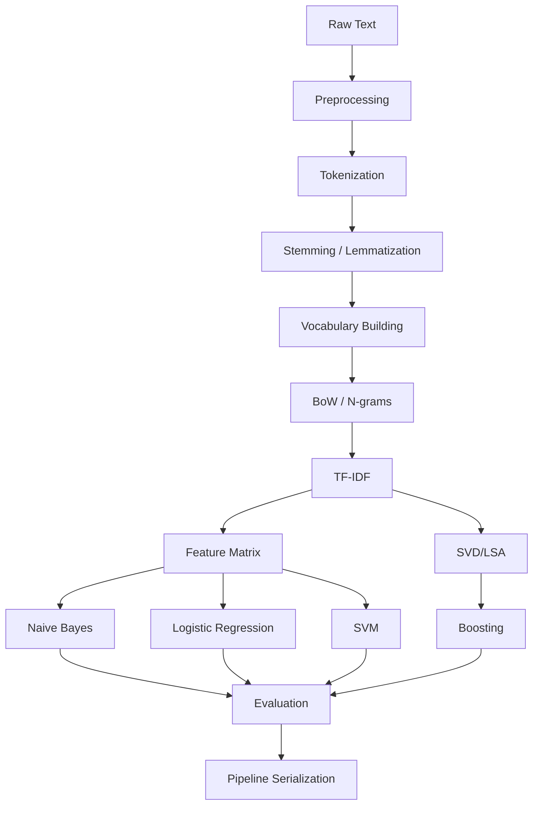

# Natural Language Processing: A Comprehensive Engineering Guide

> **From raw text to production-ready NLP systems — a deep, practical, hands-on guide for engineers who want to build things that actually work.**

---

## What You Will Learn

This document is a complete reference for classical Natural Language Processing (NLP), covering every stage of the pipeline from raw text ingestion to deployed models. It is designed to bridge the gap between textbook theory and production engineering reality.

By the end, you will be able to:
- Preprocess and clean noisy real-world text data with confidence
- Build text representations from scratch and understand their trade-offs
- Train and evaluate classical ML models (Naive Bayes, Logistic Regression, SVM, Boosting) on text
- Design reproducible, leak-proof NLP pipelines
- Complete two end-to-end real-world projects with full code
- Handle common pitfalls that trip up even experienced practitioners

## Who This Is For

- ML Engineers transitioning into NLP
- Data Scientists building their first text classification system
- Backend Engineers integrating NLP into applications
- Students preparing for industry interviews
- Anyone who has used `sklearn` but wants to deeply understand what's happening under the hood

---

## Table of Contents

1. [Text Preprocessing](#1-text-preprocessing)
   - [Text Normalization](#11-text-normalization)
   - [Tokenization](#12-tokenization)
   - [Stemming](#13-stemming)
   - [Lemmatization](#14-lemmatization)
   - [Handling Special Text](#15-handling-special-text)
   - [Language Detection](#16-language-detection)
2. [Text Representation](#2-text-representation)
   - [Bag of Words](#21-bag-of-words-bow)
   - [N-grams](#22-n-grams)
   - [TF-IDF](#23-tf-idf)
   - [Binary Vectors & Hashing Trick](#24-binary-vectors--hashing-trick)
   - [Sparse vs Dense Representations](#25-sparse-vs-dense-representations)
3. [Traditional NLP Algorithms](#3-traditional-nlp-algorithms)
   - [Naive Bayes](#31-naive-bayes-for-text)
   - [Logistic Regression](#32-logistic-regression-for-text)
   - [Support Vector Machines](#33-support-vector-machines-for-text)
   - [Boosting Algorithms](#34-boosting-algorithms-for-text)
4. [NLP Pipeline Engineering](#4-nlp-pipeline-engineering)
5. [Cross-Topic Relationships](#5-cross-topic-relationships)
6. [End-to-End Projects](#6-end-to-end-projects)
   - [Project 1: Spam Detection System](#project-1-email-spam-detection-system)
   - [Project 2: Customer Review Sentiment Analysis](#project-2-customer-review-sentiment-analysis)
7. [Algorithm Comparison Tables](#7-algorithm-comparison-tables)
8. [Common Mistakes & Pitfalls](#8-common-mistakes--pitfalls)
9. [Interview Preparation](#9-interview-preparation)
10. [Resources](#10-resources)

---

# 1. Text Preprocessing

> *"Garbage in, garbage out. With text data, 80% of your work is cleaning. The model is the easy part."*

Text preprocessing is the foundation of every NLP system. Raw text collected from the real world — social media posts, emails, customer reviews, web pages — is messy, inconsistent, and filled with noise. Preprocessing transforms this chaos into structured, normalized input that algorithms can learn from.

---

## 1.1 Text Normalization

### Intuition

Imagine you're building a spam classifier. The words "FREE", "Free", and "free" carry the same meaning, but a naive computer treats them as three distinct tokens. Text normalization is the process of collapsing these meaningless surface-level variations so your model focuses on what actually matters: meaning.

Think of it like standardizing units in physics. You wouldn't mix meters and feet in the same calculation.

---

### a. Lowercasing

**What it does:** Converts all characters to lowercase.

**When to use:** Almost always in classical NLP. "Apple" and "apple" carry the same meaning in most contexts.

**When to avoid:** Named entity recognition (NER), where "Apple" (company) ≠ "apple" (fruit). Sentiment analysis on capitalization-heavy social media.

```python
text = "FREE Offer! CLICK NOW!!!"
normalized = text.lower()
# "free offer! click now!!!"
```

---

### b. Unicode Normalization

**Intuition:** The same character can be encoded in multiple ways in Unicode. For example, the character "é" can be a single code point (U+00E9) or a combination of "e" + combining accent (U+0065 + U+0301). Without normalization, these look identical to humans but are different strings to computers.

**Forms:**
- `NFC` (Canonical Decomposition, followed by Canonical Composition) — most common for storage
- `NFKC` (Compatibility Decomposition, followed by Canonical Composition) — most aggressive, converts ligatures and superscripts

```python
import unicodedata

text = "caf\u00e9"   # café (single codepoint)
text2 = "cafe\u0301" # café (decomposed)

print(text == text2)  # False — same visual, different bytes

# Normalize to NFC
normalized = unicodedata.normalize("NFC", text2)
print(text == normalized)  # True

# NFKC is more aggressive
text3 = "file"  # fi ligature
print(unicodedata.normalize("NFKC", text3))  # "file"
```

---

### c. Removing Punctuation

**Intuition:** Punctuation carries syntactic information (sentence boundaries, emphasis) but often adds noise for bag-of-words models. However, removing ALL punctuation is often too aggressive — consider "U.S.A." or "3.14".

```python
import re
import string

def remove_punctuation(text: str, keep_chars: str = "") -> str:
    """
    Remove punctuation from text.
    
    Args:
        text: Input string
        keep_chars: Punctuation characters to preserve (e.g., ".-" for decimals)
    """
    # Build punctuation set, excluding keep_chars
    punct = set(string.punctuation) - set(keep_chars)
    pattern = "[" + re.escape("".join(punct)) + "]"
    return re.sub(pattern, " ", text)

# Basic usage
text = "Hello, world! This is NLP... isn't it great?"
print(remove_punctuation(text))
# "Hello  world  This is NLP    isn t it great "

# Keep hyphens for compound words
print(remove_punctuation("state-of-the-art model", keep_chars="-"))
# "state-of-the-art model"
```

---

### d. Removing Numbers

**When to remove:** Sentiment analysis, topic classification — numbers usually don't carry topic-discriminating signal.

**When to keep:** Financial document analysis, technical text, named entity tasks.

```python
def remove_numbers(text: str, replace_with: str = " ") -> str:
    """Remove standalone numbers or all digit sequences."""
    # Remove standalone numbers (not part of words like "MP3")
    return re.sub(r'\b\d+\b', replace_with, text)

def replace_numbers(text: str) -> str:
    """Replace numbers with a <NUM> token to preserve positional info."""
    return re.sub(r'\b\d+\.?\d*\b', '<NUM>', text)

print(remove_numbers("I have 42 apples and 3.14 pies"))
# "I have   apples and 3.14 pies"  (3.14 not matched as standalone int)

print(replace_numbers("Revenue: 1.5M in Q3 2023"))
# "Revenue: <NUM>M in Q<NUM> <NUM>"
```

---

### e. Handling Special Characters

**Real-world text includes:**
- HTML entities: `&amp;`, `&lt;`, `&#39;`
- Mathematical symbols: ×, ÷, ≥
- Currency symbols: $, €, £
- Control characters and invisible Unicode

```python
import html
import re

def clean_special_chars(text: str) -> str:
    """
    Clean special characters from text.
    Order matters — decode HTML first, then clean.
    """
    # 1. Decode HTML entities
    text = html.unescape(text)  # &amp; -> &, &lt; -> <
    
    # 2. Remove control characters (but keep newlines/tabs)
    text = re.sub(r'[\x00-\x08\x0B\x0C\x0E-\x1F\x7F]', '', text)
    
    # 3. Replace non-ASCII with space (optional — aggressive)
    # text = re.sub(r'[^\x00-\x7F]+', ' ', text)
    
    # 4. Normalize various dash types to standard hyphen
    text = re.sub(r'[–—―]', '-', text)
    
    return text

text = "&amp; This costs $100 &mdash; a bargain!"
print(clean_special_chars(text))
# "& This costs $100 - a bargain!"
```

---

### f. Whitespace Normalization

**Intuition:** After all the above cleaning steps, you're left with multiple spaces, leading/trailing spaces, and sometimes mixed tabs and newlines. Normalize these last.

```python
def normalize_whitespace(text: str) -> str:
    """
    Collapse all whitespace (spaces, tabs, newlines) to single spaces.
    Strip leading/trailing whitespace.
    """
    return re.sub(r'\s+', ' ', text).strip()

text = "  Hello   \t world  \n  how   are   you  "
print(normalize_whitespace(text))
# "Hello world how are you"
```

---

### g. Stopword Removal

**Intuition:** Stopwords are extremely common words ("the", "is", "in", "and") that appear in almost every document. They carry minimal discriminative information for most classification tasks — they're linguistic glue, not content.

**Analogy:** When searching for a book by topic, you search for "machine learning algorithms" not "the machine that learns with the algorithms in it." The filler words are automatically filtered.

**When to use:** Bag-of-words classification, TF-IDF vectorization, topic modeling.

**When to avoid:** Sequence models, sentiment analysis ("not good" → removing "not" destroys meaning), question answering.

```python
import nltk
from nltk.corpus import stopwords

# Download once
nltk.download('stopwords', quiet=True)

STOP_WORDS = set(stopwords.words('english'))

def remove_stopwords(tokens: list, custom_stops: set = None) -> list:
    """
    Remove stopwords from a token list.
    
    Args:
        tokens: List of string tokens
        custom_stops: Additional domain-specific stopwords
    """
    stops = STOP_WORDS.copy()
    if custom_stops:
        stops.update(custom_stops)
    
    return [tok for tok in tokens if tok not in stops]

tokens = ["the", "movie", "was", "not", "good", "at", "all"]
print(remove_stopwords(tokens))
# ["movie", "not", "good"]  — NOTE: "not" is preserved by default in NLTK!

# Domain-specific stopwords for e-commerce
ecommerce_stops = {"product", "item", "purchase", "buy"}
```

> **Pro tip:** Always inspect which words are in the stoplist. NLTK's English stoplist includes "not", "no", "nor" — negations that matter in sentiment analysis. For sentiment tasks, either use no stoplist or a custom one that excludes negations.

---

### h. Handling Contractions

**Intuition:** "Don't" and "do not" are semantically identical, but tokenizers may split them differently. Expanding contractions before tokenization ensures consistency.

```python
# Using the contractions library
# pip install contractions
import contractions

def expand_contractions(text: str) -> str:
    """Expand English contractions."""
    return contractions.fix(text)

# Manual approach (more control)
CONTRACTIONS = {
    "don't": "do not",
    "won't": "will not",
    "can't": "cannot",
    "it's": "it is",
    "i'm": "i am",
    "i've": "i have",
    "i'll": "i will",
    "i'd": "i would",
    "we're": "we are",
    "they're": "they are",
    "isn't": "is not",
    "aren't": "are not",
    "wasn't": "was not",
    "weren't": "were not",
    "hasn't": "has not",
    "haven't": "have not",
    "hadn't": "had not",
    "couldn't": "could not",
    "wouldn't": "would not",
    "shouldn't": "should not",
}

def expand_contractions_manual(text: str) -> str:
    """Expand contractions using a lookup dictionary."""
    text = text.lower()
    for contraction, expansion in CONTRACTIONS.items():
        text = text.replace(contraction, expansion)
    return text

print(expand_contractions("I don't think it's working, won't it?"))
# "I do not think it is working, will not it?"
```

---

## 1.2 Tokenization

### Intuition

Tokenization is the process of splitting a string of text into individual units (tokens). These tokens are the atomic units your model will work with. The choice of tokenization strategy has a direct downstream impact on every other component.

**Analogy:** If text is a sentence, tokenization is choosing whether to analyze it word-by-word, character-by-character, or by syllables.

---

### Word Tokenization

**How It Works:**

```
"The quick brown fox." 
        ↓
["The", "quick", "brown", "fox", "."]
```

The challenge is more subtle than splitting on spaces. Consider:
- "New York" — one semantic unit, two tokens
- "don't" — one token or two?
- "state-of-the-art" — one token or four?
- "Ph.D." — how many tokens?

```python
import nltk
from nltk.tokenize import word_tokenize, TweetTokenizer, MWETokenizer

nltk.download('punkt', quiet=True)
nltk.download('punkt_tab', quiet=True)

# --- Basic NLTK word tokenizer ---
text = "Don't stop! This is NLP, isn't it? Ph.D. students love it."
tokens = word_tokenize(text)
print(tokens)
# ['Do', "n't", 'stop', '!', 'This', 'is', 'NLP', ',', 
#  'is', "n't", 'it', '?', 'Ph.D.', 'students', 'love', 'it', '.']

# --- Simple whitespace split (baseline) ---
simple_tokens = text.split()
# ["Don't", "stop!", "This", ...]  — no punctuation handling

# --- Regex tokenizer (full control) ---
from nltk.tokenize import RegexpTokenizer
tokenizer = RegexpTokenizer(r'\b[a-zA-Z]+\b')  # Only alphabetic words
alpha_tokens = tokenizer.tokenize(text)
# ['Don', 't', 'stop', 'This', 'is', 'NLP', ...]

# --- Tweet tokenizer (preserves emojis, handles @mentions, #hashtags) ---
tweet_tok = TweetTokenizer(preserve_case=False, strip_handles=True, reduce_len=True)
tweet = "Can't wait!!! 😍 @username #NLP is amazinggg"
print(tweet_tok.tokenize(tweet))
# ["can't", 'wait', '!', '!', '!', '😍', '#nlp', 'is', 'amazinggg']

# --- Multi-word expression tokenizer ---
mwe_tokenizer = MWETokenizer([("New", "York"), ("San", "Francisco")], separator='_')
location_text = word_tokenize("I love New York and San Francisco")
print(mwe_tokenizer.tokenize(location_text))
# ['I', 'love', 'New_York', 'and', 'San_Francisco']
```

---

### Sentence Tokenization

**Intuition:** Before word tokenization, you often need to split a document into sentences. This is harder than it looks — "Mr. Smith went to Washington. He loved it." has two sentences, but "Mr." shouldn't trigger a sentence boundary.

```python
from nltk.tokenize import sent_tokenize

text = """
Dr. Smith visited Washington D.C. last week. He met with U.S. officials.
The meeting was productive! Will there be a follow-up? Yes, on Jan. 5th.
"""

sentences = sent_tokenize(text.strip())
for i, sent in enumerate(sentences, 1):
    print(f"[{i}] {sent}")
# [1] Dr. Smith visited Washington D.C. last week.
# [2] He met with U.S. officials.
# [3] The meeting was productive!
# [4] Will there be a follow-up?
# [5] Yes, on Jan. 5th.
```

**Visual Representation:**

```
Input text: "Dr. Smith went to D.C. He loved it."
                                   ^
                              Sentence boundary here?

Punkt Tokenizer logic:
  - "Dr." → abbreviation list → NO boundary
  - "D.C." → abbreviation + period → NO boundary  
  - "it." → not in abbreviation list + capital follows → BOUNDARY ✓
```

---

## 1.3 Stemming

### Intuition

Stemming is a crude but fast heuristic that chops off the ends of words to reduce them to a common root form (the "stem"). It doesn't produce linguistically valid words — it's purely pattern-based.

**Analogy:** Stemming is like cutting words with scissors — fast, but sometimes cuts too much or too little.

| Original | Porter Stemmed |
|----------|---------------|
| running  | run           |
| runner   | runner        |
| runs     | run           |
| easily   | easili        |  ← not a real word!
| fairly   | fairli        |  ← not a real word!

```python
from nltk.stem import PorterStemmer, SnowballStemmer, LancasterStemmer

porter = PorterStemmer()
snowball = SnowballStemmer("english")
lancaster = LancasterStemmer()  # Most aggressive

words = ["running", "runner", "easily", "generalization", "studying", "studies"]

print(f"{'Word':<20} {'Porter':<15} {'Snowball':<15} {'Lancaster':<15}")
print("-" * 65)
for word in words:
    print(f"{word:<20} {porter.stem(word):<15} {snowball.stem(word):<15} {lancaster.stem(word):<15}")

# Word                 Porter          Snowball        Lancaster      
# ----------------------------------------------------------------
# running              run             run             run            
# runner               runner          runner          run            
# easily               easili          easili          easy           
# generalization       gener           general         gen            
# studying             studi           studi           study          
# studies              studi           studi           study          
```

**When to Use:** Speed is critical, precision is not. Short texts, information retrieval.

**When to Avoid:** When word forms carry meaning ("meeting" as noun vs "meeting" as verb). Any task where linguistic accuracy matters.

---

## 1.4 Lemmatization

### Intuition

Lemmatization is the smarter sibling of stemming. It reduces words to their dictionary base form (the *lemma*) using vocabulary and morphological analysis. "Runs", "ran", "running" all become "run". Unlike stemming, the output is always a real word.

**Analogy:** While stemming uses scissors, lemmatization uses a dictionary. Slower, but linguistically correct.

| Original | POS  | Lemma  |
|----------|------|--------|
| running  | verb | run    |
| running  | noun | running| ← POS matters!
| better   | adj  | good   |
| was      | verb | be     |
| mice     | noun | mouse  |

```python
import nltk
from nltk.stem import WordNetLemmatizer
from nltk.corpus import wordnet

nltk.download('wordnet', quiet=True)
nltk.download('averaged_perceptron_tagger_eng', quiet=True)

lemmatizer = WordNetLemmatizer()

def get_wordnet_pos(treebank_tag: str) -> str:
    """
    Convert Penn Treebank POS tags to WordNet POS tags.
    This is CRITICAL for correct lemmatization.
    """
    if treebank_tag.startswith('J'):
        return wordnet.ADJ
    elif treebank_tag.startswith('V'):
        return wordnet.VERB
    elif treebank_tag.startswith('N'):
        return wordnet.NOUN
    elif treebank_tag.startswith('R'):
        return wordnet.ADV
    else:
        return wordnet.NOUN  # default

def lemmatize_text(text: str) -> list:
    """
    Lemmatize text with POS-aware lemmatization.
    Always use POS tags — default noun assumption is often wrong.
    """
    tokens = nltk.word_tokenize(text)
    pos_tags = nltk.pos_tag(tokens)
    
    lemmas = []
    for word, tag in pos_tags:
        wn_pos = get_wordnet_pos(tag)
        lemma = lemmatizer.lemmatize(word.lower(), pos=wn_pos)
        lemmas.append(lemma)
    
    return lemmas

text = "The mice were running faster than the cats and he was better at it"
print(lemmatize_text(text))
# ['the', 'mouse', 'be', 'run', 'fast', 'than', 'the', 'cat', 
#  'and', 'he', 'be', 'good', 'at', 'it']
```

**Stemming vs Lemmatization:**

```
                 STEMMING                    LEMMATIZATION
                 --------                    -------------
Speed:           Very Fast (regex rules)     Slower (dictionary lookup)
Output:          May not be real words       Always real words
Linguistic:      No                          Yes (needs POS)
"studies" →      "studi"                     "study"
"better" →       "better"                    "good"
"was" →          "was"                       "be"

Use stemming when: speed > precision (search engines, large corpora)
Use lemmatization when: quality > speed (classification, semantic tasks)
```

---

## 1.5 Handling Special Text

### Handling Emojis & Emoticons

**Intuition:** Emojis carry strong sentiment signal. 😊 ≠ 😢. Simply stripping them discards valuable information. Better: replace with text descriptions.

```python
# pip install emoji
import emoji
import re

def handle_emojis(text: str, mode: str = "replace") -> str:
    """
    Handle emojis in text.
    
    Args:
        mode: 'replace' — convert to text description
              'remove' — strip all emojis
              'keep'   — leave as-is
    """
    if mode == "replace":
        # emoji.demojize converts 😊 to :smiling_face_with_smiling_eyes:
        return emoji.demojize(text, delimiters=(" ", " "))
    elif mode == "remove":
        return emoji.replace_emoji(text, replace="")
    return text

# For emoticons (text-based)
EMOTICON_MAP = {
    r':\)': 'happy',
    r':\(': 'sad',
    r':D': 'very_happy',
    r';\)': 'wink',
    r':/': 'skeptical',
    r'<3': 'love',
}

def replace_emoticons(text: str) -> str:
    for pattern, replacement in EMOTICON_MAP.items():
        text = re.sub(pattern, f' {replacement} ', text)
    return text

text = "Just got promoted! 😊🎉 So happy :D <3 this job!"
print(handle_emojis(text, mode="replace"))
# "Just got promoted!  smiling_face_with_smiling_eyes   party_popper  
#  So happy :D <3 this job!"
```

---

### Handling URLs, Emails, Mentions

```python
def clean_urls_emails_mentions(text: str, 
                                 replace_url: str = "<URL>",
                                 replace_email: str = "<EMAIL>",
                                 replace_mention: str = "<USER>",
                                 replace_hashtag: str = None) -> str:
    """
    Replace or remove URLs, emails, @mentions, #hashtags.
    
    Replacing with tokens (rather than removing) preserves positional info
    and lets the model learn that URLs correlate with certain classes.
    """
    # URLs — must come before email (emails contain @ like URLs)
    url_pattern = r'https?://\S+|www\.\S+'
    text = re.sub(url_pattern, replace_url, text)
    
    # Emails
    email_pattern = r'\b[A-Za-z0-9._%+-]+@[A-Za-z0-9.-]+\.[A-Z|a-z]{2,}\b'
    text = re.sub(email_pattern, replace_email, text)
    
    # Twitter/social @mentions
    text = re.sub(r'@\w+', replace_mention, text)
    
    # Hashtags (optional — may want to keep the word)
    if replace_hashtag is not None:
        text = re.sub(r'#(\w+)', replace_hashtag, text)
    else:
        text = re.sub(r'#(\w+)', r'\1', text)  # Remove # but keep word
    
    return text

tweet = "Check out https://example.com! Email me at user@test.org @john #NLP is cool"
print(clean_urls_emails_mentions(tweet))
# "Check out <URL>! Email me at <EMAIL> <USER> NLP is cool"
```

---

### Handling Spelling Variations

```python
# pip install pyspellchecker
from spellchecker import SpellChecker

spell = SpellChecker()

def correct_spelling(tokens: list, max_distance: int = 1) -> list:
    """
    Correct spelling in a list of tokens.
    
    Warning: Slow on large corpora. Use selectively.
    Also: "teh" → "the" but "goverment" → might fail.
    Consider caching corrections.
    """
    misspelled = spell.unknown(tokens)
    corrected = []
    
    for token in tokens:
        if token in misspelled:
            correction = spell.correction(token)
            corrected.append(correction if correction else token)
        else:
            corrected.append(token)
    
    return corrected

tokens = ["speling", "is", "dificult", "sumtimes"]
print(correct_spelling(tokens))
# ['spelling', 'is', 'difficult', 'sometimes']
```

> **Production note:** Spell correction is expensive and error-prone. For most classification tasks, it's better to rely on subword tokenization (BPE) or character n-grams which are naturally robust to typos. Use spell correction only when you've confirmed it improves your specific task's metrics.

---

## 1.6 Language Detection

### Intuition

When building multilingual systems, you need to route documents to the appropriate language-specific pipeline. Language detection uses statistical patterns (character n-gram distributions) to identify the language of a text snippet.

```python
# pip install langdetect
from langdetect import detect, detect_langs, LangDetectException

def detect_language(text: str, min_confidence: float = 0.8) -> dict:
    """
    Detect language of text with confidence threshold.
    
    Returns:
        dict with 'language', 'confidence', 'reliable' keys
    """
    try:
        # Get probability distribution over languages
        lang_probs = detect_langs(text)
        top = lang_probs[0]
        
        return {
            "language": top.lang,
            "confidence": top.prob,
            "reliable": top.prob >= min_confidence,
            "alternatives": [(l.lang, round(l.prob, 3)) for l in lang_probs[1:3]]
        }
    except LangDetectException:
        return {"language": "unknown", "confidence": 0.0, "reliable": False}

# Test
samples = [
    "This is a sentence in English.",
    "C'est une phrase en français.",
    "Dies ist ein Satz auf Deutsch.",
    "ok",  # Too short — unreliable
]

for text in samples:
    result = detect_language(text)
    status = "✓" if result["reliable"] else "⚠"
    print(f"{status} [{result['language']}|{result['confidence']:.2f}] {text[:40]}")
```

**Visual — How Language Detection Works:**

```
Character n-gram profile for English:
  "th" → very high frequency
  "the" → very high frequency  
  "ing" → high frequency
  
Character n-gram profile for French:
  "ou" → high frequency
  "qu" → high frequency
  "est" → high frequency

Input text n-grams → Compare against language profiles → Pick closest match
```

---

# 2. Text Representation

> *"You've cleaned the text. Now you need to turn words into numbers — because math doesn't speak English."*

Machine learning algorithms operate on numerical vectors. Text representation is the bridge between human language and mathematical computation.

---

## 2.1 Bag of Words (BoW)

### Intuition

Imagine putting all the words from a document into a bag, shaking it up, and counting how many times each word appears. You've lost word order, sentence structure, and grammar — but you've captured what the document is *about*.

**Analogy:** BoW is like judging a book by the index — you know all the topics, but not the story.

### Mathematical Insight

For a vocabulary V = {w₁, w₂, ..., wₙ} and a document d:

```
BoW(d) = [count(w₁, d), count(w₂, d), ..., count(wₙ, d)]
```

Each document becomes a vector in |V|-dimensional space.

### How It Works (Step-by-Step)

1. Collect all documents (the corpus)
2. Build vocabulary: unique words across all documents
3. For each document, create a vector of length |V|
4. Fill in: position i = frequency of word i in that document

### Visual Representation

```
Corpus:
  Doc 1: "the cat sat on the mat"
  Doc 2: "the cat ate the rat"

Vocabulary: [ate, cat, mat, on, rat, sat, the]
                                                      
               ate  cat  mat  on   rat  sat  the
Doc 1:       [  0    1    1    1    0    1    2  ]
Doc 2:       [  1    1    0    0    1    0    2  ]
```

### Python Implementation

```python
from sklearn.feature_extraction.text import CountVectorizer
import numpy as np
import pandas as pd

# --- Sample corpus ---
corpus = [
    "the cat sat on the mat",
    "the cat ate the rat",
    "the dog sat on a log",
    "the rat ate the mat",
]

# --- Basic BoW ---
vectorizer = CountVectorizer()
X = vectorizer.fit_transform(corpus)

# Inspect vocabulary
vocab = vectorizer.get_feature_names_out()
print("Vocabulary:", vocab)
# ['ate' 'cat' 'dog' 'log' 'mat' 'on' 'rat' 'sat' 'the']

# Display as DataFrame
df = pd.DataFrame(X.toarray(), columns=vocab, index=[f"Doc {i+1}" for i in range(len(corpus))])
print(df)

# --- BoW with preprocessing options ---
vectorizer_advanced = CountVectorizer(
    lowercase=True,          # Convert to lowercase
    token_pattern=r'\b[a-z]{2,}\b',  # Min 2-char alphabetic tokens
    max_features=1000,       # Top 1000 most frequent words
    min_df=2,                # Ignore terms appearing in < 2 docs
    max_df=0.95,             # Ignore terms in > 95% of docs (stopwords)
    stop_words='english',    # Remove English stopwords
)

X_adv = vectorizer_advanced.fit_transform(corpus)
print(f"Vocabulary size: {len(vectorizer_advanced.vocabulary_)}")
print(f"Matrix shape: {X_adv.shape}")
```

### Key Hyperparameters

| Parameter | Effect | Typical Values |
|-----------|--------|----------------|
| `max_features` | Controls vocab size, memory | 5000–50000 |
| `min_df` | Remove rare terms (noise) | 2–5 |
| `max_df` | Remove very common terms | 0.85–0.99 |
| `ngram_range` | Include n-grams | (1,1), (1,2), (1,3) |
| `stop_words` | Remove stopword list | 'english', custom list |

### When to Use / Avoid

**Use:** Simple text classification, spam detection, baseline models, when speed matters.

**Avoid:** Long documents (very high-dimensional), when word order matters, semantics over vocabulary matching.

---

## 2.2 N-grams

### Intuition

BoW treats "not good" and "good" identically if you only use unigrams — it loses the negation. N-grams capture sequences of N consecutive tokens, preserving local context.

- **Unigram:** ["not", "good"] → separate tokens
- **Bigram:** ["not good"] → one token capturing the phrase
- **Trigram:** ["was not good"] → three-word context

### Mathematical Insight

For a sequence of words w₁, w₂, ..., wₙ, the set of k-grams is:
```
{(wᵢ, wᵢ₊₁, ..., wᵢ₊ₖ₋₁) for i = 1 to n-k+1}
```

**Vocabulary explosion:**  
- Unigrams: ~|V| features  
- Bigrams: ~|V|² possible, but sparse  
- Trigrams: ~|V|³ possible, very sparse

### Python Implementation

```python
from sklearn.feature_extraction.text import CountVectorizer

corpus = [
    "the food was not good at all",
    "the service was very good",
    "not recommended for anyone",
]

# Unigrams + Bigrams
vec_bigram = CountVectorizer(ngram_range=(1, 2))
X_bigram = vec_bigram.fit_transform(corpus)

print("N-gram vocabulary sample:")
vocab = vec_bigram.get_feature_names_out()
print([v for v in vocab if ' ' in v][:10])  # Show only bigrams
# ['at all', 'food was', 'for anyone', 'good at', 'not good', ...]

# Character n-grams (robust to typos, morphology)
vec_char = CountVectorizer(
    analyzer='char_wb',  # char n-grams, padding within words
    ngram_range=(3, 5),  # 3 to 5 character sequences
)
X_char = vec_char.fit_transform(corpus)
print(f"Char n-gram features: {X_char.shape[1]}")
```

**Visual:**
```
Text: "not good at all"

Bigrams: ["not good", "good at", "at all"]
Trigrams: ["not good at", "good at all"]

Character n-grams for "good" (n=3):
  [" go", "goo", "ood", "od "]  (char_wb adds word boundary spaces)
```

---

## 2.3 TF-IDF

### Intuition

Raw word counts have a fundamental flaw: common words like "the", "is", "a" dominate even after stopword removal. The word "neural" appearing 5 times in a document about ML is MORE informative than "the" appearing 50 times.

**TF-IDF** solves this by upweighting words that are frequent in a specific document but rare across all documents.

**Analogy:** If every student in class uses the word "algorithm", it's not a distinguishing feature. But if only one student uses "eigenvalue", that's a strong signal about their expertise.

### Mathematical Insight

**Term Frequency (TF):**
```
TF(t, d) = count(t in d) / total_words(d)
```

**Inverse Document Frequency (IDF):**
```
IDF(t, D) = log( (1 + N) / (1 + df(t)) ) + 1
```
Where:
- N = total number of documents
- df(t) = number of documents containing term t
- The +1 smoothing prevents division by zero and handles unseen terms

**TF-IDF:**
```
TF-IDF(t, d, D) = TF(t, d) × IDF(t, D)
```

**What this means:**
- High TF-IDF = word appears often in THIS document, but rarely elsewhere → highly specific
- Low TF-IDF = either rare in this doc, or common everywhere → not informative

### How It Works (Step-by-Step)

1. Compute TF for each term in each document
2. Compute IDF for each term across the entire corpus (FIT step — uses training data only!)
3. Multiply: TF × IDF for each (term, document) pair
4. Optionally normalize each document vector to unit L2 norm

### Python Implementation

```python
from sklearn.feature_extraction.text import TfidfVectorizer
import numpy as np
import pandas as pd

corpus = [
    "machine learning is amazing",
    "deep learning neural networks",
    "machine learning and deep learning",
    "natural language processing is a subfield of machine learning",
]

# --- Standard TF-IDF ---
tfidf = TfidfVectorizer(
    norm='l2',           # L2 normalize each document vector
    use_idf=True,        # Use IDF weighting
    smooth_idf=True,     # Add 1 to document frequency (prevent zero division)
    sublinear_tf=True,   # Apply log(1 + tf) instead of raw tf
)

X = tfidf.fit_transform(corpus)
vocab = tfidf.get_feature_names_out()

# Display TF-IDF scores
df = pd.DataFrame(
    X.toarray().round(3),
    columns=vocab,
    index=[f"Doc {i+1}" for i in range(len(corpus))]
)
print(df.to_string())

# --- Manual TF-IDF computation to understand internals ---
def manual_tfidf(corpus: list) -> pd.DataFrame:
    """Manual TF-IDF for educational clarity."""
    from collections import Counter
    import math
    
    # Tokenize
    tokenized = [doc.lower().split() for doc in corpus]
    
    # Build vocabulary
    vocab = sorted(set(word for doc in tokenized for word in doc))
    N = len(corpus)
    
    # Compute IDF
    df_count = {word: sum(1 for doc in tokenized if word in doc) for word in vocab}
    idf = {word: math.log((1 + N) / (1 + df_count[word])) + 1 for word in vocab}
    
    # Compute TF-IDF
    rows = []
    for doc in tokenized:
        tf = Counter(doc)
        total = len(doc)
        row = {word: (tf.get(word, 0) / total) * idf[word] for word in vocab}
        rows.append(row)
    
    return pd.DataFrame(rows, columns=vocab).round(4)

print(manual_tfidf(corpus))
```

**Why `sublinear_tf=True`?**
```
Raw TF: 10 occurrences → 10x weight vs 1 occurrence
Sublinear: log(1+10) ≈ 2.4x weight vs log(1+1) ≈ 0.69x = 3.5x ratio

The intuition: going from 1 to 2 occurrences is more informative than
going from 100 to 101. Diminishing returns → log scale.
```

---

## 2.4 Binary Vectors & Hashing Trick

### Binary Vectors

**Intuition:** Instead of counting occurrences, just record *presence* (1) or *absence* (0). Useful for short texts where frequency doesn't add much signal.

```python
from sklearn.feature_extraction.text import CountVectorizer

# Binary vectorization: 1 if present, 0 if absent
binary_vec = CountVectorizer(binary=True)
X_binary = binary_vec.fit_transform(corpus)

# Compare: "machine" appears twice in Doc 3, but binary treats it as 1
print("Count:  ", CountVectorizer().fit_transform(["machine machine learning"]).toarray())
print("Binary: ", CountVectorizer(binary=True).fit_transform(["machine machine learning"]).toarray())
# Count:  [[2 1]]
# Binary: [[1 1]]
```

---

### Hashing Trick (Feature Hashing)

### Intuition

Building a vocabulary requires two passes over the data and storing a large mapping in memory. The hashing trick eliminates the vocabulary entirely: each token is mapped to a feature index using a hash function. No vocabulary = lower memory, streaming-friendly, no need for a fit step.

**Trade-off:** Hash collisions can cause different words to map to the same index (small accuracy loss, but usually manageable).

```python
from sklearn.feature_extraction.text import HashingVectorizer

# No vocabulary — hash tokens directly to indices
hasher = HashingVectorizer(
    n_features=2**18,     # 262144 buckets (larger = fewer collisions)
    norm='l2',
    alternate_sign=False,  # Use only positive values
    ngram_range=(1, 2),
)

X_hash = hasher.transform(corpus)  # Note: transform(), not fit_transform()
print(f"Shape: {X_hash.shape}")
# (4, 262144) — fixed width regardless of corpus size

# No vocabulary to inspect — that's the trade-off
# But: memory efficient, can process streaming data
```

**Visual — Hashing Trick:**
```
Token → hash("machine") % 2^18 → index 71234
Token → hash("learning") % 2^18 → index 15823
Token → hash("neural")   % 2^18 → index 71234  ← collision! (rare)

Collision rate ≈ vocabulary_size / n_features
For V=50000 and n_features=2^18=262144: collision ≈ 19%  (too low)
For V=50000 and n_features=2^20=1M:     collision ≈ 5%   (acceptable)
```

### When to Use Hashing

- **Use:** Online/streaming learning, very large vocabularies, memory-constrained environments
- **Avoid:** When you need interpretable features, when vocabulary inspection matters

---

## 2.5 Sparse vs Dense Representations

### Intuition

This is one of the most practically important distinctions in NLP engineering.

**Sparse representation:** Most elements are zero. A BoW vector of length 50,000 where only 20 words appear has 49,980 zeros. Memory-efficient storage via sparse matrix formats (CSR, CSC).

**Dense representation:** Every element is non-zero. Word2Vec, GloVe, fastText produce dense 100–300 dimensional vectors where every dimension encodes some latent semantic feature.

### Dimensionality Considerations

```python
import numpy as np
from scipy.sparse import csr_matrix
import sys

# Sparse example: 10,000 docs × 50,000 vocab
n_docs, n_vocab = 10000, 50000
avg_words_per_doc = 200  # average non-zeros per doc

# Dense matrix — impractical
dense_size = n_docs * n_vocab * 4  # 4 bytes per float32
print(f"Dense storage: {dense_size / 1e9:.1f} GB")  # 2.0 GB

# Sparse matrix (CSR format)
# Stores only non-zero values + indices
nnz = n_docs * avg_words_per_doc  # total non-zeros
sparse_size = nnz * (4 + 4 + 4)  # data + row_indices + col_indices
print(f"Sparse storage: {sparse_size / 1e6:.1f} MB")  # ~24 MB — 83x smaller!

# Practical demonstration
sparse_matrix = csr_matrix((n_docs, n_vocab), dtype=np.float32)
print(f"Sparse object size: {sys.getsizeof(sparse_matrix)} bytes")
print(f"Sparsity: {1 - nnz/(n_docs*n_vocab):.4%}")  # 99.96% zeros

# When to convert sparse → dense
# Only when algorithms REQUIRE dense input (some PyTorch layers)
X_dense = sparse_matrix.toarray()  # Only do this if necessary!
```

**Decision Matrix:**

```
                    BoW/TF-IDF          Word Embeddings
Representation:     Sparse              Dense
Dimensions:         10,000–100,000      50–300
Memory:             Low (sparse fmt)    Moderate (all non-zero)
Interpretable:      Yes (each dim=word) No (latent features)
Captures semantics: No                  Yes
Best for:           Classical ML        Deep learning, similarity
```

---

# 3. Traditional NLP Algorithms

> *"Deep learning isn't always the answer. For text classification with limited data, traditional algorithms are faster, more interpretable, and often just as good."*

---

## 3.1 Naive Bayes for Text

### Intuition

Naive Bayes is the "naive" assumption that all features (words) are conditionally independent given the class. Despite this assumption being obviously wrong (words in context are correlated), NB works remarkably well for text classification.

**Why?** Because you're not estimating joint probabilities — you're comparing relative class probabilities. The ranking is often correct even if the absolute probabilities are miscalibrated.

**Analogy:** A doctor guessing a diagnosis based on individual symptoms without considering their interactions. Often right, but misses complex cases.

### Mathematical Insight

**Bayes' Theorem:**
```
P(class | document) ∝ P(class) × P(document | class)
```

**Naive (independent) assumption:**
```
P(document | class) = ∏ P(wordᵢ | class)
```

**For classification (we pick the class with highest probability):**
```
class* = argmax_c [ log P(c) + Σ count(wᵢ) × log P(wᵢ | c) ]
```

**Multinomial NB — P(word | class):**
```
P(wᵢ | c) = (count(wᵢ, c) + α) / (total_words_in_c + α × |V|)
```

Where α is Laplace smoothing (α=1 means add-one smoothing).

**Why log probabilities?** Products of small probabilities underflow to zero. Log transforms products to sums.

### Python Implementation

```python
from sklearn.naive_bayes import MultinomialNB, ComplementNB, BernoulliNB
from sklearn.feature_extraction.text import TfidfVectorizer
from sklearn.pipeline import Pipeline
from sklearn.metrics import classification_report
from sklearn.model_selection import train_test_split
import numpy as np

# --- Sample data ---
texts = [
    "win free money now click here",
    "congratulations you won a prize",
    "free offer limited time",
    "hey can we meet tomorrow",
    "looking forward to the meeting",
    "please review the attached report",
    "quarterly earnings call scheduled",
    "invoice attached for your review",
]
labels = ["spam", "spam", "spam", "ham", "ham", "ham", "ham", "ham"]

X_train, X_test, y_train, y_test = train_test_split(
    texts, labels, test_size=0.25, random_state=42, stratify=labels
)

# --- Pipeline: TF-IDF + Multinomial NB ---
pipeline_mnb = Pipeline([
    ('tfidf', TfidfVectorizer(
        ngram_range=(1, 2),
        max_features=5000,
        sublinear_tf=True,
    )),
    ('clf', MultinomialNB(alpha=1.0)),  # alpha: Laplace smoothing
])

pipeline_mnb.fit(X_train, y_train)
y_pred = pipeline_mnb.predict(X_test)
print(classification_report(y_test, y_pred))

# --- Complement NB (better for imbalanced datasets) ---
# CNB uses the complement of each class to estimate parameters
pipeline_cnb = Pipeline([
    ('tfidf', TfidfVectorizer(ngram_range=(1, 2), sublinear_tf=True)),
    ('clf', ComplementNB(alpha=1.0, norm=True)),
])

# --- Inspect what NB learned ---
def show_top_words(pipeline, class_labels, n=10):
    """Show top discriminating words per class."""
    vectorizer = pipeline.named_steps['tfidf']
    classifier = pipeline.named_steps['clf']
    feature_names = vectorizer.get_feature_names_out()
    
    for i, class_label in enumerate(classifier.classes_):
        # Log probabilities — higher = more associated with this class
        top_idx = classifier.feature_log_prob_[i].argsort()[-n:][::-1]
        top_words = [(feature_names[idx], 
                      np.exp(classifier.feature_log_prob_[i][idx])) 
                     for idx in top_idx]
        print(f"\nTop words for class '{class_label}':")
        for word, prob in top_words:
            print(f"  {word:<25} P={prob:.4f}")

pipeline_mnb.fit(texts, labels)
show_top_words(pipeline_mnb, labels)
```

### Key Hyperparameters

| Hyperparameter | What It Does | Range |
|----------------|-------------|-------|
| `alpha` | Laplace smoothing — prevents zero probabilities for unseen words | 0.1–2.0 |
| `fit_prior` | Whether to learn class priors from data | True/False |
| `class_prior` | Override priors manually (for imbalanced data) | array of probabilities |

### When to Use / Avoid

**Use:** Spam detection, document classification, fast baseline, small datasets, when interpretability matters.

**Avoid:** When features are highly correlated (NB assumption breaks), when calibrated probabilities matter (NB probabilities are overconfident).

---

## 3.2 Logistic Regression for Text

### Intuition

Logistic Regression learns a weight for each word in your vocabulary. Positive weight = word pushes toward class 1. Negative weight = pushes toward class 0. The decision is the weighted sum of all word weights, passed through a sigmoid.

**Analogy:** Each word casts a vote with a learned strength. The model tallies weighted votes and returns the probability of belonging to each class.

### Mathematical Insight

**Linear combination:**
```
z = w₀ + w₁x₁ + w₂x₂ + ... + wₙxₙ  (dot product of weights and features)
```

**Sigmoid activation:**
```
P(y=1|x) = σ(z) = 1 / (1 + e^{-z})
```

**Binary cross-entropy loss (optimized via gradient descent):**
```
L = -[y·log(p) + (1-y)·log(1-p)]
```

**L2 Regularization (Ridge):**
```
L_total = L_CE + (λ/2) × Σ wᵢ²
```
- Large λ → small weights → simpler model (underfitting risk)
- Small λ → large weights → complex model (overfitting risk)

Note: In sklearn, `C = 1/λ` — so **small C = strong regularization**.

### How It Works (Step-by-Step)

1. Initialize weights w to zero or small random values
2. For each training example, compute z = w · x
3. Compute probability p = σ(z)
4. Compute loss L(p, y)
5. Compute gradient ∂L/∂w
6. Update weights: w = w - η × ∂L/∂w
7. Repeat until convergence

### Python Implementation

```python
from sklearn.linear_model import LogisticRegression, SGDClassifier
from sklearn.feature_extraction.text import TfidfVectorizer
from sklearn.pipeline import Pipeline
from sklearn.model_selection import cross_val_score
import numpy as np
import pandas as pd

# --- Standard Logistic Regression ---
pipeline_lr = Pipeline([
    ('tfidf', TfidfVectorizer(
        ngram_range=(1, 2),
        max_features=50000,
        sublinear_tf=True,
        min_df=2,
    )),
    ('clf', LogisticRegression(
        C=1.0,              # Inverse regularization strength
        penalty='l2',       # L2 regularization (use 'l1' for sparse weights)
        solver='lbfgs',     # Best for small-medium datasets
        max_iter=1000,      # Ensure convergence
        class_weight='balanced',  # For imbalanced classes
        multi_class='ovr',  # One-vs-Rest for multiclass
    )),
])

# --- For very large datasets: SGD (stochastic gradient descent) ---
pipeline_sgd = Pipeline([
    ('tfidf', TfidfVectorizer(ngram_range=(1, 2), sublinear_tf=True)),
    ('clf', SGDClassifier(
        loss='log_loss',       # Makes it logistic regression
        penalty='l2',
        alpha=1e-4,            # Regularization strength
        max_iter=100,
        tol=1e-3,
        random_state=42,
    )),
])

# --- Inspect learned weights ---
def show_feature_weights(pipeline, top_n: int = 15):
    """Show most positive and negative weights."""
    vectorizer = pipeline.named_steps['tfidf']
    clf = pipeline.named_steps['clf']
    feature_names = vectorizer.get_feature_names_out()
    
    if clf.coef_.shape[0] == 1:  # Binary
        weights = clf.coef_[0]
    else:  # Multiclass — show first class
        weights = clf.coef_[0]
    
    sorted_idx = weights.argsort()
    
    print(f"Top {top_n} NEGATIVE words (→ class 0):")
    for idx in sorted_idx[:top_n]:
        print(f"  {feature_names[idx]:<30} weight={weights[idx]:.4f}")
    
    print(f"\nTop {top_n} POSITIVE words (→ class 1):")
    for idx in sorted_idx[-top_n:][::-1]:
        print(f"  {feature_names[idx]:<30} weight={weights[idx]:.4f}")
```

### Key Hyperparameters

| Parameter | Effect | Guidance |
|-----------|--------|----------|
| `C` | Regularization strength (inverse) | Start at 1.0, tune via CV |
| `penalty` | l1: sparse weights; l2: shrinks all | l2 default, l1 for feature selection |
| `solver` | Optimization algorithm | lbfgs for dense, saga for large/sparse |
| `max_iter` | Convergence iterations | Increase if ConvergenceWarning |
| `class_weight` | Handle imbalance | 'balanced' for skewed datasets |

---

## 3.3 Support Vector Machines for Text

### Intuition

SVM finds the hyperplane that maximizes the margin between classes. For text, this works exceptionally well because text is naturally high-dimensional and often linearly separable in that high-dimensional space.

**Analogy:** SVM finds the widest possible "road" between two classes of points. The road's width (margin) is what determines generalization. Only the points closest to the boundary (support vectors) determine where the road goes.

### Mathematical Insight

**Objective:** Maximize the margin between classes:
```
Maximize: 2 / ||w||   ←→   Minimize: (1/2)||w||²
Subject to: yᵢ(w·xᵢ + b) ≥ 1  for all training examples
```

**Soft margin (with slack variables ξᵢ):**
```
Minimize: (1/2)||w||² + C × Σ ξᵢ
Subject to: yᵢ(w·xᵢ + b) ≥ 1 - ξᵢ,  ξᵢ ≥ 0
```

**C controls the bias-variance trade-off:**
- High C → small margin, fits training data more closely (overfitting risk)
- Low C → large margin, more misclassifications allowed (underfitting risk)

**Why linear kernel for text?**  
Text is already very high-dimensional (50,000+ features). The kernel trick maps data to higher dimensions, but text is ALREADY so high-dimensional that linear kernels work extremely well and are much faster.

### Python Implementation

```python
from sklearn.svm import LinearSVC, SVC
from sklearn.feature_extraction.text import TfidfVectorizer
from sklearn.pipeline import Pipeline
from sklearn.calibration import CalibratedClassifierCV
import numpy as np

# --- LinearSVC (recommended for text — very fast) ---
pipeline_svm = Pipeline([
    ('tfidf', TfidfVectorizer(
        ngram_range=(1, 2),
        sublinear_tf=True,
        max_features=50000,
        min_df=2,
        norm='l2',  # L2 norm is important for SVM
    )),
    ('clf', LinearSVC(
        C=1.0,
        loss='squared_hinge',  # Smoother gradient
        penalty='l2',
        max_iter=2000,
        class_weight='balanced',
    )),
])

# Note: LinearSVC doesn't have predict_proba()
# Use CalibratedClassifierCV for probability estimates
pipeline_svm_calibrated = Pipeline([
    ('tfidf', TfidfVectorizer(ngram_range=(1, 2), sublinear_tf=True)),
    ('clf', CalibratedClassifierCV(
        LinearSVC(C=1.0, max_iter=2000),
        method='sigmoid',  # Platt scaling
        cv=5,
    )),
])

# --- Full SVC with RBF kernel (slower, for smaller datasets) ---
pipeline_svc_rbf = Pipeline([
    ('tfidf', TfidfVectorizer(max_features=5000)),
    ('clf', SVC(
        kernel='rbf',    # Non-linear kernel
        C=1.0,
        gamma='scale',   # 1/(n_features × X.var())
        probability=True,
    )),
])

# --- Inspect support vectors ---
def svm_analysis(pipeline, X_train, y_train):
    """Analyze trained SVM."""
    pipeline.fit(X_train, y_train)
    clf = pipeline.named_steps['clf']
    
    if hasattr(clf, 'coef_'):
        print(f"Model type: LinearSVC")
        print(f"Number of features: {clf.coef_.shape[1]}")
        print(f"Weight vector L2 norm: {np.linalg.norm(clf.coef_):.4f}")
    
    if hasattr(clf, 'support_vectors_'):
        print(f"Support vectors: {clf.n_support_}")
```

### Key Hyperparameters

| Parameter | Effect | Guidance |
|-----------|--------|----------|
| `C` | Regularization (inverse) | Tune: [0.001, 0.01, 0.1, 1, 10, 100] |
| `kernel` | Linear (text), RBF (non-linear) | 'linear' for text always |
| `loss` | Hinge or squared hinge | 'squared_hinge' default |
| `class_weight` | Imbalanced class handling | 'balanced' recommended |

---

## 3.4 Boosting Algorithms for Text

### Intuition

Boosting builds an ensemble of weak learners (typically shallow decision trees) sequentially, where each new tree focuses on examples the previous trees got wrong. For text, this can capture non-linear interactions between features.

**The ensemble chain:**
```
Tree 1 → makes mistakes → Tree 2 focuses on those mistakes →
Tree 2 makes mistakes → Tree 3 focuses on THOSE → ... → Final model sums all
```

**Three major variants:**
- **XGBoost:** Efficient gradient boosting with regularization
- **LightGBM:** Faster, leaf-wise tree growth, better for large datasets
- **CatBoost:** Handles categorical features natively, less tuning needed

### When Boosting Works for Text

Boosting on raw TF-IDF vectors is typically WORSE than LR/SVM because:
1. Text features are extremely sparse
2. Decision trees split on individual features — no interaction between words
3. LR and SVM inherently handle high-dimensional sparse data better

**Boosting excels for text WHEN:**
- Combined with dense embeddings
- Features include structured metadata (user age, time, category)
- Non-linear feature interactions matter (mixed text + numeric)

### Python Implementation

```python
from sklearn.feature_extraction.text import TfidfVectorizer
from sklearn.pipeline import Pipeline
from sklearn.decomposition import TruncatedSVD
import xgboost as xgb
import lightgbm as lgb
from sklearn.model_selection import cross_val_score
import numpy as np

# IMPORTANT: Reduce dimensionality first!
# Boosting + raw 50k TF-IDF = slow and usually worse than LR
# Solution: TF-IDF + SVD (LSA) → dense low-dimensional features → XGBoost

def build_boosting_pipeline(method: str = "lgbm"):
    """
    Build text classification pipeline with boosting.
    Uses SVD to reduce TF-IDF to dense features first.
    """
    tfidf = TfidfVectorizer(
        ngram_range=(1, 2),
        sublinear_tf=True,
        max_features=20000,
    )
    
    # Latent Semantic Analysis: reduce to 200 dense dimensions
    svd = TruncatedSVD(
        n_components=200,   # 200 latent semantic dimensions
        random_state=42,
    )
    
    if method == "xgb":
        clf = xgb.XGBClassifier(
            n_estimators=300,
            max_depth=6,
            learning_rate=0.1,
            subsample=0.8,
            colsample_bytree=0.8,
            use_label_encoder=False,
            eval_metric='logloss',
            random_state=42,
        )
    elif method == "lgbm":
        clf = lgb.LGBMClassifier(
            n_estimators=300,
            max_depth=6,
            learning_rate=0.05,
            num_leaves=31,
            subsample=0.8,
            colsample_bytree=0.8,
            random_state=42,
            verbose=-1,
        )
    
    return Pipeline([
        ('tfidf', tfidf),
        ('svd', svd),      # This is the key step — dense reduction
        ('clf', clf),
    ])

# --- LightGBM directly on sparse (works if you use the right settings) ---
# LightGBM can actually handle sparse matrices directly!
def lgbm_sparse_pipeline():
    return Pipeline([
        ('tfidf', TfidfVectorizer(ngram_range=(1, 2), sublinear_tf=True, max_features=5000)),
        ('clf', lgb.LGBMClassifier(
            n_estimators=200,
            num_leaves=15,  # Keep shallow for text
            learning_rate=0.05,
            verbose=-1,
        )),
    ])
```

### Key Hyperparameters

| Parameter | XGBoost | LightGBM | Impact |
|-----------|---------|----------|--------|
| `n_estimators` | 100–1000 | 100–1000 | More = better but slower |
| `max_depth` | 3–8 | 3–8 | Deeper = more complex |
| `learning_rate` | 0.01–0.3 | 0.01–0.1 | Lower + more trees = better |
| `subsample` | 0.5–1.0 | 0.5–1.0 | Row sampling — reduces overfitting |
| `colsample_bytree` | 0.5–1.0 | — | Feature sampling per tree |

---

# 4. NLP Pipeline Engineering

> *"A model without a pipeline is just a script. A pipeline is what makes it reproducible, deployable, and maintainable."*

---

## 4.1 Problem Formulation in NLP

Before writing a single line of code, answer these questions:

```
1. What is the output?
   → Single label (classification)
   → Multiple labels (multi-label classification)
   → Ranked list (ranking)
   → Generated text (generation) ← out of scope for classical NLP
   
2. What is the input granularity?
   → Document-level (classify an article)
   → Sentence-level (classify each sentence)
   → Token-level (classify each word — NER, POS tagging)
   
3. What are the class definitions?
   → Are they mutually exclusive?
   → What's the class distribution?
   → What's the minimum viable accuracy?
   
4. What are the latency requirements?
   → Batch processing (minutes OK)
   → Real-time API (< 100ms)
   → Edge device (< 10ms)
```

---

## 4.2 Text Data Collection

```python
import pandas as pd
import requests
from pathlib import Path

def load_text_dataset(
    source: str,
    text_col: str,
    label_col: str,
    sample_n: int = None,
    random_state: int = 42
) -> pd.DataFrame:
    """
    Standard text dataset loader.
    
    Args:
        source: File path or URL
        text_col: Column name containing text
        label_col: Column name containing labels
        sample_n: Optionally sample N rows
    """
    if source.endswith('.csv'):
        df = pd.read_csv(source)
    elif source.endswith('.json') or source.endswith('.jsonl'):
        df = pd.read_json(source, lines=source.endswith('.jsonl'))
    
    # Validate
    assert text_col in df.columns, f"Text column '{text_col}' not found"
    assert label_col in df.columns, f"Label column '{label_col}' not found"
    
    # Basic data quality report
    print(f"Dataset size: {len(df):,} rows")
    print(f"Missing text: {df[text_col].isna().sum():,}")
    print(f"Missing labels: {df[label_col].isna().sum():,}")
    print(f"\nClass distribution:")
    print(df[label_col].value_counts(normalize=True).round(3))
    
    # Remove rows with missing values
    df = df.dropna(subset=[text_col, label_col])
    
    if sample_n:
        df = df.sample(n=min(sample_n, len(df)), random_state=random_state)
    
    return df[[text_col, label_col]].reset_index(drop=True)
```

---

## 4.3 Train–Validation–Test Split for Text

**Critical rule:** Split BEFORE any text processing. Your vocabulary must be fit on training data only.

```python
from sklearn.model_selection import train_test_split, StratifiedKFold
import numpy as np

def stratified_split(
    texts: list,
    labels: list,
    test_size: float = 0.2,
    val_size: float = 0.1,
    random_state: int = 42
) -> tuple:
    """
    Create stratified train/val/test splits for text data.
    
    Stratification ensures class proportions are preserved in each split.
    This is especially important for imbalanced datasets.
    """
    # Step 1: Separate test set first
    X_trainval, X_test, y_trainval, y_test = train_test_split(
        texts, labels,
        test_size=test_size,
        stratify=labels,
        random_state=random_state
    )
    
    # Step 2: Split remaining data into train/val
    val_fraction_of_trainval = val_size / (1 - test_size)
    X_train, X_val, y_train, y_val = train_test_split(
        X_trainval, y_trainval,
        test_size=val_fraction_of_trainval,
        stratify=y_trainval,
        random_state=random_state
    )
    
    print(f"Train: {len(X_train):,} | Val: {len(X_val):,} | Test: {len(X_test):,}")
    
    # Verify class distributions match
    for split_name, labels_split in [("Train", y_train), ("Val", y_val), ("Test", y_test)]:
        unique, counts = np.unique(labels_split, return_counts=True)
        dist = {k: round(v/len(labels_split), 3) for k, v in zip(unique, counts)}
        print(f"{split_name} distribution: {dist}")
    
    return X_train, X_val, X_test, y_train, y_val, y_test
```

---

## 4.4 Vocabulary Fitting vs Transformation

**This is the most common source of data leakage in NLP systems.**

```
WRONG:
  vectorizer.fit_transform(ALL_DATA)  # IDF computed on test data!
  → Split
  
CORRECT:
  Split first
  vectorizer.fit(X_train)             # IDF computed on training data only
  vectorizer.transform(X_val)         # Applied to val (no information from val)
  vectorizer.transform(X_test)        # Applied to test
```

```python
from sklearn.feature_extraction.text import TfidfVectorizer
from sklearn.pipeline import Pipeline

# --- The RIGHT way: fit only on training data ---
def create_text_features(
    X_train: list,
    X_val: list,
    X_test: list,
    **vectorizer_params
) -> tuple:
    """
    Create TF-IDF features with proper train/val/test isolation.
    
    The vectorizer is ONLY fit on training data.
    Val and test data are only transformed (not fit).
    """
    vectorizer = TfidfVectorizer(**vectorizer_params)
    
    # FIT only on training data
    X_train_vec = vectorizer.fit_transform(X_train)
    
    # TRANSFORM (apply) to val and test — no fitting
    X_val_vec = vectorizer.transform(X_val)
    X_test_vec = vectorizer.transform(X_test)
    
    print(f"Vocabulary size: {len(vectorizer.vocabulary_):,}")
    print(f"Train shape: {X_train_vec.shape}")
    print(f"Val shape:   {X_val_vec.shape}")
    print(f"Test shape:  {X_test_vec.shape}")
    
    return X_train_vec, X_val_vec, X_test_vec, vectorizer

# --- Using Pipeline (handles fit/transform correctly automatically) ---
# When you call pipeline.fit(X_train, y_train):
# → Each step's fit_transform() is called
# When you call pipeline.predict(X_test):
# → Each step's transform() is called (no re-fitting!)
pipeline = Pipeline([
    ('tfidf', TfidfVectorizer()),
    ('clf', LogisticRegression()),
])
# pipeline.fit(X_train, y_train) — correct
# pipeline.predict(X_test) — correct
```

---

## 4.5 Handling Out-of-Vocabulary (OOV) Words

```python
from sklearn.feature_extraction.text import TfidfVectorizer

# OOV handling in sklearn: unknown words are simply ignored (mapped to zero)
# This is the simplest and often best approach for BoW models

vectorizer = TfidfVectorizer(max_features=5000)
vectorizer.fit(["the quick brown fox"])

# "jumps" is not in vocabulary
test_doc = ["the slow purple jumps"]
result = vectorizer.transform(test_doc)
# "jumps" and "purple" are silently ignored
# "the" and "slow" are kept (if in vocab)

# Check OOV rate (informative for monitoring)
def oov_rate(vectorizer, texts: list) -> float:
    """Estimate OOV rate for new text."""
    vocab = set(vectorizer.vocabulary_.keys())
    total_tokens = 0
    oov_tokens = 0
    
    for text in texts:
        # Use the same tokenizer as the vectorizer
        tokens = vectorizer.build_analyzer()(text)
        total_tokens += len(tokens)
        oov_tokens += sum(1 for t in tokens if t not in vocab)
    
    rate = oov_tokens / total_tokens if total_tokens > 0 else 0
    print(f"OOV rate: {rate:.1%} ({oov_tokens}/{total_tokens} tokens)")
    return rate

# High OOV rate → consider: subword tokenization, character n-grams,
# increasing vocabulary size, or collecting more training data
```

---

## 4.6 Avoiding Data Leakage in NLP

Data leakage is when information from the test set influences your model — leading to optimistic evaluation that won't hold in production.

**Common NLP leakage sources:**

```python
# ❌ LEAKAGE: Fitting vectorizer on all data before split
texts = ["doc1", "doc2", "doc3", "doc4"]
labels = [0, 1, 0, 1]

# WRONG — IDF values use test document frequencies
vec = TfidfVectorizer()
X_all = vec.fit_transform(texts)  # LEAKS!
X_train, X_test = X_all[:3], X_all[3:]

# ✅ CORRECT: Split first, then fit
X_train_raw, X_test_raw = texts[:3], texts[3:]
vec = TfidfVectorizer()
X_train = vec.fit_transform(X_train_raw)   # FIT on train only
X_test = vec.transform(X_test_raw)         # TRANSFORM only

# ❌ LEAKAGE: Using full-corpus statistics for normalization
# e.g., computing character count percentile using all docs before split

# ❌ LEAKAGE: Label encoding fitted on all data
# WRONG:
from sklearn.preprocessing import LabelEncoder
le = LabelEncoder()
y_encoded = le.fit_transform(all_labels)  # Uses test labels

# ✅ CORRECT: Fit on train labels
le.fit(y_train)
y_train_enc = le.transform(y_train)
y_test_enc = le.transform(y_test)

# ❌ LEAKAGE: Time-based data split on shuffled data
# For time-series text (news, emails), use chronological split!
df_sorted = df.sort_values('timestamp')
n_train = int(len(df_sorted) * 0.8)
X_train = df_sorted.iloc[:n_train]['text'].tolist()
X_test = df_sorted.iloc[n_train:]['text'].tolist()
```

---

## 4.7 Pipeline Reproducibility

```python
import joblib
import json
from pathlib import Path
import hashlib

def save_nlp_pipeline(pipeline, metadata: dict, output_dir: str):
    """
    Save a trained NLP pipeline with metadata for reproducibility.
    """
    output_path = Path(output_dir)
    output_path.mkdir(parents=True, exist_ok=True)
    
    # Save the pipeline
    pipeline_path = output_path / "pipeline.joblib"
    joblib.dump(pipeline, pipeline_path)
    
    # Save metadata
    meta_path = output_path / "metadata.json"
    with open(meta_path, 'w') as f:
        json.dump(metadata, f, indent=2)
    
    print(f"Pipeline saved to {pipeline_path}")
    print(f"Metadata saved to {meta_path}")

def load_nlp_pipeline(pipeline_dir: str):
    """Load a saved NLP pipeline."""
    pipeline_path = Path(pipeline_dir) / "pipeline.joblib"
    meta_path = Path(pipeline_dir) / "metadata.json"
    
    pipeline = joblib.load(pipeline_path)
    with open(meta_path) as f:
        metadata = json.load(f)
    
    return pipeline, metadata

# Metadata template for reproducibility
metadata = {
    "model_version": "1.0.0",
    "training_date": "2024-01-15",
    "algorithm": "LinearSVC",
    "vectorizer": "TF-IDF",
    "ngram_range": [1, 2],
    "max_features": 50000,
    "n_training_samples": 10000,
    "classes": ["spam", "ham"],
    "val_metrics": {
        "accuracy": 0.968,
        "f1_macro": 0.957,
    },
    "preprocessing_steps": [
        "lowercase", "expand_contractions", "remove_urls",
        "remove_punctuation", "normalize_whitespace"
    ],
    "python_version": "3.10.0",
    "sklearn_version": "1.3.0",
}
```

---

# 5. Cross-Topic Relationships

Understanding how these concepts connect is as important as understanding each one individually.

## The NLP Learning Progression

```
RAW TEXT
    ↓
[Text Preprocessing]
Lowercasing → Unicode Norm → Contractions → URLs/Emails/Mentions
→ Punctuation → Stopwords → Tokenization → Stemming/Lemmatization
    ↓
[Text Representation]  ← Vocabulary is built here (FIT on train only!)
    │
    ├── Sparse Path: BoW → N-grams → TF-IDF → Hashing
    │       ↓
    │   [Traditional Algorithms]
    │   Naive Bayes → Logistic Regression → SVM → Boosting
    │
    └── Dense Path (next step): Word2Vec → GloVe → fastText → Transformers
```

## Key Dependency Chain



## Representation → Algorithm Compatibility

| Representation | Naive Bayes | LR | SVM | Boosting |
|----------------|------------|-----|-----|----------|
| BoW (counts) | ✅ Best fit | ✅ | ✅ | ⚠️ Sparse |
| TF-IDF | ✅ | ✅ Best | ✅ Best | ⚠️ Sparse |
| Binary BoW | ✅ BernoulliNB | ✅ | ✅ | ⚠️ |
| Hashed BoW | ✅ | ✅ | ✅ | ❌ Too slow |
| TF-IDF + SVD | ❌ Negative vals | ✅ | ✅ | ✅ Best fit |
| Character n-grams | ✅ | ✅ | ✅ | ❌ |

## Evolution of Ideas

```
Problem: Matching documents to queries
→ Solution: Count word frequencies [BoW]

Problem: "the" dominates all documents
→ Solution: Weight by inverse document frequency [TF-IDF]

Problem: "run" and "running" should match
→ Solution: Stemming / Lemmatization

Problem: "not good" treated same as "good"
→ Solution: Bigrams, character n-grams

Problem: Vocabulary too large (memory)
→ Solution: Hashing trick, SVD/LSA

Problem: Words have no semantic relationship
→ Solution: Dense embeddings (Word2Vec, next frontier)

Problem: Simple models underfit complex language
→ Solution: Deep learning (Transformers, BERT)
```

---

# 6. End-to-End Projects

---

## Project 1: Email Spam Detection System

### a. Problem Statement

A mid-size company receives ~10,000 emails per day. Approximately 35% are spam (phishing attempts, unsolicited offers, scams). The current rule-based filter has 78% precision — too many false positives are hitting the spam folder. Build an ML-based spam detector targeting:
- Precision ≥ 0.95 (don't block legitimate emails)
- Recall ≥ 0.90 (catch most spam)
- Latency: real-time (<50ms per email)

### b. Dataset

**Dataset:** UCI SMS Spam Collection (or email equivalent)
- **Source:** [UCI ML Repository](https://archive.ics.uci.edu/ml/datasets/SMS+Spam+Collection) / [Kaggle Email Spam](https://www.kaggle.com/datasets/balaka18/email-spam-classification-dataset-csv)
- **Size:** ~5,500 messages
- **Columns:** `label` (spam/ham), `text`
- **Class distribution:** ~87% ham, ~13% spam (imbalanced!)

### c. Step-by-Step Pipeline

1. Data Loading and Validation
2. EDA: Class distribution, text length analysis, word frequency
3. Text Preprocessing (full pipeline)
4. Feature Engineering: TF-IDF, character n-grams, metadata features
5. Baseline Model: Naive Bayes
6. Primary Models: Logistic Regression, LinearSVC
7. Evaluation with precision/recall focus
8. Hyperparameter Tuning
9. Final Model Selection and Analysis

### d. Full Code Pipeline

```python
"""
Email Spam Detection System
Production-ready NLP pipeline for binary text classification
"""

import re
import html
import string
import joblib
import numpy as np
import pandas as pd
import matplotlib.pyplot as plt
import seaborn as sns
from pathlib import Path
from collections import Counter

import nltk
from nltk.corpus import stopwords
from nltk.tokenize import word_tokenize
from nltk.stem import WordNetLemmatizer

from sklearn.model_selection import (
    train_test_split, cross_val_score,
    StratifiedKFold, GridSearchCV
)
from sklearn.feature_extraction.text import TfidfVectorizer, CountVectorizer
from sklearn.naive_bayes import MultinomialNB, ComplementNB
from sklearn.linear_model import LogisticRegression
from sklearn.svm import LinearSVC
from sklearn.calibration import CalibratedClassifierCV
from sklearn.pipeline import Pipeline, FeatureUnion
from sklearn.preprocessing import FunctionTransformer
from sklearn.metrics import (
    classification_report, confusion_matrix,
    precision_recall_curve, roc_auc_score,
    f1_score, precision_score, recall_score
)

# Download NLTK resources
for resource in ['punkt', 'stopwords', 'wordnet', 'averaged_perceptron_tagger_eng', 'punkt_tab']:
    nltk.download(resource, quiet=True)

# ============================================================
# SECTION 1: DATA LOADING
# ============================================================

def load_spam_data(filepath: str) -> pd.DataFrame:
    """Load and validate spam dataset."""
    df = pd.read_csv(filepath, encoding='latin-1')
    
    # Adjust column names to standard format
    if 'v1' in df.columns:  # UCI format
        df = df[['v1', 'v2']].rename(columns={'v1': 'label', 'v2': 'text'})
    
    df = df.dropna(subset=['label', 'text'])
    df['label'] = df['label'].str.lower().str.strip()
    df['label_binary'] = (df['label'] == 'spam').astype(int)
    
    print(f"Loaded {len(df):,} messages")
    print(f"Class distribution:\n{df['label'].value_counts()}")
    
    return df

# For demonstration, create synthetic data
np.random.seed(42)
spam_examples = [
    "FREE money! Click now to claim your prize! Limited time offer!!!",
    "WINNER!! You have been selected for $1000 cash prize. Call now.",
    "Congratulations! You've won a free iPhone. Text WIN to 12345",
    "URGENT: Your account will be suspended. Verify now: http://scam.com",
    "Get rich quick! Work from home, earn $5000/week guaranteed!",
    "You are a winner! Claim your free vacation package today!",
    "Cheap medications online! No prescription needed. Best prices!",
    "Hot deals! 90% off everything! Sale ends midnight! Act NOW!",
]
ham_examples = [
    "Hey, can we meet tomorrow afternoon for the project review?",
    "Please find attached the quarterly report for your review.",
    "The team lunch is scheduled for Friday at noon in the cafeteria.",
    "Thanks for your email. I'll get back to you by end of week.",
    "Could you please send me the updated project timeline?",
    "The meeting has been rescheduled to 3pm. Please update your calendar.",
    "I'll be working from home tomorrow. Feel free to call if needed.",
    "Great work on the presentation! The client was very impressed.",
    "Just a reminder that the deadline for submissions is next Monday.",
    "Can you review the attached document and provide your feedback?",
]

# Create balanced-ish synthetic dataset
texts = spam_examples * 40 + ham_examples * 25
labels = ['spam'] * (len(spam_examples) * 40) + ['ham'] * (len(ham_examples) * 25)

# Add noise
import random
random.seed(42)
combined = list(zip(texts, labels))
random.shuffle(combined)
texts, labels = zip(*combined)

df = pd.DataFrame({'text': texts, 'label': labels})
df['label_binary'] = (df['label'] == 'spam').astype(int)

print(f"Dataset size: {len(df)}")
print(df['label'].value_counts())

# ============================================================
# SECTION 2: EXPLORATORY DATA ANALYSIS
# ============================================================

def run_eda(df: pd.DataFrame, text_col: str = 'text', label_col: str = 'label'):
    """Comprehensive EDA for text classification dataset."""
    print("=" * 60)
    print("EXPLORATORY DATA ANALYSIS")
    print("=" * 60)
    
    # Text length statistics
    df['char_count'] = df[text_col].str.len()
    df['word_count'] = df[text_col].str.split().str.len()
    df['exclamation_count'] = df[text_col].str.count(r'!')
    df['caps_ratio'] = df[text_col].apply(
        lambda x: sum(1 for c in x if c.isupper()) / len(x) if len(x) > 0 else 0
    )
    
    print("\n--- Text Length by Class ---")
    print(df.groupby(label_col)[['char_count', 'word_count']].describe().round(1))
    
    print("\n--- Top Spam Indicators ---")
    spam_texts = ' '.join(df[df[label_col]=='spam'][text_col])
    ham_texts = ' '.join(df[df[label_col]=='ham'][text_col])
    
    spam_words = Counter(spam_texts.lower().split())
    ham_words = Counter(ham_texts.lower().split())
    
    # Words more common in spam than ham
    print("Top 10 words more common in SPAM:")
    spam_exclusive = {
        w: spam_words[w] / (ham_words.get(w, 0.1))
        for w in spam_words if spam_words[w] > 5
    }
    for w, ratio in sorted(spam_exclusive.items(), key=lambda x: -x[1])[:10]:
        print(f"  '{w}': {ratio:.1f}x more common in spam")
    
    return df

df = run_eda(df)

# ============================================================
# SECTION 3: TEXT PREPROCESSING
# ============================================================

class TextPreprocessor:
    """
    Production-ready text preprocessor for email/SMS classification.
    Modular design — each step can be toggled.
    """
    
    def __init__(
        self,
        lowercase: bool = True,
        remove_urls: bool = True,
        remove_emails: bool = True,
        expand_contractions_flag: bool = True,
        remove_punct: bool = True,
        remove_numbers: bool = True,
        remove_stopwords_flag: bool = False,  # Off by default for spam detection
        lemmatize: bool = False,
    ):
        self.lowercase = lowercase
        self.remove_urls = remove_urls
        self.remove_emails = remove_emails
        self.expand_contractions_flag = expand_contractions_flag
        self.remove_punct = remove_punct
        self.remove_numbers = remove_numbers
        self.remove_stopwords_flag = remove_stopwords_flag
        self.lemmatize = lemmatize
        
        self._stop_words = set(stopwords.words('english'))
        self._lemmatizer = WordNetLemmatizer()
        
        self._contractions = {
            "don't": "do not", "won't": "will not", "can't": "cannot",
            "it's": "it is", "i'm": "i am", "i've": "i have",
            "i'll": "i will", "they're": "they are", "isn't": "is not",
            "aren't": "are not", "wasn't": "was not", "weren't": "were not",
        }
    
    def clean(self, text: str) -> str:
        """Apply all preprocessing steps to a single text."""
        if not isinstance(text, str):
            return ""
        
        # Decode HTML entities
        text = html.unescape(text)
        
        # Lowercase (early — makes pattern matching easier)
        if self.lowercase:
            text = text.lower()
        
        # Remove URLs
        if self.remove_urls:
            text = re.sub(r'https?://\S+|www\.\S+', ' <url> ', text)
        
        # Remove emails
        if self.remove_emails:
            text = re.sub(r'\S+@\S+\.\S+', ' <email> ', text)
        
        # Expand contractions
        if self.expand_contractions_flag:
            for contraction, expansion in self._contractions.items():
                text = text.replace(contraction, expansion)
        
        # Remove punctuation (keep spaces)
        if self.remove_punct:
            text = re.sub(r'[^\w\s]', ' ', text)
        
        # Remove numbers
        if self.remove_numbers:
            text = re.sub(r'\b\d+\b', ' ', text)
        
        # Normalize whitespace
        text = re.sub(r'\s+', ' ', text).strip()
        
        # Tokenize
        tokens = text.split()
        
        # Remove stopwords
        if self.remove_stopwords_flag:
            tokens = [t for t in tokens if t not in self._stop_words]
        
        # Lemmatize
        if self.lemmatize:
            tokens = [self._lemmatizer.lemmatize(t) for t in tokens]
        
        return ' '.join(tokens)
    
    def transform(self, texts: list) -> list:
        """Apply cleaning to a list of texts."""
        return [self.clean(text) for text in texts]


preprocessor = TextPreprocessor(
    lowercase=True,
    remove_urls=True,
    remove_emails=True,
    expand_contractions_flag=True,
    remove_punct=True,
    remove_numbers=False,  # Keep numbers — spam often has prices
    remove_stopwords_flag=False,  # Keep stopwords — "you", "free" matter for spam
)

# ============================================================
# SECTION 4: FEATURE ENGINEERING
# ============================================================

def extract_meta_features(texts: list) -> pd.DataFrame:
    """
    Extract hand-crafted features that capture spam signals
    beyond word frequencies.
    """
    features = []
    for text in texts:
        f = {
            'char_count': len(text),
            'word_count': len(text.split()),
            'exclamation_count': text.count('!'),
            'question_count': text.count('?'),
            'caps_ratio': sum(1 for c in text if c.isupper()) / (len(text) + 1),
            'has_url': int(bool(re.search(r'https?://|www\.', text, re.I))),
            'has_phone': int(bool(re.search(r'\b\d{3}[-.]?\d{3}[-.]?\d{4}\b', text))),
            'dollar_count': text.count('$'),
            'avg_word_len': np.mean([len(w) for w in text.split()]) if text.split() else 0,
            'unique_word_ratio': len(set(text.lower().split())) / (len(text.split()) + 1),
        }
        features.append(f)
    
    return pd.DataFrame(features)

# ============================================================
# SECTION 5: TRAIN/VAL/TEST SPLIT
# ============================================================

X = df['text'].tolist()
y = df['label_binary'].tolist()

X_trainval, X_test, y_trainval, y_test = train_test_split(
    X, y, test_size=0.15, stratify=y, random_state=42
)
X_train, X_val, y_train, y_val = train_test_split(
    X_trainval, y_trainval, test_size=0.15, stratify=y_trainval, random_state=42
)

# Preprocess — fit preprocessor logic on all, but IDF only on train
X_train_clean = preprocessor.transform(X_train)
X_val_clean = preprocessor.transform(X_val)
X_test_clean = preprocessor.transform(X_test)

print(f"Train: {len(X_train)} | Val: {len(X_val)} | Test: {len(X_test)}")

# ============================================================
# SECTION 6: MODEL TRAINING & COMPARISON
# ============================================================

def evaluate_model(model, X_val: list, y_val: list, model_name: str) -> dict:
    """Evaluate a fitted pipeline and return metrics."""
    y_pred = model.predict(X_val)
    
    # Get probabilities if available
    if hasattr(model, 'predict_proba'):
        y_prob = model.predict_proba(X_val)[:, 1]
        auc = roc_auc_score(y_val, y_prob)
    else:
        auc = None
    
    metrics = {
        'model': model_name,
        'accuracy': (np.array(y_pred) == np.array(y_val)).mean(),
        'precision': precision_score(y_val, y_pred),
        'recall': recall_score(y_val, y_pred),
        'f1': f1_score(y_val, y_pred),
        'auc_roc': auc,
    }
    
    print(f"\n{'='*50}")
    print(f"Model: {model_name}")
    print(f"{'='*50}")
    print(classification_report(y_val, y_pred, target_names=['ham', 'spam']))
    
    return metrics


# --- Model 1: Naive Bayes Baseline ---
pipeline_nb = Pipeline([
    ('tfidf', TfidfVectorizer(
        ngram_range=(1, 2),
        max_features=20000,
        sublinear_tf=True,
        min_df=2,
    )),
    ('clf', ComplementNB(alpha=0.1)),
])
pipeline_nb.fit(X_train_clean, y_train)
metrics_nb = evaluate_model(pipeline_nb, X_val_clean, y_val, "Complement NB")

# --- Model 2: Logistic Regression ---
pipeline_lr = Pipeline([
    ('tfidf', TfidfVectorizer(
        ngram_range=(1, 2),
        max_features=30000,
        sublinear_tf=True,
        min_df=2,
        analyzer='word',
    )),
    ('clf', LogisticRegression(
        C=5.0,
        solver='saga',
        max_iter=1000,
        class_weight='balanced',
        random_state=42,
    )),
])
pipeline_lr.fit(X_train_clean, y_train)
metrics_lr = evaluate_model(pipeline_lr, X_val_clean, y_val, "Logistic Regression")

# --- Model 3: LinearSVC (often best for spam) ---
pipeline_svm = Pipeline([
    ('tfidf', TfidfVectorizer(
        ngram_range=(1, 3),  # Up to trigrams
        max_features=50000,
        sublinear_tf=True,
        min_df=1,
        analyzer='word',
    )),
    ('clf', CalibratedClassifierCV(
        LinearSVC(C=0.5, max_iter=2000, class_weight='balanced'),
        cv=3, method='sigmoid',
    )),
])
pipeline_svm.fit(X_train_clean, y_train)
metrics_svm = evaluate_model(pipeline_svm, X_val_clean, y_val, "LinearSVC (calibrated)")

# --- Model 4: Character n-gram SVM (robust to misspellings) ---
pipeline_char = Pipeline([
    ('tfidf', TfidfVectorizer(
        analyzer='char_wb',
        ngram_range=(3, 5),
        max_features=50000,
        sublinear_tf=True,
    )),
    ('clf', CalibratedClassifierCV(
        LinearSVC(C=0.5, max_iter=2000),
        cv=3,
    )),
])
pipeline_char.fit(X_train_clean, y_train)
metrics_char = evaluate_model(pipeline_char, X_val_clean, y_val, "Char n-gram SVM")

# ============================================================
# SECTION 7: MODEL COMPARISON
# ============================================================

results = pd.DataFrame([metrics_nb, metrics_lr, metrics_svm, metrics_char])
results = results.round(4).sort_values('f1', ascending=False)
print("\n" + "="*70)
print("MODEL COMPARISON TABLE")
print("="*70)
print(results.to_string(index=False))

# ============================================================
# SECTION 8: HYPERPARAMETER TUNING (Best Model)
# ============================================================

from sklearn.model_selection import GridSearchCV

# Tune the best performing model (LR in this example)
param_grid = {
    'tfidf__ngram_range': [(1, 1), (1, 2), (1, 3)],
    'tfidf__max_features': [20000, 50000],
    'tfidf__sublinear_tf': [True, False],
    'clf__C': [0.1, 1.0, 5.0, 10.0],
}

base_pipeline = Pipeline([
    ('tfidf', TfidfVectorizer(min_df=2)),
    ('clf', LogisticRegression(
        solver='saga', max_iter=1000,
        class_weight='balanced', random_state=42
    )),
])

# Use F1 as scoring (balances precision and recall)
grid_search = GridSearchCV(
    base_pipeline,
    param_grid,
    cv=StratifiedKFold(n_splits=5, shuffle=True, random_state=42),
    scoring='f1',
    n_jobs=-1,
    verbose=1,
)

print("\nRunning hyperparameter tuning...")
grid_search.fit(X_train_clean, y_train)

print(f"\nBest parameters: {grid_search.best_params_}")
print(f"Best CV F1: {grid_search.best_score_:.4f}")

best_pipeline = grid_search.best_estimator_

# ============================================================
# SECTION 9: FINAL EVALUATION ON TEST SET
# ============================================================

print("\n" + "="*60)
print("FINAL EVALUATION ON HELD-OUT TEST SET")
print("="*60)
y_test_pred = best_pipeline.predict(X_test_clean)
print(classification_report(y_test, y_test_pred, target_names=['ham', 'spam']))

# Confusion matrix
cm = confusion_matrix(y_test, y_test_pred)
print(f"\nConfusion Matrix:")
print(f"              Predicted Ham  Predicted Spam")
print(f"Actual Ham    {cm[0,0]:>13}  {cm[0,1]:>13}")
print(f"Actual Spam   {cm[1,0]:>13}  {cm[1,1]:>13}")

# ============================================================
# SECTION 10: INFERENCE PIPELINE
# ============================================================

class SpamDetector:
    """
    Production inference wrapper for spam detection.
    Encapsulates preprocessing + model for clean API.
    """
    
    def __init__(self, preprocessor: TextPreprocessor, pipeline):
        self.preprocessor = preprocessor
        self.pipeline = pipeline
        self.threshold = 0.5
    
    def predict(self, texts: list, threshold: float = None) -> list:
        """Predict spam/ham for a list of texts."""
        threshold = threshold or self.threshold
        cleaned = self.preprocessor.transform(texts)
        probs = self.pipeline.predict_proba(cleaned)[:, 1]
        return ['spam' if p >= threshold else 'ham' for p in probs]
    
    def predict_proba(self, texts: list) -> np.ndarray:
        """Return spam probability for each text."""
        cleaned = self.preprocessor.transform(texts)
        return self.pipeline.predict_proba(cleaned)[:, 1]
    
    def predict_with_explanation(self, text: str) -> dict:
        """Predict with top contributing features."""
        cleaned = self.preprocessor.clean(text)
        prob = self.pipeline.predict_proba([cleaned])[0, 1]
        
        # Get feature contributions (for LR/LinearSVC)
        vectorizer = self.pipeline.named_steps['tfidf']
        clf = self.pipeline.named_steps['clf']
        
        tokens = vectorizer.transform([cleaned])
        feature_names = vectorizer.get_feature_names_out()
        
        # Find non-zero features in this document
        nonzero_idx = tokens.nonzero()[1]
        
        if hasattr(clf, 'coef_'):
            weights = clf.coef_[0] if clf.coef_.ndim > 1 else clf.coef_
            contributions = [
                (feature_names[i], float(tokens[0, i] * weights[i]))
                for i in nonzero_idx
            ]
            contributions.sort(key=lambda x: -abs(x[1]))
            top_features = contributions[:5]
        else:
            top_features = []
        
        return {
            'text': text,
            'prediction': 'spam' if prob >= self.threshold else 'ham',
            'spam_probability': round(float(prob), 4),
            'top_features': top_features,
        }
    
    def save(self, path: str):
        """Save the detector to disk."""
        joblib.dump(self, path)
    
    @classmethod
    def load(cls, path: str):
        """Load a saved detector."""
        return joblib.load(path)


# Create and test detector
detector = SpamDetector(preprocessor, best_pipeline)

test_emails = [
    "CONGRATULATIONS! You've won $10,000!!! Click here NOW to claim!!!",
    "Hi John, just following up on yesterday's meeting. Can we schedule a call?",
    "FREE IPHONE! Text WIN to 5555 immediately! Limited time ONLY!!!",
]

for email in test_emails:
    result = detector.predict_with_explanation(email)
    print(f"\n[{result['prediction'].upper()}] P(spam)={result['spam_probability']:.3f}")
    print(f"  Text: {email[:60]}...")
    if result['top_features']:
        print(f"  Key features: {[(f, round(w, 3)) for f, w in result['top_features'][:3]]}")
```

### e. Deployment Considerations

```python
"""
Deployment: FastAPI REST endpoint for real-time spam detection
"""

from fastapi import FastAPI, HTTPException
from pydantic import BaseModel
from typing import List
import time

app = FastAPI(title="Spam Detector API", version="1.0.0")

# Load model at startup (not per-request!)
detector = SpamDetector.load("models/spam_detector.joblib")

class EmailRequest(BaseModel):
    texts: List[str]
    threshold: float = 0.5

class PredictionResponse(BaseModel):
    predictions: List[str]
    probabilities: List[float]
    latency_ms: float

@app.post("/predict", response_model=PredictionResponse)
async def predict_spam(request: EmailRequest):
    """Classify emails as spam or ham."""
    if not request.texts:
        raise HTTPException(status_code=400, detail="Empty text list")
    if len(request.texts) > 100:
        raise HTTPException(status_code=400, detail="Max 100 texts per request")
    
    start = time.time()
    
    predictions = detector.predict(request.texts, threshold=request.threshold)
    probabilities = detector.predict_proba(request.texts).tolist()
    
    latency_ms = (time.time() - start) * 1000
    
    return PredictionResponse(
        predictions=predictions,
        probabilities=[round(p, 4) for p in probabilities],
        latency_ms=round(latency_ms, 2),
    )

@app.get("/health")
async def health():
    return {"status": "healthy", "model_version": "1.0.0"}

# Run with: uvicorn spam_api:app --host 0.0.0.0 --port 8000 --workers 4
```

**Scaling Considerations:**
- **Batch processing:** Use Spark/Dask for bulk email scanning; preprocess in parallel
- **Real-time:** FastAPI + multiple workers; model loaded once per worker process
- **Caching:** Cache preprocessor output for duplicate emails
- **Monitoring:** Track spam rate drift over time — retrain when distribution shifts

---

## Project 2: Customer Review Sentiment Analysis

### a. Problem Statement

An e-commerce platform with 50,000 product reviews/day wants to automatically classify sentiment (positive/negative/neutral) to:
- Surface negative reviews for immediate customer support response
- Aggregate sentiment by product for quality dashboards
- Alert merchants when product rating drops below threshold

**Target metrics:** Macro F1 ≥ 0.82 (all three classes equally important)

### b. Dataset

**Dataset:** Amazon Product Reviews or Yelp Reviews
- **Source:** [Kaggle Amazon Reviews](https://www.kaggle.com/datasets/bittlingmayer/amazonreviews) or NLTK movie reviews
- **Size:** 50,000–500,000 reviews
- **Columns:** `review_text`, `rating` (1–5 stars), `product_category`, `review_date`
- **Labels:** Convert ratings → sentiment: 1-2 = negative, 3 = neutral, 4-5 = positive
- **Class distribution:** ~60% positive, ~25% negative, ~15% neutral (imbalanced)

### c. Step-by-Step Pipeline

```python
"""
Customer Review Sentiment Analysis
Multi-class text classification pipeline
"""

import re
import numpy as np
import pandas as pd
import joblib
from sklearn.model_selection import train_test_split, StratifiedKFold
from sklearn.feature_extraction.text import TfidfVectorizer
from sklearn.linear_model import LogisticRegression
from sklearn.svm import LinearSVC
from sklearn.naive_bayes import ComplementNB
from sklearn.pipeline import Pipeline
from sklearn.metrics import classification_report, confusion_matrix, f1_score
from sklearn.preprocessing import LabelEncoder
from sklearn.model_selection import cross_val_score
import warnings
warnings.filterwarnings('ignore')

# ============================================================
# STEP 1: CREATE SYNTHETIC DATASET
# ============================================================

np.random.seed(42)

positive_reviews = [
    "Amazing product! Exceeded all my expectations. Will definitely buy again.",
    "Great quality, fast shipping, exactly as described. Five stars!",
    "Love this product. Works perfectly and looks beautiful.",
    "Best purchase I've made in years. Highly recommend to everyone.",
    "Excellent value for money. Very happy with this purchase.",
    "Perfect! Works exactly as advertised. Great customer service too.",
    "Outstanding quality. Arrived quickly and packaging was excellent.",
    "This product is absolutely fantastic. Changed my life!",
]

negative_reviews = [
    "Terrible quality. Broke after one week. Complete waste of money.",
    "Very disappointed. Does not work as advertised. Returning immediately.",
    "Awful product. Packaging was damaged and item didn't work at all.",
    "Worst purchase ever. Customer service unhelpful. Avoid at all costs.",
    "Total scam. Nothing like the pictures. Requesting full refund.",
    "Cheap material, poor construction. Fell apart after first use.",
    "Defective out of the box. This is unacceptable quality.",
    "Do not buy this. False advertising. Wasted my money.",
]

neutral_reviews = [
    "It's okay. Does what it's supposed to do but nothing special.",
    "Average product. Not bad, not great. Gets the job done.",
    "Decent quality for the price. Expected more but it's fine.",
    "Works as described but shipping took longer than expected.",
    "It's alright. Some good features but also some drawbacks.",
    "Mediocre product. It works but I've seen better.",
    "Fair enough. Not the best on the market but acceptable.",
]

# Generate dataset
reviews = positive_reviews * 50 + negative_reviews * 40 + neutral_reviews * 20
sentiments = ['positive'] * (50 * len(positive_reviews)) + \
             ['negative'] * (40 * len(negative_reviews)) + \
             ['neutral'] * (20 * len(neutral_reviews))

df = pd.DataFrame({'review': reviews, 'sentiment': sentiments})
df = df.sample(frac=1, random_state=42).reset_index(drop=True)

print(f"Dataset size: {len(df)}")
print(df['sentiment'].value_counts())

# ============================================================
# STEP 2: TEXT PREPROCESSING (Sentiment-Specific)
# ============================================================

def preprocess_for_sentiment(text: str) -> str:
    """
    Sentiment-specific preprocessing.
    KEY DIFFERENCES from spam detection:
    1. Do NOT remove negations ("not", "never", "no")
    2. Preserve intensifiers ("very", "extremely", "absolutely")
    3. Handle emojis as sentiment signals
    4. Keep punctuation like '!!!' as features
    """
    if not isinstance(text, str):
        return ""
    
    # Lowercase
    text = text.lower()
    
    # Remove URLs and emails (less relevant for sentiment)
    text = re.sub(r'https?://\S+', '', text)
    text = re.sub(r'\S+@\S+\.\S+', '', text)
    
    # Replace repeated characters ("goooood" → "good")
    text = re.sub(r'(.)\1{2,}', r'\1\1', text)  # Max 2 repetitions
    
    # Preserve exclamations as features (count them as tokens)
    text = re.sub(r'!{2,}', ' EXCLAIM ', text)  # Multiple ! → token
    
    # Remove remaining punctuation
    text = re.sub(r'[^\w\s]', ' ', text)
    
    # Normalize whitespace
    text = re.sub(r'\s+', ' ', text).strip()
    
    return text

df['review_clean'] = df['review'].apply(preprocess_for_sentiment)

# ============================================================
# STEP 3: EDA
# ============================================================

print("\n=== EDA ===")
df['word_count'] = df['review_clean'].str.split().str.len()
print(df.groupby('sentiment')['word_count'].describe().round(1))

# ============================================================
# STEP 4: TRAIN/VAL/TEST SPLIT
# ============================================================

X = df['review_clean'].tolist()
y = df['sentiment'].tolist()

X_train, X_test, y_train, y_test = train_test_split(
    X, y, test_size=0.2, stratify=y, random_state=42
)
X_train, X_val, y_train, y_val = train_test_split(
    X_train, y_train, test_size=0.15, stratify=y_train, random_state=42
)

print(f"\nTrain: {len(X_train)} | Val: {len(X_val)} | Test: {len(X_test)}")

# ============================================================
# STEP 5: BUILD AND COMPARE MODELS
# ============================================================

models = {
    "Logistic Regression": Pipeline([
        ('tfidf', TfidfVectorizer(
            ngram_range=(1, 3),
            max_features=50000,
            sublinear_tf=True,
            min_df=2,
        )),
        ('clf', LogisticRegression(
            C=1.0,
            solver='saga',
            max_iter=1000,
            class_weight='balanced',
            multi_class='multinomial',
            random_state=42,
        )),
    ]),
    
    "LinearSVC": Pipeline([
        ('tfidf', TfidfVectorizer(
            ngram_range=(1, 2),
            max_features=30000,
            sublinear_tf=True,
        )),
        ('clf', LinearSVC(
            C=1.0,
            max_iter=3000,
            class_weight='balanced',
        )),
    ]),
    
    "Complement NB": Pipeline([
        ('tfidf', TfidfVectorizer(
            ngram_range=(1, 2),
            max_features=20000,
        )),
        ('clf', ComplementNB(alpha=0.5, norm=True)),
    ]),
}

results = {}
for name, model in models.items():
    model.fit(X_train, y_train)
    y_pred = model.predict(X_val)
    macro_f1 = f1_score(y_val, y_pred, average='macro')
    results[name] = macro_f1
    print(f"\n{name} - Macro F1: {macro_f1:.4f}")
    print(classification_report(y_val, y_pred, target_names=['negative', 'neutral', 'positive']))

best_name = max(results, key=results.get)
best_model = models[best_name]
print(f"\nBest model: {best_name} (Macro F1: {results[best_name]:.4f})")

# ============================================================
# STEP 6: CROSS-VALIDATION
# ============================================================

cv = StratifiedKFold(n_splits=5, shuffle=True, random_state=42)
cv_scores = cross_val_score(
    best_model, X_train + X_val, y_train + y_val,
    cv=cv, scoring='f1_macro', n_jobs=-1
)
print(f"\n5-Fold CV Macro F1: {cv_scores.mean():.4f} ± {cv_scores.std():.4f}")

# ============================================================
# STEP 7: FINAL TEST EVALUATION
# ============================================================

print("\n" + "="*60)
print("FINAL TEST SET EVALUATION")
print("="*60)
y_test_pred = best_model.predict(X_test)
print(classification_report(y_test, y_test_pred, 
                            target_names=['negative', 'neutral', 'positive']))

# ============================================================
# STEP 8: SAVE PRODUCTION ARTIFACT
# ============================================================

artifact = {
    'preprocessor_fn': preprocess_for_sentiment,
    'pipeline': best_model,
    'classes': ['negative', 'neutral', 'positive'],
    'val_macro_f1': results[best_name],
    'metadata': {
        'model_name': best_name,
        'training_size': len(X_train),
        'features': 'TF-IDF word n-grams (1-3)',
    }
}

joblib.dump(artifact, 'sentiment_analyzer.joblib')
print("Artifact saved to sentiment_analyzer.joblib")

# ============================================================
# STEP 9: INFERENCE CLASS
# ============================================================

class SentimentAnalyzer:
    """Production inference wrapper for sentiment analysis."""
    
    def __init__(self, artifact_path: str):
        artifact = joblib.load(artifact_path)
        self.preprocessor = artifact['preprocessor_fn']
        self.pipeline = artifact['pipeline']
        self.classes = artifact['classes']
    
    def analyze(self, reviews: list) -> list:
        """Analyze sentiment for a list of reviews."""
        cleaned = [self.preprocessor(r) for r in reviews]
        
        predictions = self.pipeline.predict(cleaned)
        
        # Get probabilities if available
        if hasattr(self.pipeline, 'predict_proba'):
            probs = self.pipeline.predict_proba(cleaned)
            prob_dicts = [
                {cls: round(float(p), 4) for cls, p in zip(self.classes, row)}
                for row in probs
            ]
        else:
            prob_dicts = [None] * len(reviews)
        
        return [
            {
                'review': rev[:80] + '...' if len(rev) > 80 else rev,
                'sentiment': pred,
                'probabilities': probs_d,
            }
            for rev, pred, probs_d in zip(reviews, predictions, prob_dicts)
        ]


analyzer = SentimentAnalyzer('sentiment_analyzer.joblib')

test_reviews = [
    "This product completely changed my life! Amazing quality and fast delivery!",
    "Absolute garbage. Broke after first use. Never buying from this seller again.",
    "It's an okay product. Does the job but nothing remarkable.",
]

for result in analyzer.analyze(test_reviews):
    print(f"\n[{result['sentiment'].upper()}]")
    print(f"  Review: {result['review']}")
    if result['probabilities']:
        print(f"  Probabilities: {result['probabilities']}")
```

### e. Deployment Considerations

**Batch Processing Architecture:**
```
New Reviews → S3 / Database
     ↓
Scheduled Job (every 15 min)
     ↓
Spark/Ray batch inference
     ↓
Results → Database → Dashboard
```

**Real-time Architecture:**
```
Product Page → API Gateway → Load Balancer
                                  ↓
              [Sentiment API Worker 1] [Worker 2] [Worker 3]
                    ↓ (each has model loaded in memory)
              Prediction Response (< 20ms)
```

---

# 7. Algorithm Comparison Tables

## Performance & Characteristics

| Algorithm | Training Speed | Inference Speed | Accuracy | Interpretability | Memory | Best Dataset Size |
|-----------|---------------|----------------|----------|-----------------|--------|-------------------|
| Naive Bayes | ⚡ Very Fast | ⚡ Very Fast | Good | High | Low | Small–Medium |
| Logistic Regression | Fast | ⚡ Very Fast | Very Good | High | Low | Any |
| LinearSVC | Fast | ⚡ Very Fast | Best | Medium | Low | Medium–Large |
| SVC (RBF) | Slow (O(n²)) | Slow | Very Good | Low | High | Small |
| XGBoost + SVD | Moderate | Fast | Good | Medium | Medium | Medium–Large |
| LightGBM + SVD | Fast | Fast | Good | Medium | Low | Large |

## Recommendations by Scenario

| Scenario | Recommended Algorithm | Reason |
|----------|----------------------|--------|
| Spam detection | LinearSVC | Best precision/recall balance |
| Sentiment (short text) | Logistic Regression | Interpretable, reliable |
| Multi-class classification | LR (multinomial) or LinearSVC | Strong baselines |
| Small dataset (<1000 samples) | Naive Bayes | Robust with few examples |
| Very large dataset (>1M) | LightGBM + SVD or SGD LR | Scalable |
| Need probabilities | Logistic Regression | Native calibrated probs |
| Need speed | Naive Bayes | Fastest training and inference |
| Imbalanced classes | Complement NB or LR (balanced) | Built-in class weighting |

## TF-IDF Hyperparameter Impact

| Parameter | Low Value | High Value | Sweet Spot |
|-----------|-----------|------------|------------|
| `max_features` | Fast, low accuracy | Slow, high accuracy | 10k–50k |
| `ngram_range` max | Misses context | Sparse, noisy | (1,2) or (1,3) |
| `min_df` | Noise (rare words) | Loses signal | 2–5 |
| `max_df` | Keeps common words | May remove useful words | 0.85–0.98 |
| `C` (LR/SVM) | Underfit | Overfit | 0.1–10 (tune) |

---

# 8. Common Mistakes & Pitfalls

### 1. Data Leakage via Vocabulary

```
❌ WRONG: Fit TfidfVectorizer on all data, then split
✅ CORRECT: Split first, fit vectorizer on training data only
```

**Impact:** Artificially inflated validation scores that collapse in production. IDF values computed on test documents mean the test set "leaked" into training.

---

### 2. Removing Negations for Sentiment

```
"This is NOT good" → after stopword removal → "good" → predicted POSITIVE
```

**Fix:** Use a custom stopword list that excludes negations: "not", "no", "never", "nor", "neither".

---

### 3. Using Accuracy with Imbalanced Classes

```
Dataset: 95% class A, 5% class B
Model predicts all class A → Accuracy = 95% but it's useless!
```

**Fix:** Use Macro F1, weighted F1, or per-class precision/recall. Always report class distribution alongside metrics.

---

### 4. Not Handling the Vocabulary Size

```
n_docs=100,000, avg_words=500 → BoW without max_features = 200,000+ columns
→ Memory error, extremely slow training
```

**Fix:** Always set `max_features`, `min_df`, and `max_df`. Monitor vocabulary size explicitly.

---

### 5. Ignoring OOV Rate in Production

Training vocabulary covers 95% of tokens in training data. If production data has different vocabulary (new slang, domain shift), OOV rate may spike to 40%+, degrading model performance silently.

**Fix:** Monitor OOV rate as a production metric. Alert and trigger retraining when it exceeds a threshold.

---

### 6. Not Normalizing Features Before SVM/LR

SVMs and LR are sensitive to feature scale. TfidfVectorizer with `norm='l2'` handles this, but if you add raw numeric features (character count, etc.) alongside TF-IDF, they need scaling.

```python
from sklearn.preprocessing import MaxAbsScaler

# For sparse matrices, MaxAbsScaler preserves sparsity
scaler = MaxAbsScaler()
X_train_scaled = scaler.fit_transform(X_train)  # fit on train
X_test_scaled = scaler.transform(X_test)         # transform only
```

---

### 7. Overfitting on Small Text Datasets

With 500 samples and 50,000 features, the model has more parameters than examples. Strong regularization is essential.

**Fix:** Use `C=0.01–0.1` for LR/SVM. Use `min_df=5` to restrict vocabulary. Consider Naive Bayes which is naturally resistant.

---

### 8. Stemming Causing Feature Overlap

Two different words can stem to the same form. "Wander" and "want" might both stem to "want" with aggressive stemmers, creating noise.

**Fix:** Use lemmatization instead of stemming when accuracy matters. Verify stemming output on your domain vocabulary.

---

### 9. Assuming One Preprocessing Pipeline Fits All

Spam detection needs URLs preserved (as `<URL>` tokens). Sentiment analysis needs negations preserved. Topic classification might need aggressive stopword removal.

**Fix:** Design preprocessing per-task. Document every choice and its rationale.

---

### 10. Not Tracking Model Drift

A spam model trained in 2023 will degrade as spammers adapt. A sentiment model will drift as product vocabulary changes.

**Fix:** Monitor performance metrics in production. Track input feature distributions. Schedule regular retraining.

---

# 9. Interview Preparation

## Conceptual Questions

**Q1: Why does TF-IDF outperform raw term frequency for text classification?**

A: Raw TF gives equal weight to all words regardless of how common they are across the corpus. Words like "the", "is", "a" appear in virtually every document and dominate term frequency counts without carrying discriminative information. IDF penalizes these ubiquitous terms by taking the log of (N/df), where N is the corpus size and df is the document frequency. Words rare across the corpus but frequent in a specific document get high TF-IDF scores — these are the terms that most characterize a document's content.

---

**Q2: Why is Naive Bayes called "naive"? How can it work well despite its violated assumption?**

A: NB is "naive" because it assumes all features (words) are conditionally independent given the class — a clearly false assumption (word co-occurrences in language are strongly correlated). Despite this, NB works well because: (1) the classification task only requires correct ranking of class probabilities, not accurate absolute probabilities; (2) with many features, the violation averages out statistically; (3) the log-probability formulation means it's comparing relative scores, not exact probabilities. The naive assumption mainly affects probability calibration, not ranking accuracy.

---

**Q3: What's the difference between stemming and lemmatization? When would you choose each?**

A: Stemming applies rule-based suffix stripping without linguistic knowledge — fast but may produce non-words ("easili", "studi"). Lemmatization uses a dictionary and morphological analysis to return valid dictionary forms ("easily" → "easy", "studies" → "study"). Choose stemming when speed is critical and linguistic precision is not (large search indexes, information retrieval). Choose lemmatization when word validity matters (NLP features fed to downstream models, semantic analysis, knowledge bases).

---

**Q4: How does data leakage occur in NLP pipelines and how do you prevent it?**

A: The most common NLP leakage: fitting a TF-IDF vectorizer (which computes IDF values) on the full dataset before splitting. The IDF values incorporate information about document frequencies in the test set, so the model has indirectly "seen" the test data. Prevention: always split raw data first, then fit all preprocessing (including vocabulary building) exclusively on training data, and only transform (never fit) on validation and test data. Using sklearn Pipelines helps enforce this correctly.

---

**Q5: What is the hashing trick and when would you use it?**

A: The hashing trick maps tokens to feature indices using a hash function rather than a learned vocabulary. Benefits: no need for a vocabulary fit step, streaming-friendly, constant memory regardless of vocabulary size, supports online learning. Drawbacks: hash collisions (different words map to same index, introducing noise), no interpretability (can't inspect feature names). Use when: processing streaming data, when vocabulary is unknown/unbounded, in memory-constrained environments, or when you need to avoid a two-pass fit step.

---

## Practical Scenario-Based Questions

**Q6: Your spam classifier has 98% accuracy but is still missing too many phishing emails. What's wrong and how do you fix it?**

A: This is a precision vs. recall imbalance problem, likely exacerbated by class imbalance (5% spam vs. 95% ham). The model achieves 98% by being conservative. Steps to fix:
1. Look at per-class metrics — recall for spam is probably very low
2. Lower the classification threshold (from 0.5 to 0.3 or lower) to accept more false positives to catch more true positives
3. Use class weights (`class_weight='balanced'`) to penalize missing spam more
4. Optimize for F-beta with β > 1 to weight recall higher than precision
5. Collect more labeled spam examples (especially phishing)

---

**Q7: Your model works great in offline evaluation but performance degrades after 2 months in production. What are the likely causes and how do you address them?**

A: This is model/data drift. Causes: (1) Vocabulary drift — new words, slang, or domain terms appearing that weren't in training vocabulary (high OOV rate); (2) Concept drift — the relationship between features and labels changes (spammers adapt); (3) Distribution shift — the distribution of incoming text changes (new product categories, user demographics). Addresses: (1) Monitor OOV rate and feature distribution divergence (Jensen-Shannon divergence between training and live feature distributions); (2) Set up alerts on performance metrics from labeled samples; (3) Schedule regular retraining with recent data; (4) Use a sliding window training approach.

---

**Q8: You're building a sentiment classifier for hotel reviews in French, Italian, and German. How do you approach this?**

A: Multi-lingual classification options:
1. **Separate models per language:** Train language-specific preprocessing (different stopword lists, stemmer/lemmatizer) and a separate TF-IDF + classifier per language. Route documents to the correct model using language detection. Best when you have sufficient labeled data per language.
2. **Character n-gram model:** Character n-grams are language-agnostic — a single TF-IDF model with char n-grams (3-5) works across languages with reasonable accuracy.
3. **Translate everything to English:** Use a translation API, then use a single English model. Simple but adds latency and cost.
4. **Multilingual embeddings (modern approach):** fastText multilingual embeddings or multilingual BERT — out of scope for classical NLP but the recommended production approach.

---

**Q9: You have 100 training samples and 50,000 vocabulary. How do you handle this extreme case?**

A: This is a severely underdetermined problem (more features than samples). Approaches:
1. Aggressive regularization: Very small C (0.001–0.01) for LR/SVM, large alpha for NB
2. Feature selection: Use Chi-squared or mutual information to select top 500–1000 features
3. Reduce vocabulary: Very high min_df (e.g., 5) and low max_features (1000)
4. Use Naive Bayes: Works well with small datasets because it estimates parameters per-class rather than jointly
5. Data augmentation: Synonym replacement, back-translation (if multilingual resources available)
6. Simpler n-gram range: Unigrams only — bigrams massively expand already-too-large feature space

---

# 10. Resources

## Official Documentation

- [scikit-learn Text Feature Extraction](https://scikit-learn.org/stable/modules/feature_extraction.html#text-feature-extraction) — Complete API reference for CountVectorizer, TfidfVectorizer, HashingVectorizer
- [NLTK Book (Online, Free)](https://www.nltk.org/book/) — Comprehensive NLP textbook with code
- [spaCy Documentation](https://spacy.io/usage) — Production NLP library with superior tokenization
- [Hugging Face tokenizers](https://huggingface.co/docs/tokenizers/) — Modern subword tokenization

## Papers

- **TF-IDF foundations:** Salton, G. & McGill, M.J. (1983). *Introduction to Modern Information Retrieval*
- **Naive Bayes for text:** Rennie, J. et al. (2003). *Tackling the Poor Assumptions of Naive Bayes Text Classifiers* — explains Complement NB
- **SVM for text:** Joachims, T. (1998). *Text Categorization with Support Vector Machines: Learning with Many Relevant Features*
- **Bag of n-grams:** Wang, S. & Manning, C. (2012). *Baselines and Bigrams: Simple, Good Sentiment and Topic Classification*

## Courses & Tutorials

- [Stanford CS224N: NLP with Deep Learning](https://web.stanford.edu/class/cs224n/) — World-class NLP course (free online)
- [fast.ai NLP Course](https://course.fast.ai/) — Practical deep learning approach to NLP
- [Kaggle NLP Guide](https://www.kaggle.com/learn/natural-language-processing) — Hands-on exercises with datasets

## Blogs & Practical Guides

- [Sebastian Ruder's NLP Progress](https://nlpprogress.com/) — State-of-the-art benchmarks across NLP tasks
- [Explosion AI blog](https://explosion.ai/blog) — spaCy team's practical NLP insights
- [Google AI Blog — Language](https://ai.googleblog.com/search/label/Natural%20Language%20Processing) — Cutting-edge research applied

## Datasets for Practice

| Task | Dataset | Source |
|------|---------|--------|
| Spam Detection | SMS Spam Collection | [UCI ML Repo](https://archive.ics.uci.edu/ml/datasets/SMS+Spam+Collection) |
| Sentiment (binary) | IMDB Movie Reviews | [Kaggle](https://www.kaggle.com/datasets/lakshmi25npathi/imdb-dataset-of-50k-movie-reviews) |
| Sentiment (multi-class) | Amazon Reviews | [Kaggle](https://www.kaggle.com/datasets/bittlingmayer/amazonreviews) |
| Topic Classification | 20 Newsgroups | `sklearn.datasets.fetch_20newsgroups()` |
| Sentiment (tweets) | Sentiment140 | [Kaggle](https://www.kaggle.com/datasets/kazanova/sentiment140) |

## Tools

- **[NLTK](https://www.nltk.org/)** — Classic NLP toolkit, excellent for learning
- **[spaCy](https://spacy.io/)** — Production NLP, faster tokenization, better lemmatization
- **[scikit-learn](https://scikit-learn.org/)** — ML algorithms, vectorizers, pipelines
- **[Weights & Biases](https://wandb.ai/)** — Experiment tracking for comparing models
- **[FastAPI](https://fastapi.tiangolo.com/)** — Deploying ML models as REST APIs

---

*Document Version: 1.0.0 | Last Updated: 2024 | Author: NLP Engineering Guide*

*This guide covers classical NLP with traditional ML algorithms. For modern deep learning NLP (Transformers, BERT, LLMs), refer to the companion guide: "Modern NLP with Transformers."*
