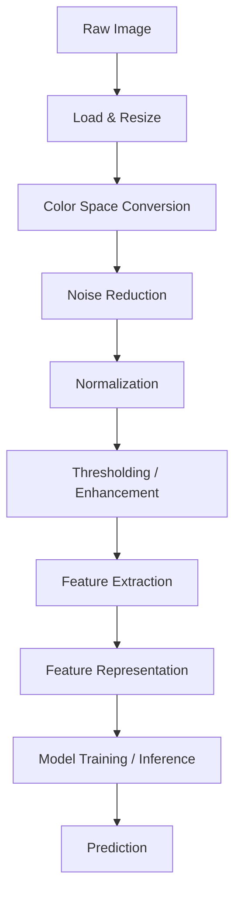

# Computer Vision: A Comprehensive Engineering Guide

> A production-quality deep learning resource, practical engineering guide, and real-world project handbook for Computer Vision using classical techniques and machine learning.

---

## What You Will Learn

- Foundational image processing: reading, writing, color spaces, resizing, normalization, thresholding
- Feature detection and description: edges, corners, keypoints, descriptors (SIFT, SURF, ORB)
- Image transformations: geometric, filtering, morphological, and intensity operations
- Building a complete CV pipeline from acquisition to inference
- Training classical ML models (SVM, kNN, Random Forest, Naive Bayes) on image features
- Two end-to-end real-world projects with full code pipelines
- Deployment strategies for CV systems

## Who This Is For

- Junior/mid engineers entering computer vision
- ML practitioners expanding into image-based systems
- Anyone building production CV pipelines without deep learning (CNNs)
- Interview candidates preparing for CV/ML roles

---

## Table of Contents

1. [Image Basics](#1-image-basics)
   - [Image Reading & Writing](#11-image-reading--writing)
   - [Grayscale Conversion](#12-grayscale-conversion)
   - [Color Space Conversion](#13-color-space-conversion)
   - [Image Resizing & Interpolation](#14-image-resizing--interpolation)
   - [Image Normalization](#15-image-normalization)
   - [Image Thresholding](#16-image-thresholding)
2. [Feature Detection](#2-feature-detection)
   - [Edge Detection](#21-edge-detection)
   - [Corner & Keypoint Detection](#22-corner--keypoint-detection)
   - [Feature Descriptors](#23-feature-descriptors)
3. [Image Transformation](#3-image-transformation)
   - [Geometric Transformations](#31-geometric-transformations)
   - [Filtering & Smoothing](#32-filtering--smoothing)
   - [Morphological Operations](#33-morphological-operations)
   - [Intensity Transformations](#34-intensity-transformations)
4. [CV Pipeline](#4-cv-pipeline)
   - [Acquisition & Preprocessing](#41-acquisition--preprocessing)
   - [Feature Extraction](#42-feature-extraction)
   - [Feature Representation](#43-feature-representation)
   - [Model Training](#44-model-training-on-image-features)
   - [Prediction & Inference](#45-prediction--inference)
   - [Evaluation](#46-evaluation)
5. [Cross-Topic Relationships](#5-cross-topic-relationships)
6. [End-to-End Projects](#6-end-to-end-projects)
   - [Project 1: Document Scanner & Classifier](#project-1-document-scanner--classifier)
   - [Project 2: Defect Detection on Manufacturing Parts](#project-2-defect-detection-on-manufacturing-parts)
7. [Algorithm Comparison Tables](#7-algorithm-comparison-tables)
8. [Common Mistakes & Pitfalls](#8-common-mistakes--pitfalls)
9. [Interview Preparation](#9-interview-preparation)
10. [Resources](#10-resources)

---

# 1. Image Basics

## 1.1 Image Reading & Writing

### a. Intuition

Think of a digital image as a 2D grid of pixels. Each pixel holds intensity values — one number for grayscale, three numbers (R, G, B) for color. Reading an image means loading this grid into memory as a NumPy array. Writing means saving that array back to disk.

The two most common libraries are **OpenCV** (fast, C++ backed, BGR channel order) and **PIL/Pillow** (Python-native, RGB order). This ordering difference is a classic source of bugs.

### b. Mathematical Insight

A color image is a 3D tensor:

```
Image ∈ R^(H × W × C)
```

Where:
- `H` = height (rows/pixels)
- `W` = width (columns/pixels)
- `C` = channels (3 for RGB/BGR, 1 for grayscale)

Each pixel value typically lives in `[0, 255]` for uint8 images.

### c. How It Works (Step-by-Step)

1. File on disk (JPEG/PNG) is compressed binary data
2. Library decodes it into raw pixel values
3. Values are placed into a NumPy array of shape `(H, W, C)`
4. You manipulate the array in memory
5. On write, the array is re-encoded and saved

### d. Visual Representation

```
Image File (JPEG/PNG)
        |
    cv2.imread()
        |
        v
 NumPy Array: shape (H, W, 3)
 ┌───────────────────────────┐
 │ [[[B, G, R], [B, G, R]]   │  ← row 0
 │  [[B, G, R], [B, G, R]]   │  ← row 1
 │   ...                    ]│
 └───────────────────────────┘
        |
    cv2.imwrite()
        |
   File on disk
```

### e. Python Implementation

```python
import cv2
import numpy as np
from PIL import Image

# ─── OpenCV: Note BGR channel order ───────────────────────────────────────────
img_bgr = cv2.imread("image.jpg")          # Returns (H, W, 3) uint8 in BGR
print(f"Shape: {img_bgr.shape}")           # e.g., (480, 640, 3)
print(f"Dtype: {img_bgr.dtype}")           # uint8

# Convert BGR → RGB for display or PIL interop
img_rgb = cv2.cvtColor(img_bgr, cv2.COLOR_BGR2RGB)

# Write image
cv2.imwrite("output.jpg", img_bgr)
cv2.imwrite("output.png", img_bgr)         # PNG is lossless

# ─── PIL/Pillow: Note RGB channel order ───────────────────────────────────────
img_pil = Image.open("image.jpg")          # Returns PIL Image object (RGB)
img_array = np.array(img_pil)              # Convert to numpy: (H, W, 3) RGB
img_pil.save("output_pil.jpg")

# ─── Cross-library interop ────────────────────────────────────────────────────
# PIL → OpenCV
img_cv = cv2.cvtColor(np.array(img_pil), cv2.COLOR_RGB2BGR)

# OpenCV → PIL
img_pil2 = Image.fromarray(cv2.cvtColor(img_bgr, cv2.COLOR_BGR2RGB))

# ─── Reading specific channels ────────────────────────────────────────────────
B, G, R = cv2.split(img_bgr)              # Split channels
img_reconstructed = cv2.merge([B, G, R])  # Merge channels back
```

### f. When to Use / Avoid

| Scenario | Recommendation |
|---|---|
| High-performance batch processing | OpenCV (faster decode) |
| Integration with web/display (RGB expected) | PIL or convert from BGR |
| Scientific computing / NumPy pipelines | Either; ensure correct channel order |
| Video frame reading | OpenCV (`cv2.VideoCapture`) |

**Avoid:** Mixing BGR and RGB without explicit conversion — colors will look wrong and models trained on one convention will fail on the other.

### g. Key Parameters

- `cv2.IMREAD_COLOR` (default): loads 3-channel BGR
- `cv2.IMREAD_GRAYSCALE`: loads 1-channel grayscale
- `cv2.IMREAD_UNCHANGED`: preserves alpha channel (4-channel RGBA PNGs)
- JPEG quality (0-100) on write: higher = larger file, less compression artifact

---

## 1.2 Grayscale Conversion

### a. Intuition

Color images have three channels. Many CV tasks (edge detection, thresholding, feature detection) work on single-channel intensity maps. Grayscale conversion collapses 3 channels into 1 while preserving perceived brightness.

The human eye is not equally sensitive to all colors — we see green best, blue least. The conversion formula reflects this perceptual weighting.

### b. Mathematical Insight

The standard ITU-R BT.601 luminance formula:

```
Gray = 0.299 × R + 0.587 × G + 0.114 × B
```

Simple averaging (`(R+G+B)/3`) is faster but perceptually inaccurate — it makes blue objects appear brighter than they look to human eyes.

### c. How It Works

1. For each pixel, read R, G, B values
2. Apply weighted sum: `0.299*R + 0.587*G + 0.114*B`
3. Store single float → round/cast to uint8
4. Result is shape `(H, W)` instead of `(H, W, 3)`

### d. Visual Representation

```
Color Image (H × W × 3)          Grayscale (H × W)
┌─────────────────────┐           ┌─────────────────┐
│ R=200, G=100, B=50  │  ──────>  │  L = 127        │
│ R=30,  G=200, B=10  │           │  L = 155        │
│ ...                 │           │  ...            │
└─────────────────────┘           └─────────────────┘
    3 values / pixel                1 value / pixel
```

### e. Python Implementation

```python
import cv2
import numpy as np
from PIL import Image

img_bgr = cv2.imread("image.jpg")

# ─── Method 1: OpenCV (preferred, uses BT.601 weights) ────────────────────────
gray_cv = cv2.cvtColor(img_bgr, cv2.COLOR_BGR2GRAY)
print(f"Grayscale shape: {gray_cv.shape}")  # (H, W) — no channel dim

# ─── Method 2: Manual weighted sum ────────────────────────────────────────────
img_rgb = cv2.cvtColor(img_bgr, cv2.COLOR_BGR2RGB).astype(np.float32)
gray_manual = (0.299 * img_rgb[:, :, 0] +
               0.587 * img_rgb[:, :, 1] +
               0.114 * img_rgb[:, :, 2]).astype(np.uint8)

# ─── Method 3: PIL ────────────────────────────────────────────────────────────
img_pil = Image.open("image.jpg").convert("L")  # "L" = luminance (grayscale)
gray_pil = np.array(img_pil)

# ─── Verify they're equivalent ────────────────────────────────────────────────
print(np.allclose(gray_cv, gray_manual, atol=1))  # True (rounding differences)

# ─── Display with matplotlib ──────────────────────────────────────────────────
import matplotlib.pyplot as plt
fig, axes = plt.subplots(1, 2, figsize=(10, 4))
axes[0].imshow(cv2.cvtColor(img_bgr, cv2.COLOR_BGR2RGB))
axes[0].set_title("Color Image")
axes[1].imshow(gray_cv, cmap='gray')
axes[1].set_title("Grayscale Image")
plt.tight_layout()
plt.show()
```

### f. When to Use / Avoid

- **Use:** Edge detection, thresholding, corner detection, feature descriptors — all benefit from grayscale simplicity
- **Avoid:** Tasks where color is discriminative (e.g., distinguishing ripe from unripe fruit; detecting traffic lights)

---

## 1.3 Color Space Conversion

### a. Intuition

Different color spaces represent color differently, making certain tasks easier. RGB mixes luminance and chrominance — a shadow on a red object changes all three RGB values. HSV separates Hue (what color), Saturation (how vivid), and Value (how bright) — making it easier to isolate colors regardless of lighting.

Think of RGB as mixing paint from three cans. HSV as choosing a paint chip from a color wheel.

### b. Mathematical Insight

**RGB → Grayscale** (already covered above)

**RGB → HSV:**

Given `r, g, b ∈ [0, 1]`:

```
max_c = max(r, g, b)
min_c = min(r, g, b)
delta = max_c - min_c

V = max_c
S = delta / max_c  (if max_c != 0, else 0)
H = depends on which channel is max:
    - if max = r: H = 60 × ((g-b)/delta mod 6)
    - if max = g: H = 60 × ((b-r)/delta + 2)
    - if max = b: H = 60 × ((r-g)/delta + 4)
```

### c. How It Works

1. Normalize pixel values to [0, 1]
2. Compute max, min, delta across channels
3. Derive H, S, V using piecewise formulas
4. Scale to target range (OpenCV: H∈[0,179], S,V∈[0,255])

### d. Visual Representation

```
         RGB Space                   HSV Space
    ┌──────────────────┐        ┌──────────────────┐
    │  R   G   B       │        │  H    S    V     │
    │ 200   0   0  red │  ─>    │  0   255  200    │
    │   0 200   0 green│  ─>    │ 60   255  200    │
    │  50  50  50 gray │  ─>    │  0     0   50    │
    └──────────────────┘        └──────────────────┘
    All channels change          Only V changes
    under brightness shift       under brightness shift
```

### e. Python Implementation

```python
import cv2
import numpy as np

img_bgr = cv2.imread("image.jpg")

# ─── BGR ↔ RGB ─────────────────────────────────────────────────────────────
img_rgb = cv2.cvtColor(img_bgr, cv2.COLOR_BGR2RGB)
img_bgr_back = cv2.cvtColor(img_rgb, cv2.COLOR_RGB2BGR)

# ─── RGB ↔ Grayscale ───────────────────────────────────────────────────────
gray = cv2.cvtColor(img_bgr, cv2.COLOR_BGR2GRAY)

# ─── BGR ↔ HSV ─────────────────────────────────────────────────────────────
img_hsv = cv2.cvtColor(img_bgr, cv2.COLOR_BGR2HSV)
h, s, v = cv2.split(img_hsv)
# OpenCV HSV ranges: H=[0,179], S=[0,255], V=[0,255]

# ─── Color segmentation using HSV ─────────────────────────────────────────
# Example: isolate red objects
lower_red1 = np.array([0, 100, 100])
upper_red1 = np.array([10, 255, 255])
lower_red2 = np.array([160, 100, 100])
upper_red2 = np.array([179, 255, 255])

mask1 = cv2.inRange(img_hsv, lower_red1, upper_red1)
mask2 = cv2.inRange(img_hsv, lower_red2, upper_red2)
red_mask = cv2.bitwise_or(mask1, mask2)
red_segmented = cv2.bitwise_and(img_bgr, img_bgr, mask=red_mask)

# ─── LAB color space: perceptually uniform ────────────────────────────────
img_lab = cv2.cvtColor(img_bgr, cv2.COLOR_BGR2LAB)
# L=lightness, a=green-red axis, b=blue-yellow axis
```

### f. When to Use / Avoid

| Color Space | Best For | Avoid When |
|---|---|---|
| BGR/RGB | General purpose, CNN input | Color-based segmentation |
| Grayscale | Edge/corner detection, thresholding | Color-discriminative tasks |
| HSV | Color-based segmentation, tracking | Precise color matching |
| LAB | Perceptual similarity, color correction | Real-time on embedded systems |

### g. Key Parameters

- HSV thresholds for `cv2.inRange()` — tune H range for your target color, keep S,V high to avoid whites/blacks

---

## 1.4 Image Resizing & Interpolation

### a. Intuition

Resizing changes the number of pixels. Making an image smaller (downsampling) discards information. Making it bigger (upsampling) invents new pixel values. How you invent those values is the interpolation method.

Think of interpolation like asking: "I know the values at A and C — what should B be?" The answer depends on your assumption about smoothness.

### b. Mathematical Insight

**Bilinear Interpolation** — the workhorse of resizing:

Given a point `(x, y)` in the output that maps to `(x', y')` in the source (non-integer), bilinear interpolation uses the 4 surrounding pixels:

```
f(x', y') ≈ f(x1,y1)(x2-x')(y2-y') + f(x2,y1)(x'-x1)(y2-y')
           + f(x1,y2)(x2-x')(y'-y1) + f(x2,y2)(x'-x1)(y'-y1)
```
(normalized by area of the 2×2 cell)

This is linear interpolation applied twice — once horizontally, once vertically.

### c. How It Works

1. Compute scaling factors: `scale_x = new_W / old_W`, `scale_y = new_H / old_H`
2. For each output pixel `(i, j)`, compute source location `(i/scale_y, j/scale_x)`
3. Source location is non-integer → apply interpolation using neighbors
4. Place result at `(i, j)` in output image

### d. Visual Representation

```
Nearest Neighbor (blocky)      Bilinear (smooth)

Original 2×2:                  Interpolated 4×4:
┌───┬───┐                      ┌───┬───┬───┬───┐
│ 0 │255│                      │ 0 │ 64│191│255│
├───┼───┤         →            ├───┼───┼───┼───┤
│128│ 64│                      │ 32│ 64│159│207│
└───┴───┘                      ├───┼───┼───┼───┤
                               │ 96│112│ 96│ 96│
                               ├───┼───┼───┼───┤
                               │128│120│ 80│ 64│
                               └───┴───┴───┴───┘
 NN: copies nearest pixel       BL: blends neighbors
```

### e. Python Implementation

```python
import cv2
import numpy as np

img = cv2.imread("image.jpg")
h, w = img.shape[:2]

# ─── Fixed dimensions ─────────────────────────────────────────────────────────
target_w, target_h = 224, 224   # e.g., for ML model input

# Nearest Neighbor: fastest, no blurring, pixelated
resized_nn = cv2.resize(img, (target_w, target_h),
                         interpolation=cv2.INTER_NEAREST)

# Bilinear: good default for downsampling
resized_bl = cv2.resize(img, (target_w, target_h),
                         interpolation=cv2.INTER_LINEAR)

# Bicubic: smoother upsampling, uses 4×4 neighborhood
resized_bc = cv2.resize(img, (target_w, target_h),
                         interpolation=cv2.INTER_CUBIC)

# Area: best for downsampling (avoids moiré patterns)
resized_area = cv2.resize(img, (target_w, target_h),
                           interpolation=cv2.INTER_AREA)

# ─── Scale by factor ──────────────────────────────────────────────────────────
# 50% of original size
resized_half = cv2.resize(img, None, fx=0.5, fy=0.5,
                           interpolation=cv2.INTER_AREA)

# 2× of original size
resized_double = cv2.resize(img, None, fx=2.0, fy=2.0,
                             interpolation=cv2.INTER_CUBIC)

# ─── Aspect-ratio preserving resize ──────────────────────────────────────────
def resize_with_aspect(img, target_size):
    """Resize longest edge to target_size, preserving aspect ratio."""
    h, w = img.shape[:2]
    scale = target_size / max(h, w)
    new_w, new_h = int(w * scale), int(h * scale)
    return cv2.resize(img, (new_w, new_h), interpolation=cv2.INTER_AREA)

img_resized = resize_with_aspect(img, 224)

# ─── Resize + pad to square (common for ML) ──────────────────────────────────
def resize_and_pad(img, target_size, pad_value=0):
    """Resize to target_size × target_size with zero-padding."""
    img_r = resize_with_aspect(img, target_size)
    h, w = img_r.shape[:2]
    pad_h = (target_size - h) // 2
    pad_w = (target_size - w) // 2
    padded = cv2.copyMakeBorder(img_r, pad_h, target_size-h-pad_h,
                                 pad_w, target_size-w-pad_w,
                                 cv2.BORDER_CONSTANT, value=pad_value)
    return padded

img_padded = resize_and_pad(img, 224)
```

### f. When to Use / Avoid

| Method | Use When | Avoid |
|---|---|---|
| INTER_NEAREST | Speed critical, binary masks, annotations | Upsampling photos |
| INTER_LINEAR | General downsampling, real-time | High-quality upsampling |
| INTER_CUBIC | Upsampling (better quality) | Very large images (slow) |
| INTER_AREA | Downsampling (anti-aliased) | Upsampling |

### g. Key Hyperparameters

- Target dimensions must match model's expected input (e.g., 224×224 for VGG/ResNet)
- Always resize annotations (bounding boxes, masks) by the same scale factors

---

## 1.5 Image Normalization

### a. Intuition

Raw pixel values are in [0, 255]. ML models train better when inputs are in a smaller range like [0, 1] or [-1, 1]. Normalization makes gradients more stable, prevents one feature from dominating, and speeds up convergence.

Think of it like unit conversion: a model shouldn't treat "255 pixels" as numerically 255× more important than "1 pixel."

### b. Mathematical Insight

**Min-Max Normalization:**
```
x_norm = (x - x_min) / (x_max - x_min)
```

**Standardization (Z-score):**
```
x_std = (x - μ) / σ
```
Where `μ` = mean, `σ` = standard deviation.

**ImageNet normalization** (standard for pre-trained models):
```
mean = [0.485, 0.456, 0.406]  # per channel RGB
std  = [0.229, 0.224, 0.225]
```

### c. How It Works

1. Convert image to float32 (uint8 math overflows)
2. Divide by 255 to bring to [0, 1]
3. Optionally subtract channel means and divide by channel stds
4. Result: float array with values typically in [-2, 2] for standardized

### e. Python Implementation

```python
import cv2
import numpy as np

img = cv2.imread("image.jpg")
img_rgb = cv2.cvtColor(img, cv2.COLOR_BGR2RGB)

# ─── Simple [0, 1] normalization ──────────────────────────────────────────────
img_norm = img_rgb.astype(np.float32) / 255.0

# ─── [−1, 1] normalization (common for GANs) ─────────────────────────────────
img_norm_11 = img_norm * 2.0 - 1.0

# ─── Per-image standardization ────────────────────────────────────────────────
img_float = img_rgb.astype(np.float32) / 255.0
mean = img_float.mean(axis=(0, 1))   # shape (3,)
std  = img_float.std(axis=(0, 1))    # shape (3,)
img_standardized = (img_float - mean) / (std + 1e-8)

# ─── ImageNet normalization (for transfer learning features) ──────────────────
imagenet_mean = np.array([0.485, 0.456, 0.406], dtype=np.float32)
imagenet_std  = np.array([0.229, 0.224, 0.225], dtype=np.float32)
img_imagenet = (img_float - imagenet_mean) / imagenet_std

# ─── Batch normalization (N images) ──────────────────────────────────────────
def normalize_batch(images: np.ndarray, mean=None, std=None):
    """
    images: np.ndarray of shape (N, H, W, C), uint8
    Returns: float32 normalized array
    """
    imgs = images.astype(np.float32) / 255.0
    if mean is None:
        mean = imgs.mean(axis=(0, 1, 2))  # per-channel mean across batch
    if std is None:
        std = imgs.std(axis=(0, 1, 2))
    return (imgs - mean) / (std + 1e-8), mean, std
```

### f. When to Use / Avoid

- **Always normalize** before feeding into ML/statistical models
- **ImageNet normalization** when using pre-trained feature extractors
- **Don't normalize** annotation masks or label images — they should stay integer class IDs

---

## 1.6 Image Thresholding

### a. Intuition

Thresholding converts a grayscale image into a binary (black/white) image by asking: "Is this pixel brighter or darker than a threshold?" It's the simplest form of segmentation.

**Binary thresholding** uses a global value. **Adaptive thresholding** computes a local threshold for each region, handling images with uneven lighting.

### b. Mathematical Insight

**Binary threshold:**
```
dst(x,y) = maxval  if src(x,y) > T
           0        otherwise
```

**Adaptive (mean):** For each pixel, T = mean of (blockSize×blockSize) neighborhood minus C

```
T(x,y) = mean(neighborhood(x,y)) - C
```

### c. How It Works

1. Convert to grayscale (thresholding requires single channel)
2. For global: choose T (manually or via Otsu's algorithm)
3. For adaptive: compute local statistics in sliding window
4. Apply comparison; assign maxval or 0

**Otsu's method** automatically finds the optimal T by minimizing intra-class variance (between-class variance is maximized). Works best when the histogram is bimodal.

### d. Visual Representation

```
Grayscale Image       Binary (T=127)         Adaptive Binary

 50  60 200 210        0   0  255  255         0   0  255  255
 55  65 195 205   →    0   0  255  255    →    0   0  255  255
 80  90  40  50        0   0   0    0          255 255  0    0
 85  95  35  45        0   0   0    0          255 255  0    0

Global T=127: midpoint              Adaptive: adjusts per region
```

### e. Python Implementation

```python
import cv2
import numpy as np
import matplotlib.pyplot as plt

img = cv2.imread("image.jpg")
gray = cv2.cvtColor(img, cv2.COLOR_BGR2GRAY)

# ─── Binary Thresholding ──────────────────────────────────────────────────────
T = 127
_, binary = cv2.threshold(gray, T, 255, cv2.THRESH_BINARY)
_, binary_inv = cv2.threshold(gray, T, 255, cv2.THRESH_BINARY_INV)

# ─── Otsu's Thresholding (automatic T selection) ─────────────────────────────
# Works best for bimodal histograms
otsu_T, binary_otsu = cv2.threshold(
    gray, 0, 255, cv2.THRESH_BINARY + cv2.THRESH_OTSU
)
print(f"Otsu's optimal threshold: {otsu_T}")

# ─── Adaptive Thresholding (handles uneven lighting) ─────────────────────────
adaptive_mean = cv2.adaptiveThreshold(
    gray, 255,
    cv2.ADAPTIVE_THRESH_MEAN_C,     # local mean
    cv2.THRESH_BINARY,
    blockSize=11,                   # neighborhood size (odd number)
    C=2                             # constant subtracted from mean
)

adaptive_gaussian = cv2.adaptiveThreshold(
    gray, 255,
    cv2.ADAPTIVE_THRESH_GAUSSIAN_C, # Gaussian-weighted local mean
    cv2.THRESH_BINARY,
    blockSize=11,
    C=2
)

# ─── Visualize all methods ────────────────────────────────────────────────────
titles = ['Original Gray', 'Binary (T=127)', "Otsu's", 'Adaptive Mean', 'Adaptive Gaussian']
images = [gray, binary, binary_otsu, adaptive_mean, adaptive_gaussian]

fig, axes = plt.subplots(1, 5, figsize=(20, 4))
for ax, title, image in zip(axes, titles, images):
    ax.imshow(image, cmap='gray')
    ax.set_title(title)
    ax.axis('off')
plt.tight_layout()
plt.show()
```

### f. When to Use / Avoid

| Method | When to Use | Avoid |
|---|---|---|
| Binary | Clean, uniform lighting | Uneven illumination |
| Otsu's | Bimodal histograms, automatic pipelines | Multimodal distributions |
| Adaptive Mean | Text extraction, variable lighting | Very noisy images |
| Adaptive Gaussian | Document scanning, shadows | Fine detail images |

### g. Key Hyperparameters

- `blockSize`: larger = smoother local threshold, less sensitive to noise (must be odd)
- `C`: higher = darker threshold (more pixels become 0); tune per-dataset

---

# 2. Feature Detection

## 2.1 Edge Detection

### a. Intuition

Edges are boundaries where pixel intensity changes sharply — they mark object boundaries, texture transitions, and structural lines. Edge detection finds these gradients.

All edge detectors share one idea: **compute the image gradient** (rate of intensity change). Where the gradient is large, there's an edge.

Think of walking across a landscape — flat ground = no edge, cliff face = strong edge.

### b. Mathematical Insight

The image gradient is a vector at each pixel:

```
∇I = [∂I/∂x, ∂I/∂y]

Gradient magnitude: |∇I| = √((∂I/∂x)² + (∂I/∂y)²)
Gradient direction: θ = arctan(∂I/∂y / ∂I/∂x)
```

In practice, derivatives are approximated using convolution with small kernels.

**Sobel X kernel (3×3):**
```
[-1, 0, +1]
[-2, 0, +2]
[-1, 0, +1]
```

**Laplacian kernel (detects zero-crossings):**
```
[0,  1,  0]
[1, -4,  1]
[0,  1,  0]
```

### c. How It Works — Operator by Operator

**Sobel & Prewitt:**
1. Convolve image with Gx kernel (horizontal gradient)
2. Convolve image with Gy kernel (vertical gradient)
3. Compute magnitude = √(Gx² + Gy²)
4. Threshold to get binary edge map

**Roberts Cross:** Uses 2×2 kernels for diagonal gradients (older, less robust)

**Laplacian:** Detects edges as zero-crossings of the second derivative. More sensitive to noise.

**Canny Edge Detector (multi-step pipeline):**
1. **Gaussian blur** to reduce noise
2. **Sobel gradient** computation (magnitude + direction)
3. **Non-maximum suppression** — thin edges to 1 pixel by keeping local maxima along gradient direction
4. **Double thresholding** — strong edges (> high threshold), weak edges (between thresholds)
5. **Edge tracking by hysteresis** — keep weak edges only if connected to strong edges

### d. Visual Representation


### e. Python Implementation

```python
import cv2
import numpy as np
import matplotlib.pyplot as plt

img = cv2.imread("image.jpg")
gray = cv2.cvtColor(img, cv2.COLOR_BGR2GRAY)

# ─── Sobel Operator ────────────────────────────────────────────────────────────
sobelx = cv2.Sobel(gray, cv2.CV_64F, 1, 0, ksize=3)  # horizontal gradient
sobely = cv2.Sobel(gray, cv2.CV_64F, 0, 1, ksize=3)  # vertical gradient
sobel_mag = np.sqrt(sobelx**2 + sobely**2)
sobel_mag = np.clip(sobel_mag, 0, 255).astype(np.uint8)

# ─── Prewitt Operator (manual convolution) ────────────────────────────────────
from scipy import ndimage
prewitt_x = np.array([[-1, 0, 1], [-1, 0, 1], [-1, 0, 1]], dtype=np.float32)
prewitt_y = np.array([[-1, -1, -1], [0, 0, 0], [1, 1, 1]], dtype=np.float32)
gx = ndimage.convolve(gray.astype(np.float32), prewitt_x)
gy = ndimage.convolve(gray.astype(np.float32), prewitt_y)
prewitt_mag = np.sqrt(gx**2 + gy**2).astype(np.uint8)

# ─── Roberts Cross ────────────────────────────────────────────────────────────
roberts_x = np.array([[1, 0], [0, -1]], dtype=np.float32)
roberts_y = np.array([[0, 1], [-1, 0]], dtype=np.float32)
rx = ndimage.convolve(gray.astype(np.float32), roberts_x)
ry = ndimage.convolve(gray.astype(np.float32), roberts_y)
roberts_mag = np.sqrt(rx**2 + ry**2).astype(np.uint8)

# ─── Laplacian ────────────────────────────────────────────────────────────────
laplacian = cv2.Laplacian(gray, cv2.CV_64F, ksize=3)
laplacian_abs = np.uint8(np.absolute(laplacian))

# ─── Canny Edge Detector (recommended for most tasks) ────────────────────────
# Step 1: Optional blur (Canny includes internal Gaussian, but extra helps)
blurred = cv2.GaussianBlur(gray, (5, 5), 1.4)

# Step 2: Canny with low and high thresholds
edges_canny = cv2.Canny(blurred, threshold1=50, threshold2=150)
# Rule of thumb: high_threshold ≈ 2–3× low_threshold

# ─── Auto Canny: threshold based on median pixel value ───────────────────────
def auto_canny(image, sigma=0.33):
    """Automatically compute Canny thresholds from image median."""
    v = np.median(image)
    lower = int(max(0, (1.0 - sigma) * v))
    upper = int(min(255, (1.0 + sigma) * v))
    return cv2.Canny(image, lower, upper)

edges_auto = auto_canny(gray)

# ─── Visualize ────────────────────────────────────────────────────────────────
results = {
    'Original': gray,
    'Sobel': sobel_mag,
    'Prewitt': prewitt_mag,
    'Roberts': roberts_mag,
    'Laplacian': laplacian_abs,
    'Canny': edges_canny,
    'Auto-Canny': edges_auto,
}

fig, axes = plt.subplots(2, 4, figsize=(18, 9))
for ax, (title, img_show) in zip(axes.flatten(), results.items()):
    ax.imshow(img_show, cmap='gray')
    ax.set_title(title)
    ax.axis('off')
plt.tight_layout()
plt.show()
```

### f. When to Use / Avoid

| Detector | Strengths | Weaknesses |
|---|---|---|
| Sobel | Simple, directional gradient | Thick edges, noise-sensitive |
| Prewitt | Similar to Sobel, slight differences | Less popular in modern code |
| Roberts | Very fast | Noisy, rarely used today |
| Laplacian | Detects fine detail | Extremely noise-sensitive |
| **Canny** | **Gold standard**, thin edges, tunable | More parameters to tune |

### g. Key Hyperparameters (Canny)

- `threshold1` (low): pixels below this are rejected
- `threshold2` (high): pixels above this are strong edges
- `apertureSize`: Sobel kernel size (3, 5, or 7) — larger detects coarser edges
- Pre-blur kernel size: larger = more noise suppression but loses fine edges

---

## 2.2 Corner & Keypoint Detection

### a. Intuition

Corners are points where two edges meet — they're distinctive because they can't be confused with points along an edge. For matching images across views or tracking objects, corners are far more reliable than edge points.

Imagine sliding a window around the image. On flat regions: all directions look the same. On edges: one direction looks the same. On corners: **every direction looks different** — that's what makes them unique and trackable.

### b. Mathematical Insight

**Harris Corner Response:**

```
M = Σ w(x,y) × [Ix²   IxIy]
                [IxIy  Iy²]

R = det(M) - k × trace(M)²
  = λ₁λ₂ - k(λ₁ + λ₂)²
```

Where:
- `Ix, Iy` = image gradients
- `λ₁, λ₂` = eigenvalues of M
- `k` ≈ 0.04–0.06 (empirical constant)
- `R > 0` → corner, `R < 0` → edge, `|R| small` → flat region

**Shi-Tomasi** uses `R = min(λ₁, λ₂)` — selects pixels where the *smaller* eigenvalue is large (more stable numerically).

### c. How It Works

**Harris:**
1. Compute gradients Ix, Iy using Sobel
2. Compute products Ix², Iy², IxIy
3. Apply Gaussian weighting to get matrix M
4. Compute response R for each pixel
5. Apply threshold and non-maximum suppression

**Shi-Tomasi:**
Same as Harris but uses min(λ₁, λ₂) as response

**FAST (Features from Accelerated Segment Test):**
1. For each candidate pixel p with intensity I(p)
2. Check 16 pixels on a circle of radius 3
3. If N consecutive pixels are all brighter than I(p)+t or all darker than I(p)-t → corner
4. Machine learning variant (FAST-9) learns which pixels to check first for speed

### d. Visual Representation

```
Corner response landscape:

    Flat region:          Edge:                Corner:
    λ₁ small              λ₁ >> λ₂             λ₁ ≈ λ₂ (both large)
    λ₂ small              (one large, one small) R > 0
    |R| small             R < 0
```

### e. Python Implementation

```python
import cv2
import numpy as np
import matplotlib.pyplot as plt

img = cv2.imread("image.jpg")
gray = cv2.cvtColor(img, cv2.COLOR_BGR2GRAY).astype(np.float32)

# ─── Harris Corner Detector ───────────────────────────────────────────────────
harris_response = cv2.cornerHarris(
    gray,
    blockSize=2,     # neighborhood size for M
    ksize=3,         # Sobel kernel size
    k=0.04           # Harris free parameter
)
# Dilate to mark corners more visibly
harris_response = cv2.dilate(harris_response, None)

# Mark corners on image
img_harris = img.copy()
threshold = 0.01 * harris_response.max()
img_harris[harris_response > threshold] = [0, 0, 255]  # Red corners

# ─── Shi-Tomasi Corner Detector ───────────────────────────────────────────────
corners_st = cv2.goodFeaturesToTrack(
    gray,
    maxCorners=100,   # maximum number of corners to return
    qualityLevel=0.01, # below (max_response * qualityLevel) corners rejected
    minDistance=10    # minimum Euclidean distance between corners
)

img_st = img.copy()
if corners_st is not None:
    corners_st = np.int32(corners_st)
    for corner in corners_st:
        x, y = corner.ravel()
        cv2.circle(img_st, (x, y), 3, (0, 255, 0), -1)

# ─── FAST Detector ────────────────────────────────────────────────────────────
fast = cv2.FastFeatureDetector_create(threshold=25, nonmaxSuppression=True)
keypoints_fast = fast.detect(gray.astype(np.uint8), None)

img_fast = img.copy()
img_fast = cv2.drawKeypoints(img_fast, keypoints_fast, None,
                              color=(255, 0, 0))

# ─── Visualize ────────────────────────────────────────────────────────────────
fig, axes = plt.subplots(1, 3, figsize=(15, 5))
for ax, (title, image) in zip(axes, [
    ('Harris Corners', img_harris),
    ('Shi-Tomasi Corners', img_st),
    ('FAST Keypoints', img_fast)
]):
    ax.imshow(cv2.cvtColor(image, cv2.COLOR_BGR2RGB))
    ax.set_title(title)
    ax.axis('off')
plt.tight_layout()
plt.show()
```

### f. When to Use / Avoid

| Detector | Best For | Avoid |
|---|---|---|
| Harris | Educational, research | Real-time (slower) |
| Shi-Tomasi | Optical flow, tracking | Needs many corners |
| FAST | Real-time, mobile | Noisy images without non-max suppression |

### g. Key Hyperparameters

- `blockSize` (Harris): larger = smoother response (less noise sensitive)
- `qualityLevel` (Shi-Tomasi): lower = more corners (0.01–0.1 typical)
- `minDistance`: prevents clustered detections
- FAST `threshold`: higher = fewer, more reliable corners

---

## 2.3 Feature Descriptors

### a. Intuition

A keypoint tells you *where* something is. A descriptor tells you *what* it looks like. Descriptors encode local image appearance into a vector that can be compared across images — even under rotation, scale, or lighting changes.

Think of a descriptor as a fingerprint for a local image patch. Good descriptors are distinctive (unique to that location) and invariant (stable under transformations).

### b. Mathematical Insight

**SIFT Descriptor:**
1. Compute gradient magnitude and orientation in 16×16 patch
2. Divide into 4×4 cells
3. In each cell, build 8-bin orientation histogram
4. Concatenate → 128-dimensional vector
5. Normalize → contrast invariant

**ORB** = FAST keypoints + BRIEF descriptor with rotation correction:
- Binary descriptor: compare pixel pairs → 256-bit string
- Matching uses Hamming distance (XOR + popcount) → very fast

### c. How It Works

**SIFT:**
1. Detect keypoints at multiple scales using Difference of Gaussians (DoG)
2. Assign dominant orientation from gradient histogram
3. Build 128-D descriptor from oriented gradient histograms
4. Normalize for illumination invariance

**SURF:** Approximates SIFT using integral images and box filters — ~3× faster

**ORB:**
1. Detect with FAST, select top N by Harris response
2. Compute orientation via intensity centroid
3. Build rotated BRIEF descriptor (binary)

**BRIEF:** Just step 3 of ORB — no keypoint detection, no orientation. Fast but not rotation-invariant.

### d. Visual Representation

```
SIFT Descriptor Construction:

 16×16 patch around keypoint
 ┌──────────────────────────┐
 │  4×4 cells, each:        │
 │  ┌───┐ ┌───┐ ┌───┐ ┌───┐│
 │  │ 8 │ │ 8 │ │ 8 │ │ 8 ││  4 × 4 × 8 = 128-D vector
 │  │bin│ │bin│ │bin│ │bin││
 │  └───┘ └───┘ └───┘ └───┘│
 │  ...  (4 rows of cells)  │
 └──────────────────────────┘
```

### e. Python Implementation

```python
import cv2
import numpy as np

img = cv2.imread("image.jpg")
gray = cv2.cvtColor(img, cv2.COLOR_BGR2GRAY)

# ─── SIFT ──────────────────────────────────────────────────────────────────────
sift = cv2.SIFT_create(nfeatures=500)
keypoints_sift, descriptors_sift = sift.detectAndCompute(gray, None)
print(f"SIFT: {len(keypoints_sift)} keypoints, descriptor shape: {descriptors_sift.shape}")
# descriptors_sift.shape: (N, 128), float32

# ─── ORB (faster, binary descriptor) ──────────────────────────────────────────
orb = cv2.ORB_create(nfeatures=500)
keypoints_orb, descriptors_orb = orb.detectAndCompute(gray, None)
print(f"ORB: {len(keypoints_orb)} keypoints, descriptor shape: {descriptors_orb.shape}")
# descriptors_orb.shape: (N, 32), uint8 — 256 bits packed

# ─── BRIEF (requires keypoints from another detector) ─────────────────────────
star = cv2.xfeatures2d.StarDetector_create()
brief = cv2.xfeatures2d.BriefDescriptorExtractor_create()
keypoints_star = star.detect(gray, None)
keypoints_star, descriptors_brief = brief.compute(gray, keypoints_star)

# ─── Feature Matching: SIFT (float descriptors, L2 norm) ─────────────────────
img2 = cv2.imread("image2.jpg")
gray2 = cv2.cvtColor(img2, cv2.COLOR_BGR2GRAY)
kp2, desc2 = sift.detectAndCompute(gray2, None)

# BFMatcher with L2 norm for float descriptors
bf = cv2.BFMatcher(cv2.NORM_L2, crossCheck=False)
matches = bf.knnMatch(descriptors_sift, desc2, k=2)

# Lowe's ratio test to filter good matches
good_matches = []
for m, n in matches:
    if m.distance < 0.75 * n.distance:
        good_matches.append(m)

print(f"Good SIFT matches: {len(good_matches)}")

# ─── Feature Matching: ORB (binary descriptors, Hamming distance) ─────────────
kp2_orb, desc2_orb = orb.detectAndCompute(gray2, None)
bf_orb = cv2.BFMatcher(cv2.NORM_HAMMING, crossCheck=True)
matches_orb = bf_orb.match(descriptors_orb, desc2_orb)
matches_orb = sorted(matches_orb, key=lambda x: x.distance)

# ─── Draw matches ──────────────────────────────────────────────────────────────
match_img = cv2.drawMatches(img, keypoints_sift, img2, kp2,
                             good_matches[:50], None,
                             flags=cv2.DrawMatchesFlags_NOT_DRAW_SINGLE_POINTS)
```

### f. When to Use / Avoid

| Descriptor | Strengths | Limitations |
|---|---|---|
| SIFT | Scale & rotation invariant, robust | Slow, patented (free since 2020) |
| SURF | Faster than SIFT, still robust | Patented, less invariant than SIFT |
| ORB | Free, fast, good for real-time | Less robust to scale changes |
| BRIEF | Very fast | Not rotation or scale invariant |

### g. Key Hyperparameters

- `nfeatures`: max keypoints to detect — more = slower + more matches
- SIFT `nOctaveLayers`: layers per scale octave (default 3)
- ORB `scaleFactor` / `nlevels`: pyramid structure for scale invariance
- Lowe's ratio (0.7–0.8): lower = fewer but more reliable matches

---

# 3. Image Transformation

## 3.1 Geometric Transformations

### a. Intuition

Geometric transformations change where pixels are, not what value they have. They're the spatial operations: move, rotate, stretch, warp. All of these are expressed as matrix multiplications on pixel coordinates.

### b. Mathematical Insight

A 2D point `[x, y]` in homogeneous coordinates is `[x, y, 1]`. All geometric transforms are:

```
[x']   [T] × [x]
[y'] =       [y]
[1 ]         [1]
```

**Translation:**
```
T = [[1, 0, tx],
     [0, 1, ty],
     [0, 0,  1]]
```

**Rotation (by angle θ):**
```
T = [[cosθ, -sinθ, 0],
     [sinθ,  cosθ, 0],
     [  0,    0,   1]]
```

**Affine** = translation + rotation + scale + shear (6 DOF, preserves parallel lines)

**Perspective (Homography)** = 8 DOF, can warp planes into different viewpoints (parallel lines not preserved)

### c. How It Works

1. Define transformation matrix (manually or from point correspondences)
2. Apply `warpAffine` or `warpPerspective` — for each output pixel, compute source pixel via inverse mapping
3. Use interpolation to fill values (bilinear default)

### e. Python Implementation

```python
import cv2
import numpy as np

img = cv2.imread("image.jpg")
h, w = img.shape[:2]

# ─── Translation ──────────────────────────────────────────────────────────────
tx, ty = 100, 50   # shift right 100px, down 50px
M_translate = np.float32([[1, 0, tx], [0, 1, ty]])
img_translated = cv2.warpAffine(img, M_translate, (w, h))

# ─── Scaling ──────────────────────────────────────────────────────────────────
# Resize handles scaling better; here for matrix completeness
scale_x, scale_y = 1.5, 1.5
M_scale = np.float32([[scale_x, 0, 0], [0, scale_y, 0]])
img_scaled = cv2.warpAffine(img, M_scale, (int(w*scale_x), int(h*scale_y)))

# ─── Rotation ─────────────────────────────────────────────────────────────────
angle = 45          # degrees, counterclockwise
center = (w // 2, h // 2)
scale = 1.0
M_rotate = cv2.getRotationMatrix2D(center, angle, scale)
img_rotated = cv2.warpAffine(img, M_rotate, (w, h))

# ─── Affine Transformation (3 point correspondences) ─────────────────────────
# Source points (any 3 non-collinear points)
src_pts = np.float32([[0, 0], [w-1, 0], [0, h-1]])
# Destination: apply shear
dst_pts = np.float32([[0, 0], [w-1, 30], [50, h-1]])
M_affine = cv2.getAffineTransform(src_pts, dst_pts)
img_affine = cv2.warpAffine(img, M_affine, (w, h))

# ─── Perspective (Homography) Transformation ──────────────────────────────────
# Requires 4 point correspondences
# Example: dewarp a tilted document
src_pts_h = np.float32([[100, 50], [450, 30], [50, 380], [480, 390]])
dst_pts_h = np.float32([[0, 0], [500, 0], [0, 400], [500, 400]])
H, status = cv2.findHomography(src_pts_h, dst_pts_h)
img_perspective = cv2.warpPerspective(img, H, (500, 400))

# ─── Flip ────────────────────────────────────────────────────────────────────
img_flip_h = cv2.flip(img, 1)   # horizontal
img_flip_v = cv2.flip(img, 0)   # vertical
img_flip_b = cv2.flip(img, -1)  # both
```

### f. When to Use / Avoid

| Transform | Use When |
|---|---|
| Translation | Data augmentation, alignment |
| Rotation | Data augmentation, correcting tilt |
| Affine | Correcting shear, homography approximation |
| Perspective | Document dewarping, AR, bird's eye view |

---

## 3.2 Filtering & Smoothing

### a. Intuition

Filters process neighborhoods of pixels. Smoothing filters reduce noise by averaging neighbors. Each filter has different trade-offs between noise removal and edge preservation.

**Gaussian blur** is the go-to — it's physically motivated (models optical blur) and separable (efficient). **Median** is great for salt-and-pepper noise. **Bilateral** preserves edges while smoothing.

### b. Mathematical Insight

**Convolution:**
```
(f * g)(x, y) = Σᵢ Σⱼ f(i, j) × g(x-i, y-j)
```

**Gaussian kernel (1D):**
```
G(x) = (1 / √(2πσ²)) × exp(-x² / (2σ²))
```

2D kernel is separable: `G(x,y) = G(x) × G(y)`, making it computationally efficient.

**Bilateral filter:**
```
BF[I](p) = (1/Wp) × Σq G_s(|p-q|) × G_r(|I(p)-I(q)|) × I(q)
```

Where:
- `G_s`: spatial Gaussian (distance in image)
- `G_r`: range Gaussian (distance in intensity) — this term prevents blurring across edges

### e. Python Implementation

```python
import cv2
import numpy as np

img = cv2.imread("image.jpg")

# ─── Gaussian Blur ────────────────────────────────────────────────────────────
# (kernel_w, kernel_h) must be odd; sigmaX=0 → auto-computed from kernel size
gaussian_3 = cv2.GaussianBlur(img, (3, 3), 0)    # mild blur
gaussian_9 = cv2.GaussianBlur(img, (9, 9), 0)    # strong blur
gaussian_s2 = cv2.GaussianBlur(img, (9, 9), 2.0) # explicit sigma

# ─── Median Blur: excellent for salt-and-pepper noise ────────────────────────
# kernel size must be odd
median_3 = cv2.medianBlur(img, 3)
median_7 = cv2.medianBlur(img, 7)

# ─── Bilateral Filter: smooths while preserving edges ─────────────────────────
# d: neighborhood diameter; sigmaColor: color range; sigmaSpace: spatial range
bilateral = cv2.bilateralFilter(img,
                                d=9,
                                sigmaColor=75,
                                sigmaSpace=75)

# ─── Compare on noisy image ───────────────────────────────────────────────────
# Add salt & pepper noise
noise = np.zeros_like(img)
cv2.randu(noise, 0, 255)
noisy = np.where(noise < 20, 0, np.where(noise > 235, 255, img)).astype(np.uint8)

fig, axes = plt.subplots(1, 4, figsize=(16, 4))
for ax, (title, image) in zip(axes, [
    ('Noisy', noisy),
    ('Gaussian', cv2.GaussianBlur(noisy, (5,5), 0)),
    ('Median (best for S&P)', cv2.medianBlur(noisy, 5)),
    ('Bilateral (edge-preserving)', cv2.bilateralFilter(noisy, 9, 75, 75)),
]):
    ax.imshow(cv2.cvtColor(image, cv2.COLOR_BGR2RGB))
    ax.set_title(title); ax.axis('off')
plt.tight_layout(); plt.show()
```

### f. When to Use / Avoid

| Filter | Best For | Avoid |
|---|---|---|
| Gaussian | General preprocessing, pre-Canny | Salt-and-pepper noise |
| Median | Salt-and-pepper noise | Gaussian noise |
| Bilateral | Denoising while keeping edges | Real-time (slow) |

### g. Key Hyperparameters

- Gaussian kernel size: larger = more blur (must be odd)
- `sigmaColor` (bilateral): larger = blends more colors across edges
- `sigmaSpace` (bilateral): larger = blends larger spatial area

---

## 3.3 Morphological Operations

### a. Intuition

Morphological operations work on binary images using a structuring element (like a shaped kernel). They add or remove pixels based on the shape's fit.

Think of erosion as shrinking shapes (removing thin protrusions), dilation as growing them. Opening (erosion then dilation) removes small noise. Closing (dilation then erosion) fills small holes.

### b. Mathematical Insight

**Erosion:** `A ⊖ B = {z | Bz ⊆ A}` — pixel kept if structuring element B fits entirely within A

**Dilation:** `A ⊕ B = {z | B̂z ∩ A ≠ ∅}` — pixel set if B hits A at any point

**Opening:** `A ∘ B = (A ⊖ B) ⊕ B` — removes small bright objects

**Closing:** `A • B = (A ⊕ B) ⊖ B` — fills small dark holes

### e. Python Implementation

```python
import cv2
import numpy as np

img = cv2.imread("image.jpg")
gray = cv2.cvtColor(img, cv2.COLOR_BGR2GRAY)
_, binary = cv2.threshold(gray, 127, 255, cv2.THRESH_BINARY)

# ─── Structuring elements ─────────────────────────────────────────────────────
kernel_rect = cv2.getStructuringElement(cv2.MORPH_RECT, (5, 5))
kernel_ellipse = cv2.getStructuringElement(cv2.MORPH_ELLIPSE, (5, 5))
kernel_cross = cv2.getStructuringElement(cv2.MORPH_CROSS, (5, 5))

# ─── Basic operations ─────────────────────────────────────────────────────────
eroded = cv2.erode(binary, kernel_rect, iterations=1)
dilated = cv2.dilate(binary, kernel_rect, iterations=1)

# ─── Compound operations ──────────────────────────────────────────────────────
opened = cv2.morphologyEx(binary, cv2.MORPH_OPEN, kernel_rect)   # remove noise
closed = cv2.morphologyEx(binary, cv2.MORPH_CLOSE, kernel_rect)  # fill holes
gradient = cv2.morphologyEx(binary, cv2.MORPH_GRADIENT, kernel_rect)  # edge-like
tophat = cv2.morphologyEx(binary, cv2.MORPH_TOPHAT, kernel_rect)  # src - opened
blackhat = cv2.morphologyEx(binary, cv2.MORPH_BLACKHAT, kernel_rect) # closed - src

# ─── Practical: remove noise from thresholded document ───────────────────────
def clean_binary(binary_img, noise_size=3, gap_size=5):
    """Remove small noise spots then fill small gaps."""
    k_noise = cv2.getStructuringElement(cv2.MORPH_RECT, (noise_size, noise_size))
    k_gap = cv2.getStructuringElement(cv2.MORPH_RECT, (gap_size, gap_size))
    cleaned = cv2.morphologyEx(binary_img, cv2.MORPH_OPEN, k_noise)
    cleaned = cv2.morphologyEx(cleaned, cv2.MORPH_CLOSE, k_gap)
    return cleaned
```

### f. When to Use / Avoid

| Operation | Use When |
|---|---|
| Erosion | Separate touching objects, shrink blobs |
| Dilation | Connect broken components, expand blobs |
| Opening | Remove small noise in binary images |
| Closing | Fill holes, connect nearby components |

---

## 3.4 Intensity Transformations

### a. Intuition

Histogram equalization redistributes pixel intensities to use the full [0, 255] range. If an image is washed out (all pixels clustered in a narrow range), equalization stretches the histogram for better contrast.

### b. Mathematical Insight

The cumulative distribution function (CDF) of the pixel histogram is used as the mapping:

```
T(v) = round((CDF(v) - CDF_min) / (M×N - CDF_min) × (L-1))
```

Where L = 256 levels, M×N = total pixels.

### e. Python Implementation

```python
import cv2
import numpy as np

img = cv2.imread("image.jpg")
gray = cv2.cvtColor(img, cv2.COLOR_BGR2GRAY)

# ─── Histogram Equalization (global) ─────────────────────────────────────────
equalized = cv2.equalizeHist(gray)

# ─── CLAHE: Contrast Limited Adaptive Histogram Equalization ─────────────────
# Better than global: works locally, prevents over-amplifying noise
clahe = cv2.createCLAHE(clipLimit=2.0, tileGridSize=(8, 8))
clahe_result = clahe.apply(gray)

# ─── Apply to color image (equalize only V channel in HSV) ───────────────────
img_hsv = cv2.cvtColor(img, cv2.COLOR_BGR2HSV)
img_hsv[:, :, 2] = cv2.equalizeHist(img_hsv[:, :, 2])
img_equalized_color = cv2.cvtColor(img_hsv, cv2.COLOR_HSV2BGR)
```

---

# 4. CV Pipeline

## 4.1 Acquisition & Preprocessing

### a. Intuition

A CV pipeline is the structured sequence from raw pixel data to a prediction. Every step builds on the previous. Bad preprocessing = bad features = bad model — regardless of how sophisticated the classifier is.



### e. Python Implementation — Preprocessing Module

```python
import cv2
import numpy as np
from typing import Tuple, Optional

class ImagePreprocessor:
    """Standard preprocessing pipeline for classical CV."""

    def __init__(self, target_size: Tuple[int, int] = (224, 224),
                 color_space: str = 'gray',
                 normalize: bool = True):
        self.target_size = target_size
        self.color_space = color_space
        self.normalize = normalize

    def load(self, path: str) -> np.ndarray:
        """Load image from disk."""
        img = cv2.imread(path)
        if img is None:
            raise FileNotFoundError(f"Cannot read: {path}")
        return img

    def resize(self, img: np.ndarray) -> np.ndarray:
        """Resize with aspect-ratio preservation and padding."""
        h, w = img.shape[:2]
        th, tw = self.target_size
        scale = min(tw / w, th / h)
        new_w, new_h = int(w * scale), int(h * scale)
        resized = cv2.resize(img, (new_w, new_h), interpolation=cv2.INTER_AREA)
        # Pad to target size
        padded = np.zeros((th, tw, 3) if img.ndim == 3 else (th, tw), dtype=img.dtype)
        pad_h = (th - new_h) // 2
        pad_w = (tw - new_w) // 2
        if img.ndim == 3:
            padded[pad_h:pad_h+new_h, pad_w:pad_w+new_w] = resized
        else:
            padded[pad_h:pad_h+new_h, pad_w:pad_w+new_w] = resized
        return padded

    def convert_color(self, img: np.ndarray) -> np.ndarray:
        """Convert to target color space."""
        if self.color_space == 'gray':
            return cv2.cvtColor(img, cv2.COLOR_BGR2GRAY)
        elif self.color_space == 'rgb':
            return cv2.cvtColor(img, cv2.COLOR_BGR2RGB)
        elif self.color_space == 'hsv':
            return cv2.cvtColor(img, cv2.COLOR_BGR2HSV)
        return img  # keep BGR

    def denoise(self, img: np.ndarray) -> np.ndarray:
        """Apply Gaussian denoising."""
        return cv2.GaussianBlur(img, (3, 3), 0)

    def normalize_img(self, img: np.ndarray) -> np.ndarray:
        """Normalize to [0, 1]."""
        return img.astype(np.float32) / 255.0

    def process(self, path: str) -> np.ndarray:
        """Full preprocessing pipeline."""
        img = self.load(path)
        img = self.resize(img)
        img = self.convert_color(img)
        img = self.denoise(img)
        if self.normalize:
            img = self.normalize_img(img)
        return img


# Usage
preprocessor = ImagePreprocessor(target_size=(128, 128), color_space='gray')
```

---

## 4.2 Feature Extraction

### a. Intuition

After preprocessing, we extract meaningful descriptors from images. For classical ML, we can't feed raw pixels (100×100 = 10,000 features, most redundant). Feature extraction compresses the image into a compact, meaningful representation.

### b. HOG (Histogram of Oriented Gradients) — Shape Descriptor

HOG is the backbone of many classical CV systems (including the original pedestrian detector). It describes the local gradient orientation distribution in cells, making it robust to illumination changes.

**How HOG Works:**
1. Divide image into small cells (e.g., 8×8 pixels)
2. Compute gradient magnitude and orientation in each cell
3. Build 9-bin orientation histogram per cell
4. Group cells into blocks (e.g., 2×2 cells), normalize across block
5. Concatenate all block histograms → feature vector

### e. Python Implementation — Feature Extraction Module

```python
import cv2
import numpy as np
from skimage.feature import hog
from typing import Tuple, List

class FeatureExtractor:
    """Classical CV feature extractor."""

    def __init__(self, method: str = 'hog'):
        self.method = method
        self._init_detectors()

    def _init_detectors(self):
        self.sift = cv2.SIFT_create(nfeatures=128)
        self.orb = cv2.ORB_create(nfeatures=128)
        self.fast = cv2.FastFeatureDetector_create(threshold=25)

    def extract_hog(self, gray: np.ndarray,
                     orientations: int = 9,
                     pixels_per_cell: Tuple = (8, 8),
                     cells_per_block: Tuple = (2, 2)) -> np.ndarray:
        """
        Extract HOG features.
        gray: single-channel grayscale image (H, W)
        Returns: 1D feature vector
        """
        features = hog(gray,
                       orientations=orientations,
                       pixels_per_cell=pixels_per_cell,
                       cells_per_block=cells_per_block,
                       block_norm='L2-Hys',
                       visualize=False)
        return features

    def extract_edges(self, gray: np.ndarray) -> np.ndarray:
        """Canny edge map as flattened feature."""
        edges = cv2.Canny(gray.astype(np.uint8), 50, 150)
        return edges.flatten().astype(np.float32) / 255.0

    def extract_sift_descriptors(self, gray: np.ndarray) -> np.ndarray:
        """
        Extract SIFT descriptors, aggregate by mean pooling.
        Returns: 128-D mean descriptor
        """
        kps, descs = self.sift.detectAndCompute(gray.astype(np.uint8), None)
        if descs is None or len(descs) == 0:
            return np.zeros(128, dtype=np.float32)
        return descs.mean(axis=0)  # shape (128,)

    def extract_orb_descriptors(self, gray: np.ndarray) -> np.ndarray:
        """Extract ORB descriptors, aggregate by mean."""
        kps, descs = self.orb.detectAndCompute(gray.astype(np.uint8), None)
        if descs is None or len(descs) == 0:
            return np.zeros(256, dtype=np.float32)
        return descs.astype(np.float32).mean(axis=0)

    def extract(self, gray: np.ndarray) -> np.ndarray:
        """Route to selected method."""
        if self.method == 'hog':
            return self.extract_hog(gray)
        elif self.method == 'sift':
            return self.extract_sift_descriptors(gray)
        elif self.method == 'orb':
            return self.extract_orb_descriptors(gray)
        elif self.method == 'edges':
            return self.extract_edges(gray)
        else:
            raise ValueError(f"Unknown method: {self.method}")
```

---

## 4.3 Feature Representation

### a. Bag of Visual Words (BoVW)

### a. Intuition

BoVW borrows from NLP's "Bag of Words." We cluster all descriptor vectors (from SIFT/ORB) across all training images into K visual words (using K-Means). Each image is then represented by a histogram of how many of its descriptors fall near each cluster center.

The result: every image → fixed-length K-dimensional histogram, regardless of how many keypoints it had.

### b. Mathematical Insight

1. Extract descriptors from all training images → matrix `D` of shape `(M, d)` where M = total descriptors
2. K-Means cluster `D` into K centroids → codebook `C` of shape `(K, d)`
3. For test image with descriptors `{d_i}`: assign each `d_i` to nearest centroid
4. Build histogram `h ∈ R^K` where `h[k]` = count of descriptors in cluster k
5. TF-IDF normalize: `h_tfidf[k] = h[k] × log(N / n_k)` where N = total images, n_k = images with word k

### e. Python Implementation

```python
import numpy as np
from sklearn.cluster import MiniBatchKMeans
from sklearn.preprocessing import normalize
import cv2

class BagOfVisualWords:
    """
    Bag of Visual Words representation.
    Uses SIFT descriptors + K-Means codebook + histogram encoding.
    """

    def __init__(self, n_words: int = 100, random_state: int = 42):
        self.n_words = n_words
        self.kmeans = MiniBatchKMeans(n_clusters=n_words,
                                      random_state=random_state,
                                      batch_size=1000)
        self.sift = cv2.SIFT_create(nfeatures=200)
        self.is_fitted = False

    def _get_descriptors(self, gray: np.ndarray) -> np.ndarray:
        """Extract SIFT descriptors from grayscale image."""
        kps, descs = self.sift.detectAndCompute(gray.astype(np.uint8), None)
        return descs  # shape (N, 128) or None

    def fit(self, gray_images: List[np.ndarray]) -> 'BagOfVisualWords':
        """Build codebook from training images."""
        all_descriptors = []
        for gray in gray_images:
            descs = self._get_descriptors(gray)
            if descs is not None:
                all_descriptors.append(descs)

        if not all_descriptors:
            raise ValueError("No descriptors found in training images")

        all_desc_matrix = np.vstack(all_descriptors)  # (M, 128)
        print(f"Training codebook on {all_desc_matrix.shape[0]} descriptors...")
        self.kmeans.fit(all_desc_matrix)
        self.is_fitted = True
        return self

    def transform(self, gray: np.ndarray) -> np.ndarray:
        """Convert image to BoVW histogram."""
        if not self.is_fitted:
            raise RuntimeError("Call fit() first")

        descs = self._get_descriptors(gray)
        if descs is None:
            return np.zeros(self.n_words, dtype=np.float32)

        # Assign each descriptor to nearest visual word
        word_ids = self.kmeans.predict(descs)

        # Build normalized histogram
        hist = np.bincount(word_ids, minlength=self.n_words).astype(np.float32)
        hist /= (hist.sum() + 1e-8)  # L1 normalize
        return hist

    def fit_transform(self, gray_images: List[np.ndarray]) -> np.ndarray:
        """Fit codebook and transform all images."""
        self.fit(gray_images)
        return np.vstack([self.transform(g) for g in gray_images])
```

---

## 4.4 Model Training on Image Features

### a. Intuition

Once images are represented as feature vectors, any classical ML classifier can be applied. The choice depends on your feature type, dataset size, and inference requirements.

For image features:
- **SVM** is historically the strongest performer on HOG/SIFT features
- **kNN** works well with small datasets and good features
- **Random Forest** good for mixed feature types and robustness
- **Naive Bayes** very fast baseline, works surprisingly well with BoVW histograms

### e. Python Implementation — Model Training Module

```python
import numpy as np
import pandas as pd
from sklearn.svm import SVC, LinearSVC
from sklearn.neighbors import KNeighborsClassifier
from sklearn.tree import DecisionTreeClassifier
from sklearn.ensemble import RandomForestClassifier
from sklearn.naive_bayes import GaussianNB, MultinomialNB
from sklearn.linear_model import LogisticRegression
from sklearn.preprocessing import StandardScaler, LabelEncoder
from sklearn.model_selection import cross_val_score, StratifiedKFold
from sklearn.pipeline import Pipeline
import warnings
warnings.filterwarnings('ignore')


def build_models():
    """Return dictionary of pipeline-ready classifiers."""
    return {
        'Logistic Regression': Pipeline([
            ('scaler', StandardScaler()),
            ('clf', LogisticRegression(max_iter=1000, C=1.0))
        ]),
        'Linear SVM': Pipeline([
            ('scaler', StandardScaler()),
            ('clf', LinearSVC(C=1.0, max_iter=2000))
        ]),
        'RBF SVM': Pipeline([
            ('scaler', StandardScaler()),
            ('clf', SVC(kernel='rbf', C=10, gamma='scale', probability=True))
        ]),
        'kNN': Pipeline([
            ('scaler', StandardScaler()),
            ('clf', KNeighborsClassifier(n_neighbors=5, metric='euclidean'))
        ]),
        'Decision Tree': Pipeline([
            ('clf', DecisionTreeClassifier(max_depth=10, random_state=42))
        ]),
        'Random Forest': Pipeline([
            ('clf', RandomForestClassifier(n_estimators=100, max_depth=15,
                                            random_state=42, n_jobs=-1))
        ]),
        'Naive Bayes': Pipeline([
            ('clf', GaussianNB())
        ]),
    }


def evaluate_models(X: np.ndarray, y: np.ndarray, cv: int = 5) -> pd.DataFrame:
    """
    Cross-validate all models and return results DataFrame.
    X: feature matrix (N, F)
    y: labels (N,)
    """
    models = build_models()
    skf = StratifiedKFold(n_splits=cv, shuffle=True, random_state=42)

    results = []
    for name, pipeline in models.items():
        scores = cross_val_score(pipeline, X, y, cv=skf, scoring='accuracy', n_jobs=-1)
        results.append({
            'Model': name,
            'Mean Accuracy': scores.mean(),
            'Std Accuracy': scores.std(),
            'Min': scores.min(),
            'Max': scores.max()
        })
        print(f"{name:25s}: {scores.mean():.4f} ± {scores.std():.4f}")

    results_df = pd.DataFrame(results).sort_values('Mean Accuracy', ascending=False)
    return results_df
```

---

## 4.5 Prediction & Inference

### e. Python Implementation

```python
import numpy as np
import cv2
from sklearn.base import BaseEstimator

class CVClassifier:
    """
    Complete CV classification system:
    preprocessing → feature extraction → model prediction.
    """

    def __init__(self, preprocessor, feature_extractor, model: BaseEstimator,
                 label_encoder=None):
        self.preprocessor = preprocessor
        self.feature_extractor = feature_extractor
        self.model = model
        self.label_encoder = label_encoder

    def predict_single(self, image_path: str) -> dict:
        """Predict class for a single image path."""
        # Preprocess
        img = self.preprocessor.process(image_path)

        # Extract features
        if img.ndim == 3:
            gray = cv2.cvtColor((img * 255).astype(np.uint8), cv2.COLOR_BGR2GRAY)
        else:
            gray = (img * 255).astype(np.uint8)

        features = self.feature_extractor.extract(gray)
        features = features.reshape(1, -1)

        # Predict
        pred_label = self.model.predict(features)[0]
        if hasattr(self.model, 'predict_proba'):
            confidence = self.model.predict_proba(features).max()
        else:
            confidence = None

        if self.label_encoder is not None:
            pred_label = self.label_encoder.inverse_transform([pred_label])[0]

        return {'label': pred_label, 'confidence': confidence}

    def predict_batch(self, image_paths: list) -> list:
        """Predict for a list of image paths."""
        return [self.predict_single(p) for p in image_paths]
```

---

## 4.6 Evaluation

### a. Intuition

Classification metrics help you understand not just "how often was the model right" but also where it fails. Accuracy is misleading with class imbalance. Precision/Recall captures asymmetric costs (false positives vs false negatives).

### b. Mathematical Insight

```
Accuracy  = (TP + TN) / (TP + TN + FP + FN)
Precision = TP / (TP + FP)   → "Of predicted positives, how many were correct?"
Recall    = TP / (TP + FN)   → "Of actual positives, how many did we catch?"
F1        = 2 × (Precision × Recall) / (Precision + Recall)
```

### e. Python Implementation

```python
import numpy as np
import matplotlib.pyplot as plt
import seaborn as sns
from sklearn.metrics import (accuracy_score, precision_score, recall_score,
                              f1_score, confusion_matrix, classification_report,
                              roc_auc_score)
from sklearn.model_selection import StratifiedKFold, cross_val_predict

def evaluate_classifier(model, X: np.ndarray, y: np.ndarray,
                         class_names: list = None, cv: int = 5) -> dict:
    """
    Full evaluation: cross-validation + confusion matrix + report.
    """
    skf = StratifiedKFold(n_splits=cv, shuffle=True, random_state=42)
    y_pred = cross_val_predict(model, X, y, cv=skf)

    # Metrics
    acc = accuracy_score(y, y_pred)
    prec = precision_score(y, y_pred, average='weighted', zero_division=0)
    rec = recall_score(y, y_pred, average='weighted', zero_division=0)
    f1 = f1_score(y, y_pred, average='weighted', zero_division=0)

    print(f"Accuracy:  {acc:.4f}")
    print(f"Precision: {prec:.4f}")
    print(f"Recall:    {rec:.4f}")
    print(f"F1 Score:  {f1:.4f}")
    print()
    print(classification_report(y, y_pred, target_names=class_names, zero_division=0))

    # Confusion matrix
    cm = confusion_matrix(y, y_pred)
    fig, ax = plt.subplots(figsize=(8, 6))
    sns.heatmap(cm, annot=True, fmt='d', cmap='Blues',
                xticklabels=class_names or range(len(np.unique(y))),
                yticklabels=class_names or range(len(np.unique(y))))
    ax.set_xlabel('Predicted'); ax.set_ylabel('Actual')
    ax.set_title('Confusion Matrix')
    plt.tight_layout(); plt.show()

    return {'accuracy': acc, 'precision': prec, 'recall': rec, 'f1': f1,
            'confusion_matrix': cm}
```

---

# 5. Cross-Topic Relationships

Understanding how concepts build on each other is key to engineering good CV systems.

```
Raw Image
    │
    ├── Color Space Conversion ─── enables HSV segmentation
    │
    ├── Normalization ─────────── stabilizes all subsequent processing
    │
    ├── Filtering & Smoothing ─── reduces noise for all detectors below
    │       │
    │       ├── Edge Detection (Canny) ──── uses Gaussian blur internally
    │       │       │
    │       │       └── Canny edges ─── HOG uses similar gradient logic
    │       │
    │       └── Thresholding ──── works better after denoising
    │
    ├── Feature Detection ─── finds WHERE to describe
    │       │
    │       ├── Harris/Shi-Tomasi ─── gradient-based (related to Sobel)
    │       │
    │       └── FAST ─── pixel-comparison based (faster, less accurate)
    │
    └── Feature Descriptors ─── describes WHAT is at each keypoint
            │
            ├── SIFT/SURF ─── float descriptors → L2 matching → SVM/RF
            │
            └── ORB/BRIEF ─── binary descriptors → Hamming matching
```

**Evolution of ideas in classical CV:**

| Stage | Concept | Builds On |
|---|---|---|
| Raw pixels | Direct features (flattened) | Nothing — baseline |
| Gradient features | Sobel → HOG | Gradient direction encodes shape |
| Interest point features | Harris → SIFT | Stable across images |
| Representation | BoVW | NLP bag-of-words adapted for vision |
| Classification | Logistic → SVM → RF | Standard ML, applied to CV features |
| Evaluation | Accuracy → F1 → Cross-val | Addresses class imbalance, overfitting |

**Key insight:** Each feature extraction technique trades off:
- **Discriminability** (how unique is it?)
- **Invariance** (stable under transformations?)
- **Computational cost**

HOG is fast but not scale-invariant. SIFT is slow but scale+rotation invariant. ORB is the pragmatic middle ground.

---

# 6. End-to-End Projects

## Project 1: Document Scanner & Classifier

### a. Problem Statement

A logistics company receives scanned documents (invoices, receipts, shipping labels, contracts). They need to automatically classify incoming scans by type to route them to the correct department. The system must handle real-world scans with lighting variations, skew, and noise.

**Business goal:** Classify document type with ≥85% accuracy on a 5-class problem with <500ms inference per image.

### b. Dataset

**Option 1 — Real dataset:** RVL-CDIP Dataset (Ryerson Vision Lab)
- 400,000 grayscale images, 16 document classes
- Source: https://huggingface.co/datasets/aharley/rvl_cdip
- Kaggle mirror: https://www.kaggle.com/datasets/rvlcdip/rvl-cdip

**Option 2 — Synthetic data** (used below for reproducibility):

```python
import numpy as np
import cv2
from pathlib import Path
import random
import string

def generate_synthetic_documents(n_per_class: int = 200,
                                  output_dir: str = "synthetic_docs",
                                  seed: int = 42):
    """
    Generate simple synthetic document images for 5 classes.
    Classes: invoice, receipt, form, letter, label
    """
    np.random.seed(seed)
    random.seed(seed)
    Path(output_dir).mkdir(exist_ok=True)

    classes = ['invoice', 'receipt', 'form', 'letter', 'label']
    image_paths, labels = [], []

    for cls_idx, cls_name in enumerate(classes):
        cls_dir = Path(output_dir) / cls_name
        cls_dir.mkdir(exist_ok=True)

        for i in range(n_per_class):
            # Create 200×300 white document
            img = np.ones((300, 200, 3), dtype=np.uint8) * 245

            # Add random noise (simulate scanner noise)
            noise = np.random.randint(-10, 10, img.shape, dtype=np.int16)
            img = np.clip(img.astype(np.int16) + noise, 0, 255).astype(np.uint8)

            # Add class-specific patterns
            if cls_name == 'invoice':
                # Header bar
                cv2.rectangle(img, (0, 0), (200, 40), (50, 50, 150), -1)
                cv2.putText(img, "INVOICE", (30, 28), cv2.FONT_HERSHEY_SIMPLEX, 0.8, (255,255,255), 2)
                # Line items (horizontal lines)
                for y in range(80, 250, 20):
                    cv2.line(img, (10, y), (190, y), (180, 180, 180), 1)
                # Numbers (right-aligned values)
                for y in range(90, 250, 20):
                    val = f"${random.randint(10, 999)}.{random.randint(0,99):02d}"
                    cv2.putText(img, val, (120, y), cv2.FONT_HERSHEY_SIMPLEX, 0.3, (50,50,50), 1)

            elif cls_name == 'receipt':
                # Narrow receipt style (centered text)
                cv2.putText(img, "RECEIPT", (50, 30), cv2.FONT_HERSHEY_SIMPLEX, 0.7, (0,0,0), 2)
                cv2.line(img, (10, 40), (190, 40), (0,0,0), 2)
                # Dotted border
                for y in range(50, 280, 8):
                    cv2.line(img, (5, y), (15, y), (0,0,0), 1)
                    cv2.line(img, (185, y), (195, y), (0,0,0), 1)
                # Item list
                for y in range(60, 240, 18):
                    item = ''.join(random.choices(string.ascii_uppercase, k=5))
                    cv2.putText(img, f"{item}  ${random.randint(1,50)}", (20, y),
                                cv2.FONT_HERSHEY_SIMPLEX, 0.25, (0,0,0), 1)

            elif cls_name == 'form':
                # Grid of form fields
                for row in range(4):
                    for col in range(2):
                        x, y = 10 + col*95, 40 + row*60
                        cv2.rectangle(img, (x, y), (x+85, y+40), (0,0,0), 1)
                        cv2.putText(img, f"Field {row*2+col+1}:", (x+2, y-5),
                                    cv2.FONT_HERSHEY_SIMPLEX, 0.25, (50,50,50), 1)

            elif cls_name == 'letter':
                # Letterhead + paragraphs of horizontal lines
                cv2.rectangle(img, (0, 0), (200, 30), (200, 50, 50), -1)
                for y in range(50, 280, 10):
                    line_len = random.randint(100, 180)
                    cv2.line(img, (15, y), (15 + line_len, y), (150,150,150), 1)

            elif cls_name == 'label':
                # Bold border + large centered content
                cv2.rectangle(img, (5, 5), (195, 295), (0,0,0), 4)
                cv2.putText(img, "FRAGILE", (30, 100), cv2.FONT_HERSHEY_SIMPLEX, 1.0, (200,0,0), 3)
                cv2.putText(img, "THIS SIDE UP", (20, 180), cv2.FONT_HERSHEY_SIMPLEX, 0.5, (0,0,0), 2)
                # Barcode simulation
                for x in range(20, 180, random.randint(3, 7)):
                    thickness = random.randint(1, 4)
                    cv2.rectangle(img, (x, 210), (x+thickness, 280), (0,0,0), -1)

            # Add random rotation (scan skew)
            angle = random.uniform(-5, 5)
            center = (100, 150)
            M = cv2.getRotationMatrix2D(center, angle, 1.0)
            img = cv2.warpAffine(img, M, (200, 300))

            # Save
            path = str(cls_dir / f"{cls_name}_{i:04d}.jpg")
            cv2.imwrite(path, img, [cv2.IMWRITE_JPEG_QUALITY, 85])
            image_paths.append(path)
            labels.append(cls_name)

    return image_paths, labels, classes


# Generate dataset
image_paths, labels, class_names = generate_synthetic_documents(n_per_class=200)
print(f"Generated {len(image_paths)} images across {len(class_names)} classes")
```

### c. Step-by-Step Pipeline

**Steps covered:** Data loading → EDA → Feature Engineering → Model selection → Training → Evaluation → Hyperparameter tuning → Final model

### d. Full Code Pipeline

```python
import numpy as np
import pandas as pd
import cv2
import os
import time
import matplotlib.pyplot as plt
import seaborn as sns
from pathlib import Path
from typing import List, Tuple, Dict

from sklearn.preprocessing import LabelEncoder, StandardScaler
from sklearn.model_selection import (train_test_split, StratifiedKFold,
                                      GridSearchCV, cross_val_predict)
from sklearn.pipeline import Pipeline
from sklearn.svm import SVC, LinearSVC
from sklearn.ensemble import RandomForestClassifier
from sklearn.neighbors import KNeighborsClassifier
from sklearn.linear_model import LogisticRegression
from sklearn.naive_bayes import GaussianNB
from sklearn.metrics import (accuracy_score, classification_report,
                              confusion_matrix, f1_score)
from sklearn.decomposition import PCA
from skimage.feature import hog
import warnings
warnings.filterwarnings('ignore')


# ══════════════════════════════════════════════════════════════════════════════
# STEP 1: DATA LOADING
# ══════════════════════════════════════════════════════════════════════════════

def load_dataset(image_paths: List[str], labels: List[str],
                  target_size: Tuple[int,int] = (128, 128)) -> Tuple[np.ndarray, np.ndarray]:
    """
    Load all images, preprocess, and return arrays.
    Returns: (images, labels) where images.shape = (N, H, W)
    """
    images, valid_labels = [], []
    failed = 0
    for path, label in zip(image_paths, labels):
        img = cv2.imread(path)
        if img is None:
            failed += 1
            continue
        # Convert to grayscale
        gray = cv2.cvtColor(img, cv2.COLOR_BGR2GRAY)
        # Resize with aspect-ratio preservation + padding
        h, w = gray.shape
        scale = min(target_size[0]/h, target_size[1]/w)
        new_h, new_w = int(h*scale), int(w*scale)
        resized = cv2.resize(gray, (new_w, new_h), interpolation=cv2.INTER_AREA)
        padded = np.zeros(target_size, dtype=np.uint8)
        ph = (target_size[0] - new_h) // 2
        pw = (target_size[1] - new_w) // 2
        padded[ph:ph+new_h, pw:pw+new_w] = resized
        images.append(padded)
        valid_labels.append(label)

    print(f"Loaded {len(images)} images ({failed} failed)")
    return np.array(images), np.array(valid_labels)


images, labels_arr = load_dataset(image_paths, labels, target_size=(128, 128))


# ══════════════════════════════════════════════════════════════════════════════
# STEP 2: DATA CLEANING
# ══════════════════════════════════════════════════════════════════════════════

def check_data_quality(images: np.ndarray, labels: np.ndarray) -> pd.DataFrame:
    """Basic data quality checks."""
    df = pd.DataFrame({
        'label': labels,
        'mean_intensity': images.reshape(len(images), -1).mean(axis=1),
        'std_intensity': images.reshape(len(images), -1).std(axis=1),
    })
    print("Class distribution:")
    print(df['label'].value_counts())
    print(f"\nShape: {images.shape}")
    print(f"Dtype: {images.dtype}")
    print(f"Intensity range: [{images.min()}, {images.max()}]")

    # Flag potentially blank or corrupt images
    blank_mask = df['std_intensity'] < 5.0
    print(f"\nPotentially blank/corrupt images: {blank_mask.sum()}")

    return df

quality_df = check_data_quality(images, labels_arr)


# ══════════════════════════════════════════════════════════════════════════════
# STEP 3: EXPLORATORY DATA ANALYSIS (EDA)
# ══════════════════════════════════════════════════════════════════════════════

def perform_eda(images: np.ndarray, labels: np.ndarray, class_names: list):
    """Visualize class distribution and sample images."""

    # 3a. Class distribution
    fig, axes = plt.subplots(1, 2, figsize=(14, 5))
    class_counts = pd.Series(labels).value_counts()
    axes[0].bar(class_counts.index, class_counts.values, color='steelblue')
    axes[0].set_title('Class Distribution')
    axes[0].set_ylabel('Count')
    axes[0].tick_params(axis='x', rotation=45)

    # 3b. Sample images per class
    fig2, axes2 = plt.subplots(len(class_names), 5, figsize=(15, 3*len(class_names)))
    for i, cls in enumerate(class_names):
        cls_indices = np.where(labels == cls)[0]
        sample_indices = cls_indices[:5]
        for j, idx in enumerate(sample_indices):
            axes2[i][j].imshow(images[idx], cmap='gray')
            axes2[i][j].set_title(f"{cls}" if j == 0 else "")
            axes2[i][j].axis('off')
    plt.suptitle("Sample Images per Class")
    plt.tight_layout()
    plt.show()

    # 3c. Mean intensity histograms
    fig3, axes3 = plt.subplots(1, len(class_names), figsize=(3*len(class_names), 4))
    for i, cls in enumerate(class_names):
        cls_imgs = images[labels == cls]
        axes3[i].hist(cls_imgs.flatten(), bins=50, color='steelblue', alpha=0.7)
        axes3[i].set_title(f'{cls}\nIntensity Hist')
        axes3[i].set_xlim([0, 255])
    plt.tight_layout()
    plt.show()

perform_eda(images, labels_arr, class_names)


# ══════════════════════════════════════════════════════════════════════════════
# STEP 4: FEATURE ENGINEERING
# ══════════════════════════════════════════════════════════════════════════════

def extract_hog_features(images: np.ndarray,
                          orientations: int = 9,
                          pixels_per_cell: Tuple = (8, 8),
                          cells_per_block: Tuple = (2, 2)) -> np.ndarray:
    """Extract HOG features for all images. Returns (N, feature_dim) array."""
    features = []
    for img in images:
        feat = hog(img,
                   orientations=orientations,
                   pixels_per_cell=pixels_per_cell,
                   cells_per_block=cells_per_block,
                   block_norm='L2-Hys',
                   visualize=False,
                   feature_vector=True)
        features.append(feat)
    return np.array(features, dtype=np.float32)


def extract_edge_features(images: np.ndarray) -> np.ndarray:
    """Extract Canny edge density features."""
    features = []
    for img in images:
        # Apply denoising
        blurred = cv2.GaussianBlur(img, (3, 3), 0)
        edges = cv2.Canny(blurred, 50, 150)
        # Edge density in 4×4 grid of regions
        h, w = edges.shape
        feat = []
        for r in range(4):
            for c in range(4):
                region = edges[r*h//4:(r+1)*h//4, c*w//4:(c+1)*w//4]
                feat.append(region.mean() / 255.0)
        features.append(feat)
    return np.array(features, dtype=np.float32)


def extract_combined_features(images: np.ndarray) -> np.ndarray:
    """Combine HOG + edge density for richer representation."""
    hog_features = extract_hog_features(images)
    edge_features = extract_edge_features(images)
    return np.hstack([hog_features, edge_features])


print("Extracting features...")
t0 = time.time()
X = extract_combined_features(images)
print(f"Feature matrix shape: {X.shape}")
print(f"Extraction time: {time.time()-t0:.2f}s")

# Encode labels
le = LabelEncoder()
y = le.fit_transform(labels_arr)
print(f"Classes: {le.classes_}")


# ══════════════════════════════════════════════════════════════════════════════
# STEP 5 & 6: MODEL SELECTION & TRAINING
# ══════════════════════════════════════════════════════════════════════════════

X_train, X_test, y_train, y_test = train_test_split(
    X, y, test_size=0.2, random_state=42, stratify=y
)
print(f"Train: {X_train.shape}, Test: {X_test.shape}")

models = {
    'Logistic Regression': Pipeline([
        ('scaler', StandardScaler()),
        ('pca', PCA(n_components=0.95)),  # retain 95% variance
        ('clf', LogisticRegression(C=1.0, max_iter=1000, random_state=42))
    ]),
    'Linear SVM': Pipeline([
        ('scaler', StandardScaler()),
        ('pca', PCA(n_components=0.95)),
        ('clf', LinearSVC(C=1.0, max_iter=2000, random_state=42))
    ]),
    'RBF SVM': Pipeline([
        ('scaler', StandardScaler()),
        ('pca', PCA(n_components=0.95)),
        ('clf', SVC(kernel='rbf', C=10, gamma='scale', probability=True))
    ]),
    'kNN': Pipeline([
        ('scaler', StandardScaler()),
        ('pca', PCA(n_components=50)),
        ('clf', KNeighborsClassifier(n_neighbors=7, metric='euclidean', n_jobs=-1))
    ]),
    'Random Forest': Pipeline([
        ('scaler', StandardScaler()),
        ('clf', RandomForestClassifier(n_estimators=200, max_depth=20,
                                        random_state=42, n_jobs=-1))
    ]),
    'Naive Bayes': Pipeline([
        ('scaler', StandardScaler()),
        ('clf', GaussianNB())
    ]),
}


# ══════════════════════════════════════════════════════════════════════════════
# STEP 7: EVALUATION
# ══════════════════════════════════════════════════════════════════════════════

results = {}
for name, model in models.items():
    t_start = time.time()
    model.fit(X_train, y_train)
    train_time = time.time() - t_start

    t_infer = time.time()
    y_pred = model.predict(X_test)
    infer_time = (time.time() - t_infer) / len(X_test) * 1000  # ms/image

    acc = accuracy_score(y_test, y_pred)
    f1 = f1_score(y_test, y_pred, average='weighted')

    results[name] = {
        'accuracy': acc, 'f1': f1,
        'train_time': train_time, 'infer_ms': infer_time,
        'y_pred': y_pred
    }
    print(f"{name:25s} | Acc: {acc:.4f} | F1: {f1:.4f} | Train: {train_time:.1f}s | Infer: {infer_time:.2f}ms/img")


# ══════════════════════════════════════════════════════════════════════════════
# STEP 8: MODEL COMPARISON
# ══════════════════════════════════════════════════════════════════════════════

results_df = pd.DataFrame([
    {
        'Model': name,
        'Accuracy': v['accuracy'],
        'F1 Score': v['f1'],
        'Train Time (s)': v['train_time'],
        'Infer (ms/img)': v['infer_ms']
    }
    for name, v in results.items()
]).sort_values('F1 Score', ascending=False)

print("\nModel Comparison:")
print(results_df.to_string(index=False))

fig, axes = plt.subplots(1, 2, figsize=(14, 5))
axes[0].barh(results_df['Model'], results_df['F1 Score'], color='steelblue')
axes[0].set_title('F1 Score by Model')
axes[0].set_xlim([0, 1])
axes[1].barh(results_df['Model'], results_df['Infer (ms/img)'], color='salmon')
axes[1].set_title('Inference Time (ms/image)')
plt.tight_layout(); plt.show()


# ══════════════════════════════════════════════════════════════════════════════
# STEP 9: HYPERPARAMETER TUNING (Best model: RBF SVM)
# ══════════════════════════════════════════════════════════════════════════════

print("\nHyperparameter tuning for RBF SVM...")
param_grid = {
    'clf__C': [1, 10, 100],
    'clf__gamma': ['scale', 'auto', 0.001]
}

svm_pipeline = Pipeline([
    ('scaler', StandardScaler()),
    ('pca', PCA(n_components=0.95)),
    ('clf', SVC(kernel='rbf', probability=True))
])

grid_search = GridSearchCV(
    svm_pipeline, param_grid,
    cv=StratifiedKFold(3, shuffle=True, random_state=42),
    scoring='f1_weighted', n_jobs=-1, verbose=1
)
grid_search.fit(X_train, y_train)

print(f"\nBest params: {grid_search.best_params_}")
print(f"Best CV F1: {grid_search.best_score_:.4f}")


# ══════════════════════════════════════════════════════════════════════════════
# STEP 10: FINAL MODEL SELECTION & EVALUATION
# ══════════════════════════════════════════════════════════════════════════════

best_model = grid_search.best_estimator_
y_pred_final = best_model.predict(X_test)

print("\nFinal Model — Test Set Evaluation:")
print(classification_report(y_test, y_pred_final, target_names=le.classes_))

cm = confusion_matrix(y_test, y_pred_final)
fig, ax = plt.subplots(figsize=(8, 6))
sns.heatmap(cm, annot=True, fmt='d', cmap='Blues',
            xticklabels=le.classes_, yticklabels=le.classes_)
ax.set_title('Final Model — Confusion Matrix')
ax.set_xlabel('Predicted'); ax.set_ylabel('Actual')
plt.tight_layout(); plt.show()
```

### e. Deployment Considerations

**Serving as a REST API with FastAPI:**

```python
# app.py
from fastapi import FastAPI, UploadFile, File, HTTPException
from fastapi.responses import JSONResponse
import numpy as np
import cv2
import joblib
import time
from io import BytesIO

app = FastAPI(title="Document Classifier API", version="1.0")

# Load serialized pipeline at startup
import pickle
with open("model_pipeline.pkl", "rb") as f:
    pipeline = pickle.load(f)
with open("label_encoder.pkl", "rb") as f:
    le = pickle.load(f)


def preprocess_uploaded(file_bytes: bytes) -> np.ndarray:
    """Decode uploaded bytes, preprocess to feature vector."""
    nparr = np.frombuffer(file_bytes, np.uint8)
    img = cv2.imdecode(nparr, cv2.IMREAD_GRAYSCALE)
    if img is None:
        raise ValueError("Cannot decode image")
    # Resize
    img = cv2.resize(img, (128, 128), interpolation=cv2.INTER_AREA)
    # HOG features
    from skimage.feature import hog
    features = hog(img, orientations=9, pixels_per_cell=(8,8),
                   cells_per_block=(2,2), block_norm='L2-Hys')
    return features.reshape(1, -1)


@app.post("/classify")
async def classify_document(file: UploadFile = File(...)):
    if not file.content_type.startswith("image/"):
        raise HTTPException(400, "File must be an image")
    t0 = time.time()
    try:
        contents = await file.read()
        features = preprocess_uploaded(contents)
        pred_idx = pipeline.predict(features)[0]
        pred_label = le.inverse_transform([pred_idx])[0]
        probas = pipeline.predict_proba(features)[0]
        confidence = float(probas.max())
        latency_ms = (time.time() - t0) * 1000
        return JSONResponse({
            "label": pred_label,
            "confidence": round(confidence, 4),
            "latency_ms": round(latency_ms, 2)
        })
    except Exception as e:
        raise HTTPException(500, f"Processing error: {str(e)}")


@app.get("/health")
def health():
    return {"status": "ok"}

# Run: uvicorn app:app --host 0.0.0.0 --port 8000
```

**Deployment options:**
- **Batch processing:** Offline pipeline reading from S3/GCS bucket → predict → write results to database. Use multiprocessing for throughput.
- **Real-time API:** FastAPI + uvicorn behind nginx. Single image inference <200ms.
- **Scaling:** Containerize with Docker, deploy on Kubernetes. Use Redis queue for request buffering under load.
- **Model versioning:** MLflow or DVC to track experiments and model artifacts.

---

## Project 2: Defect Detection on Manufacturing Parts

### a. Problem Statement

A semiconductor fabrication plant inspects PCB (Printed Circuit Board) components on a production line. The vision system must classify each captured image as: **good, scratch, void, misalignment**, or **contamination** — in real time (<100ms per frame at 30fps).

**Business impact:** Reduces manual inspection cost by 70%, catches defects before assembly.

### b. Dataset

**Real dataset options:**
- PCB Defect Dataset: https://www.kaggle.com/datasets/akhatova/pcb-defects
- MVTec Anomaly Detection Dataset: https://www.mvtec.com/company/research/datasets/mvtec-ad
- NEU Surface Defect Database: https://www.kaggle.com/datasets/kaustubhdikshit/neu-surface-defect-database

**Synthetic dataset generation:**

```python
import numpy as np
import cv2
from pathlib import Path
import random

def generate_pcb_defects(n_per_class: int = 300, output_dir: str = "pcb_data"):
    """Generate synthetic PCB defect images."""
    np.random.seed(0)
    random.seed(0)
    Path(output_dir).mkdir(exist_ok=True)

    classes = ['good', 'scratch', 'void', 'misalignment', 'contamination']
    all_paths, all_labels = [], []

    for cls_name in classes:
        (Path(output_dir) / cls_name).mkdir(exist_ok=True)

        for i in range(n_per_class):
            # Base PCB texture (green circuit board)
            img = np.zeros((128, 128, 3), dtype=np.uint8)
            img[:, :] = [34, 120, 50]  # PCB green (BGR)

            # Add circuit trace patterns
            for _ in range(15):
                x1, y1 = random.randint(5, 60), random.randint(5, 120)
                x2, y2 = x1 + random.randint(20, 60), y1 + random.randint(-5, 5)
                cv2.line(img, (x1, y1), (x2, y2), (200, 180, 100), 2)
                # Via (solder point)
                cv2.circle(img, (x2, y2), 4, (210, 200, 150), -1)

            # Add realistic noise
            noise = np.random.randn(*img.shape).astype(np.int16) * 8
            img = np.clip(img.astype(np.int16) + noise, 0, 255).astype(np.uint8)

            # Class-specific defects
            if cls_name == 'scratch':
                # Linear scratch: bright line
                angle = random.uniform(0, 180)
                cx, cy = random.randint(20, 108), random.randint(20, 108)
                length = random.randint(20, 50)
                dx = int(length * np.cos(np.radians(angle)))
                dy = int(length * np.sin(np.radians(angle)))
                cv2.line(img, (cx, cy), (cx+dx, cy+dy), (200, 200, 200), 2)

            elif cls_name == 'void':
                # Dark circular void (missing solder)
                cx, cy = random.randint(15, 113), random.randint(15, 113)
                r = random.randint(5, 12)
                cv2.circle(img, (cx, cy), r, (10, 10, 10), -1)

            elif cls_name == 'misalignment':
                # Component placed off-center with visible gap
                x, y = random.randint(10, 50), random.randint(10, 80)
                offset = random.randint(8, 20)
                cv2.rectangle(img, (x+offset, y+offset),
                               (x+offset+40, y+offset+30), (180, 150, 100), -1)
                # Show misalignment gap
                cv2.rectangle(img, (x, y), (x+40, y+30), (50, 50, 50), 1)

            elif cls_name == 'contamination':
                # Random dark blobs
                for _ in range(random.randint(2, 5)):
                    cx = random.randint(10, 118)
                    cy = random.randint(10, 118)
                    r = random.randint(3, 8)
                    color = (random.randint(0, 80),) * 3
                    cv2.ellipse(img, (cx, cy), (r, r//2),
                                random.randint(0, 180), 0, 360, color, -1)

            # Good: no additional modification

            path = str(Path(output_dir) / cls_name / f"{cls_name}_{i:04d}.jpg")
            cv2.imwrite(path, img)
            all_paths.append(path)
            all_labels.append(cls_name)

    return all_paths, all_labels, classes


pcb_paths, pcb_labels, pcb_classes = generate_pcb_defects(n_per_class=300)
print(f"Generated {len(pcb_paths)} PCB images")
```

### d. Full Code Pipeline

```python
import numpy as np
import pandas as pd
import cv2
import time
import matplotlib.pyplot as plt
import seaborn as sns
from sklearn.preprocessing import LabelEncoder, StandardScaler
from sklearn.model_selection import train_test_split, StratifiedKFold, GridSearchCV
from sklearn.pipeline import Pipeline
from sklearn.svm import SVC
from sklearn.ensemble import RandomForestClassifier, GradientBoostingClassifier
from sklearn.neighbors import KNeighborsClassifier
from sklearn.metrics import accuracy_score, f1_score, classification_report, confusion_matrix
from sklearn.decomposition import PCA
from skimage.feature import hog, local_binary_pattern
import warnings
warnings.filterwarnings('ignore')


# ── STEP 1: Data Loading ──────────────────────────────────────────────────────
def load_images(paths, labels, size=(128, 128)):
    images, valid_labels = [], []
    for path, label in zip(paths, labels):
        img = cv2.imread(path)
        if img is None:
            continue
        img = cv2.resize(img, size, interpolation=cv2.INTER_AREA)
        images.append(img)
        valid_labels.append(label)
    return np.array(images), np.array(valid_labels)

images_pcb, labels_pcb = load_images(pcb_paths, pcb_labels)
gray_pcb = np.array([cv2.cvtColor(img, cv2.COLOR_BGR2GRAY) for img in images_pcb])
print(f"Loaded {len(images_pcb)} PCB images, shape: {images_pcb.shape}")


# ── STEP 2: EDA ────────────────────────────────────────────────────────────────
print("\nClass distribution:")
print(pd.Series(labels_pcb).value_counts())

# Visualize one sample per class
fig, axes = plt.subplots(1, len(pcb_classes), figsize=(15, 3))
le_pcb = LabelEncoder()
y_pcb = le_pcb.fit_transform(labels_pcb)

for i, cls in enumerate(pcb_classes):
    idx = np.where(labels_pcb == cls)[0][0]
    axes[i].imshow(cv2.cvtColor(images_pcb[idx], cv2.COLOR_BGR2RGB))
    axes[i].set_title(cls); axes[i].axis('off')
plt.suptitle("PCB Defect Classes"); plt.tight_layout(); plt.show()


# ── STEP 3: Advanced Feature Engineering ──────────────────────────────────────

def extract_lbp_features(gray: np.ndarray, P: int = 8, R: float = 1.0) -> np.ndarray:
    """
    Local Binary Pattern: texture descriptor.
    Compares each pixel with P neighbors on radius R.
    Returns normalized histogram of LBP codes.
    """
    lbp = local_binary_pattern(gray, P=P, R=R, method='uniform')
    n_bins = P + 2  # uniform LBP has P+2 patterns
    hist, _ = np.histogram(lbp.ravel(), bins=n_bins, range=(0, n_bins), density=True)
    return hist.astype(np.float32)


def extract_color_histogram(img_bgr: np.ndarray, bins: int = 32) -> np.ndarray:
    """Per-channel color histogram concatenated."""
    features = []
    for ch in range(3):
        hist, _ = np.histogram(img_bgr[:, :, ch], bins=bins, range=(0, 256), density=True)
        features.extend(hist)
    return np.array(features, dtype=np.float32)


def extract_glcm_features(gray: np.ndarray) -> np.ndarray:
    """
    Simplified GLCM (Gray Level Co-occurrence Matrix) texture features.
    Computes contrast, correlation, energy, homogeneity.
    """
    from skimage.feature import graycomatrix, graycoprops
    # Quantize to 64 levels for speed
    gray_q = (gray // 4).astype(np.uint8)
    glcm = graycomatrix(gray_q, distances=[1], angles=[0, np.pi/4, np.pi/2, 3*np.pi/4],
                         levels=64, symmetric=True, normed=True)
    features = []
    for prop in ['contrast', 'correlation', 'energy', 'homogeneity']:
        features.extend(graycoprops(glcm, prop).ravel())
    return np.array(features, dtype=np.float32)


def extract_all_features(images_bgr: np.ndarray, gray_imgs: np.ndarray) -> np.ndarray:
    """
    Combine HOG + LBP + Color Histogram + GLCM for comprehensive texture features.
    """
    all_features = []
    for i, (img, gray) in enumerate(zip(images_bgr, gray_imgs)):
        # HOG: shape features
        hog_feat = hog(gray, orientations=9, pixels_per_cell=(8,8),
                       cells_per_block=(2,2), block_norm='L2-Hys')

        # LBP: micro-texture
        lbp_feat = extract_lbp_features(gray, P=8, R=1.0)

        # Color: BGR histogram (important for defect types)
        color_feat = extract_color_histogram(img, bins=32)

        # GLCM: texture statistics
        glcm_feat = extract_glcm_features(gray)

        combined = np.concatenate([hog_feat, lbp_feat, color_feat, glcm_feat])
        all_features.append(combined)

        if (i+1) % 200 == 0:
            print(f"  Processed {i+1}/{len(images_bgr)}")

    return np.array(all_features, dtype=np.float32)


print("Extracting PCB features (HOG + LBP + Color + GLCM)...")
t0 = time.time()
X_pcb = extract_all_features(images_pcb, gray_pcb)
print(f"Feature shape: {X_pcb.shape}, Time: {time.time()-t0:.1f}s")


# ── STEP 4: Train/Test Split ──────────────────────────────────────────────────
X_train, X_test, y_train, y_test = train_test_split(
    X_pcb, y_pcb, test_size=0.2, random_state=42, stratify=y_pcb
)


# ── STEP 5: Model Training & Comparison ───────────────────────────────────────
models_pcb = {
    'RBF SVM': Pipeline([
        ('scaler', StandardScaler()),
        ('pca', PCA(n_components=0.95)),
        ('clf', SVC(kernel='rbf', C=10, gamma='scale', probability=True))
    ]),
    'Random Forest': Pipeline([
        ('scaler', StandardScaler()),
        ('clf', RandomForestClassifier(n_estimators=300, max_depth=20,
                                        min_samples_leaf=2, random_state=42, n_jobs=-1))
    ]),
    'kNN': Pipeline([
        ('scaler', StandardScaler()),
        ('pca', PCA(n_components=50)),
        ('clf', KNeighborsClassifier(n_neighbors=5, n_jobs=-1))
    ]),
    'Gradient Boosting': Pipeline([
        ('scaler', StandardScaler()),
        ('pca', PCA(n_components=50)),
        ('clf', GradientBoostingClassifier(n_estimators=100, max_depth=5, random_state=42))
    ]),
}

pcb_results = {}
for name, model in models_pcb.items():
    t_start = time.time()
    model.fit(X_train, y_train)
    train_time = time.time() - t_start

    t_infer = time.time()
    y_pred = model.predict(X_test)
    infer_ms = (time.time() - t_infer) / len(X_test) * 1000

    acc = accuracy_score(y_test, y_pred)
    f1 = f1_score(y_test, y_pred, average='weighted')
    pcb_results[name] = {'accuracy': acc, 'f1': f1, 'train_time': train_time,
                          'infer_ms': infer_ms, 'y_pred': y_pred, 'model': model}
    print(f"{name:25s} | Acc: {acc:.4f} | F1: {f1:.4f} | Train: {train_time:.1f}s | {infer_ms:.2f}ms/img")


# ── STEP 6: Best Model Evaluation ─────────────────────────────────────────────
best_name = max(pcb_results, key=lambda k: pcb_results[k]['f1'])
best_pcb = pcb_results[best_name]
print(f"\nBest model: {best_name}")
print(classification_report(y_test, best_pcb['y_pred'], target_names=le_pcb.classes_))

# Confusion matrix
cm = confusion_matrix(y_test, best_pcb['y_pred'])
fig, ax = plt.subplots(figsize=(8, 6))
sns.heatmap(cm, annot=True, fmt='d', cmap='Oranges',
            xticklabels=le_pcb.classes_, yticklabels=le_pcb.classes_)
ax.set_title(f'Confusion Matrix — {best_name}')
ax.set_xlabel('Predicted'); ax.set_ylabel('Actual')
plt.tight_layout(); plt.show()


# ── STEP 7: Hyperparameter Tuning ────────────────────────────────────────────
print("\nFine-tuning Random Forest...")
rf_pipeline = Pipeline([
    ('scaler', StandardScaler()),
    ('clf', RandomForestClassifier(random_state=42, n_jobs=-1))
])
param_grid_rf = {
    'clf__n_estimators': [100, 300],
    'clf__max_depth': [10, 20, None],
    'clf__min_samples_leaf': [1, 2]
}
gs = GridSearchCV(rf_pipeline, param_grid_rf,
                   cv=StratifiedKFold(3, shuffle=True, random_state=42),
                   scoring='f1_weighted', n_jobs=-1)
gs.fit(X_train, y_train)
print(f"Best RF params: {gs.best_params_}")
print(f"Best CV F1: {gs.best_score_:.4f}")

final_pred = gs.best_estimator_.predict(X_test)
print(f"Final Test F1: {f1_score(y_test, final_pred, average='weighted'):.4f}")


# ── Feature Importance (Random Forest) ───────────────────────────────────────
# Extract feature importance from RF (no PCA in this pipeline)
rf_direct = Pipeline([
    ('scaler', StandardScaler()),
    ('clf', RandomForestClassifier(**{k.replace('clf__',''):v
                                      for k,v in gs.best_params_.items()},
                                    random_state=42, n_jobs=-1))
])
rf_direct.fit(X_train, y_train)
importances = rf_direct.named_steps['clf'].feature_importances_
top_20 = np.argsort(importances)[-20:]
plt.figure(figsize=(10, 6))
plt.barh(range(20), importances[top_20])
plt.title('Top 20 Feature Importances (Random Forest)')
plt.xlabel('Importance')
plt.tight_layout(); plt.show()
```

### e. Deployment Considerations

```
Production Architecture for Real-Time PCB Inspection:

Camera → Frame Buffer → Preprocessing Worker → Inference Server → DB/Alert System
   │                           │                       │
   │                    (OpenCV, resize,          (Serialized RF
   │                     normalize, HOG)           or SVM model)
   │
   └── 30fps ingestion → queue → parallel workers → <100ms/frame target
```

**Key production considerations:**

- **Frame rate:** At 30fps you have 33ms per frame. Random Forest is faster than SVM for inference. Use joblib to serialize and `model.predict()` directly.
- **Batching:** Group frames into batches of 16-32 for throughput optimization.
- **Alerting:** Connect prediction output to a Kafka stream or webhook to alert operators on defect detection.
- **Drift monitoring:** Log prediction confidence distributions; alert when model confidence drops (indicates visual drift — new defect types, lighting changes).
- **Model retraining:** Collect frames where confidence < 0.7, send for human labeling, retrain monthly.

---

# 7. Algorithm Comparison Tables

## Feature Detectors

| Detector | Scale Inv. | Rotation Inv. | Speed | Noise Robust | Best Use |
|---|---|---|---|---|---|
| Harris | ✗ | ✗ | Medium | Medium | Research, teaching |
| Shi-Tomasi | ✗ | ✗ | Medium | Medium | Optical flow, tracking |
| FAST | ✗ | ✗ | Very Fast | Low | Real-time, mobile |
| SIFT | ✓ | ✓ | Slow | High | Image matching, retrieval |
| ORB | Partial | ✓ | Fast | Medium | Real-time with robustness |

## Feature Descriptors

| Descriptor | Dim | Type | Matching | Invariance | License |
|---|---|---|---|---|---|
| SIFT | 128 | Float32 | L2 / FLANN | Scale + Rotation | Free (since 2020) |
| SURF | 64/128 | Float32 | L2 / FLANN | Scale + Rotation | Patented |
| ORB | 256 bits | Binary | Hamming | Rotation | Free |
| BRIEF | 256 bits | Binary | Hamming | None | Free |
| HOG | Variable | Float32 | L2 | Illumination | Free |

## Edge Detectors

| Detector | Multi-scale | Noise Robust | Thin Edges | Speed | Recommended |
|---|---|---|---|---|---|
| Roberts | ✗ | Low | ✗ | Very Fast | No (outdated) |
| Prewitt | ✗ | Low | ✗ | Fast | Rarely |
| Sobel | ✗ | Medium | ✗ | Fast | For gradient computation |
| Laplacian | ✗ | Very Low | ✓ | Fast | With prior smoothing |
| Canny | ✗ | High | ✓ | Medium | **Yes** (default choice) |

## Classifiers on Image Features

| Model | Accuracy | Interpretability | Training Speed | Inference Speed | Best When |
|---|---|---|---|---|---|
| Logistic Regression | Medium | High | Fast | Very Fast | Linear separability |
| Linear SVM | Medium | Medium | Fast | Very Fast | High-dim features |
| RBF SVM | High | Low | Slow (O(n²)) | Medium | Best accuracy, small data |
| kNN | Medium | High | None | Slow | Small dataset, good features |
| Decision Tree | Low-Medium | Very High | Very Fast | Very Fast | Interpretability required |
| Random Forest | High | Medium | Medium | Fast | Robust, production-ready |
| Naive Bayes | Low-Medium | High | Very Fast | Very Fast | BoVW features, baseline |

---

# 8. Common Mistakes & Pitfalls

## Image Reading

- **BGR vs RGB confusion:** OpenCV reads BGR; PIL reads RGB. Mixing them without `cv2.cvtColor` causes wrong colors in display and wrong model predictions.
- **Implicit float overflow:** `uint8 + uint8` wraps around silently. Always cast to `float32` before arithmetic: `img.astype(np.float32)`.
- **Path errors:** `cv2.imread` returns `None` silently on wrong path. Always check `if img is None`.

## Preprocessing

- **Not normalizing before ML:** Raw [0,255] inputs make SVMs and logistic regression converge poorly or not at all.
- **Resizing without preserving aspect ratio:** Distorts shapes, hurts all shape-based features (HOG, SIFT).
- **Applying thresholding without denoising first:** Noise creates thousands of tiny binary regions — always blur first.

## Feature Engineering

- **Using raw pixels as features:** A 128×128 grayscale image has 16,384 features. Most are redundant. Use HOG or similar compact descriptors.
- **Not normalizing descriptors:** SIFT should be L2-normalized; HOG uses L2-Hys block normalization. Skipping this hurts matching quality.
- **Over-extracting keypoints:** Requesting 5,000 SIFT keypoints on a small image wastes compute and creates noisy BoVW histograms. Use 100–500 for most tasks.

## Bag of Visual Words

- **Small codebook (K too small):** Insufficient visual vocabulary leads to collisions — different patches map to same word.
- **Large codebook without normalization:** Loses the benefit of compact representation.
- **Not using TF-IDF weighting:** Common visual words (like blank regions) dominate histograms and reduce discriminability.

## Model Training

- **Data leakage in image-level splits:** If augmented copies of the same image appear in train and test, you're measuring memorization, not generalization. Split on original image IDs.
- **Not stratifying splits:** With class imbalance, random splits may create test sets without certain classes.
- **Reporting accuracy on imbalanced data:** A model predicting the majority class always gets high accuracy. Use F1, precision/recall, or AUC.
- **SVM on large datasets (>10K samples):** RBF SVM is O(n²) in training. Switch to LinearSVC or Random Forest.

## Evaluation

- **Single train/test split as final metric:** High variance. Use stratified k-fold cross-validation.
- **Not analyzing confusion matrix:** Accuracy hides which classes are confused — crucial for prioritizing improvements.
- **Tuning on test set:** Hyperparameter selection must use cross-validation on training data only.

---

# 9. Interview Preparation

## Conceptual Questions

**Q: Why does Canny use two thresholds instead of one?**

A: Single threshold produces binary decisions — a noisy edge slightly below threshold gets cut off mid-edge. Two thresholds + hysteresis allows "weak" edges to be retained if they're connected to "strong" edges, producing cleaner, connected edge contours. This mimics how humans perceive edges as continuous contours.

**Q: What makes SIFT scale-invariant?**

A: SIFT detects keypoints at multiple scales using a Gaussian scale-space (Difference of Gaussians pyramid). Each keypoint stores its detection scale. At description time, the patch size is normalized to the detection scale — so the same physical structure at different image scales produces the same descriptor.

**Q: Why is HSV better than RGB for color segmentation?**

A: In RGB, a bright red and a dark red look completely different (all three channels change). In HSV, both have the same Hue value — only Value changes. `cv2.inRange` on HSV lets you specify "find red things" without caring about lighting, making color segmentation far more robust.

**Q: What's the intuition behind HOG features?**

A: HOG encodes local gradient orientation distributions. Since edges and texture appear as oriented gradients, HOG captures the "shape vocabulary" of a patch. It's illumination-invariant (normalization) and captures structure (not texture color). This is why it worked so well for pedestrian detection — human silhouettes have characteristic gradient patterns.

**Q: When would you choose kNN over SVM for image classification?**

A: kNN is non-parametric and has no training phase — useful when you need to add classes incrementally (just add new examples to the database). SVM trains a decision boundary that's hard to update incrementally. However, kNN inference scales as O(N) per query (needs to compare against all training images), while SVM is O(1) per query. For large-scale retrieval, use kNN with approximate search (FLANN, FAISS).

**Q: What's the curse of dimensionality and how does PCA help?**

A: As feature dimensions grow, data becomes sparse — points that appear "close" in low dimensions appear far apart in high dimensions, making distance-based methods (kNN, SVM with RBF) unreliable. PCA projects data onto orthogonal directions of maximum variance, compressing hundreds of correlated features into dozens of independent components. This speeds up training and often improves generalization.

## Practical Scenario Questions

**Q: Your document classifier works great in testing but fails in production. Images look the same to you. What do you check?**

A: Check for:
1. **Color space mismatch:** Camera saves RGB, code reads as BGR (or vice versa)
2. **Normalization difference:** Test used [0,1], production feeds [0,255]
3. **Resize interpolation:** INTER_AREA in testing, INTER_LINEAR in production — edge patterns change
4. **JPEG quality:** Training used high-quality PNGs; production saves low-quality JPEG (edge features differ)
5. **Camera/lighting shift:** Feature distribution shifted — check mean/std of features in production vs training

**Q: You have 10,000 images and 20 classes but very imbalanced (5 classes have 90% of data). How do you handle this?**

A: Multiple strategies:
1. **Metrics:** Use macro-averaged F1 (treats all classes equally) instead of accuracy
2. **Resampling:** Oversample minority classes (SMOTE in feature space) or undersample majority
3. **Class weights:** Use `class_weight='balanced'` in SVM/LogReg/RF
4. **Cross-validation:** Use StratifiedKFold to ensure all classes appear in each fold
5. **Data augmentation:** Generate synthetic images for minority classes (rotation, brightness jitter)

**Q: How would you build a real-time defect detection system for a camera running at 60fps?**

A: Key engineering decisions:
1. **Pipeline parallelism:** Separate threads for capture, preprocessing, and inference
2. **Frame skipping:** If inference takes >16ms, skip alternate frames (still 30fps net)
3. **Feature selection:** Profile which features are most discriminative; remove slow ones (GLCM is slow; HOG is fast)
4. **Model choice:** Random Forest or LinearSVC over RBF SVM for faster inference
5. **Precompute:** Any static preprocessing (kernel construction, normalization params) at startup
6. **Batching:** If GPU available, batch 8-16 frames together

---

# 10. Resources

## Official Documentation

- **OpenCV Python Docs:** https://docs.opencv.org/4.x/d6/d00/tutorial_py_root.html — comprehensive tutorials for all operations covered here
- **scikit-image:** https://scikit-image.org/docs/stable/ — HOG, LBP, GLCM, and more
- **scikit-learn:** https://scikit-learn.org/stable/user_guide.html — all classifiers and pipeline tools

## Key Papers

- **SIFT:** Lowe, D.G. (2004). "Distinctive Image Features from Scale-Invariant Keypoints." IJCV — the foundational paper for keypoint descriptors
- **HOG:** Dalal & Triggs (2005). "Histograms of Oriented Gradients for Human Detection." CVPR — the paper that made pedestrian detection practical
- **ORB:** Rublee et al. (2011). "ORB: An efficient alternative to SIFT or SURF." ICCV
- **Canny:** Canny, J. (1986). "A Computational Approach to Edge Detection." TPAMI — still the standard reference

## High-Quality Blogs & Tutorials

- **PyImageSearch (Adrian Rosebrock):** https://pyimagesearch.com — practical tutorials on OpenCV, feature engineering, and classical CV with code
- **LearnOpenCV:** https://learnopencv.com — well-explained tutorials with Jupyter notebooks
- **Towards Data Science — CV Tag:** https://towardsdatascience.com/tagged/computer-vision

## Video Courses

- **First Principles of Computer Vision (Columbia/Coursera):** https://www.coursera.org/specializations/firstprinciplesofcomputervision — deep, mathematically rigorous
- **OpenCV Bootcamp (OpenCV.org):** https://opencv.org/courses/ — official, practical, free tier available

## Books

- **"Learning OpenCV 4" — Kaehler & Bradski:** Comprehensive reference from the OpenCV founders
- **"Computer Vision: Algorithms and Applications" — Szeliski:** Free PDF at https://szeliski.org/Book/ — gold standard textbook

## Datasets for Practice

| Dataset | Task | Link |
|---|---|---|
| CIFAR-10 | Image classification (10 classes) | https://www.cs.toronto.edu/~kriz/cifar.html |
| STL-10 | Image classification + unlabeled | https://cs.stanford.edu/~acoates/stl10/ |
| RVL-CDIP | Document classification | https://huggingface.co/datasets/aharley/rvl_cdip |
| MVTec AD | Anomaly/defect detection | https://www.mvtec.com/company/research/datasets/mvtec-ad |
| NEU Surface Defect | Manufacturing defects | https://www.kaggle.com/datasets/kaustubhdikshit/neu-surface-defect-database |
| Oxford 102 Flowers | Fine-grained classification | https://www.robots.ox.ac.uk/~vgg/data/flowers/102/ |
