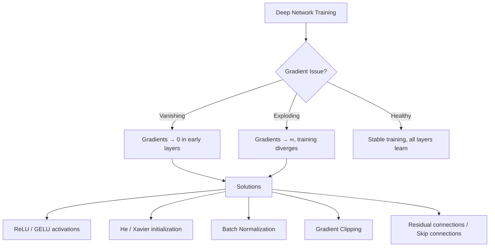
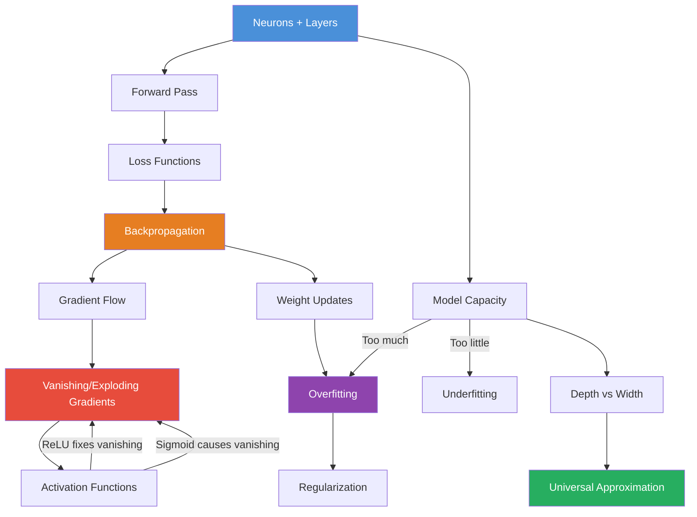

# Foundations of Neural Networks: A Production-Quality Engineering Guide

> *A deep technical reference for ML engineers, researchers, and practitioners who want to understand neural networks from first principles to production deployment.*

---

## What You Will Learn

By the end of this document, you will have a thorough understanding of:

- How neurons, layers, weights, and biases combine to form neural networks
- How information flows forward through a network to produce predictions
- Every major activation function — when, why, and how to use each
- Loss functions that quantify model error and drive learning
- Backpropagation from the chain rule up to computational graphs
- Gradient flow dynamics, including vanishing and exploding gradients
- The universal approximation theorem and what it means practically
- Model capacity — depth vs. width trade-offs
- Why neural networks overfit and how to reason about generalization

**Who This Is For:** ML engineers (junior to senior), data scientists moving into deep learning, and anyone who wants to go beyond calling `model.fit()` and truly understand what happens inside.

---

## Table of Contents

1. [Neurons, Layers, and Parameters](#1-neurons-layers-and-parameters)
2. [Forward Pass and Prediction](#2-forward-pass-and-prediction)
3. [Activation Functions](#3-activation-functions)
   - [Sigmoid and Tanh](#31-sigmoid-and-tanh)
   - [ReLU, Leaky ReLU, ELU, GELU](#32-relu-leaky-relu-elu-gelu)
   - [Softmax](#33-softmax)
4. [Loss Functions](#4-loss-functions)
   - [MSE and MAE](#41-mse-and-mae)
   - [Cross-Entropy Loss](#42-cross-entropy-loss)
   - [Hinge Loss](#43-hinge-loss-conceptual)
5. [Backpropagation](#5-backpropagation)
6. [Gradient Flow Intuition](#6-gradient-flow-intuition)
7. [Vanishing and Exploding Gradients](#7-vanishing-and-exploding-gradients)
8. [Universal Approximation](#8-universal-approximation)
9. [Model Capacity: Depth vs. Width](#9-model-capacity-depth-vs-width)
10. [Why ANNs Overfit](#10-why-anns-overfit)
11. [Cross-Topic Relationships](#11-cross-topic-relationships)
12. [End-to-End Real-World Projects](#12-end-to-end-real-world-projects)
    - [Project 1: Tabular Classification — Credit Default Prediction](#project-1-tabular-classification--credit-default-prediction)
    - [Project 2: Regression — House Price Estimation with Neural Networks](#project-2-regression--house-price-estimation-with-neural-networks)
13. [Algorithm Comparison Tables](#13-algorithm-comparison-tables)
14. [Common Mistakes and Pitfalls](#14-common-mistakes-and-pitfalls)
15. [Interview Preparation](#15-interview-preparation)
16. [Resources](#16-resources)

---

## 1. Neurons, Layers, and Parameters

### a. Intuition

Think of a biological neuron: it receives signals through dendrites, processes them in the cell body, and fires an output through the axon if the signal is strong enough. An artificial neuron (perceptron) is a mathematical abstraction of exactly this.

A single artificial neuron:
- Takes multiple numeric inputs `x₁, x₂, ..., xₙ`
- Multiplies each by a **weight** `w₁, w₂, ..., wₙ` (how important each input is)
- Adds a **bias** `b` (an offset — shifts the output threshold)
- Passes the result through an **activation function** to produce the output

Weights encode what the network has learned. Biases give each neuron flexibility to fire even when all inputs are zero.

**Layers** organize neurons:
- **Input layer**: Accepts raw features. No computation — just passes data in.
- **Hidden layers**: Do the actual feature transformation. The "magic" lives here.
- **Output layer**: Produces the final prediction (a number, a probability, a class).

```
Input Layer      Hidden Layer 1    Hidden Layer 2    Output Layer
   x₁ ──┐
   x₂ ──┤──[N₁]──┐             ┌──[N₅]──┐
   x₃ ──┘   [N₂]─┤──[N₃]──────┤  [N₆]──┤──[ŷ]
              [N₄]─┘             └──[N₇]──┘
```

### b. Mathematical Insight

For a single neuron:

```
z = w₁x₁ + w₂x₂ + ... + wₙxₙ + b  =  wᵀx + b
a = f(z)
```

Where:
- `z` is the **pre-activation** (weighted sum)
- `f` is the **activation function**
- `a` is the **activated output**

For a full layer with `m` neurons receiving input vector `x ∈ ℝⁿ`:

```
Z = XW + b
```

Where `W ∈ ℝⁿˣᵐ` is the weight matrix and `b ∈ ℝᵐ` is the bias vector. This is a batched matrix multiply — one of the reasons GPUs are perfect for neural networks.

**Parameter count:** For a dense layer with `n` inputs and `m` neurons: `n×m` weights + `m` biases = `n×m + m` parameters.

### c. How It Works (Step-by-Step)

1. Define the **architecture**: number of layers, neurons per layer
2. **Initialize weights** (randomly, using schemes like He or Xavier initialization)
3. For each neuron in a layer, compute `z = wᵀx + b`
4. Apply the **activation function**: `a = f(z)`
5. Pass `a` as input to the next layer
6. Repeat until the output layer

### d. Visual Representation

```
                      ┌────────────────────────────┐
  x₁ ──→ (×w₁) ──→   │                            │
  x₂ ──→ (×w₂) ──→   │  Σ(wᵢxᵢ) + b = z → f(z) = a │──→ output
  x₃ ──→ (×w₃) ──→   │                            │
  +1 ──→ (×b)  ──→   │                            │
                      └────────────────────────────┘
                              Single Neuron
```

### e. Python Implementation

```python
import numpy as np

class DenseLayer:
    """A single fully-connected (dense) layer."""

    def __init__(self, n_inputs: int, n_neurons: int, seed: int = 42):
        rng = np.random.default_rng(seed)
        # He initialization: good default for ReLU activations
        self.W = rng.standard_normal((n_inputs, n_neurons)) * np.sqrt(2.0 / n_inputs)
        self.b = np.zeros((1, n_neurons))

    def forward(self, X: np.ndarray) -> np.ndarray:
        """
        X: shape (batch_size, n_inputs)
        Returns: shape (batch_size, n_neurons)
        """
        self.input = X
        self.z = X @ self.W + self.b  # Matrix multiply + bias
        return self.z

    @property
    def n_params(self) -> int:
        return self.W.size + self.b.size


# Quick demo
layer = DenseLayer(n_inputs=4, n_neurons=3)
X = np.random.randn(10, 4)   # 10 samples, 4 features
z = layer.forward(X)
print(f"Input shape:  {X.shape}")
print(f"Output shape: {z.shape}")  # (10, 3)
print(f"Parameters:   {layer.n_params}")  # 4×3 + 3 = 15
```

### f. When to Use / Avoid

| Scenario | Guidance |
|---|---|
| Structured tabular data | Dense layers work well |
| Images | Use Convolutional layers instead |
| Very small datasets (<500 rows) | Shallow networks; risk of overfitting |
| Text / sequences | Recurrent or Transformer architectures |

### g. Key Hyperparameters

- **Number of neurons per layer**: More neurons → more capacity, more computation, higher overfitting risk
- **Number of layers**: Controls depth (see Section 9)
- **Weight initialization scheme**: Crucial for stable training (He for ReLU, Glorot/Xavier for sigmoid/tanh)

---

## 2. Forward Pass and Prediction

### a. Intuition

The **forward pass** is the journey data takes from input to output — it's the network making a prediction. Think of it as an assembly line: each layer transforms the data, adding progressively abstract representations until the output layer produces the final answer.

No learning happens during the forward pass. It's purely computation — inputs in, prediction out.

### b. Mathematical Insight

For an L-layer network, the forward pass computes sequentially:

```
A⁰ = X                          (input)
Z¹ = A⁰W¹ + b¹                  (pre-activation, layer 1)
A¹ = f₁(Z¹)                     (post-activation, layer 1)
Z² = A¹W² + b²
A² = f₂(Z²)
...
Zᴸ = Aᴸ⁻¹Wᴸ + bᴸ
Ŷ = fᴸ(Zᴸ)                      (final prediction)
```

Where `fᴸ` for the output layer is typically: linear (regression), sigmoid (binary classification), or softmax (multiclass).

### c. How It Works (Step-by-Step)

1. **Load a batch** of inputs `X` (shape: `batch_size × features`)
2. **Layer 1**: Compute `Z¹ = XW¹ + b¹`, apply activation `A¹ = f₁(Z¹)`
3. **Repeat** for layers 2 through L-1 (hidden layers)
4. **Output layer**: Compute `Zᴸ`, apply final activation (or none for regression)
5. **Result**: `Ŷ` — the network's prediction

### d. Visual Representation

```
INPUT           HIDDEN 1         HIDDEN 2         OUTPUT
 x₁ ─────────► [z¹₁ → a¹₁] ──► [z²₁ → a²₁] ──►
 x₂ ─────────► [z¹₂ → a¹₂] ──► [z²₂ → a²₂] ──► ŷ
 x₃ ─────────► [z¹₃ → a¹₃] ──► [z²₃ → a²₃] ──►
              (ReLU)            (ReLU)          (sigmoid/linear)
              ◄───────── Forward Pass Direction ─────────────►
```

### e. Python Implementation

```python
import numpy as np

def relu(z: np.ndarray) -> np.ndarray:
    return np.maximum(0, z)

def sigmoid(z: np.ndarray) -> np.ndarray:
    return 1 / (1 + np.exp(-np.clip(z, -500, 500)))

def forward_pass(X: np.ndarray, weights: list, biases: list,
                 hidden_activation=relu, output_activation=sigmoid) -> dict:
    """
    Perform a full forward pass through the network.

    Args:
        X: Input matrix (batch_size, n_features)
        weights: List of weight matrices per layer
        biases: List of bias vectors per layer
        hidden_activation: Activation for hidden layers
        output_activation: Activation for the output layer

    Returns:
        cache: Dict of pre-activations (Z) and post-activations (A) per layer
    """
    cache = {"A0": X}
    A = X

    for i, (W, b) in enumerate(zip(weights, biases)):
        layer_idx = i + 1
        Z = A @ W + b                                           # Linear transform
        is_last = (i == len(weights) - 1)
        A = output_activation(Z) if is_last else hidden_activation(Z)
        cache[f"Z{layer_idx}"] = Z
        cache[f"A{layer_idx}"] = A

    return cache


# ── Demo: 2-hidden-layer network ──────────────────────────────────────────────
np.random.seed(42)
layer_dims = [4, 8, 6, 1]  # 4 inputs → 8 → 6 → 1 output

weights = [np.random.randn(layer_dims[i], layer_dims[i+1]) * 0.1
           for i in range(len(layer_dims)-1)]
biases  = [np.zeros((1, layer_dims[i+1]))
           for i in range(len(layer_dims)-1)]

X_batch = np.random.randn(32, 4)  # 32-sample batch
cache = forward_pass(X_batch, weights, biases)

for key, val in cache.items():
    print(f"{key}: {val.shape}")
```

### f. When to Use / Avoid

The forward pass is always used — it's the inference step. Key engineering consideration: **batch size** affects memory and speed. Larger batches → better GPU utilization but noisier gradient estimates.

---

## 3. Activation Functions

### a. Intuition (General)

Without activation functions, a neural network — no matter how deep — would just be a stack of linear transformations, which collapses to a single linear function. Activations introduce **non-linearity**, allowing the network to approximate complex, curved decision boundaries.

Think of them as a "squish-and-shape" step that decides how much signal passes through each neuron.

---

### 3.1 Sigmoid and Tanh

#### a. Intuition

**Sigmoid** squashes any real number into `(0, 1)`. It was the original "neuron firing probability" — 0 means off, 1 means fully on.

**Tanh** squashes into `(-1, 1)`. It's zero-centered, which helps gradients flow more symmetrically. Both suffer from **saturation** — when inputs are very large or very small, the gradient is nearly zero.

#### b. Mathematical Insight

```
Sigmoid:  σ(z) = 1 / (1 + e⁻ᶻ)        Range: (0, 1)
          σ'(z) = σ(z)(1 - σ(z))       Max gradient: 0.25 (at z=0)

Tanh:     tanh(z) = (eᶻ - e⁻ᶻ) / (eᶻ + e⁻ᶻ)   Range: (-1, 1)
          tanh'(z) = 1 - tanh²(z)               Max gradient: 1.0 (at z=0)
```

#### c. How It Works (Step-by-Step)

1. Receive pre-activation `z`
2. Apply exponential formula
3. Output is bounded — safe for probabilities
4. Gradient computed during backprop via derivative formula

#### d. Visual Representation

```
Sigmoid σ(z):                      Tanh(z):

  1.0 ┤      ╭──────────            1.0 ┤        ╭──────────
  0.5 ┤   ╭──╯                      0.0 ┤───╮╭───╯
  0.0 ┤───╯                        -1.0 ┤───╯
      └──────────────                   └──────────────
      -5   0   +5   z                  -5   0   +5   z
```

#### e. Python Implementation

```python
import numpy as np
import matplotlib.pyplot as plt

def sigmoid(z):
    """Numerically stable sigmoid."""
    return np.where(z >= 0,
                    1 / (1 + np.exp(-z)),
                    np.exp(z) / (1 + np.exp(z)))

def sigmoid_derivative(z):
    s = sigmoid(z)
    return s * (1 - s)

def tanh(z):
    return np.tanh(z)

def tanh_derivative(z):
    return 1 - np.tanh(z) ** 2

# Visualise
z = np.linspace(-6, 6, 300)
fig, axes = plt.subplots(1, 2, figsize=(12, 4))

for ax, (fn, dfn, name) in zip(axes, [
    (sigmoid, sigmoid_derivative, "Sigmoid"),
    (tanh, tanh_derivative, "Tanh")
]):
    ax.plot(z, fn(z), label=name, color="steelblue", linewidth=2)
    ax.plot(z, dfn(z), label=f"{name} gradient", color="tomato",
            linewidth=2, linestyle="--")
    ax.axhline(0, color="black", linewidth=0.5)
    ax.axvline(0, color="black", linewidth=0.5)
    ax.set_title(f"{name} and its Gradient")
    ax.legend()
    ax.grid(alpha=0.3)

plt.tight_layout()
plt.savefig("sigmoid_tanh.png", dpi=150)
plt.show()
```

#### f. When to Use / Avoid

| | Sigmoid | Tanh |
|---|---|---|
| **Use** | Output layer for binary classification | Hidden layers when you need zero-centering |
| **Avoid** | Deep hidden layers (vanishing gradients) | Deep hidden layers (still saturates) |
| **Saturation problem** | Severe | Less severe than sigmoid |

#### g. Key Hyperparameters

No hyperparameters. But these activations require **careful weight initialization** (Xavier/Glorot) to prevent saturation from the first pass.

---

### 3.2 ReLU, Leaky ReLU, ELU, GELU

#### a. Intuition

**ReLU (Rectified Linear Unit)** is brutally simple: pass positive values unchanged, zero out negatives. It became the default because it doesn't saturate for positive values, making gradients flow cleanly. The catch: neurons can "die" (always output 0) if weights push them permanently negative.

**Leaky ReLU** fixes dying neurons by allowing a small negative slope (`α ≈ 0.01`) instead of hard zero.

**ELU (Exponential Linear Unit)** smoothly handles negatives using an exponential curve, producing slightly negative outputs that help zero-center activations.

**GELU (Gaussian Error Linear Unit)** is the modern choice — used in BERT, GPT, and most Transformers. It weighs inputs by their probability under a Gaussian, creating a smooth, probabilistic gating effect.

#### b. Mathematical Insight

```
ReLU(z)       = max(0, z)
ReLU'(z)      = 1 if z > 0, else 0

Leaky ReLU(z) = z if z > 0, else αz      (α ≈ 0.01)
LeakyReLU'(z) = 1 if z > 0, else α

ELU(z)        = z if z > 0, else α(eᶻ - 1)
ELU'(z)       = 1 if z > 0, else α·eᶻ

GELU(z)       ≈ z · σ(1.702z)            (fast approximation)
              = z · Φ(z)                  (exact, Φ = CDF of N(0,1))
```

#### c. How It Works (Step-by-Step)

**ReLU:**
1. Check sign of `z`
2. If `z > 0`: output `z` unchanged
3. If `z ≤ 0`: output `0`

**GELU:**
1. Compute Gaussian CDF `Φ(z)` (probability that N(0,1) < z)
2. Scale `z` by this probability: `z · Φ(z)`
3. Inputs near zero get gated near 50%; large positives pass through fully

#### d. Visual Representation

```
Output
  │    /  ReLU          GELU (smooth curve near 0)
  │   /                ╭──────────── 
  │  /                ╭╯
  │ /              ╭──╯
──┼────────  ──────╯────────────────   z
  │         ╲─────╯  small negative
  │          Leaky ReLU / ELU tail
```

#### e. Python Implementation

```python
import numpy as np

def relu(z):
    return np.maximum(0, z)

def relu_derivative(z):
    return (z > 0).astype(float)

def leaky_relu(z, alpha=0.01):
    return np.where(z > 0, z, alpha * z)

def leaky_relu_derivative(z, alpha=0.01):
    return np.where(z > 0, 1.0, alpha)

def elu(z, alpha=1.0):
    return np.where(z > 0, z, alpha * (np.expm1(z)))

def elu_derivative(z, alpha=1.0):
    return np.where(z > 0, 1.0, elu(z, alpha) + alpha)

def gelu(z):
    """Fast GELU approximation used in most Transformer implementations."""
    return 0.5 * z * (1 + np.tanh(np.sqrt(2 / np.pi) * (z + 0.044715 * z**3)))

def gelu_derivative(z):
    """Approximate GELU derivative."""
    tanh_val = np.tanh(np.sqrt(2/np.pi) * (z + 0.044715 * z**3))
    sech2 = 1 - tanh_val**2
    return (0.5 * (1 + tanh_val) +
            0.5 * z * sech2 * np.sqrt(2/np.pi) * (1 + 3 * 0.044715 * z**2))

# Compare outputs
z = np.array([-3.0, -1.0, 0.0, 0.5, 1.0, 2.0, 3.0])
for name, fn in [("ReLU", relu), ("LeakyReLU", leaky_relu),
                 ("ELU", elu), ("GELU", gelu)]:
    print(f"{name:12s}: {np.round(fn(z), 3)}")
```

#### f. When to Use / Avoid

| Activation | Best For | Avoid When |
|---|---|---|
| **ReLU** | Default choice; most feedforward nets | Dying neurons are causing training collapse |
| **Leaky ReLU** | When ReLU neurons are dying | Rarely — it's almost always a safe swap |
| **ELU** | Regression tasks needing negative outputs | Computationally expensive on large networks |
| **GELU** | Transformers, BERT, GPT-style models | Small MLPs (overkill; use ReLU) |

#### g. Key Hyperparameters

- **Leaky ReLU `α`**: Typically 0.01–0.2. Larger = more negative signal preserved.
- **ELU `α`**: Controls the negative saturation level. Default 1.0.
- **GELU**: No hyperparameters; uses the Gaussian CDF.

---

### 3.3 Softmax

#### a. Intuition

Softmax converts a vector of raw scores (logits) into a probability distribution — all outputs sum to 1, each is between 0 and 1. It's the "decision layer" for multiclass classification.

Think of it as a competitive normalization: the class with the highest logit gets the most probability mass, and all others share what's left. The *exponential* makes high scores dominate even more aggressively.

#### b. Mathematical Insight

```
Softmax(zᵢ) = exp(zᵢ) / Σⱼ exp(zⱼ)
```

**Numerically stable version** (subtract max to prevent overflow):

```
Softmax(z)ᵢ = exp(zᵢ - max(z)) / Σⱼ exp(zⱼ - max(z))
```

**Temperature-scaled Softmax** (used in knowledge distillation, LLMs):
```
Softmax(z/T)ᵢ   — T > 1 smooths distribution, T < 1 sharpens it
```

#### c. How It Works (Step-by-Step)

1. Receive logit vector `z = [z₁, z₂, ..., zₖ]` (one per class)
2. Subtract `max(z)` for numerical stability
3. Exponentiate all elements: `eᶻ`
4. Divide each by the sum of all exponentials
5. Result: probability vector `p` where `Σpᵢ = 1`

#### d. Visual Representation

```
Logits → Softmax → Probabilities

 z = [2.0, 1.0, 0.1]
     ─────────────────
 exp: [7.39, 2.72, 1.11]   sum = 11.22
     ─────────────────
 p:  [0.66, 0.24, 0.10]    ← probabilities (sum = 1.0)
      Cat   Dog   Bird
```

#### e. Python Implementation

```python
import numpy as np

def softmax(z: np.ndarray, temperature: float = 1.0) -> np.ndarray:
    """
    Numerically stable softmax with optional temperature scaling.

    Args:
        z: Logits — shape (batch_size, n_classes) or (n_classes,)
        temperature: > 1 softens distribution; < 1 sharpens it

    Returns:
        Probability distribution over classes
    """
    z_scaled = z / temperature
    # Subtract max per sample for numerical stability
    z_shifted = z_scaled - np.max(z_scaled, axis=-1, keepdims=True)
    exp_z = np.exp(z_shifted)
    return exp_z / np.sum(exp_z, axis=-1, keepdims=True)


# Demo
logits = np.array([[2.0, 1.0, 0.1],
                   [0.5, 0.5, 0.5]])   # 2 samples, 3 classes

print("Default (T=1):")
print(softmax(logits))

print("\nSharpened (T=0.5):")
print(softmax(logits, temperature=0.5))

print("\nSoftened (T=2.0):")
print(softmax(logits, temperature=2.0))
```

#### f. When to Use / Avoid

- **Use**: Output layer for multiclass classification (mutually exclusive classes)
- **Avoid**: Multi-label problems (use independent sigmoids instead)
- **Avoid**: As a hidden-layer activation (dense outputs collapse to near-uniform gradients)

#### g. Key Hyperparameters

- **Temperature**: Only in specialized settings (knowledge distillation, beam search, LLM sampling). Not tuned during standard training.

---

## 4. Loss Functions

### a. Intuition (General)

A loss function is the network's **feedback signal** — a scalar score that says "how wrong are you?" Lower loss = better predictions. The optimizer's job is to minimize the loss by adjusting weights.

Choosing the right loss function is not optional — it directly determines what behavior the network is incentivized to produce.

---

### 4.1 MSE and MAE

#### a. Intuition

**MSE (Mean Squared Error)**: Penalizes errors quadratically. A prediction that's 10 units off is penalized 100 times more than one that's 1 unit off. This makes MSE sensitive to outliers but produces smooth gradients.

**MAE (Mean Absolute Error)**: Penalizes errors linearly. A prediction that's 10 units off is 10× worse than one 1 unit off — no more, no less. More robust to outliers but has a discontinuous gradient at 0.

#### b. Mathematical Insight

```
MSE = (1/n) Σᵢ (yᵢ - ŷᵢ)²
∂MSE/∂ŷᵢ = -2(yᵢ - ŷᵢ)/n

MAE = (1/n) Σᵢ |yᵢ - ŷᵢ|
∂MAE/∂ŷᵢ = -sign(yᵢ - ŷᵢ)/n  (undefined at 0)
```

#### c. How It Works (Step-by-Step)

**MSE:**
1. Compute residuals: `eᵢ = yᵢ - ŷᵢ`
2. Square each: `eᵢ²`
3. Average: `mean(e²)`

**MAE:**
1. Compute residuals: `eᵢ = yᵢ - ŷᵢ`
2. Take absolute value: `|eᵢ|`
3. Average: `mean(|e|)`

#### d. Visual Representation

```
Loss
  │            MSE (quadratic)
  │          ╱
  │        ╱
  │      ╱╱  MAE (linear)
  │    ╱╱╱
  │  ╱╱╱╱╱
  │─────────────────── error
     -3  -2  -1   0   1   2   3

MSE blows up for large errors. MAE stays linear.
```

#### e. Python Implementation

```python
import numpy as np

def mse(y_true: np.ndarray, y_pred: np.ndarray) -> float:
    """Mean Squared Error."""
    return np.mean((y_true - y_pred) ** 2)

def mse_gradient(y_true: np.ndarray, y_pred: np.ndarray) -> np.ndarray:
    """Gradient of MSE w.r.t. predictions."""
    return -2 * (y_true - y_pred) / len(y_true)

def mae(y_true: np.ndarray, y_pred: np.ndarray) -> float:
    """Mean Absolute Error."""
    return np.mean(np.abs(y_true - y_pred))

def mae_gradient(y_true: np.ndarray, y_pred: np.ndarray) -> np.ndarray:
    """Gradient of MAE (subgradient at 0 = 0)."""
    return -np.sign(y_true - y_pred) / len(y_true)

# Demonstrate outlier sensitivity
y_true = np.array([1.0, 2.0, 3.0, 4.0, 100.0])  # 100.0 is an outlier
y_pred = np.array([1.1, 2.1, 3.1, 4.1,   4.1])   # missed the outlier

print(f"MSE: {mse(y_true, y_pred):.2f}")   # Large: outlier dominates
print(f"MAE: {mae(y_true, y_pred):.2f}")   # Smaller: linear penalty
```

#### f. When to Use / Avoid

| | MSE | MAE |
|---|---|---|
| **Use** | Regression; clean data; smooth optimization | Regression with outliers; robust modeling |
| **Avoid** | Heavy-tailed outlier distributions | When gradient stability at 0 matters |
| **Hybrid** | Huber Loss (MSE near 0, MAE for large errors) | Huber Loss |

---

### 4.2 Cross-Entropy Loss

#### a. Intuition

Cross-entropy measures how surprised a model is by the true label. If the model assigns probability 0.99 to the correct class, it's not very surprised — low loss. If it assigns 0.01 to the correct class, it's very surprised — high loss.

It comes from information theory: it's the number of bits needed to encode the true distribution using the predicted distribution. Minimizing cross-entropy = maximizing log-likelihood.

#### b. Mathematical Insight

**Binary Cross-Entropy** (one sigmoid output):
```
BCE = -(1/n) Σᵢ [yᵢ log(ŷᵢ) + (1 - yᵢ) log(1 - ŷᵢ)]
∂BCE/∂ŷᵢ = -(yᵢ/ŷᵢ) + (1-yᵢ)/(1-ŷᵢ)
```

**Categorical Cross-Entropy** (softmax output):
```
CCE = -(1/n) Σᵢ Σₖ yᵢₖ log(ŷᵢₖ)
```

For one-hot labels, this simplifies beautifully:
```
CCE = -(1/n) Σᵢ log(ŷᵢ[cᵢ])  where cᵢ is the true class index
```

**Key insight**: The gradient of cross-entropy + softmax simplifies to `ŷ - y` — elegant and numerically stable.

#### c. How It Works (Step-by-Step)

1. Pass logits through sigmoid (binary) or softmax (multiclass)
2. For each sample, look at predicted probability for the **true class**
3. Take the negative log of that probability
4. Average across the batch

#### d. Visual Representation

```
True label: class 1 (Dog)

Model prediction:  [0.05 (Cat), 0.90 (Dog), 0.05 (Bird)]
                                ^^^^
Loss = -log(0.90) = 0.105   ← Low loss, model is confident and correct

Model prediction:  [0.05 (Cat), 0.10 (Dog), 0.85 (Bird)]
                                ^^^^
Loss = -log(0.10) = 2.303   ← High loss, model is confidently wrong
```

#### e. Python Implementation

```python
import numpy as np

def binary_cross_entropy(y_true: np.ndarray, y_pred: np.ndarray,
                         eps: float = 1e-9) -> float:
    """
    Binary cross-entropy. Clips predictions to prevent log(0).
    y_pred: probabilities from sigmoid in (0, 1)
    """
    y_pred = np.clip(y_pred, eps, 1 - eps)
    return -np.mean(y_true * np.log(y_pred) + (1 - y_true) * np.log(1 - y_pred))

def categorical_cross_entropy(y_true: np.ndarray, y_pred: np.ndarray,
                               eps: float = 1e-9) -> float:
    """
    Categorical cross-entropy.
    y_true: one-hot encoded (batch_size, n_classes) OR integer labels
    y_pred: softmax probabilities (batch_size, n_classes)
    """
    y_pred = np.clip(y_pred, eps, 1.0)

    if y_true.ndim == 1:  # Integer labels → index into predictions
        n = len(y_true)
        return -np.mean(np.log(y_pred[np.arange(n), y_true]))
    else:                  # One-hot labels
        return -np.mean(np.sum(y_true * np.log(y_pred), axis=1))

# ── Demo ───────────────────────────────────────────────────────────────────────
# Binary
y_true_bin = np.array([1, 0, 1, 1])
y_pred_good = np.array([0.9, 0.1, 0.8, 0.95])
y_pred_bad  = np.array([0.1, 0.9, 0.2, 0.05])

print(f"BCE (good predictions): {binary_cross_entropy(y_true_bin, y_pred_good):.4f}")
print(f"BCE (bad predictions):  {binary_cross_entropy(y_true_bin, y_pred_bad):.4f}")

# Multiclass
y_true_cat  = np.array([0, 1, 2])      # Integer class labels
y_pred_cat  = softmax(np.array([[3.0, 1.0, 0.2],
                                 [0.5, 2.8, 0.3],
                                 [0.1, 0.4, 3.5]]))
print(f"\nCCE: {categorical_cross_entropy(y_true_cat, y_pred_cat):.4f}")
```

#### f. When to Use / Avoid

- **Binary CE**: Binary classification (spam/not spam, fraud/legitimate)
- **Categorical CE**: Multiclass problems with mutually exclusive classes
- **Avoid**: Regression tasks (use MSE/MAE instead)

---

### 4.3 Hinge Loss (Conceptual)

#### a. Intuition

Hinge loss is the loss behind Support Vector Machines (SVMs). Instead of maximizing probability, it maximizes the **margin** between classes. It only penalizes predictions that are on the wrong side of the margin or too close to the boundary.

The name comes from the hinge-shaped curve: zero loss for confident correct predictions, linear penalty otherwise.

#### b. Mathematical Insight

```
Hinge Loss = (1/n) Σᵢ max(0, 1 - yᵢ · ŷᵢ)

where yᵢ ∈ {-1, +1} and ŷᵢ is the raw score (not probability)

If yᵢ · ŷᵢ ≥ 1: loss = 0 (correctly classified with margin)
If yᵢ · ŷᵢ < 1: loss = 1 - yᵢ · ŷᵢ (penalized)
```

#### c. Visual Representation

```
Loss
  │\
  │ \
  │  \
  │   \______________________  (loss = 0 once margin > 1)
  │
  └─────────────────────────── yᵢ·ŷᵢ
        0     1
        ↑     ↑
      boundary  margin
```

#### d. When to Use / Avoid

- **Use**: When you want margin-based classification; SVMs; multi-class ranking
- **Avoid**: When you need calibrated probability outputs (use cross-entropy instead)
- **In neural networks**: Rare today — cross-entropy is preferred because it pairs naturally with softmax and backpropagates more cleanly

---

## 5. Backpropagation

### a. Intuition

Backpropagation is the algorithm that tells every weight in the network: "you contributed this much to the error — here's how much you need to change."

It does this by working **backwards** from the loss to the inputs, computing the gradient of the loss with respect to every parameter using the **chain rule** from calculus.

Analogy: imagine you're the manager of a factory assembly line. The final product came out broken. You trace back through each station: the packaging station gets 10% of the blame, the assembly station 40%, the welding station 50%. Each station adjusts accordingly.

### b. Mathematical Insight

**Chain Rule** (the mathematical engine of backprop):

```
If loss L depends on z, and z depends on w:
∂L/∂w = (∂L/∂z) · (∂z/∂w)
```

For a chain of functions `L → A² → Z² → A¹ → Z¹ → W¹`:

```
∂L/∂W¹ = ∂L/∂A² · ∂A²/∂Z² · ∂Z²/∂A¹ · ∂A¹/∂Z¹ · ∂Z¹/∂W¹
```

Each term is computed from the local activation/weight formula — backprop makes this tractable by reusing intermediate computations (dynamic programming).

**Gradient of weights** in layer `l`:

```
∂L/∂Wˡ = (Aˡ⁻¹)ᵀ · δˡ

where δˡ = δˡ⁺¹ · (Wˡ⁺¹)ᵀ ⊙ f'(Zˡ)   ← element-wise multiply with activation gradient
```

### c. How It Works (Step-by-Step)

1. **Forward pass**: Compute and cache all `Z` and `A` values
2. **Compute output loss**: `L = loss(y, ŷ)`
3. **Output layer gradient**: `δᴸ = ∂L/∂Zᴸ` (e.g., for softmax + CCE: `ŷ - y`)
4. **Propagate backwards** through each layer `l = L-1, ..., 1`:
   - `∂L/∂Wˡ = (Aˡ⁻¹)ᵀ · δˡ`
   - `∂L/∂bˡ = sum(δˡ, axis=0)`
   - `δˡ⁻¹ = δˡ · (Wˡ)ᵀ ⊙ f'(Zˡ⁻¹)`
5. **Update weights** (gradient descent): `Wˡ ← Wˡ - η · ∂L/∂Wˡ`

### d. Visual Representation — Computational Graph

```
        x ──►[W¹]──► z¹ ──►[ReLU]──► a¹ ──►[W²]──► z² ──►[σ]──► ŷ ──►[BCE]──► L
               ↑               ↑               ↑               ↑              │
        ∂L/∂W¹ ←  ∂L/∂z¹ ←  ∂L/∂a¹  ← ∂L/∂z²  ← ∂L/∂ŷ ──────────────────►│
                                                                               │
                            ◄──────────── Backward Pass ─────────────────────┘
```

### e. Python Implementation

```python
import numpy as np

class SimpleNN:
    """2-layer neural net with manual backprop for illustration."""

    def __init__(self, n_in: int, n_hidden: int, n_out: int,
                 lr: float = 0.01, seed: int = 42):
        rng = np.random.default_rng(seed)
        # He initialization for ReLU hidden, Xavier for output
        self.W1 = rng.standard_normal((n_in, n_hidden)) * np.sqrt(2 / n_in)
        self.b1 = np.zeros((1, n_hidden))
        self.W2 = rng.standard_normal((n_hidden, n_out)) * np.sqrt(1 / n_hidden)
        self.b2 = np.zeros((1, n_out))
        self.lr = lr

    # ── Activations ────────────────────────────────────────────────────────────
    def _relu(self, z):        return np.maximum(0, z)
    def _relu_grad(self, z):   return (z > 0).astype(float)
    def _sigmoid(self, z):     return 1 / (1 + np.exp(-np.clip(z, -500, 500)))

    def _bce(self, y, y_hat, eps=1e-9):
        y_hat = np.clip(y_hat, eps, 1 - eps)
        return -np.mean(y * np.log(y_hat) + (1 - y) * np.log(1 - y_hat))

    # ── Forward Pass ───────────────────────────────────────────────────────────
    def forward(self, X: np.ndarray) -> np.ndarray:
        self.X   = X
        self.Z1  = X @ self.W1 + self.b1
        self.A1  = self._relu(self.Z1)
        self.Z2  = self.A1 @ self.W2 + self.b2
        self.A2  = self._sigmoid(self.Z2)      # Output probabilities
        return self.A2

    # ── Backward Pass ──────────────────────────────────────────────────────────
    def backward(self, y: np.ndarray) -> dict:
        n = len(y)

        # Output layer gradient (BCE + sigmoid combined)
        dA2 = -(y / (self.A2 + 1e-9) - (1 - y) / (1 - self.A2 + 1e-9)) / n
        dZ2 = dA2 * self.A2 * (1 - self.A2)           # ← sigmoid derivative

        dW2 = self.A1.T @ dZ2                          # ∂L/∂W²
        db2 = dZ2.sum(axis=0, keepdims=True)           # ∂L/∂b²

        # Hidden layer gradient (backprop through ReLU)
        dA1 = dZ2 @ self.W2.T
        dZ1 = dA1 * self._relu_grad(self.Z1)           # ← ReLU derivative

        dW1 = self.X.T @ dZ1                           # ∂L/∂W¹
        db1 = dZ1.sum(axis=0, keepdims=True)           # ∂L/∂b¹

        return {"dW1": dW1, "db1": db1, "dW2": dW2, "db2": db2}

    # ── Parameter Update ───────────────────────────────────────────────────────
    def update(self, grads: dict):
        self.W1 -= self.lr * grads["dW1"]
        self.b1 -= self.lr * grads["db1"]
        self.W2 -= self.lr * grads["dW2"]
        self.b2 -= self.lr * grads["db2"]

    # ── Training Loop ──────────────────────────────────────────────────────────
    def train(self, X: np.ndarray, y: np.ndarray, epochs: int = 100):
        losses = []
        for epoch in range(epochs):
            y_hat = self.forward(X)
            loss = self._bce(y, y_hat)
            grads = self.backward(y)
            self.update(grads)

            if epoch % 10 == 0:
                print(f"Epoch {epoch:4d} | Loss: {loss:.4f}")
            losses.append(loss)
        return losses


# ── Quick Test ─────────────────────────────────────────────────────────────────
from sklearn.datasets import make_classification
from sklearn.preprocessing import StandardScaler

X_raw, y_raw = make_classification(n_samples=500, n_features=10,
                                    n_informative=5, random_state=42)
X_raw = StandardScaler().fit_transform(X_raw)
y_raw = y_raw.reshape(-1, 1).astype(float)

model = SimpleNN(n_in=10, n_hidden=16, n_out=1, lr=0.05)
losses = model.train(X_raw, y_raw, epochs=100)
```

### f. When to Use / Avoid

Backpropagation is **always used** in neural network training. What varies:
- **Batch size**: Full-batch (exact but slow), mini-batch (standard), stochastic (1 sample, noisy)
- **Optimizers**: SGD, Adam, RMSprop all use backprop-computed gradients differently

### g. Key Hyperparameters

- **Learning rate `η`**: Most critical. Too high → diverge. Too low → slow convergence.
- **Batch size**: Smaller batches → noisier gradients but better generalization in practice.

---

## 6. Gradient Flow Intuition

### a. Intuition

Gradients are the "information" flowing backwards through the network. When you train, you want gradients to:
- Be **non-zero**: so the network can actually learn
- **Remain stable in magnitude**: neither too large nor too small

Think of it like water flowing through pipes. If a pipe is blocked (zero gradient / dead neuron) nothing flows. If a pipe bursts (exploding gradient), everything floods. Healthy training = steady, consistent flow through every layer.

### b. Mathematical Insight

The gradient at layer `l` accumulates products of local derivatives:

```
∂L/∂W¹ = δᴸ · Wᴸ · f'(Zᴸ⁻¹) · Wᴸ⁻¹ · f'(Zᴸ⁻²) · ... · f'(Z¹) · X
```

If activation derivatives `f'(Zˡ) < 1` everywhere: gradients **shrink** exponentially with depth (vanishing).
If weights are large: gradients **grow** exponentially with depth (exploding).

### c. Visual Representation

```
Layer:    L=10     L=9      L=8      L=7      L=6     ... L=1
Gradient: 1.0   →  0.25  →  0.06  →  0.015 → 0.004  → ≈ 0

Vanishing gradient: earlier layers receive nearly zero signal
Each sigmoid layer multiplies by max 0.25

──────────────────────────────────────────────────────────
Layer:    L=10     L=9      L=8      L=7      L=6     ... L=1
Gradient: 1.0   →  4.0   →  16.0  →  64.0  →  256.0  → ∞

Exploding gradient: weights > 1 per layer, gradients diverge
```

### d. Practical Mitigations

| Problem | Solution |
|---|---|
| Vanishing gradients | Use ReLU/GELU; batch norm; residual connections |
| Exploding gradients | Gradient clipping; careful initialization; smaller learning rate |
| Dead neurons (ReLU) | Use Leaky ReLU; better initialization; lower learning rate |

---

## 7. Vanishing and Exploding Gradients

### a. Intuition

**Vanishing gradients**: The gradient shrinks as it travels backwards through layers. By the time it reaches the first few layers, it's so tiny those layers barely update. The network effectively only trains its last few layers.

This is why sigmoid and tanh networks fail at depth — their max derivatives (0.25 and 1.0) repeatedly multiply, and for sigmoid especially, the signal vanishes exponentially.

**Exploding gradients**: Gradients grow uncontrollably. Weights make enormous updates and training diverges. Common in recurrent networks on long sequences, or when weights are initialized too large.

### b. Mathematical Insight

For an L-layer network with sigmoid activations:

```
|∂L/∂W¹| ∝ ∏ˡ₌₂ᴸ |σ'(Zˡ)| · |Wˡ|

Since max(σ') = 0.25:  gradient magnitude ≤ (0.25)^(L-1) → 0 as L grows

For weights |W| > 1:   gradient magnitude ≥ (|W| · 1)^(L-1) → ∞
```

### c. Solutions in Practice

```python
import numpy as np

# ── 1. Gradient Clipping (prevents explosion) ──────────────────────────────────
def clip_gradients(gradients: dict, max_norm: float = 1.0) -> dict:
    """Rescale all gradients if their global norm exceeds max_norm."""
    # Compute global norm across all gradient tensors
    global_norm = np.sqrt(sum(np.sum(g**2) for g in gradients.values()))
    if global_norm > max_norm:
        scale = max_norm / (global_norm + 1e-8)
        return {k: v * scale for k, v in gradients.items()}
    return gradients

# ── 2. Weight Initialization ───────────────────────────────────────────────────
def xavier_init(n_in: int, n_out: int, seed: int = 42) -> np.ndarray:
    """Glorot/Xavier: good for sigmoid/tanh."""
    limit = np.sqrt(6 / (n_in + n_out))
    return np.random.default_rng(seed).uniform(-limit, limit, (n_in, n_out))

def he_init(n_in: int, n_out: int, seed: int = 42) -> np.ndarray:
    """He: good for ReLU and variants."""
    std = np.sqrt(2 / n_in)
    return np.random.default_rng(seed).normal(0, std, (n_in, n_out))

# ── 3. Batch Normalization (stabilizes activations) ────────────────────────────
class BatchNorm:
    """Batch Normalization layer (inference mode approximation)."""
    def __init__(self, n_features: int, eps: float = 1e-5, momentum: float = 0.1):
        self.gamma = np.ones((1, n_features))   # scale parameter (learnable)
        self.beta  = np.zeros((1, n_features))  # shift parameter (learnable)
        self.eps = eps
        self.running_mean = np.zeros((1, n_features))
        self.running_var  = np.ones((1, n_features))
        self.momentum = momentum

    def forward(self, X: np.ndarray, training: bool = True) -> np.ndarray:
        if training:
            mu  = X.mean(axis=0, keepdims=True)
            var = X.var(axis=0, keepdims=True)
            # Update running stats for inference
            self.running_mean = (1 - self.momentum) * self.running_mean + self.momentum * mu
            self.running_var  = (1 - self.momentum) * self.running_var  + self.momentum * var
        else:
            mu  = self.running_mean
            var = self.running_var

        X_norm = (X - mu) / np.sqrt(var + self.eps)
        return self.gamma * X_norm + self.beta   # Scale and shift
```

### d. Visual Representation



---

## 8. Universal Approximation

### a. Intuition

The **Universal Approximation Theorem** (Cybenko, 1989; Hornik et al., 1989) states:

> A neural network with a single hidden layer containing enough neurons and a non-linear activation can approximate any continuous function on a compact set to arbitrary precision.

This is theoretically powerful — but practically limited. "Enough neurons" might mean exponentially many. The theorem is an **existence proof**, not a construction recipe. It tells us ANNs *can* do anything, not that they *will* efficiently.

**Analogy**: The theorem is like saying "given enough LEGO bricks, you can build any structure." True — but it doesn't tell you how to organize them, or that building the Eiffel Tower from 2×4 bricks is efficient.

### b. Mathematical Insight

Formally, for any continuous function `f: [0,1]ⁿ → ℝ` and any `ε > 0`, there exists a single-hidden-layer network `F` with sigmoid activations such that:

```
|F(x) - f(x)| < ε  for all x in [0,1]ⁿ
```

**Depth vs Width**: A deeper network (more layers) can approximate certain function classes exponentially more efficiently than a shallower wider one. This motivates deep learning over wide shallow networks.

### c. Practical Implications

```
The theorem tells us:       What it does NOT tell us:
────────────────────────    ────────────────────────────────
ANNs are expressive         How wide/deep to make the network
Non-linearity is necessary  How to find the right weights
One hidden layer suffices   That optimization will converge
                            That the model will generalize
```

### d. Visual Representation

```
Target function f(x):         Network approximation F(x):
   │  ╭──╮                       │  ╭──╮
   │ ╱    ╲   ╭╮                 │ ╱    ╲   ╭╮
   │╱       ╲╱  ╲                │╱       ╲╱  ╲ ← superposition of sigmoids
───┼──────────────                ───────────────
   
Each neuron = one sigmoid bump. Combine enough bumps → approximate any curve.
```

---

## 9. Model Capacity: Depth vs. Width

### a. Intuition

**Capacity** is a network's ability to fit complex patterns. Too little capacity → underfitting. Too much → overfitting.

**Width** (more neurons per layer): Increases capacity at that layer. Think of it as more tools in one toolbox.

**Depth** (more layers): Each layer learns increasingly abstract representations. Deep networks hierarchically compose features — edges → textures → shapes → objects in vision; characters → words → phrases → semantics in NLP.

**The depth advantage**: For many real-world functions (especially those with compositional structure), deep networks achieve equivalent approximation to wide networks with exponentially fewer parameters.

### b. Mathematical Insight

A network with `d` layers of width `w` has `O(d·w²)` parameters. The function space it can represent grows with both depth and width, but:

- Adding depth improves **compositional expressiveness**
- Adding width improves **representational capacity at a fixed depth**

In practice: prefer depth over width (up to training stability limits).

### c. Depth vs Width Comparison

```
Wide-Shallow Network:                   Deep-Narrow Network:
Input → [1000 neurons] → Output         Input → [64] → [64] → [64] → [64] → Output

Pros: Easy to train, less vanishing      Pros: More expressive, fewer params
Cons: Lacks hierarchical composition     Cons: Harder to train, vanishing gradients
      Inefficient for complex patterns         Need good initialization + batch norm
```

### d. Python Implementation

```python
import numpy as np
from sklearn.neural_network import MLPClassifier
from sklearn.datasets import make_moons
from sklearn.model_selection import cross_val_score
from sklearn.preprocessing import StandardScaler

X, y = make_moons(n_samples=1000, noise=0.2, random_state=42)
X = StandardScaler().fit_transform(X)

architectures = {
    # (name, hidden_layer_sizes)
    "Shallow-Wide":   (500,),
    "Medium":         (100, 100),
    "Deep-Narrow":    (32, 32, 32, 32, 32),
    "Deep-Medium":    (64, 64, 64),
    "Pyramid":        (128, 64, 32, 16),
}

print(f"{'Architecture':<20} {'Params':>8} {'CV Acc':>10} {'Std':>8}")
print("-" * 50)

for name, layers in architectures.items():
    model = MLPClassifier(hidden_layer_sizes=layers, activation='relu',
                          max_iter=500, random_state=42)

    # Estimate parameter count
    dims = [2] + list(layers) + [1]  # 2 input features, binary output
    n_params = sum(dims[i]*dims[i+1] + dims[i+1] for i in range(len(dims)-1))

    scores = cross_val_score(model, X, y, cv=5)
    print(f"{name:<20} {n_params:>8,} {scores.mean():>10.4f} {scores.std():>8.4f}")
```

### e. When to Use / Avoid

| Scenario | Recommendation |
|---|---|
| Small dataset | Shallow + wide; regularize heavily |
| Complex hierarchical data (images, text) | Deep is essential |
| Tabular data | 2–4 layers usually sufficient |
| Interpretability required | Prefer shallower (less abstraction) |
| Resource-constrained | Trade depth for width (cheaper inference) |

---

## 10. Why ANNs Overfit

### a. Intuition

Overfitting is when the network memorizes the training data — including its noise — instead of learning the underlying pattern. A heavily overfit network scores perfectly on training data but fails on unseen data.

Think of a student who memorizes exam answers verbatim instead of understanding concepts. They ace mock tests but fail the real exam when questions are slightly rephrased.

ANNs overfit because:
1. They have **enormous capacity** (millions of parameters)
2. They are **optimized aggressively** to minimize training loss
3. With enough capacity and iterations, they *can* memorize any finite dataset

### b. Mathematical Insight

**Bias-Variance Trade-off:**

```
Expected Error = Bias² + Variance + Irreducible Noise

Bias:     How much predictions systematically miss the truth
Variance: How much predictions vary with different training data

Overfitting = Low Bias, High Variance
Underfitting = High Bias, Low Variance
```

For neural networks, increasing capacity decreases bias but increases variance. The goal: find the sweet spot.

**Double Descent**: Modern large networks can overfit and then *re-fit* — beyond a critical parameter count, test error paradoxically decreases again. This is active research territory.

### c. Why ANNs Are Particularly Prone

```
Reason                        Explanation
──────────────────────────    ──────────────────────────────────────────────
Parameter count >> data       10M params, 1000 samples → near-infinite solutions
SGD finds sharp minima        Early stopping helps; flat minima generalize better
No built-in regularization    Must add L1/L2, dropout, weight decay explicitly
Deep composition              Each layer can memorize increasingly abstract noise
Implicit memorization         Transformers can memorize entire training corpora
```

### d. Solutions

```python
import numpy as np
from sklearn.neural_network import MLPClassifier
from sklearn.model_selection import train_test_split
from sklearn.datasets import make_classification

X, y = make_classification(n_samples=500, n_features=20, n_informative=10,
                            random_state=42)
X_train, X_test, y_train, y_test = train_test_split(X, y, test_size=0.3,
                                                     random_state=42)

configs = {
    "Overfit (no regularization)":  dict(hidden_layer_sizes=(512, 512), alpha=0),
    "L2 Regularization (alpha)":    dict(hidden_layer_sizes=(512, 512), alpha=0.01),
    "Smaller network":              dict(hidden_layer_sizes=(32, 32),   alpha=0),
    "Early stopping":               dict(hidden_layer_sizes=(512, 512), alpha=0,
                                         early_stopping=True, validation_fraction=0.2),
}

print(f"{'Config':<35} {'Train Acc':>10} {'Test Acc':>10} {'Overfit':>10}")
print("-" * 70)

for name, params in configs.items():
    model = MLPClassifier(max_iter=500, random_state=42, **params)
    model.fit(X_train, y_train)
    train_acc = model.score(X_train, y_train)
    test_acc  = model.score(X_test, y_test)
    overfit   = train_acc - test_acc
    print(f"{name:<35} {train_acc:>10.4f} {test_acc:>10.4f} {overfit:>10.4f}")
```

### e. Regularization Techniques Summary

| Technique | How It Works | When to Use |
|---|---|---|
| **L2 (weight decay)** | Penalizes large weights in loss | Almost always — default regularizer |
| **Dropout** | Randomly zeros neurons during training | Deep networks; prevents co-adaptation |
| **Early stopping** | Stop when validation loss stops improving | Always validate; simple and effective |
| **Data augmentation** | Artificially expand training set | Images, text — when data is limited |
| **Batch normalization** | Stabilizes activations, mild regularizer | Deep networks with ReLU |
| **Smaller network** | Reduce capacity | When data is small |

---

## 11. Cross-Topic Relationships

Understanding how these concepts connect transforms isolated knowledge into a coherent engineering mental model.



**Evolution of ideas:**

1. **Start**: A single neuron (perceptron) — linear classifier
2. **Add layers**: Multi-layer perceptron (MLP) — non-linear boundaries
3. **Problem**: Sigmoid activations cause vanishing gradients in deep nets
4. **Fix**: ReLU → training deep networks becomes practical
5. **New problem**: Too much capacity → overfitting
6. **Fix**: Dropout, L2, early stopping, batch norm
7. **Scale up**: Billions of parameters, massive data → modern deep learning

---

## 12. End-to-End Real-World Projects

---

### Project 1: Tabular Classification — Credit Default Prediction

#### a. Problem Statement

A bank wants to predict whether a credit card holder will default on payment next month. This is a binary classification problem with severe class imbalance (most customers don't default). The model must be accurate and explainable enough for regulatory compliance.

**Business impact**: False negatives (missed defaults) cost money. False positives (incorrectly flagging good customers) damage customer relationships.

#### b. Dataset

**Source**: [UCI Credit Card Default Dataset](https://archive.ics.uci.edu/ml/datasets/default+of+credit+card+clients) or [Kaggle version](https://www.kaggle.com/datasets/uciml/default-of-credit-card-clients-dataset)

- 30,000 samples
- 23 features (credit limit, age, payment history, bill amounts)
- Binary target: `default.payment.next.month` (1 = default, 0 = no default)
- Class distribution: ~22% defaults

**Synthetic data generation** (if you don't have the dataset):

```python
import numpy as np
import pandas as pd
from sklearn.preprocessing import StandardScaler

def generate_credit_data(n=5000, seed=42):
    """Generate realistic-ish synthetic credit card default data."""
    rng = np.random.default_rng(seed)

    data = {
        "LIMIT_BAL":    rng.choice([10000, 50000, 100000, 200000, 500000], n),
        "AGE":          rng.integers(21, 75, n),
        "EDUCATION":    rng.integers(1, 5, n),       # 1=graduate, 2=university, ...
        "MARRIAGE":     rng.integers(0, 3, n),        # 0=other, 1=married, 2=single
        "PAY_0":        rng.integers(-1, 9, n),       # Payment delay months
        "PAY_2":        rng.integers(-1, 9, n),
        "PAY_3":        rng.integers(-1, 9, n),
        "BILL_AMT1":    rng.uniform(0, 80000, n),
        "BILL_AMT2":    rng.uniform(0, 80000, n),
        "PAY_AMT1":     rng.uniform(0, 20000, n),
        "PAY_AMT2":     rng.uniform(0, 20000, n),
    }

    # Synthetic default probability based on features
    df = pd.DataFrame(data)
    logit = (
        -3.5
        + 0.5 * df["PAY_0"]
        + 0.3 * df["PAY_2"]
        - 0.02 * (df["LIMIT_BAL"] / 10000)
        + 0.02 * (df["AGE"] - 40)
        + rng.normal(0, 0.5, n)
    )
    prob_default = 1 / (1 + np.exp(-logit))
    df["default"] = (rng.uniform(0, 1, n) < prob_default).astype(int)
    return df

df = generate_credit_data(n=5000)
print(df["default"].value_counts(normalize=True).round(3))
```

#### c. Step-by-Step Pipeline

```python
import numpy as np
import pandas as pd
import matplotlib.pyplot as plt
import warnings
warnings.filterwarnings("ignore")

from sklearn.model_selection import train_test_split, cross_val_score, StratifiedKFold
from sklearn.preprocessing import StandardScaler
from sklearn.neural_network import MLPClassifier
from sklearn.linear_model import LogisticRegression
from sklearn.ensemble import RandomForestClassifier, GradientBoostingClassifier
from sklearn.metrics import (classification_report, roc_auc_score,
                              confusion_matrix, RocCurveDisplay,
                              average_precision_score)
from sklearn.pipeline import Pipeline
from sklearn.model_selection import GridSearchCV

# ══════════════════════════════════════════════════════════════════════════════
# STEP 1: DATA LOADING
# ══════════════════════════════════════════════════════════════════════════════

df = generate_credit_data(n=5000, seed=42)
print(f"Dataset shape: {df.shape}")
print(f"\nTarget distribution:\n{df['default'].value_counts()}")

# ══════════════════════════════════════════════════════════════════════════════
# STEP 2: DATA CLEANING
# ══════════════════════════════════════════════════════════════════════════════

def clean_data(df: pd.DataFrame) -> pd.DataFrame:
    """Clean and validate the dataset."""
    df = df.copy()

    # Check for duplicates and missing values
    n_dups = df.duplicated().sum()
    n_missing = df.isnull().sum().sum()
    print(f"Duplicates: {n_dups} | Missing values: {n_missing}")

    df.drop_duplicates(inplace=True)
    df.dropna(inplace=True)

    # Clip unreasonable values
    df["AGE"]      = df["AGE"].clip(18, 100)
    df["BILL_AMT1"] = df["BILL_AMT1"].clip(0, None)
    df["PAY_AMT1"]  = df["PAY_AMT1"].clip(0, None)

    return df

df = clean_data(df)

# ══════════════════════════════════════════════════════════════════════════════
# STEP 3: EXPLORATORY DATA ANALYSIS (EDA)
# ══════════════════════════════════════════════════════════════════════════════

def run_eda(df: pd.DataFrame, target: str = "default"):
    """Basic EDA: distributions, correlations, class balance."""
    print("\n── Summary Statistics ──────────────────────────────────────────────")
    print(df.describe().round(2))

    print("\n── Feature Correlations with Target ───────────────────────────────")
    corr = df.corr()[target].drop(target).sort_values(key=abs, ascending=False)
    print(corr.round(3))

    # Class balance
    class_counts = df[target].value_counts()
    imbalance_ratio = class_counts[0] / class_counts[1]
    print(f"\nClass imbalance ratio (majority:minority): {imbalance_ratio:.1f}:1")
    print("→ Consider class_weight='balanced' or SMOTE for high imbalance")

run_eda(df)

# ══════════════════════════════════════════════════════════════════════════════
# STEP 4: FEATURE ENGINEERING
# ══════════════════════════════════════════════════════════════════════════════

def engineer_features(df: pd.DataFrame) -> pd.DataFrame:
    """Create meaningful derived features."""
    df = df.copy()

    # Payment behavior features
    pay_cols = [c for c in df.columns if c.startswith("PAY_") and not "AMT" in c]
    if len(pay_cols) >= 2:
        df["max_payment_delay"]  = df[pay_cols].max(axis=1)
        df["mean_payment_delay"] = df[pay_cols].mean(axis=1)
        df["n_late_payments"]    = (df[pay_cols] > 0).sum(axis=1)

    # Credit utilization
    if "BILL_AMT1" in df.columns and "LIMIT_BAL" in df.columns:
        df["credit_utilization"] = df["BILL_AMT1"] / (df["LIMIT_BAL"] + 1)
        df["credit_utilization"] = df["credit_utilization"].clip(0, 2)

    # Payment ratio
    if "PAY_AMT1" in df.columns and "BILL_AMT1" in df.columns:
        df["payment_ratio"] = df["PAY_AMT1"] / (df["BILL_AMT1"] + 1)

    return df

df = engineer_features(df)
print(f"\nFeature count after engineering: {df.shape[1] - 1}")

# ══════════════════════════════════════════════════════════════════════════════
# STEP 5 & 6: FEATURE SELECTION + TRAIN/TEST SPLIT
# ══════════════════════════════════════════════════════════════════════════════

TARGET = "default"
FEATURES = [c for c in df.columns if c != TARGET]

X = df[FEATURES].values
y = df[TARGET].values

X_train, X_test, y_train, y_test = train_test_split(
    X, y, test_size=0.2, stratify=y, random_state=42
)

print(f"\nTrain size: {X_train.shape[0]} | Test size: {X_test.shape[0]}")
print(f"Train class ratio: {y_train.mean():.3f} defaults")

# ══════════════════════════════════════════════════════════════════════════════
# STEP 7: MODEL TRAINING & EVALUATION
# ══════════════════════════════════════════════════════════════════════════════

def evaluate_model(name: str, model, X_tr, y_tr, X_te, y_te) -> dict:
    """Train a model and return comprehensive evaluation metrics."""
    model.fit(X_tr, y_tr)
    y_pred = model.predict(X_te)
    y_prob = model.predict_proba(X_te)[:, 1] if hasattr(model, "predict_proba") else None

    metrics = {
        "name":      name,
        "roc_auc":   roc_auc_score(y_te, y_prob) if y_prob is not None else None,
        "avg_prec":  average_precision_score(y_te, y_prob) if y_prob is not None else None,
        "report":    classification_report(y_te, y_pred, target_names=["No Default", "Default"])
    }
    return metrics, model

# Define models — using class_weight='balanced' for imbalanced data
models_config = {
    "Logistic Regression": Pipeline([
        ("scaler", StandardScaler()),
        ("model", LogisticRegression(class_weight="balanced", C=1.0, max_iter=500,
                                      random_state=42))
    ]),
    "Random Forest": RandomForestClassifier(
        n_estimators=200, class_weight="balanced",
        max_depth=8, random_state=42, n_jobs=-1
    ),
    "Gradient Boosting": GradientBoostingClassifier(
        n_estimators=200, learning_rate=0.05,
        max_depth=5, random_state=42
    ),
    "Neural Network (MLP)": Pipeline([
        ("scaler", StandardScaler()),
        ("model", MLPClassifier(
            hidden_layer_sizes=(128, 64, 32),
            activation="relu",
            alpha=0.01,          # L2 regularization
            learning_rate_init=0.001,
            early_stopping=True,
            validation_fraction=0.15,
            max_iter=500,
            random_state=42
        ))
    ]),
}

results = []
trained_models = {}

print("\n── Model Comparison ──────────────────────────────────────────────────")
print(f"{'Model':<25} {'ROC-AUC':>10} {'Avg Precision':>15}")
print("-" * 55)

for name, model in models_config.items():
    metrics, fitted = evaluate_model(name, model, X_train, y_train, X_test, y_test)
    trained_models[name] = fitted
    results.append(metrics)
    print(f"{name:<25} {metrics['roc_auc']:>10.4f} {metrics['avg_prec']:>15.4f}")

# ══════════════════════════════════════════════════════════════════════════════
# STEP 8: DETAILED EVALUATION OF BEST MODEL
# ══════════════════════════════════════════════════════════════════════════════

best_name = max(results, key=lambda r: r["roc_auc"])["name"]
best_model = trained_models[best_name]

print(f"\n── Best Model: {best_name} ─────────────────────────────────────────")
y_pred_best = best_model.predict(X_test)
print(classification_report(y_test, y_pred_best,
                             target_names=["No Default", "Default"]))

# ══════════════════════════════════════════════════════════════════════════════
# STEP 9: HYPERPARAMETER TUNING (Neural Network)
# ══════════════════════════════════════════════════════════════════════════════

param_grid = {
    "model__hidden_layer_sizes": [(64, 32), (128, 64, 32), (256, 128, 64)],
    "model__alpha":              [0.001, 0.01, 0.1],
    "model__learning_rate_init": [0.001, 0.01],
}

nn_pipeline = Pipeline([
    ("scaler", StandardScaler()),
    ("model", MLPClassifier(activation="relu", early_stopping=True,
                             validation_fraction=0.15, max_iter=500, random_state=42))
])

cv = StratifiedKFold(n_splits=3, shuffle=True, random_state=42)
grid_search = GridSearchCV(nn_pipeline, param_grid, cv=cv,
                            scoring="roc_auc", n_jobs=-1, verbose=0)
grid_search.fit(X_train, y_train)

print(f"\nBest MLP params: {grid_search.best_params_}")
print(f"Best CV ROC-AUC: {grid_search.best_score_:.4f}")

# Final evaluation
final_model = grid_search.best_estimator_
final_roc = roc_auc_score(y_test, final_model.predict_proba(X_test)[:, 1])
print(f"Final test ROC-AUC: {final_roc:.4f}")
```

#### d. Deployment Considerations

```python
# ── FastAPI deployment skeleton ────────────────────────────────────────────────
# pip install fastapi uvicorn joblib

import joblib
from fastapi import FastAPI
from pydantic import BaseModel
import numpy as np

# Save model
joblib.dump(final_model, "credit_default_model.pkl")

# FastAPI app
app = FastAPI(title="Credit Default Predictor", version="1.0")

class CreditFeatures(BaseModel):
    LIMIT_BAL: float
    AGE: int
    PAY_0: int
    BILL_AMT1: float
    PAY_AMT1: float
    credit_utilization: float

@app.post("/predict")
def predict(features: CreditFeatures):
    model = joblib.load("credit_default_model.pkl")
    X = np.array([[
        features.LIMIT_BAL, features.AGE, features.PAY_0,
        features.BILL_AMT1, features.PAY_AMT1, features.credit_utilization
    ]])
    prob = model.predict_proba(X)[0, 1]
    decision = "DEFAULT_RISK" if prob > 0.5 else "SAFE"
    return {"probability_of_default": float(prob), "decision": decision}

# To run: uvicorn credit_api:app --reload
```

**Deployment strategy:**
- **Batch scoring**: Run nightly on all accounts to flag high-risk customers
- **Real-time**: Integrate with loan application systems via API
- **Monitoring**: Track score distribution drift; retrain monthly with new defaults
- **Scaling**: Containerize with Docker; deploy on Kubernetes for auto-scaling

---

### Project 2: Regression — House Price Estimation with Neural Networks

#### a. Problem Statement

A real-estate platform wants to provide instant price estimates for properties. This is a regression problem where the model takes house features (size, location, age, amenities) and predicts market price. Accuracy within 10% is the business goal (MAPE ≤ 10%).

#### b. Dataset

**Source**: [Kaggle House Prices Dataset](https://www.kaggle.com/c/house-prices-advanced-regression-techniques) or Ames Housing Dataset.

**Synthetic data generation:**

```python
import numpy as np
import pandas as pd

def generate_housing_data(n: int = 3000, seed: int = 42) -> pd.DataFrame:
    """Generate realistic synthetic housing data."""
    rng = np.random.default_rng(seed)

    df = pd.DataFrame({
        "sqft_living":   rng.integers(500, 6000, n),
        "sqft_lot":      rng.integers(1000, 50000, n),
        "bedrooms":      rng.integers(1, 8, n),
        "bathrooms":     rng.choice([1, 1.5, 2, 2.5, 3, 3.5, 4], n),
        "floors":        rng.choice([1, 1.5, 2, 2.5, 3], n),
        "waterfront":    rng.choice([0, 1], n, p=[0.93, 0.07]),
        "view":          rng.integers(0, 5, n),
        "condition":     rng.integers(1, 6, n),
        "grade":         rng.integers(3, 13, n),
        "yr_built":      rng.integers(1900, 2020, n),
        "yr_renovated":  rng.choice([0] * 8 + list(range(1960, 2020)), n),
        "zipcode":       rng.integers(98001, 98200, n),
        "lat":           rng.uniform(47.1, 47.8, n),
        "long":          rng.uniform(-122.5, -121.3, n),
    })

    # Synthetic price formula
    df["price"] = (
        150 * df["sqft_living"]
        + 50000 * df["bedrooms"]
        + 30000 * df["bathrooms"]
        + 80000 * df["waterfront"]
        + 20000 * df["view"]
        + 15000 * df["grade"]
        + 500 * (2024 - df["yr_built"])  # Age penalty
        + rng.normal(0, 30000, n)         # Noise
    ).clip(80000, 3000000)

    return df

df_house = generate_housing_data()
print(f"Price stats:\n{df_house['price'].describe().round(0)}")
```

#### c. Full Code Pipeline

```python
import numpy as np
import pandas as pd
import warnings
warnings.filterwarnings("ignore")

from sklearn.model_selection import train_test_split, KFold, cross_val_score
from sklearn.preprocessing import StandardScaler, RobustScaler
from sklearn.neural_network import MLPRegressor
from sklearn.linear_model import Ridge, Lasso
from sklearn.ensemble import RandomForestRegressor, GradientBoostingRegressor
from sklearn.metrics import mean_absolute_error, mean_squared_error, r2_score
from sklearn.pipeline import Pipeline

# ── Load ───────────────────────────────────────────────────────────────────────
df = generate_housing_data(n=3000, seed=42)

# ── Feature Engineering ────────────────────────────────────────────────────────
def engineer_house_features(df: pd.DataFrame) -> pd.DataFrame:
    df = df.copy()
    df["house_age"]       = 2024 - df["yr_built"]
    df["renovated"]       = (df["yr_renovated"] > 0).astype(int)
    df["sqft_per_bed"]    = df["sqft_living"] / (df["bedrooms"] + 1)
    df["total_baths"]     = df["bathrooms"]
    df["grade_condition"] = df["grade"] * df["condition"]
    df["sqft_log"]        = np.log1p(df["sqft_living"])
    return df

df = engineer_house_features(df)

TARGET = "price"
DROP_COLS = ["yr_built", "yr_renovated", TARGET]
FEATURES = [c for c in df.columns if c not in DROP_COLS]

X = df[FEATURES].values
y = np.log1p(df[TARGET].values)  # Log-transform price for better regression

X_train, X_test, y_train, y_test = train_test_split(
    X, y, test_size=0.2, random_state=42
)

# ── Define Models ──────────────────────────────────────────────────────────────
def mape(y_true, y_pred):
    """Mean Absolute Percentage Error."""
    return np.mean(np.abs((y_true - y_pred) / (y_true + 1e-9))) * 100

def evaluate_regressor(name, model, X_tr, y_tr, X_te, y_te):
    model.fit(X_tr, y_tr)
    y_pred_log = model.predict(X_te)

    # Inverse transform from log space
    y_true_orig  = np.expm1(y_te)
    y_pred_orig  = np.expm1(y_pred_log)

    return {
        "name":   name,
        "RMSE":   np.sqrt(mean_squared_error(y_true_orig, y_pred_orig)),
        "MAE":    mean_absolute_error(y_true_orig, y_pred_orig),
        "MAPE":   mape(y_true_orig, y_pred_orig),
        "R²":     r2_score(y_te, y_pred_log),
    }, model

models = {
    "Ridge Regression": Pipeline([
        ("scaler", RobustScaler()),
        ("model", Ridge(alpha=10.0))
    ]),
    "Random Forest": RandomForestRegressor(
        n_estimators=300, max_depth=12, min_samples_leaf=3,
        random_state=42, n_jobs=-1
    ),
    "Gradient Boosting": GradientBoostingRegressor(
        n_estimators=300, learning_rate=0.05,
        max_depth=5, subsample=0.8, random_state=42
    ),
    "Neural Network": Pipeline([
        ("scaler", StandardScaler()),
        ("model", MLPRegressor(
            hidden_layer_sizes=(256, 128, 64, 32),
            activation="relu",
            alpha=0.001,           # L2 reg
            learning_rate="adaptive",
            learning_rate_init=0.001,
            early_stopping=True,
            validation_fraction=0.15,
            max_iter=1000,
            random_state=42
        ))
    ]),
}

# ── Compare ────────────────────────────────────────────────────────────────────
print(f"{'Model':<25} {'RMSE':>12} {'MAE':>12} {'MAPE':>8} {'R²':>8}")
print("-" * 70)

regression_results = []
trained_reg = {}

for name, model in models.items():
    metrics, fitted = evaluate_regressor(
        name, model, X_train, y_train, X_test, y_test
    )
    regression_results.append(metrics)
    trained_reg[name] = fitted
    print(f"{name:<25} ${metrics['RMSE']:>11,.0f} ${metrics['MAE']:>11,.0f} "
          f"{metrics['MAPE']:>7.1f}% {metrics['R²']:>8.4f}")

# ── Feature Importance (from Random Forest) ───────────────────────────────────
rf_model = trained_reg["Random Forest"]
importances = pd.Series(rf_model.feature_importances_, index=FEATURES)
print("\n── Top 10 Feature Importances ──────────────────────────────────────")
print(importances.nlargest(10).round(4))
```

#### d. Deployment Considerations

```
Deployment Mode: Batch + Real-time hybrid
─────────────────────────────────────────────────────────────────
• Batch: Nightly re-valuation of all listed properties
  → Scheduled job (cron / Airflow DAG)
  → Store predictions in database
  → Update listing prices automatically

• Real-time: Instant valuation for new listings
  → FastAPI endpoint: POST /estimate-price
  → Response < 100ms (inference is fast for tabular models)
  → Rate-limited by user tier

Scaling:
  → Containerize model + preprocessing pipeline with Docker
  → Deploy on AWS ECS / GCP Cloud Run / Kubernetes
  → Model registry: MLflow for versioning + rollback capability
  → A/B test new model vs. current on 10% of traffic

Monitoring:
  → Track prediction distribution daily (data drift detection)
  → Compare predictions vs. actual sale prices monthly
  → Alert if MAPE degrades > 5% from baseline
  → Retrain trigger: monthly or on significant drift
```

---

## 13. Algorithm Comparison Tables

### Activation Functions

| Activation | Range | Differentiable Everywhere | Vanishing Gradient | Dead Neurons | Best Use Case |
|---|---|---|---|---|---|
| Sigmoid | (0,1) | Yes | Severe | No | Binary output layer |
| Tanh | (-1,1) | Yes | Moderate | No | Hidden layers (legacy) |
| ReLU | [0,∞) | No (at 0) | None (positive side) | Yes | Default hidden layers |
| Leaky ReLU | (-∞,∞) | No (at 0) | None | No | When ReLU has dead neurons |
| ELU | (-α,∞) | Yes | None | No | Regression tasks |
| GELU | (-∞,∞) | Yes | None | No | Transformers, modern NLP |
| Softmax | (0,1) per class | Yes | — | — | Multiclass output layer |

### Loss Functions

| Loss | Task | Outlier Sensitivity | Gradient at 0 | Calibrated Probabilities |
|---|---|---|---|---|
| MSE | Regression | High | 0 (smooth) | N/A |
| MAE | Regression | Low | Undefined | N/A |
| Huber | Regression | Medium | 0 (smooth) | N/A |
| Binary CE | Binary classification | Medium | Smooth | Yes |
| Categorical CE | Multiclass | Medium | Smooth | Yes |
| Hinge | Binary classification | Low | Undefined | No |

### Model Comparison (Neural Networks vs. Classical ML)

| Model | Expressiveness | Training Speed | Inference Speed | Interpretability | Data Required | Overfitting Risk |
|---|---|---|---|---|---|---|
| Logistic Regression | Low | Very Fast | Very Fast | High | Small | Low |
| Random Forest | Medium-High | Medium | Fast | Medium | Medium | Medium |
| Gradient Boosting | High | Medium | Fast | Medium | Medium | Medium |
| Shallow MLP (2-3 layers) | Medium-High | Medium | Fast | Low | Medium | Medium-High |
| Deep MLP (5+ layers) | Very High | Slow | Medium | Very Low | Large | High |
| CNN | Extremely High (images) | Slow | Medium | Very Low | Large | High |

---

## 14. Common Mistakes and Pitfalls

### 1. Not Scaling Features Before Feeding to Neural Networks

**Mistake**: Using raw pixel values `[0, 255]` or incomes `[10000, 1000000]` directly.  
**Effect**: Weights trained on large-scale features dominate; gradients are wildly unbalanced.  
**Fix**: Always `StandardScaler` or `MinMaxScaler` before an MLP. Check scale *per feature*.

### 2. Wrong Activation for Output Layer

**Mistake**: Using ReLU at the output when doing binary classification.  
**Effect**: Model can't output probabilities in (0,1); loss function fails.  
**Fix**: Sigmoid for binary; Softmax for multiclass; Linear (none) for regression.

### 3. Ignoring Class Imbalance

**Mistake**: Training on 95% negative, 5% positive data without adjustment.  
**Effect**: Model predicts majority class for everything; accuracy is misleadingly high.  
**Fix**: `class_weight='balanced'`; use ROC-AUC / PR-AUC instead of accuracy.

### 4. Learning Rate Too High

**Mistake**: Setting `lr=0.1` for a deep network.  
**Effect**: Loss oscillates wildly or diverges (NaN losses).  
**Fix**: Start with `1e-3` for Adam; `1e-2` for SGD. Use learning rate schedulers.

### 5. Not Using Early Stopping

**Mistake**: Training for a fixed 1000 epochs without validation monitoring.  
**Effect**: Network overfits badly in the later epochs.  
**Fix**: Always monitor validation loss; stop when it stops improving (patience=10-20 epochs).

### 6. Vanishing Gradients from Poor Initialization

**Mistake**: Initializing all weights to zero (or very small random values with sigmoid).  
**Effect**: All neurons compute identical gradients; symmetry never breaks (zero init). Vanishing gradient with tiny random init + sigmoid.  
**Fix**: Use He initialization for ReLU, Xavier for sigmoid/tanh.

### 7. Data Leakage in Preprocessing

**Mistake**: Fitting `StandardScaler` on the full dataset before splitting.  
**Effect**: Test set statistics bleed into training; inflated evaluation metrics.  
**Fix**: **Always** fit preprocessing on training set only; transform test set with the fitted scaler.

```python
# ❌ WRONG
scaler = StandardScaler()
X_scaled = scaler.fit_transform(X)  # Fitted on ALL data
X_train, X_test = train_test_split(X_scaled, ...)

# ✅ CORRECT
X_train, X_test, y_train, y_test = train_test_split(X, y, ...)
scaler = StandardScaler()
X_train = scaler.fit_transform(X_train)   # Fit ONLY on train
X_test  = scaler.transform(X_test)        # Transform test using train stats
```

### 8. Treating Validation Loss as Test Loss

**Mistake**: Tuning hyperparameters using the test set, then reporting test set performance.  
**Effect**: Test set becomes a second training set; overly optimistic final metrics.  
**Fix**: Use train/val/test split. Tune on val. Report on test **once only**.

### 9. Forgetting to Shuffle Training Data

**Mistake**: Training mini-batches of temporally ordered data without shuffling.  
**Effect**: Each batch has identical label distribution; gradient updates are biased.  
**Fix**: `shuffle=True` in DataLoader or `random_state` in `train_test_split`.

### 10. Comparing Models Without Accounting for Variance

**Mistake**: "Model A got 0.85 accuracy, Model B got 0.84 — A wins!"  
**Effect**: Ignoring that the difference may be within noise.  
**Fix**: Use k-fold cross-validation; report mean ± std. Use statistical tests for significance.

---

## 15. Interview Preparation

### Conceptual Questions

**Q1: What would happen if you removed all activation functions from a neural network?**  
The network would collapse into a single linear transformation regardless of depth. Each layer `W₂(W₁x + b₁) + b₂` = `(W₂W₁)x + (W₂b₁+b₂)` — just one matrix multiply. Non-linearity is essential for learning complex functions.

**Q2: Why does sigmoid cause vanishing gradients but ReLU doesn't?**  
Sigmoid's derivative is at most 0.25. In a 10-layer network, gradients are multiplied by factors ≤ 0.25 ten times: `0.25^10 ≈ 10^-7` — effectively zero. ReLU's derivative is exactly 1 for positive inputs, so gradients pass through without attenuation (though dead neurons are a different issue).

**Q3: What is the Universal Approximation Theorem and what are its limitations?**  
It proves that a single-hidden-layer network with enough neurons can approximate any continuous function. Limitations: (1) It's an existence proof, not constructive — it doesn't say how to train the network. (2) "Enough neurons" can be exponentially many. (3) It says nothing about generalization or sample efficiency.

**Q4: Explain the bias-variance trade-off in the context of neural networks.**  
High bias (underfitting) = model too simple; doesn't capture training data patterns. High variance (overfitting) = model memorizes training noise; fails on new data. Neural networks naturally tend toward high variance due to massive capacity. Regularization (dropout, L2, early stopping) shifts the balance toward lower variance at the cost of some bias.

**Q5: What is backpropagation and why is the chain rule central to it?**  
Backprop computes gradients of the loss with respect to every parameter by applying the chain rule: `∂L/∂W = ∂L/∂output × ∂output/∂W`. Since each layer's computation depends on the previous layer's output, we chain these local gradients together, working backwards. The computational graph makes this systematic and efficient.

**Q6: Why is cross-entropy preferred over MSE for classification?**  
(1) MSE's gradients shrink when sigmoid outputs are near 0 or 1 — the square term cancels the sigmoid's saturation. Cross-entropy gradients remain strong regardless. (2) Cross-entropy directly penalizes confident wrong predictions most severely (log loss → ∞ as probability → 0). (3) Cross-entropy has a clean interpretation: minimizing it = maximizing log-likelihood of correct class.

### Practical Scenario Questions

**Q7: You train a neural network and notice training loss decreases but validation loss increases after epoch 20. What do you do?**  
This is classic overfitting. Actions: (1) Apply early stopping at epoch 20. (2) Add dropout layers (0.2–0.5 rate). (3) Increase L2 regularization (`alpha`). (4) Reduce model capacity (fewer neurons/layers). (5) Get more training data if possible. (6) Check for data leakage first.

**Q8: Your neural network's loss immediately becomes NaN. What are the likely causes and how do you debug?**  
Likely causes: (1) Learning rate too high — scale by 10× lower and retry. (2) Unscaled features causing numerical overflow. (3) Log(0) in loss function — add epsilon clipping. (4) Exploding gradients — add gradient clipping. Debug: print loss after every batch; reduce learning rate to 1e-5 and check convergence; inspect input data for NaN/Inf.

**Q9: How would you decide between depth and width when designing a neural network architecture?**  
For hierarchical/compositional data (images, text): prefer depth — each layer learns increasingly abstract features. For tabular data with no obvious hierarchy: 2–4 moderate-width layers usually suffice. Rule of thumb: start with `[2× input_size, input_size, input_size/2]`. Benchmark empirically using cross-validation. Depth adds theoretical expressiveness but requires more careful initialization and often batch normalization.

**Q10: A junior engineer sets `class_weight=None` for a fraud detection dataset with 0.1% fraud rate. What happens and what should they do?**  
The model will predict "not fraud" for everything and achieve 99.9% accuracy while detecting zero fraud — completely useless. Fix: (1) Set `class_weight='balanced'`. (2) Use `roc_auc_score` and `average_precision_score` as metrics, not accuracy. (3) Optionally apply SMOTE for oversampling. (4) Tune the decision threshold (don't default to 0.5 — use precision-recall tradeoff for the business context).

---

## 16. Resources

### Official Documentation

- [PyTorch Documentation](https://pytorch.org/docs/stable/) — Industry-standard deep learning framework
- [TensorFlow / Keras Documentation](https://www.tensorflow.org/guide/keras) — Production-grade alternative
- [scikit-learn MLPClassifier](https://scikit-learn.org/stable/modules/neural_networks_supervised.html) — For quick tabular experiments
- [NumPy Documentation](https://numpy.org/doc/) — Backbone of all numerical computation

### Foundational Papers

- [Cybenko (1989) — Approximation by Superpositions of a Sigmoidal Function](https://link.springer.com/article/10.1007/BF02551274) — Original universal approximation theorem
- [LeCun, Bengio, Hinton (2015) — Deep Learning (Nature)](https://www.nature.com/articles/nature14539) — Landmark overview paper
- [He et al. (2015) — Delving Deep into Rectifiers (He initialization)](https://arxiv.org/abs/1502.01852)
- [Glorot & Bengio (2010) — Understanding the Difficulty of Training Deep Feedforward Neural Networks](http://proceedings.mlr.press/v9/glorot10a.html)
- [Hochreiter (1991) — Untersuchungen zu dynamischen neuronalen Netzen](http://www.bioinf.jku.at/publications/older/3804.pdf) — Original vanishing gradient analysis
- [Ioffe & Szegedy (2015) — Batch Normalization](https://arxiv.org/abs/1502.03167)
- [Hendrycks & Gimpel (2016) — GELU Activation](https://arxiv.org/abs/1606.08415)

### Books

- **Deep Learning** — Goodfellow, Bengio, Courville (free online: [deeplearningbook.org](https://www.deeplearningbook.org)) — The canonical textbook
- **Hands-On Machine Learning** — Aurélien Géron — Best practical book for sklearn + TF/Keras
- **Neural Networks and Deep Learning** — Michael Nielsen (free: [neuralnetworksanddeeplearning.com](http://neuralnetworksanddeeplearning.com)) — Exceptional for building intuition

### Courses

- [fast.ai — Practical Deep Learning for Coders](https://www.fast.ai/) — Top-down, practice-first approach
- [Andrej Karpathy — Neural Networks: Zero to Hero (YouTube)](https://www.youtube.com/playlist?list=PLAqhIrjkxbuWI23v9cThsA9GvCAUhRvKZ) — Build everything from scratch; essential viewing
- [Stanford CS231n — Convolutional Neural Networks](http://cs231n.stanford.edu/) — Excellent slides and notes
- [Coursera Deep Learning Specialization — Andrew Ng](https://www.coursera.org/specializations/deep-learning) — Rigorous theory with hands-on labs

### Interactive Tools

- [Playground TensorFlow](https://playground.tensorflow.org/) — Visualize network training in the browser
- [Distill.pub](https://distill.pub/) — Beautiful, interactive explanations of deep learning concepts

### Blogs and Articles

- [Andrej Karpathy — A Recipe for Training Neural Networks](http://karpathy.github.io/2019/04/25/recipe/) — Must-read practical guide
- [Christopher Olah — Understanding LSTM Networks](https://colah.github.io/posts/2015-08-Understanding-LSTMs/) — Visual, intuitive explanations
- [Lilian Weng's Blog](https://lilianweng.github.io/) — In-depth ML research summaries

---

*Document version: 1.0 | Last updated: 2026 | Covers: Foundations of Neural Networks*

> **Pro tip from a senior engineer**: The best way to deeply understand backpropagation is to implement a full neural network from scratch in NumPy — no PyTorch, no TensorFlow. Build the forward pass, compute the loss, derive the gradients by hand, implement the backward pass, and watch it learn XOR. If you can do that, you truly understand neural networks.
