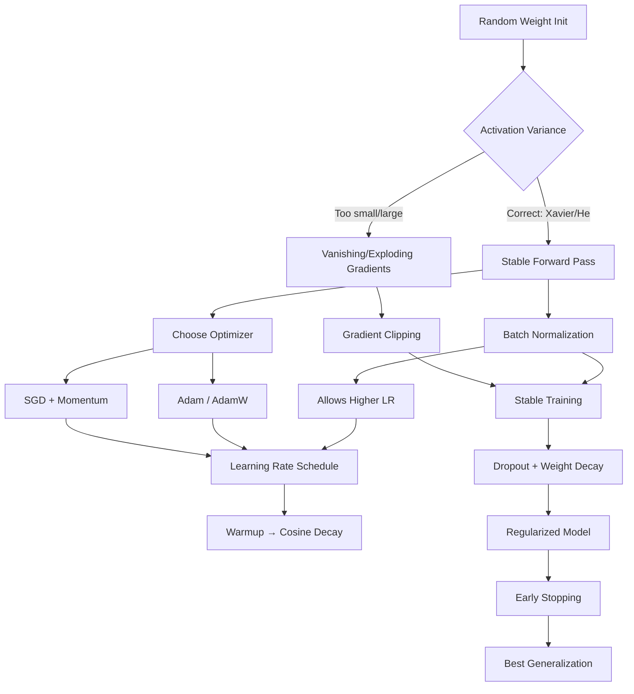

# Deep Learning: Optimizing a Neural Network
## A Production-Quality Engineering Guide for 2026

> **"A neural network is only as good as the optimization strategy that trains it."**

---

## What You Will Learn

This guide is a deep, end-to-end resource on **how to train neural networks effectively**. It covers the full optimization stack — from gradient descent fundamentals to production training practices used at leading AI labs and companies today.

By the end, you will:
- Understand every major optimizer and when to reach for each
- Know how to initialize, stabilize, and regularize networks
- Be equipped to tune hyperparameters systematically
- Build two production-grade training pipelines from scratch

## Who This Is For

- **ML Engineers** moving from "it trains" to "it trains well"
- **Junior/Mid-level Deep Learning practitioners** seeking depth
- **Researchers** wanting a consolidated reference
- **Interview candidates** prepping for ML/DL roles in 2026

---

## Table of Contents

1. [Optimization Core](#optimization-core)
   - [Batch vs Mini-Batch vs SGD](#batch-vs-mini-batch-vs-sgd)
   - [Learning Rate & Schedules](#learning-rate--learning-rate-schedules)
     - [Step Decay](#step-decay)
     - [Cosine Decay](#cosine-decay)
     - [Warmup](#warmup)
   - [Momentum & Nesterov Momentum](#momentum--nesterov-momentum)
   - [Adaptive Optimizers](#adaptive-optimizers)
     - [Adagrad](#adagrad)
     - [RMSProp](#rmsprop)
     - [Adam](#adam)
     - [AdamW](#adamw)
2. [Initialization & Stability](#initialization--stability)
   - [Weight Initialization](#weight-initialization)
     - [Xavier / Glorot](#xavierglort-initialization)
     - [He Initialization](#he-initialization)
   - [Gradient Clipping](#gradient-clipping)
   - [Batch Normalization](#batch-normalization)
   - [Dropout](#dropout)
3. [Training Practice](#training-practice)
   - [Early Stopping](#early-stopping)
   - [Regularization](#regularization)
     - [L1 / L2](#l1--l2-regularization)
     - [Weight Decay](#weight-decay)
   - [Hyperparameter Tuning Basics](#hyperparameter-tuning-basics)
4. [Cross-Topic Relationships](#cross-topic-relationships)
5. [End-to-End Projects](#end-to-end-projects)
   - [Project 1: Image Classifier with Full Training Pipeline (CIFAR-10)](#project-1-image-classifier-with-full-training-pipeline)
   - [Project 2: Tabular Fraud Detection with MLP + Optimization Study](#project-2-tabular-fraud-detection-with-mlp--optimization-study)
6. [Algorithm Comparison Tables](#algorithm-comparison-tables)
7. [Common Mistakes & Pitfalls](#common-mistakes--pitfalls)
8. [Interview Preparation](#interview-preparation)
9. [Resources](#resources)

---

# 1. Optimization Core

---

## Batch vs Mini-Batch vs SGD

### a. Intuition

Think of training a neural network as navigating a mountainous landscape where you're trying to find the lowest valley (minimum loss). To decide which direction to step, you need to estimate the slope (gradient) of the terrain.

- **Full Batch Gradient Descent**: You survey the *entire* mountain range before each step. Accurate, but exhausting.
- **Stochastic Gradient Descent (SGD)**: You look at *one rock* under your foot and step based only on that. Fast, but erratic.
- **Mini-Batch Gradient Descent**: You survey a *small patch* of terrain — a middle ground that is both efficient and reasonably accurate.

In practice, "SGD" in libraries like PyTorch refers to mini-batch SGD. True single-sample SGD is rarely used in production.

### b. Mathematical Insight

Let `L(θ)` be the loss over dataset `D` with `N` samples.

**Full Batch:**
```
θ ← θ - η · (1/N) Σᵢ ∇L(θ; xᵢ, yᵢ)
```

**SGD (single sample):**
```
θ ← θ - η · ∇L(θ; xᵢ, yᵢ)
```

**Mini-Batch (batch size B):**
```
θ ← θ - η · (1/B) Σᵢ∈Bₖ ∇L(θ; xᵢ, yᵢ)
```

The gradient from a mini-batch is a **noisy but unbiased estimate** of the true gradient. That noise is often *helpful* — it acts as implicit regularization, helping the model escape sharp local minima.

### c. How It Works (Step-by-Step)

**Mini-Batch Training Loop:**
1. Shuffle the dataset at the start of each epoch.
2. Partition data into batches of size `B`.
3. For each batch:
   a. Forward pass: compute predictions and loss.
   b. Backward pass: compute gradients via backpropagation.
   c. Update parameters: `θ ← θ - η · ∇L_batch`.
4. Repeat for `E` epochs.

### d. Visual Representation

```
Dataset: [x1, x2, x3, ..., xN]
          |_B1_| |_B2_| |_B3_|  ...  |_Bk_|

Epoch 1:
  Step 1: grad = avg_gradient(B1)  → update θ
  Step 2: grad = avg_gradient(B2)  → update θ
  ...
  Step k: grad = avg_gradient(Bk)  → update θ

Epoch 2: Shuffle → repeat
```

**Loss Landscape Behavior:**

```
Full Batch:    ──────────────────────────────▶ (smooth, slow)
Mini-Batch:    ~~~~~~~~~~~~~~~~~~~▶           (noisy, efficient)
True SGD:      ∿∿∿∿∿∿∿∿∿∿∿∿∿▶               (very noisy)
```

### e. Python Implementation

```python
import numpy as np
import torch
import torch.nn as nn
from torch.utils.data import DataLoader, TensorDataset

def create_dataloaders(X, y, batch_size=64, val_split=0.2):
    """
    Splits data and creates PyTorch DataLoaders.
    
    Args:
        X: Feature tensor
        y: Target tensor
        batch_size: Mini-batch size
        val_split: Fraction of data for validation
    """
    N = len(X)
    split = int(N * (1 - val_split))
    
    X_train, X_val = X[:split], X[split:]
    y_train, y_val = y[:split], y[split:]
    
    train_dataset = TensorDataset(X_train, y_train)
    val_dataset   = TensorDataset(X_val, y_val)
    
    train_loader = DataLoader(
        train_dataset,
        batch_size=batch_size,
        shuffle=True,   # Critical: shuffle each epoch
        drop_last=True  # Avoids partial batches causing unstable gradients
    )
    val_loader = DataLoader(
        val_dataset,
        batch_size=batch_size * 2,  # No gradient, so we can afford larger batches
        shuffle=False
    )
    return train_loader, val_loader


def train_one_epoch(model, loader, optimizer, criterion, device):
    """Standard mini-batch training loop for one epoch."""
    model.train()
    total_loss = 0.0
    
    for batch_X, batch_y in loader:
        batch_X, batch_y = batch_X.to(device), batch_y.to(device)
        
        optimizer.zero_grad()          # Clear previous gradients
        predictions = model(batch_X)   # Forward pass
        loss = criterion(predictions, batch_y)  # Compute loss
        loss.backward()                # Backward pass (compute gradients)
        optimizer.step()               # Update weights
        
        total_loss += loss.item()
    
    return total_loss / len(loader)


# Example usage: Comparing batch sizes
def compare_batch_sizes(X, y, model_fn, epochs=10):
    """Demonstrates effect of different batch sizes on training dynamics."""
    results = {}
    
    for bs in [1, 32, 256, len(X)]:  # SGD, mini-batch, large-batch, full-batch
        model = model_fn()
        optimizer = torch.optim.SGD(model.parameters(), lr=0.01)
        criterion = nn.MSELoss()
        loader, _ = create_dataloaders(X, y, batch_size=min(bs, len(X)))
        
        losses = []
        for _ in range(epochs):
            loss = train_one_epoch(model, loader, optimizer, criterion, 'cpu')
            losses.append(loss)
        
        results[f'batch_size={bs}'] = losses
    
    return results
```

### f. When to Use / Avoid

| Setting | Recommendation |
|---|---|
| Large dataset, GPU | **Mini-batch (32–512)** — standard choice |
| Small dataset (<1000 samples) | **Full batch** — stable gradients, no noise needed |
| Online / streaming data | **SGD (batch=1)** — must process one sample at a time |
| Debugging / overfitting test | **Full batch** — remove noise to isolate model issues |
| Transformers / LLMs | **Gradient accumulation** — simulate large batches within VRAM limits |

**Avoid** batch size > 8192 without learning rate scaling (linear scaling rule) — large batches often generalize worse.

### g. Key Hyperparameters

| Parameter | Typical Range | Effect |
|---|---|---|
| `batch_size` | 32–512 | Larger → smoother gradients, faster per-epoch, worse generalization |
| `shuffle` | Always `True` for train | Prevents order-dependent biases |
| `drop_last` | `True` for train | Avoids noisy partial-batch gradients |

---

## Learning Rate & Learning Rate Schedules

### a. Intuition

The learning rate `η` is the single most important hyperparameter in deep learning. It controls *how big a step* you take each time you update weights.

- **Too high**: You overshoot the minimum — imagine jumping over the valley entirely.
- **Too low**: Training is painfully slow — you take tiny shuffles toward the goal.
- **Schedule**: Rather than a fixed rate, we *anneal* the learning rate over training — start aggressively, then slow down to fine-tune.

A good analogy: when driving to a destination, you drive fast on the highway (high LR) and slow down as you approach parking (low LR).

### b. Mathematical Insight

**Base update rule:**
```
θ_t+1 = θ_t - η_t · ∇L(θ_t)
```

Where `η_t` is the learning rate at step `t` — and this is what schedules control.

---

### Step Decay

#### a. Intuition
Reduce the LR by a fixed factor every `k` epochs. Simple and effective. Like a staircase going down.

#### b. Mathematical Insight
```
η_t = η_0 · γ^⌊t/k⌋

η_0 = initial learning rate
γ   = decay factor (e.g., 0.1)
k   = step size (epochs between drops)
```

#### c. How It Works
1. Train normally for `k` epochs at `η_0`.
2. Multiply LR by `γ` (e.g., divide by 10).
3. Repeat until training ends.

#### d. Visual Representation
```
LR
|
0.1 ──────┐
          │
0.01      └──────┐
                 │
0.001            └──────┐
                        │
0.0001                  └──────
─────────────────────────────── Epoch
0    10   20   30   40
```

#### e. Python Implementation

```python
import torch.optim.lr_scheduler as lr_scheduler

# Step decay: halve LR every 10 epochs
scheduler = lr_scheduler.StepLR(
    optimizer,
    step_size=10,   # Every 10 epochs
    gamma=0.5       # Multiply by 0.5
)

# MultiStep: drop at specific epochs (more flexible)
scheduler = lr_scheduler.MultiStepLR(
    optimizer,
    milestones=[30, 60, 90],  # Epochs to decay at
    gamma=0.1
)

# In training loop:
for epoch in range(num_epochs):
    train_one_epoch(model, loader, optimizer, criterion, device)
    scheduler.step()  # Update LR after each epoch
    print(f"Epoch {epoch}: LR = {scheduler.get_last_lr()}")
```

---

### Cosine Decay

#### a. Intuition
Instead of abrupt drops, smoothly decay the LR following a cosine curve. Think of it as a smooth ramp-down from highway to parking speed — no sudden braking. This is the dominant schedule in modern deep learning (transformers, ResNets, ViTs).

#### b. Mathematical Insight
```
η_t = η_min + 0.5 · (η_max - η_min) · (1 + cos(π · t / T))

t = current step/epoch
T = total steps/epochs
η_min = minimum LR (often 1e-6 or 0)
η_max = peak LR
```

At `t=0`: `η = η_max` (start high)
At `t=T`: `η = η_min` (end low)

#### c. How It Works
1. Set peak LR and minimum LR.
2. At each step, compute the cosine-annealed value.
3. LR follows a smooth S-curve downward.

#### d. Visual Representation
```
LR
η_max |╲
      |  ╲
      |    ╲
      |      ╲
      |        ╲___
η_min |             ────────
      ─────────────────────── Step
      0                     T
```

#### e. Python Implementation

```python
# Cosine annealing (no restart)
scheduler = lr_scheduler.CosineAnnealingLR(
    optimizer,
    T_max=num_epochs,     # Total epochs
    eta_min=1e-6          # Minimum LR floor
)

# Cosine with warm restarts (SGDR - great for finding multiple minima)
scheduler = lr_scheduler.CosineAnnealingWarmRestarts(
    optimizer,
    T_0=10,      # Epochs per cycle initially
    T_mult=2,    # Double cycle length after each restart
    eta_min=1e-6
)

# Modern approach: cosine with linear warmup (via LambdaLR)
def cosine_with_warmup(step, warmup_steps, total_steps, eta_min_ratio=0.1):
    """
    Combined warmup + cosine decay schedule.
    Returns LR multiplier (relative to base LR).
    """
    if step < warmup_steps:
        return step / warmup_steps  # Linear warmup
    
    progress = (step - warmup_steps) / (total_steps - warmup_steps)
    cosine = 0.5 * (1 + np.cos(np.pi * progress))
    return eta_min_ratio + (1 - eta_min_ratio) * cosine

scheduler = lr_scheduler.LambdaLR(
    optimizer,
    lr_lambda=lambda step: cosine_with_warmup(step, warmup_steps=500, total_steps=10000)
)
```

---

### Warmup

#### a. Intuition
At the very start of training, weights are random and gradients are wild. If you immediately apply a large learning rate, you can destabilize the network — weights blow up or collapse.

**Warmup** solves this by starting with a tiny LR and gradually ramping it up to the target over the first few hundred to few thousand steps. It's like easing into a workout before going full intensity.

This is *critical* for training Transformers, large batch training, and fine-tuning pretrained models.

#### b. Mathematical Insight
```
Linear Warmup:
η_t = η_peak · (t / T_warmup)    for t < T_warmup
η_t = schedule(t)                 for t ≥ T_warmup
```

#### c. How It Works
1. Set `T_warmup` (e.g., 4% of total training steps).
2. For the first `T_warmup` steps: linearly ramp `η` from near-zero to `η_peak`.
3. After warmup: apply your main schedule (cosine, constant, etc.).

#### d. Visual Representation
```
LR
η_peak |      ╱╲
       |    ╱    ╲
       |  ╱        ╲
       |╱              ╲___________
η_min  |
       ────────────────────────────── Step
       |←warmup→|←── main schedule ──|
```

#### e. Python Implementation

```python
from torch.optim.lr_scheduler import LambdaLR

def get_linear_warmup_cosine_schedule(optimizer, warmup_steps, total_steps, min_lr_ratio=0.0):
    """
    Standard warmup + cosine decay schedule used in modern DL.
    Used by BERT, GPT, ViT training recipes.
    """
    def lr_lambda(current_step):
        # Warmup phase
        if current_step < warmup_steps:
            return float(current_step) / float(max(1, warmup_steps))
        
        # Cosine decay phase
        progress = float(current_step - warmup_steps) / float(max(1, total_steps - warmup_steps))
        cosine_decay = max(min_lr_ratio, 0.5 * (1.0 + np.cos(np.pi * progress)))
        return cosine_decay
    
    return LambdaLR(optimizer, lr_lambda)


# Usage in a realistic training setup
optimizer = torch.optim.AdamW(model.parameters(), lr=3e-4)

total_steps = num_epochs * len(train_loader)
warmup_steps = int(0.05 * total_steps)  # 5% warmup is common

scheduler = get_linear_warmup_cosine_schedule(
    optimizer,
    warmup_steps=warmup_steps,
    total_steps=total_steps
)

# In the training loop, call scheduler.step() AFTER each batch (not epoch)
for epoch in range(num_epochs):
    for batch_X, batch_y in train_loader:
        optimizer.zero_grad()
        loss = criterion(model(batch_X), batch_y)
        loss.backward()
        optimizer.step()
        scheduler.step()  # Per-step, not per-epoch
```

### f. When to Use / Avoid

| Schedule | Use When | Avoid When |
|---|---|---|
| **Constant LR** | Quick experiments, debugging | Production training |
| **Step Decay** | CNNs (ResNet recipes), known milestones | Unknown optimal milestone epochs |
| **Cosine Decay** | Most modern architectures | Rarely avoided — versatile |
| **Warmup** | Transformers, large batch, fine-tuning | Very small networks / datasets |
| **Cosine Warmup** | LLMs, ViTs, all large-scale training | N/A — almost always beneficial |

### g. Key Hyperparameters

| Parameter | Typical Value | Notes |
|---|---|---|
| `η_0` (initial LR) | 1e-4 to 3e-3 (Adam) | Most critical param — see tuning section |
| `T_warmup` | 5–10% of total steps | More warmup for larger models |
| `η_min` | 1e-6 to 1e-5 | Cosine floor; avoid 0 |
| Step decay `γ` | 0.1 (aggressive) to 0.5 | 0.1 is standard for image classification |

---

## Momentum & Nesterov Momentum

### a. Intuition

Standard gradient descent is reactive — it only considers the current gradient. Momentum makes optimization *proactive* by remembering the direction it was already moving in.

Think of a ball rolling down a hill. Without momentum, the ball stops the moment the slope flattens. With momentum, the ball keeps rolling due to inertia — it can coast through shallow local minima and converge faster.

**Nesterov momentum** is a smarter variant: instead of computing the gradient at the *current* position, it takes a "lookahead" step in the direction of momentum first, then computes the gradient there. It's like looking ahead around a curve before turning.

### b. Mathematical Insight

**SGD with Momentum:**
```
v_t = β · v_{t-1} + ∇L(θ_t)
θ_{t+1} = θ_t - η · v_t

v_t   = velocity (accumulated gradient direction)
β     = momentum coefficient (typically 0.9)
```

**Nesterov Accelerated Gradient (NAG):**
```
v_t = β · v_{t-1} + ∇L(θ_t - η · β · v_{t-1})
θ_{t+1} = θ_t - η · v_t
```

The key difference: in Nesterov, the gradient is computed at the *anticipated* next position `θ_t - η·β·v_{t-1}`, not the current one.

### c. How It Works (Step-by-Step)

**Momentum:**
1. Initialize velocity `v = 0`.
2. At each step: `v ← β·v + ∇L(θ)` (mix old direction with new gradient).
3. Update: `θ ← θ - η·v`.

**Nesterov:**
1. Initialize velocity `v = 0`.
2. Compute lookahead position: `θ_look = θ - η·β·v`.
3. Compute gradient at lookahead: `g = ∇L(θ_look)`.
4. Update velocity: `v ← β·v + g`.
5. Update parameters: `θ ← θ - η·v`.

### d. Visual Representation

```
Standard GD:         Momentum:            Nesterov:
   ↗                    ↗                    ↗
↗                    ↗                    ↗  (peeks ahead)
  ↗ ↖ ↗ (oscillates)  →  →  →  (smooth)   →  →  → (smoother)
       ↘                       ↓                   ↓ (faster)
```

```
Loss landscape cross-section:

Standard SGD:  • → • → • → •    (bounces in ravines)
                   ↗ ↘ ↗ ↘
Momentum:      • ──────────▶    (builds up speed along consistent directions)
```

### e. Python Implementation

```python
import torch
import torch.nn as nn

# Standard SGD with Momentum
optimizer_momentum = torch.optim.SGD(
    model.parameters(),
    lr=0.01,
    momentum=0.9,        # β coefficient
    nesterov=False,
    weight_decay=1e-4    # Optional L2 regularization
)

# Nesterov Momentum
optimizer_nesterov = torch.optim.SGD(
    model.parameters(),
    lr=0.01,
    momentum=0.9,
    nesterov=True,       # Enable Nesterov lookahead
    weight_decay=1e-4
)

# Numpy implementation for understanding (educational)
def sgd_momentum_step(params, grads, velocities, lr=0.01, beta=0.9):
    """
    Manual SGD with momentum update — for understanding, not production.
    
    params:     list of numpy arrays (weights)
    grads:      list of numpy arrays (gradients)
    velocities: list of numpy arrays (accumulated momentum)
    """
    for i in range(len(params)):
        velocities[i] = beta * velocities[i] + grads[i]
        params[i] = params[i] - lr * velocities[i]
    return params, velocities


# Demonstrating momentum effect on a simple quadratic loss
def demonstrate_momentum():
    """Shows how momentum accelerates convergence on a bowl-shaped loss."""
    import numpy as np
    
    # f(x, y) = x^2 + 10*y^2 (elongated bowl — hard for vanilla GD)
    def loss_fn(x, y):
        return x**2 + 10 * y**2
    
    def grad_fn(x, y):
        return np.array([2*x, 20*y])
    
    # Run vanilla SGD
    theta = np.array([1.0, 1.0])
    lr = 0.1
    for _ in range(50):
        g = grad_fn(*theta)
        theta = theta - lr * g
    print(f"Vanilla GD converged to: {theta}")
    
    # Run SGD with Momentum
    theta = np.array([1.0, 1.0])
    v = np.zeros(2)
    beta = 0.9
    for _ in range(50):
        g = grad_fn(*theta)
        v = beta * v + g
        theta = theta - lr * v
    print(f"Momentum GD converged to: {theta}")

demonstrate_momentum()
```

### f. When to Use / Avoid

| Optimizer | Use When |
|---|---|
| SGD + Momentum | ResNets, CNNs for vision — often achieves best final accuracy |
| Nesterov | Slight improvement over vanilla momentum; worth enabling by default |
| Neither | Don't train without momentum when using SGD — almost always worse |

**Key insight**: SGD + Momentum often *outperforms* Adam in final test accuracy for image classification if tuned properly. Adam finds a good solution *faster*, but SGD + Momentum often finds a *flatter, better* minimum.

### g. Key Hyperparameters

| Parameter | Typical Value | Effect |
|---|---|---|
| `momentum` (β) | 0.9 | Industry standard; try 0.95 for LLMs |
| `nesterov` | `True` | Almost always better; flip it on |
| `lr` with momentum | ~10x lower than without | Momentum amplifies updates |

---

## Adaptive Optimizers

### a. Intuition (Overview)

A fundamental problem with SGD: all parameters share the same learning rate, but different parameters may need very different update sizes.

- A weight that rarely gets gradients (e.g., an embedding for a rare word) needs large updates when it does.
- A weight that gets large gradients every step needs smaller updates to avoid overshooting.

Adaptive optimizers solve this by **maintaining per-parameter learning rates** that adjust automatically based on historical gradients.

---

### Adagrad

#### a. Intuition
Adagrad keeps a **running sum of squared gradients** for each parameter. Parameters that have received large historical gradients get a smaller effective learning rate; those with small historical gradients get a larger one.

Analogy: imagine you're filling holes in a road. Common potholes (frequent gradients) need less dramatic filling each time; rare potholes need more aggressive repair.

**Problem with Adagrad**: The accumulated sum only grows — the learning rate monotonically shrinks to near-zero. This makes Adagrad ill-suited for long training runs.

#### b. Mathematical Insight
```
G_t = G_{t-1} + g_t²          (accumulated squared gradients)
θ_t = θ_{t-1} - η / √(G_t + ε) · g_t

g_t  = gradient at step t
ε    = small constant for numerical stability (1e-8)
G_t  = cumulative squared gradient sum
```

#### c. Python Implementation

```python
# PyTorch
optimizer = torch.optim.Adagrad(
    model.parameters(),
    lr=0.01,
    eps=1e-10,
    lr_decay=0,         # Optional decay of LR over time
    weight_decay=0
)

# Numpy implementation for insight
def adagrad_update(params, grads, cache, lr=0.01, eps=1e-8):
    """
    Adagrad: adaptive per-parameter learning rates.
    cache accumulates squared gradients.
    """
    updated_params = []
    updated_cache = []
    
    for p, g, c in zip(params, grads, cache):
        c_new = c + g**2                    # Accumulate squared gradients
        p_new = p - lr / (np.sqrt(c_new) + eps) * g  # Adaptive update
        updated_params.append(p_new)
        updated_cache.append(c_new)
    
    return updated_params, updated_cache
```

#### f. When to Use / Avoid

- **Use**: NLP tasks with sparse features, embedding learning, convex problems.
- **Avoid**: Long deep learning training runs — LR decays to zero.

---

### RMSProp

#### a. Intuition
RMSProp fixes Adagrad's monotonic decay problem by using an **exponential moving average** of squared gradients instead of a sum. The cache "forgets" distant history, allowing the learning rate to recover if gradients change.

It was proposed by Geoff Hinton in a Coursera lecture — notably never formally published.

#### b. Mathematical Insight
```
E[g²]_t = ρ · E[g²]_{t-1} + (1-ρ) · g_t²    (EMA of squared gradients)
θ_t = θ_{t-1} - η / √(E[g²]_t + ε) · g_t

ρ = decay factor (typically 0.9)
```

The EMA ensures that recent gradients matter more than old ones.

#### c. Python Implementation

```python
optimizer = torch.optim.RMSprop(
    model.parameters(),
    lr=1e-3,
    alpha=0.99,         # Decay factor ρ (EMA for squared gradients)
    eps=1e-8,
    momentum=0,         # Optional momentum on top of RMSProp
    centered=False      # If True, normalizes by variance instead of 2nd moment
)

# Numpy: understanding the EMA cache update
def rmsprop_update(params, grads, cache, lr=1e-3, rho=0.9, eps=1e-8):
    """RMSProp with exponential moving average of squared gradients."""
    updated_params = []
    updated_cache = []
    
    for p, g, c in zip(params, grads, cache):
        c_new = rho * c + (1 - rho) * g**2          # EMA update
        p_new = p - lr / (np.sqrt(c_new) + eps) * g  # Adaptive step
        updated_params.append(p_new)
        updated_cache.append(c_new)
    
    return updated_params, updated_cache
```

#### f. When to Use / Avoid

- **Use**: RNNs, non-stationary objectives, RL problems.
- **Avoid**: Modern architectures where Adam/AdamW is the default.

---

### Adam

#### a. Intuition
Adam (Adaptive Moment Estimation) combines the best of momentum and RMSProp:
- **First moment** (`m`): EMA of gradients — like momentum, captures direction.
- **Second moment** (`v`): EMA of squared gradients — like RMSProp, captures scale.

Result: you get adaptive per-parameter learning rates *and* momentum — the best of both worlds. Adam is the go-to optimizer for most deep learning tasks in 2026.

**Bias correction**: Early in training, `m` and `v` are initialized to zero, so they're biased toward zero. Adam corrects for this with bias correction factors.

#### b. Mathematical Insight
```
m_t = β₁ · m_{t-1} + (1-β₁) · g_t         (1st moment: EMA of gradients)
v_t = β₂ · v_{t-1} + (1-β₂) · g_t²        (2nd moment: EMA of squared gradients)

m̂_t = m_t / (1 - β₁ᵗ)    (bias-corrected 1st moment)
v̂_t = v_t / (1 - β₂ᵗ)    (bias-corrected 2nd moment)

θ_t = θ_{t-1} - η · m̂_t / (√v̂_t + ε)

β₁ = 0.9   (momentum decay)
β₂ = 0.999 (RMS decay)
ε  = 1e-8
```

#### c. How It Works (Step-by-Step)
1. Initialize `m = 0, v = 0, t = 0`.
2. At each step, increment `t`.
3. Compute gradient `g`.
4. Update first moment: `m ← β₁·m + (1-β₁)·g`.
5. Update second moment: `v ← β₂·v + (1-β₂)·g²`.
6. Bias-correct both moments.
7. Update parameters using bias-corrected moments.

#### d. Visual Representation
```
Adam internals per parameter:

g_t (gradient)
 │
 ├──▶ m_t = β₁·m_{t-1} + (1-β₁)·g_t  ──▶ m̂_t (bias corrected) ──▶ numerator
 │
 └──▶ v_t = β₂·v_{t-1} + (1-β₂)·g_t² ──▶ v̂_t (bias corrected) ──▶ √v̂_t + ε ──▶ denominator

θ_t = θ_{t-1} - η · (numerator / denominator)
```

#### e. Python Implementation

```python
# Standard Adam — what most people use
optimizer = torch.optim.Adam(
    model.parameters(),
    lr=3e-4,          # "Karpathy constant" — a solid default
    betas=(0.9, 0.999),
    eps=1e-8,
    weight_decay=0    # Note: this is L2 reg, NOT weight decay (see AdamW)
)

# Complete numpy implementation for full understanding
class AdamOptimizer:
    """
    Clean numpy implementation of Adam optimizer.
    Educational purposes — understand the internals.
    """
    def __init__(self, params, lr=3e-4, beta1=0.9, beta2=0.999, eps=1e-8):
        self.lr = lr
        self.beta1 = beta1
        self.beta2 = beta2
        self.eps = eps
        self.t = 0  # Step counter
        
        # Initialize first and second moment vectors
        self.m = [np.zeros_like(p) for p in params]
        self.v = [np.zeros_like(p) for p in params]
    
    def step(self, params, grads):
        """Perform one Adam update step."""
        self.t += 1
        updated_params = []
        
        for i, (p, g) in enumerate(zip(params, grads)):
            # Update biased first moment estimate
            self.m[i] = self.beta1 * self.m[i] + (1 - self.beta1) * g
            
            # Update biased second raw moment estimate
            self.v[i] = self.beta2 * self.v[i] + (1 - self.beta2) * (g ** 2)
            
            # Bias-corrected estimates
            m_hat = self.m[i] / (1 - self.beta1 ** self.t)
            v_hat = self.v[i] / (1 - self.beta2 ** self.t)
            
            # Parameter update
            p_new = p - self.lr * m_hat / (np.sqrt(v_hat) + self.eps)
            updated_params.append(p_new)
        
        return updated_params
```

---

### AdamW

#### a. Intuition
AdamW fixes a subtle but important bug in Adam: **weight decay and L2 regularization are NOT the same thing in adaptive optimizers**.

In Adam with `weight_decay`, the L2 penalty gets divided by the adaptive learning rate scale `√v̂ + ε`, which means parameters with large gradients get *less* regularization than parameters with small gradients. This is wrong — regularization should be applied uniformly.

**AdamW** applies weight decay *directly* to the parameters, *decoupled* from the gradient update. This is the correct way and leads to better generalization.

AdamW is the **default optimizer** for training transformers, LLMs, and most modern architectures.

#### b. Mathematical Insight

**Adam (incorrect weight decay):**
```
θ_t = θ_{t-1} - η · [m̂_t / (√v̂_t + ε) + λ·θ_{t-1}]
      ↑ Weight decay scaled by adaptive rate (WRONG)
```

**AdamW (correct decoupled weight decay):**
```
θ_t = θ_{t-1} - η · m̂_t / (√v̂_t + ε)    (gradient update)
    - η · λ · θ_{t-1}                       (weight decay, applied separately)

λ = weight decay coefficient
```

#### c. Python Implementation

```python
# AdamW — the correct choice for modern DL
optimizer = torch.optim.AdamW(
    model.parameters(),
    lr=3e-4,
    betas=(0.9, 0.999),
    eps=1e-8,
    weight_decay=0.01     # Decoupled weight decay (NOT L2 regularization in the gradient)
)

# Pro tip: different weight decay for different parameter groups
# (e.g., don't decay biases or LayerNorm parameters)
def get_parameter_groups(model, weight_decay):
    """
    Correctly separates decay/no-decay parameter groups.
    Standard practice in transformer training (BERT, GPT, etc.)
    """
    decay_params = []
    no_decay_params = []
    
    for name, param in model.named_parameters():
        if not param.requires_grad:
            continue
        # Don't decay biases and LayerNorm weights
        if param.ndim <= 1 or 'bias' in name or 'norm' in name or 'ln' in name:
            no_decay_params.append(param)
        else:
            decay_params.append(param)
    
    return [
        {'params': decay_params, 'weight_decay': weight_decay},
        {'params': no_decay_params, 'weight_decay': 0.0}
    ]

param_groups = get_parameter_groups(model, weight_decay=0.01)
optimizer = torch.optim.AdamW(param_groups, lr=3e-4)
```

### f. When to Use / Avoid (All Adaptive Optimizers)

| Optimizer | Primary Use Case | When to Avoid |
|---|---|---|
| **Adagrad** | Sparse NLP, embeddings | Long training, deep nets |
| **RMSProp** | RNNs, RL | Modern feed-forward nets |
| **Adam** | Quick experiments, most tasks | When final accuracy matters most |
| **AdamW** | Transformers, fine-tuning, LLMs | Almost never — prefer this over Adam |
| **SGD+Momentum** | Image classification (ResNets) | NLP/Transformers |

### g. Key Hyperparameters (Adam/AdamW)

| Parameter | Typical Value | Notes |
|---|---|---|
| `lr` | 1e-4 to 3e-3 | Most important; tune with LR finder |
| `beta1` | 0.9 | Rarely changed |
| `beta2` | 0.999 (Adam), 0.95 (some LLMs) | Lower for noisy gradients |
| `eps` | 1e-8 | Increase to 1e-6 for stability with FP16 |
| `weight_decay` | 0.01–0.1 | Critical for generalization; don't skip |

---

# 2. Initialization & Stability

---

## Weight Initialization

### a. Intuition

Before training begins, you must set the initial values of every weight in the network. This is far more important than it looks.

If weights start **too large**: activations explode through layers — signals grow out of control.
If weights start **too small**: activations vanish — gradients can't propagate back through deep networks.

The goal is to set weights such that the **variance of activations remains roughly constant** across all layers during the forward pass, and that **gradient variance remains constant** during the backward pass.

Think of it like designing an audio amplifier chain: if every stage amplifies the signal differently, you'll either get distortion (explosion) or silence (vanishing) by the end.

---

### Xavier/Glorot Initialization

#### a. Intuition
Designed for networks with **sigmoid or tanh activations** (symmetric around zero). It balances the variance of inputs and outputs at each layer to maintain signal integrity.

#### b. Mathematical Insight
```
Xavier Uniform:   W ~ Uniform(-a, a)  where  a = √(6 / (n_in + n_out))
Xavier Normal:    W ~ Normal(0, σ²)   where  σ = √(2 / (n_in + n_out))

n_in  = number of input units to the layer
n_out = number of output units from the layer
```

**Derivation intuition**: If `W` has variance `Var(W)`, and inputs `x` have variance `Var(x)`, then output `y = Wx` has variance ≈ `n_in · Var(W) · Var(x)`. Xavier sets `Var(W) = 2/(n_in + n_out)` so variance is roughly preserved.

#### e. Python Implementation

```python
import torch
import torch.nn as nn
import numpy as np

# PyTorch uses Xavier uniform by default for Linear layers
# But let's be explicit:
def initialize_xavier(model):
    """Apply Xavier initialization to all linear layers."""
    for name, module in model.named_modules():
        if isinstance(module, nn.Linear):
            nn.init.xavier_uniform_(module.weight)
            if module.bias is not None:
                nn.init.zeros_(module.bias)   # Biases always start at 0
        elif isinstance(module, nn.Conv2d):
            nn.init.xavier_uniform_(module.weight)
            if module.bias is not None:
                nn.init.zeros_(module.bias)

# Numpy: understanding what Xavier produces
n_in, n_out = 256, 128
limit = np.sqrt(6 / (n_in + n_out))
W_xavier = np.random.uniform(-limit, limit, size=(n_in, n_out))
print(f"Xavier std: {W_xavier.std():.4f}")  # ≈ √(2/(n_in+n_out))
```

---

### He Initialization

#### a. Intuition
Designed specifically for **ReLU activations**. ReLU kills half the neurons (outputs 0 for negative inputs), so you effectively halve the variance of the signal. He initialization compensates by doubling the variance of weights compared to Xavier.

Used in: ResNets, VGG, most modern CNNs with ReLU.

#### b. Mathematical Insight
```
He Normal:    W ~ Normal(0, σ²)   where  σ = √(2 / n_in)
He Uniform:   W ~ Uniform(-a, a)  where  a = √(6 / n_in)

Note: n_out is dropped because ReLU's dead zone only affects n_in.
```

#### e. Python Implementation

```python
def initialize_he(model):
    """Apply He (Kaiming) initialization for ReLU networks."""
    for name, module in model.named_modules():
        if isinstance(module, (nn.Linear, nn.Conv2d)):
            # mode='fan_in' preserves variance in forward pass
            # mode='fan_out' preserves variance in backward pass
            nn.init.kaiming_normal_(
                module.weight,
                mode='fan_in',
                nonlinearity='relu'  # Accounts for ReLU's gain factor
            )
            if module.bias is not None:
                nn.init.zeros_(module.bias)
        elif isinstance(module, (nn.BatchNorm2d, nn.BatchNorm1d)):
            nn.init.ones_(module.weight)   # γ starts at 1
            nn.init.zeros_(module.bias)    # β starts at 0

# Demonstrating the importance of initialization
def activation_variance_check(init_fn, activation_fn, depth=20, width=256):
    """
    Checks if activations maintain reasonable variance across layers.
    A well-initialized network should show stable variance.
    """
    x = torch.randn(64, width)  # Random input batch
    variances = [x.var().item()]
    
    for _ in range(depth):
        W = torch.empty(width, width)
        init_fn(W)
        x = activation_fn(x @ W.T)
        variances.append(x.var().item())
    
    return variances

# Compare initializations
import torch.nn.functional as F

variances_xavier = activation_variance_check(
    nn.init.xavier_normal_, F.relu
)
variances_he = activation_variance_check(
    lambda W: nn.init.kaiming_normal_(W, nonlinearity='relu'), F.relu
)

print("Xavier var at depth 20:", variances_xavier[-1])  # Likely vanishes
print("He var at depth 20:", variances_he[-1])           # Stays near 1
```

### f. When to Use / Avoid

| Initialization | Activation Function | Notes |
|---|---|---|
| **Xavier (Glorot)** | Sigmoid, Tanh, Linear | Standard for classical nets |
| **He (Kaiming)** | ReLU, Leaky ReLU, ELU | Standard for modern CNNs |
| **Orthogonal** | RNNs | Preserves gradient norms in recurrent nets |
| **Random Normal (small σ)** | Never recommended alone | Use Xavier/He instead |
| **Zero** | NEVER | Symmetric breaking failure — all neurons learn the same thing |

### g. Key Hyperparameters

| Parameter | Value | Notes |
|---|---|---|
| `mode` | `fan_in` | Preserves forward variance |
| `nonlinearity` | `relu` / `tanh` | Adjusts gain factor |
| Bias initialization | Always `zeros` | Never random |

---

## Gradient Clipping

### a. Intuition

During training, especially in RNNs and Transformers, gradients can occasionally become explosively large — a single bad batch causes massive weight updates that derail training.

**Gradient clipping** is a safety mechanism: if the gradient norm exceeds a threshold, scale it down so the norm equals the threshold. It's like a circuit breaker for your optimizer.

### b. Mathematical Insight

**Clip by norm (most common):**
```
If ||g|| > clip_value:
    g ← g · (clip_value / ||g||)

||g|| = L2 norm of all gradients concatenated into a single vector
```

**Clip by value (less common):**
```
g_i ← clip(g_i, -clip_value, clip_value)
```

### c. How It Works
1. Compute all gradients via backpropagation.
2. Compute the global gradient norm across all parameters.
3. If norm exceeds `max_norm`, scale ALL gradients proportionally.
4. Apply optimizer step.

### d. Visual Representation
```
Gradient vector g: [100, 200, 150, ...]   ||g|| = 1000 (too large!)

After clipping (max_norm=1.0):
g_clipped = g · (1.0 / 1000) = [0.1, 0.2, 0.15, ...]   ||g_clipped|| = 1.0

Direction preserved ✓    Magnitude bounded ✓
```

### e. Python Implementation

```python
# Standard gradient clipping (use this BEFORE optimizer.step())
def train_step_with_clipping(model, batch_X, batch_y, optimizer, criterion, max_norm=1.0):
    """
    Standard training step with gradient clipping.
    Critical for RNNs, Transformers, and any unstable training.
    """
    optimizer.zero_grad()
    
    loss = criterion(model(batch_X), batch_y)
    loss.backward()
    
    # Clip BEFORE optimizer step
    grad_norm = torch.nn.utils.clip_grad_norm_(
        model.parameters(),
        max_norm=max_norm  # Clip threshold; 1.0 is standard
    )
    
    optimizer.step()
    
    return loss.item(), grad_norm.item()  # Logging grad_norm is useful!


# Monitoring gradient norms (recommended practice)
def log_gradient_norms(model):
    """Compute per-layer gradient norms for debugging."""
    norms = {}
    for name, param in model.named_parameters():
        if param.grad is not None:
            norms[name] = param.grad.norm().item()
    return norms
```

### f. When to Use / Avoid

- **Always use** when training RNNs, LSTMs, Transformers.
- **Use** when you observe loss spikes or NaN during training.
- **Consider** for very deep networks (>50 layers).
- **Less critical** for shallow CNNs with BatchNorm (BN naturally stabilizes gradients).

### g. Key Hyperparameters

| Parameter | Typical Value | Notes |
|---|---|---|
| `max_norm` | 1.0 | Standard for transformers; 0.5 for RNNs |
| Clip type | `norm` | Preferred over value clipping |

---

## Batch Normalization

### a. Intuition

As data flows through a deep network, the distribution of activations shifts at each layer — a problem called **Internal Covariate Shift**. This means each layer is constantly adapting to a moving target, slowing training dramatically.

**Batch Normalization (BN)** normalizes the activations within each mini-batch to have zero mean and unit variance, then applies learned scale (γ) and shift (β) parameters. Think of it as automatically recalibrating the signal at every layer, so each layer always receives a stable, well-scaled input.

Benefits:
- Much faster training (allows higher LRs)
- Acts as a regularizer (often eliminates need for Dropout in CNNs)
- Makes initialization less critical
- Dramatically stabilizes training

### b. Mathematical Insight
```
Input to BN: x = {x₁, ..., xₘ} (mini-batch activations)

Step 1: μ_B = (1/m) Σ xᵢ              (batch mean)
Step 2: σ²_B = (1/m) Σ (xᵢ - μ_B)²   (batch variance)
Step 3: x̂ᵢ = (xᵢ - μ_B) / √(σ²_B + ε)  (normalize)
Step 4: yᵢ = γ · x̂ᵢ + β               (scale and shift)

γ, β = learned parameters (γ starts at 1, β starts at 0)
ε    = 1e-5 for numerical stability
```

**At inference**: uses running mean/variance (exponential moving averages accumulated during training), not the batch statistics.

### c. How It Works (Step-by-Step)
1. Compute batch mean `μ_B` and variance `σ²_B`.
2. Normalize activations to zero mean, unit variance.
3. Scale by learned `γ` and shift by learned `β`.
4. During training: update running stats `μ_running = 0.9·μ_running + 0.1·μ_B`.
5. At inference: use frozen running stats, not batch stats.

### d. Visual Representation
```
Layer output (raw)    After BN                After γ, β (learned)

   ▂▃▄▅▆▇█             ▃▃▄▅▅▆▆               ▂▃▄▅▆▇█
   (shifted, scaled     (zero-centered,        (re-scaled by γ,β
    randomly)           unit variance)          to optimal range)

Before BN: each layer sees a distribution shift → unstable
After BN:  each layer always gets normalized inputs → stable
```

### e. Python Implementation

```python
import torch
import torch.nn as nn

# BN in a CNN
class ConvBNReLU(nn.Module):
    """
    Standard Conv → BN → ReLU block.
    BN goes BEFORE activation (original paper order).
    Some modern architectures use Pre-activation: BN → ReLU → Conv.
    """
    def __init__(self, in_channels, out_channels, kernel_size=3, padding=1):
        super().__init__()
        self.conv = nn.Conv2d(in_channels, out_channels, kernel_size, padding=padding, bias=False)
        # bias=False because BN's beta parameter serves the same role
        self.bn = nn.BatchNorm2d(
            out_channels,
            eps=1e-5,
            momentum=0.1,      # Running stats decay (0.1 = update 10% each step)
            affine=True,       # Learn γ and β
            track_running_stats=True  # Track running mean/var for inference
        )
        self.relu = nn.ReLU(inplace=True)
    
    def forward(self, x):
        return self.relu(self.bn(self.conv(x)))


# BN in a fully-connected network
class MLP_with_BN(nn.Module):
    def __init__(self, input_size, hidden_sizes, output_size):
        super().__init__()
        layers = []
        prev_size = input_size
        
        for hidden_size in hidden_sizes:
            layers.extend([
                nn.Linear(prev_size, hidden_size, bias=False),  # No bias with BN
                nn.BatchNorm1d(hidden_size),
                nn.ReLU(inplace=True)
            ])
            prev_size = hidden_size
        
        layers.append(nn.Linear(prev_size, output_size))
        self.network = nn.Sequential(*layers)
    
    def forward(self, x):
        return self.network(x)


# CRITICAL: model.train() vs model.eval() changes BN behavior
def proper_inference(model, test_loader, device):
    """
    Must call model.eval() before inference.
    This switches BN to use running stats (not batch stats).
    """
    model.eval()  # Critical! BN uses running_mean/var, not batch stats
    predictions = []
    
    with torch.no_grad():  # Disable gradient computation
        for batch_X, _ in test_loader:
            batch_X = batch_X.to(device)
            pred = model(batch_X)
            predictions.append(pred.cpu())
    
    return torch.cat(predictions)
```

### f. When to Use / Avoid

| Scenario | Recommendation |
|---|---|
| CNNs (image tasks) | **Always use BN** — standard since 2015 |
| MLPs (tabular data) | **Often beneficial** — reduce to BN on hidden layers |
| Transformers | **Use Layer Norm instead** — BN doesn't work well with variable-length sequences |
| Small batch sizes (<8) | **Avoid BN** — use Group Norm or Layer Norm instead |
| Batch size = 1 | **Never use BN** — statistics are meaningless |
| RNNs | **Use Layer Norm** — BN not suitable for sequential data |

### g. Key Hyperparameters

| Parameter | Value | Notes |
|---|---|---|
| `momentum` | 0.1 | Running stats update rate; lower = slower adaptation |
| `eps` | 1e-5 | Stability in normalization denominator |
| `affine` | `True` | Always learn γ and β |

---

## Dropout

### a. Intuition

**Dropout** is a regularization technique that randomly deactivates neurons during training. At each forward pass, each neuron has a probability `p` of being set to zero.

Why does this help? It forces the network to not rely on any single neuron — every path through the network must work independently. This is equivalent to training an ensemble of exponentially many smaller networks and averaging their predictions.

At inference, dropout is disabled (all neurons active), but outputs are scaled to account for the extra active units.

Analogy: imagine a sports team where random players sit out each practice. Every remaining player has to step up. The team becomes more robust because no single player becomes a crutch.

### b. Mathematical Insight
```
Training:   h̃ᵢ = rᵢ · hᵢ / (1-p)    where rᵢ ~ Bernoulli(1-p)
Inference:  h̃ᵢ = hᵢ

p    = dropout probability (fraction of neurons dropped)
rᵢ   = 0 (dropped) or 1 (kept)
1/(1-p) = inverted dropout scaling (keeps expected value the same)
```

**Inverted dropout** (dividing by `1-p` during training) means NO scaling is needed at inference — the standard PyTorch implementation.

### c. How It Works
1. At each training forward pass, sample a binary mask: each unit is kept with probability `(1-p)`.
2. Multiply activations by the mask, then scale by `1/(1-p)`.
3. Gradients only flow through kept neurons during backprop.
4. At inference: disable dropout, use all neurons as-is.

### d. Visual Representation

```
Training (p=0.5):
Input:    [a, b, c, d, e, f]
Mask:     [1, 0, 1, 0, 1, 1]  ← random each forward pass
Scaled:   [2a, 0, 2c, 0, 2e, 2f]

Inference:
Output:   [a, b, c, d, e, f]  ← all neurons active, no scaling needed
```

### e. Python Implementation

```python
import torch.nn as nn

class MLPWithDropout(nn.Module):
    """
    MLP with dropout placed AFTER activation (standard convention).
    Dropout is only active during training (model.train() mode).
    """
    def __init__(self, input_size, hidden_size, output_size, dropout_rate=0.5):
        super().__init__()
        self.network = nn.Sequential(
            nn.Linear(input_size, hidden_size),
            nn.ReLU(),
            nn.Dropout(p=dropout_rate),   # After activation, before next layer
            
            nn.Linear(hidden_size, hidden_size),
            nn.ReLU(),
            nn.Dropout(p=dropout_rate),
            
            nn.Linear(hidden_size, output_size)
            # No dropout on the output layer
        )
    
    def forward(self, x):
        return self.network(x)


# Dropout variants for different use cases
class TransformerWithDropout(nn.Module):
    """
    In transformers, dropout is applied in multiple places.
    """
    def __init__(self, d_model=512, dropout=0.1):
        super().__init__()
        self.attn_dropout = nn.Dropout(dropout)      # After attention weights
        self.resid_dropout = nn.Dropout(dropout)     # After residual connection
        self.ff_dropout = nn.Dropout(dropout)        # Within feed-forward block


# Spatial Dropout for CNNs (drops entire feature maps, not individual pixels)
class CNNWithSpatialDropout(nn.Module):
    def __init__(self, in_channels, out_channels, dropout_rate=0.2):
        super().__init__()
        self.conv = nn.Conv2d(in_channels, out_channels, 3, padding=1)
        # Drops entire feature maps (channels), not individual activations
        self.spatial_dropout = nn.Dropout2d(p=dropout_rate)
        self.relu = nn.ReLU()
    
    def forward(self, x):
        return self.relu(self.spatial_dropout(self.conv(x)))


# Confirming dropout is disabled at inference
def check_dropout_mode(model):
    """Demonstrates model.train() vs model.eval() behavior."""
    x = torch.randn(1, 100)
    
    model.train()
    out_train_1 = model(x)
    out_train_2 = model(x)
    print(f"Training mode — same input, different outputs: {not torch.allclose(out_train_1, out_train_2)}")
    
    model.eval()
    out_eval_1 = model(x)
    out_eval_2 = model(x)
    print(f"Eval mode — same input, same outputs: {torch.allclose(out_eval_1, out_eval_2)}")
```

### f. When to Use / Avoid

| Scenario | Recommendation |
|---|---|
| Large MLPs / FC layers | **Use Dropout (p=0.3–0.5)** |
| CNNs | **Prefer Batch Normalization**; use Dropout2d if needed |
| Transformers | **Use (p=0.1)** — standard in BERT, GPT |
| Small networks | **Avoid** — adds noise, insufficient parameters to benefit |
| Output layer | **Never apply Dropout** |
| Inference | **Always model.eval()** — disables Dropout |

### g. Key Hyperparameters

| Parameter | Typical Range | Notes |
|---|---|---|
| `p` (dropout rate) | 0.1–0.5 | 0.5 for MLPs; 0.1 for Transformers |
| Placement | After activation | Before BatchNorm is wrong |
| Type | Standard / Spatial / AlphaDropout | Choose based on architecture |

---

# 3. Training Practice

---

## Early Stopping

### a. Intuition

A neural network, if trained long enough, will **memorize** the training data — learning noise, outliers, and dataset-specific quirks rather than generalizable patterns. This is overfitting.

**Early stopping** monitors a validation metric (usually validation loss) and stops training when it stops improving — capturing the model at the sweet spot between underfitting and overfitting.

Think of cooking: you don't just set a timer and assume food will be done. You taste it periodically and stop when it's perfect.

### b. Mathematical Insight
```
For patience P and current epoch t:

best_val_loss  = minimum validation loss seen so far
patience_count = number of epochs since last improvement

if val_loss_t < best_val_loss - min_delta:
    best_val_loss = val_loss_t
    patience_count = 0
    save_checkpoint()
else:
    patience_count += 1
    if patience_count >= P:
        stop training
        restore best checkpoint
```

### c. Visual Representation
```
Loss
  |
  |  Train Loss:  ──────────────────────────────────────▶ (always decreasing)
  |
  |  Val Loss:    ─────────╲        ╱‾‾‾‾‾‾‾‾‾‾‾‾‾‾‾‾▶ (rises after sweet spot)
  |                         ╲      ╱
  |                          ╲    ╱
  |                           ╲  ╱
  |                            ╲╱
  |                          ← STOP HERE (best val loss)
  |
  ──────────────────────────────────────────── Epoch
                              ↑
                      Early stopping fires here
```

### e. Python Implementation

```python
class EarlyStopping:
    """
    Early stopping with model checkpoint saving.
    Industry-standard implementation pattern.
    """
    def __init__(self, patience=10, min_delta=1e-4, restore_best_weights=True, verbose=True):
        self.patience = patience
        self.min_delta = min_delta
        self.restore_best_weights = restore_best_weights
        self.verbose = verbose
        
        self.best_loss = float('inf')
        self.patience_counter = 0
        self.best_weights = None
        self.stopped_epoch = 0
    
    def __call__(self, val_loss, model):
        """
        Call at the end of each epoch.
        Returns True if training should stop.
        """
        if val_loss < self.best_loss - self.min_delta:
            # Improvement found
            self.best_loss = val_loss
            self.patience_counter = 0
            # Save best model weights (deep copy)
            self.best_weights = {k: v.clone() for k, v in model.state_dict().items()}
            if self.verbose:
                print(f"  ✓ Val loss improved to {val_loss:.6f}")
        else:
            # No improvement
            self.patience_counter += 1
            if self.verbose:
                print(f"  ✗ No improvement for {self.patience_counter}/{self.patience} epochs")
            
            if self.patience_counter >= self.patience:
                self.stopped_epoch = self.patience_counter
                if self.restore_best_weights and self.best_weights:
                    model.load_state_dict(self.best_weights)
                    if self.verbose:
                        print(f"  → Restored best weights (val_loss={self.best_loss:.6f})")
                return True  # Signal to stop
        
        return False  # Continue training


# Usage in training loop
def train_with_early_stopping(model, train_loader, val_loader, optimizer, criterion,
                               max_epochs=200, patience=15, device='cpu'):
    early_stopping = EarlyStopping(patience=patience, verbose=True)
    history = {'train_loss': [], 'val_loss': []}
    
    for epoch in range(max_epochs):
        # Train
        train_loss = train_one_epoch(model, train_loader, optimizer, criterion, device)
        
        # Validate
        val_loss = evaluate(model, val_loader, criterion, device)
        
        history['train_loss'].append(train_loss)
        history['val_loss'].append(val_loss)
        
        print(f"Epoch {epoch+1:03d} | Train Loss: {train_loss:.4f} | Val Loss: {val_loss:.4f}")
        
        # Check early stopping
        if early_stopping(val_loss, model):
            print(f"\nEarly stopping triggered at epoch {epoch+1}")
            break
    
    return history
```

### f. When to Use / Avoid

- **Always use** — it's essentially free insurance against overfitting.
- Set `patience` based on your LR schedule: if you have LR drops that cause temporary loss increases, use higher patience (20–50).
- **Restore best weights** — the default should always be to reload the checkpoint.

### g. Key Hyperparameters

| Parameter | Typical Value | Notes |
|---|---|---|
| `patience` | 10–50 | Higher for LR schedules with drops |
| `min_delta` | 1e-4 | Minimum improvement to count |
| Monitor metric | `val_loss` | Can also use `val_accuracy` |

---

## Regularization

### a. Intuition (Overview)

Regularization techniques constrain the model from overfitting by adding penalties or noise. The goal: prefer simpler models that generalize better.

---

### L1 / L2 Regularization

#### a. Intuition

**L2 (Ridge)**: Penalizes large weights by adding the squared sum of weights to the loss. Large weights are expensive, so the model prefers many small weights — smooth, distributed representations.

**L1 (Lasso)**: Penalizes weights by their absolute sum. This creates *sparsity* — many weights go exactly to zero, producing implicit feature selection.

Analogy:
- L2 = packing light (distribute weight evenly across your bag)
- L1 = packing minimally (throw out anything non-essential)

#### b. Mathematical Insight
```
L2 Regularized Loss:
L_total = L_data + λ · Σᵢ wᵢ²
∂L/∂wᵢ = ∂L_data/∂wᵢ + 2λ · wᵢ    ← gradient pushes weights toward 0

L1 Regularized Loss:
L_total = L_data + λ · Σᵢ |wᵢ|
∂L/∂wᵢ = ∂L_data/∂wᵢ + λ · sign(wᵢ)  ← constant push → exact zeros

λ = regularization strength
```

L2 effect: weights are multiplied by `(1 - 2λη)` each step → exponential decay toward zero (but rarely reach zero).
L1 effect: weights are pushed by a constant factor → can reach exactly zero.

#### e. Python Implementation

```python
import torch
import torch.nn as nn

# L2 via weight_decay in optimizer (PREFERRED — computationally efficient)
optimizer_l2 = torch.optim.SGD(
    model.parameters(),
    lr=0.01,
    weight_decay=1e-4   # This IS L2 regularization for SGD
)
# Note: For Adam, this is NOT true weight decay (see AdamW section)

# L1 regularization (must be added manually to loss)
def l1_regularization(model, lambda_l1):
    """Computes L1 penalty across all parameters."""
    l1_penalty = sum(param.abs().sum() for param in model.parameters())
    return lambda_l1 * l1_penalty

# L2 regularization manually (equivalent to weight_decay for SGD)
def l2_regularization(model, lambda_l2):
    """Computes L2 penalty across all parameters."""
    l2_penalty = sum((param ** 2).sum() for param in model.parameters())
    return lambda_l2 * l2_penalty

# Combined L1+L2 (Elastic Net)
def elastic_net_regularization(model, lambda_l1, lambda_l2):
    l1 = l1_regularization(model, lambda_l1)
    l2 = l2_regularization(model, lambda_l2)
    return l1 + l2

# Usage in training loop
def train_step_with_l1(model, batch_X, batch_y, optimizer, criterion, lambda_l1=1e-4):
    optimizer.zero_grad()
    loss = criterion(model(batch_X), batch_y)
    loss += l1_regularization(model, lambda_l1)  # Add L1 penalty
    loss.backward()
    optimizer.step()
    return loss.item()
```

---

### Weight Decay

#### a. Intuition

Weight decay and L2 regularization are mathematically equivalent for SGD but **not for adaptive optimizers** like Adam (see AdamW section). Weight decay directly shrinks weights at each step, independent of the gradient.

The distinction matters: when people say "add weight decay," they increasingly mean the AdamW-style decoupled version, not the L2-penalty version baked into the loss.

#### b. Mathematical Insight
```
SGD with weight decay:
θ_{t+1} = θ_t - η · (∇L + λ · θ_t)
         = θ_t · (1 - η·λ) - η · ∇L    ← weight shrinks by (1-η·λ) each step

AdamW (decoupled):
θ_{t+1} = θ_t - η · m̂/(√v̂+ε)    ← gradient update
         - η · λ · θ_t              ← weight decay (separate, fixed)
```

#### e. Python Implementation

```python
# Best practice: AdamW with decoupled weight decay
optimizer = torch.optim.AdamW(
    model.parameters(),
    lr=3e-4,
    weight_decay=0.01    # 0.01–0.1 is the modern range
)

# For SGD: weight_decay in optimizer = L2 regularization
optimizer_sgd = torch.optim.SGD(
    model.parameters(),
    lr=0.01,
    momentum=0.9,
    weight_decay=5e-4    # Standard for image classification (ResNet recipes)
)

# Selective weight decay: exclude biases and norm parameters
def build_optimizer_with_selective_decay(model, lr, weight_decay):
    """
    Best practice: don't apply weight decay to biases, LayerNorm, BatchNorm.
    These parameters don't benefit from regularization the same way.
    """
    decay, no_decay = [], []
    
    for name, param in model.named_parameters():
        if not param.requires_grad:
            continue
        if param.ndim == 1 or 'bias' in name:  # 1D = biases and norm weights
            no_decay.append(param)
        else:
            decay.append(param)
    
    return torch.optim.AdamW([
        {'params': decay, 'weight_decay': weight_decay},
        {'params': no_decay, 'weight_decay': 0.0}
    ], lr=lr)
```

### f. When to Use / Avoid

| Method | Best For | Notes |
|---|---|---|
| **L2 / Weight Decay** | Almost always — default regularizer | Use AdamW for correct behavior |
| **L1** | Feature selection, sparse models | Rarely in deep learning |
| **Elastic Net** | When both sparsity and stability needed | Tabular data MLPs |
| **Dropout** | Large networks, overparameterized models | Complementary to weight decay |

### g. Key Hyperparameters

| Parameter | Typical Range | Notes |
|---|---|---|
| `weight_decay` (AdamW) | 0.01–0.1 | 0.1 for transformers; 0.01 for most |
| `weight_decay` (SGD) | 1e-4 to 5e-4 | Standard for CNNs |
| `lambda_l1` | 1e-5 to 1e-3 | If used manually |

---

## Hyperparameter Tuning Basics

### a. Intuition

Hyperparameter tuning is the process of finding the combination of settings (learning rate, batch size, depth, etc.) that produces the best model. Unlike model parameters (weights) which are learned automatically, hyperparameters must be set by the engineer.

The key insight: **not all hyperparameters are equal**. Learning rate and weight decay are the most impactful; architecture depth matters; batch size matters less.

### b. The Most Critical Hyperparameters (in order of impact)

```
1. Learning Rate        ← #1 most important
2. Weight Decay / Regularization
3. Batch Size           ← often scales with LR
4. Model Architecture (depth, width)
5. Dropout Rate
6. Optimizer choice
7. LR Schedule
8. Warmup steps
```

### c. How It Works: Tuning Strategies

**Random Search** (better than grid search):
- Grid search wastes budget on unimportant parameters.
- Random search can find good learning rates and decay combos much faster.
- Rule of thumb: 20–50 random configurations cover more space than a 3×3 grid.

**Learning Rate Finder** (Smith, 2017):
- Sweep LR exponentially from very low (1e-7) to very high (1).
- Plot loss vs LR — choose LR just before the loss starts rising steeply.

**Linear Scaling Rule** (batch size):
- When doubling batch size, multiply LR by 2 (approximately).
- Requires warmup to be effective at large batch sizes.

### d. Python Implementation

```python
import numpy as np
import torch
import optuna  # Modern hyperparameter optimization framework

# ── Learning Rate Finder ─────────────────────────────────────────────
def lr_finder(model, train_loader, optimizer_class, criterion,
              start_lr=1e-7, end_lr=1.0, num_iter=100):
    """
    Implements the LR Range Test (fastai/Smith 2017).
    Gradually increases LR and records loss at each step.
    """
    # Clone model to avoid permanent weight changes
    import copy
    model_copy = copy.deepcopy(model)
    
    # Create optimizer with very small initial LR
    optimizer = optimizer_class(model_copy.parameters(), lr=start_lr)
    
    # Exponential LR multiplier
    lr_mult = (end_lr / start_lr) ** (1 / num_iter)
    scheduler = torch.optim.lr_scheduler.ExponentialLR(optimizer, gamma=lr_mult)
    
    lrs, losses = [], []
    
    data_iter = iter(train_loader)
    
    for i in range(num_iter):
        try:
            batch_X, batch_y = next(data_iter)
        except StopIteration:
            data_iter = iter(train_loader)
            batch_X, batch_y = next(data_iter)
        
        optimizer.zero_grad()
        loss = criterion(model_copy(batch_X), batch_y)
        loss.backward()
        optimizer.step()
        
        current_lr = scheduler.get_last_lr()[0]
        lrs.append(current_lr)
        losses.append(loss.item())
        
        scheduler.step()
        
        # Stop if loss explodes
        if loss.item() > 4 * losses[0] or np.isnan(loss.item()):
            break
    
    # Suggested LR: steepest descent region (about 10x before minimum loss)
    min_loss_idx = np.argmin(losses)
    suggested_lr = lrs[max(0, min_loss_idx - 10)]
    
    return lrs, losses, suggested_lr


# ── Optuna Hyperparameter Search ─────────────────────────────────────
def optuna_study(train_fn, n_trials=50):
    """
    Modern hyperparameter optimization with Optuna.
    Uses Tree-structured Parzen Estimator (TPE) — smarter than random search.
    """
    def objective(trial):
        # Define the search space
        lr = trial.suggest_float('lr', 1e-5, 1e-2, log=True)
        weight_decay = trial.suggest_float('weight_decay', 1e-5, 0.1, log=True)
        batch_size = trial.suggest_categorical('batch_size', [32, 64, 128, 256])
        dropout_rate = trial.suggest_float('dropout_rate', 0.0, 0.5)
        n_layers = trial.suggest_int('n_layers', 2, 6)
        hidden_size = trial.suggest_categorical('hidden_size', [128, 256, 512])
        
        # Train and return validation loss
        val_loss = train_fn(lr=lr, weight_decay=weight_decay, batch_size=batch_size,
                           dropout_rate=dropout_rate, n_layers=n_layers, hidden_size=hidden_size)
        return val_loss
    
    study = optuna.create_study(
        direction='minimize',
        sampler=optuna.samplers.TPESampler(seed=42)  # Bayesian-ish search
    )
    study.optimize(objective, n_trials=n_trials)
    
    print(f"Best val loss: {study.best_value:.4f}")
    print(f"Best params: {study.best_params}")
    return study


# ── Quick Grid Search (for small spaces) ─────────────────────────────
from sklearn.model_selection import ParameterGrid

def grid_search_demo():
    """Simple grid search — useful only when search space is tiny."""
    param_grid = {
        'lr': [1e-3, 3e-4, 1e-4],
        'weight_decay': [0.0, 0.01],
        'batch_size': [32, 128]
    }
    
    results = []
    for params in ParameterGrid(param_grid):
        print(f"Testing: {params}")
        # val_loss = train_model(**params)
        # results.append({**params, 'val_loss': val_loss})
    
    return results
```

### f. When to Use / Avoid

| Strategy | Use When | Avoid When |
|---|---|---|
| **LR Finder** | New dataset/architecture | When you have a known good LR |
| **Random Search** | Moderate budget (20–100 trials) | Single fixed run |
| **Optuna (Bayesian)** | Large search spaces, expensive training | Very cheap models |
| **Grid Search** | ≤3 hyperparams with tiny ranges | Any realistic DL scenario |
| **Manual tuning** | Quick debugging, known architectures | Production hyperparameter search |

### g. Key Hyperparameter Rules of Thumb

| Hyperparameter | Start With | Notes |
|---|---|---|
| **Learning rate** | 3e-4 (Adam) / 0.01 (SGD) | Use LR finder |
| **Batch size** | 64–256 | Scale LR linearly with BS |
| **Network depth** | 3–5 layers | Deepen before widening |
| **Hidden size** | 256–512 | Powers of 2 for hardware efficiency |
| **Dropout** | 0.3 (MLP), 0.1 (Transformer) | Start here |
| **Weight decay** | 0.01 (AdamW) | Always use it |

---

# 4. Cross-Topic Relationships

Understanding how these concepts interconnect is what separates an engineer who can follow a tutorial from one who can *design* a training pipeline from scratch.



**The evolution of a training pipeline:**

```
1. Naive Training (1980s–1990s):
   Random init → SGD → fixed LR → overfit

2. Classical Deep Learning (2000s–2012):
   Better init (Xavier) → Momentum SGD → some regularization

3. Modern Deep Learning (2015–2020):
   He init → BatchNorm → Adam → Dropout → LR schedules

4. Production Training (2021–2026):
   He/Xavier → BatchNorm/LayerNorm → AdamW → Weight Decay
   → Cosine + Warmup → Gradient Clipping → Early Stopping
   → Hyperparameter search via Optuna
```

**Key conceptual bridges:**

- **BatchNorm** reduces the need for careful initialization — it normalizes internally.
- **AdamW** makes weight decay work correctly, replacing manual L2 regularization.
- **Warmup** compensates for poor initialization early in training — a bridge between "weights are random" and "weights are learning."
- **Gradient Clipping** is the last line of defense when initialization, BN, and weight decay fail to prevent instability.
- **Early Stopping** and **Weight Decay** are complementary — WD prevents overfitting during training; ES stops training *at* the right time.
- **Learning rate schedules** are the "pacing strategy" that ties all the other components together.

---

# 5. End-to-End Projects

---

## Project 1: Image Classifier with Full Training Pipeline

### a. Problem Statement

A medical imaging startup needs to classify chest X-ray images into **Normal**, **Pneumonia (Bacterial)**, and **Pneumonia (Viral)** categories. The model will assist radiologists by flagging high-priority cases.

Business requirements:
- High recall on pneumonia cases (missing a case is costly)
- Fast inference (<50ms per image)
- Model must generalize across different hospital equipment

### b. Dataset

**Real Dataset**: [Chest X-Ray Images (Pneumonia) on Kaggle](https://www.kaggle.com/datasets/paultimothymooney/chest-xray-pneumonia)

- ~5,800 images (JPG)
- Split: train/val/test
- Classes: NORMAL, PNEUMONIA (BACTERIAL, VIRAL)
- Challenge: Class imbalance (more pneumonia than normal)

### c. Step-by-Step Pipeline

### d. Full Code Pipeline

```python
import torch
import torch.nn as nn
import torch.nn.functional as F
from torch.utils.data import DataLoader, WeightedRandomSampler
from torchvision import datasets, transforms, models
import numpy as np
import matplotlib.pyplot as plt
from sklearn.metrics import classification_report, confusion_matrix
import optuna
import os

# ── 1. Configuration ─────────────────────────────────────────────────
CONFIG = {
    'data_dir': './chest_xray',
    'num_classes': 3,
    'image_size': 224,
    'batch_size': 64,
    'num_epochs': 50,
    'learning_rate': 3e-4,
    'weight_decay': 0.01,
    'dropout_rate': 0.3,
    'patience': 10,
    'device': 'cuda' if torch.cuda.is_available() else 'cpu',
    'seed': 42
}

torch.manual_seed(CONFIG['seed'])
np.random.seed(CONFIG['seed'])


# ── 2. Data Loading & Augmentation ───────────────────────────────────
def get_transforms(split='train', image_size=224):
    """
    Returns appropriate transforms for each split.
    Augmentation only for training — prevents data leakage.
    """
    if split == 'train':
        return transforms.Compose([
            transforms.Resize((image_size + 32, image_size + 32)),
            transforms.RandomCrop(image_size),           # Random crop
            transforms.RandomHorizontalFlip(p=0.5),      # X-rays can be mirrored
            transforms.RandomRotation(degrees=15),        # Small rotations
            transforms.ColorJitter(brightness=0.2, contrast=0.2),
            transforms.ToTensor(),
            transforms.Normalize(mean=[0.485, 0.456, 0.406],  # ImageNet stats
                                 std=[0.229, 0.224, 0.225])
        ])
    else:  # val/test
        return transforms.Compose([
            transforms.Resize((image_size, image_size)),
            transforms.ToTensor(),
            transforms.Normalize(mean=[0.485, 0.456, 0.406],
                                 std=[0.229, 0.224, 0.225])
        ])


def get_dataloaders(config):
    """Creates train/val/test dataloaders with class imbalance handling."""
    
    train_dataset = datasets.ImageFolder(
        os.path.join(config['data_dir'], 'train'),
        transform=get_transforms('train', config['image_size'])
    )
    val_dataset = datasets.ImageFolder(
        os.path.join(config['data_dir'], 'val'),
        transform=get_transforms('val', config['image_size'])
    )
    test_dataset = datasets.ImageFolder(
        os.path.join(config['data_dir'], 'test'),
        transform=get_transforms('test', config['image_size'])
    )
    
    # Handle class imbalance with WeightedRandomSampler
    class_counts = np.bincount(train_dataset.targets)
    class_weights = 1.0 / class_counts
    sample_weights = class_weights[train_dataset.targets]
    sampler = WeightedRandomSampler(
        weights=sample_weights,
        num_samples=len(sample_weights),
        replacement=True
    )
    
    train_loader = DataLoader(train_dataset, batch_size=config['batch_size'],
                              sampler=sampler, num_workers=4, pin_memory=True)
    val_loader   = DataLoader(val_dataset, batch_size=config['batch_size'] * 2,
                              shuffle=False, num_workers=4)
    test_loader  = DataLoader(test_dataset, batch_size=config['batch_size'] * 2,
                              shuffle=False, num_workers=4)
    
    print(f"Classes: {train_dataset.classes}")
    print(f"Train: {len(train_dataset)} | Val: {len(val_dataset)} | Test: {len(test_dataset)}")
    
    return train_loader, val_loader, test_loader


# ── 3. Model: Transfer Learning + Custom Head ─────────────────────────
class ChestXRayClassifier(nn.Module):
    """
    ResNet18 backbone with custom classification head.
    Transfer learning: backbone is partially frozen initially.
    """
    def __init__(self, num_classes=3, dropout_rate=0.3, freeze_backbone=True):
        super().__init__()
        
        # Load pretrained ResNet18
        backbone = models.resnet18(weights=models.ResNet18_Weights.IMAGENET1K_V1)
        
        # Extract feature extractor (everything except final FC)
        self.features = nn.Sequential(*list(backbone.children())[:-2])
        
        if freeze_backbone:
            for param in self.features.parameters():
                param.requires_grad = False
        
        # Custom classification head
        self.head = nn.Sequential(
            nn.AdaptiveAvgPool2d(1),
            nn.Flatten(),
            nn.Linear(512, 256),
            nn.BatchNorm1d(256),
            nn.ReLU(inplace=True),
            nn.Dropout(dropout_rate),
            nn.Linear(256, num_classes)
        )
        
        # Initialize the custom head properly
        self._init_head()
    
    def _init_head(self):
        """He initialization for ReLU layers in the head."""
        for module in self.head.modules():
            if isinstance(module, nn.Linear):
                nn.init.kaiming_normal_(module.weight, nonlinearity='relu')
                if module.bias is not None:
                    nn.init.zeros_(module.bias)
    
    def unfreeze_backbone(self, unfreeze_last_n=2):
        """Unfreeze last N layers of backbone for fine-tuning."""
        backbone_layers = list(self.features.children())
        for layer in backbone_layers[-unfreeze_last_n:]:
            for param in layer.parameters():
                param.requires_grad = True
    
    def forward(self, x):
        features = self.features(x)
        return self.head(features)


# ── 4. Training Infrastructure ────────────────────────────────────────
class Trainer:
    """
    Production-quality training loop with all best practices.
    """
    def __init__(self, model, config):
        self.model = model.to(config['device'])
        self.config = config
        self.device = config['device']
        
        # Separate parameter groups (no weight decay on bias/BN)
        self.optimizer = self._build_optimizer()
        
        # Warmup + Cosine decay schedule
        self.total_steps = config['num_epochs'] * 100  # Approximate
        self.warmup_steps = int(0.05 * self.total_steps)
        self.scheduler = self._build_scheduler()
        
        # Weighted loss for class imbalance
        self.criterion = nn.CrossEntropyLoss()
        
        # Early stopping
        self.early_stopper = EarlyStopping(
            patience=config['patience'],
            restore_best_weights=True
        )
        
        self.history = {'train_loss': [], 'val_loss': [],
                        'train_acc': [], 'val_acc': []}
    
    def _build_optimizer(self):
        """AdamW with selective weight decay."""
        decay, no_decay = [], []
        for name, param in self.model.named_parameters():
            if not param.requires_grad:
                continue
            if param.ndim <= 1 or 'bias' in name:
                no_decay.append(param)
            else:
                decay.append(param)
        
        return torch.optim.AdamW([
            {'params': decay, 'weight_decay': self.config['weight_decay']},
            {'params': no_decay, 'weight_decay': 0.0}
        ], lr=self.config['learning_rate'])
    
    def _build_scheduler(self):
        """Linear warmup + cosine decay."""
        def lr_lambda(step):
            if step < self.warmup_steps:
                return float(step) / float(max(1, self.warmup_steps))
            progress = float(step - self.warmup_steps) / float(
                max(1, self.total_steps - self.warmup_steps))
            return max(0.01, 0.5 * (1.0 + np.cos(np.pi * progress)))
        
        return torch.optim.lr_scheduler.LambdaLR(self.optimizer, lr_lambda)
    
    def train_epoch(self, loader):
        """One training epoch."""
        self.model.train()
        total_loss, correct, total = 0.0, 0, 0
        
        for batch_X, batch_y in loader:
            batch_X, batch_y = batch_X.to(self.device), batch_y.to(self.device)
            
            self.optimizer.zero_grad()
            logits = self.model(batch_X)
            loss = self.criterion(logits, batch_y)
            loss.backward()
            
            # Gradient clipping
            torch.nn.utils.clip_grad_norm_(self.model.parameters(), max_norm=1.0)
            
            self.optimizer.step()
            self.scheduler.step()
            
            total_loss += loss.item()
            preds = logits.argmax(dim=1)
            correct += (preds == batch_y).sum().item()
            total += len(batch_y)
        
        return total_loss / len(loader), correct / total
    
    @torch.no_grad()
    def evaluate(self, loader):
        """Evaluation on val/test split."""
        self.model.eval()
        total_loss, correct, total = 0.0, 0, 0
        
        for batch_X, batch_y in loader:
            batch_X, batch_y = batch_X.to(self.device), batch_y.to(self.device)
            logits = self.model(batch_X)
            loss = self.criterion(logits, batch_y)
            
            total_loss += loss.item()
            preds = logits.argmax(dim=1)
            correct += (preds == batch_y).sum().item()
            total += len(batch_y)
        
        return total_loss / len(loader), correct / total
    
    def fit(self, train_loader, val_loader):
        """Full training loop: Phase 1 (frozen) → Phase 2 (fine-tune)."""
        print("── Phase 1: Training head only (backbone frozen) ──")
        
        for epoch in range(self.config['num_epochs']):
            # Unfreeze backbone after 5 epochs (progressive fine-tuning)
            if epoch == 5:
                print("\n── Phase 2: Fine-tuning with unfrozen backbone layers ──")
                self.model.unfreeze_backbone(unfreeze_last_n=2)
                # Rebuild optimizer with backbone's lower LR
                for pg in self.optimizer.param_groups:
                    pg['lr'] *= 0.1  # Lower LR for pretrained weights
            
            train_loss, train_acc = self.train_epoch(train_loader)
            val_loss, val_acc = self.evaluate(val_loader)
            
            self.history['train_loss'].append(train_loss)
            self.history['val_loss'].append(val_loss)
            self.history['train_acc'].append(train_acc)
            self.history['val_acc'].append(val_acc)
            
            current_lr = self.scheduler.get_last_lr()[0]
            print(f"Epoch {epoch+1:03d} | "
                  f"Train Loss: {train_loss:.4f} Acc: {train_acc:.3f} | "
                  f"Val Loss: {val_loss:.4f} Acc: {val_acc:.3f} | "
                  f"LR: {current_lr:.2e}")
            
            if self.early_stopper(val_loss, self.model):
                print(f"Early stopping at epoch {epoch+1}")
                break
        
        return self.history
    
    @torch.no_grad()
    def predict(self, loader):
        """Get predictions and true labels for evaluation."""
        self.model.eval()
        all_preds, all_labels = [], []
        
        for batch_X, batch_y in loader:
            logits = self.model(batch_X.to(self.device))
            preds = logits.argmax(dim=1)
            all_preds.extend(preds.cpu().numpy())
            all_labels.extend(batch_y.numpy())
        
        return np.array(all_preds), np.array(all_labels)


# ── 5. Evaluation & Reporting ─────────────────────────────────────────
def evaluate_model(trainer, test_loader, class_names):
    """Comprehensive evaluation with classification report."""
    preds, labels = trainer.predict(test_loader)
    
    print("\n── Test Set Results ──────────────────────────────────")
    print(classification_report(labels, preds, target_names=class_names))
    
    # Confusion matrix
    cm = confusion_matrix(labels, preds)
    print("Confusion Matrix:")
    print(cm)
    
    return preds, labels


# ── 6. Main Training Script ───────────────────────────────────────────
def run_project_1():
    config = CONFIG.copy()
    
    # Data
    train_loader, val_loader, test_loader = get_dataloaders(config)
    
    # Model
    model = ChestXRayClassifier(
        num_classes=config['num_classes'],
        dropout_rate=config['dropout_rate'],
        freeze_backbone=True
    )
    print(f"Model parameters: {sum(p.numel() for p in model.parameters()):,}")
    
    # Train
    trainer = Trainer(model, config)
    history = trainer.fit(train_loader, val_loader)
    
    # Evaluate
    class_names = ['NORMAL', 'PNEUMONIA_BACTERIAL', 'PNEUMONIA_VIRAL']
    evaluate_model(trainer, test_loader, class_names)
    
    return trainer, history


if __name__ == '__main__':
    trainer, history = run_project_1()
```

### e. Deployment Considerations

**Batch inference** (e.g., nightly scans):
```python
# FastAPI endpoint for single image inference
from fastapi import FastAPI, UploadFile
from PIL import Image
import io

app = FastAPI()

@app.post("/predict/xray")
async def predict_xray(file: UploadFile):
    image_bytes = await file.read()
    image = Image.open(io.BytesIO(image_bytes)).convert('RGB')
    
    transform = get_transforms('test')
    tensor = transform(image).unsqueeze(0).to(device)
    
    with torch.no_grad():
        model.eval()
        logits = model(tensor)
        probs = F.softmax(logits, dim=1)
        pred_class = probs.argmax().item()
        confidence = probs.max().item()
    
    return {
        'prediction': class_names[pred_class],
        'confidence': round(confidence, 4),
        'all_probabilities': {c: round(p, 4) for c, p in zip(class_names, probs[0].tolist())}
    }
```

Scaling considerations:
- **Export to ONNX** for hardware-agnostic deployment.
- **TorchScript** for production Python serving.
- **Quantization** (INT8) for 4x speedup on CPU.
- **Horizontal scaling** with load balancer + multiple FastAPI pods.

---

## Project 2: Tabular Fraud Detection with MLP + Optimization Study

### a. Problem Statement

A fintech company processes 500,000 credit card transactions daily. The fraud team needs an ML model to flag suspicious transactions in real time (<100ms). The dataset is highly imbalanced — fraud is <0.2% of transactions.

This project also serves as an **optimizer comparison study** — we train the same MLP with different optimizers and analyze their convergence behavior.

### b. Dataset

**Real Dataset**: [Credit Card Fraud Detection on Kaggle](https://www.kaggle.com/datasets/mlg-ulb/creditcardfraud)

- 284,807 transactions
- 492 fraud cases (0.17% — severe imbalance)
- Features: V1–V28 (PCA-anonymized), Time, Amount
- Target: Class (0=normal, 1=fraud)

Or generate synthetic data:

```python
import numpy as np
import pandas as pd
from sklearn.datasets import make_classification

def generate_fraud_dataset(n_samples=50000, fraud_ratio=0.002, random_state=42):
    """
    Generates realistic-ish fraud detection dataset.
    Fraud class is rare and overlapping with legitimate transactions.
    """
    n_fraud = int(n_samples * fraud_ratio)
    n_legit = n_samples - n_fraud
    
    # Normal transactions: centered around typical behavior
    legit_features = np.random.randn(n_legit, 28)
    legit_amount = np.random.exponential(scale=50, size=(n_legit, 1))  # Small amounts
    legit_time = np.random.uniform(0, 172800, size=(n_legit, 1))       # 2 days
    
    # Fraudulent transactions: unusual patterns
    fraud_features = np.random.randn(n_fraud, 28) * 2 + 0.5    # Shifted distribution
    fraud_amount = np.random.exponential(scale=300, size=(n_fraud, 1))  # Larger amounts
    fraud_time = np.random.uniform(0, 172800, size=(n_fraud, 1))
    
    X_legit = np.hstack([legit_time, legit_features, legit_amount])
    X_fraud = np.hstack([fraud_time, fraud_features, fraud_amount])
    
    X = np.vstack([X_legit, X_fraud])
    y = np.concatenate([np.zeros(n_legit), np.ones(n_fraud)])
    
    # Shuffle
    idx = np.random.RandomState(random_state).permutation(len(X))
    X, y = X[idx], y[idx]
    
    columns = ['Time'] + [f'V{i}' for i in range(1, 29)] + ['Amount']
    df = pd.DataFrame(X, columns=columns)
    df['Class'] = y.astype(int)
    
    print(f"Dataset: {len(df):,} transactions, {y.sum():.0f} fraud ({fraud_ratio*100:.2f}%)")
    return df
```

### c-d. Full Code Pipeline

```python
import numpy as np
import pandas as pd
import torch
import torch.nn as nn
import torch.nn.functional as F
from torch.utils.data import DataLoader, TensorDataset, WeightedRandomSampler
from sklearn.model_selection import train_test_split
from sklearn.preprocessing import StandardScaler
from sklearn.metrics import (classification_report, roc_auc_score,
                              average_precision_score, confusion_matrix)
import matplotlib.pyplot as plt
import warnings
warnings.filterwarnings('ignore')

# ── 1. Data Loading & Preprocessing ──────────────────────────────────
def load_and_preprocess_data(filepath=None):
    """
    Load fraud dataset and preprocess.
    Falls back to synthetic data if no filepath provided.
    """
    if filepath and os.path.exists(filepath):
        df = pd.read_csv(filepath)
    else:
        print("Generating synthetic fraud dataset...")
        df = generate_fraud_dataset(n_samples=100000, fraud_ratio=0.002)
    
    # Separate features and target
    X = df.drop('Class', axis=1).values.astype(np.float32)
    y = df['Class'].values.astype(np.float32)
    
    # Stratified split (preserves fraud ratio)
    X_train, X_test, y_train, y_test = train_test_split(
        X, y, test_size=0.2, stratify=y, random_state=42
    )
    X_train, X_val, y_train, y_val = train_test_split(
        X_train, y_train, test_size=0.15, stratify=y_train, random_state=42
    )
    
    # Normalize ONLY fit on training set (prevent leakage)
    scaler = StandardScaler()
    X_train = scaler.fit_transform(X_train)
    X_val   = scaler.transform(X_val)
    X_test  = scaler.transform(X_test)
    
    print(f"Train: {len(X_train):,} | Val: {len(X_val):,} | Test: {len(X_test):,}")
    print(f"Fraud rate — Train: {y_train.mean():.4f} | Test: {y_test.mean():.4f}")
    
    return (X_train, y_train), (X_val, y_val), (X_test, y_test), scaler


def create_fraud_loaders(X_train, y_train, X_val, y_val, batch_size=512):
    """Creates DataLoaders with oversampling of fraud class."""
    # Convert to tensors
    X_tr = torch.FloatTensor(X_train)
    y_tr = torch.FloatTensor(y_train)
    X_v  = torch.FloatTensor(X_val)
    y_v  = torch.FloatTensor(y_val)
    
    # Oversample fraud class
    fraud_weight = 1.0 / y_train.mean()  # Inverse frequency
    sample_weights = np.where(y_train == 1, fraud_weight, 1.0)
    sampler = WeightedRandomSampler(
        weights=torch.FloatTensor(sample_weights),
        num_samples=len(sample_weights),
        replacement=True
    )
    
    train_loader = DataLoader(
        TensorDataset(X_tr, y_tr),
        batch_size=batch_size,
        sampler=sampler
    )
    val_loader = DataLoader(
        TensorDataset(X_v, y_v),
        batch_size=batch_size * 2,
        shuffle=False
    )
    
    return train_loader, val_loader


# ── 2. Model Architecture ─────────────────────────────────────────────
class FraudDetectionMLP(nn.Module):
    """
    MLP for fraud detection with BatchNorm + Dropout.
    Designed to handle tabular data with strong regularization.
    """
    def __init__(self, input_size, hidden_sizes=[256, 128, 64],
                 dropout_rate=0.3, use_batchnorm=True):
        super().__init__()
        
        layers = []
        prev_size = input_size
        
        for hidden_size in hidden_sizes:
            layers.append(nn.Linear(prev_size, hidden_size, bias=not use_batchnorm))
            if use_batchnorm:
                layers.append(nn.BatchNorm1d(hidden_size))
            layers.append(nn.ReLU(inplace=True))
            layers.append(nn.Dropout(dropout_rate))
            prev_size = hidden_size
        
        layers.append(nn.Linear(prev_size, 1))  # Binary output
        self.network = nn.Sequential(*layers)
        
        # He initialization
        self._initialize_weights()
    
    def _initialize_weights(self):
        for module in self.modules():
            if isinstance(module, nn.Linear):
                nn.init.kaiming_normal_(module.weight, nonlinearity='relu')
                if module.bias is not None:
                    nn.init.zeros_(module.bias)
    
    def forward(self, x):
        return self.network(x).squeeze(1)  # (B,)


# ── 3. Optimizer Comparison Study ─────────────────────────────────────
def compare_optimizers(train_loader, val_loader, input_size,
                        optimizers_config, num_epochs=30, device='cpu'):
    """
    Trains the same architecture with different optimizers.
    Returns training histories for comparison.
    """
    histories = {}
    
    for opt_name, opt_config in optimizers_config.items():
        print(f"\n── Training with {opt_name} ──")
        
        # Same architecture each time (same init seed)
        torch.manual_seed(42)
        model = FraudDetectionMLP(input_size).to(device)
        
        # Build optimizer
        optimizer = opt_config['class'](
            model.parameters(), **opt_config['params']
        )
        
        # Optional scheduler
        scheduler = None
        if 'scheduler' in opt_config:
            scheduler = opt_config['scheduler'](optimizer)
        
        # Weighted BCE for imbalanced data
        criterion = nn.BCEWithLogitsLoss(
            pos_weight=torch.tensor([50.0]).to(device)  # Fraud upweighted
        )
        
        early_stopper = EarlyStopping(patience=7)
        history = {'train_loss': [], 'val_auprc': []}
        
        for epoch in range(num_epochs):
            # Training
            model.train()
            epoch_loss = 0.0
            for batch_X, batch_y in train_loader:
                batch_X, batch_y = batch_X.to(device), batch_y.to(device)
                optimizer.zero_grad()
                logits = model(batch_X)
                loss = criterion(logits, batch_y)
                loss.backward()
                torch.nn.utils.clip_grad_norm_(model.parameters(), 1.0)
                optimizer.step()
                epoch_loss += loss.item()
            
            if scheduler:
                scheduler.step()
            
            # Validation
            model.eval()
            all_probs, all_labels = [], []
            val_loss = 0.0
            with torch.no_grad():
                for batch_X, batch_y in val_loader:
                    batch_X, batch_y = batch_X.to(device), batch_y.to(device)
                    logits = model(batch_X)
                    val_loss += criterion(logits, batch_y).item()
                    probs = torch.sigmoid(logits)
                    all_probs.extend(probs.cpu().numpy())
                    all_labels.extend(batch_y.cpu().numpy())
            
            auprc = average_precision_score(all_labels, all_probs)
            avg_train_loss = epoch_loss / len(train_loader)
            
            history['train_loss'].append(avg_train_loss)
            history['val_auprc'].append(auprc)
            
            if (epoch + 1) % 5 == 0:
                print(f"  Epoch {epoch+1:02d} | Loss: {avg_train_loss:.4f} | "
                      f"Val AUPRC: {auprc:.4f}")
            
            if early_stopper(val_loss / len(val_loader), model):
                print(f"  Early stopping at epoch {epoch+1}")
                break
        
        histories[opt_name] = history
    
    return histories


# ── 4. Final Evaluation ───────────────────────────────────────────────
def evaluate_fraud_model(model, X_test, y_test, threshold=0.5, device='cpu'):
    """
    Comprehensive fraud detection evaluation.
    Uses AUPRC (not accuracy!) as primary metric for imbalanced data.
    """
    model.eval()
    X_tensor = torch.FloatTensor(X_test).to(device)
    
    with torch.no_grad():
        logits = model(X_tensor)
        probs = torch.sigmoid(logits).cpu().numpy()
    
    preds = (probs >= threshold).astype(int)
    
    print("\n── Fraud Detection Evaluation ─────────────────────────")
    print(f"ROC-AUC:        {roc_auc_score(y_test, probs):.4f}")
    print(f"AUPRC:          {average_precision_score(y_test, probs):.4f}")
    print(f"(Random AUPRC:  {y_test.mean():.4f})")
    print()
    print(classification_report(y_test, preds, target_names=['Legit', 'Fraud']))
    
    # Find optimal threshold (maximize F1 for fraud class)
    from sklearn.metrics import f1_score
    thresholds = np.arange(0.1, 0.9, 0.05)
    f1_scores = [f1_score(y_test, (probs >= t).astype(int)) for t in thresholds]
    best_threshold = thresholds[np.argmax(f1_scores)]
    print(f"Optimal threshold for F1: {best_threshold:.2f}")
    
    return probs


# ── 5. Hyperparameter Tuning with Optuna ─────────────────────────────
def tune_fraud_model(train_loader, val_loader, input_size, n_trials=30, device='cpu'):
    """Optuna-based hyperparameter search for fraud detection MLP."""
    
    def objective(trial):
        # Architecture
        n_layers = trial.suggest_int('n_layers', 2, 5)
        hidden_sizes = [
            trial.suggest_categorical(f'hidden_{i}', [64, 128, 256, 512])
            for i in range(n_layers)
        ]
        dropout_rate = trial.suggest_float('dropout', 0.1, 0.5)
        use_batchnorm = trial.suggest_categorical('batchnorm', [True, False])
        
        # Optimizer
        lr = trial.suggest_float('lr', 1e-5, 1e-2, log=True)
        weight_decay = trial.suggest_float('weight_decay', 1e-5, 0.1, log=True)
        pos_weight = trial.suggest_float('pos_weight', 10.0, 100.0)
        
        # Model
        torch.manual_seed(42)
        model = FraudDetectionMLP(input_size, hidden_sizes, dropout_rate, use_batchnorm).to(device)
        optimizer = torch.optim.AdamW(model.parameters(), lr=lr, weight_decay=weight_decay)
        criterion = nn.BCEWithLogitsLoss(pos_weight=torch.tensor([pos_weight]).to(device))
        
        # Quick training (10 epochs for search)
        early_stopper = EarlyStopping(patience=3, verbose=False)
        best_auprc = 0.0
        
        for epoch in range(10):
            model.train()
            for batch_X, batch_y in train_loader:
                batch_X, batch_y = batch_X.to(device), batch_y.to(device)
                optimizer.zero_grad()
                loss = criterion(model(batch_X), batch_y)
                loss.backward()
                optimizer.step()
            
            model.eval()
            all_probs, all_labels = [], []
            val_loss = 0.0
            with torch.no_grad():
                for batch_X, batch_y in val_loader:
                    batch_X, batch_y = batch_X.to(device), batch_y.to(device)
                    logits = model(batch_X.to(device))
                    val_loss += criterion(logits, batch_y).item()
                    all_probs.extend(torch.sigmoid(logits).cpu().numpy())
                    all_labels.extend(batch_y.cpu().numpy())
            
            auprc = average_precision_score(all_labels, all_probs)
            best_auprc = max(best_auprc, auprc)
            
            trial.report(auprc, epoch)
            if trial.should_prune():  # Optuna pruning (stop bad trials early)
                raise optuna.exceptions.TrialPruned()
            
            if early_stopper(val_loss / len(val_loader), model):
                break
        
        return best_auprc
    
    study = optuna.create_study(
        direction='maximize',
        sampler=optuna.samplers.TPESampler(seed=42),
        pruner=optuna.pruners.MedianPruner(n_startup_trials=5)
    )
    study.optimize(objective, n_trials=n_trials, show_progress_bar=True)
    
    print(f"\nBest AUPRC: {study.best_value:.4f}")
    print(f"Best params: {study.best_params}")
    return study


# ── 6. Main Script ────────────────────────────────────────────────────
def run_project_2():
    device = 'cuda' if torch.cuda.is_available() else 'cpu'
    
    # Data
    (X_train, y_train), (X_val, y_val), (X_test, y_test), scaler = \
        load_and_preprocess_data()
    
    train_loader, val_loader = create_fraud_loaders(X_train, y_train, X_val, y_val)
    input_size = X_train.shape[1]
    
    # Optimizer comparison
    optimizers_config = {
        'SGD+Momentum': {
            'class': torch.optim.SGD,
            'params': {'lr': 0.01, 'momentum': 0.9, 'weight_decay': 1e-4, 'nesterov': True}
        },
        'Adam': {
            'class': torch.optim.Adam,
            'params': {'lr': 3e-4, 'weight_decay': 1e-4}
        },
        'AdamW': {
            'class': torch.optim.AdamW,
            'params': {'lr': 3e-4, 'weight_decay': 0.01}
        },
        'RMSProp': {
            'class': torch.optim.RMSprop,
            'params': {'lr': 1e-3, 'alpha': 0.99}
        }
    }
    
    print("── Optimizer Comparison Study ──")
    histories = compare_optimizers(
        train_loader, val_loader, input_size,
        optimizers_config, num_epochs=30, device=device
    )
    
    # Hyperparameter tuning on best optimizer (AdamW)
    print("\n── Hyperparameter Tuning ──")
    study = tune_fraud_model(train_loader, val_loader, input_size, n_trials=30, device=device)
    
    # Train final model with best hyperparameters
    best_params = study.best_params
    final_model = FraudDetectionMLP(
        input_size,
        hidden_sizes=[best_params.get(f'hidden_{i}', 256) for i in range(best_params['n_layers'])],
        dropout_rate=best_params['dropout'],
        use_batchnorm=best_params['batchnorm']
    ).to(device)
    
    optimizer = torch.optim.AdamW(
        final_model.parameters(),
        lr=best_params['lr'],
        weight_decay=best_params['weight_decay']
    )
    
    # Final evaluation
    probs = evaluate_fraud_model(final_model, X_test, y_test, device=device)
    
    return final_model, scaler, histories


if __name__ == '__main__':
    model, scaler, histories = run_project_2()
```

### e. Deployment Considerations

```python
# Real-time fraud scoring API
from fastapi import FastAPI
from pydantic import BaseModel
import numpy as np

app = FastAPI(title="Fraud Detection API")

class Transaction(BaseModel):
    time: float
    v1: float; v2: float  # ... all features
    amount: float

@app.post("/score/transaction")
def score_transaction(transaction: Transaction):
    features = np.array([[transaction.time] +
                          [getattr(transaction, f'v{i}') for i in range(1, 29)] +
                          [transaction.amount]], dtype=np.float32)
    
    features_scaled = scaler.transform(features)
    tensor = torch.FloatTensor(features_scaled)
    
    with torch.no_grad():
        model.eval()
        prob = torch.sigmoid(model(tensor)).item()
    
    return {
        'fraud_probability': round(prob, 4),
        'is_fraud': prob >= 0.35,     # Calibrated threshold
        'risk_tier': 'HIGH' if prob > 0.6 else 'MEDIUM' if prob > 0.35 else 'LOW'
    }
```

Deployment architecture:
- **Real-time**: FastAPI + Uvicorn → Kubernetes pods → Redis for rate limiting.
- **Model serving**: TorchScript export for production; ONNX for cross-platform.
- **Monitoring**: Track prediction distribution drift, fraud rate drift, and model latency.
- **Retraining**: Scheduled weekly with new labeled fraud data.

---

# 6. Algorithm Comparison Tables

## Optimizer Comparison

| Optimizer | Convergence Speed | Final Accuracy | Memory | Tuning Difficulty | Best For |
|---|---|---|---|---|---|
| SGD | Slow | Often best | Low | Hard | CNNs, ResNets |
| SGD + Momentum | Medium | High | Low | Medium | Image classification |
| Nesterov | Medium | High | Low | Medium | Same as momentum |
| Adagrad | Fast (early) | Degrades | Low | Easy | Sparse NLP |
| RMSProp | Fast | Good | Low | Easy | RNNs, RL |
| Adam | Fast | Good | 2x SGD | Easy | Most tasks |
| AdamW | Fast | Good+ | 2x SGD | Easy | Transformers, LLMs |

## Regularization Comparison

| Method | Type | Effect | Interpretability | Best For |
|---|---|---|---|---|
| L1 | Penalty | Sparse weights | High | Feature selection |
| L2 / Weight Decay | Penalty | Smooth weights | Medium | General regularization |
| Dropout | Noise | Ensemble effect | Low | Large MLPs, Transformers |
| Batch Normalization | Normalization | Distribution shift fix | Low | CNNs, MLPs |
| Early Stopping | Training | Stops overfitting | High | Always use |

## Initialization Comparison

| Method | Target Activation | Networks | Issue if Wrong |
|---|---|---|---|
| Zero | None | Never use | All neurons learn same |
| Random Normal | Any | Deprecated | Vanish/explode |
| Xavier/Glorot | Sigmoid, Tanh | Classical nets | Variance explosion with ReLU |
| He/Kaiming | ReLU, Leaky ReLU | Modern CNNs | Vanishing gradients with Tanh |
| Orthogonal | Any (esp. RNNs) | RNNs | Poor temporal learning |

## LR Schedule Comparison

| Schedule | Smoothness | Tuning Needed | Modern Use | Compatible With |
|---|---|---|---|---|
| Constant | N/A | Just LR | Debugging | All |
| Step Decay | Discontinuous | Milestones | CNNs (ResNet) | SGD, Adam |
| Cosine Decay | Smooth | T_max | Universal | All |
| Warmup + Cosine | Very Smooth | warmup_steps | Transformers, LLMs | All |
| Polynomial | Smooth | power | NLP models | All |

---

# 7. Common Mistakes & Pitfalls

## Optimizer Mistakes

**1. Using Adam's weight_decay as true weight decay**
- Problem: Adam with `weight_decay` != actual weight decay (it's L2 regularization inside adaptive updates).
- Fix: Use `torch.optim.AdamW` — it decouples weight decay correctly.

**2. Calling `scheduler.step()` at the wrong time**
- Problem: Calling `scheduler.step()` once per batch instead of once per epoch (or vice versa), depending on the scheduler type.
- Fix: Check if your scheduler is epoch-based (`StepLR`, `CosineAnnealingLR`) → call per epoch; or step-based (`LambdaLR`) → call per step.

**3. Forgetting `optimizer.zero_grad()`**
- Problem: Gradients accumulate across batches, causing incorrect updates.
- Fix: Always call `zero_grad()` before `loss.backward()`.

**4. Not using gradient clipping in Transformer training**
- Problem: Gradient explosions destabilize early training.
- Fix: Always clip to `max_norm=1.0` for transformers.

## Initialization Mistakes

**5. Using Xavier initialization with ReLU**
- Problem: ReLU kills half the activations; Xavier doesn't account for this → vanishing gradients.
- Fix: Use He initialization (`kaiming_normal_` with `nonlinearity='relu'`).

**6. Initializing biases non-zero**
- Problem: Biases should start at zero; random biases cause asymmetric dead neurons.
- Fix: `nn.init.zeros_(module.bias)`.

## Batch Normalization Mistakes

**7. Forgetting `model.eval()` at inference**
- Problem: BN uses batch statistics at test time → inconsistent predictions, especially with batch_size=1.
- Fix: Always call `model.eval()` before inference.

**8. Using bias with BatchNorm**
- Problem: The bias in a Linear/Conv layer before BN is redundant — BN's `β` parameter serves the same role.
- Fix: `nn.Linear(in, out, bias=False)` when followed by BatchNorm.

**9. Applying BatchNorm after Dropout**
- Problem: Dropout changes the distribution that BN sees → instability.
- Fix: Order should be: Linear → BN → Activation → Dropout.

## Dropout Mistakes

**10. Applying Dropout to the output layer**
- Problem: Output layer predictions become noisy and inconsistent.
- Fix: Only apply Dropout to *hidden* layers.

**11. Using p=0.5 for transformers**
- Problem: Transformers are sensitive; high dropout hurts attention patterns.
- Fix: Use p=0.1 for transformer components.

## Training Mistakes

**12. Not shuffling training data**
- Problem: If data is sorted by class or time, the model sees non-representative batches.
- Fix: `DataLoader(..., shuffle=True)` for training.

**13. Using accuracy as the metric for imbalanced datasets**
- Problem: 99.8% accuracy on 0.2% fraud data means the model predicts "not fraud" always.
- Fix: Use AUPRC (Average Precision) or ROC-AUC for imbalanced data.

**14. Tuning on the test set**
- Problem: If you use test performance to select hyperparameters, you overfit to the test set.
- Fix: Always use a held-out validation set for tuning; use test set only for final evaluation.

**15. Very small batch size with Batch Normalization**
- Problem: BN statistics become noisy with batch_size < 8; training is unstable.
- Fix: Use Group Normalization or Layer Normalization for small batches.

---

# 8. Interview Preparation

## Conceptual Questions

**Q1: Why is the learning rate the most important hyperparameter?**
> The learning rate controls the step size in parameter space. Too high → overshooting, divergence, NaN loss. Too low → training never converges in practical time. Unlike dropout or weight decay, which only affect the noise/regularization, the LR directly controls whether optimization works at all. It also interacts multiplicatively with gradients, so small changes can have large effects.

**Q2: What's the difference between Adam and AdamW?**
> In Adam with `weight_decay`, the L2 penalty is applied *inside* the adaptive gradient scaling — so parameters with large historical gradients get *less* regularization than small-gradient parameters. This is incorrect behavior. AdamW applies weight decay *separately*, directly to the parameters: `θ ← θ - η·(adaptive_update) - η·λ·θ`. This decoupling makes regularization uniform across all parameters regardless of their gradient history, leading to better generalization.

**Q3: Why does warmup help when training large models?**
> Early in training, weights are random and gradients can be very large or unstable. A high LR applied to random initial weights can cause the parameters to jump to a bad region of the loss landscape that's hard to recover from — especially with adaptive optimizers (Adam's second moment estimator needs time to warm up). Linear warmup starts with near-zero LR, letting the model make safe small adjustments while the gradient statistics stabilize, then ramps to the target LR once the training dynamics are predictable.

**Q4: What is the vanishing gradient problem and how do Xavier/He init help?**
> In a deep network, gradients are multiplied by weights layer by layer during backpropagation. If weights are too small (<1), gradients shrink exponentially toward the input layer — early layers learn nothing. Xavier and He initialization set the initial weight variance so that the gradient magnitude stays roughly constant across layers (neither shrinking nor exploding), enabling effective end-to-end training.

**Q5: Explain why Batch Normalization acts as a regularizer.**
> Each training step, BN normalizes activations using the *mini-batch* statistics — a noisy, stochastic estimate of the true mean/variance. This noise injection is similar to Dropout: it prevents the model from relying on precise activation values, forcing more robust representations. Additionally, BN reduces the model's sensitivity to specific parameter values (since outputs are normalized regardless), which limits overfitting.

**Q6: When would you use SGD+Momentum over Adam?**
> SGD+Momentum is preferred when you need the *best possible final generalization*, particularly for image classification with standard architectures (ResNets). Adam converges faster but tends to find sharper minima that generalize less well. The leading CIFAR-10/ImageNet results are typically achieved with SGD+Momentum + cosine schedule. In contrast, Adam is preferred when training speed matters, for NLP/transformers where SGD is notoriously difficult to tune, and when you don't have extensive training recipes.

**Q7: What is gradient clipping and when is it necessary?**
> Gradient clipping prevents parameter updates from becoming catastrophically large when gradient norms spike (common in RNNs with long sequences, transformers, or any training with rare large-gradient batches). The norm-based variant rescales the global gradient vector so its L2 norm equals `max_norm`, preserving direction but bounding magnitude. It's nearly always used in transformer training and RNN training; less critical for shallow CNNs with BatchNorm.

## Scenario-Based Questions

**S1: Your training loss is decreasing but validation loss is increasing from epoch 1. What do you do?**
> This is immediate overfitting. Steps: (1) Reduce model capacity (fewer layers/units). (2) Add regularization: increase weight_decay, add Dropout. (3) Get more training data or use data augmentation. (4) Lower the learning rate. (5) Enable early stopping. Check if the val set is properly separated — it shouldn't overlap with train or test.

**S2: Your model's loss is NaN after the first few batches. How do you debug?**
> Systematic diagnosis: (1) Check for NaN in the input data. (2) Check if the learning rate is too high — reduce by 10x. (3) Check initialization — are any initial activations exploding? (4) Add gradient clipping. (5) Check the loss function — division by zero, log(0)? (6) Verify labels are in the correct range for the loss function (e.g., `[0,1]` for BCE). (7) Use `torch.autograd.detect_anomaly()` to find the exact operation that produces NaN.

**S3: You notice that training loss keeps decreasing but validation loss plateaus. Early stopping fires. What might help?**
> This is classical overfitting. Consider: (1) Increase dropout rate. (2) Increase weight_decay. (3) Reduce model capacity. (4) Use learning rate warmup + cosine schedule to give the optimizer more time to find a flat minimum. (5) Use data augmentation. (6) Try a different optimizer — AdamW with proper weight decay often finds flatter minima than Adam.

**S4: You're training a transformer and notice gradient norms are spiking to 100+ at random steps. What do you do?**
> This is a transformer-specific instability. (1) Add/verify gradient clipping (`max_norm=1.0`). (2) Increase warmup steps — the model isn't ready for the full LR yet. (3) Reduce LR. (4) Check for degenerate attention patterns (all attention mass on one token). (5) Verify weight initialization — QKV matrices should be initialized with smaller values than dense layers. (6) Consider using `eps=1e-6` in AdamW instead of `1e-8` to improve stability with FP16.

**S5: You double the batch size to speed up training. What else must you change?**
> When doubling batch size: (1) Double the learning rate (linear scaling rule). (2) Add or lengthen the warmup phase — larger batches are more sensitive to the initial LR. (3) Optionally reduce the number of training steps (larger batches cover more data per step). (4) Be aware: beyond ~8192 batch size, even the linear scaling rule breaks down and you need advanced techniques (LARS, LAMB optimizers).

---

# 9. Resources

## Official Documentation
- [PyTorch Optimization Docs](https://pytorch.org/docs/stable/optim.html) — Complete optimizer and scheduler API reference
- [PyTorch nn.Module](https://pytorch.org/docs/stable/generated/torch.nn.Module.html) — Model base class
- [PyTorch Tutorials — Training a Classifier](https://pytorch.org/tutorials/beginner/blitz/cifar10_tutorial.html)

## Essential Papers
- **Adam** — [Kingma & Ba, 2014](https://arxiv.org/abs/1412.6980): The paper introducing Adam with bias correction
- **AdamW** — [Loshchilov & Hutter, 2019](https://arxiv.org/abs/1711.05101): Decoupled weight decay regularization
- **Batch Normalization** — [Ioffe & Szegedy, 2015](https://arxiv.org/abs/1502.03167): Accelerating deep network training
- **He Initialization** — [He et al., 2015](https://arxiv.org/abs/1502.01852): Delving deep into rectifiers
- **Dropout** — [Srivastava et al., 2014](https://jmlr.org/papers/v15/srivastava14a.html): Dropout: A simple way to prevent overfitting
- **Cosine Annealing** — [Loshchilov & Hutter, 2017](https://arxiv.org/abs/1608.03983): SGDR: Stochastic gradient descent with warm restarts
- **LR Range Test** — [Smith, 2017](https://arxiv.org/abs/1506.01186): Cyclical learning rates for training neural networks
- **Xavier Init** — [Glorot & Bengio, 2010](http://proceedings.mlr.press/v9/glorot10a.html): Understanding the difficulty of training deep feedforward networks

## High-Quality Blogs & Guides
- [Andrej Karpathy — A Recipe for Training Neural Networks](http://karpathy.github.io/2019/04/25/recipe/) — The best practical guide ever written on the topic
- [Sebastian Ruder — An Overview of Gradient Descent Optimizers](https://www.ruder.io/optimizing-gradient-descent/) — Exhaustive overview with math
- [Lilian Weng — An Overview of Deep Learning Optimization](https://lilianweng.github.io/posts/2022-12-15-dl-optimization/) — Deep, thorough 2022 overview
- [fast.ai — Practical Deep Learning for Coders](https://course.fast.ai/) — Best practical DL curriculum
- [Weights & Biases — Optimizer Comparison](https://wandb.ai/site/articles/optimizer-comparison) — Empirical results

## Video Lectures
- [Andrej Karpathy — Zero to Hero Series (YouTube)](https://www.youtube.com/@AndrejKarpathy) — Building everything from scratch including optimizers
- [Stanford CS231n — Lecture 7: Training Neural Networks](https://cs231n.stanford.edu/slides/2022/lecture_6.pdf) — Classic curriculum on optimization
- [DeepMind x UCL — Deep Learning Lecture Series](https://deepmind.google/discover/blog/educational-resources-for-deep-learning/) — Research-level depth
- [MIT 6.S191 — Deep Learning](http://introtodeeplearning.com/) — Solid fundamentals

## Tools & Libraries
- [Optuna](https://optuna.org/) — Hyperparameter optimization framework (Bayesian + pruning)
- [Weights & Biases](https://wandb.ai/) — Experiment tracking, hyperparameter sweeps
- [PyTorch Lightning](https://lightning.ai/) — Production training loop abstractions
- [timm](https://github.com/huggingface/pytorch-image-models) — Pretrained models with best-practice training recipes

---

*Last reviewed: 2026 — This document reflects current production best practices for deep learning training optimization.*
