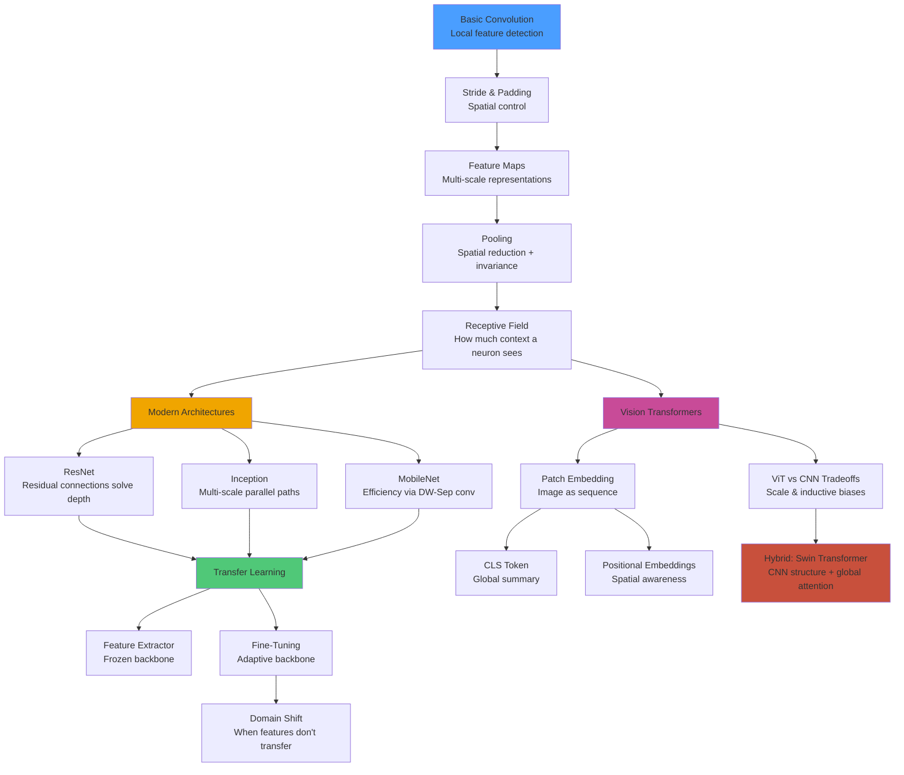

# Deep Learning: CNN, Transfer Learning & Vision Transformers
## A Production-Quality Engineering & Learning Guide

> **"Understanding how a neural network sees the world is the foundation of modern computer vision."**

---

## What You Will Learn

This document is a comprehensive, production-quality reference covering the full spectrum of convolutional neural networks — from first principles to modern architectures — plus transfer learning strategies and the shift toward Vision Transformers. By the end, you will be able to:

- Explain and implement convolution, pooling, and receptive fields from scratch
- Build and interpret modern CNN architectures (ResNet, Inception, MobileNet)
- Apply transfer learning effectively: feature extraction vs. fine-tuning
- Understand when and why Vision Transformers outperform CNNs
- Build two complete end-to-end computer vision projects with deployment considerations

## Who This Is For

- ML engineers moving from "it works" to "I understand why it works"
- Software engineers transitioning into AI/ML
- Data scientists wanting to deepen their computer vision foundations
- Anyone preparing for senior ML engineering interviews

---

## Table of Contents

1. [CNN Core Concepts](#1-cnn-core-concepts)
   - 1.1 [Convolution Operation](#11-convolution-operation-filterskernel)
   - 1.2 [Stride & Padding](#12-stride--padding)
   - 1.3 [Feature Maps](#13-feature-maps)
   - 1.4 [Pooling: Max & Average](#14-pooling-max--average)
   - 1.5 [Receptive Field Intuition](#15-receptive-field-intuition)
   - 1.6 [Translation Invariance](#16-why-cnns-are-translation-invariant)
2. [Modern CNN Architecture Ideas](#2-modern-cnn-architecture-ideas)
   - 2.1 [Residual Connections — ResNet](#21-residual-connections--resnet)
   - 2.2 [Inception Modules](#22-inception-modules)
   - 2.3 [Depthwise Separable Convolutions — MobileNet](#23-depthwise-separable-convolutions--mobilenet)
3. [Transfer Learning](#3-transfer-learning)
   - 3.1 [Pretrained Backbone Concept](#31-pretrained-backbone-concept)
   - 3.2 [Feature Extractor vs. Fine-Tuning](#32-feature-extractor-vs-fine-tuning)
   - 3.3 [Freezing & Unfreezing Layers](#33-freezingunfreezing-layers)
   - 3.4 [Domain Shift Considerations](#34-domain-shift-considerations)
   - 3.5 [Data Augmentation for Vision](#35-data-augmentation-for-vision)
4. [Vision Transformers & Hybrid Vision](#4-vision-transformers-vit--hybrid-vision)
   - 4.1 [Why ViT Exists](#41-why-vit-exists)
   - 4.2 [Patch Embedding Concept](#42-patch-embedding-concept)
   - 4.3 [CLS Token Concept](#43-cls-token-concept)
   - 4.4 [Positional Embeddings](#44-positional-embeddings-vision-version)
   - 4.5 [ViT vs CNN Tradeoffs](#45-vit-vs-cnn-tradeoffs)
5. [Cross-Topic Relationships](#5-cross-topic-relationships)
6. [End-to-End Real-World Projects](#6-end-to-end-real-world-projects)
   - 6.1 [Project 1: Plant Disease Detection](#61-project-1-plant-disease-detection)
   - 6.2 [Project 2: Medical Chest X-Ray Classification](#62-project-2-medical-chest-x-ray-classification)
7. [Algorithm Comparison Tables](#7-algorithm-comparison-tables)
8. [Common Mistakes & Pitfalls](#8-common-mistakes--pitfalls)
9. [Interview Preparation](#9-interview-preparation)
10. [Resources](#10-resources)

---

# 1. CNN Core Concepts

---

## 1.1 Convolution Operation (Filters/Kernels)

### a. Intuition

Imagine you're looking at a photograph through a small magnifying glass that you slide across the image systematically. At each position, the magnifying glass asks: "Does this patch of pixels match a specific pattern?" That magnifying glass is the **filter** (also called a **kernel**), and the sliding process is **convolution**.

A filter is a small matrix of learnable weights (e.g., 3×3 or 5×5). During convolution, the filter is placed on a region of the input image, an element-wise multiplication is done between the filter weights and the input pixel values, and all results are summed into a single output value. The filter slides across the entire image, producing a new 2D map of "how much did this pattern match?"

- A filter tuned to detect horizontal edges will produce high values where horizontal edges exist.
- A filter tuned to detect eyes will eventually (in deeper layers) activate strongly near eyes.
- The CNN **learns** the filter values during training — you don't hand-craft them.

### b. Mathematical Insight

For a 2D input `I` and filter `K` of size `m×n`:

```
(I * K)[i, j] = Σ_u Σ_v I[i+u, j+v] · K[u, v]
```

Where:
- `*` denotes the convolution (technically cross-correlation in deep learning)
- `(i, j)` is the output spatial position
- `(u, v)` iterates over the filter dimensions

For a full CNN layer with multiple filters:
```
Output[i, j, f] = bias[f] + Σ_c Σ_u Σ_v Input[i+u, j+v, c] · Filter[u, v, c, f]
```

Where `c` is the input channel and `f` is the filter index.

**Key insight:** A 3×3 filter on a 3-channel RGB image has `3×3×3 = 27` learnable weights plus 1 bias = 28 parameters, regardless of how large the input image is. This **weight sharing** is what makes CNNs so parameter-efficient.

### c. How It Works (Step-by-Step)

1. **Initialize** a filter of shape `(filter_h, filter_w, in_channels)` with small random weights
2. **Position** the filter at the top-left corner of the input
3. **Multiply** each filter weight by the corresponding input pixel (element-wise)
4. **Sum** all products plus bias → this produces ONE output value
5. **Slide** the filter to the next position (determined by stride)
6. **Repeat** steps 3–5 until the entire input is covered
7. **Apply activation** (e.g., ReLU) to the resulting feature map
8. **Repeat** for each filter in the layer → produces a stack of feature maps

### d. Visual Representation

```
INPUT (5×5)          FILTER (3×3)         OUTPUT (3×3)
┌─────────────┐      ┌─────────┐          ┌─────────┐
│ 1  2  3  0  1│     │ 1  0 -1 │          │ ?  ?  ? │
│ 0  1  2  3  0│  *  │ 2  0 -2 │    =     │ ?  ?  ? │
│ 1  0  1  2  1│     │ 1  0 -1 │          │ ?  ?  ? │
│ 0  1  0  1  2│     └─────────┘          └─────────┘
│ 1  2  1  0  1│
└─────────────┘

At position (0,0):
Patch:           Filter:          Products:
1  2  3          1  0 -1          1  0 -3
0  1  2    ×     2  0 -2    =     0  0 -4
1  0  1          1  0 -1          1  0 -1
                               Sum = -6 (output[0,0])
```

### e. Python Implementation

```python
import numpy as np

def conv2d_naive(input_img: np.ndarray, kernel: np.ndarray, bias: float = 0.0) -> np.ndarray:
    """
    Naive 2D convolution (single channel, for illustration).
    
    Args:
        input_img: 2D numpy array (H, W)
        kernel: 2D numpy array (kH, kW)
        bias: scalar bias term
    Returns:
        feature_map: 2D numpy array
    """
    h_in, w_in = input_img.shape
    k_h, k_w = kernel.shape
    
    # Output dimensions (no padding, stride=1)
    h_out = h_in - k_h + 1
    w_out = w_in - k_w + 1
    
    feature_map = np.zeros((h_out, w_out))
    
    for i in range(h_out):
        for j in range(w_out):
            # Extract the patch
            patch = input_img[i:i+k_h, j:j+k_w]
            # Element-wise multiply and sum
            feature_map[i, j] = np.sum(patch * kernel) + bias
    
    return feature_map


# --- Example with PyTorch-style (more realistic) ---
import torch
import torch.nn as nn

# A single convolutional layer
conv_layer = nn.Conv2d(
    in_channels=3,    # RGB input
    out_channels=32,  # 32 different filters
    kernel_size=3,    # 3×3 filter
    stride=1,
    padding=1         # Keep spatial dimensions same
)

# Fake image: batch_size=1, channels=3, height=64, width=64
dummy_image = torch.randn(1, 3, 64, 64)
output = conv_layer(dummy_image)

print(f"Input shape:  {dummy_image.shape}")   # [1, 3, 64, 64]
print(f"Output shape: {output.shape}")         # [1, 32, 64, 64]
print(f"Filter count: {conv_layer.weight.shape}")  # [32, 3, 3, 3]
print(f"Total params: {sum(p.numel() for p in conv_layer.parameters())}")  # 32*(3*3*3+1) = 896
```

### f. When to Use / Avoid

**Use convolutions when:**
- Input has local spatial structure (images, audio spectrograms, time-series patches)
- You need translation equivariance (the same feature at different locations)
- Parameter efficiency matters (vs. fully connected layers)

**Avoid or reconsider when:**
- Input has no spatial locality (tabular data, raw text without positional structure)
- You need to model very long-range dependencies (consider attention mechanisms instead)
- Input dimensions are extremely small (1D signal may need 1D convolutions)

### g. Key Hyperparameters

| Hyperparameter | Typical Values | Effect |
|---|---|---|
| `kernel_size` | 1, 3, 5, 7 | Larger = wider receptive field, more params |
| `out_channels` | 32, 64, 128, 256 | More filters = more feature diversity, more compute |
| `stride` | 1, 2 | Stride >1 downsamples spatially |
| `padding` | 0, 1, 'same' | `'same'` preserves spatial dimensions |
| `dilation` | 1, 2, 4 | Increases receptive field without extra params |

---

## 1.2 Stride & Padding

### a. Intuition

**Stride** controls how far the filter jumps after each position. Stride=1 means move one pixel at a time (maximum overlap, maximum output resolution). Stride=2 means skip every other position — this halves the output size and acts like a learned downsampler.

**Padding** adds a border of zeros around the input before convolution. Without padding, the output shrinks every time we apply a convolution. With `padding='same'`, the output has the same spatial dimensions as the input — useful for keeping architecture designs clean.

Think of stride as choosing how many pages to skip when reading a book, and padding as adding blank pages at the start and end so the first and last real pages get equal attention from your sliding reader window.

### b. Mathematical Insight

Output size formula:
```
H_out = floor((H_in + 2*P - K) / S) + 1
W_out = floor((W_in + 2*P - K) / S) + 1
```

Where:
- `H_in, W_in` = input height/width
- `P` = padding amount (same on all sides)
- `K` = kernel size
- `S` = stride

For `'same'` padding (stride=1):
```
P = (K - 1) / 2
```
This ensures `H_out = H_in`.

### c. How It Works (Step-by-Step)

1. **Choose stride S**: If `S=1`, filter moves 1 pixel at a time. If `S=2`, jumps 2 pixels.
2. **Choose padding P**: Add P rows/columns of zeros on each side of the input.
3. **Compute output dimensions** using the formula above.
4. **Convolve** at each valid position given the stride.

### d. Visual Representation

```
STRIDE=1 (output: 3×3 from 5×5, kernel 3×3, padding=0):

Step 1        Step 2        Step 3
[■■■][ ][ ]   [ ][■■■][ ]   [ ][ ][■■■]
[■■■][ ][ ]   [ ][■■■][ ]   [ ][ ][■■■]
[■■■][ ][ ]   [ ][■■■][ ]   [ ][ ][■■■]
[ ][ ][ ][ ]  [ ][ ][ ][ ]  [ ][ ][ ][ ]
[ ][ ][ ][ ]  [ ][ ][ ][ ]  [ ][ ][ ][ ]

STRIDE=2 (output: 2×2 from 5×5, kernel 3×3, padding=0):

Step 1        Step 2 (skip 1 col)
[■■■][ ][ ]   [ ][ ][■■■]
[■■■][ ][ ]   [ ][ ][■■■]
[■■■][ ][ ]   [ ][ ][■■■]
[ ][ ][ ][ ]  ...
[ ][ ][ ][ ]

PADDING=1 on a 5×5 input (becomes 7×7 padded):
0 0 0 0 0 0 0
0 [■ ■ ■ ■ ■] 0
0 [■ ■ ■ ■ ■] 0
0 [■ ■ ■ ■ ■] 0
0 [■ ■ ■ ■ ■] 0
0 [■ ■ ■ ■ ■] 0
0 0 0 0 0 0 0
→ Convolution with 3×3 kernel, stride=1 → output is 5×5 (same as input)
```

### e. Python Implementation

```python
import torch
import torch.nn as nn

def demonstrate_stride_padding():
    """Show the effect of different stride and padding settings."""
    x = torch.randn(1, 1, 28, 28)  # MNIST-like input
    
    configs = [
        {"stride": 1, "padding": 0, "label": "Stride=1, No Padding"},
        {"stride": 1, "padding": 1, "label": "Stride=1, Padding=1 (same)"},
        {"stride": 2, "padding": 0, "label": "Stride=2, No Padding (downsampling)"},
        {"stride": 2, "padding": 1, "label": "Stride=2, Padding=1"},
    ]
    
    for cfg in configs:
        conv = nn.Conv2d(1, 8, kernel_size=3, 
                         stride=cfg["stride"], 
                         padding=cfg["padding"])
        out = conv(x)
        print(f"{cfg['label']}: {x.shape} → {out.shape}")

demonstrate_stride_padding()
# Output:
# Stride=1, No Padding:           [1,1,28,28] → [1,8,26,26]
# Stride=1, Padding=1 (same):     [1,1,28,28] → [1,8,28,28]
# Stride=2, No Padding:           [1,1,28,28] → [1,8,13,13]
# Stride=2, Padding=1:            [1,1,28,28] → [1,8,14,14]
```

### f. When to Use / Avoid

| Configuration | When to Use |
|---|---|
| `padding='same'` | When you want to preserve spatial dims through a block |
| `stride=2` | Downsampling instead of pooling (learnable) |
| `padding=0` | Intentionally shrinking spatial dims, or 1×1 convolutions |
| Large stride | Early layers where you want aggressive spatial reduction |

### g. Key Hyperparameters

- **Stride:** Usually 1 (default) or 2. Stride 2 replaces max pooling in modern architectures (e.g., ResNet uses stride-2 convolutions for downsampling).
- **Padding mode:** `zeros` (default), `reflect`, `replicate` — reflect/replicate can reduce edge artifacts.

---

## 1.3 Feature Maps

### a. Intuition

After applying one filter to an input image, you get a 2D grid of values — this is a **feature map** (also called an activation map). It shows "where" in the image the pattern that filter detects is present.

If you have 32 filters in a convolutional layer, you get 32 feature maps stacked together — a 3D tensor of shape `(H, W, 32)`. Each "channel" in this tensor represents a different detector.

In early layers: feature maps detect simple things (edges, corners, colors).
In deeper layers: feature maps detect complex abstractions (faces, wheels, textures).

### b. Mathematical Insight

For an input tensor `X` of shape `(H, W, C_in)` and `C_out` filters each of shape `(k, k, C_in)`:

```
FeatureMap[h, w, f] = ReLU(bias_f + Σ_{c=0}^{C_in} Σ_{u,v} X[h·s+u, w·s+v, c] · W[u, v, c, f])
```

Output shape: `(H_out, W_out, C_out)` where `C_out` equals the number of filters.

### c. How It Works (Step-by-Step)

1. **Input tensor** arrives with shape `(H, W, C_in)` (or `(C_in, H, W)` in PyTorch)
2. **Each filter** operates on all input channels simultaneously
3. **One filter** produces **one feature map** of shape `(H_out, W_out)`
4. **N filters** produce **N feature maps** stacked into `(H_out, W_out, N)`
5. **ReLU** is applied, zeroing out negative values (representing "this feature is absent here")
6. **These feature maps** become the input to the next layer

### d. Visual Representation

```
                    3 FILTERS
                    ┌────┐ ┌────┐ ┌────┐
INPUT               │Edge│ │Blob│ │Diag│
(H×W×3)    →  CONV  │Map │ │Map │ │Map │  → OUTPUT (H'×W'×3)
                    └────┘ └────┘ └────┘
                    Filter  Filter  Filter
                    detects detects detects
                    horiz.  round   diagonal
                    edges   regions edges

Feature map visualization after ReLU:
High activation = feature IS present at this location
  0.0  0.0  0.8  0.9  0.0     ← Edge detected top-right
  0.0  0.0  0.7  0.8  0.0
  0.1  0.0  0.0  0.0  0.0
  0.0  0.0  0.0  0.0  0.0
  0.0  0.3  0.0  0.0  0.0
```

### e. Python Implementation

```python
import torch
import torch.nn as nn
import matplotlib.pyplot as plt
import numpy as np
from PIL import Image

def visualize_feature_maps(model_layer, input_tensor, num_maps_to_show=8):
    """
    Visualize feature maps from a convolutional layer.
    
    Args:
        model_layer: a nn.Conv2d layer
        input_tensor: input image tensor [1, C, H, W]
        num_maps_to_show: how many feature maps to visualize
    """
    model_layer.eval()
    with torch.no_grad():
        feature_maps = model_layer(input_tensor)  # [1, C_out, H_out, W_out]
    
    # feature_maps shape: [1, num_filters, H_out, W_out]
    maps = feature_maps[0].cpu().numpy()  # [num_filters, H_out, W_out]
    
    n = min(num_maps_to_show, maps.shape[0])
    fig, axes = plt.subplots(1, n, figsize=(n * 2, 2))
    
    for i in range(n):
        fmap = maps[i]
        axes[i].imshow(fmap, cmap='viridis')
        axes[i].set_title(f'Filter {i}')
        axes[i].axis('off')
    
    plt.suptitle('Feature Maps After Conv Layer')
    plt.tight_layout()
    plt.savefig('feature_maps.png', dpi=100, bbox_inches='tight')
    print(f"Feature map shape: {feature_maps.shape}")
    print(f"Min: {maps.min():.3f}, Max: {maps.max():.3f}, Mean: {maps.mean():.3f}")

# Example usage
conv = nn.Sequential(
    nn.Conv2d(3, 16, kernel_size=3, padding=1),
    nn.ReLU()
)
dummy_img = torch.randn(1, 3, 64, 64)
visualize_feature_maps(conv[0], dummy_img, num_maps_to_show=8)
```

### f. When to Use / Avoid

Feature maps are always produced by convolution — they aren't optional. What matters is **how many** you produce (`out_channels`). More feature maps = more representational capacity = more compute. Start with 32 or 64 in early layers and double as you go deeper (following the bottleneck pattern).

### g. Key Hyperparameters

- **Number of feature maps** (`out_channels`): 16/32/64/128/256/512 — increasing powers of 2 is conventional
- **Depth** (number of conv layers): More depth = more abstract features, but also more gradient flow challenges

---

## 1.4 Pooling: Max & Average

### a. Intuition

After convolution produces feature maps, we often want to **reduce their spatial size** while **retaining the most important information**. Pooling does exactly this.

**Max Pooling:** Looks at a small region (e.g., 2×2) and keeps only the maximum value. Think of it as asking "did this feature appear in this neighborhood?" — the exact location doesn't matter, just whether it was there.

**Average Pooling:** Takes the average of all values in the region. Gives a smoother summary.

**Global Average Pooling (GAP):** Reduces the entire feature map to a single number per channel. Very useful before the classification head — it's what makes CNNs handle variable input sizes.

Pooling achieves two things:
1. **Spatial compression** — halves H and W, reducing compute in subsequent layers
2. **Local translation invariance** — the cat's ear detected 1 pixel to the left still activates the same output after pooling

### b. Mathematical Insight

For a 2×2 max pool with stride 2:
```
MaxPool(X)[i, j] = max(X[2i, 2j], X[2i+1, 2j], X[2i, 2j+1], X[2i+1, 2j+1])
```

For average pool:
```
AvgPool(X)[i, j] = (1/4) * Σ X[2i+u, 2j+v]  for u,v ∈ {0,1}
```

For Global Average Pool (reducing H×W → 1×1):
```
GAP(X)[c] = (1/(H·W)) * Σ_{h,w} X[h, w, c]
```

### c. How It Works (Step-by-Step)

1. **Define pool size** (usually 2×2) and stride (usually equals pool size, so no overlap)
2. **Slide** the pooling window across the feature map
3. **Apply** max or average operation within each window
4. **Output** is a feature map half the size in each dimension (for 2×2, stride=2)
5. **No learnable parameters** — pooling is fixed

### d. Visual Representation

```
MAX POOLING (2×2, stride=2):

Input (4×4):              After MaxPool (2×2):
┌──────────────┐          ┌──────┐
│  1   3   2   4│         │  3   4│
│  5   6   1   2│  →      │  6   5│
│  3   1   4   2│         └──────┘
│  2   5   3   1│
└──────────────┘
Region 1: max(1,3,5,6)=6  Region 2: max(2,4,1,2)=4
Region 3: max(3,1,2,5)=5  Region 4: max(4,2,3,1)=4

GLOBAL AVERAGE POOLING:
Feature Map             →     Single Value
[0.2  0.8]
[0.6  0.4]             →     mean = 0.5  (1 value per channel)
```

### e. Python Implementation

```python
import torch
import torch.nn as nn
import torch.nn.functional as F

# Standard max pooling
max_pool = nn.MaxPool2d(kernel_size=2, stride=2)

# Standard average pooling  
avg_pool = nn.AvgPool2d(kernel_size=2, stride=2)

# Global average pooling (reduces H×W to 1×1)
global_avg_pool = nn.AdaptiveAvgPool2d((1, 1))

# Demonstrate effect
x = torch.randn(1, 64, 28, 28)
print(f"Input:        {x.shape}")              # [1, 64, 28, 28]
print(f"MaxPool:      {max_pool(x).shape}")    # [1, 64, 14, 14]
print(f"AvgPool:      {avg_pool(x).shape}")    # [1, 64, 14, 14]
print(f"GlobalAvgP:   {global_avg_pool(x).shape}")  # [1, 64, 1, 1]

# Typical use at end of CNN backbone before classifier
class SimpleClassifier(nn.Module):
    def __init__(self, num_classes: int = 10):
        super().__init__()
        self.features = nn.Sequential(
            nn.Conv2d(3, 32, 3, padding=1), nn.ReLU(),
            nn.MaxPool2d(2, 2),                          # 64 → 32
            nn.Conv2d(32, 64, 3, padding=1), nn.ReLU(),
            nn.MaxPool2d(2, 2),                          # 32 → 16
            nn.Conv2d(64, 128, 3, padding=1), nn.ReLU(),
        )
        # GAP: replaces Flatten + large FC, handles any input size
        self.global_pool = nn.AdaptiveAvgPool2d((1, 1))
        self.classifier = nn.Linear(128, num_classes)
    
    def forward(self, x):
        x = self.features(x)
        x = self.global_pool(x)   # [B, 128, 1, 1]
        x = x.flatten(1)          # [B, 128]
        return self.classifier(x) # [B, num_classes]

model = SimpleClassifier(num_classes=10)
print(model(torch.randn(4, 3, 64, 64)).shape)  # [4, 10]
```

### f. When to Use / Avoid

| Type | Use When | Avoid When |
|---|---|---|
| Max Pooling | Feature detection, sharp texture features | You want gradients to flow through all inputs |
| Average Pooling | Smooth spatial summaries | Sharp feature detection matters |
| Global Avg Pool | Before classification head, variable input sizes | Very early layers (too aggressive) |
| No Pooling | Using stride=2 conv for downsampling instead | — |

### g. Key Hyperparameters

- **Pool size:** 2×2 is almost universal
- **Stride:** Equals pool size to avoid overlap (for downsampling)
- **Adaptive pooling:** `AdaptiveAvgPool2d(output_size)` — specify the desired OUTPUT size; PyTorch figures out the stride automatically. Great for building flexible architectures.

---

## 1.5 Receptive Field Intuition

### a. Intuition

The **receptive field** of a neuron is the region of the original input image that it "sees" — that is, the set of input pixels that influenced its value.

A neuron in the first conv layer with a 3×3 filter sees a 3×3 patch. But a neuron in the second conv layer sees a 3×3 patch of the *first layer's outputs*, each of which already summarized a 3×3 input patch. So it effectively sees a 5×5 region of the original input. After three 3×3 conv layers, the effective receptive field is 7×7.

This matters because for a neuron to classify something as a "dog," it needs a large enough receptive field to see the entire dog. For very deep networks, neurons near the end of the network may "see" essentially the entire image.

**Effective vs. theoretical receptive field:** In practice, not all pixels in the theoretical receptive field contribute equally — central pixels have stronger influence (Gaussian-like weighting). This is why networks need depth AND properly designed architecture to actually capture global context.

### b. Mathematical Insight

For a stack of convolutional layers with kernel size `k` and stride 1:
```
RF_n = RF_{n-1} + (k - 1)
```

Starting from RF_0 = 1 (a single pixel):
- After layer 1 (3×3): RF = 3
- After layer 2 (3×3): RF = 5
- After layer 3 (3×3): RF = 7
- After n layers of 3×3: RF = 2n + 1

With stride s (or pooling):
```
RF_n = RF_{n-1} + (k - 1) * Π_{i=1}^{n-1} s_i
```
where the product accounts for all previous strides.

With **dilated convolutions** (dilation `d`):
```
effective_kernel = d * (k - 1) + 1
```
A 3×3 conv with dilation=2 has the same receptive field as a 5×5 conv with no extra parameters.

### c. How It Works (Step-by-Step)

1. **Start with RF = 1** (a single pixel)
2. **After each conv layer** with kernel size k and stride s: `new_RF = old_RF + (k-1) * accumulated_stride`
3. **Accumulated stride** multiplies every time stride > 1 appears
4. **Pooling** counts as stride for receptive field calculation
5. **Deep networks** with many layers quickly achieve large receptive fields

### d. Visual Representation

```
LAYER 1: 3×3 conv, stride=1
RF = 3×3
┌───┐
│ 3 │  each output pixel sees 3×3 input patch
└───┘

LAYER 2: 3×3 conv, stride=1
RF = 5×5
┌─────┐
│  5  │  each output pixel sees 5×5 input patch
└─────┘

LAYER 3: 3×3 conv, stride=2 (or MaxPool 2×2)
RF = 9×9 (stride doubles the jump)
┌─────────┐
│    9    │  stride=2 doubles the receptive field growth rate
└─────────┘

After a typical CNN with 5 stages of [Conv3x3, Conv3x3, Pool2x2]:
RF ≈ 64×64 — enough to see large objects in the image
```

### e. Python Implementation

```python
def compute_receptive_field(layers: list) -> int:
    """
    Compute the theoretical receptive field of a CNN.
    
    Args:
        layers: list of dicts with keys 'kernel_size', 'stride', 'dilation'
    Returns:
        receptive field size
    """
    rf = 1
    total_stride = 1
    
    for layer in layers:
        k = layer['kernel_size']
        s = layer.get('stride', 1)
        d = layer.get('dilation', 1)
        
        # Effective kernel size with dilation
        eff_k = d * (k - 1) + 1
        
        # Receptive field grows
        rf = rf + (eff_k - 1) * total_stride
        total_stride *= s
    
    return rf


# VGG-style: 5 blocks of [Conv3x3, Conv3x3, Pool2x2]
vgg_layers = []
for block in range(5):
    vgg_layers.append({'kernel_size': 3, 'stride': 1})
    vgg_layers.append({'kernel_size': 3, 'stride': 1})
    vgg_layers.append({'kernel_size': 2, 'stride': 2})  # MaxPool

print(f"VGG RF: {compute_receptive_field(vgg_layers)}")  # ~196

# ResNet-50 first two stages
resnet_layers = [
    {'kernel_size': 7, 'stride': 2},   # stem conv
    {'kernel_size': 3, 'stride': 2},   # MaxPool
    {'kernel_size': 1, 'stride': 1},   # bottleneck 1x1
    {'kernel_size': 3, 'stride': 1},   # bottleneck 3x3
    {'kernel_size': 1, 'stride': 1},   # bottleneck 1x1
]
print(f"ResNet early layers RF: {compute_receptive_field(resnet_layers)}")
```

### f. When to Use / Avoid

Understanding receptive fields helps you:
- **Diagnose** why a model fails on large objects (RF too small)
- **Choose** architecture depth for your input resolution and task
- **Prefer dilated convolutions** when you need large RF without reducing spatial resolution (segmentation tasks)
- **Use attention mechanisms** when you need global receptive fields efficiently

---

## 1.6 Why CNNs Are Translation Invariant

### a. Intuition

**Translation invariance** means that if the cat moves from the left side to the right side of the image, the CNN still classifies it as a cat. The network doesn't care *where* the object is, only *that* it's there.

This happens because of two design choices:
1. **Weight sharing in convolutions:** The same filter is applied at every spatial position. So the "cat ear detector" filter will fire wherever cat ears appear — top-left, bottom-right, anywhere.
2. **Pooling:** Max pooling further discards precise spatial information, keeping only "was this feature present in this region?"

Note: CNNs are actually **translation equivariant** in the conv layers (the feature maps move when the input moves), and the **invariance** is introduced by the final pooling and flattening. The distinction matters for tasks like object detection where you need to know *where* things are.

### b. Mathematical Insight

A function `f` is **translation equivariant** if:
```
f(T_d(x)) = T_d(f(x))
```
Where `T_d` is a translation by d pixels.

Convolution is translation equivariant: shifting the input shifts the feature map by the same amount.

After **Global Average Pooling**, the output is translation invariant:
```
GAP(T_d(f(x))) = GAP(f(T_d(x))) = GAP(f(x))   (for integer translations)
```
Because averaging all positions removes positional information.

### c. How It Works (Step-by-Step)

1. **Same filter** slides across all positions → feature activates wherever pattern appears
2. **Convolution is equivariant** → the feature map "moves" when the input moves
3. **MaxPool** pools within local regions → exact position within each region is lost
4. **Deep stacking** of conv+pool → the receptive field of each unit grows; small shifts become negligible
5. **Global pooling** → complete collapse of spatial information; only "what, not where"

### d. Visual Representation

```
CAT IN TOP-LEFT:                 CAT IN BOTTOM-RIGHT:
┌────────────────┐               ┌────────────────┐
│ 🐱              │               │                │
│                │               │            🐱  │
└────────────────┘               └────────────────┘
        ↓ Conv layers                    ↓ Conv layers
Feature map:                     Feature map:
┌────────────────┐               ┌────────────────┐
│ ██              │               │                │
│                │               │            ██  │
└────────────────┘               └────────────────┘
        ↓ Global Avg Pool                ↓ Global Avg Pool
       [0.8]                            [0.8]
   "cat features"               "cat features" (same!)
       ↓ Classifier                     ↓ Classifier
       "CAT" ✓                         "CAT" ✓
```

---

# 2. Modern CNN Architecture Ideas

---

## 2.1 Residual Connections — ResNet

### a. Intuition

Before ResNet (2015), going deeper didn't always help — accuracy would degrade, even on training data. The culprit: **vanishing gradients**. Deep networks lose gradient signal as it travels backward through many layers.

ResNet's solution was elegant: let each layer learn a **residual function** — the difference from the identity mapping — rather than the full desired mapping.

Think of it as building an update: instead of learning `H(x)` (the full transformation), learn `F(x) = H(x) - x` (just what to *add* to the input). If the layer doesn't need to do anything, `F(x)` can simply learn to be zero, and the identity `x` passes through unchanged.

The "skip connection" (residual connection) adds the input `x` directly to the output `F(x) + x`, creating a **highway for gradients** to flow straight back to early layers.

### b. Mathematical Insight

Classic formulation:
```
y = F(x, {W_i}) + x
```

Where `F(x, {W_i})` is the residual mapping (two or three conv layers), and `x` is the shortcut connection.

For a bottleneck block (used in ResNet-50+):
```
F(x) = W_3 · ReLU(W_2 · ReLU(W_1 · x))
           (1×1 expand)  (3×3 conv)  (1×1 project)
```

**Gradient flow:** During backprop, the gradient is:
```
∂L/∂x = ∂L/∂y · (∂F/∂x + 1)
```
The `+1` term means gradient always flows through, even if `∂F/∂x` is very small.

### c. How It Works (Step-by-Step)

1. **Input `x`** enters the residual block
2. **Two (or three) conv layers** compute `F(x)`: Conv → BN → ReLU → Conv → BN
3. **Skip connection** adds the original `x` directly to the output: `F(x) + x`
4. **ReLU** is applied after the addition
5. If input and output dimensions differ (downsampling), a **1×1 conv** is applied to `x` to match dimensions
6. **Repeat** many such blocks to build the full network

### d. Visual Representation

```mermaid
graph TD
    A[Input x] --> B[Conv 3×3, BN, ReLU]
    B --> C[Conv 3×3, BN]
    C --> D[+ Add]
    A --> D
    D --> E[ReLU]
    E --> F[Output: F(x) + x]

    style D fill:#f0a500,stroke:#333
    style A fill:#4a9eff,stroke:#333
    style F fill:#4a9eff,stroke:#333
```

```
BASIC RESIDUAL BLOCK:
            ┌──────────────────────────────┐
Input x ────┤                              │
            │  Conv3×3 → BN → ReLU         │
            │       ↓                      │
            │  Conv3×3 → BN                │
            │       ↓                      │
            │        F(x)      ──── + ─────┘──→ ReLU → Output
            │                      ↑
            └──── x (shortcut) ────┘
```

### e. Python Implementation

```python
import torch
import torch.nn as nn


class BasicResidualBlock(nn.Module):
    """ResNet-18/34 style basic block (two 3×3 convs)."""
    
    expansion = 1  # no channel expansion in basic block
    
    def __init__(self, in_channels: int, out_channels: int, stride: int = 1):
        super().__init__()
        
        # Main path: two 3×3 convolutions
        self.conv1 = nn.Conv2d(in_channels, out_channels, 3, 
                               stride=stride, padding=1, bias=False)
        self.bn1 = nn.BatchNorm2d(out_channels)
        self.relu = nn.ReLU(inplace=True)
        
        self.conv2 = nn.Conv2d(out_channels, out_channels, 3, 
                               stride=1, padding=1, bias=False)
        self.bn2 = nn.BatchNorm2d(out_channels)
        
        # Skip connection: needed when dimensions change
        self.shortcut = nn.Identity()
        if stride != 1 or in_channels != out_channels:
            self.shortcut = nn.Sequential(
                nn.Conv2d(in_channels, out_channels, 1, stride=stride, bias=False),
                nn.BatchNorm2d(out_channels)
            )
    
    def forward(self, x: torch.Tensor) -> torch.Tensor:
        identity = self.shortcut(x)  # shortcut path
        
        # Main path
        out = self.relu(self.bn1(self.conv1(x)))
        out = self.bn2(self.conv2(out))
        
        # Residual addition + activation
        out = self.relu(out + identity)
        return out


class BottleneckBlock(nn.Module):
    """ResNet-50/101/152 style bottleneck block (1×1, 3×3, 1×1)."""
    
    expansion = 4  # output channels = in_channels * 4
    
    def __init__(self, in_channels: int, bottleneck_channels: int, stride: int = 1):
        super().__init__()
        out_channels = bottleneck_channels * self.expansion
        
        # 1×1: reduce channels (bottleneck)
        self.conv1 = nn.Conv2d(in_channels, bottleneck_channels, 1, bias=False)
        self.bn1 = nn.BatchNorm2d(bottleneck_channels)
        
        # 3×3: spatial processing
        self.conv2 = nn.Conv2d(bottleneck_channels, bottleneck_channels, 3,
                               stride=stride, padding=1, bias=False)
        self.bn2 = nn.BatchNorm2d(bottleneck_channels)
        
        # 1×1: expand channels back
        self.conv3 = nn.Conv2d(bottleneck_channels, out_channels, 1, bias=False)
        self.bn3 = nn.BatchNorm2d(out_channels)
        
        self.relu = nn.ReLU(inplace=True)
        
        # Projection shortcut
        self.shortcut = nn.Identity()
        if stride != 1 or in_channels != out_channels:
            self.shortcut = nn.Sequential(
                nn.Conv2d(in_channels, out_channels, 1, stride=stride, bias=False),
                nn.BatchNorm2d(out_channels)
            )
    
    def forward(self, x: torch.Tensor) -> torch.Tensor:
        identity = self.shortcut(x)
        
        out = self.relu(self.bn1(self.conv1(x)))
        out = self.relu(self.bn2(self.conv2(out)))
        out = self.bn3(self.conv3(out))
        
        out = self.relu(out + identity)
        return out


# Verify shapes
block = BasicResidualBlock(64, 64)
x = torch.randn(2, 64, 56, 56)
print(f"Basic block: {x.shape} → {block(x).shape}")  # [2, 64, 56, 56]

# Downsampling block
down_block = BasicResidualBlock(64, 128, stride=2)
print(f"Downsample:  {x.shape} → {down_block(x).shape}")  # [2, 128, 28, 28]
```

### f. When to Use / Avoid

**Use residual connections when:**
- Training networks deeper than ~10 layers
- You observe training loss plateauing or degrading with more layers
- Building any modern backbone (ResNet is a default starting point)

**Avoid when:**
- Very shallow networks where skip connections add unnecessary complexity
- Specific architectures where skip connections conflict with design (e.g., some RNNs)

### g. Key Hyperparameters

| Hyperparameter | ResNet-18/34 | ResNet-50/101/152 |
|---|---|---|
| Block type | BasicBlock | Bottleneck |
| Layer depths | [2,2,2,2] / [3,4,6,3] | [3,4,6,3] / [3,4,23,3] |
| Channel widths | 64, 128, 256, 512 | 256, 512, 1024, 2048 |
| Downsampling | stride=2 conv | stride=2 in bottleneck |

---

## 2.2 Inception Modules

### a. Intuition

Traditional CNNs make a binary choice at each layer: what filter size? 1×1? 3×3? 5×5? The Inception module asks: **why choose?** Apply ALL of them simultaneously and let the network learn which matters.

Think of it as asking multiple experts in parallel: a detail-oriented expert (5×5), a medium-range expert (3×3), and a local expert (1×1) all examine the same input and contribute their analysis. Their outputs are concatenated, giving the next layer access to multi-scale information.

To keep computation tractable, Inception uses **1×1 convolutions as bottlenecks**: first reduce channel count (cheap), then apply the expensive 3×3 or 5×5 (on fewer channels), then expand back.

### b. Mathematical Insight

For an Inception module with input `X`:
```
Branch 1: 1×1 conv → out1
Branch 2: 1×1 conv → 3×3 conv → out2
Branch 3: 1×1 conv → 5×5 conv → out3
Branch 4: MaxPool 3×3 → 1×1 conv → out4
Output: Concat([out1, out2, out3, out4], dim=channels)
```

Why 1×1 before 3×3? Reduces channels from C to C' first:
- Without bottleneck: `3×3×C×C` params
- With bottleneck (C' = C/4): `1×1×C×C'/4 + 3×3×C'/4×C` — roughly 9× cheaper

### c. How It Works (Step-by-Step)

1. **Branch 1:** 1×1 conv on input → captures pointwise interactions
2. **Branch 2:** 1×1 bottleneck conv → 3×3 conv → medium spatial patterns
3. **Branch 3:** 1×1 bottleneck conv → 5×5 conv → larger spatial patterns
4. **Branch 4:** 3×3 max pool → 1×1 conv → pooled features
5. **All branches** produce feature maps of the same H×W (with appropriate padding)
6. **Concatenate** all branches along the channel dimension
7. **Pass** to next layer

### d. Visual Representation

```
              Input X (H × W × C)
                      │
         ┌────────────┼────────────┬──────────────┐
         ▼            ▼            ▼               ▼
      1×1 Conv    1×1 Conv    1×1 Conv         MaxPool
                      │            │            3×3, s=1
                  3×3 Conv    5×5 Conv               │
                                               1×1 Conv
         │            │            │               │
      out1(C1)    out2(C2)    out3(C3)          out4(C4)
         │            │            │               │
         └────────────┴────────────┴───────────────┘
                         Concat(dim=C)
                              │
                  Output (H × W × (C1+C2+C3+C4))
```

### e. Python Implementation

```python
import torch
import torch.nn as nn


class InceptionModule(nn.Module):
    """
    Inception module with dimensionality reduction via 1×1 bottlenecks.
    Based on GoogLeNet/Inception-v1.
    """
    
    def __init__(
        self,
        in_channels: int,
        out_1x1: int,
        reduce_3x3: int, out_3x3: int,
        reduce_5x5: int, out_5x5: int,
        pool_proj: int
    ):
        super().__init__()
        
        # Branch 1: just 1×1
        self.branch1 = nn.Sequential(
            nn.Conv2d(in_channels, out_1x1, kernel_size=1),
            nn.ReLU(inplace=True)
        )
        
        # Branch 2: 1×1 → 3×3
        self.branch2 = nn.Sequential(
            nn.Conv2d(in_channels, reduce_3x3, kernel_size=1),
            nn.ReLU(inplace=True),
            nn.Conv2d(reduce_3x3, out_3x3, kernel_size=3, padding=1),
            nn.ReLU(inplace=True)
        )
        
        # Branch 3: 1×1 → 5×5
        self.branch3 = nn.Sequential(
            nn.Conv2d(in_channels, reduce_5x5, kernel_size=1),
            nn.ReLU(inplace=True),
            nn.Conv2d(reduce_5x5, out_5x5, kernel_size=5, padding=2),
            nn.ReLU(inplace=True)
        )
        
        # Branch 4: MaxPool → 1×1
        self.branch4 = nn.Sequential(
            nn.MaxPool2d(kernel_size=3, stride=1, padding=1),
            nn.Conv2d(in_channels, pool_proj, kernel_size=1),
            nn.ReLU(inplace=True)
        )
    
    def forward(self, x: torch.Tensor) -> torch.Tensor:
        b1 = self.branch1(x)
        b2 = self.branch2(x)
        b3 = self.branch3(x)
        b4 = self.branch4(x)
        return torch.cat([b1, b2, b3, b4], dim=1)


# Example: Inception(3) from GoogLeNet — input: 192 channels
inception = InceptionModule(
    in_channels=192,
    out_1x1=64,
    reduce_3x3=96, out_3x3=128,
    reduce_5x5=16, out_5x5=32,
    pool_proj=32
)

x = torch.randn(2, 192, 28, 28)
out = inception(x)
print(f"Input:  {x.shape}")   # [2, 192, 28, 28]
print(f"Output: {out.shape}") # [2, 256, 28, 28]  (64+128+32+32 = 256)
```

### f. When to Use / Avoid

**Use Inception when:**
- You're unsure about the right filter size for your data
- Computational budget is limited (Inception is efficient)
- Building a general-purpose backbone for diverse tasks

**Avoid when:**
- Simplicity matters (ResNet is simpler and often just as good)
- You need a very clean architectural pattern (debugging Inception is harder)

---

## 2.3 Depthwise Separable Convolutions — MobileNet

### a. Intuition

Standard convolution mixes two operations into one: (1) spatial filtering — looking at the neighborhood of each pixel, and (2) channel mixing — combining information across channels. Depthwise separable convolution **separates** these two operations.

**Depthwise conv:** Apply one filter per input channel independently. Each channel gets its own spatial filter. No cross-channel mixing.

**Pointwise conv (1×1):** Mix information across channels without any spatial processing.

This separation dramatically reduces computation. A standard 3×3 conv with 256 input and 256 output channels requires `3×3×256×256 = ~590K` multiplications per output position. A depthwise separable version requires roughly `3×3×256 + 256×256 = ~68K` — about **9× less computation** — making it perfect for mobile/edge devices.

### b. Mathematical Insight

Standard conv cost (multiply-adds):
```
K × K × C_in × C_out × H_out × W_out
```

Depthwise separable cost:
```
(K × K × C_in × H_out × W_out)   [depthwise]
+ (C_in × C_out × H_out × W_out)  [pointwise]
= H_out × W_out × C_in × (K² + C_out)
```

Reduction ratio:
```
Ratio = 1/C_out + 1/K²  ≈ 1/9  (for K=3, C_out large)
```

### c. How It Works (Step-by-Step)

1. **Depthwise conv:** Apply `C_in` separate 3×3 filters, one per input channel. Output: `(H_out, W_out, C_in)` — same channel count as input.
2. **Pointwise conv:** Apply a 1×1 conv to mix channel information. Output: `(H_out, W_out, C_out)` — any desired channel count.
3. **BN + ReLU** after each step.
4. **(Optional) In MobileNetV2:** Inverted residuals — expand channels first (×6), depthwise, then project back down.

### d. Visual Representation

```
STANDARD CONV (3×3, C_in=4, C_out=8):
Input (H×W×4) → [each of 8 filters touches ALL 4 channels] → Output (H×W×8)
Parameters: 3×3×4×8 = 288

DEPTHWISE SEPARABLE:
Step 1 - Depthwise:
Input (H×W×4) → [4 filters, 1 per channel, independent] → (H×W×4)
                   ch1→f1  ch2→f2  ch3→f3  ch4→f4
Parameters: 3×3×4 = 36

Step 2 - Pointwise (1×1):
(H×W×4) → [8 1×1 filters mixing all channels] → Output (H×W×8)
Parameters: 1×1×4×8 = 32

Total: 36 + 32 = 68 params (vs 288 — ~4× fewer)
```

### e. Python Implementation

```python
import torch
import torch.nn as nn


class DepthwiseSeparableConv(nn.Module):
    """
    Depthwise separable convolution block.
    Used in MobileNet, Xception, EfficientNet.
    """
    
    def __init__(
        self,
        in_channels: int,
        out_channels: int,
        stride: int = 1
    ):
        super().__init__()
        
        # Depthwise: groups=in_channels means each channel gets its own filter
        self.depthwise = nn.Sequential(
            nn.Conv2d(
                in_channels, in_channels,
                kernel_size=3, stride=stride, padding=1,
                groups=in_channels,  # KEY: this makes it depthwise!
                bias=False
            ),
            nn.BatchNorm2d(in_channels),
            nn.ReLU6(inplace=True)  # ReLU6 clips at 6, good for fixed-point
        )
        
        # Pointwise: standard 1×1 conv for channel mixing
        self.pointwise = nn.Sequential(
            nn.Conv2d(in_channels, out_channels, kernel_size=1, bias=False),
            nn.BatchNorm2d(out_channels),
            nn.ReLU6(inplace=True)
        )
    
    def forward(self, x: torch.Tensor) -> torch.Tensor:
        x = self.depthwise(x)
        x = self.pointwise(x)
        return x


class InvertedResidualBlock(nn.Module):
    """MobileNetV2 inverted residual block."""
    
    def __init__(self, in_channels: int, out_channels: int, 
                 stride: int = 1, expansion: int = 6):
        super().__init__()
        hidden_dim = in_channels * expansion
        self.use_residual = (stride == 1 and in_channels == out_channels)
        
        layers = []
        if expansion != 1:
            # Expand channels first
            layers += [
                nn.Conv2d(in_channels, hidden_dim, 1, bias=False),
                nn.BatchNorm2d(hidden_dim),
                nn.ReLU6(inplace=True)
            ]
        
        # Depthwise
        layers += [
            nn.Conv2d(hidden_dim, hidden_dim, 3, stride=stride, 
                     padding=1, groups=hidden_dim, bias=False),
            nn.BatchNorm2d(hidden_dim),
            nn.ReLU6(inplace=True)
        ]
        
        # Project (no activation — linear bottleneck)
        layers += [
            nn.Conv2d(hidden_dim, out_channels, 1, bias=False),
            nn.BatchNorm2d(out_channels)
        ]
        
        self.conv = nn.Sequential(*layers)
    
    def forward(self, x: torch.Tensor) -> torch.Tensor:
        if self.use_residual:
            return x + self.conv(x)
        return self.conv(x)


# Compare parameter counts
def count_params(model):
    return sum(p.numel() for p in model.parameters() if p.requires_grad)

standard = nn.Conv2d(64, 128, kernel_size=3, padding=1)
dw_sep = DepthwiseSeparableConv(64, 128)

print(f"Standard Conv params:    {count_params(standard):,}")   # 73,856
print(f"Depthwise Sep params:    {count_params(dw_sep):,}")     # ~8,896 (≈8× fewer)

x = torch.randn(2, 64, 28, 28)
print(f"DW-Sep output: {dw_sep(x).shape}")  # [2, 128, 28, 28]
```

### f. When to Use / Avoid

**Use depthwise separable convs when:**
- Deploying on mobile or edge devices (phones, embedded systems)
- Latency or model size is a constraint
- Training time needs to be reduced

**Avoid when:**
- Maximum accuracy is the only concern (standard conv can slightly outperform)
- Hardware is optimized for dense matrix ops (GPUs handle standard conv very efficiently; DW-sep may not save much time in practice on GPU)

### g. Key Hyperparameters

- **Expansion factor:** 6 in MobileNetV2. Higher expansion = more capacity, more compute.
- **Width multiplier `α`:** Scales all channel counts (e.g., α=0.5 halves all channels). Used to create MobileNet-0.5, MobileNet-0.75, etc.
- **Resolution multiplier `ρ`:** Scales input resolution. Combine with width multiplier for a compute/accuracy tradeoff.

---

# 3. Transfer Learning

---

## 3.1 Pretrained Backbone Concept

### a. Intuition

Training a deep CNN from scratch requires millions of labeled images and weeks of compute. **Transfer learning** says: someone already did that hard work on ImageNet (1.2M images, 1000 classes). Those learned filters — detecting edges, textures, shapes, objects — are useful for almost any vision task.

A **pretrained backbone** is a CNN trained on a large dataset (usually ImageNet) whose weights encode general visual knowledge. You take this backbone and adapt it to your specific task (e.g., classifying diseased plants, detecting medical anomalies) by changing the final classification head.

The intuition: the lower layers of any CNN learn **universal low-level features** (edges, colors, gradients). The middle layers learn **texture and pattern detectors**. Only the final layers are task-specific. So for your custom task, you only need to retrain the final layers.

### b. Mathematical Insight

A pretrained model `M_pretrained` has learned parameters `θ*` minimizing:
```
θ* = argmin_θ L(f_θ(X_ImageNet), Y_ImageNet)
```

For transfer learning, we initialize with `θ*` and fine-tune on a new task:
```
θ_new = argmin_θ L(f_θ(X_new), Y_new)   starting from θ*
```

This dramatically reduces training time because `θ*` is already near a good minimum for low/mid-level visual features.

### c. How It Works (Step-by-Step)

1. **Load** a pretrained model (e.g., ResNet-50 trained on ImageNet)
2. **Remove** the final classification head (the `fc` layer designed for 1000 classes)
3. **Attach** a new head suited to your task (e.g., binary classification, regression)
4. **Choose strategy:** freeze backbone, or allow fine-tuning
5. **Train** on your dataset

### d. Visual Representation

```
IMAGENET PRETRAINED ResNet-50:
Conv Stem → Stage 1 → Stage 2 → Stage 3 → Stage 4 → [FC: 2048→1000] → softmax(1000 classes)
└──────────────── BACKBONE ───────────────────────┘   └──── HEAD ────┘

AFTER TRANSFER TO YOUR TASK (e.g., 5-class plant disease):
Conv Stem → Stage 1 → Stage 2 → Stage 3 → Stage 4 → [NEW FC: 2048→5] → softmax(5 classes)
└─── (frozen or fine-tuned with low LR) ───────────┘   └── (trained from scratch) ──┘
        "generic visual features"                        "task-specific classifier"
```

### e. Python Implementation

```python
import torch
import torch.nn as nn
import torchvision.models as models


def build_transfer_model(
    backbone_name: str = 'resnet50',
    num_classes: int = 5,
    pretrained: bool = True
) -> nn.Module:
    """
    Build a transfer learning model from a pretrained backbone.
    
    Args:
        backbone_name: model name from torchvision
        num_classes: number of output classes for new task
        pretrained: whether to use pretrained weights
    Returns:
        model with new classification head
    """
    # Load pretrained backbone
    weights = 'IMAGENET1K_V2' if pretrained else None
    model = getattr(models, backbone_name)(weights=weights)
    
    # Get the in_features of the existing head
    if hasattr(model, 'fc'):
        # ResNet family
        in_features = model.fc.in_features
        model.fc = nn.Linear(in_features, num_classes)
    elif hasattr(model, 'classifier'):
        # VGG, MobileNet family
        in_features = model.classifier[-1].in_features
        model.classifier[-1] = nn.Linear(in_features, num_classes)
    elif hasattr(model, 'head'):
        # ViT family
        in_features = model.head.in_features
        model.head = nn.Linear(in_features, num_classes)
    
    return model


model = build_transfer_model('resnet50', num_classes=5)
x = torch.randn(2, 3, 224, 224)
print(model(x).shape)  # [2, 5]
```

---

## 3.2 Feature Extractor vs. Fine-Tuning

### a. Intuition

There are two main approaches to using a pretrained backbone:

**Feature Extractor Mode:** Freeze the backbone completely. Only train the new head. The CNN becomes a fixed feature generator — you're essentially just doing logistic regression on the deep features. Fast, data-efficient, but the backbone features may not be optimal for your domain.

**Fine-Tuning Mode:** Allow (some or all of) the backbone weights to update during training. The backbone gradually adapts to your domain. More powerful, but requires more data and careful learning rate scheduling.

The right choice depends on: **how similar your domain is to ImageNet**, and **how much data you have**.

### b. Decision Framework

```
Your dataset size:    SMALL              LARGE
                      (<1K samples)     (>10K samples)
                           │                  │
Domain similarity:    ─────┴──────       ──────┴──────
Similar to ImageNet:  Feature extract    Fine-tune all
Dissimilar:           Fine-tune top 2    Fine-tune all
                      layers only        layers
```

### c. How It Works (Step-by-Step)

**Feature Extractor:**
1. Load pretrained model
2. Set `requires_grad = False` for ALL backbone parameters
3. Only the new head has `requires_grad = True`
4. Train with standard LR (e.g., 1e-3)

**Fine-Tuning:**
1. Load pretrained model, replace head
2. Set backbone `requires_grad = True` (or selectively unfreeze top layers)
3. Use **differential learning rates**: very low LR for backbone (e.g., 1e-5), higher LR for head (e.g., 1e-3)
4. Train; optionally gradually unfreeze more backbone layers

### d. Python Implementation

```python
import torch
import torch.nn as nn
import torchvision.models as models


class TransferLearningModel(nn.Module):
    """
    Flexible transfer learning model supporting feature extraction
    and partial/full fine-tuning.
    """
    
    def __init__(
        self,
        num_classes: int,
        mode: str = 'feature_extract',  # 'feature_extract' | 'finetune_top' | 'finetune_all'
        backbone: str = 'resnet50',
        dropout: float = 0.5
    ):
        super().__init__()
        
        # Load backbone
        self.backbone = getattr(models, backbone)(weights='IMAGENET1K_V2')
        in_features = self.backbone.fc.in_features
        self.backbone.fc = nn.Identity()  # Remove original head
        
        # Build custom head
        self.head = nn.Sequential(
            nn.Dropout(dropout),
            nn.Linear(in_features, 512),
            nn.ReLU(inplace=True),
            nn.Dropout(dropout / 2),
            nn.Linear(512, num_classes)
        )
        
        # Apply freezing strategy
        self._configure_freezing(mode)
    
    def _configure_freezing(self, mode: str):
        """Configure which layers to freeze."""
        if mode == 'feature_extract':
            # Freeze entire backbone
            for param in self.backbone.parameters():
                param.requires_grad = False
                
        elif mode == 'finetune_top':
            # Freeze all, then unfreeze last 2 ResNet layers
            for param in self.backbone.parameters():
                param.requires_grad = False
            # Unfreeze layer4 (final residual stage) and avgpool
            for param in self.backbone.layer4.parameters():
                param.requires_grad = True
                
        elif mode == 'finetune_all':
            # All parameters trainable
            for param in self.backbone.parameters():
                param.requires_grad = True
    
    def forward(self, x: torch.Tensor) -> torch.Tensor:
        features = self.backbone(x)  # [B, in_features]
        return self.head(features)    # [B, num_classes]
    
    def get_optimizer_groups(self, base_lr: float = 1e-3):
        """
        Return parameter groups with differential learning rates.
        Backbone gets 10× lower LR than head.
        """
        return [
            {'params': self.backbone.parameters(), 'lr': base_lr / 10},
            {'params': self.head.parameters(), 'lr': base_lr}
        ]


# Feature extraction mode
model_fe = TransferLearningModel(num_classes=5, mode='feature_extract')
trainable = sum(p.numel() for p in model_fe.parameters() if p.requires_grad)
total = sum(p.numel() for p in model_fe.parameters())
print(f"Feature Extract: {trainable:,} / {total:,} params trainable")

# Fine-tune with differential LRs
model_ft = TransferLearningModel(num_classes=5, mode='finetune_all')
optimizer = torch.optim.Adam(model_ft.get_optimizer_groups(base_lr=1e-3))
print(f"Optimizer groups: {[g['lr'] for g in optimizer.param_groups]}")
```

---

## 3.3 Freezing/Unfreezing Layers

### a. Intuition

**Progressive unfreezing** (also called "gradual unfreezing" — popularized by fastai) is a training strategy where you start with only the head trainable, then gradually unfreeze earlier and earlier layers of the backbone. This lets the model adapt gently without destroying the pretrained weights.

Think of it as moving into a new apartment: first you rearrange your own furniture (new head), then you repaint the walls (top layers), then you renovate the kitchen (middle layers). You don't knock down load-bearing walls (early layers) unless you have a very good reason.

### b. How It Works (Step-by-Step)

1. **Phase 1:** Freeze backbone, train head for N epochs until convergence
2. **Phase 2:** Unfreeze top K layers of backbone, reduce LR, train more
3. **Phase 3:** Unfreeze more layers, reduce LR further
4. **(Optional Phase 4):** Unfreeze all layers with very small LR

### c. Python Implementation

```python
import torch
import torch.nn as nn
import torchvision.models as models


def get_resnet_stages(model: nn.Module) -> list:
    """Return ResNet stages in order from early to late."""
    return [model.layer1, model.layer2, model.layer3, model.layer4]


def freeze_all(model: nn.Module):
    for param in model.parameters():
        param.requires_grad = False

def unfreeze_module(module: nn.Module):
    for param in module.parameters():
        param.requires_grad = True

def print_trainable_summary(model: nn.Module):
    total = sum(p.numel() for p in model.parameters())
    trainable = sum(p.numel() for p in model.parameters() if p.requires_grad)
    print(f"Trainable: {trainable:,} / {total:,} ({100*trainable/total:.1f}%)")


class ProgressiveUnfreezeTrainer:
    """Implements progressive unfreezing strategy."""
    
    def __init__(self, model: nn.Module, head_module: nn.Module):
        self.model = model
        self.head = head_module
        self.stages = get_resnet_stages(model.backbone)
        
        # Start: freeze everything
        freeze_all(model)
        unfreeze_module(head_module)
    
    def unfreeze_next_stage(self, lr_scale: float = 0.1):
        """Unfreeze the next (later) stage that isn't yet trainable."""
        for stage in reversed(self.stages):
            frozen = all(not p.requires_grad for p in stage.parameters())
            if frozen:
                unfreeze_module(stage)
                print(f"Unfroze stage, LR scale: {lr_scale}")
                print_trainable_summary(self.model)
                return True
        print("All stages unfrozen.")
        return False


# Usage pattern
model = TransferLearningModel(num_classes=5, mode='feature_extract')
trainer = ProgressiveUnfreezeTrainer(model, model.head)

# Phase 1: head only
print("Phase 1 - Head only:")
print_trainable_summary(model)

# Phase 2: unfreeze layer4
trainer.unfreeze_next_stage()

# Phase 3: unfreeze layer3 + layer4
trainer.unfreeze_next_stage()
```

---

## 3.4 Domain Shift Considerations

### a. Intuition

**Domain shift** is when the distribution of your training data differs from what the pretrained model saw (ImageNet). ImageNet contains natural photographs of everyday objects. What if your task is:
- **Medical images** (X-rays, histopathology) — very different textures
- **Satellite imagery** — different color distributions, overhead view
- **Infrared/thermal images** — grayscale or non-RGB
- **Industrial defect detection** — close-up textures of metal/fabric

The more distant your domain from ImageNet, the less the pretrained features help, and the more you need to fine-tune (or even train from scratch).

### b. Domain Shift Spectrum

```
CLOSE TO IMAGENET              FAR FROM IMAGENET
(feature extract works well)   (extensive fine-tuning needed)
        │                               │
        ▼                               ▼
Natural photos     Medical     Satellite    Microscopy
(pets, flowers)    X-rays      imagery      cell images
    │                               │
Low domain shift           High domain shift
Use top layers only        Consider fine-tuning all
                           or training from scratch
```

### c. Practical Guidelines

```python
DOMAIN_SHIFT_GUIDE = {
    "natural_photos": {
        "strategy": "feature_extract or finetune_top",
        "lr": 1e-3,
        "epochs": 10,
        "data_needed": "~500+ samples"
    },
    "medical_xray": {
        "strategy": "finetune_all",
        "lr": 1e-4,
        "epochs": 30,
        "data_needed": "~2000+ samples",
        "note": "Consider CheXNet or RadImageNet pretrained weights"
    },
    "satellite": {
        "strategy": "finetune_all or scratch",
        "lr": 1e-4,
        "epochs": 50,
        "data_needed": "~5000+ samples",
        "note": "Consider sentinel-pretrained models"
    },
    "thermal_infrared": {
        "strategy": "convert to 3-channel, finetune_all",
        "lr": 1e-4,
        "note": "Replicate single channel to RGB or use domain-specific pretrain"
    }
}
```

---

## 3.5 Data Augmentation for Vision

### a. Intuition

Data augmentation artificially expands your training set by creating **realistic variations** of existing images. The key word is *realistic* — the augmentation must preserve the label.

Flipping a cat horizontally? Still a cat. Flipping a digit "6" vertically? Could become a "9" — that's not a valid augmentation for digit classification.

Augmentation serves two purposes:
1. **Increases effective dataset size** — especially critical when you have few samples
2. **Acts as regularization** — forces the model to be invariant to the augmented transformations

### b. Common Vision Augmentations

```
GEOMETRIC:                        PHOTOMETRIC:
━━━━━━━━━                         ━━━━━━━━━━━━
• Random horizontal flip          • Color jitter
  (most images: safe)               (brightness, contrast, saturation, hue)
• Random crop (with padding)      • Gaussian blur
• Random rotation (±15°)          • Grayscale (randomly)
• Random affine transform         • Normalize (mean/std subtraction)

ADVANCED (for scarce data):
━━━━━━━━━━━━━━━━━━━━━━━━━
• CutOut / CutMix (remove/mix patches)
• MixUp (blend two images + their labels)
• RandAugment (automatically searched policy)
• AutoAugment
```

### c. Python Implementation

```python
import torch
from torchvision import transforms
from torchvision.transforms import v2  # Modern API


def get_train_transforms(
    img_size: int = 224,
    augment_strength: str = 'medium'  # 'light', 'medium', 'strong'
) -> transforms.Compose:
    """
    Returns training augmentation pipeline.
    
    Args:
        img_size: target image size (assumes square)
        augment_strength: controls augmentation aggressiveness
    """
    if augment_strength == 'light':
        return transforms.Compose([
            transforms.Resize((img_size + 32, img_size + 32)),
            transforms.RandomCrop(img_size),
            transforms.RandomHorizontalFlip(p=0.5),
            transforms.ToTensor(),
            transforms.Normalize(mean=[0.485, 0.456, 0.406],  # ImageNet stats
                                std=[0.229, 0.224, 0.225])
        ])
    
    elif augment_strength == 'medium':
        return transforms.Compose([
            transforms.Resize((img_size + 32, img_size + 32)),
            transforms.RandomCrop(img_size),
            transforms.RandomHorizontalFlip(p=0.5),
            transforms.ColorJitter(
                brightness=0.2,
                contrast=0.2,
                saturation=0.2,
                hue=0.1
            ),
            transforms.RandomRotation(degrees=15),
            transforms.ToTensor(),
            transforms.Normalize([0.485, 0.456, 0.406], [0.229, 0.224, 0.225])
        ])
    
    elif augment_strength == 'strong':
        return transforms.Compose([
            transforms.Resize((img_size + 64, img_size + 64)),
            transforms.RandomResizedCrop(img_size, scale=(0.6, 1.0)),
            transforms.RandomHorizontalFlip(p=0.5),
            transforms.RandomVerticalFlip(p=0.2),
            transforms.ColorJitter(brightness=0.4, contrast=0.4, 
                                   saturation=0.4, hue=0.2),
            transforms.RandomGrayscale(p=0.1),
            transforms.GaussianBlur(kernel_size=5, sigma=(0.1, 2.0)),
            transforms.RandomRotation(degrees=30),
            transforms.ToTensor(),
            transforms.RandomErasing(p=0.2, scale=(0.02, 0.15)),  # CutOut
            transforms.Normalize([0.485, 0.456, 0.406], [0.229, 0.224, 0.225])
        ])


def get_val_transforms(img_size: int = 224) -> transforms.Compose:
    """Validation/test transforms — no augmentation, just resize + normalize."""
    return transforms.Compose([
        transforms.Resize((img_size, img_size)),
        transforms.ToTensor(),
        transforms.Normalize([0.485, 0.456, 0.406], [0.229, 0.224, 0.225])
    ])


# Augmentation strength guide
AUGMENTATION_GUIDE = {
    "light": "Large clean dataset, similar to ImageNet",
    "medium": "Moderate dataset size (1K–10K), typical natural images",
    "strong": "Small dataset (<1K), medical images, fine-grained classification"
}
```

### f. When to Use / Avoid

**Use augmentation always** for training. Adjust strength based on dataset size.

**Don't over-augment:**
- Vertical flips on text/digit datasets (flipped 6 ≠ 9 maybe, but could corrupt labels)
- Heavy color jitter on medical images (clinical color is diagnostic — e.g., jaundice yellowing)
- Random crops that exclude the key object (use center crop or object-aware cropping instead)

---

# 4. Vision Transformers (ViT) & Hybrid Vision

---

## 4.1 Why ViT Exists

### a. Intuition

CNNs are great, but they have a fundamental architectural limitation: **local receptive fields**. A convolution kernel only looks at a small neighborhood. To connect information across the image, you need many layers — and even then, distant pixels don't directly interact until deep in the network.

**Vision Transformers (ViT)**, introduced by Dosovitskiy et al. in 2020, take the attention mechanism from NLP and apply it directly to images. Self-attention in transformers allows **every patch to directly attend to every other patch** — giving global context in the very first layer.

If CNNs are like an artist who painstakingly examines a painting inch-by-inch, a ViT is like a curator who glances at the whole painting at once and immediately identifies what matters.

### b. CNN vs. Transformer Inductive Biases

| Bias | CNN | Transformer |
|---|---|---|
| **Translation equivariance** | Built-in (weight sharing) | Not built-in (must learn via data) |
| **Locality** | Strong (local kernels) | None (global attention) |
| **Data efficiency** | High (works well with less data) | Low (needs large datasets) |
| **Scalability** | Good | Excellent (scales with data & compute) |
| **Global context** | Implicit (via depth) | Explicit (attention in every layer) |

### c. The Scaling Argument

CNNs dominated on ImageNet-scale datasets (~1.2M images). But on massive datasets (JFT-300M, ImageNet-21K), ViT **surpassed CNN performance** because:
1. Transformers scale better with data (no inductive bias constraints)
2. Self-attention can model arbitrary long-range dependencies
3. Transformers benefit from large-scale pretraining (analogous to BERT/GPT in NLP)

---

## 4.2 Patch Embedding Concept

### a. Intuition

Transformers process **sequences**. An image is not a sequence — it's a 2D grid. The solution: **divide the image into fixed-size patches** and treat each patch as a "word."

A 224×224 image divided into 16×16 patches yields `(224/16)² = 196 patches`. Each 16×16×3 patch is flattened to a vector of length `16×16×3 = 768` and projected to the transformer's embedding dimension. Now you have 196 "tokens," just like 196 words in a sentence.

### b. Mathematical Insight

For image `x ∈ R^(H × W × C)` with patch size `P`:

1. Reshape to `N` patches: `N = HW/P²`, each patch `x_i ∈ R^(P²·C)`
2. Linear projection: `z_i = E · x_i + e_pos`  where `E ∈ R^(D × P²C)` is the embedding matrix

Output: sequence of patch embeddings `Z ∈ R^(N × D)`

### c. How It Works (Step-by-Step)

1. **Divide** image into non-overlapping patches of size P×P (e.g., 16×16)
2. **Flatten** each patch: `P × P × C → P²C` (e.g., 768 for RGB patches)
3. **Project** with a linear layer: `P²C → D` (embedding dimension, e.g., 768 for ViT-Base)
4. **Add** positional embeddings (see section 4.4)
5. **Prepend** CLS token (see section 4.3)
6. **Pass** the sequence of N+1 tokens to the transformer encoder

### d. Visual Representation

```
Original Image (224×224×3)
┌────────────────────────────┐
│  p  p  p  p  p  p  p  p  │ ← 14 patches wide
│  p  p  p  p  p  p  p  p  │
│  p  p  p  p  p  p  p  p  │ ← 14 patches tall
│  p  p  p  p  p  p  p  p  │ → 196 patches total
│  p  p  p  p  p  p  p  p  │   (16×16 patch size)
│  p  p  p  p  p  p  p  p  │
│  p  p  p  p  p  p  p  p  │
└────────────────────────────┘
        ↓ Flatten + Linear Projection
Each patch: 16×16×3 = 768 dim → Linear → D=768

Sequence: [CLS, p₁, p₂, p₃, ..., p₁₉₆]  (197 tokens)
            ↓    ↓    ↓              ↓
         embed embed embed  ...  embed (each D-dimensional)
```

### e. Python Implementation

```python
import torch
import torch.nn as nn


class PatchEmbedding(nn.Module):
    """
    Convert image into a sequence of patch embeddings.
    ViT's core input preprocessing.
    """
    
    def __init__(
        self,
        img_size: int = 224,
        patch_size: int = 16,
        in_channels: int = 3,
        embed_dim: int = 768
    ):
        super().__init__()
        assert img_size % patch_size == 0, "Image size must be divisible by patch size"
        
        self.img_size = img_size
        self.patch_size = patch_size
        self.num_patches = (img_size // patch_size) ** 2
        
        # Conv2d with kernel=stride=patch_size is equivalent to
        # extract non-overlapping patches + linear projection
        # (and it's more efficient than explicit patch extraction)
        self.projection = nn.Conv2d(
            in_channels, embed_dim,
            kernel_size=patch_size,
            stride=patch_size
        )
        self.norm = nn.LayerNorm(embed_dim)
    
    def forward(self, x: torch.Tensor) -> torch.Tensor:
        """
        Args:
            x: image tensor [B, C, H, W]
        Returns:
            patch embeddings [B, num_patches, embed_dim]
        """
        B, C, H, W = x.shape
        assert H == W == self.img_size, f"Expected {self.img_size}×{self.img_size} image"
        
        # [B, C, H, W] → [B, embed_dim, H/P, W/P]
        x = self.projection(x)
        
        # [B, embed_dim, H/P, W/P] → [B, embed_dim, num_patches]
        x = x.flatten(2)
        
        # [B, embed_dim, num_patches] → [B, num_patches, embed_dim]
        x = x.transpose(1, 2)
        
        return self.norm(x)


# Test
patch_embed = PatchEmbedding(img_size=224, patch_size=16, embed_dim=768)
img = torch.randn(2, 3, 224, 224)
patches = patch_embed(img)
print(f"Image: {img.shape}")         # [2, 3, 224, 224]
print(f"Patches: {patches.shape}")   # [2, 196, 768]
print(f"Num patches: {patch_embed.num_patches}")  # 196
```

---

## 4.3 CLS Token Concept

### a. Intuition

In BERT (and ViT), a **classification token** (CLS token) is prepended to the sequence of patch embeddings. This token has no corresponding image patch — it's a learnable embedding initialized randomly.

The key insight: after the transformer processes the entire sequence through self-attention, the CLS token has "attended to" all other patch tokens. Its final output state is a rich summary of the entire image, used as the image-level representation for classification.

Think of the CLS token as a **reporter** who sits in a press conference (the image) with all the subject-matter experts (patches). After the Q&A session (self-attention), the reporter's notes summarize the entire event.

### b. Mathematical Insight

Input sequence:
```
Z₀ = [z_cls; E·x₁ + e₁; E·x₂ + e₂; ...; E·x_N + e_N]
```

After L transformer layers:
```
Z_L = TransformerEncoder(Z₀)
Z_L[0] = final CLS token representation ← used for classification
```

The CLS token receives gradient from the classification loss and learns to aggregate information from all patches through self-attention.

### c. Alternative: Global Average Pooling of Patches

Some ViT variants (e.g., DeiT) use **mean pooling** over all patch tokens instead of a CLS token:
```
representation = mean(Z_L[1:], dim=1)  # average over patch tokens
```

This can perform comparably to CLS and removes the asymmetry between the CLS token and patch tokens during positional embedding assignment.

### d. Python Implementation

```python
import torch
import torch.nn as nn


class ViTWithCLSToken(nn.Module):
    """
    Simplified ViT showing CLS token mechanics.
    """
    
    def __init__(
        self,
        img_size: int = 224,
        patch_size: int = 16,
        embed_dim: int = 768,
        num_classes: int = 1000,
        num_layers: int = 12,
        num_heads: int = 12,
        mlp_ratio: float = 4.0,
        dropout: float = 0.1
    ):
        super().__init__()
        
        # Patch embedding
        self.patch_embed = PatchEmbedding(img_size, patch_size, 3, embed_dim)
        num_patches = self.patch_embed.num_patches
        
        # CLS token — learnable parameter
        self.cls_token = nn.Parameter(torch.zeros(1, 1, embed_dim))
        
        # Positional embedding for CLS + all patches
        self.pos_embed = nn.Parameter(torch.zeros(1, num_patches + 1, embed_dim))
        
        # Transformer encoder
        encoder_layer = nn.TransformerEncoderLayer(
            d_model=embed_dim,
            nhead=num_heads,
            dim_feedforward=int(embed_dim * mlp_ratio),
            dropout=dropout,
            batch_first=True,
            norm_first=True  # Pre-norm (more stable)
        )
        self.transformer = nn.TransformerEncoder(encoder_layer, num_layers=num_layers)
        
        # Classification head
        self.norm = nn.LayerNorm(embed_dim)
        self.head = nn.Linear(embed_dim, num_classes)
        
        # Initialize weights
        nn.init.trunc_normal_(self.cls_token, std=0.02)
        nn.init.trunc_normal_(self.pos_embed, std=0.02)
    
    def forward(self, x: torch.Tensor) -> torch.Tensor:
        B = x.shape[0]
        
        # Step 1: Patch embedding
        x = self.patch_embed(x)  # [B, N, D]
        
        # Step 2: Prepend CLS token
        cls_tokens = self.cls_token.expand(B, -1, -1)  # [B, 1, D]
        x = torch.cat([cls_tokens, x], dim=1)          # [B, N+1, D]
        
        # Step 3: Add positional embeddings
        x = x + self.pos_embed  # [B, N+1, D]
        
        # Step 4: Transformer encoder (all tokens attend to all tokens)
        x = self.transformer(x)  # [B, N+1, D]
        
        # Step 5: Extract CLS token output
        cls_output = self.norm(x[:, 0])  # [B, D]
        
        # Step 6: Classification
        return self.head(cls_output)  # [B, num_classes]


# Quick test (ViT-Base/16 at full scale would need GPU)
small_vit = ViTWithCLSToken(
    img_size=64, patch_size=8, embed_dim=256,
    num_classes=10, num_layers=4, num_heads=8
)
x = torch.randn(2, 3, 64, 64)
print(f"ViT output: {small_vit(x).shape}")  # [2, 10]
```

---

## 4.4 Positional Embeddings (Vision Version)

### a. Intuition

Transformers have no concept of ordering by default — attention is a set operation. If you randomly shuffled all the patches, a transformer without positional embeddings would produce the exact same output. But clearly, a patch from the top-left corner of an image conveys different information depending on its position relative to other patches.

**Positional embeddings** inject position information into each patch token. Options range from simple fixed sinusoidal functions to learned 2D grids.

### b. Types of Positional Embeddings in ViT

**1D Learnable (original ViT):**
```
Each position 0..N gets a learned vector added to its token embedding
pos_embed: [N+1, D] — learned during training
```

**2D Sinusoidal:**
```
PE(r, c, 2i)   = sin(r / 10000^(2i/D))   [row component]
PE(r, c, 2i+1) = cos(r / 10000^(2i/D))   [row component]
PE(r, c, 2j)   = sin(c / 10000^(2j/D))   [col component]
```

**RoPE (Rotary Positional Embedding)** — used in modern ViTs:
Instead of adding a fixed vector, rotate the query/key vectors in attention based on position. Enables better length generalization.

**Relative Positional Bias** (Swin Transformer):
Add a learned bias to attention weights based on relative position between patches, not absolute positions.

### c. Python Implementation

```python
import torch
import torch.nn as nn
import math


def get_2d_sinusoidal_embeddings(num_patches_h: int, num_patches_w: int, 
                                   embed_dim: int) -> torch.Tensor:
    """
    Generate 2D sinusoidal positional embeddings.
    More spatially aware than 1D embeddings.
    
    Returns: [num_patches_h * num_patches_w, embed_dim]
    """
    assert embed_dim % 4 == 0, "embed_dim must be divisible by 4 for 2D"
    
    half_dim = embed_dim // 2  # Half for height, half for width
    
    # Sinusoidal for height dimension
    omega = torch.arange(half_dim // 2, dtype=torch.float)
    omega = 1.0 / (10000 ** (2 * omega / half_dim))
    
    h_pos = torch.arange(num_patches_h, dtype=torch.float)
    w_pos = torch.arange(num_patches_w, dtype=torch.float)
    
    h_emb = torch.outer(h_pos, omega)  # [H, D/4]
    w_emb = torch.outer(w_pos, omega)  # [W, D/4]
    
    # Expand to grid
    h_emb = torch.cat([torch.sin(h_emb), torch.cos(h_emb)], dim=-1)  # [H, D/2]
    w_emb = torch.cat([torch.sin(w_emb), torch.cos(w_emb)], dim=-1)  # [W, D/2]
    
    # Create full 2D grid
    h_grid = h_emb.unsqueeze(1).repeat(1, num_patches_w, 1)  # [H, W, D/2]
    w_grid = w_emb.unsqueeze(0).repeat(num_patches_h, 1, 1)  # [H, W, D/2]
    
    embeddings = torch.cat([h_grid, w_grid], dim=-1)  # [H, W, D]
    return embeddings.view(-1, embed_dim)  # [H*W, D]


# Test
pos_emb = get_2d_sinusoidal_embeddings(14, 14, 768)  # 14×14 patches for 224×224 with P=16
print(f"Positional embedding shape: {pos_emb.shape}")  # [196, 768]

# Learnable (simpler, used in original ViT)
num_patches = 196
embed_dim = 768
learned_pos_embed = nn.Parameter(torch.randn(1, num_patches + 1, embed_dim) * 0.02)
# The +1 is for the CLS token
```

---

## 4.5 ViT vs CNN Tradeoffs

### a. Intuition Summary

There is no universal winner. The choice depends on your data scale, domain, and computational constraints:

- **CNNs with ~few thousand samples:** CNNs win decisively. Their inductive biases (locality, translation equivariance) compensate for limited data. ViT fails to generalize without enough data.
- **CNNs at ImageNet scale (~1M samples):** CNNs slightly edge out ViT-Base. ResNet-50 and EfficientNet are well-tuned for this regime.
- **Large-scale datasets (10M+ samples):** ViT-Large/Huge wins. The model can learn spatial priors from data and benefits from the global attention's superior expressiveness.
- **Transfer learning from large ViT:** ViT pretrained on JFT-300M or ImageNet-21K often beats CNN backbones on downstream fine-tuning tasks, even for small downstream datasets.

### b. Comprehensive Comparison

| Aspect | CNN | ViT |
|---|---|---|
| **Data efficiency** | ✅ High (inductive biases) | ❌ Low (needs large datasets) |
| **Scalability with data** | Moderate | ✅ Excellent |
| **Global context** | Implicit (deep layers) | ✅ Explicit (every layer) |
| **Training cost** | Moderate | High |
| **Inference speed** | Fast (especially mobile CNNs) | Moderate-slow (quadratic attention) |
| **Small datasets** | ✅ Better | ❌ Needs augmentation/regularization |
| **ImageNet scale** | Competitive | Competitive |
| **JFT scale (300M+)** | Worse | ✅ Better |
| **Interpretability** | Grad-CAM, saliency | Attention maps (partially) |
| **Domain-specific pretrain** | Widely available | Growing ecosystem |
| **Hybrid (CNN+ViT)** | N/A | ✅ Swin, CvT, CoAtNet |

### c. The Swin Transformer — Best of Both Worlds

Modern hybrid architectures like **Swin Transformer** add CNN-like inductive biases to transformers:
- Uses **hierarchical** feature maps (like CNNs, not flat patches)
- Applies attention **within local windows** (not globally) — `O(N)` instead of `O(N²)`
- Shifts windows between layers to allow cross-window communication
- Currently state-of-the-art for many dense prediction tasks (detection, segmentation)

```python
# Using Swin Transformer via timm
import timm

# List available ViT and Swin models
print(timm.list_models('swin*', pretrained=True)[:5])
print(timm.list_models('vit*', pretrained=True)[:5])

# Load a pretrained Swin-T (Tiny)
model = timm.create_model('swin_tiny_patch4_window7_224', pretrained=True, num_classes=10)
x = torch.randn(2, 3, 224, 224)
print(model(x).shape)  # [2, 10]

# Load ViT-Base/16
vit = timm.create_model('vit_base_patch16_224', pretrained=True, num_classes=10)
print(vit(x).shape)  # [2, 10]
```

---

# 5. Cross-Topic Relationships

The topics in this document form a coherent progression of ideas:



**Key evolutionary threads:**

1. **Efficiency thread:** Standard Conv → Inception (parallel efficiency) → Depthwise Separable Conv (multiplicative efficiency) → EfficientNet (compound scaling) → Swin (linear-time attention)

2. **Depth thread:** Shallow nets → Deep nets (vanishing gradients) → Residual connections → Very deep networks (ResNet-152, 1000+ layer networks)

3. **Global context thread:** Local kernels (conv) → Increasingly deep receptive fields → Global Average Pooling → Full global attention (ViT) → Window attention (Swin)

4. **Transfer learning thread:** Train from scratch (expensive) → Pretrained features (reuse) → Fine-tuning (domain adapt) → Foundation models (one pretrain for everything)

---

# 6. End-to-End Real-World Projects

---

## 6.1 Project 1: Plant Disease Detection

### a. Problem Statement

A precision agriculture startup wants to help farmers identify plant diseases from smartphone photos of leaves. Early detection reduces crop loss by 30–40%. The system must classify leaf images into: **healthy**, **bacterial_spot**, **early_blight**, **late_blight**, and **leaf_mold** — a 5-class problem.

**Business requirements:**
- Accuracy > 90% on held-out test set
- Model must run on mid-range Android phones
- New species can be added with minimal retraining

### b. Dataset

**PlantVillage Dataset** — 54,000+ images of diseased and healthy plant leaves across 38 classes.

- **Source:** [Kaggle - PlantVillage](https://www.kaggle.com/datasets/emmarex/plantdisease)
- **Original paper:** Hughes & Salathé, 2015 (PlantVillage)
- **Format:** RGB JPEGs, various resolutions, mostly 256×256
- **Classes:** 38 plant-disease combinations (we'll use a 5-class subset)

For demonstration, we generate a synthetic dataset with similar structure:

```python
import numpy as np
import os
from PIL import Image
import random

def generate_synthetic_plant_dataset(
    root_dir: str = './plant_data',
    num_samples_per_class: int = 200,
    img_size: int = 224,
    seed: int = 42
):
    """
    Generate a synthetic plant disease dataset.
    Each class gets images with distinct color/texture patterns.
    """
    random.seed(seed)
    np.random.seed(seed)
    
    classes = {
        'healthy':          {'base_color': (50, 160, 50),  'noise': 20},
        'bacterial_spot':   {'base_color': (80, 120, 40),  'noise': 40},
        'early_blight':     {'base_color': (100, 140, 30), 'noise': 50},
        'late_blight':      {'base_color': (60, 80, 20),   'noise': 60},
        'leaf_mold':        {'base_color': (70, 100, 45),  'noise': 35},
    }
    
    splits = {'train': 0.7, 'val': 0.15, 'test': 0.15}
    
    for split_name in ['train', 'val', 'test']:
        for class_name, params in classes.items():
            class_dir = os.path.join(root_dir, split_name, class_name)
            os.makedirs(class_dir, exist_ok=True)
            
            n = int(num_samples_per_class * splits[split_name])
            for i in range(n):
                # Create base leaf image
                img_array = np.zeros((img_size, img_size, 3), dtype=np.uint8)
                r, g, b = params['base_color']
                noise = params['noise']
                
                # Green leaf background
                img_array[:, :, 0] = np.clip(r + np.random.randn(img_size, img_size) * noise, 0, 255)
                img_array[:, :, 1] = np.clip(g + np.random.randn(img_size, img_size) * noise, 0, 255)
                img_array[:, :, 2] = np.clip(b + np.random.randn(img_size, img_size) * noise, 0, 255)
                
                # Add disease spots for diseased classes
                if class_name != 'healthy':
                    num_spots = np.random.randint(3, 15)
                    for _ in range(num_spots):
                        cx, cy = np.random.randint(20, img_size-20, 2)
                        radius = np.random.randint(5, 25)
                        y, x = np.ogrid[:img_size, :img_size]
                        mask = (x - cx)**2 + (y - cy)**2 <= radius**2
                        img_array[mask] = [139, 90, 43]  # brownish spots
                
                img = Image.fromarray(img_array.astype(np.uint8))
                img.save(os.path.join(class_dir, f'{class_name}_{i:04d}.jpg'))
    
    print(f"Dataset generated at {root_dir}")
    print(f"Classes: {list(classes.keys())}")
    return list(classes.keys())

# Generate dataset
CLASS_NAMES = generate_synthetic_plant_dataset('./plant_data', num_samples_per_class=300)
```

### c. Step-by-Step Pipeline

#### Step 1: Data Loading

```python
import torch
from torch.utils.data import DataLoader
from torchvision import datasets, transforms
import os


def load_plant_dataset(
    data_dir: str = './plant_data',
    img_size: int = 224,
    batch_size: int = 32,
    num_workers: int = 4
) -> dict:
    """
    Load plant disease dataset with train/val/test splits.
    
    Returns:
        dict with 'train', 'val', 'test' DataLoaders and metadata
    """
    # ImageNet normalization (used since we're transfer learning)
    IMAGENET_MEAN = [0.485, 0.456, 0.406]
    IMAGENET_STD  = [0.229, 0.224, 0.225]
    
    transform = {
        'train': transforms.Compose([
            transforms.Resize((img_size + 32, img_size + 32)),
            transforms.RandomCrop(img_size),
            transforms.RandomHorizontalFlip(p=0.5),
            transforms.RandomVerticalFlip(p=0.2),
            transforms.ColorJitter(brightness=0.3, contrast=0.3, saturation=0.3),
            transforms.RandomRotation(30),
            transforms.ToTensor(),
            transforms.Normalize(IMAGENET_MEAN, IMAGENET_STD)
        ]),
        'val': transforms.Compose([
            transforms.Resize((img_size, img_size)),
            transforms.ToTensor(),
            transforms.Normalize(IMAGENET_MEAN, IMAGENET_STD)
        ]),
        'test': transforms.Compose([
            transforms.Resize((img_size, img_size)),
            transforms.ToTensor(),
            transforms.Normalize(IMAGENET_MEAN, IMAGENET_STD)
        ])
    }
    
    datasets_dict = {}
    loaders_dict = {}
    
    for split in ['train', 'val', 'test']:
        split_dir = os.path.join(data_dir, split)
        if not os.path.exists(split_dir):
            continue
        datasets_dict[split] = datasets.ImageFolder(
            root=split_dir,
            transform=transform[split]
        )
        loaders_dict[split] = DataLoader(
            datasets_dict[split],
            batch_size=batch_size,
            shuffle=(split == 'train'),
            num_workers=num_workers,
            pin_memory=True
        )
    
    class_names = datasets_dict['train'].classes
    num_classes = len(class_names)
    
    print(f"Classes: {class_names}")
    for split, ds in datasets_dict.items():
        print(f"{split}: {len(ds)} images")
    
    return {
        'loaders': loaders_dict,
        'class_names': class_names,
        'num_classes': num_classes
    }
```

#### Step 2: Data Cleaning (EDA First)

```python
import matplotlib.pyplot as plt
import numpy as np
from collections import Counter
import torch


def exploratory_data_analysis(data_info: dict) -> dict:
    """
    Comprehensive EDA for image classification dataset.
    Returns statistics dictionary.
    """
    loaders = data_info['loaders']
    class_names = data_info['class_names']
    
    stats = {}
    
    # --- Class Distribution ---
    train_labels = []
    for _, labels in loaders['train']:
        train_labels.extend(labels.numpy())
    
    label_counts = Counter(train_labels)
    stats['class_distribution'] = {
        class_names[k]: v for k, v in label_counts.items()
    }
    
    print("=== Class Distribution (Train) ===")
    for cls, count in stats['class_distribution'].items():
        bar = '█' * (count // 10)
        print(f"  {cls:20s}: {count:4d} {bar}")
    
    # Check for class imbalance
    counts = list(label_counts.values())
    imbalance_ratio = max(counts) / min(counts)
    stats['imbalance_ratio'] = imbalance_ratio
    print(f"\nImbalance ratio (max/min): {imbalance_ratio:.2f}")
    if imbalance_ratio > 3:
        print("⚠️  Significant class imbalance detected! Consider:")
        print("    - Oversampling minority classes")
        print("    - Class-weighted loss function")
        print("    - Undersampling majority classes")
    
    # --- Pixel Statistics (from one batch) ---
    imgs, _ = next(iter(loaders['train']))
    # Note: imgs are already normalized; compute on raw if needed
    stats['batch_shape'] = imgs.shape
    stats['pixel_mean'] = imgs.mean(dim=[0, 2, 3]).numpy()
    stats['pixel_std'] = imgs.std(dim=[0, 2, 3]).numpy()
    
    print(f"\n=== Pixel Statistics (normalized) ===")
    print(f"  Mean per channel: {stats['pixel_mean']}")
    print(f"  Std  per channel: {stats['pixel_std']}")
    
    return stats

data_info = load_plant_dataset('./plant_data')
eda_stats = exploratory_data_analysis(data_info)
```

#### Step 3: Model Definitions

```python
import torch
import torch.nn as nn
import torchvision.models as models
from typing import Optional


def build_model(
    architecture: str,
    num_classes: int,
    mode: str = 'finetune_top',
    dropout: float = 0.4
) -> nn.Module:
    """
    Build model for plant disease classification.
    
    Args:
        architecture: 'resnet50', 'efficientnet_b0', 'mobilenet_v3_small', 'vit_b_16'
        num_classes: number of disease classes
        mode: 'feature_extract', 'finetune_top', 'finetune_all'
        dropout: dropout rate in classification head
    """
    
    if architecture == 'resnet50':
        model = models.resnet50(weights='IMAGENET1K_V2')
        in_features = model.fc.in_features
        model.fc = nn.Sequential(
            nn.Dropout(dropout),
            nn.Linear(in_features, num_classes)
        )
        backbone_params = [p for n, p in model.named_parameters() if 'fc' not in n]
        head_params = list(model.fc.parameters())
    
    elif architecture == 'mobilenet_v3_small':
        model = models.mobilenet_v3_small(weights='IMAGENET1K_V1')
        in_features = model.classifier[-1].in_features
        model.classifier[-1] = nn.Linear(in_features, num_classes)
        backbone_params = [p for n, p in model.named_parameters() if 'classifier' not in n]
        head_params = list(model.classifier.parameters())
    
    elif architecture == 'efficientnet_b0':
        model = models.efficientnet_b0(weights='IMAGENET1K_V1')
        in_features = model.classifier[-1].in_features
        model.classifier[-1] = nn.Linear(in_features, num_classes)
        backbone_params = [p for n, p in model.named_parameters() if 'classifier' not in n]
        head_params = list(model.classifier.parameters())
    
    else:
        raise ValueError(f"Unknown architecture: {architecture}")
    
    # Apply freezing strategy
    if mode == 'feature_extract':
        for p in backbone_params:
            p.requires_grad = False
    
    return model


def count_trainable_params(model: nn.Module) -> dict:
    total = sum(p.numel() for p in model.parameters())
    trainable = sum(p.numel() for p in model.parameters() if p.requires_grad)
    return {
        'total': total,
        'trainable': trainable,
        'frozen': total - trainable,
        'trainable_pct': 100 * trainable / total
    }
```

#### Step 4: Training Loop

```python
import torch
import torch.nn as nn
import torch.optim as optim
from torch.optim.lr_scheduler import CosineAnnealingLR
import numpy as np
import time
from typing import Dict, List


def train_epoch(
    model: nn.Module,
    loader: DataLoader,
    criterion: nn.Module,
    optimizer: optim.Optimizer,
    device: torch.device,
    class_weights: Optional[torch.Tensor] = None
) -> Dict[str, float]:
    """Train for one epoch. Returns loss and accuracy."""
    model.train()
    total_loss = 0.0
    correct = 0
    total = 0
    
    for imgs, labels in loader:
        imgs, labels = imgs.to(device), labels.to(device)
        
        optimizer.zero_grad()
        outputs = model(imgs)
        
        loss = criterion(outputs, labels)
        loss.backward()
        
        # Gradient clipping prevents explosion in fine-tuning
        torch.nn.utils.clip_grad_norm_(model.parameters(), max_norm=1.0)
        
        optimizer.step()
        
        total_loss += loss.item() * imgs.size(0)
        _, predicted = outputs.max(1)
        correct += predicted.eq(labels).sum().item()
        total += labels.size(0)
    
    return {
        'loss': total_loss / total,
        'accuracy': 100.0 * correct / total
    }


@torch.no_grad()
def evaluate(
    model: nn.Module,
    loader: DataLoader,
    criterion: nn.Module,
    device: torch.device
) -> Dict[str, float]:
    """Evaluate model. Returns loss and accuracy."""
    model.eval()
    total_loss = 0.0
    correct = 0
    total = 0
    all_preds = []
    all_labels = []
    
    for imgs, labels in loader:
        imgs, labels = imgs.to(device), labels.to(device)
        outputs = model(imgs)
        
        loss = criterion(outputs, labels)
        total_loss += loss.item() * imgs.size(0)
        
        _, predicted = outputs.max(1)
        correct += predicted.eq(labels).sum().item()
        total += labels.size(0)
        
        all_preds.extend(predicted.cpu().numpy())
        all_labels.extend(labels.cpu().numpy())
    
    return {
        'loss': total_loss / total,
        'accuracy': 100.0 * correct / total,
        'predictions': np.array(all_preds),
        'labels': np.array(all_labels)
    }


def train_model(
    model: nn.Module,
    data_info: dict,
    architecture_name: str,
    num_epochs: int = 20,
    base_lr: float = 1e-3,
    weight_decay: float = 1e-4,
    device: Optional[torch.device] = None
) -> Dict:
    """
    Full training loop with early stopping and LR scheduling.
    """
    if device is None:
        device = torch.device('cuda' if torch.cuda.is_available() else 'cpu')
    
    model = model.to(device)
    loaders = data_info['loaders']
    
    # Compute class weights for imbalanced datasets
    train_dataset = loaders['train'].dataset
    label_counts = Counter([label for _, label in train_dataset.samples])
    n_total = sum(label_counts.values())
    class_weights = torch.tensor([
        n_total / (len(label_counts) * label_counts[i])
        for i in range(len(label_counts))
    ], dtype=torch.float).to(device)
    
    criterion = nn.CrossEntropyLoss(weight=class_weights)
    
    # Differential learning rates: backbone gets 10× lower LR
    backbone_params = [p for n, p in model.named_parameters() 
                      if p.requires_grad and 'fc' not in n and 'classifier' not in n]
    head_params = [p for n, p in model.named_parameters() 
                  if p.requires_grad and ('fc' in n or 'classifier' in n)]
    
    optimizer = optim.AdamW([
        {'params': backbone_params, 'lr': base_lr / 10, 'weight_decay': weight_decay},
        {'params': head_params,    'lr': base_lr,       'weight_decay': weight_decay}
    ])
    
    scheduler = CosineAnnealingLR(optimizer, T_max=num_epochs, eta_min=1e-6)
    
    history = {'train_loss': [], 'train_acc': [], 'val_loss': [], 'val_acc': []}
    best_val_acc = 0.0
    patience = 5
    patience_counter = 0
    best_model_state = None
    
    print(f"\nTraining {architecture_name} on {device}")
    print(f"{'Epoch':>5} | {'Train Loss':>10} | {'Train Acc':>9} | "
          f"{'Val Loss':>8} | {'Val Acc':>7} | {'LR':>8}")
    print("-" * 65)
    
    for epoch in range(1, num_epochs + 1):
        t0 = time.time()
        
        train_metrics = train_epoch(model, loaders['train'], criterion, optimizer, device)
        val_metrics = evaluate(model, loaders['val'], criterion, device)
        
        scheduler.step()
        
        # Record history
        for key in ['loss', 'accuracy']:
            history[f'train_{key.replace("accuracy","acc")}'].append(train_metrics[key])
            history[f'val_{key.replace("accuracy","acc")}'].append(val_metrics[key])
        
        # Early stopping + best model tracking
        if val_metrics['accuracy'] > best_val_acc:
            best_val_acc = val_metrics['accuracy']
            patience_counter = 0
            best_model_state = {k: v.clone() for k, v in model.state_dict().items()}
        else:
            patience_counter += 1
        
        elapsed = time.time() - t0
        current_lr = optimizer.param_groups[1]['lr']
        
        print(f"{epoch:>5} | {train_metrics['loss']:>10.4f} | "
              f"{train_metrics['accuracy']:>8.2f}% | "
              f"{val_metrics['loss']:>8.4f} | "
              f"{val_metrics['accuracy']:>6.2f}% | "
              f"{current_lr:>8.2e}  [{elapsed:.1f}s]")
        
        if patience_counter >= patience:
            print(f"\nEarly stopping at epoch {epoch} (patience={patience})")
            break
    
    # Restore best model
    if best_model_state is not None:
        model.load_state_dict(best_model_state)
    
    print(f"\nBest validation accuracy: {best_val_acc:.2f}%")
    return history, model
```

#### Step 5: Evaluation & Comparison

```python
from sklearn.metrics import (classification_report, confusion_matrix, 
                              roc_auc_score, f1_score)
import pandas as pd
import numpy as np


def full_evaluation(
    model: nn.Module,
    data_info: dict,
    device: torch.device,
    model_name: str
) -> Dict:
    """
    Comprehensive model evaluation on test set.
    """
    loaders = data_info['loaders']
    class_names = data_info['class_names']
    
    criterion = nn.CrossEntropyLoss()
    test_metrics = evaluate(model, loaders['test'], criterion, device)
    
    preds = test_metrics['predictions']
    labels = test_metrics['labels']
    
    # Per-class metrics
    report = classification_report(
        labels, preds,
        target_names=class_names,
        output_dict=True
    )
    
    print(f"\n{'='*60}")
    print(f"Evaluation: {model_name}")
    print(f"{'='*60}")
    print(f"Test Accuracy: {test_metrics['accuracy']:.2f}%")
    print(f"Test Loss:     {test_metrics['loss']:.4f}")
    print(f"\nPer-class F1 scores:")
    for cls in class_names:
        f1 = report[cls]['f1-score']
        prec = report[cls]['precision']
        rec = report[cls]['recall']
        print(f"  {cls:20s}: F1={f1:.3f}  P={prec:.3f}  R={rec:.3f}")
    
    print(f"\nMacro avg F1: {report['macro avg']['f1-score']:.3f}")
    
    # Confusion matrix
    cm = confusion_matrix(labels, preds)
    print(f"\nConfusion Matrix:")
    print(pd.DataFrame(cm, index=class_names, columns=class_names).to_string())
    
    return {
        'model_name': model_name,
        'accuracy': test_metrics['accuracy'],
        'macro_f1': report['macro avg']['f1-score'],
        'per_class_f1': {cls: report[cls]['f1-score'] for cls in class_names},
        'confusion_matrix': cm
    }


def compare_models(results_list: List[dict]) -> pd.DataFrame:
    """Create comparison table across models."""
    df = pd.DataFrame([{
        'Model': r['model_name'],
        'Accuracy (%)': f"{r['accuracy']:.2f}",
        'Macro F1': f"{r['macro_f1']:.4f}",
    } for r in results_list])
    
    print("\n=== Model Comparison ===")
    print(df.to_string(index=False))
    return df


def run_model_comparison(data_info: dict) -> list:
    """Train and compare multiple architectures."""
    device = torch.device('cuda' if torch.cuda.is_available() else 'cpu')
    num_classes = data_info['num_classes']
    
    architectures = [
        ('resnet50', 'finetune_top'),
        ('mobilenet_v3_small', 'finetune_top'),
        ('efficientnet_b0', 'finetune_top'),
    ]
    
    all_results = []
    
    for arch_name, mode in architectures:
        print(f"\n{'#'*50}")
        print(f"# Architecture: {arch_name} | Mode: {mode}")
        print(f"{'#'*50}")
        
        model = build_model(arch_name, num_classes, mode)
        param_info = count_trainable_params(model)
        print(f"Parameters: {param_info['trainable']:,} trainable "
              f"({param_info['trainable_pct']:.1f}% of {param_info['total']:,} total)")
        
        history, trained_model = train_model(
            model, data_info, arch_name,
            num_epochs=15, base_lr=1e-3, device=device
        )
        
        results = full_evaluation(trained_model, data_info, device, arch_name)
        results['history'] = history
        all_results.append(results)
    
    compare_models(all_results)
    return all_results
```

#### Step 6: Hyperparameter Tuning

```python
import itertools


def grid_search_hyperparams(
    data_info: dict,
    base_architecture: str = 'efficientnet_b0'
) -> pd.DataFrame:
    """
    Simple grid search for key hyperparameters.
    For production, use Optuna or Ray Tune.
    """
    device = torch.device('cuda' if torch.cuda.is_available() else 'cpu')
    num_classes = data_info['num_classes']
    
    # Define grid (keep small for demonstration)
    param_grid = {
        'lr': [1e-3, 5e-4],
        'dropout': [0.3, 0.5],
        'mode': ['finetune_top', 'finetune_all']
    }
    
    results = []
    
    for lr, dropout, mode in itertools.product(
        param_grid['lr'], param_grid['dropout'], param_grid['mode']
    ):
        print(f"\nTrying: lr={lr}, dropout={dropout}, mode={mode}")
        
        model = build_model(base_architecture, num_classes, mode, dropout)
        history, trained_model = train_model(
            model, data_info, base_architecture,
            num_epochs=10, base_lr=lr, device=device
        )
        
        val_acc = max(history['val_acc'])
        results.append({
            'lr': lr, 'dropout': dropout, 'mode': mode,
            'best_val_acc': val_acc
        })
    
    df = pd.DataFrame(results).sort_values('best_val_acc', ascending=False)
    print("\n=== Hyperparameter Search Results ===")
    print(df.to_string(index=False))
    return df
```

### d. Full Pipeline Runner

```python
def run_plant_disease_pipeline():
    """Run the complete plant disease classification pipeline."""
    
    print("=" * 70)
    print("PLANT DISEASE DETECTION PIPELINE")
    print("=" * 70)
    
    # 1. Generate or load data
    CLASS_NAMES = generate_synthetic_plant_dataset('./plant_data', num_samples_per_class=300)
    
    # 2. Load into DataLoaders
    data_info = load_plant_dataset('./plant_data', batch_size=32)
    
    # 3. EDA
    eda_stats = exploratory_data_analysis(data_info)
    
    # 4. Compare models
    all_results = run_model_comparison(data_info)
    
    # 5. Hyperparameter tuning on best architecture
    hp_results = grid_search_hyperparams(data_info, 'efficientnet_b0')
    best_params = hp_results.iloc[0].to_dict()
    print(f"\nBest hyperparameters: {best_params}")
    
    # 6. Final model with best params
    final_model = build_model(
        'efficientnet_b0',
        data_info['num_classes'],
        mode=best_params['mode'],
        dropout=best_params['dropout']
    )
    
    device = torch.device('cuda' if torch.cuda.is_available() else 'cpu')
    _, final_model = train_model(
        final_model, data_info, 'efficientnet_b0_final',
        num_epochs=25, base_lr=best_params['lr'], device=device
    )
    
    # 7. Final evaluation
    final_results = full_evaluation(
        final_model, data_info, device, 'EfficientNet-B0 (Final)'
    )
    
    # 8. Save model
    torch.save({
        'model_state_dict': final_model.state_dict(),
        'class_names': data_info['class_names'],
        'architecture': 'efficientnet_b0',
        'num_classes': data_info['num_classes']
    }, 'plant_disease_model.pth')
    
    print("\n✅ Pipeline complete. Model saved to plant_disease_model.pth")
    return final_model, final_results


if __name__ == "__main__":
    model, results = run_plant_disease_pipeline()
```

### e. Deployment Considerations

```python
# FastAPI deployment example
from fastapi import FastAPI, File, UploadFile
from fastapi.responses import JSONResponse
import torch
import torchvision.transforms as transforms
from PIL import Image
import io
import uvicorn

app = FastAPI(title="Plant Disease Detection API", version="1.0.0")

# --- Model Loading (at startup) ---
MODEL_PATH = "plant_disease_model.pth"
DEVICE = torch.device("cpu")  # CPU for inference on low-cost servers
MODEL = None
CLASS_NAMES = None

@app.on_event("startup")
async def load_model():
    global MODEL, CLASS_NAMES
    checkpoint = torch.load(MODEL_PATH, map_location=DEVICE)
    CLASS_NAMES = checkpoint['class_names']
    
    import torchvision.models as models
    MODEL = models.efficientnet_b0(weights=None)
    in_features = MODEL.classifier[-1].in_features
    MODEL.classifier[-1] = torch.nn.Linear(in_features, len(CLASS_NAMES))
    MODEL.load_state_dict(checkpoint['model_state_dict'])
    MODEL.eval()
    print(f"Model loaded. Classes: {CLASS_NAMES}")

# --- Inference Transform ---
INFERENCE_TRANSFORM = transforms.Compose([
    transforms.Resize((224, 224)),
    transforms.ToTensor(),
    transforms.Normalize([0.485, 0.456, 0.406], [0.229, 0.224, 0.225])
])

@app.post("/predict")
async def predict(file: UploadFile = File(...)):
    """
    Predict plant disease from uploaded image.
    Returns: class name, confidence, all class probabilities.
    """
    if not file.content_type.startswith("image/"):
        return JSONResponse({"error": "File must be an image"}, status_code=400)
    
    # Read and preprocess image
    contents = await file.read()
    image = Image.open(io.BytesIO(contents)).convert("RGB")
    tensor = INFERENCE_TRANSFORM(image).unsqueeze(0).to(DEVICE)
    
    # Inference
    with torch.no_grad():
        logits = MODEL(tensor)
        probs = torch.softmax(logits, dim=1)[0]
        confidence, pred_idx = probs.max(dim=0)
    
    return {
        "prediction": CLASS_NAMES[pred_idx.item()],
        "confidence": round(confidence.item(), 4),
        "probabilities": {
            cls: round(prob.item(), 4)
            for cls, prob in zip(CLASS_NAMES, probs.tolist())
        }
    }

@app.get("/health")
async def health_check():
    return {"status": "healthy", "model_loaded": MODEL is not None}

# To run: uvicorn plant_api:app --host 0.0.0.0 --port 8000
```

**Scaling considerations:**
- **Batch inference:** Group multiple incoming images, process as a batch (faster GPU utilization)
- **ONNX export:** Export to ONNX for runtime-optimized inference (TensorRT, CoreML)
- **Quantization:** INT8 quantization reduces model size 4× with ~1% accuracy drop
- **Edge deployment:** Use MobileNet or EfficientNet-Lite + ONNX for on-device inference
- **Caching:** Cache predictions for identical images using image hash

---

## 6.2 Project 2: Medical Chest X-Ray Classification

### a. Problem Statement

A hospital radiology department receives 500+ chest X-rays per day. Radiologists spend 5–10 minutes per X-ray. An AI triage system that pre-classifies X-rays into **Normal**, **Pneumonia** (viral/bacterial), and **COVID-19 patterns** would let radiologists prioritize critical cases.

**Clinical requirements:**
- High recall (sensitivity) for Pneumonia and COVID — missing a case is more costly than a false alarm
- Model must be explainable — radiologists need to see *why* the model made a decision
- Must handle domain shift (different hospital scanners have different X-ray characteristics)

### b. Dataset

**NIH ChestX-ray14** or **CheXpert** dataset — real clinical chest X-rays with radiologist labels.

- **ChestX-ray14:** [NIH Clinical Center](https://nihcc.app.box.com/v/ChestXray-NIHCC) — 112,000+ frontal X-rays, 14 pathology labels
- **CheXpert:** [Stanford ML Group](https://stanfordmlgroup.github.io/competitions/chexpert/) — 224,316 X-rays, 14 labels with uncertainty handling
- **COVID-19 Radiography:** [Kaggle](https://www.kaggle.com/datasets/tawsifurrahman/covid19-radiography-database) — COVID, Normal, Pneumonia X-rays

For this project, we generate synthetic data that mimics X-ray properties:

```python
import numpy as np
from PIL import Image
import os


def generate_synthetic_xray_dataset(
    root_dir: str = './xray_data',
    samples_per_class: int = 150,
    img_size: int = 224,
    seed: int = 42
):
    """
    Generate synthetic chest X-ray-like images.
    X-rays are grayscale with tissue-like textures.
    """
    np.random.seed(seed)
    
    # X-rays are grayscale; we'll save as 3-channel for model compatibility
    classes = {
        'Normal': {
            'base_intensity': 180,
            'lung_opacity': 0.0,
            'noise_std': 15
        },
        'Pneumonia': {
            'base_intensity': 170,
            'lung_opacity': 0.4,  # Consolidation
            'noise_std': 25
        },
        'COVID': {
            'base_intensity': 160,
            'lung_opacity': 0.6,  # Ground-glass opacity
            'noise_std': 35
        }
    }
    
    for split in ['train', 'val', 'test']:
        for class_name, params in classes.items():
            class_dir = os.path.join(root_dir, split, class_name)
            os.makedirs(class_dir, exist_ok=True)
            
            split_fractions = {'train': 0.7, 'val': 0.15, 'test': 0.15}
            n = int(samples_per_class * split_fractions[split])
            
            for i in range(n):
                img = np.zeros((img_size, img_size), dtype=np.float32)
                
                # Rib-cage like structure
                img += params['base_intensity']
                img += np.random.randn(img_size, img_size) * params['noise_std']
                
                # Lung field simulation
                center_x, center_y = img_size // 2, img_size // 2
                y, x = np.ogrid[:img_size, :img_size]
                left_lung = ((x - center_x*0.6)**2 / (40)**2 + 
                            (y - center_y)**2 / (70)**2) < 1
                right_lung = ((x - center_x*1.4)**2 / (40)**2 + 
                             (y - center_y)**2 / (70)**2) < 1
                
                # Lung opacity (pathological changes)
                if params['lung_opacity'] > 0:
                    opacity = params['lung_opacity']
                    opaque_region = left_lung | right_lung
                    img[opaque_region] *= (1 - opacity)
                    
                    # Add patchy infiltrates
                    num_patches = np.random.randint(3, 10)
                    for _ in range(num_patches):
                        px = np.random.randint(img_size * 0.2, img_size * 0.8)
                        py = np.random.randint(img_size * 0.2, img_size * 0.8)
                        r = np.random.randint(10, 30)
                        mask = (x - px)**2 + (y - py)**2 < r**2
                        img[mask] -= np.random.randint(30, 60)
                
                # Clip and convert
                img = np.clip(img, 0, 255).astype(np.uint8)
                
                # Save as 3-channel (repeat grayscale) for ResNet compatibility
                img_rgb = np.stack([img, img, img], axis=-1)
                Image.fromarray(img_rgb).save(
                    os.path.join(class_dir, f'{class_name}_{i:04d}.jpg')
                )
    
    print(f"X-ray dataset generated at {root_dir}")
    return list(classes.keys())
```

### c. Full Code Pipeline

```python
import torch
import torch.nn as nn
import torchvision.models as models
from torch.utils.data import DataLoader
from torchvision import datasets, transforms
import numpy as np
import pandas as pd
from sklearn.metrics import classification_report, roc_auc_score
from sklearn.preprocessing import label_binarize
import matplotlib.pyplot as plt


# --- Special consideration for X-rays: different normalization ---
# X-rays are grayscale with different statistics than natural images
# Option 1: Use ImageNet stats (if using RGB-copied grayscale)
# Option 2: Compute dataset-specific stats

XRAY_IMAGENET_STATS = {
    'mean': [0.485, 0.456, 0.406],
    'std':  [0.229, 0.224, 0.225]
}


def get_xray_transforms(img_size: int = 224, split: str = 'train') -> transforms.Compose:
    """
    X-ray specific transforms.
    Note: Vertical flips are acceptable for chest X-rays (some scanners flip).
    Color jitter is avoided — X-ray intensity has diagnostic meaning.
    """
    base = [transforms.Resize((img_size, img_size))]
    
    if split == 'train':
        augment = [
            transforms.RandomHorizontalFlip(p=0.5),
            transforms.RandomAffine(degrees=5, translate=(0.05, 0.05)),
            transforms.RandomApply([transforms.GaussianBlur(3)], p=0.2),
            # NO ColorJitter — X-ray Hounsfield units are clinically meaningful
        ]
    else:
        augment = []
    
    norm = [
        transforms.ToTensor(),
        transforms.Normalize(XRAY_IMAGENET_STATS['mean'], XRAY_IMAGENET_STATS['std'])
    ]
    
    return transforms.Compose(base + augment + norm)


def load_xray_dataset(data_dir: str, batch_size: int = 32) -> dict:
    """Load X-ray dataset."""
    loaders = {}
    datasets_dict = {}
    
    for split in ['train', 'val', 'test']:
        split_dir = os.path.join(data_dir, split)
        if not os.path.exists(split_dir):
            continue
        ds = datasets.ImageFolder(split_dir, transform=get_xray_transforms(split=split))
        datasets_dict[split] = ds
        loaders[split] = DataLoader(ds, batch_size=batch_size, shuffle=(split == 'train'))
    
    class_names = datasets_dict['train'].classes
    
    # Check class balance — critical for medical datasets
    label_counts = Counter([label for _, label in datasets_dict['train'].samples])
    print("Class distribution (train):")
    for i, cls in enumerate(class_names):
        print(f"  {cls}: {label_counts[i]}")
    
    return {
        'loaders': loaders,
        'class_names': class_names,
        'num_classes': len(class_names)
    }


def build_xray_model(num_classes: int = 3) -> nn.Module:
    """
    DenseNet-121 is the standard backbone for chest X-ray classification
    (CheXNet paper used DenseNet-121).
    We use ResNet-50 here for broader familiarity.
    """
    # DenseNet approach (clinically validated)
    # model = models.densenet121(weights='IMAGENET1K_V1')
    # model.classifier = nn.Linear(model.classifier.in_features, num_classes)
    
    # ResNet approach (demonstration)
    model = models.resnet50(weights='IMAGENET1K_V2')
    
    # Freeze early layers (low-level features transfer well)
    for name, param in model.named_parameters():
        if 'layer1' in name or 'layer2' in name or 'conv1' in name or 'bn1' in name:
            param.requires_grad = False
    
    # Replace head with dropout + linear for regularization
    in_features = model.fc.in_features
    model.fc = nn.Sequential(
        nn.Dropout(0.5),
        nn.Linear(in_features, 256),
        nn.ReLU(inplace=True),
        nn.Dropout(0.3),
        nn.Linear(256, num_classes)
    )
    
    return model


def compute_roc_auc(model, loader, class_names, device) -> dict:
    """Compute per-class and macro ROC-AUC scores."""
    model.eval()
    all_probs = []
    all_labels = []
    
    with torch.no_grad():
        for imgs, labels in loader:
            imgs = imgs.to(device)
            outputs = model(imgs)
            probs = torch.softmax(outputs, dim=1).cpu().numpy()
            all_probs.append(probs)
            all_labels.append(labels.numpy())
    
    all_probs = np.vstack(all_probs)
    all_labels = np.concatenate(all_labels)
    
    # Binarize labels for one-vs-rest AUC
    labels_bin = label_binarize(all_labels, classes=list(range(len(class_names))))
    
    auc_scores = {}
    for i, cls in enumerate(class_names):
        auc = roc_auc_score(labels_bin[:, i], all_probs[:, i])
        auc_scores[cls] = round(auc, 4)
    
    macro_auc = roc_auc_score(labels_bin, all_probs, average='macro')
    auc_scores['macro'] = round(macro_auc, 4)
    
    print("\nROC-AUC Scores:")
    for cls, auc in auc_scores.items():
        print(f"  {cls:15s}: {auc:.4f}")
    
    return auc_scores


def gradcam_visualization(model: nn.Module, img_tensor: torch.Tensor, 
                           target_layer: nn.Module) -> np.ndarray:
    """
    Grad-CAM: Gradient-weighted Class Activation Mapping.
    Produces a heatmap showing which image regions influenced the prediction.
    Essential for clinical explainability.
    """
    model.eval()
    
    gradients = []
    activations = []
    
    def save_gradient(grad):
        gradients.append(grad)
    
    def forward_hook(module, input, output):
        activations.append(output)
        output.register_hook(save_gradient)
    
    handle = target_layer.register_forward_hook(forward_hook)
    
    output = model(img_tensor.unsqueeze(0))
    pred_class = output.argmax(dim=1).item()
    
    model.zero_grad()
    output[0, pred_class].backward()
    
    handle.remove()
    
    # Compute Grad-CAM
    gradient = gradients[0].cpu().data.numpy()[0]  # [C, H, W]
    activation = activations[0].cpu().data.numpy()[0]  # [C, H, W]
    
    weights = gradient.mean(axis=(1, 2))  # Global average pool gradients
    cam = np.zeros(activation.shape[1:], dtype=np.float32)
    
    for k, w in enumerate(weights):
        cam += w * activation[k]
    
    cam = np.maximum(cam, 0)  # ReLU
    cam = cam / (cam.max() + 1e-8)  # Normalize
    
    return cam, pred_class


def run_xray_pipeline():
    """Complete X-ray classification pipeline."""
    print("=" * 70)
    print("CHEST X-RAY CLASSIFICATION PIPELINE")
    print("=" * 70)
    
    # Generate dataset
    generate_synthetic_xray_dataset('./xray_data', samples_per_class=200)
    
    # Load data
    data_info = load_xray_dataset('./xray_data', batch_size=16)
    device = torch.device('cuda' if torch.cuda.is_available() else 'cpu')
    
    # Build model
    model = build_xray_model(num_classes=data_info['num_classes'])
    print(f"\nModel parameters: {count_trainable_params(model)}")
    
    # Train — use class weights for imbalanced medical data
    history, trained_model = train_model(
        model, data_info, 'ResNet50-XRay',
        num_epochs=20, base_lr=5e-4, device=device
    )
    
    # Comprehensive evaluation
    final_eval = full_evaluation(trained_model, data_info, device, 'ResNet50-XRay')
    
    # ROC-AUC (more informative than accuracy for medical tasks)
    auc_scores = compute_roc_auc(
        trained_model, data_info['loaders']['test'],
        data_info['class_names'], device
    )
    
    print(f"\n✅ X-Ray Pipeline complete.")
    print(f"   Test Accuracy: {final_eval['accuracy']:.2f}%")
    print(f"   Macro AUC: {auc_scores['macro']:.4f}")
    
    return trained_model, final_eval, auc_scores


if __name__ == "__main__":
    model, results, auc = run_xray_pipeline()
```

### d. Deployment Considerations

For a clinical deployment:

- **Regulatory:** FDA 510(k) clearance required for diagnostic AI in the US. All training data needs audit trails and IRB approval.
- **DICOM integration:** X-rays come as DICOM files, not JPEGs. Use `pydicom` to read `.dcm` files and extract pixel arrays.
- **Bias auditing:** Models trained on one hospital's scanner may fail on another. Evaluate across scanner manufacturers (GE, Siemens, Philips) and patient demographics (age, sex, BMI).
- **Explainability:** Provide Grad-CAM overlays to radiologists. Store them with every prediction for audit.
- **Confidence thresholds:** Only auto-flag predictions with confidence > 0.85. Below that, flag for human review.
- **Monitoring:** Track prediction distribution over time. A shift in class probabilities can indicate covariate shift (e.g., new scanner installed).

```python
# DICOM loading (production pattern)
import pydicom
import numpy as np

def load_dicom_xray(dicom_path: str, img_size: int = 224) -> torch.Tensor:
    """Load DICOM X-ray for model inference."""
    ds = pydicom.dcmread(dicom_path)
    pixels = ds.pixel_array.astype(np.float32)
    
    # Apply DICOM window/level
    window_center = ds.get('WindowCenter', pixels.mean())
    window_width = ds.get('WindowWidth', pixels.std() * 4)
    
    lower = window_center - window_width / 2
    upper = window_center + window_width / 2
    pixels = np.clip(pixels, lower, upper)
    pixels = (pixels - lower) / (upper - lower)
    pixels = (pixels * 255).astype(np.uint8)
    
    # Convert to RGB (3-channel) for ResNet
    img = Image.fromarray(pixels).convert('RGB').resize((img_size, img_size))
    
    transform = get_xray_transforms(img_size=img_size, split='test')
    return transform(img)
```

---

# 7. Algorithm Comparison Tables

## CNN Architecture Comparison

| Architecture | Year | Top-1 (ImageNet) | Params | GFLOPs | Best Use Case |
|---|---|---|---|---|---|
| VGG-16 | 2014 | 74.4% | 138M | 15.5 | Legacy, feature extraction |
| ResNet-50 | 2015 | 76.1% | 25M | 4.1 | General baseline |
| ResNet-101 | 2015 | 77.4% | 44M | 7.9 | High-accuracy baseline |
| Inception-v3 | 2016 | 78.8% | 27M | 5.7 | Multi-scale features |
| MobileNetV2 | 2018 | 71.8% | 3.4M | 0.3 | Mobile/edge deployment |
| EfficientNet-B0 | 2019 | 77.3% | 5.3M | 0.4 | Efficiency/accuracy balance |
| EfficientNet-B7 | 2019 | 84.4% | 66M | 37 | High accuracy, large GPU |
| ViT-B/16 | 2020 | 81.8%* | 86M | 17.6 | Large-scale pretrain |
| Swin-T | 2021 | 81.3% | 28M | 4.5 | Dense prediction tasks |
| Swin-L | 2021 | 87.3% | 197M | 34.5 | SOTA detection/segmentation |

*ViT-B/16 needs 300M-image pretraining for this score

## Transfer Learning Strategy Comparison

| Strategy | Data Needed | Training Time | Accuracy | When to Use |
|---|---|---|---|---|
| Feature Extraction | <500 samples | Very fast (head only) | Good | Tight deadline, similar domain |
| Fine-tune top layers | 500–5K samples | Fast | Better | Moderate domain shift |
| Fine-tune all layers | >5K samples | Slow | Best | Different domain, enough data |
| Train from scratch | >100K samples | Very slow | Depends | Very unique domain, huge dataset |

## Pooling Strategy Comparison

| Pooling Type | Preserves | Loses | Typical Use |
|---|---|---|---|
| Max Pool 2×2 | Strongest activation | Exact position | Feature detection, early layers |
| Avg Pool 2×2 | Average activation | Peak information | Smooth features, Inception |
| Global Avg Pool | Channel summaries | All spatial info | Final classification layer |
| Stride=2 Conv | Learnable downsampling | N/A | Modern alternative to pooling |
| AdaptiveAvg Pool | Flexible output size | Spatial detail | Variable-input models |

## ViT vs CNN Detailed Comparison

| Dimension | CNN (ResNet-50) | ViT-B/16 | Swin-T |
|---|---|---|---|
| **Architecture** | Hierarchical conv | Flat transformer | Hierarchical transformer |
| **Attention range** | Local (kernel size) | Global | Local window |
| **Attention complexity** | O(N) approx | O(N²) | O(N) |
| **Data efficiency** | High | Low | Medium |
| **Inductive biases** | Translation equiv., locality | None | Locality (window) |
| **Standard benchmark** | 76.1% IN-1K | 81.8% IN-21K→1K | 81.3% IN-1K |
| **Dense prediction** | Good | Poor | Excellent |
| **Inference speed (GPU)** | Fast | Moderate | Fast |
| **Mobile deployment** | Excellent | Poor | Limited |
| **Interpretability** | Grad-CAM | Attention maps | Attention maps |

---

# 8. Common Mistakes & Pitfalls

## Data & Preprocessing

**1. Forgetting to normalize with ImageNet stats during transfer learning**
```python
# ❌ Wrong
transform = transforms.Compose([transforms.ToTensor()])

# ✅ Correct — always normalize when using pretrained ImageNet backbone
transform = transforms.Compose([
    transforms.ToTensor(),
    transforms.Normalize([0.485, 0.456, 0.406], [0.229, 0.224, 0.225])
])
```

**2. Using validation set statistics for normalization**
Compute mean/std on **training set only**. Apply those same values to val/test.

**3. Data leakage through augmentation**
Apply augmentation only to training data. Never augment validation/test sets.

**4. Not handling class imbalance**
An accuracy of 95% on a dataset with 95% negative class is meaningless. Always check F1, AUC, and per-class metrics.

## Architecture & Training

**5. Applying batch normalization after ReLU (not before)**
Modern convention: Conv → BN → ReLU (not Conv → ReLU → BN).

**6. Forgetting `.eval()` during inference**
BatchNorm and Dropout behave differently in train vs. eval mode. Always call `model.eval()` before inference and `model.train()` before training.
```python
# ❌ Dangerous
model = build_model(...)
# ... after training ...
with torch.no_grad():
    output = model(input)  # BatchNorm uses running stats from WRONG mode

# ✅ Correct
model.eval()
with torch.no_grad():
    output = model(input)
```

**7. Using too high a learning rate when fine-tuning**
A backbone pretrained for months can be destroyed in one update with a high LR. Use 10–100× lower LR for backbone than for the head.

**8. Overfitting with strong augmentation on large datasets**
Strong augmentation is a regularizer — great for small datasets, can slow convergence for large ones. Match augmentation strength to dataset size.

## Transfer Learning Pitfalls

**9. Forgetting to unfreeze batch normalization layers**
When fine-tuning, frozen BN layers keep ImageNet running statistics and harm performance on new domains. Either unfreeze BN or use `eval()` on BN layers.
```python
# When fine-tuning, ensure BN adapts:
for module in model.modules():
    if isinstance(module, nn.BatchNorm2d):
        module.requires_grad_(True)
```

**10. Not checking if the new head is properly initialized**
A randomly initialized linear layer on top of frozen backbone features can produce wild gradient signals. Use smaller weight initialization or add warmup.

**11. Assuming ImageNet pretrain helps for all domains**
For satellite imagery, medical images, or synthetic images, domain-specific pretrained models (BiT-Medical, SAT-6, etc.) may outperform ImageNet pretrain.

## ViT-Specific Pitfalls

**12. Using ViT with less than ~1K samples per class without heavy augmentation**
ViT's lack of inductive biases makes it data-hungry. Use DeiT-style training (strong augmentation, knowledge distillation) for small datasets.

**13. Using 1D positional embeddings and changing resolution at inference**
ViT positional embeddings are learned for a specific sequence length. If you train at 224×224 (196 patches) and test at 384×384 (576 patches), you must interpolate positional embeddings.
```python
# Interpolate positional embeddings for new resolution
pos_embed = model.pos_embed  # [1, N+1, D]
cls_token = pos_embed[:, :1, :]  # [1, 1, D]
patch_pos = pos_embed[:, 1:, :]  # [1, N, D]

# Reshape and interpolate
H_old = W_old = int(patch_pos.shape[1] ** 0.5)
patch_pos = patch_pos.reshape(1, H_old, W_old, -1).permute(0, 3, 1, 2)
patch_pos = F.interpolate(patch_pos, size=(H_new, W_new), mode='bicubic')
patch_pos = patch_pos.permute(0, 2, 3, 1).reshape(1, H_new*W_new, -1)
model.pos_embed = nn.Parameter(torch.cat([cls_token, patch_pos], dim=1))
```

## Evaluation Pitfalls

**14. Using accuracy as the only metric for imbalanced datasets**
Always report: accuracy, macro F1, per-class F1, AUC-ROC.

**15. Not using a held-out test set**
Tune hyperparameters on validation set. Report final metrics on a test set seen exactly once.

---

# 9. Interview Preparation

## Conceptual Questions

**Q1: Why does a 3×3 convolution applied twice have the same receptive field as a 5×5 convolution, with fewer parameters?**

Two 3×3 convolutions: each neuron in the second layer sees a 3×3 patch of the first layer's output, where each of those neurons saw a 3×3 patch of the input. The union spans 5×5. Parameters: `2 × (3×3×C×C) = 18C²` vs. `5×5×C×C = 25C²`. Plus, two layers = two ReLU activations = more non-linearity. This is why VGG replaced 5×5 with two stacked 3×3 convolutions.

**Q2: What problem do residual connections solve, and how exactly?**

The **vanishing gradient problem**: in very deep networks, gradients flowing backward through many layers shrink exponentially. Residual connections create a "gradient highway" — the shortcut path allows gradients to flow directly to earlier layers without passing through all the intermediate transformations. The `+1` term in `∂L/∂x = ∂L/∂y × (∂F/∂x + 1)` ensures the gradient is always at least as large as the upstream gradient.

**Q3: What is the difference between feature extraction and fine-tuning in transfer learning? When do you use each?**

Feature extraction: freeze the backbone, only train the new head. Treats the CNN as a fixed feature generator. Fast and works well when (a) you have little data and (b) your domain is similar to the pretrained domain.

Fine-tuning: allow backbone weights to update. Slower and needs more data, but the model adapts to your specific domain. Use when (a) you have more data (>5K samples) or (b) your domain differs significantly from ImageNet. Always use differential learning rates — much lower for backbone than head.

**Q4: Why does ViT need more data than CNN to achieve comparable performance?**

CNNs have two strong inductive biases: **locality** (only nearby pixels interact within a kernel) and **translation equivariance** (same weights reused at every position). These biases encode a prior about how images work, which is correct for most visual data. ViT has no such biases — every patch attends to every other patch from the start, with no inherent notion of "nearby pixels should be related." The model must learn these spatial priors from data, which requires orders of magnitude more examples.

**Q5: Explain the CLS token in ViT. Why not just average all patch tokens?**

The CLS token is a learnable "aggregator" prepended to the sequence. After self-attention processes the sequence, the CLS token has attended to all patches and contains a global summary. Averaging all patch tokens (Global Average Pooling) also works and is used in some ViT variants. The difference: CLS learning is adaptive and can weight patches differently depending on content, while mean pooling weights all patches equally. In practice, both approaches achieve similar performance, and modern ViTs (DeiT, etc.) often prefer mean pooling for its simplicity.

## Practical Scenario Questions

**Q6: You have 500 training images for a medical image classification task. How do you build the best model?**

1. Use a pretrained backbone (ResNet-50 or EfficientNet-B0 pretrained on ImageNet or medical-specific datasets like CheXNet)
2. Start with feature extraction mode (frozen backbone) for baseline
3. Apply strong augmentation: random crops, flips, rotations, Gaussian blur, random erasing
4. Use progressive unfreezing: after head converges, unfreeze top 1-2 stages with very low LR
5. Use weighted cross-entropy if classes are imbalanced
6. Use early stopping with patience=10 to prevent overfitting
7. Report AUC-ROC, F1 per class, confusion matrix — not just accuracy

**Q7: Your CNN model achieves 95% train accuracy but only 72% validation accuracy. What do you do?**

Classic overfitting. Steps:
1. Check if train/val distributions are similar (plot sample images from both)
2. Add regularization: increase dropout, add L2 weight decay
3. Add data augmentation if not already present, or increase strength
4. Reduce model capacity (fewer channels, fewer layers)
5. Collect more training data if possible
6. Try early stopping if not already used
7. Check for data leakage — images from same source shouldn't span train/val

**Q8: You're deploying a plant disease model on a smartphone. What architecture choices matter?**

- Use MobileNetV3 or EfficientNet-Lite (designed for mobile)
- Apply INT8 post-training quantization (4× smaller, 2–3× faster, ~1% accuracy drop)
- Profile on target device with `torch.utils.mobile_optimizer` or export to TFLite/CoreML
- Reduce input resolution if latency is critical (e.g., 160×160 vs 224×224)
- Benchmark: model size, inference latency, battery consumption on target hardware
- Consider model distillation: train small model to mimic a large teacher model

**Q9: How would you explain a CNN's prediction to a domain expert with no ML background?**

"The model learned to recognize patterns in images, similar to how you learn to identify diseases — by seeing thousands of examples. For each image, it can highlight the regions it found most suspicious using a technique called Grad-CAM, which creates a heatmap. Red areas strongly influenced the prediction, while blue areas were mostly ignored. You can review these highlighted regions to validate whether the model is focusing on medically relevant areas or might be picking up on artifacts."

**Q10: What is domain shift, and how do you detect and handle it?**

**Detection:** Monitor the statistical distribution of model inputs over time (feature distribution shift). A KL-divergence spike or accuracy drop on new batches signals domain shift.

**Common causes:** Scanner change, patient demographic change, imaging protocol change, label distribution shift (seasonal patterns in disease).

**Handling:**
- **Short term:** Collect and label data from new domain, fine-tune model on it
- **Long term:** Design training to include diverse domains (multi-site training)
- **Adaptive inference:** Online domain adaptation techniques (test-time batch normalization)
- **Monitoring:** Deploy prediction confidence distributions as a metric; alert when average confidence drops significantly

---

# 10. Resources

## Official Documentation & Papers

- **ResNet** — He et al., 2015: [Deep Residual Learning for Image Recognition](https://arxiv.org/abs/1512.03385)
- **Inception** — Szegedy et al., 2014: [Going Deeper with Convolutions](https://arxiv.org/abs/1409.4842)
- **MobileNetV2** — Sandler et al., 2018: [Inverted Residuals and Linear Bottlenecks](https://arxiv.org/abs/1801.04381)
- **Vision Transformer (ViT)** — Dosovitskiy et al., 2020: [An Image is Worth 16x16 Words](https://arxiv.org/abs/2010.11929)
- **Swin Transformer** — Liu et al., 2021: [Swin Transformer: Hierarchical Vision Transformer](https://arxiv.org/abs/2103.14030)
- **EfficientNet** — Tan & Le, 2019: [EfficientNet: Rethinking Model Scaling](https://arxiv.org/abs/1905.11946)
- **DeiT** — Touvron et al., 2021: [Training Data-Efficient Image Transformers](https://arxiv.org/abs/2012.12877)
- **PyTorch Documentation**: [pytorch.org/docs/stable](https://pytorch.org/docs/stable/)
- **torchvision models**: [pytorch.org/vision/stable/models.html](https://pytorch.org/vision/stable/models.html)
- **timm library**: [huggingface.co/docs/timm](https://huggingface.co/docs/timm)

## Courses & Learning

- **fast.ai Practical Deep Learning**: [course.fast.ai](https://course.fast.ai) — arguably the best practical DL course
- **Stanford CS231n**: [cs231n.stanford.edu](http://cs231n.stanford.edu) — canonical CNN course, lecture notes are excellent
- **Andrej Karpathy's YouTube**: Zero-to-hero series, exceptional foundational intuition
- **d2l.ai** (Dive into Deep Learning): [d2l.ai](https://d2l.ai) — interactive textbook with runnable code

## Tools & Libraries

- **PyTorch**: [pytorch.org](https://pytorch.org) — primary framework
- **timm (PyTorch Image Models)**: [github.com/huggingface/pytorch-image-models](https://github.com/huggingface/pytorch-image-models) — 600+ pretrained models
- **Albumentations**: [albumentations.ai](https://albumentations.ai) — fast, rich image augmentation library
- **Weights & Biases (WandB)**: [wandb.ai](https://wandb.ai) — experiment tracking
- **Grad-CAM library**: [github.com/jacobgil/pytorch-grad-cam](https://github.com/jacobgil/pytorch-grad-cam)
- **Netron**: [netron.app](https://netron.app) — visualize model architecture from .onnx / .pth

## Datasets for Practice

| Dataset | Task | Size | Link |
|---|---|---|---|
| PlantVillage | Plant disease classification | 54K images | [Kaggle](https://www.kaggle.com/datasets/emmarex/plantdisease) |
| ChestX-ray14 | Chest X-ray pathologies | 112K images | [NIH](https://nihcc.app.box.com/v/ChestXray-NIHCC) |
| Oxford Pets | Fine-grained breed classification | 7.3K images | [Oxford VGG](https://www.robots.ox.ac.uk/~vgg/data/pets/) |
| Food-101 | Food classification | 101K images | [Kaggle](https://www.kaggle.com/datasets/dansbecker/food-101) |
| Tiny ImageNet | ImageNet at 64×64 | 100K images | [CS231n](http://cs231n.stanford.edu/tiny-imagenet-200.zip) |
| CIFAR-10/100 | Object classification | 60K images | [Toronto](https://www.cs.toronto.edu/~kriz/cifar.html) |

## Blogs & Articles

- **Distill.pub** — [distill.pub](https://distill.pub): Beautifully visualized ML concepts (especially "Feature Visualization", "Circuits")
- **Andrej Karpathy's Blog** — [karpathy.github.io](https://karpathy.github.io): "The Unreasonable Effectiveness of RNNs" and others
- **Lilian Weng's Blog** — [lilianweng.github.io](https://lilianweng.github.io): Deep technical dives into transformers, attention, and more
- **Papers With Code** — [paperswithcode.com](https://paperswithcode.com): SOTA results + code for every benchmark

---

*This document was designed to serve as a living reference. As new architectures emerge (ConvNeXt, EVA, InternImage), the principles here — local vs. global context, inductive biases, transfer learning strategies — remain the foundation for evaluating and understanding them.*

*Last content update: Deep Learning CNN & ViT fundamentals circa 2024.*
