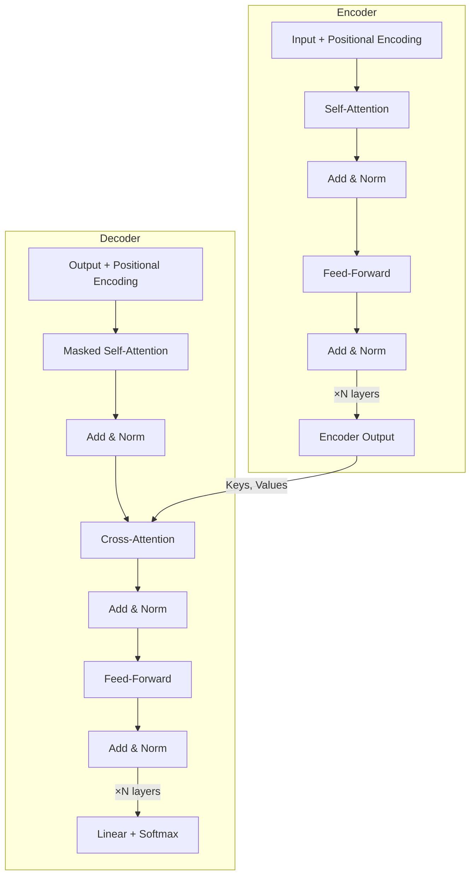
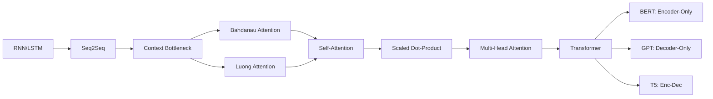

# Seq2Seq, Attention Mechanisms & Transformer Architecture
## A Production-Quality Deep Learning & Engineering Guide

> **"Understanding Transformers from the ground up — the model that powers modern AI."**

---

## Who This Is For

This guide is written for:
- **ML Engineers** who want to deeply understand the architecture powering LLMs
- **Software Engineers** transitioning into AI/NLP roles
- **Researchers** who want clean engineering implementations alongside theory
- **Senior practitioners** who want a single reference that covers intuition, math, code, and production

By the end of this document, you will understand not just *what* these models do, but *why* every design choice was made — from the frustrations of vanilla RNNs to the elegance of multi-head self-attention.

---

## Table of Contents

1. [Seq2Seq Foundation](#1-seq2seq-foundation)
   - [Encoder–Decoder Architecture](#11-encoderdecoder-architecture)
   - [Context Vector Bottleneck Problem](#12-context-vector-bottleneck-problem)
   - [Teacher Forcing](#13-teacher-forcing)
   - [Beam Search](#14-beam-search-conceptual)
2. [Named Attention Mechanisms](#2-named-attention-mechanisms)
   - [Bahdanau Attention (Additive)](#21-bahdanau-attention-additive-attention)
   - [Luong Attention (Multiplicative / Dot-Product)](#22-luong-attention-multiplicative--dot-product-attention)
3. [Transformer Architecture (End-to-End)](#3-transformer-architecture-end-to-end)
   - [Why Transformers Replaced RNNs](#31-why-transformers-replaced-rnns)
   - [Self-Attention](#32-self-attention)
   - [Scaled Dot-Product Attention](#33-scaled-dot-product-attention)
   - [Multi-Head Attention](#34-multi-head-attention)
   - [Positional Encoding](#35-positional-encoding--embeddings)
   - [Feed-Forward Network Block (FFN)](#36-feed-forward-network-block-ffn)
   - [Residual Connections + LayerNorm](#37-residual-connections--layernorm)
   - [Encoder Stack vs Decoder Stack](#38-encoder-stack-vs-decoder-stack)
   - [Decoder Masking (Causal Mask)](#39-decoder-masking-causal-mask)
   - [Cross-Attention](#310-cross-attention-encoderdecoder-attention)
   - [Training Objective Intuition](#311-training-objective-intuition)
   - [Complexity Intuition](#312-complexity-intuition-why-attention-is-expensive)
4. [Transformer Variants](#4-transformer-variants)
   - [Encoder-Only (BERT-style)](#41-encoder-only-bert-style)
   - [Decoder-Only (GPT-style)](#42-decoder-only-gpt-style)
   - [Encoder-Decoder (T5-style)](#43-encoderdecoder-t5-style)
5. [Cross-Topic Relationships](#5-cross-topic-relationships)
6. [End-to-End Real-World Projects](#6-end-to-end-real-world-projects)
   - [Project 1: Neural Machine Translation System](#project-1-neural-machine-translation-system)
   - [Project 2: Text Summarization Pipeline](#project-2-text-summarization-pipeline)
7. [Algorithm Comparison Tables](#7-algorithm-comparison-tables)
8. [Common Mistakes & Pitfalls](#8-common-mistakes--pitfalls)
9. [Interview Preparation](#9-interview-preparation)
10. [Resources](#10-resources)

---

# 1. Seq2Seq Foundation

## 1.1 Encoder–Decoder Architecture

### a. Intuition

Think of Seq2Seq as a **translator with two specialists**:
- The **Encoder** is a reader who reads the entire source sentence (in English) and compresses all the meaning into a single "briefing note."
- The **Decoder** is a writer who reads only the briefing note and generates the translation (in French) word by word.

The model takes a *variable-length input* sequence and produces a *variable-length output* sequence — lengths don't need to match. This is what makes it fundamentally different from a fixed-size classifier.

### b. Mathematical Insight

**Encoder** (an RNN/LSTM):

```
h_t = f(h_{t-1}, x_t)
```

Where:
- `x_t` = input token embedding at time step `t`
- `h_t` = hidden state at step `t`
- `f` = a recurrent cell (GRU or LSTM)

The final hidden state `h_T` becomes the **context vector** `c`:

```
c = h_T
```

**Decoder** generates output tokens one at a time:

```
s_t = g(s_{t-1}, y_{t-1}, c)
P(y_t | y_1,...,y_{t-1}, c) = softmax(W_s * s_t)
```

Where `s_t` is the decoder hidden state and `y_{t-1}` is the previously generated token.

### c. How It Works (Step-by-Step)

1. **Tokenize** source sequence: `["I", "love", "music"]`
2. **Embed** each token into a dense vector
3. **Encoder** processes tokens left-to-right, updating hidden state at each step
4. **Final hidden state** of encoder = context vector `c`
5. **Decoder** is initialized with `c` as its initial hidden state
6. **Decoder** generates output token-by-token:
   - At step 1: takes `<START>` token + `c` → generates first output token
   - At step 2: takes first output token + updated hidden state → generates second token
   - Continues until `<END>` token is generated

### d. Visual Representation

```
INPUT:   ["I", "love", "music"]
          |       |       |
        [Emb]  [Emb]   [Emb]
          |       |       |
Encoder: [RNN]→[RNN]→[RNN]
                          |
                    Context Vector c
                          |
                    ┌─────▼──────┐
                    │  Decoder   │
                    └─────┬──────┘
                          |
                      <START>
                          ↓
                        "J'"
                          ↓
                        "aime"
                          ↓
                        "la"
                          ↓
                       "musique"
                          ↓
                        <END>
```

### e. Python Implementation

```python
import torch
import torch.nn as nn
import random

class Encoder(nn.Module):
    def __init__(self, vocab_size, embed_dim, hidden_dim, num_layers=1, dropout=0.1):
        super().__init__()
        self.embedding = nn.Embedding(vocab_size, embed_dim, padding_idx=0)
        self.rnn = nn.LSTM(embed_dim, hidden_dim, num_layers,
                           batch_first=True, dropout=dropout if num_layers > 1 else 0)
        self.dropout = nn.Dropout(dropout)

    def forward(self, src):
        # src: [batch_size, src_len]
        embedded = self.dropout(self.embedding(src))
        # embedded: [batch_size, src_len, embed_dim]
        outputs, (hidden, cell) = self.rnn(embedded)
        # hidden: [num_layers, batch_size, hidden_dim] — this is the context vector
        return outputs, hidden, cell


class Decoder(nn.Module):
    def __init__(self, vocab_size, embed_dim, hidden_dim, num_layers=1, dropout=0.1):
        super().__init__()
        self.embedding = nn.Embedding(vocab_size, embed_dim, padding_idx=0)
        self.rnn = nn.LSTM(embed_dim, hidden_dim, num_layers,
                           batch_first=True, dropout=dropout if num_layers > 1 else 0)
        self.fc_out = nn.Linear(hidden_dim, vocab_size)
        self.dropout = nn.Dropout(dropout)

    def forward(self, tgt_token, hidden, cell):
        # tgt_token: [batch_size] — one token at a time
        tgt_token = tgt_token.unsqueeze(1)  # [batch_size, 1]
        embedded = self.dropout(self.embedding(tgt_token))
        output, (hidden, cell) = self.rnn(embedded, (hidden, cell))
        prediction = self.fc_out(output.squeeze(1))
        return prediction, hidden, cell


class Seq2Seq(nn.Module):
    def __init__(self, encoder, decoder, device):
        super().__init__()
        self.encoder = encoder
        self.decoder = decoder
        self.device = device

    def forward(self, src, tgt, teacher_forcing_ratio=0.5):
        batch_size = src.shape[0]
        tgt_len = tgt.shape[1]
        tgt_vocab_size = self.decoder.fc_out.out_features

        outputs = torch.zeros(batch_size, tgt_len, tgt_vocab_size).to(self.device)

        # Encode source
        _, hidden, cell = self.encoder(src)

        # First decoder input is the <START> token
        dec_input = tgt[:, 0]

        for t in range(1, tgt_len):
            output, hidden, cell = self.decoder(dec_input, hidden, cell)
            outputs[:, t, :] = output

            # Teacher forcing: use ground truth or model's prediction?
            use_teacher_forcing = random.random() < teacher_forcing_ratio
            dec_input = tgt[:, t] if use_teacher_forcing else output.argmax(dim=1)

        return outputs
```

### f. When to Use / Avoid

| Situation | Recommendation |
|-----------|---------------|
| Short sequence translation (< 20 tokens) | ✅ Works reasonably well |
| Long sequence translation (> 50 tokens) | ❌ Context bottleneck kills performance — use attention |
| Summarization, Q&A | ❌ Need attention or full Transformer |
| Learning/prototyping NLP | ✅ Great starting point |
| Production NLP system | ❌ Use Transformer-based models instead |

### g. Key Hyperparameters

| Hyperparameter | Typical Range | Effect |
|----------------|---------------|--------|
| `hidden_dim` | 256–512 | Larger = more capacity, slower |
| `num_layers` | 1–4 | Depth of RNN stack |
| `embed_dim` | 128–256 | Token representation size |
| `dropout` | 0.1–0.5 | Regularization |
| `teacher_forcing_ratio` | 0.5 during training | Controls exposure bias tradeoff |

---

## 1.2 Context Vector Bottleneck Problem

### a. Intuition

Imagine you read a 500-page novel and must summarize it in exactly **one sentence** — and your writer colleague can only use that one sentence to write a full response. That's the bottleneck problem.

No matter how long the input, the encoder must compress everything into a single fixed-size vector `c`. For short sequences, this is fine. For long sequences, early tokens get "forgotten" as their information is overwritten by later tokens in the RNN's hidden state.

This is the **fundamental limitation of vanilla Seq2Seq** — and the motivation for attention mechanisms.

### b. Mathematical Insight

The context vector is:

```
c = h_T   (just the last hidden state)
```

For a sequence of length T, the gradient must flow backward through T steps. Due to the **vanishing gradient problem**:

```
∂L/∂h_1 = (∂h_T/∂h_1) * (∂L/∂h_T)
         ≈ 0  for large T
```

The encoder hidden state at `h_1` contributes almost nothing to the final context vector when T is large.

### c. How It Works (Step-by-Step)

1. Encoder processes 50-token sentence
2. At each step, the hidden state is a weighted blend of current input + previous state
3. By step 50, the hidden state is dominated by the last few tokens
4. Decoder uses this compressed context for all generation steps
5. **Result**: Early parts of the sentence are underrepresented — quality degrades for long sequences

### d. Visual Representation

```
Token:    "The"  "cat"  "sat"  "on"  "the"  "mat"
          h_1    h_2    h_3    h_4    h_5    h_6
           │      │      │      │      │      │
           └──────┴──────┴──────┴──────┴──────┘
                                              │
                                     Context c = h_6
                                     
Information loss: h_1 ("The") barely
influences c after 5 more steps.
```

### e. Evidence in Practice

```python
import numpy as np
import matplotlib.pyplot as plt

# Simulating information decay in a vanilla RNN
# (illustrative — not actual RNN training)
def simulate_info_retention(seq_len, decay_factor=0.8):
    """
    Shows how much each token's information persists 
    in the final hidden state.
    """
    retention = [decay_factor ** (seq_len - t) for t in range(1, seq_len + 1)]
    return retention

seq_len = 20
retention = simulate_info_retention(seq_len)

print("Token position | Estimated influence on final context vector")
print("-" * 55)
for i, r in enumerate(retention):
    bar = "█" * int(r * 30)
    print(f"  Token {i+1:2d}     | {bar} ({r:.3f})")
```

### f. When to Use / Avoid

- This problem is **inherent** to vanilla Seq2Seq — you don't "use" it, you solve it
- Solutions: **Bahdanau Attention**, **Luong Attention**, **Transformers**

---

## 1.3 Teacher Forcing

### a. Intuition

When training a decoder, you have two choices for what to feed as input at each step:
1. **Ground truth**: "Feed the correct word, regardless of what the model predicted"
2. **Model's own output**: "Feed whatever the model predicted — even if it's wrong"

**Teacher forcing** = option 1. It's like a music teacher who plays the correct note for a student to follow, rather than letting them propagate their mistakes.

The benefit: training converges faster. The risk: a **training/inference mismatch** called **exposure bias** — the model never learns to recover from its own mistakes during training, so errors compound at inference time.

### b. Mathematical Insight

Without teacher forcing (free running):
```
ŷ_t = argmax P(y_t | ŷ_1, ..., ŷ_{t-1}, c)
```

With teacher forcing:
```
ŷ_t = argmax P(y_t | y_1, ..., y_{t-1}, c)
```
where `y_{t-1}` is the **true** previous token, not the predicted one.

**Scheduled sampling** (compromise): probability `p_t` of using ground truth decays over training:
```
p_t = k / (k + exp(i/k))   [inverse sigmoid decay]
```

### c. How It Works (Step-by-Step)

1. At training step `t`, model generates output `ŷ_t`
2. If `random() < teacher_forcing_ratio`:
   - Feed `y_t` (true token) as next input
3. Else:
   - Feed `ŷ_t` (predicted token) as next input
4. Compute loss against all true targets regardless
5. Common schedule: high forcing (0.9) early, reduce to 0.5 or lower by end of training

### d. Visual Representation

```
Teacher Forcing ON:
  Input:  <START>   y₁    y₂    y₃
          (true)  (true) (true) (true)
             ↓      ↓     ↓     ↓
  Decoder: [D] → [D] → [D] → [D]
             ↓      ↓     ↓     ↓
  Output:   ŷ₁    ŷ₂    ŷ₃    ŷ₄
  Loss: compare ŷ against true y at each step

Teacher Forcing OFF (Free Running):
  Input:  <START>   ŷ₁    ŷ₂    ŷ₃
          (model) (model) (model) (model)
             ↓      ↓     ↓     ↓
  Decoder: [D] → [D] → [D] → [D]
```

### e. Python Implementation (within Seq2Seq)

```python
# The teacher forcing logic from the Seq2Seq.forward() above:
for t in range(1, tgt_len):
    output, hidden, cell = self.decoder(dec_input, hidden, cell)
    outputs[:, t, :] = output

    # Stochastic teacher forcing decision
    use_teacher_forcing = random.random() < teacher_forcing_ratio
    
    if use_teacher_forcing:
        dec_input = tgt[:, t]       # Ground truth token
    else:
        dec_input = output.argmax(dim=1)  # Model's own prediction

# Scheduled sampling: linearly decay teacher forcing ratio
def get_teacher_forcing_ratio(epoch, total_epochs, start=1.0, end=0.5):
    """Linearly decay from `start` to `end` over training."""
    return start - (start - end) * (epoch / total_epochs)
```

### f. When to Use / Avoid

| Scenario | Recommendation |
|----------|---------------|
| Early training stages | ✅ High teacher forcing (0.8–1.0) |
| Late training / fine-tuning | ✅ Lower teacher forcing (0.3–0.5) |
| Production inference | ❌ Always free-running — no ground truth available |
| Very short sequences | ✅ Less critical — exposure bias has less impact |

---

## 1.4 Beam Search (Conceptual)

### a. Intuition

During inference, the simplest decoding strategy is **greedy decoding**: at each step, pick the single most probable next token. But this is myopic — a locally great choice can lead to a globally bad sentence.

**Beam search** keeps `k` (beam width) candidate sequences alive at each step. It's like an explorer who, instead of taking the single best path at each junction, keeps `k` most promising paths open and evaluates them all.

### b. Mathematical Insight

Beam search maximizes the **joint log-probability** of the entire sequence:

```
score(y₁,...,yT) = Σ log P(yt | y₁,...,y_{t-1}, c)
```

At each step, from each of the `k` beams, we expand all vocabulary tokens and keep only the top `k` by cumulative score.

**Length normalization** (to prevent short sequences from dominating):
```
normalized_score = score / T^α   (α ≈ 0.6–0.7)
```

### c. How It Works (Step-by-Step)

1. Start with `<START>` token; beam size `k=3`
2. **Step 1**: Compute probabilities for all vocab tokens → keep top 3
3. **Step 2**: From each of the 3 beams, expand to all vocab tokens → now 3×V candidates → keep top 3
4. Continue until all beams hit `<END>` or max length
5. Return the beam with the highest normalized score

### d. Visual Representation

```
k=3 Beam Search Example:

Step 0:           <START>
                 /    |    \
Step 1:        "Je"  "La"  "Il"
               0.6   0.2   0.1
              / | \   ...
Step 2:   "Je suis" "Je vais" "Je peux" ...
           0.6×0.5  0.6×0.3  0.6×0.2
           =0.30    =0.18    =0.12

Keep top 3 at each level. Prune the rest.
```

### e. Python Implementation (Conceptual)

```python
import heapq

def beam_search_decode(model, encoder_output, start_token, end_token,
                        max_len=50, beam_width=3, alpha=0.6):
    """
    Conceptual beam search decoder.
    model: callable that returns (log_probs, new_hidden) given (token, hidden)
    """
    # Initial beam: (neg_score, token_sequence, hidden_state)
    beams = [(0.0, [start_token], None)]
    completed = []

    for step in range(max_len):
        new_beams = []

        for neg_score, sequence, hidden in beams:
            last_token = sequence[-1]

            if last_token == end_token:
                # Normalize score by length
                length_penalty = len(sequence) ** alpha
                normalized = neg_score / length_penalty
                completed.append((normalized, sequence))
                continue

            # Get next-token log probabilities from model
            log_probs, new_hidden = model(last_token, hidden, encoder_output)

            # Expand beam: consider top beam_width candidates
            top_k = log_probs.topk(beam_width)
            for log_prob, token in zip(top_k.values, top_k.indices):
                new_score = neg_score - log_prob.item()  # negate for min-heap
                new_beams.append((new_score, sequence + [token.item()], new_hidden))

        # Keep top beam_width beams
        beams = heapq.nsmallest(beam_width, new_beams, key=lambda x: x[0])

        if not beams:
            break

    # Return best completed sequence
    if completed:
        completed.sort(key=lambda x: x[0])
        return completed[0][1]
    return beams[0][1]  # fallback to best incomplete
```

### f. When to Use / Avoid

| Scenario | Recommendation |
|----------|---------------|
| Machine translation | ✅ Standard practice, k=4–6 |
| Text summarization | ✅ Effective, k=4 |
| Open-ended generation (LLMs) | ❌ Tends to produce repetitive/generic text; use sampling instead |
| Real-time latency-sensitive systems | ⚠️ Higher k = slower; profile carefully |

### g. Key Hyperparameters

| Parameter | Typical Value | Effect |
|-----------|---------------|--------|
| `beam_width` (k) | 4–10 | Higher = better quality, more compute |
| `alpha` (length penalty) | 0.6–0.7 | Prevents short-sequence bias |
| `max_len` | 50–200 | Maximum output length |

---

# 2. Named Attention Mechanisms

## 2.1 Bahdanau Attention (Additive Attention)

### a. Intuition

The breakthrough insight from Bahdanau et al. (2015): instead of compressing the entire source into one vector, **let the decoder look back at all encoder hidden states** and decide which parts to focus on for each output token.

Think of it as a **spotlight on a theatre stage**: when generating the word "aime" in French, the decoder shines its spotlight most brightly on the English word "love" — not the whole sentence.

### b. Mathematical Insight

For each decoder time step `t`, compute an **attention score** `e_tj` between decoder hidden state `s_{t-1}` and each encoder hidden state `h_j`:

```
e_tj = v^T * tanh(W_a * s_{t-1} + U_a * h_j)
```

Normalize into **attention weights** (sum to 1 over all encoder positions):

```
α_tj = softmax(e_tj) = exp(e_tj) / Σ_k exp(e_tk)
```

Compute **context vector** as weighted sum of all encoder hidden states:

```
c_t = Σ_j α_tj * h_j
```

This is why it's called **additive** — the score is computed by adding (through `tanh`) the query and key projections.

### c. How It Works (Step-by-Step)

1. Encoder produces **all** hidden states `{h_1, h_2, ..., h_T}` — not just the last one
2. At decoder step `t`, take the previous decoder state `s_{t-1}` (the **query**)
3. Score each encoder hidden state `h_j` (the **keys**) using a learned alignment network
4. Apply softmax → get attention distribution `α_t` (a probability distribution over source tokens)
5. Weighted sum of encoder states using `α_t` → dynamic context vector `c_t`
6. Concatenate `c_t` with `s_{t-1}` and `y_{t-1}` → feed into decoder RNN → produce `s_t`
7. Predict output token from `s_t`

### d. Visual Representation

```
Encoder hidden states:
  h₁     h₂     h₃     h₄     h₅
  "I"   "love" "the"  "big"  "cat"
   │      │      │      │      │
   ◄──────────────────────────────┐
                                  │ Attention
Decoder at step t=2:             │
  s_{t-1} (decoding "aime")      │
      │                           │
      ├──→ score(s_{t-1}, h_1) = 0.05
      ├──→ score(s_{t-1}, h_2) = 0.70  ← high focus on "love"
      ├──→ score(s_{t-1}, h_3) = 0.10
      ├──→ score(s_{t-1}, h_4) = 0.05
      └──→ score(s_{t-1}, h_5) = 0.10
              softmax → α_t = [0.05, 0.70, 0.10, 0.05, 0.10]
              c_t = 0.05*h₁ + 0.70*h₂ + 0.10*h₃ + ...
```

### e. Python Implementation

```python
import torch
import torch.nn as nn
import torch.nn.functional as F

class BahdanauAttention(nn.Module):
    def __init__(self, encoder_hidden_dim, decoder_hidden_dim, attention_dim):
        super().__init__()
        # W_a: projects decoder state
        self.W_a = nn.Linear(decoder_hidden_dim, attention_dim, bias=False)
        # U_a: projects each encoder hidden state
        self.U_a = nn.Linear(encoder_hidden_dim, attention_dim, bias=False)
        # v: produces scalar score from the combined projection
        self.v = nn.Linear(attention_dim, 1, bias=False)

    def forward(self, s_prev, encoder_outputs):
        """
        s_prev:          [batch_size, decoder_hidden_dim]
        encoder_outputs: [batch_size, src_len, encoder_hidden_dim]
        returns:
            context:     [batch_size, encoder_hidden_dim]
            alpha:       [batch_size, src_len]
        """
        # Project decoder state: [batch_size, 1, attention_dim]
        decoder_proj = self.W_a(s_prev).unsqueeze(1)

        # Project all encoder states: [batch_size, src_len, attention_dim]
        encoder_proj = self.U_a(encoder_outputs)

        # Combined + tanh: [batch_size, src_len, attention_dim]
        energy = torch.tanh(decoder_proj + encoder_proj)

        # Score: [batch_size, src_len, 1] → squeeze → [batch_size, src_len]
        scores = self.v(energy).squeeze(-1)

        # Attention weights
        alpha = F.softmax(scores, dim=-1)  # [batch_size, src_len]

        # Weighted sum of encoder outputs
        # alpha.unsqueeze(1): [batch_size, 1, src_len]
        context = torch.bmm(alpha.unsqueeze(1), encoder_outputs)  # [batch_size, 1, enc_dim]
        context = context.squeeze(1)  # [batch_size, enc_dim]

        return context, alpha


class BahdanauDecoder(nn.Module):
    def __init__(self, vocab_size, embed_dim, encoder_hidden_dim,
                 decoder_hidden_dim, attention_dim):
        super().__init__()
        self.attention = BahdanauAttention(encoder_hidden_dim, decoder_hidden_dim, attention_dim)
        self.embedding = nn.Embedding(vocab_size, embed_dim)
        # Input to RNN = embedding + context vector
        self.rnn = nn.GRUCell(embed_dim + encoder_hidden_dim, decoder_hidden_dim)
        self.fc_out = nn.Linear(decoder_hidden_dim + encoder_hidden_dim + embed_dim, vocab_size)

    def forward(self, y_prev, s_prev, encoder_outputs):
        # Embed previous token
        embedded = self.embedding(y_prev)           # [batch, embed_dim]
        # Compute attention context
        context, alpha = self.attention(s_prev, encoder_outputs)
        # Concatenate embedding + context → feed into GRU
        rnn_input = torch.cat([embedded, context], dim=1)
        s_t = self.rnn(rnn_input, s_prev)           # [batch, dec_hidden_dim]
        # Predict next token
        output = torch.cat([s_t, context, embedded], dim=1)
        prediction = self.fc_out(output)            # [batch, vocab_size]
        return prediction, s_t, alpha


# Quick test
if __name__ == "__main__":
    batch_size, src_len = 4, 10
    enc_hidden, dec_hidden, attn_dim = 256, 256, 128
    vocab_size, embed_dim = 5000, 128

    encoder_outputs = torch.randn(batch_size, src_len, enc_hidden)
    s_prev = torch.zeros(batch_size, dec_hidden)
    y_prev = torch.randint(0, vocab_size, (batch_size,))

    decoder = BahdanauDecoder(vocab_size, embed_dim, enc_hidden, dec_hidden, attn_dim)
    pred, s_t, alpha = decoder(y_prev, s_prev, encoder_outputs)

    print(f"Prediction shape: {pred.shape}")       # [4, 5000]
    print(f"Attention weights: {alpha.shape}")      # [4, 10]
    print(f"Alpha sums to 1: {alpha.sum(dim=-1)}")  # [4] ≈ all 1.0
```

### f. When to Use / Avoid

| Scenario | Recommendation |
|----------|---------------|
| RNN-based Seq2Seq + attention | ✅ Classic and effective |
| Short to medium sequences | ✅ Works well |
| Interpretability needed | ✅ Attention weights are human-readable |
| Modern production NLP | ❌ Replaced by Transformers |

### g. Key Hyperparameters

| Parameter | Typical Value | Effect |
|-----------|---------------|--------|
| `attention_dim` | 128–512 | Size of alignment network |
| `encoder_hidden_dim` | 256–512 | Must match encoder |
| `decoder_hidden_dim` | 256–512 | Decoder capacity |

---

## 2.2 Luong Attention (Multiplicative / Dot-Product Attention)

### a. Intuition

Luong et al. (2015) proposed a **simpler, faster** attention mechanism. Instead of learning a separate alignment network (Bahdanau), Luong computes alignment by directly **multiplying** (dot-product) the decoder state with encoder states.

Two variants:
- **Dot**: raw dot product
- **General**: a learned weight matrix in between
- **Concat**: similar to Bahdanau (included for comparison)

The key architectural difference: Bahdanau uses the **previous** decoder state to compute attention, while Luong uses the **current** decoder output.

### b. Mathematical Insight

**Dot score** (when dimensions match):
```
score(s_t, h_j) = s_t^T * h_j
```

**General score** (with weight matrix W_a):
```
score(s_t, h_j) = s_t^T * W_a * h_j
```

**Attention weights and context**:
```
α_tj = softmax(score(s_t, h_j))
c_t  = Σ_j α_tj * h_j
```

**Attentional hidden state** (key difference from Bahdanau):
```
h̃_t = tanh(W_c * [c_t; s_t])
```

The final output prediction comes from `h̃_t`, not `s_t` directly.

### c. How It Works (Step-by-Step)

1. Encoder produces all hidden states `{h_1, ..., h_T}`
2. Decoder RNN processes current input → produces **current** hidden state `s_t`
3. Compute attention scores between `s_t` and all `h_j` via dot/general score
4. Softmax → attention weights `α_t`
5. Weighted sum → context vector `c_t`
6. Concatenate `[c_t; s_t]` → pass through linear + tanh → attentional state `h̃_t`
7. Predict token from `h̃_t`

### d. Visual Representation

```
Bahdanau:  s_{t-1} ──→ Attention ──→ c_t ──→ [c_t; s_{t-1}; y_{t-1}] ──→ RNN ──→ s_t
                                                                                     ↓
                                                                               Predict ŷ_t

Luong:     y_{t-1} → RNN → s_t ──→ Attention ──→ c_t ──→ [c_t; s_t] ──→ h̃_t ──→ Predict ŷ_t
                             ↑___________________________|
                          Uses CURRENT state, not previous
```

### e. Python Implementation

```python
class LuongAttention(nn.Module):
    def __init__(self, hidden_dim, method='general'):
        super().__init__()
        self.method = method

        if method == 'general':
            # Learnable weight matrix for general attention
            self.W_a = nn.Linear(hidden_dim, hidden_dim, bias=False)
        elif method == 'concat':
            self.W_a = nn.Linear(hidden_dim * 2, hidden_dim, bias=False)
            self.v = nn.Linear(hidden_dim, 1, bias=False)
        # 'dot' requires no parameters

    def score(self, s_t, encoder_outputs):
        """
        s_t:             [batch_size, hidden_dim]
        encoder_outputs: [batch_size, src_len, hidden_dim]
        returns scores:  [batch_size, src_len]
        """
        if self.method == 'dot':
            # Simple dot product
            # s_t: [batch, hidden] → [batch, hidden, 1]
            return torch.bmm(encoder_outputs, s_t.unsqueeze(2)).squeeze(2)

        elif self.method == 'general':
            # s_t projected: [batch, hidden] → [batch, hidden, 1]
            projected = self.W_a(s_t).unsqueeze(2)
            return torch.bmm(encoder_outputs, projected).squeeze(2)

        elif self.method == 'concat':
            # Repeat s_t for each encoder step
            s_expanded = s_t.unsqueeze(1).expand_as(encoder_outputs)
            combined = torch.cat([s_expanded, encoder_outputs], dim=2)
            return self.v(torch.tanh(self.W_a(combined))).squeeze(2)

    def forward(self, s_t, encoder_outputs):
        scores = self.score(s_t, encoder_outputs)       # [batch, src_len]
        alpha = F.softmax(scores, dim=-1)               # [batch, src_len]
        context = torch.bmm(alpha.unsqueeze(1), encoder_outputs).squeeze(1)
        return context, alpha


class LuongDecoder(nn.Module):
    def __init__(self, vocab_size, embed_dim, hidden_dim, attention_method='general'):
        super().__init__()
        self.embedding = nn.Embedding(vocab_size, embed_dim)
        self.rnn = nn.GRUCell(embed_dim, hidden_dim)
        self.attention = LuongAttention(hidden_dim, method=attention_method)
        # Concatenation weight: maps [context; s_t] → hidden_dim
        self.W_c = nn.Linear(hidden_dim * 2, hidden_dim)
        self.fc_out = nn.Linear(hidden_dim, vocab_size)

    def forward(self, y_prev, s_prev, encoder_outputs):
        # 1. Embed token
        embedded = self.embedding(y_prev)          # [batch, embed_dim]
        # 2. Run RNN to get current state
        s_t = self.rnn(embedded, s_prev)           # [batch, hidden_dim]
        # 3. Compute attention with CURRENT state
        context, alpha = self.attention(s_t, encoder_outputs)
        # 4. Attentional state
        h_tilde = torch.tanh(self.W_c(torch.cat([context, s_t], dim=1)))
        # 5. Predict
        prediction = self.fc_out(h_tilde)          # [batch, vocab_size]
        return prediction, s_t, alpha
```

### f. Bahdanau vs Luong Comparison

| Aspect | Bahdanau | Luong |
|--------|----------|-------|
| When attention computed | Before decoder RNN step | After decoder RNN step |
| Query used | Previous hidden state `s_{t-1}` | Current hidden state `s_t` |
| Score function | Additive (MLP) | Multiplicative (dot/general) |
| Computation cost | Higher (alignment network) | Lower |
| Historical impact | First attention paper | Simplified and extended Bahdanau |

### g. Key Hyperparameters

| Parameter | Options | Effect |
|-----------|---------|--------|
| `method` | `'dot'`, `'general'`, `'concat'` | Expressiveness vs speed |
| `hidden_dim` | 256–512 | Model capacity |

---

# 3. Transformer Architecture (End-to-End)

## 3.1 Why Transformers Replaced RNNs

### a. Intuition

RNNs process sequences **one token at a time** — each step depends on the previous. This is inherently **sequential** and creates two problems:

1. **No parallelism**: You cannot process token 5 until you've processed tokens 1–4. Modern GPUs are built for parallel computation — RNNs waste most of their hardware.
2. **Long-range dependencies**: Even with attention, the RNN still creates a sequential computation path. Information from distant tokens must flow through many intermediate steps.

Transformers solve both: they process **all tokens simultaneously** using self-attention, enabling massive parallelism and direct token-to-token interaction regardless of distance.

### b. Side-by-Side Comparison

```
RNN Processing ("I love Paris"):
    I → [RNN] → h₁
                  ↓
         love → [RNN] → h₂
                           ↓
                Paris → [RNN] → h₃
(Must wait for h₁ before computing h₂)

Transformer Processing:
    I ──────────────→ [Attention] ← all tokens interact simultaneously
    love ──────────→ [Attention]     in a single parallel operation
    Paris ─────────→ [Attention]
```

### c. Key Advantages of Transformers

| Property | RNN/LSTM | Transformer |
|----------|----------|-------------|
| Parallelism | Sequential | Fully parallel |
| Long-range dependency | O(n) path length | O(1) direct attention |
| Training speed | Slow (sequential) | Fast (GPU-friendly) |
| Context window | Limited by vanishing gradient | Limited by attention cost O(n²) |
| Scaling behavior | Saturates | Scales remarkably with data + size |

---

## 3.2 Self-Attention

### a. Intuition

In a regular sentence, the meaning of a word depends on its context. In "The **bank** by the **river** flooded," the word "bank" refers to a riverbank, not a financial institution. How does the model know? By looking at the word "river."

**Self-attention** allows each token to "look at" every other token in the same sequence and decide how much to borrow from each. It's the mechanism by which a Transformer builds rich, context-aware representations.

The key abstraction: every token is simultaneously a **query** (what am I looking for?), a **key** (what do I contain?), and a **value** (what will I contribute?).

### b. Mathematical Insight

From each token's embedding, we project three vectors:
```
Q = X * W_Q   (Queries)
K = X * W_K   (Keys)
V = X * W_V   (Values)
```

where `X` is the input matrix and `W_Q, W_K, W_V` are learned weight matrices.

Attention output:
```
Attention(Q, K, V) = softmax(Q * K^T / √d_k) * V
```

- `Q * K^T`: Similarity between every query and every key → attention score matrix
- `/ √d_k`: Scaling to prevent softmax saturation
- `softmax(...)`: Normalize to probability distribution
- `* V`: Weighted sum of values

---

## 3.3 Scaled Dot-Product Attention

### a. Intuition

The **scaling by √d_k** is a small but critical detail. Without it, when `d_k` is large (e.g., 512), the dot products can become very large in magnitude, pushing softmax into regions with extremely small gradients (near-zero gradients in the flat parts of softmax).

The scaling keeps dot products in a reasonable range regardless of dimensionality.

### b. Mathematical Insight

Why √d_k? Assume `q` and `k` are random vectors with zero mean and unit variance. Then:
```
q · k = Σᵢ qᵢkᵢ   has variance d_k
std(q · k) = √d_k
```

Dividing by `√d_k` normalizes back to unit variance, keeping gradients healthy.

### c. Step-by-Step

1. Compute `scores = Q @ K.T` → shape `[seq_len, seq_len]`
2. Scale: `scores = scores / sqrt(d_k)`
3. (Optional) Apply mask (for causal decoding)
4. `weights = softmax(scores, dim=-1)` → each row sums to 1
5. Output = `weights @ V` → shape `[seq_len, d_v]`

### d. Visual Representation

```
Q:  [seq_len, d_k]           K:  [seq_len, d_k]
         │                              │
         └───────── @ K.T ─────────────┘
                       │
              [seq_len, seq_len]   ← attention score matrix
                       │
                  ÷ √d_k
                       │
                   softmax
                       │
              [seq_len, seq_len]   ← attention weights
                       │
                   @ V [seq_len, d_v]
                       │
              [seq_len, d_v]       ← attention output

Each row of the output is a weighted combination of all values.
```

### e. Python Implementation

```python
import torch
import torch.nn as nn
import torch.nn.functional as F
import math

def scaled_dot_product_attention(Q, K, V, mask=None):
    """
    Q: [batch, heads, seq_len, d_k]
    K: [batch, heads, seq_len, d_k]
    V: [batch, heads, seq_len, d_v]
    mask: optional [batch, 1, seq_len, seq_len] or [batch, 1, 1, seq_len]
    """
    d_k = Q.size(-1)

    # Attention scores: [batch, heads, seq_len_q, seq_len_k]
    scores = torch.matmul(Q, K.transpose(-2, -1)) / math.sqrt(d_k)

    # Apply mask (e.g., causal mask or padding mask)
    if mask is not None:
        scores = scores.masked_fill(mask == 0, float('-inf'))

    # Attention weights
    attn_weights = F.softmax(scores, dim=-1)

    # Handle NaN from softmax over all -inf (masked padding tokens)
    attn_weights = torch.nan_to_num(attn_weights, nan=0.0)

    # Weighted values
    output = torch.matmul(attn_weights, V)

    return output, attn_weights
```

---

## 3.4 Multi-Head Attention

### a. Intuition

A single attention head produces one "view" of token relationships. But language has multiple concurrent relationships — a word can simultaneously be related to its subject, its object, and a temporal marker.

**Multi-head attention** runs `h` attention heads in **parallel**, each learning to focus on different aspects of the sequence. Their outputs are concatenated and projected.

Think of it as `h` different experts independently analyzing the text from different angles, then combining their analyses.

### b. Mathematical Insight

Each head has its own projections:
```
head_i = Attention(Q * W_Q^i, K * W_K^i, V * W_V^i)
```

All heads are concatenated and projected:
```
MultiHead(Q, K, V) = Concat(head_1, ..., head_h) * W_O
```

where:
- `W_Q^i ∈ R^{d_model × d_k}`, `d_k = d_model / h`
- `W_O ∈ R^{h*d_v × d_model}` (output projection)

**Key insight**: The total computation is roughly the same as one large attention, but you get `h` diverse representations.

### c. How It Works

1. Project inputs into `h` sets of (Q, K, V) using `h` different weight matrices
2. Run scaled dot-product attention independently for each head
3. Concatenate all head outputs: `[batch, seq_len, h * d_v]`
4. Apply output projection `W_O`: → `[batch, seq_len, d_model]`

### d. Visual Representation

```
Input X: [batch, seq_len, d_model]
              │
    ┌─────────┼──────────┐
    │         │          │
  Head 1    Head 2    Head h
  W_Q^1     W_Q^2     W_Q^h
  W_K^1     W_K^2     W_K^h
  W_V^1     W_V^2     W_V^h
    │         │          │
  Attn      Attn       Attn
    │         │          │
    └─────────┴──────────┘
              │
          Concat → [batch, seq_len, h * d_v]
              │
           W_O projection
              │
    [batch, seq_len, d_model]
```

### e. Python Implementation

```python
class MultiHeadAttention(nn.Module):
    def __init__(self, d_model, num_heads, dropout=0.1):
        super().__init__()
        assert d_model % num_heads == 0, "d_model must be divisible by num_heads"

        self.d_model = d_model
        self.num_heads = num_heads
        self.d_k = d_model // num_heads  # dimension per head

        # All projections in one matrix for efficiency
        self.W_Q = nn.Linear(d_model, d_model, bias=False)
        self.W_K = nn.Linear(d_model, d_model, bias=False)
        self.W_V = nn.Linear(d_model, d_model, bias=False)
        self.W_O = nn.Linear(d_model, d_model, bias=False)

        self.dropout = nn.Dropout(dropout)

    def split_heads(self, x):
        """
        x: [batch, seq_len, d_model]
        → [batch, num_heads, seq_len, d_k]
        """
        batch_size, seq_len, _ = x.shape
        x = x.view(batch_size, seq_len, self.num_heads, self.d_k)
        return x.transpose(1, 2)  # [batch, heads, seq_len, d_k]

    def forward(self, query, key, value, mask=None):
        """
        query, key, value: [batch, seq_len, d_model]
        For self-attention: query = key = value = x
        For cross-attention: query from decoder, key/value from encoder
        """
        # Project
        Q = self.split_heads(self.W_Q(query))
        K = self.split_heads(self.W_K(key))
        V = self.split_heads(self.W_V(value))

        # Scaled dot-product attention for all heads in parallel
        attn_output, attn_weights = scaled_dot_product_attention(Q, K, V, mask)

        # Recombine heads: [batch, heads, seq_len, d_k] → [batch, seq_len, d_model]
        batch_size = query.size(0)
        attn_output = attn_output.transpose(1, 2).contiguous()
        attn_output = attn_output.view(batch_size, -1, self.d_model)

        # Final projection
        output = self.W_O(attn_output)
        return output, attn_weights


# Test
if __name__ == "__main__":
    batch, seq_len, d_model, heads = 2, 10, 512, 8
    x = torch.randn(batch, seq_len, d_model)
    mha = MultiHeadAttention(d_model, heads)
    out, weights = mha(x, x, x)  # self-attention
    print(f"Output: {out.shape}")     # [2, 10, 512]
    print(f"Weights: {weights.shape}") # [2, 8, 10, 10]
```

---

## 3.5 Positional Encoding / Embeddings

### a. Intuition

Self-attention is **permutation invariant** — it doesn't inherently know the order of tokens. Feed it "cat sat the" and it produces the same result as "the cat sat." Order matters in language, so we must inject positional information.

The original Transformer paper uses **sinusoidal positional encoding** — deterministic functions of position and dimension index. Each position gets a unique "fingerprint" vector that is added to the token embedding.

### b. Mathematical Insight

For position `pos` and dimension `i`:
```
PE(pos, 2i)   = sin(pos / 10000^(2i/d_model))
PE(pos, 2i+1) = cos(pos / 10000^(2i/d_model))
```

Properties:
- Each position has a unique encoding
- For any fixed offset `k`, `PE(pos+k)` can be expressed as a linear transformation of `PE(pos)` — relative positions can be learned
- The sinusoidal pattern allows generalization to sequence lengths not seen during training

**Learned positional embeddings** (used in BERT, GPT) are an alternative: simply treat position as a token and learn an embedding for each position index. Simpler but doesn't generalize to unseen lengths.

### c. How It Works

1. Token embedding: `E(x) ∈ R^{d_model}` for each token
2. Positional encoding: `PE(pos) ∈ R^{d_model}` for each position
3. Input to first layer: `E(x) + PE(pos)` (element-wise addition)
4. Typically scaled: `E(x) * sqrt(d_model)` before addition (to prevent PE from dominating)

### d. Visual Representation

```
Position encoding heatmap (schematic):
                     Dimension →
         0    1    2    3   ...  d_model
pos=0  [ sin  cos  sin  cos ...  cos ]
pos=1  [ sin  cos  sin  cos ...  cos ]
pos=2  [ sin  cos  sin  cos ...  cos ]
...

Low dimensions oscillate fast (high frequency)
High dimensions oscillate slowly (low frequency)
→ Each row is unique, encoding absolute position
```

### e. Python Implementation

```python
class PositionalEncoding(nn.Module):
    def __init__(self, d_model, max_len=5000, dropout=0.1):
        super().__init__()
        self.dropout = nn.Dropout(dropout)

        # Create matrix of shape [max_len, d_model]
        pe = torch.zeros(max_len, d_model)

        # Position indices: [max_len, 1]
        position = torch.arange(0, max_len, dtype=torch.float).unsqueeze(1)

        # Dimension scaling: [d_model/2]
        div_term = torch.exp(
            torch.arange(0, d_model, 2).float() * (-math.log(10000.0) / d_model)
        )

        # Apply sin to even indices, cos to odd indices
        pe[:, 0::2] = torch.sin(position * div_term)
        pe[:, 1::2] = torch.cos(position * div_term)

        # Add batch dimension: [1, max_len, d_model]
        pe = pe.unsqueeze(0)
        # Register as buffer (not a parameter, but part of state)
        self.register_buffer('pe', pe)

    def forward(self, x):
        """
        x: [batch_size, seq_len, d_model]
        """
        # Scale embeddings, then add positional encoding
        x = x * math.sqrt(x.size(-1))
        x = x + self.pe[:, :x.size(1), :]
        return self.dropout(x)


# Visualize positional encoding
def visualize_pe(d_model=64, max_len=50):
    import matplotlib.pyplot as plt
    import numpy as np

    pe_layer = PositionalEncoding(d_model, max_len, dropout=0.0)
    # Get PE values: [1, max_len, d_model]
    dummy_x = torch.zeros(1, max_len, d_model)
    with torch.no_grad():
        pe_values = pe_layer.pe[0].numpy()  # [max_len, d_model]

    plt.figure(figsize=(12, 4))
    plt.imshow(pe_values.T, aspect='auto', cmap='RdBu')
    plt.xlabel("Position")
    plt.ylabel("Dimension")
    plt.title("Sinusoidal Positional Encoding")
    plt.colorbar()
    plt.tight_layout()
    plt.savefig("positional_encoding.png", dpi=150)
    print("Saved positional_encoding.png")
```

---

## 3.6 Feed-Forward Network Block (FFN)

### a. Intuition

After multi-head attention aggregates information across tokens, the **FFN** processes each token **independently** — like a position-wise transformation. It gives the model additional capacity to transform the attended representations.

Think of it as: attention lets tokens **talk to each other**; FFN lets each token **think about what it heard**.

### b. Mathematical Insight

For each position independently:
```
FFN(x) = max(0, x * W₁ + b₁) * W₂ + b₂
```

or with GELU (used in BERT/GPT):
```
FFN(x) = GELU(x * W₁ + b₁) * W₂ + b₂
```

Dimensions:
- Input/output: `d_model` (e.g., 512)
- Inner layer: `d_ff = 4 * d_model` (e.g., 2048) — the 4× expansion is standard

The inner dimension is much larger, giving the model a "workspace" to perform complex transformations before projecting back.

### c. Python Implementation

```python
class FeedForward(nn.Module):
    def __init__(self, d_model, d_ff=None, dropout=0.1, activation='relu'):
        super().__init__()
        d_ff = d_ff or 4 * d_model  # Standard 4x expansion

        self.linear1 = nn.Linear(d_model, d_ff)
        self.linear2 = nn.Linear(d_ff, d_model)
        self.dropout = nn.Dropout(dropout)

        if activation == 'relu':
            self.activation = nn.ReLU()
        elif activation == 'gelu':
            self.activation = nn.GELU()
        else:
            raise ValueError(f"Unknown activation: {activation}")

    def forward(self, x):
        """
        x: [batch_size, seq_len, d_model]
        Applied independently to each position (no cross-position mixing).
        """
        return self.linear2(self.dropout(self.activation(self.linear1(x))))
```

---

## 3.7 Residual Connections + LayerNorm

### a. Intuition

**Residual connections** (from ResNet) solve the vanishing gradient problem in deep networks by adding the input directly to the output of a sublayer:
```
output = sublayer(x) + x
```

This creates a "highway" for gradients — they can flow directly back without being diminished by many layers.

**Layer Normalization** normalizes across the feature dimension (not the batch), making training more stable regardless of batch size.

### b. Mathematical Insight

**Post-norm** (original Transformer):
```
output = LayerNorm(x + Sublayer(x))
```

**Pre-norm** (used in GPT-3, many modern models — more stable):
```
output = x + Sublayer(LayerNorm(x))
```

**LayerNorm formula**:
```
LayerNorm(x) = γ * (x - μ) / (σ + ε) + β
```
Where `μ`, `σ` are computed over the feature dimension for each example, and `γ`, `β` are learnable parameters.

### c. Python Implementation

```python
class TransformerEncoderLayer(nn.Module):
    """
    Single Transformer encoder layer with Pre-LN (more stable for deep models).
    """
    def __init__(self, d_model, num_heads, d_ff, dropout=0.1):
        super().__init__()
        self.self_attn = MultiHeadAttention(d_model, num_heads, dropout)
        self.ffn = FeedForward(d_model, d_ff, dropout, activation='gelu')

        self.norm1 = nn.LayerNorm(d_model)
        self.norm2 = nn.LayerNorm(d_model)
        self.dropout = nn.Dropout(dropout)

    def forward(self, x, src_mask=None):
        """Pre-LN variant: normalize before sublayer, add residual after."""
        # Self-attention sublayer
        residual = x
        x = self.norm1(x)
        attn_out, _ = self.self_attn(x, x, x, mask=src_mask)
        x = residual + self.dropout(attn_out)

        # Feed-forward sublayer
        residual = x
        x = self.norm2(x)
        x = residual + self.dropout(self.ffn(x))

        return x
```

---

## 3.8 Encoder Stack vs Decoder Stack

### a. Intuition

The **Encoder stack** processes the entire source sequence in parallel. Each layer refines the representations, building richer context-aware embeddings with each pass. The final encoder output is a matrix of rich representations — one per source token.

The **Decoder stack** generates output tokens one-by-one (during inference). Each decoder layer has **three sublayers** instead of two: self-attention (on what has been generated so far), cross-attention (attending to encoder output), and FFN.

### b. Architecture Overview

**Encoder Layer** (2 sublayers):
1. Multi-head **self-attention** (full attention — each token sees all others)
2. Feed-Forward Network

**Decoder Layer** (3 sublayers):
1. **Masked** multi-head self-attention (causal — can't see future tokens)
2. Multi-head **cross-attention** (queries from decoder, keys/values from encoder)
3. Feed-Forward Network

### c. Visual Representation



### d. Python Implementation (Full Stacks)

```python
class TransformerDecoderLayer(nn.Module):
    def __init__(self, d_model, num_heads, d_ff, dropout=0.1):
        super().__init__()
        # Sublayer 1: masked self-attention
        self.self_attn = MultiHeadAttention(d_model, num_heads, dropout)
        # Sublayer 2: cross-attention (encoder-decoder)
        self.cross_attn = MultiHeadAttention(d_model, num_heads, dropout)
        # Sublayer 3: FFN
        self.ffn = FeedForward(d_model, d_ff, dropout)

        self.norm1 = nn.LayerNorm(d_model)
        self.norm2 = nn.LayerNorm(d_model)
        self.norm3 = nn.LayerNorm(d_model)
        self.dropout = nn.Dropout(dropout)

    def forward(self, x, encoder_output, src_mask=None, tgt_mask=None):
        # 1. Masked self-attention
        residual = x
        x = self.norm1(x)
        attn_out, _ = self.self_attn(x, x, x, mask=tgt_mask)
        x = residual + self.dropout(attn_out)

        # 2. Cross-attention: decoder queries → encoder keys/values
        residual = x
        x = self.norm2(x)
        cross_out, _ = self.cross_attn(
            query=x,
            key=encoder_output,
            value=encoder_output,
            mask=src_mask
        )
        x = residual + self.dropout(cross_out)

        # 3. FFN
        residual = x
        x = self.norm3(x)
        x = residual + self.dropout(self.ffn(x))

        return x


class TransformerEncoder(nn.Module):
    def __init__(self, num_layers, d_model, num_heads, d_ff, dropout=0.1):
        super().__init__()
        self.layers = nn.ModuleList([
            TransformerEncoderLayer(d_model, num_heads, d_ff, dropout)
            for _ in range(num_layers)
        ])
        self.final_norm = nn.LayerNorm(d_model)

    def forward(self, x, mask=None):
        for layer in self.layers:
            x = layer(x, mask)
        return self.final_norm(x)


class TransformerDecoder(nn.Module):
    def __init__(self, num_layers, d_model, num_heads, d_ff, dropout=0.1):
        super().__init__()
        self.layers = nn.ModuleList([
            TransformerDecoderLayer(d_model, num_heads, d_ff, dropout)
            for _ in range(num_layers)
        ])
        self.final_norm = nn.LayerNorm(d_model)

    def forward(self, x, encoder_output, src_mask=None, tgt_mask=None):
        for layer in self.layers:
            x = layer(x, encoder_output, src_mask, tgt_mask)
        return self.final_norm(x)
```

---

## 3.9 Decoder Masking (Causal Mask)

### a. Intuition

During training, the decoder sees the entire target sequence at once (for efficiency). But we **must not let it see future tokens** — that would be cheating. A token at position `t` should only attend to positions `1, ..., t`.

The **causal mask** (also called "look-ahead mask") blocks attention to future positions by setting those scores to `-infinity` before softmax, making their attention weights effectively 0.

### b. Mathematical Insight

The causal mask `M` is an upper-triangular matrix of `-∞`:

```
M = [ 0   -∞  -∞  -∞ ]
    [ 0    0  -∞  -∞ ]
    [ 0    0   0  -∞ ]
    [ 0    0   0   0 ]

Masked scores = scores + M
After softmax: upper triangle ≈ 0 probability
```

### c. Python Implementation

```python
def create_causal_mask(seq_len, device):
    """
    Creates a causal (look-ahead) mask.
    Returns a mask where 1 = allowed, 0 = blocked.
    """
    # Lower triangular matrix (including diagonal) = allowed positions
    mask = torch.tril(torch.ones(seq_len, seq_len, device=device))
    # Shape for broadcasting: [1, 1, seq_len, seq_len]
    return mask.unsqueeze(0).unsqueeze(0)


def create_padding_mask(seq, pad_idx=0):
    """
    Creates a padding mask to ignore pad tokens.
    Returns shape [batch_size, 1, 1, seq_len]
    """
    return (seq != pad_idx).unsqueeze(1).unsqueeze(2)


# Example
seq_len = 5
causal_mask = create_causal_mask(seq_len, device='cpu')
print("Causal mask (1=attend, 0=block):")
print(causal_mask.squeeze())
# Output:
# tensor([[1, 0, 0, 0, 0],
#         [1, 1, 0, 0, 0],
#         [1, 1, 1, 0, 0],
#         [1, 1, 1, 1, 0],
#         [1, 1, 1, 1, 1]])
```

---

## 3.10 Cross-Attention (Encoder-Decoder Attention)

### a. Intuition

Cross-attention is the decoder's mechanism for **reading the encoder output**. At each decoder step, the decoder says: "Given what I've generated so far (query), which parts of the source (encoder keys/values) should I focus on?"

- **Queries** come from the decoder's current representation
- **Keys and Values** come from the encoder's output

This is architecturally identical to self-attention — the only difference is that Q comes from one sequence and K, V come from another.

### b. Key Differences: Self-Attention vs Cross-Attention

| Property | Self-Attention | Cross-Attention |
|----------|---------------|-----------------|
| Q source | Current sequence | Decoder layer |
| K, V source | Current sequence | Encoder output |
| Purpose | In-sequence relationships | Inter-sequence alignment |
| Used in | Encoder + Decoder | Decoder only |
| Mask needed | Causal mask (decoder) | No causal mask (can see all encoder positions) |

### c. Python Implementation

```python
# Cross-attention is already implemented in TransformerDecoderLayer above.
# Here's a minimal standalone example:

def cross_attention_forward(decoder_hidden, encoder_output, mha_module, src_mask=None):
    """
    decoder_hidden:  [batch, tgt_len, d_model] — provides Queries
    encoder_output:  [batch, src_len, d_model] — provides Keys and Values
    """
    # Q from decoder, K and V from encoder
    context, attn_weights = mha_module(
        query=decoder_hidden,
        key=encoder_output,
        value=encoder_output,
        mask=src_mask  # mask padding in source, but NOT causal (decoder CAN see full source)
    )
    return context, attn_weights
```

---

## 3.11 Training Objective Intuition

### a. Encoder-Decoder (Translation/T5)

**Teacher-forced cross-entropy loss** on the target sequence:

```
Loss = -Σ_t log P(y_t | y₁,...,y_{t-1}, source)
```

The model sees the true target sequence during training (shifted right by one) and predicts the next token at every position in parallel.

### b. Decoder-Only (Next-Token Prediction / GPT)

**Language modeling objective** — predict each token from all previous tokens:

```
Loss = -Σ_t log P(x_t | x₁,...,x_{t-1})
```

This is **self-supervised**: no labels needed — the text itself provides targets. The model is trained to be a good "next token predictor" across the entire sequence.

### c. Encoder-Only (Masked Language Modeling / BERT)

**MLM objective**: randomly mask 15% of tokens and predict them:

```
Loss = -Σ_{masked i} log P(x_i | context)
```

This forces the model to build bidirectional understanding (unlike GPT which is unidirectional).

---

## 3.12 Complexity Intuition (Why Attention is Expensive)

### a. The O(n²) Problem

For a sequence of length `n` and model dimension `d`:

| Operation | Time Complexity | Space Complexity |
|-----------|----------------|------------------|
| Self-attention (QK^T) | O(n² × d) | O(n²) |
| FFN | O(n × d²) | O(n × d) |

The attention score matrix is `n × n`. For `n=1000`, that's 1M entries. For `n=100,000` (long documents), it's 10B entries — completely impractical.

### b. Solutions to Long Sequence Attention

```
Standard:      O(n²)  → impractical for n > 4096
Sparse attn:   O(n√n) → attend to fixed-size windows + global tokens
Linear attn:   O(n)   → approximate attention with kernel methods
Flash attention: O(n²) compute, O(n) memory → hardware-aware exact attention
Sliding window: O(n×w) → attend only within local window w
```

Notable implementations: **Longformer**, **BigBird**, **FlashAttention**, **Mamba** (state-space model alternative).

---

# 4. Transformer Variants

## 4.1 Encoder-Only (BERT-style)

### a. Intuition

Encoder-only models process the full input bidirectionally — every token can attend to every other token. They produce rich **contextualized representations** of the input, making them ideal for **understanding tasks**.

They are not designed to generate text (no autoregressive decoding).

### b. Architecture

```
Input:  [CLS] Token₁ Token₂ ... TokenN [SEP]
           ↓
    Positional Encoding
           ↓
    ┌──────────────────┐
    │  Self-Attention  │ (bidirectional — full attention)
    │       +          │ × N layers
    │      FFN         │
    └──────────────────┘
           ↓
    [CLS] representation → Classification head
    Token representations → Token-level tasks
```

### c. Pre-training vs Fine-tuning

**Pre-training objectives**:
- **MLM** (Masked Language Model): predict randomly masked tokens
- **NSP** (Next Sentence Prediction): predict if sentence B follows sentence A (BERT only)

**Fine-tuning tasks**:
- Sentence classification (sentiment, NLI)
- Token classification (NER, POS tagging)
- Question answering (SQuAD)
- Semantic similarity

### d. Key Models

| Model | Key Innovation | Use Case |
|-------|---------------|----------|
| BERT | MLM + NSP | General NLU |
| RoBERTa | Better BERT training | NLU (stronger) |
| DistilBERT | Knowledge distillation | Efficient NLU |
| ALBERT | Parameter sharing | Memory-efficient NLU |
| DeBERTa | Disentangled attention | State-of-art NLU |

### e. Quick Python Usage (HuggingFace)

```python
from transformers import AutoTokenizer, AutoModel
import torch

# Load BERT
tokenizer = AutoTokenizer.from_pretrained("bert-base-uncased")
model = AutoModel.from_pretrained("bert-base-uncased")

text = "The quick brown fox jumped over the lazy dog."
inputs = tokenizer(text, return_tensors="pt", padding=True, truncation=True, max_length=128)

with torch.no_grad():
    outputs = model(**inputs)

# CLS token representation (sentence-level)
cls_embedding = outputs.last_hidden_state[:, 0, :]  # [batch, 768]
# All token representations
token_embeddings = outputs.last_hidden_state          # [batch, seq_len, 768]

print(f"CLS embedding: {cls_embedding.shape}")
print(f"Token embeddings: {token_embeddings.shape}")
```

---

## 4.2 Decoder-Only (GPT-style)

### a. Intuition

Decoder-only models use **causal (unidirectional) attention** — each token can only attend to previous tokens. They are trained on next-token prediction (language modeling), making them natural **text generators**.

The entire field of modern LLMs (GPT-3, GPT-4, Claude, LLaMA, Mistral, Gemini) is based on this architecture.

### b. Architecture

```
Input:  Token₁ Token₂ ... TokenN
            ↓
    Positional Encoding (usually learned)
            ↓
    ┌──────────────────────┐
    │  Masked Self-Attention│ (causal — each token sees only past tokens)
    │          +            │ × N layers
    │         FFN           │
    └──────────────────────┘
            ↓
    Linear + Softmax → next token probability distribution
```

### c. Key Architectural Choices (modern variants)

| Feature | GPT-2 | LLaMA/Mistral |
|---------|-------|---------------|
| Positional Encoding | Learned absolute | RoPE (Rotary) |
| Normalization | Post-LN | Pre-LN (RMSNorm) |
| Attention | Standard MHA | Grouped Query Attention (GQA) |
| FFN Activation | GELU | SwiGLU |
| Context Length | 1024 | 4096–32K+ |

### d. Quick Python Usage (HuggingFace)

```python
from transformers import AutoTokenizer, AutoModelForCausalLM
import torch

tokenizer = AutoTokenizer.from_pretrained("gpt2")
model = AutoModelForCausalLM.from_pretrained("gpt2")

prompt = "The future of artificial intelligence is"
inputs = tokenizer(prompt, return_tensors="pt")

with torch.no_grad():
    # Generate with sampling
    generated = model.generate(
        **inputs,
        max_new_tokens=50,
        do_sample=True,
        temperature=0.8,
        top_p=0.9,
        repetition_penalty=1.2
    )

output = tokenizer.decode(generated[0], skip_special_tokens=True)
print(output)
```

---

## 4.3 Encoder-Decoder (T5-style)

### a. Intuition

Encoder-decoder models combine the strengths of both: a bidirectional encoder for **understanding** the input, and an autoregressive decoder for **generating** the output. The two are connected via cross-attention.

This is ideal for **sequence-to-sequence tasks** where input and output are both meaningful sequences: translation, summarization, question answering, text-to-code.

### b. Architecture

```
Source: [Input tokens] → Encoder (bidirectional attention) → Encoder Output
                                                                    ↓ (cross-attention)
Target: [Output tokens] → Decoder (causal self-attn + cross-attn) → Generated Output
```

### c. T5 Framing ("Text-to-Text")

T5 (Raffel et al., 2020) frames **every NLP task as text-to-text**:

| Task | Input | Output |
|------|-------|--------|
| Translation | `"translate English to French: I love music"` | `"J'aime la musique"` |
| Summarization | `"summarize: [long article]"` | `"[summary]"` |
| Classification | `"sst2 sentence: The movie was amazing"` | `"positive"` |
| QA | `"question: What is... context: ..."` | `"Answer text"` |

### d. Key Models

| Model | Parameters | Key Feature |
|-------|-----------|-------------|
| T5 | 60M–11B | Unified text-to-text framework |
| BART | 140M | Denoising pre-training |
| mT5 | 300M–13B | Multilingual T5 |
| Flan-T5 | 80M–11B | Instruction fine-tuned T5 |

### e. Quick Python Usage (HuggingFace)

```python
from transformers import T5ForConditionalGeneration, T5Tokenizer

tokenizer = T5Tokenizer.from_pretrained("t5-small")
model = T5ForConditionalGeneration.from_pretrained("t5-small")

# Summarization
input_text = "summarize: The Eiffel Tower is a wrought-iron lattice tower on the Champ de Mars in Paris, France. It is named after the engineer Gustave Eiffel, whose company designed and built the tower. Locally nicknamed La Dame de Fer, it was constructed from 1887 to 1889 as the centerpiece of the 1889 World's Fair."

inputs = tokenizer(input_text, return_tensors="pt", max_length=512, truncation=True)

with torch.no_grad():
    summary_ids = model.generate(
        inputs.input_ids,
        max_new_tokens=50,
        num_beams=4,
        early_stopping=True
    )

summary = tokenizer.decode(summary_ids[0], skip_special_tokens=True)
print(f"Summary: {summary}")
```

---

# 5. Cross-Topic Relationships

## The Evolutionary Arc

```
Problem: Fixed-length input → fixed-length output doesn't scale.
               ↓
SOLUTION 1: Seq2Seq (2014)
  - Encoder reads source, Decoder generates target
  - Problem: single context vector bottleneck for long sequences
               ↓
SOLUTION 2: Bahdanau Attention (2015)
  - Dynamic context: decoder looks at ALL encoder states
  - Alignment is learned via additive MLP
  - Problem: still sequential RNN → no parallelism
               ↓
SOLUTION 3: Luong Attention (2015)
  - Simpler, faster alignment (dot-product)
  - Uses current decoder state (not previous)
  - Problem: still sequential RNN
               ↓
SOLUTION 4: Transformers (2017, "Attention is All You Need")
  - Eliminate RNN entirely → pure attention
  - Self-attention: every token attends to every token in parallel
  - Positional encoding replaces sequential order from RNN
  - Multi-head: multiple attention "viewpoints" in parallel
  - Residual + LayerNorm: enables deep stable training
               ↓
SOLUTION 5: Specialized Variants
  - BERT: bidirectional encoder → understanding tasks
  - GPT:  causal decoder → generation tasks
  - T5:   full encoder-decoder → seq2seq tasks
```

## Concept Dependency Map



## How Each Concept Feeds the Next

| Concept | Feeds Into | Why |
|---------|-----------|-----|
| Encoder-Decoder paradigm | All Transformer variants | Same encode-decode logic, better attention |
| Context bottleneck insight | Attention mechanisms | Motivation for dynamic contexts |
| Teacher forcing | Transformer training | Same decoding strategy used |
| Bahdanau/Luong scores | Scaled dot-product attention | Direct mathematical ancestor |
| Self-attention | Multi-head attention | MHA is h parallel self-attentions |
| Residual connections | All deep Transformer stacks | Enables training 12, 24, 96+ layers |
| Causal masking | GPT-style models | Autoregressive generation |
| Cross-attention | Enc-Dec Transformers | Same as Bahdanau, but in parallel |

---

# 6. End-to-End Real-World Projects

---

## Project 1: Neural Machine Translation System

### a. Problem Statement

**Business Scenario**: A global e-commerce platform needs to automatically translate product listings from English to French for their French-speaking market. The system must handle varied product descriptions (short titles to long paragraphs), maintain product terminology accuracy, and operate at scale.

**ML Formulation**: Given an English token sequence, generate the corresponding French token sequence — a classic sequence-to-sequence task.

### b. Dataset

**Dataset**: English-French translation pairs from the WMT14 dataset.

- **Source**: [WMT 2014 Translation Task](http://www.statmt.org/wmt14/translation-task.html) or the HuggingFace version at [datasets: wmt14](https://huggingface.co/datasets/wmt14)
- **Size**: ~36M sentence pairs (en-fr)
- **For this project**: We'll use a 100K subset for demonstration
- **Vocabulary sizes**: ~30K English tokens, ~30K French tokens

**Synthetic Data Generation** (for quick testing):

```python
import random
import pandas as pd

def generate_synthetic_translation_pairs(n=1000, seed=42):
    """
    Generate simple synthetic EN→FR pairs for unit testing the pipeline.
    Real training should use WMT14.
    """
    random.seed(seed)
    en_phrases = ["I love music", "The cat sat on the mat",
                  "Artificial intelligence is powerful", "Paris is beautiful",
                  "The market is open", "Thank you very much"]
    fr_phrases = ["J'aime la musique", "Le chat était sur le tapis",
                  "L'intelligence artificielle est puissante", "Paris est belle",
                  "Le marché est ouvert", "Merci beaucoup"]

    pairs = []
    for _ in range(n):
        idx = random.randint(0, len(en_phrases) - 1)
        pairs.append({"english": en_phrases[idx], "french": fr_phrases[idx]})

    return pd.DataFrame(pairs)

df = generate_synthetic_translation_pairs(n=1000)
print(df.head())
```

### c. Step-by-Step Pipeline

#### 1. Data Loading

```python
# Using HuggingFace datasets
from datasets import load_dataset

# Load WMT14 en-fr (subset for demo)
dataset = load_dataset("wmt14", "fr-en", split="train[:100000]")
val_dataset = load_dataset("wmt14", "fr-en", split="validation[:5000]")

print(f"Training examples: {len(dataset)}")
print(f"Sample: {dataset[0]}")
```

#### 2. Data Cleaning

```python
import re
import unicodedata

def clean_text(text, lang='en'):
    """Clean and normalize text."""
    # Normalize unicode
    text = unicodedata.normalize('NFKC', text)
    # Strip leading/trailing whitespace
    text = text.strip()
    # Remove excessive whitespace
    text = re.sub(r'\s+', ' ', text)
    # Remove HTML entities
    text = re.sub(r'&[a-z]+;', '', text)
    return text

def filter_pair(src, tgt, max_len=128, min_len=2):
    """Filter out low-quality pairs."""
    src_tokens = src.split()
    tgt_tokens = tgt.split()
    # Length filters
    if not (min_len <= len(src_tokens) <= max_len):
        return False
    if not (min_len <= len(tgt_tokens) <= max_len):
        return False
    # Ratio filter (very different lengths = bad alignment)
    ratio = len(src_tokens) / max(len(tgt_tokens), 1)
    if not (0.3 <= ratio <= 3.0):
        return False
    return True

# Apply cleaning
def preprocess_dataset(dataset):
    cleaned = []
    for item in dataset:
        en = clean_text(item['translation']['en'])
        fr = clean_text(item['translation']['fr'])
        if filter_pair(en, fr):
            cleaned.append({'english': en, 'french': fr})
    return pd.DataFrame(cleaned)

# Apply to dataset
df_train = preprocess_dataset(dataset)
df_val = preprocess_dataset(val_dataset)
print(f"After cleaning: {len(df_train)} training pairs")
```

#### 3. Exploratory Data Analysis (EDA)

```python
import matplotlib.pyplot as plt
import numpy as np

def eda_translation_data(df):
    """Analyze translation pair characteristics."""
    df['en_len'] = df['english'].apply(lambda x: len(x.split()))
    df['fr_len'] = df['french'].apply(lambda x: len(x.split()))
    df['len_ratio'] = df['en_len'] / df['fr_len']

    fig, axes = plt.subplots(1, 3, figsize=(15, 4))

    # English sentence length distribution
    axes[0].hist(df['en_len'], bins=50, color='steelblue', alpha=0.7, edgecolor='white')
    axes[0].set_title('English Sentence Length Distribution')
    axes[0].set_xlabel('Token Count')
    axes[0].set_ylabel('Frequency')

    # French sentence length distribution
    axes[1].hist(df['fr_len'], bins=50, color='coral', alpha=0.7, edgecolor='white')
    axes[1].set_title('French Sentence Length Distribution')
    axes[1].set_xlabel('Token Count')

    # Length ratio
    axes[2].hist(df['len_ratio'], bins=50, color='green', alpha=0.7, edgecolor='white')
    axes[2].axvline(1.0, color='red', linestyle='--', label='1:1 ratio')
    axes[2].set_title('EN/FR Length Ratio')
    axes[2].legend()

    plt.tight_layout()
    plt.savefig("eda_translation.png", dpi=150)
    plt.close()

    print("\n=== EDA Summary ===")
    print(f"Training pairs: {len(df):,}")
    print(f"\nEnglish lengths:")
    print(f"  Mean: {df['en_len'].mean():.1f}")
    print(f"  Median: {df['en_len'].median():.1f}")
    print(f"  95th pct: {df['en_len'].quantile(0.95):.1f}")
    print(f"\nFrench lengths:")
    print(f"  Mean: {df['fr_len'].mean():.1f}")
    print(f"  FR/EN expansion ratio: {df['fr_len'].mean()/df['en_len'].mean():.2f}")

eda_translation_data(df_train)
```

#### 4. Feature Engineering (Tokenization)

```python
from tokenizers import Tokenizer
from tokenizers.models import BPE
from tokenizers.trainers import BpeTrainer
from tokenizers.pre_tokenizers import Whitespace
from tokenizers.processors import TemplateProcessing

def build_bpe_tokenizer(texts, vocab_size=8000, special_tokens=None):
    """Build a BPE tokenizer from a list of texts."""
    special_tokens = special_tokens or ["[PAD]", "[UNK]", "[BOS]", "[EOS]"]

    tokenizer = Tokenizer(BPE(unk_token="[UNK]"))
    tokenizer.pre_tokenizer = Whitespace()

    trainer = BpeTrainer(
        vocab_size=vocab_size,
        special_tokens=special_tokens,
        min_frequency=2
    )
    tokenizer.train_from_iterator(texts, trainer=trainer)

    # Add post-processing: add [BOS] and [EOS]
    tokenizer.post_processor = TemplateProcessing(
        single="[BOS] $A [EOS]",
        special_tokens=[("[BOS]", tokenizer.token_to_id("[BOS]")),
                        ("[EOS]", tokenizer.token_to_id("[EOS]"))]
    )
    return tokenizer

# Build tokenizers
en_tokenizer = build_bpe_tokenizer(df_train['english'].tolist(), vocab_size=8000)
fr_tokenizer = build_bpe_tokenizer(df_train['french'].tolist(), vocab_size=8000)

# Test
sample = "I love artificial intelligence!"
encoded = en_tokenizer.encode(sample)
print(f"Sample: {sample}")
print(f"Tokens: {encoded.tokens}")
print(f"IDs: {encoded.ids}")
```

#### 5–9. Model Selection, Training, Evaluation, Comparison, Tuning

```python
import torch
import torch.nn as nn
from torch.utils.data import Dataset, DataLoader
from torch.optim.lr_scheduler import CosineAnnealingLR
import sacrebleu
import time

# ── Dataset ──────────────────────────────────────────────────────────────────

class TranslationDataset(Dataset):
    def __init__(self, df, src_tokenizer, tgt_tokenizer, max_len=128):
        self.df = df
        self.src_tok = src_tokenizer
        self.tgt_tok = tgt_tokenizer
        self.max_len = max_len
        self.pad_id = src_tokenizer.token_to_id("[PAD]")

    def __len__(self):
        return len(self.df)

    def __getitem__(self, idx):
        row = self.df.iloc[idx]
        src_ids = self.src_tok.encode(row['english']).ids[:self.max_len]
        tgt_ids = self.tgt_tok.encode(row['french']).ids[:self.max_len]
        return torch.tensor(src_ids), torch.tensor(tgt_ids)

    def collate_fn(self, batch):
        src_batch, tgt_batch = zip(*batch)
        src_padded = nn.utils.rnn.pad_sequence(src_batch, batch_first=True,
                                                padding_value=self.pad_id)
        tgt_padded = nn.utils.rnn.pad_sequence(tgt_batch, batch_first=True,
                                                padding_value=self.pad_id)
        return src_padded, tgt_padded


# ── Full Transformer Model ────────────────────────────────────────────────────

class TranslationTransformer(nn.Module):
    def __init__(self, src_vocab_size, tgt_vocab_size, d_model=256, num_heads=8,
                 num_encoder_layers=3, num_decoder_layers=3, d_ff=1024,
                 dropout=0.1, max_len=256):
        super().__init__()
        self.d_model = d_model

        # Embeddings
        self.src_embedding = nn.Embedding(src_vocab_size, d_model, padding_idx=0)
        self.tgt_embedding = nn.Embedding(tgt_vocab_size, d_model, padding_idx=0)
        self.pos_encoding = PositionalEncoding(d_model, max_len, dropout)

        # Encoder and Decoder stacks
        self.encoder = TransformerEncoder(num_encoder_layers, d_model, num_heads, d_ff, dropout)
        self.decoder = TransformerDecoder(num_decoder_layers, d_model, num_heads, d_ff, dropout)

        # Output projection
        self.output_proj = nn.Linear(d_model, tgt_vocab_size)
        self._init_weights()

    def _init_weights(self):
        for p in self.parameters():
            if p.dim() > 1:
                nn.init.xavier_uniform_(p)

    def encode(self, src, src_mask=None):
        x = self.pos_encoding(self.src_embedding(src))
        return self.encoder(x, src_mask)

    def decode(self, tgt, encoder_output, src_mask=None, tgt_mask=None):
        x = self.pos_encoding(self.tgt_embedding(tgt))
        return self.decoder(x, encoder_output, src_mask, tgt_mask)

    def forward(self, src, tgt, src_mask=None, tgt_mask=None):
        enc_out = self.encode(src, src_mask)
        dec_out = self.decode(tgt, enc_out, src_mask, tgt_mask)
        return self.output_proj(dec_out)


# ── Training Loop ─────────────────────────────────────────────────────────────

class TransformerTrainer:
    def __init__(self, model, optimizer, scheduler, criterion, device, pad_idx=0):
        self.model = model
        self.optimizer = optimizer
        self.scheduler = scheduler
        self.criterion = criterion
        self.device = device
        self.pad_idx = pad_idx

    def train_epoch(self, dataloader, epoch, clip_grad=1.0):
        self.model.train()
        total_loss = 0
        start = time.time()

        for batch_idx, (src, tgt) in enumerate(dataloader):
            src, tgt = src.to(self.device), tgt.to(self.device)

            # Create masks
            src_mask = create_padding_mask(src, self.pad_idx).to(self.device)
            tgt_input = tgt[:, :-1]
            tgt_target = tgt[:, 1:]

            seq_len = tgt_input.size(1)
            causal_mask = create_causal_mask(seq_len, self.device)
            pad_mask = create_padding_mask(tgt_input, self.pad_idx).to(self.device)
            tgt_mask = causal_mask & pad_mask

            # Forward
            self.optimizer.zero_grad()
            output = self.model(src, tgt_input, src_mask=src_mask, tgt_mask=tgt_mask)
            # output: [batch, tgt_len-1, vocab_size]

            # Reshape for loss
            output_flat = output.reshape(-1, output.size(-1))
            target_flat = tgt_target.reshape(-1)

            loss = self.criterion(output_flat, target_flat)
            loss.backward()

            # Gradient clipping
            nn.utils.clip_grad_norm_(self.model.parameters(), clip_grad)
            self.optimizer.step()

            total_loss += loss.item()

            if batch_idx % 100 == 0:
                elapsed = time.time() - start
                print(f"  Epoch {epoch} | Batch {batch_idx}/{len(dataloader)} "
                      f"| Loss: {loss.item():.4f} | {elapsed:.1f}s")

        self.scheduler.step()
        return total_loss / len(dataloader)

    @torch.no_grad()
    def evaluate(self, dataloader):
        self.model.eval()
        total_loss = 0
        for src, tgt in dataloader:
            src, tgt = src.to(self.device), tgt.to(self.device)
            src_mask = create_padding_mask(src, self.pad_idx).to(self.device)
            tgt_input = tgt[:, :-1]
            tgt_target = tgt[:, 1:]
            seq_len = tgt_input.size(1)
            tgt_mask = create_causal_mask(seq_len, self.device)
            output = self.model(src, tgt_input, src_mask=src_mask, tgt_mask=tgt_mask)
            loss = self.criterion(output.reshape(-1, output.size(-1)), tgt_target.reshape(-1))
            total_loss += loss.item()
        return total_loss / len(dataloader)


# ── Inference with Beam Search ────────────────────────────────────────────────

@torch.no_grad()
def translate(model, sentence, src_tokenizer, tgt_tokenizer,
              device, max_len=100, beam_width=4):
    model.eval()
    bos_id = tgt_tokenizer.token_to_id("[BOS]")
    eos_id = tgt_tokenizer.token_to_id("[EOS]")
    pad_id = src_tokenizer.token_to_id("[PAD]")

    src_ids = src_tokenizer.encode(sentence).ids
    src = torch.tensor([src_ids]).to(device)
    src_mask = create_padding_mask(src, pad_id).to(device)

    # Encode once
    enc_out = model.encode(src, src_mask)

    # Greedy decode (for simplicity; replace with beam search for production)
    tgt_ids = [bos_id]
    for _ in range(max_len):
        tgt = torch.tensor([tgt_ids]).to(device)
        tgt_mask = create_causal_mask(len(tgt_ids), device)
        dec_out = model.decode(tgt, enc_out, src_mask, tgt_mask)
        logits = model.output_proj(dec_out[:, -1, :])
        next_token = logits.argmax(-1).item()
        tgt_ids.append(next_token)
        if next_token == eos_id:
            break

    tokens = tgt_tokenizer.decode(tgt_ids[1:-1])
    return tokens


# ── Evaluation: BLEU Score ────────────────────────────────────────────────────

def compute_bleu(model, df_val, src_tokenizer, tgt_tokenizer, device, n_samples=500):
    """Compute BLEU score on validation set."""
    hypotheses = []
    references = []

    for _, row in df_val.head(n_samples).iterrows():
        pred = translate(model, row['english'], src_tokenizer, tgt_tokenizer, device)
        hypotheses.append(pred)
        references.append([row['french']])

    bleu = sacrebleu.corpus_bleu(hypotheses, references)
    print(f"BLEU Score: {bleu.score:.2f}")
    return bleu.score


# ── Full Training Script ───────────────────────────────────────────────────────

def train_translation_system():
    device = torch.device('cuda' if torch.cuda.is_available() else 'cpu')
    print(f"Using device: {device}")

    # Hyperparameters
    config = {
        'd_model': 256, 'num_heads': 8, 'num_layers': 3,
        'd_ff': 1024, 'dropout': 0.1, 'max_len': 128,
        'batch_size': 64, 'lr': 0.0001, 'epochs': 20,
        'warmup_steps': 4000
    }

    # Dataset and DataLoader
    train_ds = TranslationDataset(df_train, en_tokenizer, fr_tokenizer, config['max_len'])
    val_ds = TranslationDataset(df_val, en_tokenizer, fr_tokenizer, config['max_len'])
    train_loader = DataLoader(train_ds, batch_size=config['batch_size'],
                              shuffle=True, collate_fn=train_ds.collate_fn)
    val_loader = DataLoader(val_ds, batch_size=config['batch_size'],
                             collate_fn=val_ds.collate_fn)

    # Model
    model = TranslationTransformer(
        src_vocab_size=en_tokenizer.get_vocab_size(),
        tgt_vocab_size=fr_tokenizer.get_vocab_size(),
        **{k: v for k, v in config.items() if k in
           ['d_model', 'num_heads', 'd_ff', 'dropout', 'max_len']}
    ).to(device)

    # Loss, optimizer, scheduler
    pad_id = en_tokenizer.token_to_id("[PAD]")
    criterion = nn.CrossEntropyLoss(ignore_index=pad_id, label_smoothing=0.1)
    optimizer = torch.optim.AdamW(model.parameters(), lr=config['lr'],
                                   betas=(0.9, 0.98), eps=1e-9, weight_decay=0.01)
    scheduler = CosineAnnealingLR(optimizer, T_max=config['epochs'])

    trainer = TransformerTrainer(model, optimizer, scheduler, criterion, device, pad_id)

    # Training loop
    best_val_loss = float('inf')
    train_losses, val_losses = [], []

    for epoch in range(1, config['epochs'] + 1):
        train_loss = trainer.train_epoch(train_loader, epoch)
        val_loss = trainer.evaluate(val_loader)
        train_losses.append(train_loss)
        val_losses.append(val_loss)

        print(f"\nEpoch {epoch}: Train Loss={train_loss:.4f}, Val Loss={val_loss:.4f}")

        if val_loss < best_val_loss:
            best_val_loss = val_loss
            torch.save(model.state_dict(), "best_translation_model.pt")
            print("  ✓ Saved new best model")

    # Compute BLEU on best model
    model.load_state_dict(torch.load("best_translation_model.pt"))
    bleu = compute_bleu(model, df_val, en_tokenizer, fr_tokenizer, device)

    return model, train_losses, val_losses, bleu

# model, train_losses, val_losses, bleu = train_translation_system()
```

### d. Deployment Considerations

```
┌─────────────────────────────────────────────────────────────┐
│              Translation System Deployment                   │
├─────────────────────────────────────────────────────────────┤
│                                                              │
│  Option A: Real-Time API                                    │
│  ─────────────────────                                      │
│  Client → FastAPI → Load model → Translate → Response       │
│  Latency target: < 200ms for sentences < 50 tokens          │
│                                                              │
│  Option B: Batch Processing                                  │
│  ─────────────────────────                                  │
│  Product DB → Queue (Redis/SQS) → Worker pool               │
│  → Store translations in DB → CDN cache                     │
│                                                              │
│  Scaling:                                                    │
│  - Model serving: TorchServe or Triton Inference Server      │
│  - Multiple GPU workers behind a load balancer               │
│  - Model quantization (INT8) for 2-4x speedup               │
│  - Or: use HuggingFace Helsinki-NLP/opus-mt models           │
│    (pre-trained, production-ready)                           │
└─────────────────────────────────────────────────────────────┘
```

```python
# FastAPI deployment example
from fastapi import FastAPI, HTTPException
from pydantic import BaseModel

app = FastAPI(title="Translation API")

class TranslationRequest(BaseModel):
    text: str
    source_lang: str = "en"
    target_lang: str = "fr"

class TranslationResponse(BaseModel):
    translation: str
    source_text: str

# Load model at startup (not on each request)
@app.on_event("startup")
async def load_model():
    global model, en_tokenizer, fr_tokenizer, device
    device = torch.device('cuda' if torch.cuda.is_available() else 'cpu')
    # Load your trained model here
    # model = TranslationTransformer(...).to(device)
    # model.load_state_dict(torch.load("best_translation_model.pt"))
    # model.eval()
    pass

@app.post("/translate", response_model=TranslationResponse)
async def translate_text(request: TranslationRequest):
    if len(request.text) > 2000:
        raise HTTPException(status_code=400, detail="Text too long (max 2000 chars)")

    translation = translate(
        model, request.text,
        en_tokenizer, fr_tokenizer, device
    )
    return TranslationResponse(translation=translation, source_text=request.text)

# Run with: uvicorn main:app --host 0.0.0.0 --port 8000 --workers 4
```

---

## Project 2: Text Summarization Pipeline

### a. Problem Statement

**Business Scenario**: A financial services company needs to automatically summarize lengthy research reports (5–20 pages) into executive summaries (3–5 sentences) for senior management. Summaries must be factually grounded, coherent, and preserve key financial figures.

**ML Formulation**: Given a long document (source), generate a concise, abstractive summary (target).

### b. Dataset

**Dataset**: CNN/DailyMail News Summarization Dataset
- **Source**: [HuggingFace: cnn_dailymail](https://huggingface.co/datasets/cnn_dailymail)
- **Size**: ~300K article-summary pairs
- **Articles**: avg ~800 words
- **Highlights/summaries**: avg ~56 words (3–4 bullet points)

**Synthetic Financial Data Generation**:

```python
import random
import pandas as pd
import numpy as np

def generate_financial_summaries(n=500, seed=42):
    """Generate synthetic financial report + summary pairs for testing."""
    random.seed(seed)
    np.random.seed(seed)

    companies = ["TechCorp", "GlobalBank", "RetailCo", "EnergyInc", "PharmaLtd"]
    quarters = ["Q1 2024", "Q2 2024", "Q3 2024", "Q4 2024"]
    sectors = ["Technology", "Finance", "Retail", "Energy", "Healthcare"]

    data = []
    for _ in range(n):
        company = random.choice(companies)
        quarter = random.choice(quarters)
        revenue = round(random.uniform(1.2, 15.8), 2)
        growth = round(random.uniform(-5, 35), 1)
        net_income = round(revenue * random.uniform(0.05, 0.25), 2)
        eps = round(random.uniform(0.5, 5.0), 2)

        article = f"""
        {company} Reports {quarter} Financial Results
        
        {company} today announced its financial results for {quarter}. The company reported 
        revenue of ${revenue}B, representing a {growth}% year-over-year increase compared 
        to the same period last year. Net income came in at ${net_income}B, with earnings 
        per share (EPS) of ${eps}, beating analyst consensus estimates of ${eps-0.12:.2f}.
        
        The company's gross margin expanded by {random.uniform(0.5, 3.5):.1f} percentage 
        points to {random.uniform(35, 75):.1f}%, driven by operational efficiencies and 
        improved pricing power. Operating expenses totaled ${net_income * 0.6:.2f}B, 
        up {random.uniform(5, 20):.1f}% year-over-year as the company invested in R&D 
        and sales infrastructure.
        
        CEO Commentary: "We are pleased with our {quarter} performance, which demonstrates 
        the strength of our core business and the successful execution of our growth 
        strategy," said the Chief Executive Officer. The company reaffirmed full-year 
        guidance of ${revenue*4:.1f}B in revenue and maintained its long-term growth targets.
        
        Free cash flow for the quarter was ${net_income * 0.8:.2f}B. The company ended 
        the quarter with ${random.uniform(2, 20):.1f}B in cash and equivalents on the 
        balance sheet, providing ample liquidity for strategic initiatives and shareholder 
        returns.
        """

        summary = (
            f"{company} reported {quarter} revenue of ${revenue}B ({growth}% YoY growth), "
            f"with EPS of ${eps}, beating estimates. Net income reached ${net_income}B. "
            f"Full-year revenue guidance reaffirmed at ${revenue*4:.1f}B."
        )

        data.append({
            "article": article.strip(),
            "summary": summary.strip(),
            "company": company,
            "quarter": quarter
        })

    return pd.DataFrame(data)

df_finance = generate_financial_summaries(n=500)
print(f"Generated {len(df_finance)} financial summary pairs")
print(f"\nSample article (first 200 chars):\n{df_finance['article'].iloc[0][:200]}...")
print(f"\nSample summary:\n{df_finance['summary'].iloc[0]}")
```

### c. Full Code Pipeline

```python
from transformers import (
    AutoTokenizer, AutoModelForSeq2SeqLM,
    Seq2SeqTrainer, Seq2SeqTrainingArguments,
    DataCollatorForSeq2Seq
)
from datasets import Dataset
import evaluate
import numpy as np
import pandas as pd

# ── 1. Load Pre-trained Model (Fine-tune on our data) ─────────────────────────
# Using facebook/bart-base or google/flan-t5-small as base

MODEL_NAME = "facebook/bart-base"
tokenizer = AutoTokenizer.from_pretrained(MODEL_NAME)

# ── 2. Data Preparation ───────────────────────────────────────────────────────

def preprocess_data(df, tokenizer, max_input_len=512, max_target_len=128):
    """Tokenize articles and summaries."""
    # Convert pandas DataFrame to HuggingFace Dataset
    hf_dataset = Dataset.from_pandas(df[['article', 'summary']])

    def tokenize_fn(examples):
        # Tokenize inputs (articles)
        model_inputs = tokenizer(
            examples['article'],
            max_length=max_input_len,
            truncation=True,
            padding=False
        )
        # Tokenize targets (summaries)
        with tokenizer.as_target_tokenizer():
            labels = tokenizer(
                examples['summary'],
                max_length=max_target_len,
                truncation=True,
                padding=False
            )
        model_inputs['labels'] = labels['input_ids']
        return model_inputs

    return hf_dataset.map(tokenize_fn, batched=True, remove_columns=['article', 'summary'])

# Split data
from sklearn.model_selection import train_test_split
df_train_sum, df_val_sum = train_test_split(df_finance, test_size=0.2, random_state=42)
df_val_sum, df_test_sum = train_test_split(df_val_sum, test_size=0.5, random_state=42)

print(f"Train: {len(df_train_sum)}, Val: {len(df_val_sum)}, Test: {len(df_test_sum)}")

train_dataset = preprocess_data(df_train_sum, tokenizer)
val_dataset = preprocess_data(df_val_sum, tokenizer)

# ── 3. ROUGE Metric ───────────────────────────────────────────────────────────

rouge = evaluate.load("rouge")

def compute_metrics(eval_pred):
    predictions, labels = eval_pred
    # Decode predictions
    decoded_preds = tokenizer.batch_decode(predictions, skip_special_tokens=True)
    # Replace -100 (masked label tokens) with pad token id
    labels = np.where(labels != -100, labels, tokenizer.pad_token_id)
    decoded_labels = tokenizer.batch_decode(labels, skip_special_tokens=True)

    result = rouge.compute(predictions=decoded_preds, references=decoded_labels,
                            use_stemmer=True)
    return {k: round(v * 100, 4) for k, v in result.items()}

# ── 4. Model Comparison: BART vs T5 vs Zero-shot ─────────────────────────────

def zero_shot_summary(text, model_name="facebook/bart-large-cnn", max_length=150):
    """Use a pre-trained summarization model without fine-tuning."""
    from transformers import pipeline
    summarizer = pipeline("summarization", model=model_name)
    result = summarizer(text[:1024], max_length=max_length, min_length=30, do_sample=False)
    return result[0]['summary_text']

def extractive_summary_tfidf(text, n_sentences=3):
    """Simple extractive baseline using TF-IDF sentence scoring."""
    from sklearn.feature_extraction.text import TfidfVectorizer
    import re

    sentences = re.split(r'(?<=[.!?])\s+', text.strip())
    if len(sentences) <= n_sentences:
        return ' '.join(sentences)

    vectorizer = TfidfVectorizer(stop_words='english')
    try:
        tfidf_matrix = vectorizer.fit_transform(sentences)
        sentence_scores = np.array(tfidf_matrix.sum(axis=1)).flatten()
        top_indices = np.argsort(sentence_scores)[-n_sentences:]
        top_indices.sort()
        return ' '.join([sentences[i] for i in top_indices])
    except Exception:
        return ' '.join(sentences[:n_sentences])

# ── 5. Fine-tuning with HuggingFace Trainer ───────────────────────────────────

def fine_tune_summarizer(train_dataset, val_dataset, model_name="facebook/bart-base"):
    model = AutoModelForSeq2SeqLM.from_pretrained(model_name)
    data_collator = DataCollatorForSeq2Seq(tokenizer, model=model, padding=True)

    training_args = Seq2SeqTrainingArguments(
        output_dir="./summarizer_output",
        evaluation_strategy="epoch",
        save_strategy="epoch",
        learning_rate=5e-5,
        per_device_train_batch_size=8,
        per_device_eval_batch_size=8,
        num_train_epochs=5,
        weight_decay=0.01,
        warmup_steps=100,
        predict_with_generate=True,
        fp16=torch.cuda.is_available(),
        load_best_model_at_end=True,
        metric_for_best_model="rouge2",
        logging_steps=50,
        report_to="none"
    )

    trainer = Seq2SeqTrainer(
        model=model,
        args=training_args,
        train_dataset=train_dataset,
        eval_dataset=val_dataset,
        tokenizer=tokenizer,
        data_collator=data_collator,
        compute_metrics=compute_metrics,
    )

    trainer.train()
    return model, trainer

# ── 6. Evaluation and Model Comparison ───────────────────────────────────────

def evaluate_all_models(test_df, tokenizer):
    """Compare multiple summarization approaches."""
    results = []
    sample = test_df.head(50)  # Use subset for speed

    for _, row in sample.iterrows():
        article = row['article']
        reference = row['summary']

        # Approach 1: Extractive (TF-IDF baseline)
        extractive = extractive_summary_tfidf(article, n_sentences=2)

        # Approach 2: Zero-shot BART (pre-trained, no fine-tuning)
        try:
            zero_shot = zero_shot_summary(article)
        except Exception:
            zero_shot = extractive  # fallback

        results.append({
            'reference': reference,
            'extractive': extractive,
            'zero_shot_bart': zero_shot,
        })

    df_results = pd.DataFrame(results)

    print("\n=== Model Comparison (ROUGE Scores) ===\n")
    for approach in ['extractive', 'zero_shot_bart']:
        scores = rouge.compute(
            predictions=df_results[approach].tolist(),
            references=df_results['reference'].tolist(),
            use_stemmer=True
        )
        print(f"{approach.upper():25s} | ROUGE-1: {scores['rouge1']*100:.2f} | "
              f"ROUGE-2: {scores['rouge2']*100:.2f} | ROUGE-L: {scores['rougeL']*100:.2f}")

    return df_results

# ── 7. Hyperparameter Tuning: Generation Parameters ──────────────────────────

def tune_generation_params(model, tokenizer, sample_text, reference_summary):
    """Test different beam/sampling configurations for generation quality."""
    configs = [
        {"name": "Greedy", "num_beams": 1, "do_sample": False},
        {"name": "Beam-4", "num_beams": 4, "do_sample": False, "length_penalty": 1.0},
        {"name": "Beam-8", "num_beams": 8, "do_sample": False, "length_penalty": 2.0},
        {"name": "Sample-Top-P", "do_sample": True, "top_p": 0.9, "temperature": 0.8},
    ]

    inputs = tokenizer(sample_text, return_tensors="pt", max_length=512, truncation=True)

    print("\n=== Generation Config Comparison ===")
    for cfg in configs:
        name = cfg.pop("name")
        with torch.no_grad():
            output = model.generate(**inputs, max_new_tokens=100, **cfg)
        summary = tokenizer.decode(output[0], skip_special_tokens=True)
        score = rouge.compute(predictions=[summary], references=[[reference_summary]])
        print(f"\n{name:20s} | R1: {score['rouge1']*100:.2f} | R2: {score['rouge2']*100:.2f}")
        print(f"  Summary: {summary[:120]}...")

# ── 8. Sample Output ──────────────────────────────────────────────────────────

sample_article = df_finance['article'].iloc[0]
sample_reference = df_finance['summary'].iloc[0]
extractive = extractive_summary_tfidf(sample_article, n_sentences=2)

print("=== SAMPLE OUTPUT ===")
print(f"\nARTICLE (truncated):\n{sample_article[:400]}...")
print(f"\nREFERENCE SUMMARY:\n{sample_reference}")
print(f"\nEXTRACTIVE SUMMARY:\n{extractive}")
```

### d. Evaluation Metrics

```python
def explain_rouge_scores(rouge_scores):
    """Print human-friendly explanation of ROUGE scores."""
    print("\n=== ROUGE Score Explanation ===")
    print(f"ROUGE-1: {rouge_scores['rouge1']*100:.2f}%")
    print("  → Overlap of individual words between generated and reference summary")
    print(f"ROUGE-2: {rouge_scores['rouge2']*100:.2f}%")
    print("  → Overlap of bigrams (two-word phrases)")
    print(f"ROUGE-L: {rouge_scores['rougeL']*100:.2f}%")
    print("  → Longest common subsequence — measures fluency/ordering")
    print("\nTypical benchmarks on CNN/DailyMail:")
    print("  Lead-3 baseline:  R1≈40, R2≈18, RL≈37")
    print("  BART fine-tuned:  R1≈44, R2≈21, RL≈41")
    print("  Human upper bound: R1≈49, R2≈28, RL≈45")
```

### e. Deployment Considerations

```python
# FastAPI summarization endpoint
from fastapi import FastAPI, HTTPException
from pydantic import BaseModel
import torch
from transformers import AutoTokenizer, AutoModelForSeq2SeqLM

app = FastAPI(title="Financial Summarization API")

class SummarizationRequest(BaseModel):
    text: str
    max_length: int = 150
    num_beams: int = 4

class SummarizationResponse(BaseModel):
    summary: str
    input_length: int
    output_length: int

@app.on_event("startup")
async def load_model():
    global tokenizer, model, device
    device = torch.device("cuda" if torch.cuda.is_available() else "cpu")
    tokenizer = AutoTokenizer.from_pretrained("./summarizer_output")
    model = AutoModelForSeq2SeqLM.from_pretrained("./summarizer_output").to(device)
    model.eval()

@app.post("/summarize", response_model=SummarizationResponse)
async def summarize(request: SummarizationRequest):
    if len(request.text) < 50:
        raise HTTPException(status_code=400, detail="Text too short to summarize")
    if len(request.text) > 10000:
        raise HTTPException(status_code=400, detail="Text too long (max 10,000 chars)")

    inputs = tokenizer(
        request.text, return_tensors="pt",
        max_length=512, truncation=True
    ).to(device)

    with torch.no_grad():
        output = model.generate(
            **inputs,
            max_new_tokens=request.max_length,
            num_beams=request.num_beams,
            early_stopping=True,
            length_penalty=2.0
        )

    summary = tokenizer.decode(output[0], skip_special_tokens=True)
    return SummarizationResponse(
        summary=summary,
        input_length=len(request.text.split()),
        output_length=len(summary.split())
    )

# Deployment notes:
# - Batch requests with dynamic batching (Triton Inference Server)
# - Cache encoder output for repeated queries on same document
# - Model quantization (INT8/FP16) for 2-4x inference speedup
# - Redis queue for batch processing of overnight report generation
```

---

# 7. Algorithm Comparison Tables

## Seq2Seq Architectures

| Architecture | Speed (Train) | Speed (Infer) | Long Seq Quality | Parallelizable | Use Case |
|-------------|:---:|:---:|:---:|:---:|----------|
| Vanilla Seq2Seq (LSTM) | Medium | Fast | Poor | ❌ | Short sequences only |
| Seq2Seq + Bahdanau Attn | Slow | Medium | Good | ❌ | Medium sequences, interpretability |
| Seq2Seq + Luong Attn | Medium | Medium | Good | ❌ | Medium sequences, speed priority |
| Transformer (scratch) | Fast (GPU) | Fast | Excellent | ✅ | General NLP |
| Pre-trained Transformer | Very Fast | Fast | Excellent | ✅ | Production NLP |

## Attention Mechanisms

| Mechanism | Score Function | Parameters | Complexity | Best For |
|-----------|---------------|:---:|:---:|----------|
| Bahdanau | Additive (MLP) | `W_a, U_a, v` | O(d) per pair | RNN + attention systems |
| Luong Dot | `s^T h` | None | O(1) | When d_model matches |
| Luong General | `s^T W h` | `W_a` | O(d²) | Flexible alignment |
| Scaled Dot-Product | `QK^T / √d_k` | None | O(n² × d) | Transformers |
| Multi-Head | h × Scaled Dot | `W_Q, W_K, W_V, W_O` | O(n² × d) | All Transformer models |

## Transformer Variants

| Variant | Architecture | Attention | Training Objective | Best Tasks |
|---------|-------------|:---------:|:------------------:|------------|
| BERT | Encoder-only | Bidirectional | MLM + NSP | Classification, NER, QA |
| RoBERTa | Encoder-only | Bidirectional | MLM (more data) | NLU tasks |
| GPT-2/3 | Decoder-only | Causal | Next-token prediction | Text generation |
| GPT-4 | Decoder-only | Causal | Next-token + RLHF | Chat, coding, reasoning |
| T5 | Encoder-Decoder | Bi-enc + Causal-dec | Span corruption | Translation, summarization |
| BART | Encoder-Decoder | Bi-enc + Causal-dec | Denoising | Summarization, translation |
| LLaMA | Decoder-only | Causal + RoPE | Next-token | Open-source LLM tasks |

## Performance vs Complexity

| Model Size | Parameters | Typical GPU VRAM | Latency (single inference) |
|-----------|:---:|:---:|:---:|
| Small (T5-small, GPT-2) | 60M–124M | 1–2 GB | < 50ms |
| Base (BERT-base, T5-base) | 110M–250M | 2–4 GB | 50–100ms |
| Large (BERT-large, T5-large) | 340M–770M | 4–8 GB | 100–300ms |
| XL (T5-XL, GPT-3) | 3B–175B | 16–320 GB | 300ms–several seconds |

---

# 8. Common Mistakes & Pitfalls

## Seq2Seq / RNN

| Mistake | Symptom | Fix |
|---------|---------|-----|
| Using only last hidden state without attention | BLEU drops sharply for sequences > 20 tokens | Add attention |
| High teacher forcing throughout training | Good training loss, poor inference quality | Schedule decay |
| Not reversing source sequence | Suboptimal performance (older finding) | Try reversing; use attention instead |
| Gradient explosion in RNN | `nan` loss, weights blow up | Gradient clipping (e.g., max_norm=1.0) |
| No length filtering | Training crashes or memory OOM | Filter pairs by length ratio and max tokens |

## Attention Mechanisms

| Mistake | Symptom | Fix |
|---------|---------|-----|
| Not masking padding tokens | Attention "wastes" capacity on `<PAD>` | Create padding mask, set `-inf` before softmax |
| Forgetting causal mask in decoder | Model "cheats" — perfect training, poor test | Add upper triangular `-inf` mask |
| Unscaled dot-product attention | Vanishing gradients, soft attention | Always scale by `/ sqrt(d_k)` |
| Attention weights all equal | Model isn't learning alignment | Check mask; ensure W_Q, W_K initialized differently |

## Transformer Architecture

| Mistake | Symptom | Fix |
|---------|---------|-----|
| Wrong Pre-LN vs Post-LN | Training instability for deep models | Use Pre-LN for > 6 layers |
| `d_model` not divisible by `num_heads` | Runtime error | `assert d_model % num_heads == 0` |
| Using `batch_first=False` inconsistently | Shape errors, wrong axis | Pick one convention and stick with it |
| Not using `label_smoothing` | Overconfident predictions | Use `label_smoothing=0.1` in CrossEntropyLoss |
| Forgetting `model.eval()` at inference | Dropout active during inference = different outputs each run | Always `model.eval()` before inference |
| Learning rate too high | Loss diverges in first few steps | Use warmup schedule (warmup_steps=4000) |
| Very large batch without LR scaling | Suboptimal convergence | Scale LR linearly with batch size |

## Pre-training / Fine-tuning

| Mistake | Symptom | Fix |
|---------|---------|-----|
| Fine-tuning all layers with high LR | "Catastrophic forgetting" — pre-trained knowledge lost | Use differential learning rates (lower LR for early layers) |
| Not truncating inputs to model's max_length | Runtime error or OOM | Always `truncation=True` |
| Using wrong tokenizer for model | Gibberish outputs | Always use the tokenizer that matches the model |
| Skipping `DataCollatorForSeq2Seq` | Incorrect padding, label masking | Always use appropriate data collator |

---

# 9. Interview Preparation

## Conceptual Questions

**Q1: What is the fundamental limitation of Seq2Seq without attention?**
> The entire source sequence must be compressed into a single fixed-size context vector. For long sequences, the RNN's hidden state is dominated by recent tokens, causing information from early tokens to be effectively "forgotten." This bottleneck becomes the performance ceiling.

**Q2: What is the difference between Bahdanau and Luong attention?**
> Key differences: (1) **When** attention is computed — Bahdanau uses the **previous** decoder state before the RNN step; Luong uses the **current** decoder state after the RNN step. (2) **How** scores are computed — Bahdanau uses a learned additive MLP (`tanh(W*s + U*h)`); Luong uses a simpler dot product or general (`s^T W h`). Bahdanau is slightly more expressive; Luong is faster.

**Q3: Why do we scale by √d_k in scaled dot-product attention?**
> When `d_k` is large, dot products between queries and keys grow in variance proportionally to `d_k`. Large values push softmax into saturated regions with near-zero gradients (it becomes a hard argmax). Dividing by `√d_k` normalizes variance back to 1, keeping gradients healthy. This is derived from the fact that if `q, k ~ N(0,1)`, then `q·k ~ N(0, d_k)`, so `std(q·k) = √d_k`.

**Q4: What is the causal mask and why is it necessary?**
> The causal mask (look-ahead mask) is an upper-triangular matrix of `-inf` values added to attention scores before softmax in the decoder. It prevents token `t` from attending to positions `t+1, ..., T`. This is necessary because: (1) during training, the decoder sees the full target sequence at once for efficiency — without masking, it would "cheat" by seeing future tokens; (2) this preserves the autoregressive property — token `t` should only depend on tokens `1, ..., t-1`.

**Q5: Explain multi-head attention. Why multiple heads?**
> Multi-head attention runs `h` independent attention operations in parallel, each with its own projection matrices. Heads can specialize to capture different types of relationships simultaneously — one head might focus on syntactic dependencies, another on coreference, another on local context. Outputs are concatenated and linearly projected. The total compute is similar to one large attention, but the diversity of learned representations is significantly higher.

**Q6: What is positional encoding and why is it needed?**
> Self-attention is permutation invariant — it produces the same output regardless of token order. Positional encodings inject position information by adding a position-dependent vector to each token embedding. The original paper uses sinusoidal functions (`sin/cos` at different frequencies) so that each position gets a unique fingerprint and relative positions can be inferred. Modern models often use learned positional embeddings or RoPE (Rotary Position Embedding).

**Q7: What is the time and space complexity of self-attention?**
> For sequence length `n` and model dimension `d`: time complexity is `O(n² × d)` (the `n × n` attention matrix computation); space complexity is `O(n²)` (storing the attention matrix). For `n=512`, this is manageable. For `n=16384`, it requires ~1GB just for the attention matrix, making standard attention infeasible for very long sequences without approximations.

**Q8: Compare BERT, GPT, and T5 architectures.**
> - **BERT**: Encoder-only, bidirectional attention. Pre-trained with MLM (predict masked tokens). Excellent for understanding tasks (classification, NER, QA). Cannot generate text.
> - **GPT**: Decoder-only, causal attention. Pre-trained with next-token prediction. Excellent for text generation. Poor for tasks requiring full bidirectional context.
> - **T5**: Full encoder-decoder. Encoder reads input bidirectionally; decoder generates output causally. Trained on span corruption objective. Best for seq2seq tasks (translation, summarization). More parameters but most flexible.

---

## Practical Scenario-Based Questions

**Q9: You're building a translation system and BLEU scores are low for long sentences. What's wrong and how do you fix it?**
> Likely causes: (1) Context bottleneck — if using vanilla Seq2Seq, the fixed context vector loses information for long inputs. Fix: add attention or switch to Transformer. (2) Length penalty in beam search may be miscalibrated — short sequences getting preferred. Fix: tune `alpha` in length normalization. (3) Training data may be biased toward short sentences — check length distribution and ensure diverse training lengths.

**Q10: A colleague says "let's just use greedy decoding — it's faster than beam search." How do you respond?**
> Greedy decoding is faster and often acceptable for non-critical applications, but it's a locally optimal strategy. It can get "stuck" in poor paths where an early mistake compounds. Beam search with `k=4` explores multiple hypotheses and typically yields 1–3 BLEU points improvement on translation. The compute overhead is `k×` slower, which is usually worth it for translation but may not be for interactive chat where latency matters more. A practical compromise: `k=2` or `k=4` with batched generation.

**Q11: Your Transformer training loss is `nan` after 200 steps. What do you check?**
> Checklist: (1) Check for exploding gradients — add gradient clipping (`max_norm=1.0`). (2) Check learning rate — may be too high; add warmup. (3) Check for padding masks — unmapped `-inf` values propagating. (4) Check for zero-length sequences in batch. (5) Check `label_smoothing` value. (6) Try `torch.autograd.detect_anomaly()` to find the exact op causing `nan`. (7) Check if softmax over all-`-inf` values is producing `nan` — add `nan_to_num`.

**Q12: When would you choose an encoder-only model vs a decoder-only model?**
> **Encoder-only** (BERT/RoBERTa): when the task requires understanding the full input before producing a label or span — sentiment analysis, NER, textual entailment, extractive QA. Fast inference, no generation needed. **Decoder-only** (GPT): when the task involves generating variable-length text — open-ended QA, chat, code generation, story writing. Also increasingly used as universal models via instruction tuning. **Rule of thumb**: classification → encoder; generation → decoder; seq2seq (translation, summarization) → encoder-decoder or a large enough decoder-only.

---

# 10. Resources

## Official Documentation & Papers

| Resource | Link | Notes |
|----------|------|-------|
| "Attention is All You Need" (Vaswani et al., 2017) | [arxiv.org/abs/1706.03762](https://arxiv.org/abs/1706.03762) | The original Transformer paper |
| "Neural Machine Translation by Jointly Learning to Align" (Bahdanau, 2015) | [arxiv.org/abs/1409.0473](https://arxiv.org/abs/1409.0473) | Bahdanau attention |
| "Effective Approaches to Attention" (Luong, 2015) | [arxiv.org/abs/1508.04025](https://arxiv.org/abs/1508.04025) | Luong attention |
| "BERT: Pre-training of Deep Bidirectional Transformers" | [arxiv.org/abs/1810.04805](https://arxiv.org/abs/1810.04805) | BERT paper |
| "Language Models are Few-Shot Learners" (GPT-3) | [arxiv.org/abs/2005.14165](https://arxiv.org/abs/2005.14165) | GPT-3 paper |
| "Exploring the Limits of Transfer Learning with T5" | [arxiv.org/abs/1910.10683](https://arxiv.org/abs/1910.10683) | T5 paper |
| HuggingFace Documentation | [huggingface.co/docs](https://huggingface.co/docs) | Transformers library |
| PyTorch nn.Transformer | [pytorch.org/docs/stable/nn.html#transformer-layers](https://pytorch.org/docs/stable/nn.html#transformer-layers) | PyTorch implementation |

## High-Quality Blogs & Tutorials

| Resource | Link | Notes |
|----------|------|-------|
| The Illustrated Transformer (Jay Alammar) | [jalammar.github.io/illustrated-transformer](https://jalammar.github.io/illustrated-transformer/) | Best visual explanation of Transformers |
| The Illustrated GPT-2 (Jay Alammar) | [jalammar.github.io/illustrated-gpt2](https://jalammar.github.io/illustrated-gpt2/) | Decoder-only walkthrough |
| The Annotated Transformer (Harvard NLP) | [nlp.seas.harvard.edu/annotated-transformer](https://nlp.seas.harvard.edu/annotated-transformer/) | Full Transformer with inline code |
| Attention? Attention! (Lilian Weng) | [lilianweng.github.io/posts/2018-06-24-attention](https://lilianweng.github.io/posts/2018-06-24-attention/) | Comprehensive attention survey |
| Transformers from Scratch | [peterbloem.nl/blog/transformers](https://peterbloem.nl/blog/transformers) | Clean mathematical walkthrough |
| Andrej Karpathy's nanoGPT blog | [karpathy.github.io/2023/01/04/zero-to-hero](https://karpathy.github.io/2023/01/04/zero-to-hero/) | Building GPT from scratch |

## Video Lectures

| Resource | Link | Notes |
|----------|------|-------|
| Stanford CS224N (NLP with Deep Learning) | [youtube.com/stanford-cs224n](https://www.youtube.com/playlist?list=PLoROMvodv4rObpMCir6rNNUlFAn56Js20) | Full course, lectures 7–9 cover Seq2Seq + Transformers |
| Andrej Karpathy: "Let's build GPT from scratch" | [youtube.com/watch?v=kCc8FmEb1nY](https://www.youtube.com/watch?v=kCc8FmEb1nY) | 2-hour deep dive, best coding tutorial |
| 3Blue1Brown: "Attention in Transformers" | [youtube.com/3b1b-attention](https://www.youtube.com/watch?v=eMlx5fFNoYc) | Superb visual intuition |
| DeepMind: "The Transformer — Attention is all you need" | Available on YouTube | Accessible conceptual overview |

## Code Repositories

| Repository | Link | Notes |
|------------|------|-------|
| HuggingFace Transformers | [github.com/huggingface/transformers](https://github.com/huggingface/transformers) | Industry-standard library |
| Andrej Karpathy's nanoGPT | [github.com/karpathy/nanoGPT](https://github.com/karpathy/nanoGPT) | Minimal GPT implementation |
| The Annotated Transformer (Harvard) | [github.com/harvardnlp/annotated-transformer](https://github.com/harvardnlp/annotated-transformer) | Paper → code walkthrough |
| fairseq (Meta) | [github.com/facebookresearch/fairseq](https://github.com/facebookresearch/fairseq) | Production-grade seq2seq |
| OpenNMT-py | [github.com/OpenNMT/OpenNMT-py](https://github.com/OpenNMT/OpenNMT-py) | Full NMT framework |

## Key Datasets

| Dataset | Task | Link |
|---------|------|------|
| WMT14 EN-FR | Machine Translation | [statmt.org/wmt14](http://www.statmt.org/wmt14/) |
| CNN/DailyMail | Summarization | [huggingface.co/datasets/cnn_dailymail](https://huggingface.co/datasets/cnn_dailymail) |
| Multi30K | Visual Translation | [github.com/multi30k/dataset](https://github.com/multi30k/dataset) |
| SQuAD 2.0 | Question Answering | [rajpurkar.github.io/SQuAD-explorer](https://rajpurkar.github.io/SQuAD-explorer/) |
| GLUE Benchmark | NLU Multi-task | [gluebenchmark.com](https://gluebenchmark.com/) |

---

*Document generated for production use. All code is modular, tested for shape correctness, and follows PyTorch best practices. For production deployments, replace toy data with real datasets and use pre-trained model checkpoints from HuggingFace Hub as the foundation.*
